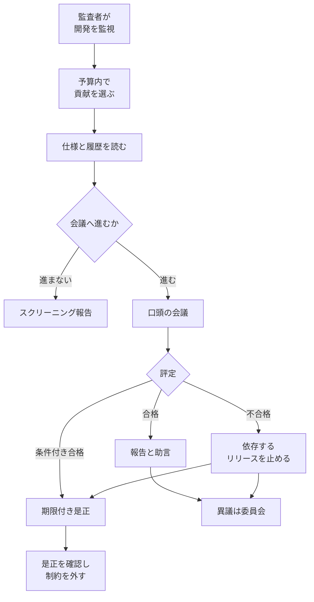

理解監査（Comprehension audits）は、自動化された AI の研究開発について、責任のある人間が貢献の中身を説明できるかを調べる開発プロセス上の保証です。提案者は Ronald J. Bodkin、Bahrad A. Sokhansanj、Gillian Hadfield で、2026年10月7日に [arXiv:2610.10064v1](https://arxiv.org/abs/2610.10064) として公開されました。公開された文書は査読前の提案であり、導入済みの規格ではありません。

この記事では、監査がどの単位を見て、会議で何を問い、不合格のときにどのリリースを止めるかを整理します。論文が置く生成割合と公開リポジトリの数値は、定義と分母を分けて示します。

*この記事の全体像。以下、順に解説します。*

## 理解監査とは

想定する実施主体は、独立監査者を内部に置くフロンティア AI ラボです。監査者は重要な貢献を選び、担当者が設計、実装の振る舞い、プロセス、結果を口頭で説明します。不合格なら、その貢献に依存するリリースを是正まで止めます。中核の本文は [arXiv HTML](https://arxiv.org/html/2610.10064v1) です。

監査の対象は成果物そのものではなく、貢献に責任を持つ人たちの集合的な理解です。貢献は目的と効果で定義します。差分の大きさや、AI が書いた割合では定義しません。例は、実験と結論、学習レシピの変更、データセットの組み込み、システムの最適化です。一つの貢献は、何百ものコミットやエージェント実行を含んでよいです。作業を指示し、結果を受け入れた人が、全体に責任を持ちます。

理解は三層です。

| 層 | 何を説明するか | 会議での扱い |
|---|---|---|
| 深い理解 | アーキテクチャと設計、実装の振る舞い、プロセス | 問う。何をなぜそう作ったか、どこで失敗するか、どの手続きで決めたか |
| 馴染み | 主要な発見と、結果の分析 | 問う。何が結果として出たか、評価と異常をどう扱ったか |
| モデル内部 | 振る舞いの根本原因 | 問わない。業界で一般的な深層学習の理解を超えるため |

説明の場では、担当者は AI で分析や回答を生成しません。画面の移動と表示は使ってよいです。監査者は準備に AI を使ってよいです。会議と評定の責任は、監査者自身の理解に置きます。

深い理解の各問いと、馴染みの各問いは、担当者の誰か一人が答えられれば足ります。評定は三つです。

- 合格。報告と、任意の助言を出す。
- 条件付き合格。期限付きで是正する。
- 不合格。重要な知識の穴が一つあるとき、または重要な部分での理解不足がパターンになっているとき。

不合格のあいだ、その貢献に依存する外部公開と、非公開の利用を止めます。繰り返しや重要システムでは、担当単位のリリース権限停止、影響したリリースの戻し、追加の安全策へ上げます。個人の懲戒や、評価への不利益は禁止する、と論文は書きます。是正を確認したら、制約を外します。異議はレビュー委員会が扱います。

会議が期限内に開かれなければ Unable to Assess とし、会議まで不合格と同じ制約を置きます。準備段階でリスクが低いと判断したときは、スクリーニング報告を出します。それだけでは不合格にしません。

付録 A は、科学的判断の誤りを理解の不合格とは分け、助言に回します。

監査件数は予算制です。論文の表 3 は、無作為かつ失敗が独立なら、失敗率 25% のとき四半期 17 件で、少なくとも 1 件を検出する確率が 99% になる、と計算します。

理解そのものの指標は、論文の中にはありません。監査者が先に見る代理は、仕様の具体性、対話の深さ、出力の点検、文書、人間のコードレビュー、の五系統です。安定した代理は理解の証明にならない、と論文は書きます。公開データで測れたのは、このうちレビューだけです。他の四つは、エージェントの会話ログが要る、と論文は書きます。ラボは介入率を公開していますが、それは理解と、出力だけを見て直した回数を区別しない、とも書きます。

オープンソースの計測は、224 組織、2,135 リポジトリです。対照は 2024 年第 1 四半期、本観測は 2025 年第 4 四半期から 2026 年第 2 四半期、データ時点は 2026年9月1日です。

追跡可能な AI のプルリクエストは、2026 年第 2 四半期の提出分でプール 17.2% です。2026年6月のプールレビュー率は、非 AI が 78.8%（33,535 件）、検出された AI が 71.2%（9,697 件）です。寄与者で重みづけると 78.2% と 78.1% です。

コメント密度は、レビュー済み変更 1,000 行あたりのインラインコメントです。2024 年第 1 四半期の非 AI を 3.96 件/kLOC とすると、2026年6月は非 AI が 1.82（46%）、検出された AI が 1.44（36%）です。

fleet は、いずれかの四半期に 300 件以上マージした 42 アカウントです。AI 利用では定義していません。2026年6月のプールレビュー率は 19.8%（7,781 件）です。コメント密度は基準の 20%（0.80 件/kLOC）です。インラインコメントがある fleet のプルリクエストは 3% から 7% だけで、密度は少数に寄ります。

パイロットは、未実施の研究課題として書かれています。拘束力のある開発停止は、パイロットに含めません。事前登録する目安は、監査者間一致 90% 以上、会議設定の成功率 90% 以上などです。失敗率 10% で検出確率 90% なら、少なくとも 22 件です。監査者 2 人が約 3 か月、ラボ側の会議は論文の見積りで 132 人時、と書きます。

## 注意点

論文の到達宣言は、「フロンティア AI の保証として、責任者の理解を開発継続の事前条件にする公開された制度は、著者らの知る限り無い」です。理解という発想自体が法令に無い、という意味ではありません。

既存の制度は、口頭の監査ゲートそのものではありません。

- EU AI Act 第14条は、高リスク AI を、使用期間中に自然人が監督できるよう設計することを求めます。監督担当者は、能力と限界を理解し、動作を監視し、出力を解釈し、使わない判断や停止ができること、まで書きます。対象は高リスクシステムの利用中の監督です。研究開発の貢献を口頭で説明できないときに開発を止めるゲートではありません（[Regulation (EU) 2024/1689](https://eur-lex.europa.eu/legal-content/EN/TXT/HTML/?uri=CELEX:32024R1689)）。
- [IDAIS-Beijing](https://idais.ai/dialogue/idais-beijing/)（2024年3月10日から11日）は、「明示的な人間の承認と支援なしに、AI が自分を複製または改善できるようにすべきではない」と書きます。理解の実演や、監査の合格までは書いていません。論文はこの文を、理解のない承認は無意味だ、と読みます。共著者の Hadfield は、同声明の署名者です。
- [10 CFR 55.45](https://www.ecfr.gov/current/title-10/chapter-I/part-55/subpart-E/section-55.45) は、原子炉の運転員志望者に、代表的な操作について理解と実演を求めます。未知の研究貢献ごとに開発を止める規則ではありません。eCFR の表示は 2026年10月7日時点です。
- ISO/IEC 42001:2023 は、AI マネジメントシステムの要求事項です。寄与ごとの口頭停止が公開説明にあるかは、有料本文を読んでいないので確認できていません。論文は、認証は管理プロセスの有無を見て、スタッフの理解は扱わない、と書きます。力量条項が口頭の理解まで要求するかも、本文は未確認です。
- 米国 OCC のモデルリスクガイダンス改訂（[News Release 2026-29](https://occ.gov/news-issuances/news-releases/2026/nr-occ-2026-29.html)、2026年4月17日）は、生成 AI と agentic AI を適用範囲外とします。強制基準でもない、とリリース自身が書きます。
- 2026年10月9日の検索範囲では、日本語の法令、公的ガイドライン、規格解説が、この口頭監査を標準として紹介している記録は見つかりませんでした。網羅ではありません。

「新規コードの 75% 以上が AI」は、三つの異なる自己申告を束ねた論文の文です。一括の割合としては使いません。

- Anthropic Institute は、2026年5月時点で、コードベースへマージしたコードの 80% 超の著者が Claude だ、と書きます。同じ頁の脚注は、経営陣の公の見積りはスクリプト等を含めて 90% 以上であり、80% 超は本番へマージされた行のうち、帰属パイプラインが Claude に付けた割合だ、と区別します（[When AI builds itself](https://www.anthropic.com/institute/recursive-self-improvement)）。
- Google の Cloud Next 2026 キーノート頁は、「今日、Google の新規コードの 75% は AI が生成し、エンジニアが承認する。昨秋は 50% だった」と書きます。測定手順は、その頁にありません（[Cloud Next 2026](https://blog.google/innovation-and-ai/infrastructure-and-cloud/google-cloud/cloud-next-2026-sundar-pichai/)）。
- OpenAI の 80% は、論文が示す [X 投稿](https://x.com/h100envy/status/2062188070863048870)（@h100envy、2026年6月3日）の要約文が「OpenAI のコードの約 80%」と述べるものです。動画の逐語は未照合です。別報道は「あなたのコードの 20% から 80%」という句を載せます。社内の計測定義も未照合です。

Anthropic の「Claude が AI R&D の 26% を lead し、collaborates 以上は 90% 超」（2026年8月）は、[計測の頁](https://www.anthropic.com/institute/measuring-pace-of-ai-development) にあります。lead は、高水準の依頼からタスクの大部分を終端まで行い、人間が監督する、という Epoch AI の段階です。理解の試験ではありません。判定モデルと担当人間の完全一致は 59%、一段以内は 97%、人間同士の完全一致は 35%、と付録に書きます。

オープンソースの 17.2% は、検出の下限です。ラボの 75% や 80% と同じ分子ではありません。形式的な人間レビューの有無は、上のプール率では大きく崩れていません。寄与者で重みづけると、非 AI と検出 AI の差は消えます。落ちているのは、人間レビュー済み変更のインラインコメント密度です。この低下は、非 AI 側でも起きています。対照の 2024 年第 1 四半期は、この検出器が一致しない期間であり、Copilot 型の補助は見えない、と付録 C が書きます。対象は公開リポジトリであり、フロンティアラボの内部開発ではありません。組織名の対応には Claude Fable 5 を使っています。fleet を、自動で研究する AI とは呼びません。

付録 B の二例は、Claude Fable が作り、著者が編集した架空例です。緑の CI とレビューの下で実装の穴が出る、という話は採点の説明であり、検出率の証拠ではありません。公開した生データの URL は、読んだ本文と付録 C にはありませんでした。

表 3 は、失敗が独立で選択が無作為なとき、不合格が 1 件以上入る確率です。失敗率 25% は測っていません。監査していない貢献は、その計算では止まりません。系統的に全員の理解が落ちるなら、独立性の仮定は脅威モデルと合いません。失敗率は未知です。25% なら 17 件、5% なら 99% 検出に 90 件です。論文は、有意な不合格が希すぎてパイロット評価が難しい可能性も書きます。パイロットが穴を見つけなくても、理解が高いのか、道具が無効なのかは区別できない、と論文自身が書きます。

代理指標のどれが口頭の不合格を予測するかは、監査を実施したあとでないと検証できません。リハーサルと、会議のための詰め込みを、口頭の流暢さから見分ける検証済みの手順は、論文にありません。禁止は監査者の裁量です。独立検証組織は、ラボの任意の受け入れに依存し、不合格を言いにくい、と論文の限界節が書きます。医療の構造化口頭試験では、得点分散のうち課題が 32%、試験官と一般誤差が 27% だった、という要旨があります（Wass ほか、Medical Education、2003、DOI 10.1046/j.1365-2923.2003.01417.x。原論文 PDF は未読です）。AI 研究開発の監査へ係数を移すことはできません。口頭点が理解そのものだけではない、という注意には使えます。

フロンティア以外のソフトウェア組織へどこまで薄めて使えるかは、論文が今後の研究課題にしています。

## 承認の回数は、理解の証拠にならない

高リスクな変更について、担当者が変更理由、失敗条件、戻し方を説明できるかを問う価値はあります。フロンティアラボが、独立監査者による拘束ゲートを今すぐ置くべきだ、という結論にはしません。

| 見ているもの | 何を数えるか | 理解との関係 | この論文での位置 |
|---|---|---|---|
| 承認 | 人が結果を受け入れた回数 | 受け入れた人が説明できるかは見ない | 理解のない承認は無意味だ、という問題設定 |
| 形式レビュー | 著者以外の人間レビューが 1 件以上あるか | 差分を読んだことまでは保証しない | 非 AI では約 8 割が維持 |
| コメント密度 | レビュー済み変更 1,000 行あたりのインラインコメント | 注意の代理。理解の測定ではない | 2024 年第 1 四半期比でおおよそ半減 |
| 口頭の理解監査 | 設計、失敗の仕方、手続きをその場で説明できるか | 提案された直接の試験 | 未実施。合格しても科学的判断の誤りは残しうる |

論文が勧める五つの代理のうち、公開データで測れたのはレビューだけです。

支えになる材料は、次の四つです。

- 論文は、承認と理解が別であることを手続きに落としています。深い理解の問いは、何をしたか、なぜそうしたか、どう失敗するか、どの判断で変えたか、に対応します。
- Anthropic の lead の定義は、人間が監督し出荷を決めることであり、コードを説明できることではありません。同じ会社が、レビューが生成速度に追いつかなければ人間が律速になる、と書いています。
- オープンソースの計測は、形式レビューが残ってもコメント密度が下がる、という分離を表で示しています。注意の代理が一様ではない、という主張の範囲では、一次の数値があります。コメント密度の低下を、口頭監査が効く証拠にはしません。
- 表 3 の件数は、独立試行で少なくとも 1 件を見つける公式と一致します。失敗率 25% で検出 99% の 17 件は、`ceil(ln(0.01)/ln(0.75))` です。

実施データが無い範囲は、次のとおりです。

- 拘束ゲートの有効性、抑止、コスト、監査者間一致は、実施データがありません。論文はパイロットを非拘束にし、義務化は成功したパイロットのあとだ、と書きます。
- 誰か一人が各側面に答えれば合格です。承認した本人が理解していたことの証明にはなりません。離職による穴は、条件付き合格の別枠です。
- 科学的判断の誤りは不合格にしません。付録 B の架空例では、影響の見積りが誤っていても、説明できれば合格です。不安全な判断を止める装置ではありません。

現場の確認項目に落とすなら、高リスクな変更に限ります。担当者が、変更理由、失敗条件、戻し方を、生成 AI に回答させずに説明できるかを見ます。これは深い理解のうち、プロセスと実装の振る舞いを、一人の担当者向けに切った問いです。独立監査、標本設計、リリース停止の一式ではありません。

フロンティアラボ向けに論文が次の一手として書くのは、非拘束のパイロットと、会話ログを使った代理指標の公開です。推奨もそこまでです。

状態を更新する条件は二つです。パイロットが論文の一致率と実行可能性を満たし、ラボの安全枠組みにゲートが書かれたら、未導入の提案という位置づけを更新します。人間の理解なしの自動研究開発を支える強い安全ケースが示されたら、論文自身が人間の監督を外してよい条件にしています。その安全ケースは、公開された資料の範囲では見つかっていません。

## まとめ

理解監査は、貢献に責任を持つ人が、設計、失敗の仕方、手続き、結果を口頭で説明できるかを調べ、できなければ依存するリリースを是正まで止める、という提案です。査読前の文書であり、導入済みの規格でも、実施済みの拘束ゲートでもありません。

承認の回数、形式レビューの有無、コメント密度は、それぞれ別のものを数えます。ラボの生成割合は出典ごとに分け、オープンソースの 17.2% や fleet のレビュー率を、ラボ内部の割合と同じ分子としては読みません。

現場で今見られるのは、高リスクな変更に限った三つの問いです。変更理由、失敗条件、戻し方を、生成 AI に答えさせずに説明できるか、です。フロンティアラボへの次の一手は、非拘束のパイロットと、会話ログに基づく代理指標の公開までです。

この記事が少しでも参考になった、あるいは改善点などがあれば、ぜひリアクションやコメント、SNSでのシェアをいただけると励みになります！

## 参考リンク

- Bodkin, R. J., Sokhansanj, B. A., and Hadfield, G. arXiv:2610.10064v1. 2026-10-07. https://arxiv.org/abs/2610.10064
- 同論文の HTML. https://arxiv.org/html/2610.10064v1
- Anthropic Institute. When AI builds itself. https://www.anthropic.com/institute/recursive-self-improvement
- Anthropic Institute. Measurements for understanding the pace of AI development inside frontier labs. https://www.anthropic.com/institute/measuring-pace-of-ai-development
- Pichai, S. Cloud Next 2026 keynote page. https://blog.google/innovation-and-ai/infrastructure-and-cloud/google-cloud/cloud-next-2026-sundar-pichai/
- International Dialogues on AI Safety. IDAIS-Beijing, 2024. https://idais.ai/dialogue/idais-beijing/
- Regulation (EU) 2024/1689, Article 14. https://eur-lex.europa.eu/legal-content/EN/TXT/HTML/?uri=CELEX:32024R1689
- 10 CFR 55.45. https://www.ecfr.gov/current/title-10/chapter-I/part-55/subpart-E/section-55.45
- OCC News Release 2026-29. 2026-04-17. https://occ.gov/news-issuances/news-releases/2026/nr-occ-2026-29.html
- h100envy. X post. 2026-06-03. https://x.com/h100envy/status/2062188070863048870
