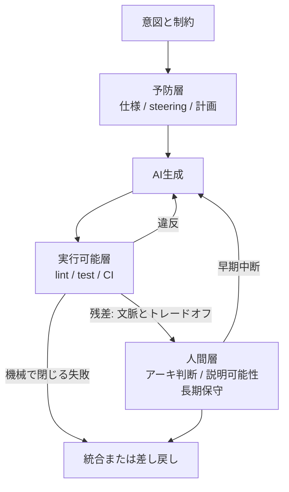

コーディングエージェントに実装を任せると、書く時間は確かに短くなります。そのぶん、出てきたコードを誰がどう見るのか、という問題が前に出てきます。

素直な対処は「レビューを厚くする」です。レビュアーを増やす、承認を 2 人にする、チェックリストを長くする。ところが現場の証言では、この方向は生成の速さに追いつきません。

Stolze と Strässle の論文 [When Review Alone No Longer Scales](https://arxiv.org/abs/2608.26316) (arXiv:2608.26316v1、2026-08-26) は、実務者インタビューと alumni 調査から、監督を 1 つの工程に載せずに **予防層・実行可能層・人間層** の三層へ配る形を記述しています。ESEIW 2026 の ESEM SEIP トラックに採録されています。

この記事では、次の 3 点を整理します。

- なぜ「レビューを増やす」が構造的に効きにくいのか
- 三層監督とは何を分けているのか、失敗の種類とどう対応するのか
- この主張はどこまで実証されていて、どこから先は仮説なのか

先に結論を書くと、**持ち帰る価値があるのは「レビュー工程を増やす」ではなく「失敗の種類ごとに置き場所を変える」という切り分け**です。ただし論文のインタビューは n=5 の仮説生成であり、三層が有効だと定量的に示した研究ではありません。この線引きも含めて見ていきます。

*この記事の全体像。以下、順に解説します。*

## レビューを厚くしても追いつかない構造

論文の出発点は単純です。実装のコストが下がると、品質保証のボトルネックは「書くこと」から「監督すること」へ移ります。

参加者 P1 (小規模チームの Architect/CTO) は、one-shot で生成した実装を手でレビューすると、生成にかかる時間の **3〜4 倍** かかると述べています。これは AI 導入の前後を比べた数字ではなく、同じワークフローの中で「生成」と「レビュー」を比べた比である点に注意してください。それでも、生成側だけが安くなったときに何が詰まるかは示しています。

同じ P1 は、自分の時間の 3 分の 2 が仕様の精緻化に入るとも述べています。入力が曖昧なとき、LLM は「その要求は矛盾しています」と押し返してはくれません。弱い入力は、そのまま弱い出力になって返ってきます。

産業側の観測もこの向きと整合します。

- [DORA 2025 State of AI-assisted Software Development](https://cloud.google.com/blog/products/ai-machine-learning/announcing-the-2025-dora-report) は、約 5,000 名の技術専門職の回答者のうち 90% が仕事で AI を使っていると報告しています。同時に、AI 採用と throughput は正の関係、**delivery stability とは負の関係** が続いていると書いています。回答者の 30% は生成されたコードをほとんど、あるいは全く信頼していません。
- DORA は「強い自動テスト、成熟したバージョン管理、速いフィードバックが無いまま変更量だけ増えると不安定になる」とも書いています。
- Liu らの [Debt Behind the AI Boom](https://arxiv.org/abs/2603.28592) (arXiv:2603.28592v2) は、6,299 リポジトリの検証済み AI コミット約 30.3 万件を静的解析し、同定して追跡した品質問題の **22.7% が最新版にも残っている** と報告しています。その 89.3% はコードスメルです。

ただし注意点として、DORA も Liu らも「レビュー増員」と「三層監督」を直接比較した研究ではありません。示しているのは、生成量が増えたときに機械で閉じられる欠陥が残りやすい、という状況証拠までです。

## 三層監督は何を分けているのか

三層は成熟度の階段ではありません。**役割の分担** です。

- **予防層** — 生成の前に、許される軌道を狭める。仕様、steering ファイル、事前の計画。
- **実行可能層** — 生成の経路に関係なく、出力を機械で検査する。lint、テスト、CI、Policy-as-Code。
- **人間層** — 形式化できないトレードオフと長期保守を解釈する。アーキテクチャ判断、説明可能性、回復時間の要件。

層を分ける実益は、境界の性質が違うところにあります。

| | 予防層 | 実行可能層 |
|---|---|---|
| 効き方 | 参照されなければ効かない | 参照の有無と独立に走る |
| 失敗時 | 静かに無視される | 落ちる |
| 適した内容 | 意図、文脈、非標準の規約 | 機械判定できる規則 |

実務では同じ規約を steering ファイルと lint の両方に書くことが多い、と論文は観察しています。二重管理に見えますが、片方は「案内」、片方は「強制」なので役割が違います。

新しさは lint や CI の発明ではありません。**スループット圧力の下で、既存機構の相対的な重さと時間配置が変わる** という点です。

## 失敗の種類ごとに置き場所を決める

三層を実際に使うときの中身は「どの失敗をどこで受けるか」です。論文の観察をもとに割り当てを整理すると、次のようになります。

| 失敗の種類 | 主に置く層 | 理由 |
|---|---|---|
| 繰り返し出る規約違反、重複、依存の誤用 | 実行可能層 | 人が毎回見るコストが生成速度に負ける |
| 仕様の曖昧さ、権威ある指針の不在 | 予防層 | 弱い入力を LLM は押し返さない |
| 見た目は正しいが意図が辿れない | 人間層 + 可視化 | 振る舞いのテストだけでは局所的な正しさが残る |
| アーキテクチャのトレードオフ、回復時間要件 | 人間層 | 参加者も自動検査は不能と述べている |
| 数か月かけて溜まる構造ドリフト | 実行可能層の拡充 + 人間の早期中断 | レビュー不足のまま生成が積み上がった事例がある |

### false correctness

論文が導入した用語に false correctness があります。構文は通り、テストも通り、局所的には一貫しているのに、**なぜそこに置かれているのかが辿れない** 状態です。P2、P4、P5 が別々に語っています。P5 の表現は次のとおりです。

> functionally correct, but nobody understands why

これは実行可能層では捕まりません。振る舞いのテストが検査しているのは局所的な正しさだからです。だから人間層に残る、という配置になります。

なお、false correctness の発生率を測ったデータはありません。著者が現場の語りから名付けた概念であり、頻度は未知です。

### 繰り返す指摘は lint へ上げる

P4 は「同じ指摘を繰り返しているなら lint に上げる」という立場を述べています。一方 P5 は自動規約をあえて緩めない選択をしています。どちらが正解というより、**チームがどこまでを機械に固定できるか** の差です。

### fire-and-forget を拒否する

参加者は、生成を投げっぱなしにせず、**生成中の早期中断** と **運用的な説明可能性** (必要になったときに診断できること) へ重心を移していました。この閾値はシステムによって違います。UX の試作と DB 移行を同じ厳しさで見る必要はありません。

## どこまで確かめられているか

ここが一番大事な部分です。三層監督は魅力的な整理ですが、**有効性を定量的に示した研究ではありません**。

### 論文自体の限界

- 方法は探索的な定性インタビューで、参加者は 5 名 (P1: Architect/CTO 〜 P5: Senior UI) です。著者は推論統計に使わないと明記しています。
- 調査は 2025 年 11〜12 月、機関の alumni への convenience sample です。招待約 100 名、完了 50 名。分析は第一著者の単一コーダです。
- 調査側の実践は少数派です。**steering ファイル利用は 13/50、構造化プロンプトは 6/50**。つまり「業界が既に三層へ移行した」とは言えません。
- 一方で、リスク認識は共通しています。品質リスクが 43/50、長期保守が 40/50 で最多。AI ツール統治は明確なガイドラインが 24/50 に対し、非公式または監視なしが 23/50 と拮抗しています。
- 補遺 (38 の引用、6 カテゴリの codebook、調査票) は [Zenodo](https://zenodo.org/records/21611622) に公開されています。全文の転写は機密のため非公開です。

### 周辺研究が否定していること

三層のうち **予防層まわりは、むしろ効果への反証が積み上がっています**。

- Gloaguen らの [Evaluating AGENTS.md](https://arxiv.org/abs/2602.11988) (arXiv:2602.11988v2) は、リポジトリ文脈ファイルがタスク成功率を一般には上げず、**推論コストを平均 20% 超増やす** と報告しています。測定対象は成功率であって欠陥率ではありませんが、「置けば良くなる」という前提は支えません。非標準の規約を指定する用途には使えます。
- McMillan の [Instruction Adherence in Coding Agent Configuration Files](https://arxiv.org/abs/2605.10039) (arXiv:2605.10039) は、Claude Code の 1,650 セッション (関数観察 16,050) を分析し、設定ファイルの**長さ・位置・分割・隣接する矛盾のいずれも遵守率に検出可能な差を出さなかった** としています。サイズと矛盾については帰無仮説が Bayes factor で支持され、位置と分割は棄却に失敗した (＝差が無いと示したわけではない) という区別があります。テストしたセッション長の範囲では、生成が進むほど遵守のオッズが下がる関連が見られました (OR=0.944、約 5.6%)。ただし関係は非単調で、分析中に見つかった探索的な所見です。
- Hill の Spec-Driven Development 研究 (ESEM 2026 SEIP 採録) では、ベンダーが主張する欠陥減少は確認したいずれの版でも支持されていません。一部の版では、同一著者内で欠陥率の**上昇**が有意です。ただし仕様成果物の操作化が広く (issue リンクや PR 内の要件を含む)、複雑さの代理変数と読むほうが妥当です。

つまり、**「AGENTS.md を厚く書く」は予防層の実装として弱い** ことが複数方向から示されています。これらはいずれも steering ファイル自体の欠陥率を直接測ったものではない、という留保も必要です。

### 「AI コードは保守できない」も支持されない

逆方向の極論も測定範囲では支持されません。

Borg らの [Echoes of AI](https://doi.org/10.1007/s10664-026-10889-1) (EMSE 2026, 31:161、全体 n=151、95% がプロ) は、後続の進化を比較した Phase 2 の RCT (n=75) で **保守性の有意差を検出していません**。著者自身が、小〜中程度の効果に対して検出力が不足していると書いています。非有意は同等性の証明ではありません。Phase 1 では完了時間の中央値が 30.7% 減でした。

制御されたタスクと、数か月かけて劣化が蓄積する現場は対象が違います。どちらの結果も、そのまま他方へは持っていけません。

### 人間層の供給という論点

Anthropic の RCT ([How AI assistance impacts the formation of coding skills](https://www.anthropic.com/research/AI-assistance-coding-skills)、2026-01-29、n=52) では、未知のライブラリを扱った直後の理解を測るクイズで、手書き群 67% に対し AI 群が 50% でした (d=0.738, p=0.01)。最大の差はデバッグです。

公式ブログは対象を mostly junior と書いていますが、論文の Table 1 では経験 7 年超が 29/52、1〜3 年は 4/52 です。クイズの差は全経験帯で control 側が高く出ています。測定しているのは学習直後の理解であり、長期の技能形成や組織としての監督能力は未検証です。

それでも、**人間層の担い手をどこから供給するか** は設計対象になります。生成を委任したまま監督人数だけ増やす構成は、監督人材の再生産という点で risk を抱えます。

### まだ答えが無い問い

- 三層監督とレビュー増強を、欠陥率や変更失敗率で直接比較した RCT は見当たりません。
- false correctness の発生率のデータはありません。
- 実行可能層を過剰に敷いたとき、人間の注意が鈍るかどうかは、参加者の懸念はあっても効果量がありません。

## 明日から手を付けられること

以上を踏まえると、実務での順序は次になります。

1. **レビュー枠の追加を第一手段にしない。** 反復する指摘の自動化余地を先に測ります。
2. **繰り返す指摘は実行可能検査へ移す。** 人が残すのはトレードオフ、説明可能性、回復要件だけにします。
3. **予防層は「ファイルを置くこと」と同一視しない。** 実行可能層と対になる規約だけを機械可読にします。包括的なリポジトリ解説の効果は根拠が弱いことが分かっています。
4. **人間層の供給を設計する。** 経験年数で線を引かず、デバッグができる人がどこから育つかを構成に織り込みます。
5. **レガシーと新規基盤を同じレシピにしない。** P1 は自チームを「低レガシーで均質」と限定し、育ったレガシーには同じ仕組みは移らないと述べています。この条件を採用判定の逆転条件として明示しておきます。

具体的な最初の 3 手は次のとおりです。

1. 直近 30 日のレビュー指摘を、規約化できるものと判断が残るものに分ける。
2. 規約化できるものは CI で落とす。steering ファイルには同じ規則への短い参照だけを置く。
3. クリティカルパス (データ移行、認証、課金) は行単位の理解を残し、試作は運用的説明可能性で足りる、と閾値を明文化する。

なお、実行可能ガバナンスの導入実態については Foalem らの [An Empirical Study of Policy-as-Code Adoption](https://arxiv.org/abs/2601.05555) (arXiv:2601.05555) が 399 リポジトリの観察を報告しています。こちらは導入実態の記述であって、品質や監督コストへの効果検証ではありません。

## まとめ

- 実装が安くなると、ボトルネックは監督へ移ります。レビューを厚くする方向は、生成の速さに対して構造的に不利です。
- 三層監督 (予防・実行可能・人間) は成熟度ではなく役割分担です。予防層は参照されないと効かず、実行可能層は経路と独立に走ります。
- 実務で先に効くのは実行可能層です。繰り返す指摘を機械へ移し、人はトレードオフ・説明可能性・回復要件に集中します。
- 予防層を「AGENTS.md を厚く書くこと」と同一視するのは、複数の研究から支持されません。成功率は上がらず、推論コストは増えます。
- 元になったインタビューは n=5 の仮説生成です。三層の有効性を定量比較した研究はまだありません。整理の枠として使い、効果の証明としては使わないのが妥当です。

この記事が少しでも参考になった、あるいは改善点などがあれば、ぜひリアクションやコメント、SNSでのシェアをいただけると励みになります！

## 参考リンク

- [When Review Alone No Longer Scales: Layered Supervision in AI-Assisted Software Engineering](https://arxiv.org/abs/2608.26316) — Markus Stolze, Mirco Strässle. arXiv:2608.26316v1, 2026-08-26 ([HTML 版](https://arxiv.org/html/2608.26316v1))
- [ESEIW 2026 ESEM SEIP Track Accepted Papers](https://conf.researchr.org/track/eseiw-2026/eseiw-2026-esem---seip-track)
- [Supplementary materials (Zenodo)](https://zenodo.org/records/21611622) — 2026-07-26, 10.5281/zenodo.21611622
- [2025 State of AI-assisted Software Development (DORA / Google Cloud Blog)](https://cloud.google.com/blog/products/ai-machine-learning/announcing-the-2025-dora-report) — [Keyword 版](https://blog.google/innovation-and-ai/technology/developers-tools/dora-report-2025/)
- [Debt Behind the AI Boom](https://arxiv.org/abs/2603.28592) — Yue Liu et al. arXiv:2603.28592v2, 2026-04-26
- [Echoes of AI](https://doi.org/10.1007/s10664-026-10889-1) — Markus Borg et al. Empirical Software Engineering 31:161, 2026 ([プレプリント](https://arxiv.org/abs/2507.00788))
- [An Empirical Study of Policy-as-Code Adoption](https://arxiv.org/abs/2601.05555) — Patrick Loic Foalem et al. arXiv:2601.05555, 2026-01-09
- [Evaluating AGENTS.md](https://arxiv.org/abs/2602.11988) — Thibaud Gloaguen et al. arXiv:2602.11988v2, 2026-06-23
- [Instruction Adherence in Coding Agent Configuration Files](https://arxiv.org/abs/2605.10039) — Damon McMillan. arXiv:2605.10039, 2026-05-11
- [How AI assistance impacts the formation of coding skills](https://www.anthropic.com/research/AI-assistance-coding-skills) — Judy Hanwen Shen, Alex Tamkin. Anthropic, 2026-01-29 ([論文: arXiv:2601.20245](https://arxiv.org/abs/2601.20245))
- Does Spec-Driven Development Reduce Defects? — Brenn Hill. ESEM 2026 SEIP 採録。SSRN abstract_id=6515898
