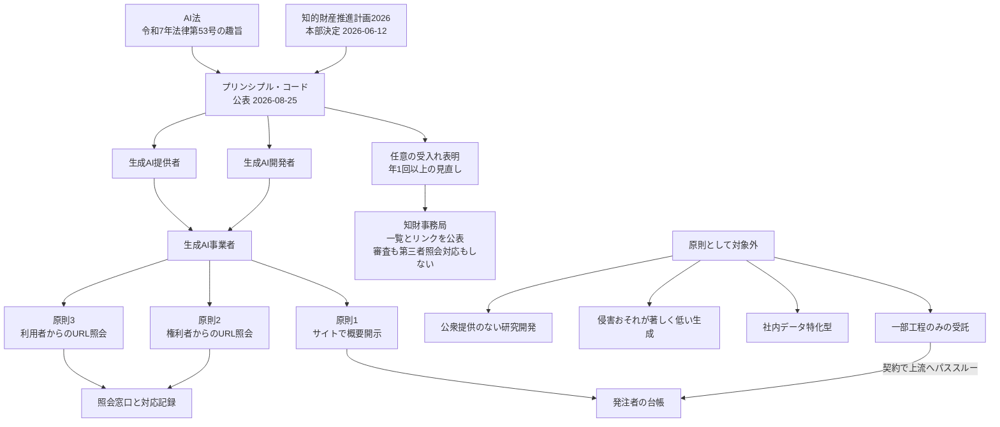
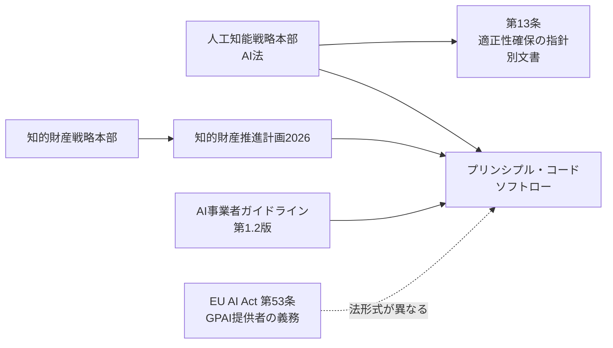

2026年8月25日、内閣府知的財産戦略推進事務局が「生成AIの適切な利活用等に向けた知的財産の保護及び透明性に関するプリンシプル・コード」を公表しました。

この記事は、生成AIを**発注する側**、つまり調達・法務・情報システムの担当者と経営層に向けて書いています。読み終えると次の3点が判断できます。

- このコードが自社の委託先に適用されるのか、されないのか
- コードが開示させる情報と、開示させない情報の境界はどこか
- 契約書と調達要件に、何を自分で書き足す必要があるか

結論を先に置きます。**このコードは調達の合格証にはなりません**。使えるのは「開示項目のリスト」としてであり、「準拠しています」というラベルとしてではありません。

*この記事の全体像。以下、順に解説します。*

## 何が公表されたのか

公式ページから確定できる事実を整理します。

| 項目 | 確定できること |
|---|---|
| 文書名 | 生成AIの適切な利活用等に向けた知的財産の保護及び透明性に関するプリンシプル・コード |
| 所管 | 内閣府知的財産戦略推進事務局。検討体は AI時代の知的財産権検討会 |
| 公表 | 知的財産戦略本部サイト、令和8年8月25日「公表しました」 |
| 上位の決定 | 知的財産推進計画2026（2026年6月12日、知的財産戦略本部決定）が仮称コードを「制定する」と記載 |
| 拘束力 | 「法的拘束力を有する規範ではない」 |
| 手法 | 原則を実施するか、実施しない場合はその理由を説明する（コンプライ・オア・エクスプレイン） |
| 開示の限界 | 営業秘密および安全性・セキュリティに関する機微情報の強制開示は求めない |
| 届出 | 受入れ表明・各原則の実施事項・不実施理由をサイトで公表し所定様式で届出。**開始時期は別途告知** |
| 英語版 | 仮訳であり、内容に責任を負わないと明記。正式版は日本語 |

手法のモデルはコーポレートガバナンスのスチュワードシップ・コードです。守れないなら守れない理由を説明すればよい、という構造になっています。

報道各社は「政府が正式決定」「罰則規定なし」「今秋にも適用」と伝えました。ただし公式HTMLで確認できるのは「公表」という文言と「法的拘束力を有する規範ではない」という記述までで、適用開始日は未告知のままです。**入札条件に「届出済みであること」を今書くと、誰も満たせない条件になります。**

なお、受入れを表明した後で利用規約によって開示を実質的に無効化する場合には、別途エクスプレインが必要とされています。「規約でオーバーライドしている」と示すだけでは説明として足りません。

## 誰が名宛人になるのか

発注者にとって最初の分岐は「委託先がそもそもこのコードの名宛人か」です。ここを外すと、存在しない義務を前提に契約を書くことになります。

図の読み方は次のとおりです。原則がかかるのは開示すべきデータを実際に持っている開発者と、それを公衆へ届けている提供者だけです。システムインテグレーターや社内特化型の開発は原則として外れます。したがって**発注者が欲しいただし書きは、コードではなく契約に書くことになります**。事務局が公表する届出一覧は、検証装置ではありません。

### 対象に入る人

- **生成AI開発者**: 生成AIシステムを構築し、公衆（不特定または特定多数）に実質的に提供した者。目的や法人・個人の別を問いません。
- **生成AI提供者**: 生成AIシステムをアプリ・製品・既存システム・業務プロセス等に組み込んだサービスを、公衆に提供した者。
- **国外事業者**: 日本に本店や主たる事務所がなくても、日本に向けて提供されている場合（日本国民が利用できる場合を含む）は適用を受けます。
- **業界特化サービス**: 特定業界向けであっても、データ提供者等の限られた範囲のみへの提供でなければ対象になり得ます。

### 対象から外れる人

- **一部工程のみの受託者**: 開発者から委託されてモデル開発・データ収集・前処理・学習・検証などの一部だけを担い納入する者、および検証・システム連携・運用サポートの一部だけを担う者は、原則として含まれません。ただし実質的に公衆へ提供したと評価できる場合は入ります。
- **公衆提供のない研究開発のみの者**: 生成AI事業者に該当しません。
- **社内・グループ内データの特化型**: 一法人または個人の保有データのみで特化し、当該データ提供者またはその指定した限られた範囲のみに提供する場合は、開発者にも提供者にも含まれません（提供元の利用許諾がある場合に限ります）。
- **侵害のおそれが著しく低いもの**: 既存著作物の創作的表現を直接感得できない生成や、意思決定に資する統計・推論結果にとどまる生成は該当しません。

### 汎用モデルに業界向けの付加をした場合

ここが実務で最も紛れます。汎用モデルをライセンスして業界向けに機能を付加した場合、**遵守が求められるのは付加した部分に限定されます**。基盤側については、上流事業者が各原則を守ることを「想定する」という建て付けです。

一方で、自前の基盤モデルを業界向けに提供している場合は、除外規定に当たらない限り原則全体の対象になり得ます。

つまり、委託先が「うちは付加しているだけです」と言った瞬間に、**説明責任の本体は上流の開発者へ移ります**。その上流が受入れを表明していなければ、開示は連鎖の途中で途切れます。

## 3つの原則が何を説明させるのか

### 原則1: 自社サイトでの概要開示

すべての対象事業者が、閲覧可能なサイトで概要を公開します。出せない項目は、理由を示してエクスプレインします。

透明性に関する開示項目は次のとおりです。

| 分類 | 開示する概要 |
|---|---|
| 使用モデル | 名称（識別子・バージョン等）、公開日を含む来歴（過去バージョン・修正履歴等）、アーキテクチャと設計仕様（第三者ライセンスの状況、必要なハード／ソフト等）、利用規定（想定用途と禁止用途）、トレーニングプロセスの内容 |
| 学習データ | 学習・検証等に用いたデータの種類（RAG用を含む）、ウェブクロール・第三者非公開データセット・公開データセット・その他収集・合成データの利用有無と目的、クローラの情報（目的、収集期間、名称・識別子、第三者クローラの有無と名称） |
| アカウンタビリティ | 開発・提供・利用中の意思決定を、技術的に可能かつ合理的な範囲で追跡できる状態（トレーサビリティ、責任者、責任分配、ステークホルダー対応、文書化等） |

知的財産権保護については、対応状況として次を開示します。

- 知財保護の原則を策定し、責任体制を明確化し、年1回以上見直して要旨を外部公表する
- 開発・学習等を含め、他者の知的財産権を侵害しない
- ペイウォールや `robots.txt` 等の機械可読な指示に従うクローラを用い、ユーザーエージェントごとの措置を公開し、変更時は通知する
- 学習ログを一定期間保持する
- いわゆる海賊版サイト等へのクロールを回避する
- 知財侵害生成物を防ぐ技術的措置を可能な限り講ずる
- 電子透かしや C2PA 等の出所・来歴証明を可能な限り講ずる
- 生成物が他者の知財を侵害すると考えられる場合は利用すべきでない旨を、利用者へ周知する
- 権利者救済の窓口を整備し、申出要件を可能な限り明確化し、対応記録を保存する

ログ保持の脚注は、AI事業者ガイドライン第1.2版の検証可能性（ログの記録・保存。記録方法・頻度・保存期間は技術特性と用途を踏まえて検討する）を引いています。**保存期間の数値はガイドライン側でも「検討する」であり、コードも「一定期間」に止まります。** 期間を確定させたいなら契約で書くしかありません。

事務局が別に公表している「概要開示対象事項 具体例」を見ると、期待される粒度が分かります。バージョン番号、リリース日、Transformer といったアーキテクチャ名、第三者ライセンス契約の有無（名称は秘密保持を理由にエクスプレイン可）、クローラ名と収集開始日、CAIO のような責任者、著作権窓口のURLといった記入例です。**データセットを著作物単位で列挙する例は示されていません。**

原則1の細則は、一部を非開示にした一事をもって直ちに批判することは慎むべきだとしています。国際的な学習データ透明性との整合は「今後」「期待される」という書き方です。

### 原則2: 権利者からの開示要求

対象となる創作物は、映画、音楽、演劇、文芸、写真、漫画、アニメーション、コンピュータゲーム等と、それを電子計算機経由で提供するプログラムです。

開示を求められるのは、**自らの権利または法律上保護される利益の実現のため、訴訟・調停・ADR その他の法的手続を現に行い、または準備している者**（およびその弁護士等）に限られます。

開示される事項は次の2点です。

1. 学習・検証等に用いたデータに、照会するURL等（事業者が容易にアクセス・確認可能なものに限る。以下「対照情報」）が含まれているか否か
2. 提供者が答えられないときは、搭載モデルを開発した者の名称

求める側は、開示要求者である理由、回答の利用目的の明示と目的外不使用の誓約、対照情報と開示を求める事由の特定を満たす必要があります。

ここで境界を正確に把握してください。**答えが返るのは「そのURLが学習データに入っていたか」までです。** 作品そのものがクロール対象だったかという問いは、脚注で対照情報の範囲を超える照会として想定外とされています。

細則では、信じるに足りる理由の疎明が求められ、営業秘密に関わる場合でもまずは真摯に検討・協議するとされています。対応方針の事前公表が望ましいとも書かれています。濫用防止として相当期間内の回数制限や手数料はあり得るものの、萎縮させる水準は避けるとされます。回答期限を定める規定はありません。「体制が未構築である」と述べるだけではエクスプレインとして不足で、完了時期の説明が要ります。技術的に不可能であると根拠を示せば、エクスプレイン済みとして扱われます。コード外の手段としては、民事訴訟法163条（当事者照会）と221条（文書提出命令）が挙げられています。

### 原則3: 生成物の利用者からの開示要求

生成AIで上記類型のコンテンツを生成した人が、生成物と同一または類似するコンテンツが掲載されたURL等が学習データに含まれるかを問える仕組みです。提供者が答えられないときは開発者名が返ります。

求める側は、生成物とプロンプトの提示、利用目的の明示、目的外に使わないことに加えて、**訴訟・調停・ADR の申立て目的では使わない誓約**が必要です。

この誓約が実務上の鍵です。原則3で得た回答は、紛争の入口としては使えません。類似コンテンツ自体がクロール対象だったかも、原則2と同様に想定外とされています。期限・手数料・技術的不能を理由とするエクスプレインの扱いは原則2と同型です。

## 隣接制度の中での位置

このコードだけを見ていると、AI法や EU AI Act との関係を取り違えます。

- **AI法第3条第4項**: 不正または不適切な実施が著作権侵害等を助長し得ることに鑑み、研究開発・活用の過程の透明性その他の必要な施策を講じなければならないと定めます。名宛人は主に施策側です。コードが「AI法の趣旨を踏まえる」と書くとき、引用しているのは法律全体の趣旨であって、特定の条番号ではありません。
- **AI法第13条**: 国は国際規範の趣旨に即した指針の整備その他を講ずるとします。**このコードは第13条の指針そのものとは名乗っていません。**
- **AI事業者ガイドライン第1.2版**（令和8年3月31日）: 共通の指針「透明性」の検証可能性として、ログの記録・保存を求めます。コードの学習ログ保持はここに接続します。
- **EU AI Act 第53条**: 汎用AIモデル（GPAI）の提供者に対して、技術文書の作成、下流事業者への情報提供、EU著作権法（DSM指令4条3項の権利留保）の遵守方針、学習コンテンツの十分に詳細なサマリの公表を "shall" で課します。任意の受入れ・概要開示・エクスプレイン可という日本のコードとは、**法形式が異なります**。検討会に提出された共同意見でも、原則2・3に相当する規定は EU には無いと指摘されています。

したがって、**日本のコード準拠を確認しても、EU向け提供の要件は満たせません**。欧州提供がある調達では別レーンが要ります。

## このコードで担保されないこと

コードを調達の合格証にできない理由を、具体的に挙げます。

- **事務局は届出を審査しません。** 第三者からの照会にも回答しません。公表される一覧は、検証を経たリストではありません。
- **権利者側の団体は、それぞれ別の不足を指摘しています。** 日本新聞協会は罰則がなければ順守が不透明であるとし、改善がなければ法制化とデータセットの特定が必要だとしています。出版3団体は商業目的での事前許諾と EU 型のオプトアウトを求めています。日本レコード協会と IFPI は義務付けと楽曲単位の開示粒度を求めています。民放連は海外事業者に遵守させるための公表や罰則を求めています。
- **事業者側からも逆向きの警戒があります。** JIPA はソフトローの事実上の強制化を警戒し、原則2・3については訴訟準備段階の事業者に不利な情報を出すインセンティブが乏しいと指摘しています。新経済連盟は、URLが学習データに含まれるかの回答自体が収集ノウハウであり、一律の回答義務は営業秘密の流出に当たると見ています。
- **開示の粒度が権利者の関心とずれています。** 原則2はURLの有無に閉じ、作品単位の学習有無は想定外です。原則3の回答は誓約によって訴訟利用が封じられます。
- **委託構造で開示が縮退します。** 汎用モデルへの業界付加は付加部分のみが対象で、上流がエクスプレインを選べば、下流の台帳に残るのは開発者名だけになります。

要するに、コードは**説明できる状態を作らせる仕組み**であって、**説明の内容を保証する仕組みではありません**。

## 発注者が持つべき台帳

そこで、コードが対象外とする相手に対しても、同じ項目を契約で要求します。対象外だから要求できないのではありません。**対象外だからコードは助けてくれず、契約だけが残ります。**

| 欄 | 取るもの | コード上の対応 | 空になりやすい条件 |
|---|---|---|---|
| 役割 | 開発者／提供者／一部工程の受託／社内特化／業界付加 | 対象範囲の規定 | 相手が「対象外」と自己宣言する |
| 受入れ | 受入れ表明の有無、届出の有無、実施・不実施の一覧 | 届出の規定 | 届出開始前。エクスプレインのみ |
| モデル | 名称、識別子、バージョン、公開日、修正履歴 | 原則1 使用モデル | 上流APIでバージョンが流れる |
| ライセンス | 第三者契約の有無と範囲、名称を出せない理由 | 原則1 設計仕様 | 秘密保持 |
| 学習データ | 種類、クロール有無、公開／非公開／合成の別、取得源の種別 | 原則1 学習データ | データセット名まで降りない |
| クローラ | 名称、収集期間、第三者クローラ、`robots.txt` とペイウォール方針、UA別の公開URL | 原則1 クローラと知財措置 | 第三者クローラ名の非開示 |
| 来歴技術 | C2PA や電子透かしの有無と限界 | 原則1 知財措置 | 「可能な限り」 |
| 責任 | 責任者、年次見直し、窓口URL、対応記録の保存方針 | 原則1 アカウンタビリティ | 名目上の窓口 |
| 照会 | 原則2・3の対応方針、手数料と回数、完了予定日、回答不能時の開発者名 | 原則2・3 細則 | 技術的不能のエクスプレイン |
| 上流 | 基盤モデル事業者名、その原則1ページ、パススルー義務 | 業界付加の規定 | 上流が受入れ非表明 |

契約に書いておくことは次の5点です。

1. **相手のコード上の役割を自己申告させる。** 対象外を主張するなら、その根拠（一部工程のみ、社内特化、侵害のおそれが著しく低い）を書かせます。
2. **対象外でも原則1相当の項目を成果物にする。** 出せない欄は「実施しない理由」と代替コントロール（上流の公開ページ、契約上の再委託開示）をセットで求めます。
3. **提供者が学習データを把握していない場合**、開発者の名称に加えて、開発者の原則1ページのURLまたは同等の開示を再委託の条件にします。
4. **権利者照会は原則2の入口を待たない。** 原則2は法的手続の準備段階に入って初めて使えるため、発注者自身の窓口とエスカレーション経路を別に置きます。原則3の回答を訴訟に使えない点は、利用規約と社内規程で先に決めておきます。
5. **EU または GPAI の下流になる調達では別レーンを引く。** 学習コンテンツの要約、権利留保の遵守方針、下流向け情報パックを、日本のコード項目とは別に取得します。

繰り返しますが、政府の届出一覧を「監査済み」と読まないでください。

## まだ決まっていないこと

判断を保留すべき点を明示します。

- **届出の開始日**。公式には未定です。報道の「今秋」は報道各社の表現です。
- **海外の大手事業者が実際に受入れるか**。制度が動き出す前であり、受入れ実績はまだありません。
- **原則2の「準備している」の広さ**。新聞協会は検討段階まで含めるよう求めましたが、コードは「信じるに足りる理由」の疎明に止めています。
- **「侵害のおそれが著しく低い」の運用境界**。例示はありますが、線引きは運用に委ねられています。

コード本文は改定の余地を自ら残しています。事業者の対応状況、運用の実効性、国際動向を勘案し、必要なら文書の改定を含む対応を行うとされています。したがって**罰則付きへの改定、届出審査の開始、EU テンプレートの事実上の標準化**のいずれかが起きたら、台帳の粒度を法令側へ合わせ直すことになります。

## まとめ

- 公表されたのはコンプライ・オア・エクスプレインのソフトローであり、法的拘束力はありません。届出の開始日も未告知です。
- 名宛人は公衆へ提供する開発者と提供者です。一部工程のみの受託と社内特化型は原則として外れるため、**委託先の多くはコードの外側にいます**。
- 原則1は開示項目のチェックリストとして有用です。原則2・3は入口が狭く、開示されるのはURLの有無に限られ、原則3の回答は訴訟に使えません。
- 発注者がやることは1つです。**コード準拠というラベルを求めるのをやめ、原則1の項目表をRFPの提出物と契約の成果物に落とすこと。** 対象外の相手には、上流へのパススルー条項で同じ情報を取りに行きます。

この記事が少しでも参考になった、あるいは改善点などがあれば、ぜひリアクションやコメント、SNSでのシェアをいただけると励みになります！

## 参考リンク

一次資料:

- [生成AIの適切な利活用等に向けた知的財産の保護及び透明性に関するプリンシプル・コード（日本語版 PDF）](https://www.cas.go.jp/jp/seisakukaigi/titeki2/ai_kentoukai/kaisai/pdf/ai_principle_code.pdf)
- [同 英語仮訳](https://www.cas.go.jp/jp/seisakukaigi/titeki2/ai_kentoukai/kaisai/pdf/ai_principle_code_en.pdf)
- [同 概要開示対象事項 具体例](https://www.cas.go.jp/jp/seisakukaigi/titeki2/ai_kentoukai/kaisai/pdf/ai_principle_code_gutairei.pdf)
- [AI時代の知的財産権検討会 開催ページ](https://www.cas.go.jp/jp/seisakukaigi/titeki2/ai_kentoukai/kaisai/index.html)
- [知的財産戦略本部トップ](https://www.cas.go.jp/jp/seisakukaigi/titeki2/index.html)
- [検討会第13回（令和8年8月18日）議事次第](https://www.cas.go.jp/jp/seisakukaigi/titeki2/ai_kentoukai/gijisidai/dai13/index.html)
- [知的財産推進計画2026](https://www.cas.go.jp/jp/seisakukaigi/titeki2/260612/keikaku_all.pdf)
- [人工知能関連技術の研究開発及び活用の推進に関する法律（令和七年法律第五十三号）](https://laws.e-gov.go.jp/law/507AC0000000053)
- [AI事業者ガイドライン（第1.2版）](https://www.soumu.go.jp/main_content/001064279.pdf)
- [Regulation (EU) 2024/1689](http://data.europa.eu/eli/reg/2024/1689/oj)
- [第11回 日本新聞協会 提出資料](https://www.cas.go.jp/jp/seisakukaigi/titeki2/ai_kentoukai/gijisidai/dai11/shiryo2.pdf)
- [第11回 JIPA 提出資料](https://www.cas.go.jp/jp/seisakukaigi/titeki2/ai_kentoukai/gijisidai/dai11/shiryo5.pdf)
- [第12回 パブリックコメント 主な意見](https://www.cas.go.jp/jp/seisakukaigi/titeki2/ai_kentoukai/gijisidai/dai12/shiryo1.pdf)
- [第12回 出版3団体 提出資料](https://www.cas.go.jp/jp/seisakukaigi/titeki2/ai_kentoukai/gijisidai/dai12/shiryo2.pdf)

報道:

- [毎日新聞 2026-08-25](https://mainichi.jp/articles/20260825/k00/00m/040/251000c)
- [産経新聞 2026-08-25](https://www.sankei.com/article/20260825-47NGVSUIEVNZPN3O36AIYHITTE/)
- [FNN 2026-08-25](https://www.fnn.jp/articles/-/1100996)
