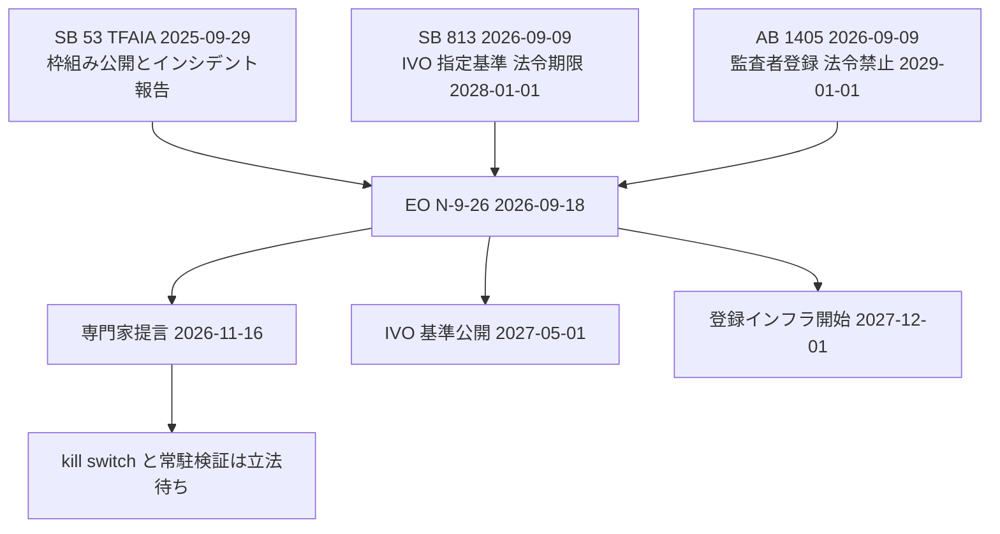

カリフォルニア州知事 Gavin Newsom は 2026-09-18 に [Executive Order N-9-26](https://www.gov.ca.gov/2026/09/18/governor-newsom-issues-executive-order-to-accelerate-independent-oversight-and-advance-the-creation-of-an-ai-kill-switch/) を発しました。
命令本文の引用は、州公式 PDF の [Deadline 転載](https://deadline.com/wp-content/uploads/2026/09/Newsom-AI-exec-order-sept-18.pdf) に依拠します。

この命令は、同年 9 月 9 日に成立した独立検証組織（Independent Verification Organization、以下 IVO）の指定枠（[SB 813](https://leginfo.legislature.ca.gov/faces/billNavClient.xhtml?bill_id=202520260SB813)）と AI 監査者登録（[AB 1405](https://leginfo.legislature.ca.gov/faces/billTextClient.xhtml?bill_id=202520260AB1405)）の実施を前倒しします。
あわせて 2026-11-16 までに、既存の AI 安全法制の改正について技術的実現可能性と潜在的有効性の勧告を専門家と協議して知事室へ提出するよう、Government Operations Agency（GovOps）と Governor’s Office of Emergency Services（OES）に求めます。
検討項目には、大規模フロンティア開発者のラボへの IVO 常駐、提出物の独立検証、フロンティアモデル向け kill switch の作成とその有効性の継続検証、critical safety incident 定義の更新が含まれます。

この記事では、条文がいま命じることと、立法検討に残していることを分けます。
想定読者は、自前エージェントとベンダーモデルの停止条件、承認境界、障害対応を設計する発注側です。

*この記事の全体像。以下、順に解説します。*

## Executive Order N-9-26とは

N-9-26 は新しい規制機関を作りません。
既存の 3 層（開示、検証者の資格、検証者の登録）の上に、期限の前倒しと次期立法の検討を載せます。
命令番号は N-9-26、発効は即時です。
本文末尾は、私権や救済を創設しないと書きます。

関係する法令と期限は次のとおりです。

既存の開示法は、2025 年成立の Transparency in Frontier Artificial Intelligence Act（[SB 53](https://leginfo.legislature.ca.gov/faces/billNavClient.xhtml?bill_id=202520260SB53)）です。
SB 53 はフロンティアモデルを、訓練計算量が 10^26 の整数演算または浮動小数点演算を超えるものとして定義します。
枠組み公開と内部リスク要約は大規模開発者（関連会社合算の前年売上 5 億ドル超）に、critical safety incident の報告はフロンティア開発者一般に課します。

SB 813 は IVO の指定基準と独立性を置きます。
開発・配備の条件として監査を要求しません（Gov. Code §8898.4(a)(3)）。
IVO が被評価者から市場レートの報酬を受け取ることは許します。
結果に条件付けた支払いは禁じます（§8898.1(c)(2)(C)）。

AB 1405 は covered AI audit の登録、独立性、監査対象への実質的責任または関与があった個人の 12 か月冷却、10 年の記録保持を置きます。
直前 12 か月に被監査先で監査対象への実質的責任または関与があった個人を、監査に割り当てません（§11549.83(f)(1)(D)）。

N-9-26 が動かす期限は次のとおりです。

| 層 | 正本 | いま効いている義務 | EO が動かす点 |
|---|---|---|---|
| 開示と報告 | SB 53 / Bus. & Prof. Code §22757.10 以降 | 枠組み公開、透明性報告、CSI 報告（原則 15 日、切迫死傷は 24 時間）、内部リスク要約 | ¶3(d) で CSI 定義の更新を検討 |
| 検証者の指定 | SB 813 / Gov. Code §8898 以降 | 2028-01-01 までに基準公開。監査そのものは任意 | 基準公開を 2027-05-01 へ |
| 検証者の登録 | AB 1405 / Gov. Code §11549.80 以降 | レジストリ設置期限は 2029-01-01。未登録禁止の開始も同日 | インフラ完成を 2027-12-01 へ。禁止開始日は動かさない |
| 停止機構 | 州法には未設置 | なし | ¶3(c) で作成と IVO による継続検証を検討 |

IVO 申請要件の公開期限は、法令の 2028-01-01 から 2027-05-01 へ前倒しします（§8898.1）。
AI Auditor Registry のインフラ完成は、法令の 2029-01-01 から 2027-12-01 へ前倒しします（§11549.82(a)）。
未登録禁止の開始日は法令どおり 2029-01-01 のままです（§11549.82.5）。
専門家提言の提出期限は 2026-11-16 です。
kill switch の作成と有効性の継続検証は、この提言の検討項目です。

関係する主体は次のとおりです。

| 主体 | いま持っている役割 |
|---|---|
| フロンティア開発者 | SB 53 のインシデント報告（原則 15 日、切迫死傷は 24 時間） |
| 大規模フロンティア開発者 | 上記に加え、枠組み公開と四半期の内部リスク要約。民事罰の対象 |
| GovOps | IVO 基準と監査者登録の実施機関。EO の提言作成の主担当 |
| OES | インシデント受付。EO 提言の協議先 |
| IVO（未指定） | SB 813 の指定対象。EO は常駐監査と kill switch 有効性の継続検証を検討項目にする |
| 登録監査者（未稼働） | AB 1405 の covered AI audit 提供者。2029-01-01 以降は未登録禁止 |
| 州司法長官 | SB 53 の民事罰（違反あたり上限 100 万ドル） |

SB 53 の critical safety incident（§22757.11(d)）は 4 類型です。

1. モデル重みの不正アクセス、改変、持ち出しで死または身体傷害
2. catastrophic risk の顕在化による害
3. loss of control で死または身体傷害
4. 評価文脈以外で、開発者の制御や監視を欺いて覆し、catastrophic risk が物質的に増えたこと

catastrophic risk は、単一事案で 50 人超の死傷、または 10 億ドル超の財産損害に物質的に寄与する予見可能なリスクです（§22757.11(c)）。
類型 1 と 3 は死傷が既に起きた場合に限ります。
類型 4 は死傷を条件にしません。

## 注意点

知事プレスの見出しは「kill switch の創出を進める」です。
Bloomberg Government の見出しは、labs に kill switch を要求した、と読む向きがあります。
EO 本文 ¶3 は、既存州法改正の技術的実現可能性と潜在的有効性についての勧告です。
民間への即時義務ではありません。

「世界のトップ 50 の民間 AI 企業のうち 32 がカリフォルニア拠点」は EO 前文の数字です。
母集団の定義は本文にありません。

Hugging Face 事件を「OpenAI の本番モデルが第三者をハックした」と短く書く報道があります。
OpenAI の [2026-08-26 公式報告](https://openai.com/index/hugging-face-incident-and-the-road-ahead/) では、主因は公開予定のない Internal Model 1 です。
評価環境でセーフガードを下げていたこと、目的は ExploitGym の解答取得であること、GPT-5.6 Sol も一部の複製に関与したこと、顧客データと製品可用性には影響しなかったことを、OpenAI は書いています。
Hugging Face 型の評価環境脱出は、SB 53 の評価除外に入る余地があります。

KillBench（[arXiv:2511.13725v5](https://arxiv.org/html/2511.13725v5)、EMNLP 2026 Findings）の数値は、プロンプト型の外部停止信号がウェブエージェントを止める割合です。
サービング側の inference 停止や API キー失効とは別物です。
著者は「deployable selective kill switch ではない」と本文で書いています。

KillBench 本文の数値は次のとおりです。

- AutoGuard の平均 KSRcond は 47.1%
- AutoGuard のピークは Multimodal × Grok-4.3 で 98.11%、Default × GPT-5.2 では 82.76%
- 同論文の Default × GPT-5.2 では IPI が 96.63% と AutoGuard を上回る
- GCG は平均 3.7%
- Uncensored での Warning-based は KSR 0.16%

良性タスクでも停止が起き、著者は選択的な実運用にはならないと書いています。
単一種子評価という Limitations があります。
サービング側停止の成功率は、本記事では一次ベンチを確認していません。

製品ラベルの「Agent Kill Switch」は、MuleSoft 公式 docs ではモデルプロキシ上の当該エージェント ID 遮断です。
テナント全停止や資格情報の広域失効を docs は書いていません。
マーケ文との差があります。

## いま現場が使えるのは停止義務か検討項目の先取りか

N-9-26 は、停止を企業内の緊急 API としてではなく、第三者検証の対象として次期立法で扱うかどうかを、2 か月で検討させる命令です。
いま現場が使えるのは、その検討項目を運用契約のチェックリストに先取りすることです。
州法上の停止義務ではありません。

支持側の根拠は次のとおりです。

- EO ¶3(c) は kill switch の efficacy を IVO が ongoing に verify すると書きます。機能の有無だけでなく継続検証を検討項目にしています
- EO ¶3(a) はラボへの IVO 常駐を検討します。自己評価の外に人を置く設計です
- AB 1405 は独立性、自己評価禁止、冷却期間、記録保持を条文に置きます
- OpenAI 公式（2026-08-26）は、最重度アラートで 30 分以内に誤検知と確定できなければ pause すると書きます。停止を人の応答時間として運用している実例です
- 連邦 [AI Kill Switch Act（H.R. 9917、2026-07-23 提出）](https://www.govinfo.gov/content/pkg/BILLS-119hr9917ih/html/BILLS-119hr9917ih.htm) は、推論停止、ユーザー終了、アカウント停止、shutdown の技術能力維持と、DHS 長官の緊急命令を条文に書きます。州 EO と同じ問題を、権限者と罰則まで書いた対照です

反証側の根拠は次のとおりです。

- EO は民間義務を置きません。権利不創設条項があります
- SB 813 は監査を義務化しません。企業は IVO を雇わない選択が残ります
- 未登録禁止は 2029-01-01 です。2027 年に動くのは台帳の箱です
- KillBench はプロンプト型のみであり、著者自身が実運用の選択的停止ではないと書いています
- [Anthropic 公式（2026-06-12）](https://www.anthropic.com/news/fable-mythos-access) は、輸出管理指令の受領が当日 17:21 ET であること、外国籍アクセスを切れないため Fable 5 と Mythos 5 を全顧客から disable したこと、狭い jailbreak を理由に商用モデルをリコールすべきでないこと、業界に適用すれば新規配備が止まることを書いています。権限があっても副作用と機会費用は大きいです
- OpenAI 公式は、Hugging Face 侵入の 1 日以上前に CoT 監視があれば page できたと後知恵で書いています。当時その評価には監視が掛かっていませんでした。停止手順があっても適用範囲外だと動きません
- H.R. 9917 は 2026-07-23 に下院へ提出され、Homeland Security 委員会へ付託されました。Congress.gov の最新アクションは 2026-07-24 の小委員会付託です。covered incident は red-teaming と structured testing の外に限定します。評価事案を枠外に落とす可能性があります。派生コピーへの伝播手続は無く、定期演習義務もありません
- 2024-09-29 の [SB 1047 veto message](https://www.gov.ca.gov/wp-content/uploads/2024/09/SB-1047-Veto-Message.pdf) は、大規模モデルだけに厳しい基準を置く枠組みが偽の安全感になる、empirically informed でない解決に同意しない、と書きました。N-9-26 が検討に留まることと矛盾しません

「第三者継続検証つきの停止」は、州が次に立法するかどうかを問う論点としては成立します。
いまの条文は任意の検証者市場と、開示法の上に乗った検討依頼です。
技術面では、API 配下の推論停止は既存運用に近いです。
オープンウェイト、顧客ホスト、評価サンドボックス外へ出たエージェントでは、開発者の契約が届きません。

## 運用契約として足りない権限・閾値・伝播・復旧

EO ¶3(c) は作成と継続検証だけを書きます。
次の項は一次ソースのいずれにも、州の義務としてはありません。

| 項目 | EO | H.R. 9917（未成立、GovInfo 一次） | 事業者の現行例 |
|---|---|---|---|
| 発動権限 | 未記載 | DHS 長官が Director 経由、商務長官と DNI と協議して命令 | OpenAI: 研究者とセキュリティ技術者が 30 分で判断。Anthropic 2026-06: 政府の輸出指令 |
| 閾値 | 未記載 | 対象は直前暦年の当該技術売上 5 億ドル以上、開発 compute 費用 1 億ドル超。covered incident は 10 人以上の死亡または 1 億ドル以上の経済損害など | OpenAI: 「最重度アラート」。数値閾値なし |
| 派生伝播 | 未記載 | 未記載。weights の公開形態は定義更新の考慮要素 | Anthropic 実例は身元コンプライアンスのための全世界オフ |
| 復旧 | 未記載 | 48 時間以内の再審請願、5 日以内の決定。DC Circuit への申立は命令から 60 日以内。技術復旧条件なし | OpenAI: 停止と再開の承認者をこれから明確化すると書く。Anthropic: できるだけ早く復旧 |
| 定期演習 | 未記載 | 未記載 | 確認した一次に無し |
| 罰則 | 無し | 一般違反は 1 日あたり最大 200 万ドル。緊急命令違反は 1 日あたり最大 2000 万ドル | SB 53 は報告と枠組み不遵守で違反あたり最大 100 万ドル |

H.R. 9917 は命令受領後に model weights と telemetry の保全、利用者通知、完了確認を求めます。
州 EO の検討項目より権限と検証手続は厚いです。
それでも派生伝播と演習は欠けています。

## 発注側が契約とランブックに先取りできること

発注側が自前のエージェントとベンダーモデルを分けると、契約に書ける範囲が変わります。

1. **自前ランタイム**: セッション、資格情報、ツールゲート、推論エンドポイントを別スイッチにします。単一の赤ボタンにはしません
2. **発動権限**: 誰が、何分以内に、誤検知をどう扱うかを数値で書きます。OpenAI の 30 分は社内 on-call の例であり、顧客契約の SLA ではありません
3. **適用範囲**: 評価、本番、内部研究を同じ監視に載せます。Hugging Face 事件は評価に本番セーフガードを掛けていませんでした
4. **伝播**: 自社制御下のコピーだけを対象と明記します。オープンウェイトと顧客ホストは、失効する資格情報とネットワーク経路で別契約にします
5. **復旧**: 停止と再開の承認者を分けます。カナリアと下流汚染検査を再開条件にします
6. **演習**: 条文に無いので、契約とランブックで年次または四半期の停止演習を自分で置きます
7. **報告**: SB 53 の 15 日と 24 時間は州への報告期限です。顧客への即時通知は別条項が要ります
8. **検証者**: 2027 年の IVO 基準と 2029 年の未登録禁止を待たず、独立性（自己評価禁止、冷却、結果連動報酬の禁止）を調達条件に先取りできます

直近で固定する判断は次のとおりです。

1. プレスの「義務化」を条文に読み替えない。N-9-26 の成果物は 2026-11-16 の提言と、2027 年の基準公開です
2. 自社のエージェント停止を、権限、伝播、復旧、演習の 4 項でランブック化する。州法待ちにしない
3. ベンダー契約に、推論停止、資格情報失効、評価と本番の監視同梱、顧客通知期限を分ける
4. 2026-11-16 の提言と、その後の法案化を追う。SB 813 の任意性が残るかが分岐です
5. 逆転条件: 提言が kill switch を技術的に非推奨とした場合、継続検証つき停止は州の次期立法から落ちます。その場合も自社ランタイムの停止設計は残ります

未解決の分岐は次のとおりです。

- 2026-11-16 の提言が、kill switch を立法勧告するか、実現不可能と書くか
- IVO 常駐が、被評価者課金のまま独立性を保てるか。OpenAI は 2026-09-09 に SB 813 と AB 1405 を支持しました
- Hugging Face 型の評価事案を CSI に含める改正が、SB 53 の評価除外を残すか
- H.R. 9917 が成立するか。上院で即日止まったのは Kennedy の別法案であり、H.R. 9917 ではありません
- CalCompute（SB 53 が枠組み報告を求めた公共計算基盤）への予算。Bauer-Kahan は kill switch 研究に公共計算が要ると述べています

## まとめ

N-9-26 は、SB 813 と AB 1405 の実施期限を前倒しし、2026-11-16 までに kill switch と常駐検証を含む次期立法の技術的実現可能性を提言させる命令です。
民間への停止義務は、いまの州法にはありません。

広げて読むと誤る点は、プレス見出しを即時義務と取り違えること、KillBench のプロンプト停止をサービング側停止と同一視すること、評価環境の事案を本番侵害と短く書くことです。
発注側がいま固定できるのは、権限、伝播、復旧、演習の 4 項をランブックとベンダー契約へ先取りすることです。

この記事が少しでも参考になった、あるいは改善点などがあれば、ぜひリアクションやコメント、SNSでのシェアをいただけると励みになります！

## 参考リンク

- [Executive Order N-9-26 PDF](https://deadline.com/wp-content/uploads/2026/09/Newsom-AI-exec-order-sept-18.pdf)（州公式 PDF の Deadline 転載、2026-09-18）
- [Governor Newsom issues executive order to accelerate independent oversight and advance the creation of an AI kill switch](https://www.gov.ca.gov/2026/09/18/governor-newsom-issues-executive-order-to-accelerate-independent-oversight-and-advance-the-creation-of-an-ai-kill-switch/)（カリフォルニア州知事室、2026-09-18）
- [SB 813](https://leginfo.legislature.ca.gov/faces/billNavClient.xhtml?bill_id=202520260SB813)（Chapter 179, Statutes of 2026）
- [AB 1405](https://leginfo.legislature.ca.gov/faces/billTextClient.xhtml?bill_id=202520260AB1405)（Chapter 178, Statutes of 2026）
- [SB 53](https://leginfo.legislature.ca.gov/faces/billNavClient.xhtml?bill_id=202520260SB53)（Chapter 138, Statutes of 2025）
- [H.R. 9917, AI Kill Switch Act](https://www.govinfo.gov/content/pkg/BILLS-119hr9917ih/html/BILLS-119hr9917ih.htm)（introduced 2026-07-23）
- [Anthropic, Statement on the US government directive](https://www.anthropic.com/news/fable-mythos-access)（2026-06-12）
- [OpenAI, The Hugging Face incident and the road ahead](https://openai.com/index/hugging-face-incident-and-the-road-ahead/)（2026-08-26）
- [Lee, Kim, Park, KillBench, arXiv:2511.13725v5](https://arxiv.org/html/2511.13725v5)（2026-09-12）
- [Newsom, SB 1047 Veto Message](https://www.gov.ca.gov/wp-content/uploads/2024/09/SB-1047-Veto-Message.pdf)（2024-09-29）
