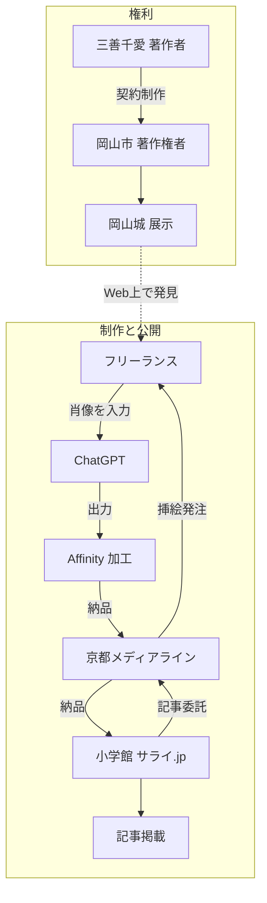

小学館のWebメディア「サライ.jp」は、2026年8月23日に配信した日本史人物伝の記事で、岡山市が著作権を持つ「豪姫」肖像画を許諾なく利用したイラストを掲載したとして、2026年9月18日に謝罪しました。
記事制作は編集プロダクション（京都メディアライン合同会社）に委託され、挿絵はフリーランスのイラストレーターに再委託されました。
公式説明では、イラストレーターがWeb検索で当該肖像画を見つけ、権利確認をせずChatGPTに読み込ませ、「中世戦国時代の姫を出して欲しい」と指示して出力し、Affinityで着物の柄を変え、顔は別の銅像資料を参考に修正して納品しています。
肖像画の制作者は三善千愛、著作権者は岡山市です。

この記事では、公式お詫び2通と当事者投稿、文化庁の整理を公開一次の範囲で分けます。
読み終わると、委託制作の納品1点について、何を入力し、どの権利に基づき、誰が確認したかを残す検収が設計できます。
想定読者は、社内AI規程の外側にある委託制作の来歴と検収を設計する発注側です。

:::message
本稿は法的助言ではありません。サライ.jpと京都メディアラインは「著作権侵害」と自己認定して謝罪しています。2026年9月21日時点で、裁判所の侵害認定は確認していません。
:::

## 委託制作での生成AI入力と加工納品とは

対象は、公開媒体から編集プロダクション、フリーランスへ伸びる再委託チェーンで、既存肖像を生成AIに入力し、人手で加工して納品した挿絵です。

公開された公式説明が認める工程は次です。

- 公開媒体（小学館）→ 編集プロダクション → フリーランス、という再委託チェーンで挿絵が作られた
- 発注時に渡された参考は、豪姫固有の肖像ではなく着物姿の女性資料だった
- 制作工程に、既存肖像のChatGPTへの画像入力と、人手による画像編集が両方入る
- 著作権の財産権者（岡山市）と、描いた著作者（三善千愛）が公式文書上で分けて名指しされている
- 権利者・制作者への許諾確認は、制作時にも掲載前にも十分行われなかった、と両社が書いた
- 発覚経路は、掲載翌日の第三者指摘と、約1か月後の公式お詫びである
- 原画は岡山城の展示物として、制作者名付きで以前から公開されていた

権利の所在と、制作チェーンは別レイヤーです。

図の実線は、公式お詫びが認めた委託と制作の流れです。
点線は、展示・公開されていた原画が検索経由で入力素材になった経路です。

工程の一次は、[サライ.jp編集部のお詫び](https://serai.jp/news/1281884)と[京都メディアラインのお詫び](https://kyotomedialine.com/?p=3469)、および当事者のX投稿です。
二次報道は ITmedia NEWS の [梅林日奈子「肖像画をChatGPTに読み込ませて出力→加工して納品　委託先による著作権侵害で、小学館「サライ.jp」が謝罪」](https://www.itmedia.co.jp/news/article/2609/18/2000001645/)（2026-09-18）です。

## 注意点

次の言い換えは、公開一次の範囲と一致しません。

| 言い換え | 一次の範囲 |
|---|---|
| 裁判所が侵害を認定した | 両社の自己認定と謝罪。判決ではない |
| 文化庁文書が本件を確定評価した | [「AIと著作権に関する考え方について」](https://www.bunka.go.jp/seisaku/bunkashingikai/chosakuken/pdf/94037901_01.pdf)（令和6年3月15日）は、文書自身が法的拘束力を持たず、特定の生成AIの確定評価でもないと書く |
| ITmedia記事が工程の一次である | 公式お詫びの要約。工程の一次は公式2通と当事者投稿 |
| ChatGPTに入れた時点で複製権侵害が確定する | 文化庁の整理でも言い切れていない。入力は情報解析として著作権法30条の4が及ぶ余地があり、類似物を出す目的が併存すると評価されたとき同条は及ばない、という整理である |
| 加工すれば盗作にならない | 自動では成り立たない。逆に、顔と柄の変更で表現上の本質的特徴が直接感得できなくなれば、翻案は成立しない |
| いぶすき菜の花マラソンと同型である | 2026年9月、事務局が生成AI活用を事後説明した事案は、制作主体の表記とモチーフの誤描写である。特定の既存著作物を入力した、という自己認定は無い |

出典の到達宣言は、定義と分母を分けて読む必要があります。
「著作権侵害」は両社の公式語彙です。
依拠の自己説明は公式工程から厚い一方、類似性の司法対比はありません。

## 公式が認めた工程と時系列

公開一次で確定できる日付は次です。

| 日付 | 出来事 | 一次ソース |
|---|---|---|
| 2022年頃〜 | 三善が岡山城向けに三姫肖像画を制作 | 三善X（展示・印刷の投稿） |
| 2024-06-18 | 岡山城公式が豪姫肖像画を「三善千愛先生」作として展示告知 | [岡山城公式X](https://x.com/okayama_castle/status/1802937306057212269) |
| 2026-08-23 | サライ.jpが当該記事を配信 | サライ.jpお詫び |
| 2026-08-24 | 三善「私は関与していない」「岡山市に確認したい」 | [三善X](https://x.com/miyoshi_chiai/status/2091698810225615022) |
| 2026-09-17 | 京都メディアラインお詫び本文の末尾日付 | [編プロお詫び](https://kyotomedialine.com/?p=3469) |
| 2026-09-18 | サライ.jpが公式お詫び（ページ表示・本文末尾とも同日）。京都メディアラインお詫びページの公開日表示も同日。三善が「生成AIを使用した無断盗用」と報告 | [サライ.jp](https://serai.jp/news/1281884) / [編プロお詫び](https://kyotomedialine.com/?p=3469) / [三善X](https://x.com/miyoshi_chiai/status/2100836935979901425) |

公式2通が一致して認める工程は次です。

1. 発注時、豪姫の十分な肖像資料が無く、着物姿の女性資料のみ提供した
2. イラストレーターがWebで「豪姫」を検索し、当該肖像画を見つけた
3. 権利者と利用可否を確認せずChatGPTに読み込ませ、「中世戦国時代の姫を出して欲しい」と入力した
4. 出力をAffinityに取り込み、スタンプ等で着物の柄を変えた
5. 顔は別の銅像資料を参考にペン等で変えた
6. 編プロは参考資料との相違・制作過程・権利関係を十分確認せず小学館へ納品した
7. サライ.jp編集部も権利関係を十分確認せず掲載した

2026年9月21日時点で確認できなかったものは、岡山市公式サイト上の本件声明、問題記事の現行URL、フリーランスの氏名と反論、ChatGPTの具体機能と契約プラン、訴訟の有無です。
これらは公開可否の判断を止めません。
来歴を残す設計は、判決を待たなくても実装できます。

## 著作権法上の整理はどう読むか

判断枠は、文化庁「考え方」が既存判例に沿って書く次の2要件です。

| 要件 | 内容 | 本件への当てはめ |
|---|---|---|
| 依拠性 | 既存著作物の表現を認識してそれを基に作ったか | 公式工程は、当該肖像を検索してChatGPTに入力したと書く。依拠の自己説明は強い |
| 類似性 | 表現上の本質的特徴を直接感得できるか（江差追分事件・最判平成13年6月28日） | 両社は侵害と呼ぶ。一方で顔と柄を変えたと自ら書く。司法の対比は無い |

関連する権利と制限は次です。

- 複製（21条）: 画像の取得とサービスへのアップロードで複製が生じ得る
- 翻案（27条）: 出力と加工後イラストが本質的特徴を残せば問題になる
- 公衆送信（23条）: 記事掲載。掲載物が複製・翻案でなければ、送信侵害も成立しない
- 30条の4: 享受目的でない情報解析等。文化庁は、生成指示のための入力複製に同条の適用を考える一方、「類似する生成物を出させる目的」での入力には同条を及ぼさないと書く（本文PDF 38から39頁）
- 30条（私的使用）: 商業納品とWeb公開には使えない
- 差止（112条）は故意過失を問わない。損害賠償は故意または過失。刑事罰は故意（「考え方」36頁）

OpenAI [Terms of Use](https://openai.com/policies/terms-of-use/)（Effective 2026-01-01）は、第三者の権利を侵害する利用を禁じ、Inputに必要な権利を利用者が保証すると書きます。
これは利用者とOpenAIの契約です。
岡山市を当事者にしません。
規約違反と著作権侵害は別レイヤーです。

文化庁は Image to Image で既存著作物そのものを入力する場合を、利用者が既存著作物を認識していた依拠性の例に挙げます（同PDF 34頁）。
本件公式工程はその例に近いです。
ただし「考え方」は確定評価ではありません。

## 公開名義は誰の行為として残るか

| 主体 | 公式に書かれた行為 | 著作権上の位置 |
|---|---|---|
| フリーランス | 検索、ChatGPT入力、Affinity加工、納品 | 物理的な生成行為の主体になりやすい |
| 京都メディアライン | 資料不足のまま発注、確認不足のまま小学館へ納品 | 制作過程の管理。規範的侵害主体として文化庁文書が出版社を直接名指ししてはいない |
| 小学館 サライ.jp | 再委託チェーンの発注、掲載前確認不足、公衆送信 | 公開の主体。損害賠償は過失の有無が別途問題になる |
| OpenAI | サービス提供 | 「考え方」は、侵害物が高頻度でないモデルで利用者が類似物生成を意図した場合、事業者の主体評価は低くなると書く |

民法716条は、注文者は請負人がその仕事について第三者に加えた損害を原則として賠償しない、と書きます。
指図に過失がある場合は例外です。
公式お詫びが確認できるのは「委託」「発注」までで、契約が請負か準委任かは非公開です。
716条を持ち出せるのは、当該契約が請負に当たる場合に限ります。
最判令和4年10月24日〔音楽教室〕は、生徒の演奏の利用主体が争点であり、外注挿絵とは事実が違います。
規範的主体論が教室型で狭まった例として挙げるにとどめます。
小学館自身の掲載・公衆送信は、請負人の行為についての716条とは別の責任です。

それでも公開物の名義は小学館です。
差止対象になり得る掲載物と、ブランド毀損は発注側に残ります。
委託すれば説明責任が消える、とは言えません。
侵害主体の法的ラベルと、公開後に説明できる材料を持つかは別問題です。

## 依拠は厚いが類似性は未判定である

争点は「AIか否か」ではありません。
納品物について、何を入力し、どの権利に基づき、誰が確認したかを残さないと、公開後に発注側が事実を説明できません。

支持側の材料は次です。

- 公式2通が、許諾のない利用と確認不足を同じ工程で認める
- 文化庁が i2i を依拠性の典型例に置く
- 編プロ自身が再発防止として、生成AI使用の有無と使用資料の確認を書く
- 原画はクレジット付きでWebに出ていた。発見可能性は高い

反証側の材料は次です。

- 自己認定は判決ではない。権利者（岡山市）の公式声明は、本稿が確認した公開一次には無い
- 顔の描き直しと柄の変更は、江差追分の「直接感得」を下回る主張の材料になる
- 東京地判平成30年3月29日 平成29年(ワ)672号（コーヒーを飲む男性）は、ネット検索で見つけた写真を参照したイラストについて、依拠を認めつつ複製・翻案を否定した。[判旨の転載](https://ipforce.jp/Hanketsu/jiken/no/12146)で事件番号の実在を確認できる
- 入力複製に30条の4が及ぶ余地がある。公式プロンプトは「この絵を再現せよ」ではない
- 契約にAI申告を書いても、照合対象が発注パッケージに無く、納品が人手加工済みだと、本件と同じ検収は通り得る
- クレジットは岡山城公式投稿に既にあった。署名は検索入力を止めなかった

依拠の説明は公式工程から厚いです。
類似性は未判定のまま、両社が侵害と呼んで公開を止める判断をした、と読むのが正確です。
AIは制作経路と発覚後の語彙を変えました。
侵害テスト自体は従来の類似性＋依拠性です。

未解決の問いは残ります。

- 岡山市は権利行使するのか、許諾条件はどうなっていたのか
- 加工後イラストは、構図・背景の城・衣装の配置のうち何が残っているのか
- 問題記事は現在も公開されているのか
- 再委託契約に、第三者著作物と生成AIの条項はあったのか
- 三善の著作者人格権（氏名表示・同一性保持）は別途主張されるのか

公開可否の判断は、これらを待たずにできます。
来歴記録の価値は、類似性が司法上否定され問題がレピュテーションだけになる場合でも残ります。
説明可能性のためです。

## 発注側が納品単位で残す項目

推奨は、委託制作の成果物を納品1点を単位に来歴を残し、掲載前に照合することです。
確認対象は「AI生成物か」ではありません。

| 項目 | 本件で欠けていたもの |
|---|---|
| 入力素材 | Web検索で拾った肖像。発注側は着物女性資料のみ渡した |
| 権利根拠 | 岡山市許諾なし |
| 利用サービス | ChatGPT（プラン不明） |
| 加工履歴 | Affinityで柄変更、銅像参照で顔修正 |
| 確認者 | 編プロも編集部も「十分確認せず」 |

契約と検収の最小セットは次です。

1. AI利用の申告（有無、サービス名、consumer / business の別）
2. 入力素材の権利証跡（発注提供 / 自作 / 許諾済み の別と証憑）
3. 第三者著作物の画像入力・固有名詞指定の禁止、または事前承認
4. 再委託の事前承諾と、同一条件の流し込み
5. 掲載前の照合。照合先は、公開されている権利者クレジット付き作品を含む
6. 表明保証は無資力で空転し得るため、公開前の目視を省略しない

逆転条件もあります。

- 類似性が司法上否定され、問題がレピュテーションだけになる場合でも、来歴記録の価値は残る（説明可能性）
- 照合対象を発注時に渡せない題材では、条項だけでは足りず、参照してよい画像のホワイトリストが先になる
- 自己申告だけのAI確認は、本件の加工済み納品を止めない

直近のアクションは、発注側が条文と検収票を先に直すことです。

1. 既存の外注契約に、上記1から4があるかを条文で確認する
2. 挿絵・写真・図版の検収票に「入力素材」「権利根拠」「生成AI」「確認者」の4欄を足す
3. Webに出ている自社・取引先の既存ビジュアルを、納品物との突合対象にする

## まとめ

小学館「サライ.jp」は、委託先の再委託チェーンで作られた挿絵について、岡山市が著作権を持つ豪姫肖像画の許諾なき利用を自己認定し、2026年9月18日に謝罪しました。
公式工程は、Web検索で見つけた既存肖像のChatGPT入力、Affinityでの柄変更、銅像参照での顔修正、編プロと編集部の確認不足です。
依拠の自己説明は厚い一方、類似性の司法対比はありません。
侵害テスト自体は従来の類似性＋依拠性です。

委託すれば説明責任は消えません。
公開名義は発注側に残ります。
発注側が先に設計するのは、納品1点の来歴と掲載前の照合です。
確認対象は「AI生成物か」ではなく、入力素材、権利根拠、確認者です。

この記事が少しでも参考になった、あるいは改善点などがあれば、ぜひリアクションやコメント、SNSでのシェアをいただけると励みになります！

## 参考リンク

1. 小学館 サライ.jp編集部, [サライ.jp 配信記事における著作権侵害に関するお詫びとご報告](https://serai.jp/news/1281884), 2026-09-18.
2. 京都メディアライン合同会社, [著作権侵害に関するお詫びとご報告](https://kyotomedialine.com/?p=3469), 文末日付 2026-09-17（ページ公開日表示は 2026-09-18）.
3. 梅林日奈子, [肖像画をChatGPTに読み込ませて出力→加工して納品　委託先による著作権侵害で、小学館「サライ.jp」が謝罪](https://www.itmedia.co.jp/news/article/2609/18/2000001645/), ITmedia NEWS, 2026-09-18.
4. 三善千愛, [X投稿](https://x.com/miyoshi_chiai/status/2091698810225615022), 2026-08-24.
5. 三善千愛, [X投稿](https://x.com/miyoshi_chiai/status/2100836935979901425), 2026-09-18.
6. 岡山城天守閣公式, [X投稿](https://x.com/okayama_castle/status/1802937306057212269), 2024-06-18.
7. 文化庁, [AIと著作権について](https://www.bunka.go.jp/seisaku/chosakuken/aiandcopyright.html).
8. 文化審議会著作権分科会法制度小委員会, [AIと著作権に関する考え方について](https://www.bunka.go.jp/seisaku/bunkashingikai/chosakuken/pdf/94037901_01.pdf), 令和6年3月15日.
9. 著作権法, [Japanese Law Translation](https://www.japaneselawtranslation.go.jp/en/laws/view/4001).
10. OpenAI, [Terms of Use](https://openai.com/policies/terms-of-use/), Effective 2026-01-01.
11. 最判昭和53年9月7日民集32巻6号1145頁〔ワン・レイニー・ナイト・イン・トーキョー〕.
12. 最判平成13年6月28日民集55巻4号837頁〔江差追分〕.
13. 最判令和4年10月24日民集76巻6号1348頁〔音楽教室〕.
14. 東京地判平成30年3月29日 平成29年(ワ)672号〔コーヒーを飲む男性〕, [知財ポータル転載](https://ipforce.jp/Hanketsu/jiken/no/12146).
15. いぶすき菜の花マラソン, [第44回 ポスターデザイン公開](https://ibusuki-nanohana.com/info/3253/), 2026-07-24（後日記入の補足あり）.
