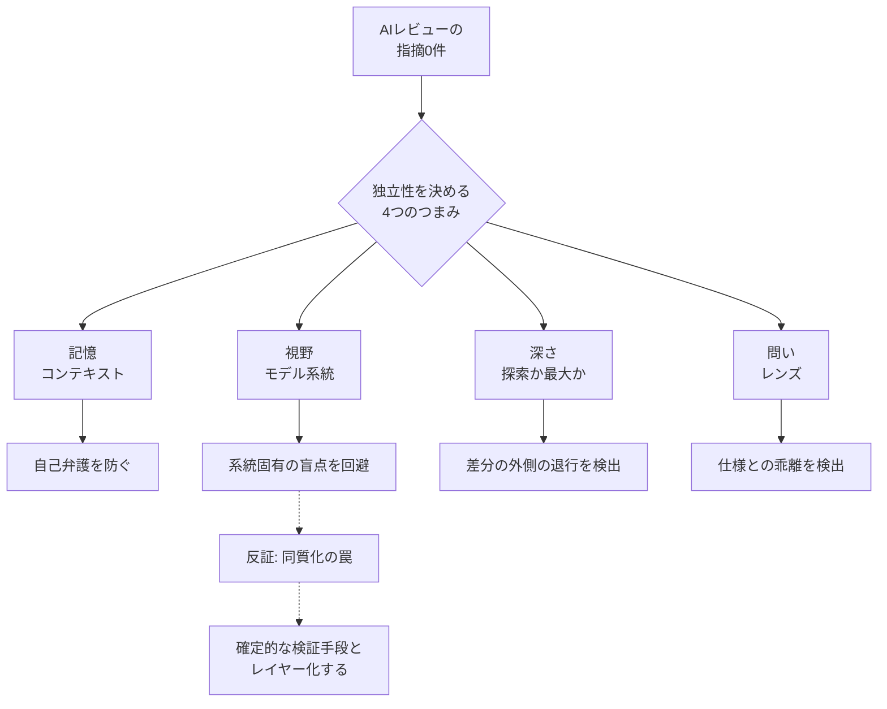

## この記事の対象と得られるもの

AIにコードや設計をレビューさせ、「指摘0件」という結果を受け取る場面を扱います。

- 対象読者: AIエージェントにレビューを任せている開発者・技術リーダー、およびその結果を品質判断の根拠にしている発注側
- 得られるもの: 「指摘0件」を信頼できるシグナルへ引き上げるための、独立性の分解軸・記録項目・限界の見取り図

結論を先に置きます。**実装した会話とは別の「新しい会話」でレビューさせて0件でも、それだけでは独立した確認になりません。** 独立性は会話の切り替えだけでは作れず、少なくとも4つのつまみを別々に動かす必要があります。

*この記事の全体像。以下、順に解説します。*

## 全体像

「指摘0件」がどこから来たのかを、4つの直交パラメータに分解して読みます。

新しい会話への切り替えが担うのは、いちばん左の「記憶」のリセットだけです。実装時の記憶による自己弁護は防げますが、モデルが本来持つ視野（盲点）までは変わりません。

## なぜ「新しい会話」だけでは足りないのか

実際の開発記録から、3つの事実が観測されています。

### 1. 同じ系統のモデルは盲点を共有する

ある設計を毎回新規セッションで7ラウンドにわたりレビューした事例では、特定系統のモデル（Gemini系）が6ラウンドにわたって次の2つの欠陥を一度も報告しませんでした。

- 認証情報の検証すり抜け
- 取得オプションの欠落

いずれも、別系統（GPT系）へ切り替えた時点で検出されています。

つまり、同じ系統のモデルに何度聞き直しても、拾いやすい論点と拾いにくい論点の偏りは変わりません。会話をリセットしても、視野はリセットされないためです。

同じ開発記録の108ラウンド分では、**2系統が同時に「指摘0件」になった回数は0回**でした。片方が0件でも、もう片方は何かを見つけている状態が続いたことになります。

### 2. 多系統でも「浅ければ」同じ場所で止まる

3系統のモデルを同時に用いたレビューでも、深さ（tier）の設定次第で結果が変わりました。

| ラウンド | 深さ | 結果 |
| --- | --- | --- |
| 9 | 探索（軽い） | 3系統すべて0件 |
| 10・11 | 最大 | 合計5件の欠陥 |

探索段階では、差分の内部にある欠陥しか見ません。最大まで掘り下げてはじめて、**差分の外側にいる利用者が変更を正しく消費していない**という退行を捉えられました。

系統を増やしても、全員が同じ浅さで止まっていれば、止まる位置は揃います。

### 3. レンズ（問い）が変われば探す欠陥も変わる

同じ実装差分に対して、問いを変えた比較です。

| 問い | 結果 |
| --- | --- |
| コード品質としての危険はないか | 2系統とも0件（または軽微1件） |
| 設計書どおりに実装されているかの監査 | 3件の欠陥 |

「コードとして危険がないか」と「設計の約束を果たしているか」は別の問いです。与える問いが同じであれば、検出される欠陥の種類も固定化されます。

## 4つのつまみの整理

以上を、記録・運用しやすい形にまとめます。

| つまみ | 何を変えるか | 変えないと起きること | 変える操作の例 |
| --- | --- | --- | --- |
| 記憶（コンテキスト） | 実装時の文脈を持つか | 自分の実装を弁護する | 新しい会話でレビューさせる |
| 視野（モデル系統） | 系統固有の得手不得手 | 同じ欠陥を何ラウンドも見逃す | 別系統のモデルに切り替える |
| 深さ（tier） | 探索範囲 | 差分の外側の退行を見ない | 探索から最大へ引き上げる |
| 問い（レンズ） | 何を欠陥とみなすか | 仕様との乖離が可視化されない | コード品質から設計監査へ変える |

4つは互いに独立しています。ひとつだけ動かして0件でも、残り3つは未検証のままです。

## この考え方への反証と限界

「AIを直交させれば独立検証になる」という前提には、以下の批判的な観点があります。ここは断定を弱めて読む必要があります。

### 同質化の罠（Homogenization Trap）

異なる系統のモデル（GPT系、Anthropic系、Meta系など）を採用しても、事前学習に用いられるデータ（GitHubなど）が本質的に重複しているため、同じような「AI特有の盲点」を共有してしまうと報告されています［二次情報］。

モデル系統を変えれば完全に独立したレビューになる、という前提は過大評価です。

### 単一モデルの反復推論（Self-MoA）

モデル系統を直交させる複雑なオーケストレーションよりも、同じ最強モデルにTemperatureやSystem Promptを変えて複数回推論させる方（Self-ConsistencyやSelf-MoA）が、ノイズが少なくバグ検出率が高いとする研究があります［二次情報］。

多系統化は常に正解ではなく、コストに見合うかを個別に見る対象です。

### 収穫逓減と過剰修正

LLM同士のレビュー反復によるバグ検出率の向上は、およそ5〜10回のイテレーションで頭打ちになるとされています［二次情報］。

さらに、エージェントを連携させすぎると、モデルが過去の出力へ過剰適合（Context Rot）し、正常なロジックを破壊する「過剰修正」を招くリスクもあります［二次情報］。

### Solver-Verifier Gap

関数間をまたぐロジックや競合状態に起因する複雑なCVE（脆弱性）については、系統やプロンプトをどう直交させても一貫して見逃す傾向があるとされています［二次情報］。

AIレビューの多重化では埋まらない層が残る、ということです。

## 運用への落とし込み

### 1. 「0件」の記録にメタデータを必須化する

レビュー結果が0件だったとき、「問題なし」と解釈せず、次の4点を必ず添えて記録します。

- どの会話の記憶で出した0件か
- どの系統のモデルが出した0件か
- どの深さで出した0件か
- 何を問われて出した0件か

こうすると、0件は「問題がない証明」ではなく「この条件では見つからなかった」という限定された事実になります。未検証のスコープがそのまま可視化されます。

### 2. 直交化はコストバランスで使い分ける

イテレーションは収穫逓減を迎えます（およそ5〜10回で頭打ち［二次情報］）。

- 致命的な影響がない領域: 単一の強いモデルの反復推論など、コスト効率の良い手法
- 高リスク領域: 系統の直交化を投入

一律に多系統・最大深さで回すと、得られる追加検出よりコストが先に膨らみます。

### 3. 確定的ツールとレイヤー化する

同質化の罠や複雑な状態管理バグの死角は、AI同士の直交化では埋まりません。独立性マトリクスには、根本的に異なる検証メカニズムを組み込みます。

- 静的解析ツール（SAST）
- 型チェッカー
- 人間によるドメイン知識ベースの検証

AIレビューの多重化は、これらを置き換えるものではなく、その上に重ねる層として扱うのが妥当です。

## まとめ

- 「新しい会話でのレビュー」がリセットするのは記憶だけで、視野・深さ・問いは変わらない
- 同系統のモデルは6ラウンド同じ欠陥を見逃した一方、108ラウンドで2系統同時の0件は0回だった
- 多系統でも深さが浅ければ全系統が同じ位置で止まり、問いを変えると検出される欠陥の種類が変わる
- ただし同質化の罠・収穫逓減・Solver-Verifier Gapがあり、AI同士の直交化だけでは独立性は完成しない
- 実務的な最小手当ては、0件に「記憶・系統・深さ・問い」のメタデータを必ず添えて、未検証スコープを見えるようにすること

この記事が少しでも参考になった、あるいは改善点などがあれば、ぜひリアクションやコメント、SNSでのシェアをいただけると励みになります！

## 参考リンク

- [フレッシュなコンテキストは独立性ではない（zenn.dev/okuyam2y）](https://zenn.dev/okuyam2y/articles/fresh-context-is-not-independence)
