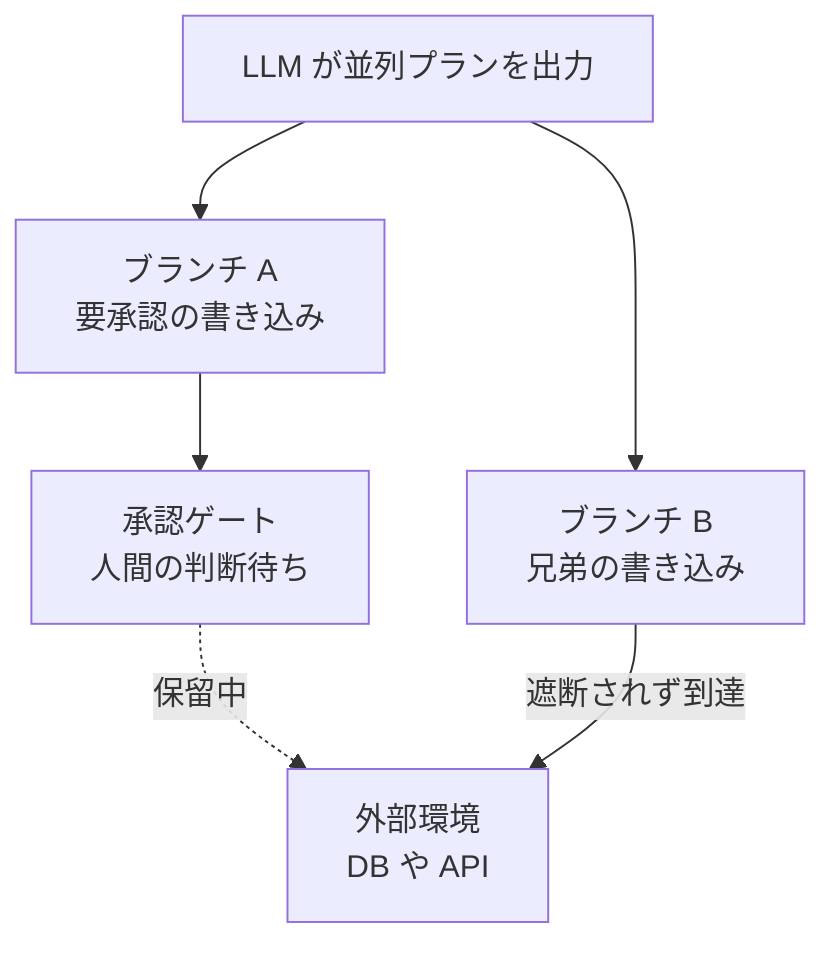
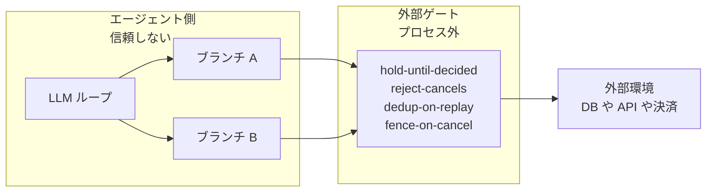

AIエージェントに実行権限を渡すとき、多くのチームは「承認ゲートを挟んでいるから大丈夫」と考えます。ツールを呼ぶ直前で人間の承認を求める Human-in-the-loop、途中で止めるキャンセル、暴走を防ぐタイムアウト。フレームワークが標準で用意しているこれらの制御は、安全設計の前提として扱われてきました。

しかしその前提を実測で検証した論文が出ています。arXiv に公開された *Stop Means Stop: Measuring and Repairing the Enforcement Gap in Agent-Framework Control Primitives*（[arXiv:2607.14166](https://arxiv.org/abs/2607.14166)）は、主要な6つのエージェントフレームワークすべてで、承認ゲートやキャンセルが副作用の実行を完全には遮断できていないことを示しました。

この記事では次の3点を扱います。

- なぜ「止めたはずのエージェント」が書き込みを続けてしまうのか、その構造
- 外部ゲートという解法と、その適用範囲
- 自分たちのエージェント基盤に落とすときの設計原則

対象読者は、LLMエージェントに本番リソースへの書き込み権限を与えるかどうかを判断する立場の方です。

*この記事の全体像。以下、順に解説します。*

## 何が壊れているのか - 「承認待ち」は実行を止めていない

論文が Enforcement Gap（統制の隙間）と呼ぶのは、**制御プリミティブの意味論と、実際に環境へ届く副作用のズレ**です。

| 制御プリミティブ | 期待される意味 | 実測された挙動 |
| --- | --- | --- |
| 承認ゲート | 承認するまで副作用は起きない | 承認待ちの間に別経路の副作用が実行される |
| キャンセル | 以後の副作用は起きない | 発行済みの処理が孤児として走り続ける |
| タイムアウト | 打ち切られる | 打ち切り後も外部への書き込みが到達する |

重要なのは、これが特定フレームワークのバグとして報告されていない点です。LangChain や AutoGen を含む検証対象の6フレームワークすべてで再現しています。つまり実装の粗さではなく、**プロセス内で「手を止める」という設計そのものの限界**として現れています。

「止まっているように見えて止まっていない」状態は、ログ上も静かです。承認ダイアログは正しく出ていて、人間は正しく待たされている。その裏で書き込みが通っている、という形で漏れます。

## なぜ止まらないのか - Sibling Leaks の構造

漏れの中心にあるのが **Sibling Leaks（兄弟分岐の漏れ）** です。

エージェントが複数の作業を並列に展開したとき、承認ゲートが止められるのは**自分のブランチだけ**です。ゲートに引っかかっていない兄弟ブランチは、人間が承認画面を見ている間もそのまま走り続け、副作用を環境へ届けてしまいます。

論文が示した定量的な結果は次のとおりです。

- フロンティアモデルは、こうしたリークを誘発するプラン形状を**最大14%の割合**で出力する
- テスト環境での**1,200回の実行中215回**でリークを確認

「LLMがたまたま危険なプランを出したときだけ起きる例外」ではありません。並列に計画を立てる能力が高いモデルほど、兄弟分岐を持つプランを自然に出します。**モデルが賢くなるほどリークの母数が増える**という関係になっています。

同じ構造は、キャンセル後の孤児処理にも現れます。キャンセルはコントロールループの状態を変えますが、すでに飛んだリクエストや別スレッドの処理には届きません。制御が「意図」のレイヤーにあり、副作用が「到達」のレイヤーにあるためです。

## 外部ゲートという解法 - 思考と手を分離する

論文が提案する SOUNDGATE は、この非対称性を構造で解きます。制御をエージェントのプロセス内に置くのをやめ、**環境の手前に外部ゲートを1枚置いて、すべての副作用をそこの承認制にする**という設計です。

セキュリティ設計の用語でいう Complete Mediation（完全媒介）です。どの経路から来た書き込みも例外なく1点を通るため、「ゲートを通らなかった兄弟分岐」が原理的に存在しなくなります。

ゲートが強制する4つのルールは、それぞれ前節の漏れに対応しています。

| ルール | 何を防ぐか |
| --- | --- |
| `hold-until-decided` | 判断が下りるまで副作用を環境へ通さない。兄弟分岐も同じゲートで保留される |
| `reject-cancels` | キャンセル済みの操作を到達段階で拒否する。孤児処理を無効化する |
| `dedup-on-replay` | 再試行やリプレイでの二重適用を防ぐ |
| `fence-on-cancel` | キャンセル境界より後ろの書き込みをフェンスで遮断する |

「止める判断」をエージェントの状態管理に委ねず、**独立した状態を持つ実行時の関門**に持たせているのが要点です。エージェントが自分の停止状態を誤認しても、ゲート側の状態が正なので副作用は通りません。

性能面のコストは、Rust 実装で **1書き込みあたり約1ミリ秒の遅延**、**毎秒約12,000件の承認処理**と報告されています。ゲートを1枚挟むことによるスループットの犠牲は、一般的な業務エージェントの流量では支配的にならない水準です。

:::message
性能値は論文が報告したベンチマーク環境での実測値です。自分たちの構成へ持ち込むときは、ゲートと環境の間のネットワーク距離が支配項になりやすいので、実配置での再計測が必要です。
:::

## 外部ゲートで解けないもの

外部ゲートは強力ですが、万能な解ではありません。論文の主張を踏まえたうえで、採用判断のために押さえておくべき限界が2つあります。

**1. アーキテクチャの複雑化**

すべての副作用を1点に通すということは、プロキシのホップが増え、単一障害点の管理対象が増えるということです。ゲート自身の可用性・監査ログ・バージョン管理が新たな運用対象になります。「安全のために増えた部品が、運用の穴になる」という典型的なトレードオフが発生します。

**2. Shadow Permissions**

より本質的なのはこちらです。1つの正当に承認されたリソースアクセスが、連鎖して別の意図しない副作用を引き起こすケースを、ゲート単体では防ぎきれません。

たとえば「設定ファイルへの書き込み」を承認したとして、その設定を読んで動く別のプロセスがデプロイを起動する、という連鎖です。ゲートから見れば承認済みの1回の書き込みですが、環境から見れば承認していない副作用が発生しています。ゲートは**操作の到達**を統制できますが、**操作の意味的な影響範囲**までは統制していません。

## 補完となるアプローチ

Shadow Permissions のような影響範囲の問題には、ゲートとは別のレイヤーの手段が効きます。

### ランタイム／サンドボックスレベルの隔離

Deno Sandbox のように、Firecracker などを用いた Linux microVM レベルで計算リソースを隔離し、ネットワークとファイルアクセスをセキュア・バイ・デフォルトで制限するアプローチです。

プロキシ型ゲートに対する優位点は **Secret Custody（認証情報の管理）を外部化できる**ことです。エージェントのプロセスが認証情報そのものを持たなければ、ゲートを迂回する経路を見つけても実行できる副作用が限られます。ゲートが「通す／通さない」を制御するのに対し、サンドボックスは「そもそも到達できる範囲」を絞るので、両者は競合せず重ねられます。

### AARM（Autonomous Action Runtime Management）

アクション境界にチェックポイントを設け、エージェントのコントロールループの**外側**でセキュリティを明示的に強制する考え方です。SOUNDGATE と発想を共有しますが、単一のゲートではなく行動の境界ごとに検査点を置く点が異なります。

3者の関係を整理すると次のようになります。

| 手段 | 統制するもの | 主に防ぐ漏れ |
| --- | --- | --- |
| 外部ゲート | 副作用の到達 | Sibling Leaks、キャンセル後の孤児処理 |
| サンドボックス隔離 | 到達可能な範囲と認証情報 | 迂回経路、認証情報の流出 |
| AARM | 行動境界ごとの検査 | 制御ループ内部での判断の誤り |

いずれか1つを選ぶ問題ではなく、**どのレイヤーに何を担わせるかの配分**の問題として扱うのが妥当です。

## 設計に落とす3つの原則

判断する立場から、エージェントシステムの設計・導入に適用できる原則は次の3つです。

### 1. フレームワークの承認機能を保証とみなさない

ツール内蔵の Human-in-the-loop は、UI としては有用ですが、並列タスクにおける副作用の遮断を保証しません。**「承認ゲートがあるから本番DBに繋いでよい」という判断の根拠にしない**ことが出発点です。

判断材料として有効なのは「承認機能があるか」ではなく、「並列プランのとき兄弟分岐が止まることを検証したか」です。設計レビューではこの問いに置き換えます。

### 2. 実行権限と認証情報を外部化する

DB書き込み、外部APIコール、決済といった副作用の最終承認と Secret Custody を、LLMエージェントのプロセスから隔離された外部ランタイムに委譲します。

判断のポイントは、**エージェントが誤動作したときに何が起こりうるかが、エージェント側のコードを読まずに決まるか**です。決まるなら外部化できています。エージェントの実装を信頼しないと安全性を説明できないなら、まだ内部に残っています。

### 3. 決定論的な制御をプロセス外に置く

重要な操作には、独立した状態管理による拒否・重複排除・キャンセルの強制機構を、エージェントのプロセス外に構築します。前掲の4ルールがそのまま最小要件になります。

- 判断が下りるまで通さない
- キャンセル済みは到達時に拒否する
- リプレイを重複適用しない
- キャンセル境界の後ろをフェンスで遮断する

これらは LLM の性能に依存しない決定論的な性質なので、モデルを差し替えても保証が壊れません。**モデルの賢さに安全性を依存させない**ことが、この設計の実務的な価値です。

## 残る未解決の問い

論文が解いていない問いも明確です。導入判断の際は、ここが自分たちのリスクとして残ります。

- 既存フレームワークの内部で、性能を犠牲にせずに完全な並列状態管理とトランザクション制御を実装できるか
- プロンプトインジェクション等によって、外部ゲートの承認ルール自体を欺く攻撃ベクトルが成立しないか

とくに後者は重要です。ゲートに渡される承認要求の内容そのものをエージェントが生成している以上、「人間が承認した操作」と「エージェントが承認させたかった操作」の一致は、ゲートの外側で担保する必要があります。ゲートは到達を止められますが、**要求の正直さは保証しません**。

## まとめ

- 承認ゲート・キャンセル・タイムアウトは、検証された6つの主要フレームワークすべてで副作用を完全には遮断できていません。特定実装のバグではなく、プロセス内で止める設計の限界として現れています
- 中心的な漏れは Sibling Leaks です。承認ゲートは自分のブランチしか止められず、兄弟分岐は承認待ちの間も環境へ書き込みます。フロンティアモデルは最大14%の割合でこの形のプランを出力し、1,200回の実行中215回でリークが観測されました
- 外部ゲート（SOUNDGATE）は、すべての副作用を1点で完全媒介し、`hold-until-decided` / `reject-cancels` / `dedup-on-replay` / `fence-on-cancel` を強制することでこれを塞ぎます。コストは約1ms/書き込み、毎秒約12,000承認です
- ただしゲート単体では Shadow Permissions を防ぎきれません。サンドボックス隔離による Secret Custody の外部化や、AARM のような行動境界チェックと重ねて配分するのが妥当です
- 実務上の要点は、安全性の根拠をモデルの賢さやフレームワークの機能名ではなく、**プロセス外の決定論的な機構**に置くことです

この記事が少しでも参考になった、あるいは改善点などがあれば、ぜひリアクションやコメント、SNSでのシェアをいただけると励みになります！

## 参考リンク

- Sajjad Khan (2026). *Stop Means Stop: Measuring and Repairing the Enforcement Gap in Agent-Framework Control Primitives*. [arXiv:2607.14166](https://arxiv.org/abs/2607.14166)
