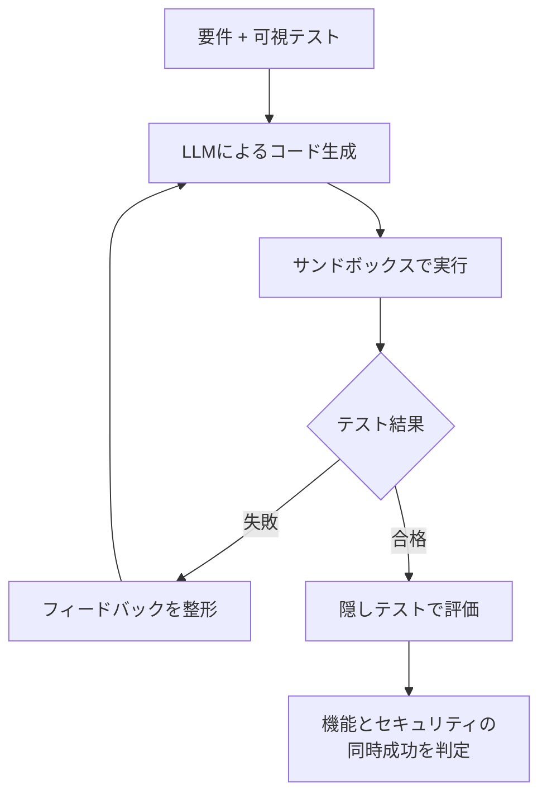

LLMにコードを書かせるとき、セキュリティテストを「あとで通すもの」ではなく「先に渡す実行可能な仕様」として扱うと何が起きるのか。arXivに公開された論文 [Security Tests as Executable Specifications for LLM Code Generation](https://arxiv.org/abs/2608.09740) は、この問いを2,705回の実行軌跡で検証しています。

結論を先に言うと、**平均では効きます。ただし、効いたように見えて隠れた欠陥が残るケースが無視できない割合で存在します。**

この記事では、実験の設計、効果と副作用、そしてAIコーディングエージェントを運用するときに何を仕組みとして持つべきかを整理します。

*この記事の全体像。以下、順に解説します。*

## 3行でわかる結論

- セキュリティテストを生成前にプロンプトへ入れると、機能とセキュリティの**同時成功率が平均19.3ポイント改善**する。
- ただし条件によっては**悪化**する。可視テストだけに最適化する「テスト過適合」が起きるため。
- 可視テストに全合格しても隠しテストで落ちる割合は**5.6%〜18.8%**。テスト合格は安全の証明ではない。

## 検証の設計 — 「可視テスト」と「隠しテスト」を分ける

この検証で最も重要な設計は、テストを2種類に分離した点です。

| 種別 | 誰が見るか | 役割 |
| --- | --- | --- |
| 可視テスト (Visible Tests) | LLMに提示する | 実行可能な仕様として振る舞う |
| 隠しテスト (Hidden Tests) | 評価時のみ実行 | 過適合・暗記を検出する |

この分離がないと、「テストを渡したらテストが通るようになった」という同語反復しか観測できません。隠しテストを別に持つことで、はじめて「本当に安全になったのか、テストに合わせただけなのか」を切り分けられます。

検証の範囲は次のとおりです。

- ベンチマーク: CWEval、SALLM、CodeGuard+ の3種類
- 脆弱性カテゴリ: 16のCWE
- モデル: Qwen系およびDeepSeek系のモデルファミリー

テストが生成パイプラインと関わる位置は、大きく3か所あります。

1. **事前仕様としての提示**: プロンプトに要件と一緒にテストを入れる
2. **実行フィードバックループ**: 実行して失敗結果を戻す
3. **フィードバックの表現形式**: 生ログのまま渡すか、構造化して渡すか

以降は、この3か所それぞれで何が観測されたかを見ていきます。

## 1. 事前提示は平均で効き、局所で裏目に出る

可視テストをすべて事前提示した場合、9つのベンチマーク・モデル条件のうち**7条件で隠しテストのジョイント成功率（機能＋セキュリティの同時達成）が向上**し、全体平均で19.3ポイントの改善が観測されました。

一方で、次の条件では逆に成功率が悪化しています。

- SALLMタスクにおける Qwen2.5-Coder-7B-Instruct
- CodeGuard+ における DeepSeek-V4-Flash

悪化の中身が示唆的です。CWE-89（SQLインジェクション）の事例では、事前にテストを見たモデルが**可視テストは全パスする一方で、隠されたデータ整合性の要件を壊していました**。

これは直感に反するようで、実際には自然な挙動です。テストを提示すると、モデルの注意はテストが表現している範囲に寄ります。テストが仕様の一部しか書いていなければ、モデルはその一部だけを満たす解に収束します。

つまり **「テストを渡す」は「仕様を渡す」ではありません。渡したテストの網羅性が、そのまま生成物の網羅性の上限になります。**

## 2. 構造化フィードバックは「常に優れている」わけではない

失敗結果をどう返すかも比較されています。初期の生成候補を固定した上で、生ログをそのまま返す場合と、セキュリティ関連のエラーを抽出・優先順位づけして返す場合を比べた結果は次のとおりです。

| フィードバック形式 | 修復できたジョイント失敗 | ジョイント退行 |
| --- | --- | --- |
| 構造化 | 80件 | 0件 |
| 生ログ | 83件 | 3件 |

一見すると構造化が安全に見えます。しかし全体の勝敗は **6勝6敗453引き分け** で、実質的に同等でした。

さらに構造化側にも固有の副作用があります。

- セキュリティを優先しすぎて機能要件を落とす**機能的退行**が発生する（CWE-22でネストしたファイルの削除処理を取りこぼす、など）
- エラー箇所を明示することで、モデルが特定の行や変数に固執する（トンネルビジョン）。根本的なアーキテクチャの作り直しが必要な場面で、局所修正に閉じてしまう

**「フィードバックを整形すれば直る」は成り立ちません。** 整形は修復の方向を狭める操作でもあり、その狭さが正しいときだけ効きます。

## 3. 合格しても残る欠陥 —「安全の誤認」

最も実務に効く数字がこれです。

**可視テストに全合格したのに隠しテストで失敗した割合（TFOR: Test-Feedback Overfitting Rate）は、5.6%から最大18.8%。**

条件によっては5本に1本近くが、「テストは緑なのに脆弱」という状態でした。

これはセキュリティテストの性質から説明できます。機能テストは「この入力でこの出力になる」という肯定条件を確認します。対してセキュリティテストが本当に確認したいのは「**あらゆる悪意ある入力に対して不正な状態遷移が起きない**」という否定条件です。否定条件は有限個のテストでは原理的に証明しきれません。

にもかかわらず、少数の肯定的なテストが通っただけで「安全になった」と錯覚するリスクは高い。これは実際のOSSでも起きています。

- **Ollama のパストラバーサル ([CVE-2024-37032](https://nvd.nist.gov/vuln/detail/CVE-2024-37032))**: 表面的な機能テストは通過していた
- **runc のファイル記述子リーク ([CVE-2024-21626](https://nvd.nist.gov/vuln/detail/CVE-2024-21626))**: 不完全なバリデーションテストに合格したまま本番へ到達した

AIが書いたコードに限った話ではありません。ただしAIエージェントは「テストが通るまで直す」ループを高速に回せるぶん、**テストの網羅性が上限であるという構造がそのまま増幅されます。**

## 現場での運用指針

以上を踏まえると、AIコーディングエージェントにセキュリティテストを組み込むときの設計指針は3点に整理できます。

### 公開テストと隠しテストを、置き場所ごと分ける

エージェントのプロンプトに渡す「公開テスト」と、CI/CDや最終評価でのみ実行する「隠しテスト」を独立して用意します。

重要なのは、隠しテストを**エージェントが読めない場所に置く**ことです。同じリポジトリの同じディレクトリに置けば、コンテキストに入った時点で可視テストと同じものになります。分離の実効性はファイル配置と権限で担保します。

### 「片方だけの改善」を進捗と見なさない

構造化フィードバックによる局所的なセキュリティ修正は、既存の機能を壊しえます。修正ごとに機能要件とセキュリティ要件の**ジョイント評価**を必須とし、セキュリティだけが改善した状態を合格にしないことです。

判定を「機能 AND セキュリティ」に固定するだけで、上の表にあった機能的退行は検出できます。

### 可視テストが全緑なら、ループではなくテストを増やす

可視テストがすべて通っているのに隠しテストが落ちている状態は、**フィードバックループを回しても改善しません**。モデルに与えられている情報の中には、直すべき欠陥が表現されていないからです。

この状態で必要なのは、ループの回数ではなくカバレッジそのものの拡張です。

- メタモルフィックテスト（入力を変換したときの関係性を検査する）
- 独立したファジング
- 攻撃者視点の否定条件を追加する

TFORが高いことが観測できているなら、それは「もっと直せ」ではなく「もっと違う角度から試せ」というシグナルです。

## 残る問い

この検証でも解けていない論点が2つあります。運用設計をするうえで、ここは自前で判断が必要な領域です。

- 可視テストでは表面化せず隠しテストでのみ発現する欠陥について、**未知の攻撃ベクトルをどうやってLLMに推論させるか**。テストを増やす以外の手立てがあるか。
- 単一の関数・モジュールを超えて、**複数ファイルにまたがるステートフルな脆弱性やリポジトリ全体のアーキテクチャ修復**に、テスト実行フィードバックはどこまでスケールするか。

いずれも、対象が「1つの関数」から「動いているシステム」に広がるほど難しくなります。現時点では、モジュール単位で得られた知見をそのままリポジトリ全体に一般化しない、という慎重さが妥当です。

## まとめ

- セキュリティテストを生成前の実行可能仕様として渡すと、機能とセキュリティの同時成功率は平均19.3ポイント改善する。ただし条件によっては悪化する。
- 悪化の正体はテスト過適合。**渡したテストの網羅性が、生成物の網羅性の上限になる。**
- フィードバックの構造化は退行を抑えるが、機能の取りこぼしとトンネルビジョンを招く。生ログとの総合成績は同等。
- 可視テスト全合格でも5.6%〜18.8%が隠しテストで落ちる。**テストが緑であることは安全の証明ではない。**
- 運用では「隠しテストの物理的分離」「機能とセキュリティのジョイント判定」「全緑ならループではなくテスト拡張」の3点を仕組みとして持つ。

AIにコードを書かせる体制で本当に効くのは、モデルの選定でもプロンプトの工夫でもなく、**モデルから見えないところに評価軸を置けているか**だと言えそうです。

この記事が少しでも参考になった、あるいは改善点などがあれば、ぜひリアクションやコメント、SNSでのシェアをいただけると励みになります！

## 参考リンク

- [Security Tests as Executable Specifications for LLM Code Generation: Benefits, Trade-offs, and Coverage Limits (arXiv:2608.09740)](https://arxiv.org/abs/2608.09740)
- [CVE-2024-37032 — Ollama のパストラバーサル](https://nvd.nist.gov/vuln/detail/CVE-2024-37032)
- [CVE-2024-21626 — runc のファイル記述子リーク](https://nvd.nist.gov/vuln/detail/CVE-2024-21626)
