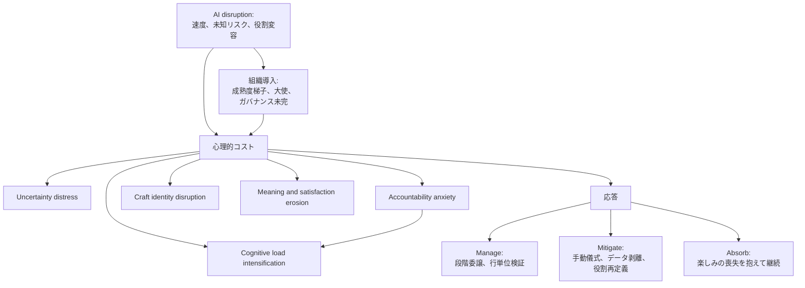

生成AIの導入効果を、利用量や生成量で測っている組織は少なくありません。
しかし、規制ドメインのソフトウェア企業で導入から約1年後に聞いた声は、別の場所にコストが残っていることを示します。

Alami、Paja、Tiwari の論文 *The Psychological Costs of Artificial Intelligence Adoption in Software Engineering*（[arXiv:2609.03456](https://arxiv.org/abs/2609.03456)、2026-09-03 投稿）は、デンマークの大規模ソフトウェア企業 SoftHouse（仮名、約1,200人）を対象にした質的単一ケースです。
半構造化面接は N=21、member checking は12人、関係者会議は5回です。
実務者は AI そのものに反対しているわけではありません。
説明責任、職能アイデンティティ、仕事の意味、認知負荷、不確実性としてコストを負っています。

この記事では、調査の条件と限界を先に置いたうえで、5つの心理的コスト、役割差、実務者の応答、他研究との食い違いを整理します。
読み終えると、発注側が利用量以外に足すべき評価軸と、その逆転条件が分かります。

*この記事の全体像。以下、順に解説します。*

## 何が結論で、何が結論ではないか

この論文が支えるのは、次の範囲です。

- SoftHouse 型の現場（規制、品質規範、成熟度梯子、ガバナンス未完）では、導入1年後に説明責任不安と検証労働が中核として観察される
- 評価を利用量に置くと、このコストは見えない
- ソフトウェアエンジニア（n=10）では、説明責任不安、クラフト破壊、意味侵食、不確実性が面接コード上 10/10 で現れる

次は支えません。

- 業界一般の発生率
- 普遍的な因果
- 「満足は一貫して悪化する」
- 「実務者一般が同じ5コストを負う」
- 提案された組織施策が効くこと（著者は介入効果を評価していません）

使う側の判断としては、同型の現場で、利用量や生成量だけで測らず、検証時間、判断裁量、責任への納得感を評価軸に足す、が現時点の実務含意です。
全社 KPI の置換までは、確信度が足りません。

## 調査の条件

対象は holistic single case（Yin 2018, common case）です。
企業は規制ドメイン（公衆衛生、行政、税など）で、製品は50か国超、Scrum を20年以上使っています。
ソフトウェアエンジニアは workforce の約50%です。
データ収集は 2026-01 から 2026-08、分析は帰納的コーディング（Miles et al.）です。
面接は平均50分、約290ページ、音声17時間40分です。

| 項目 | 一次の値 |
|---|---|
| 企業規模 | 約1,200人（論文は概数記号なし） |
| 面接 | N=21 |
| 役割 | SE 10、architect 3、testing 3、senior PM 2、AI program director 1、BU head 2 |
| 募集 | AI program director 経由の志願。組織には匿名（director と第一著者は知る） |
| 性別 | 女性5、男性16 |

サンプルはベテラン偏重です。
業界経験の中央値は20年です。
論文本文は 19/21 が10年超と書き、Table 2 を数えると Exp≥10 は 20/21（P20 の経験2年のみ除外）です。
Junior は P20 のみです。
在籍年数は本文中央値 9.5、Table 2 をソートすると中央値 10 です。
ベテラン偏重という含意は、数え方を変えても変わりません。
若手育成へ有病率をコピーできない理由は、ここにあります。

導入は 2025-01 です。
GitHub Copilot を約3か月で品質不満により破棄し、Claude Code と Claude Desktop に置換しています。
強制ではなく experiment-and-share です。
成熟度モデルは 1 から 5（novice から agentic）です。
SE の 50% adoption 目標は未達です。

論文が導入で置く産業数字は、本論文の発見ではありません。

- Stack Overflow 2025: 「use or plan to use」84%（2024 は76%）。当該問の回答は 33,662（全体 49,009 の 68.7%）。All の内訳は現在使用 78.5% と計画 5.3%（[公式 AI 章](https://survey.stackoverflow.co/2025/ai/) と [methodology](https://survey.stackoverflow.co/2025/methodology/)）
- DORA 2025: 技術職 約5,000人。採用 90%（前年比 +14ポイント）。80%超が生産性向上の自己申告（[Google Keyword ブログ 2025-09-23](https://blog.google/innovation-and-ai/technology/developers-tools/dora-report-2025/)）

会議採録は一次未確認です。
ACM DOI `10.1145/nnnnnnn.nnnnnnn` はプレースホルダです。
ライセンスは CC BY 4.0 です。

## 心理的コストはツールの有無では生まれない

心理的コストは「AI がある／ない」では決まりません。
AI の特性と組織条件が交差し、残された説明責任と減った生成的エージェンシーのあいだに生じます。

組織条件はコストを「作る」というより「増幅する」と読むのが論文の骨格です。
説明責任不安は検証労働へ翻訳されます。
P19 は、責任が無ければもっと速い、と述べます。

著者が置く5コストは次です。

| コスト | 面接で見える形 |
|---|---|
| **Uncertainty distress** | 知識が陳腐化する速度。成熟度測定が個人の遅れとして可視化される |
| **Accountability anxiety** | 生成物に立てない。ガバナンス未完と「we trust you」文化が増幅する |
| **Cognitive load intensification** | 行単位レビューが常態化する |
| **Craft identity disruption** | 書く人から、促して読む人へ役割がずれる |
| **Meaning and satisfaction erosion** | 楽しみと意味が職務の外へ押し出される |

**verification tax**（検証税）は第6コストではありません。
説明責任不安と認知負荷の合成です。
P12 は次のように述べます。

> look through the result line by line, I'm accountable

P7 は生成物に立てない感覚を、次のように述べます。

> not being able to fully vouch

P2 は負荷軽減と不安の同時発生を、次のように述べます。

> eases the load, but it increases the anxiety

不確実性の増幅例として、P1 は measuring AI maturity が uncomfortable だと述べ、P19 は level 4 へ push されると述べます。
成熟度梯子は学習の地図になり得ますが、個人評価に直結すると遅れの可視化装置になります。

## 役割によってコストの出方が違う

Table 7 は、役割内で当該コストの First Cycle コードが1つ以上あった人数です。
統計比較は著者自身が禁じます。
有病率ではなく、面接コードの出現です。

| 役割 | 説明責任不安 | クラフト破壊 | 意味侵食 | 認知負荷 | 不確実性 |
|---|---|---|---|---|---|
| Senior Management (n=5) | 2/5 | 0/5 | 0/5 | 0/5 | 3/5 |
| Architecture (n=3) | 0/3 | 1/3 | 1/3 | 1/3 | 0/3 |
| Testing (n=3) | 1/3 | 0/3 | 1/3 | 0/3 | 3/3 |
| Software Engineers (n=10) | 10/10 | 10/10 | 10/10 | 7/10 | 10/10 |

解釈の鍵は **agency displacement** です。
コストは「AI を使う量」より、役割の中核生成活動が置換される程度に結びつく、という読みです。

ソフトウェアエンジニアでは、生成から評価へのずれが前景化します。
P7 は役割の変化を次のように述べます。

> software engineer who writes code → who prompts an AI and then reads the code

テスターは補完として享受しうる例があります（P10）。
建築家はプロトタイプ到達の拡張として前向きな例があります（P17）。
tester と architect はいずれも n=3 で探索的です。
経営層では不確実性が相対的に見え、クラフト破壊と意味侵食は Table 7 上 0/5 です。
同じ導入でも、守る資源が役割ごとに違います。

## 実務者の応答は抵抗ではない

実務者が守る資源は agency、competence、professional identity です。
応答は3種に整理されます。

**Manage** は、ループに残ることで制御を残します。
差分レビュー、複雑度で委譲を分ける、意図的な減速がここに入ります。

**Mitigate** は、露出と技能を守ります。
許可待ちの自己制限、クラウド投入前のデータ剥離、MCP 拒否（P9）、手動コーディング儀式、self-then-AI がここに入ります。
P7 は技能維持を次のように述べます。

> if you don't use it, you lose it

**Absorb** は、解消せず続けます。
P7 は次のように述べます。

> I don't. I just keep going

楽しみを有給の外へ移す、もこの応答です。

これは導入拒否ではありません。
受容したままコストを運ぶ動きです。
強制導入であれば、manage と mitigate の可用性は変わります。
SoftHouse 自体は強制ではなく experiment-and-share です。

## 他研究は「満足が悪化する」を支持しない

説明責任の残差を測っていない生産性研究は、この論文と問いが違います。
同じ「AI 導入」でも、測っているものが違えば結論は衝突して見えます。

支持側に置ける材料は、次です。

- 論文本文の一貫した引用と Table 7（SE 層）
- Stack Overflow 2025 同一一次: 精度不信 46% が信頼 33% を上回る。almost right 66%。デバッグがより時間がかかる 45%。経験者ほど highly distrust が高い
- DORA 2025 公式ブログ: 生産性自己申告と並行して、30% は AI をほとんど、または全く信頼しない
- METR RCT（[arXiv:2507.09089](https://arxiv.org/abs/2507.09089)）: 熟練 OSS 16人、246タスクで、AI 許可は所要時間 +19%。事前は 24% 短縮を予想し、事後も 20% 短縮したと誤認。品質基準の高い自リポジトリでの完了時間 RCT であり、説明責任不安や行単位検証工数そのものの測定ではない。early-2025 スナップショット。METR 自身が 2026-02 追試を選択バイアスで信号不良と宣言

反証側に置ける材料は、次です。

- DORA 2024 Insights: genAI 利用が広い開発者は flow、job satisfaction、productivity が高く burnout が低い、と[公式ページ](https://dora.dev/insights/value-of-development-work)が書く。同じ分析で valuable work 時間は減る
- GitHub Copilot 利用者サーベイ（2,000人超）と CACM 2024（[Ziegler et al.](https://doi.org/10.1145/3633453)）: fulfillment、flow、反復負荷低下の自己報告。ジュニアの知覚ゲインが大きい。自己選択利用者のベンダー研究
- 3社フィールド RCT（Cui et al., Management Science, 2026-02-27 online）: N=4,867。完了タスク +26.08%（SE は 10.3%）。経験の浅い開発者ほど採用もゲインも大きい。well-being 尺度ではない（[DOI 10.1287/mnsc.2025.00535](https://doi.org/10.1287/mnsc.2025.00535)）

論文自身の §7 も、規制文化、ベテラン偏重、横断デザイン、役割アンバランスを限界として書きます。
若手は異なりうる、と著者自身が述べます。
5コストは technostress と部分対応し、論文 Table 9 もそれを認めます。
新規性は、SE の説明責任とクラフトへの接続にあります。

「コストが存在する機序」は残ります。
「満足は一貫して悪化する」「実務者一般が同じ5コストを負う」「施策は効く」は持ちません。

未解決として残るのは、介入効果、3年から5年の skill atrophy と attrition、ジェンダー差（女性5で分析せず）です。
tester と architect の有病率、若手育成への直接適用は、裏付けが弱い領域です。

## 発注側が足すべき評価軸

対象が SoftHouse に近い場合（規制、品質をアイデンティティにしたエンジニア、成熟度梯子、ガバナンス未完）に限って、次が現時点の実務含意です。

1. AI 活用を利用量と生成量だけで測らない
2. 検証時間をキャパシティに明示する（著者の verification tax）
3. 委譲の裁量を残す。線引きできない説明責任は個人へ押し出さない
4. 成熟度レベルを個人評価に直結させない
5. 役割別に設計する。SE は生成的エージェンシーの残し方、テスターは安定 use case、経営は目標とガバナンスの同時整備

評価指標の追加は、この論文の確信度でブロックされません。
全社 KPI の置換は、確信度不足です。

逆転条件は次です。

- 出力がレビュー可能で、専門性、時間、支援が足りれば、同じ不安と検証負担は弱まりうる。効果は独立検証されていません（論文 §5.3）
- 若手中心、非規制、役割の中核生成が置換されない現場へ、この有病率をコピーしない
- 強制導入は manage と mitigate の可用性を変える
- 施策の効果測定が否定的なら、評価軸追加を止める

若手育成への接続は、この論文の直接の発見ではありません。
この論文はベテランのクラフト喪失を前景化します。
育成設計へ持ち込むなら、含意は「検証できる基礎なしに生成を先に置くと、責任を引き受ける職務が成立しない」です。
若手が同じ喪失を味わうかは未解決です。

次の調査として著者側が残すのは、検証時間を正規工数にしたチームの burnout と欠陥率、経験年数層化です。
発注側が自組織で測るなら、まずは検証時間、判断裁量、責任への納得感の3つを、利用量と並べて見るところからで足ります。

## まとめ

SoftHouse 型の規制現場では、生成AI導入から約1年後、実務者は AI 自体への反対ではなく、説明責任不安と検証税としてコストを負っていました。
ソフトウェアエンジニア層では、説明責任、クラフト、意味、不確実性が面接コード上ほぼ全例で現れます。
これは業界一般の発生率ではなく、ベテラン偏重の単一ケースです。
施策の有効性も未検証です。

同型の現場では、利用量だけで成功を定義すると、残された説明責任と減った生成的エージェンシーが見えません。
検証時間をキャパシティに載せ、委譲の裁量を残し、成熟度梯子を個人評価から外す。
この3つは、KPI 置換ではなく評価軸の追加として、今の証拠強度に見合います。
若手中心や非規制の現場へ、同じ有病率をコピーしないでください。

この記事が少しでも参考になった、あるいは改善点などがあれば、ぜひリアクションやコメント、SNSでのシェアをいただけると励みになります！

## 参考リンク

- Alami, A., Paja, E., Tiwari, A. (2026). The Psychological Costs of Artificial Intelligence Adoption in Software Engineering. arXiv:2609.03456v1. https://arxiv.org/abs/2609.03456
- Stack Overflow. (2025). Developer Survey, AI. https://survey.stackoverflow.co/2025/ai/
- Stack Overflow. (2025). Methodology. https://survey.stackoverflow.co/2025/methodology/
- Google / DORA. (2025-09-23). How are developers using AI? Inside our 2025 DORA report. https://blog.google/innovation-and-ai/technology/developers-tools/dora-report-2025/
- DORA. (updated 2025-03-05). Insights: The value of development work. https://dora.dev/insights/value-of-development-work/
- Becker, J., Rush, N., Barnes, B., Rein, D. (2025). Measuring the Impact of Early-2025 AI on Experienced Open-Source Developer Productivity. arXiv:2507.09089. https://arxiv.org/abs/2507.09089
- Ziegler et al. (2024). Measuring GitHub Copilot's impact on productivity. Communications of the ACM. https://doi.org/10.1145/3633453
- Cui et al. (2026). Management Science 掲載の3社フィールド RCT。https://doi.org/10.1287/mnsc.2025.00535
