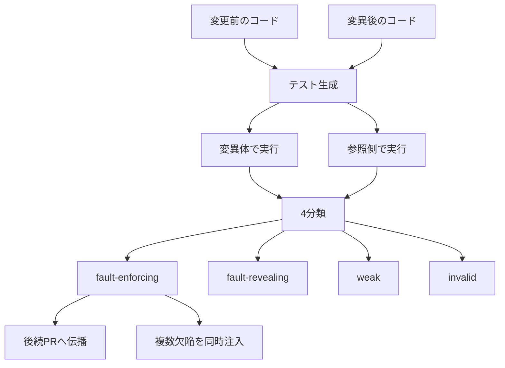

回帰テストは、変更の前に成り立っていた振る舞いをテストとして残し、後の変更でそれが壊れたことを失敗として知らせます。
LLM にこのテストを書かせる最近の方式は、変更差分と変更後のコードを渡し、そのコードの上で通るテストを採用します。
Mohammadali Charoosaei、Cedric Richter、Mike Papadakis（いずれもルクセンブルク大学 SnT）は、その採用されたテストが、欠陥のあるコードの振る舞いを期待値として固定する状態を fault-enforcing と呼びました。
この記事では、2026年10月8日投稿の arXiv:2610.11835 に沿って、実験の置き方、4分類、件数、後続の履歴での残り方、期待値の根拠の置き方を整理します。
論文はプレプリントで、2026年10月10日時点では査読付き会場への採録を確認できていません。

*この記事の全体像。以下、順に解説します。*

## LLMが実装から作る回帰テストとは

対象は、変更後の実装を見て回帰テストを書き、その実装の上で成功したテストを残す生成です。
測定した論文は *On the Risks of using LLM-Generated Tests for Regression Testing*（arXiv:2610.11835v1）です。
実験は、SciPy、Qiskit、pandas のマージ済み pull request に人工的な欠陥を入れ、Claude Haiku 4.5 に変更箇所のテストを書かせ、そのテストを後続の履歴に載せて分類しています。

### 生成器が受け取るもの

生成器が見るのは、変更前のコードと、変異を入れた変更後コードと、その差分です。
分類の参照側は、変異を入れる前の変更後コードです。
この参照側は、生成器の入力に入っていません。

テスト生成はカバレッジ誘導です。
モデルは Claude Haiku 4.5（`claude-haiku-4-5-20251001`）で、修正は最大 6 turn です。

追跡は 2 本あります。
1 本は、個々の fault-enforcing テストを後続の pull request へ伝播します。
もう 1 本は、複数の pull request の欠陥を 1 つのコードに同時に載せます。

図の「参照側」は、変異を入れる前の変更後コードです。
「後続PRへ伝播」は、同じ変異を後続の pull request に載せる追跡です。
「複数欠陥を同時注入」は、複数の pull request の欠陥を 1 つのコードへ同時に載せる追跡です。

### 実験に残した欠陥

残した欠陥は、pull request が触った関数へ入れた変異です。
次の 2 条件を両方満たしたものだけを残しています。

- プロジェクト既存のテストを生き残る
- 同じ系統のモデルが、その変異を検出するテストを書けた

評価に使った pull request は 145 件です。
内訳は SciPy 50、Qiskit 50、pandas 45 です。
候補の母集団は SciPy 121、Qiskit 135、pandas 45 で、pandas は全件、残り 2 プロジェクトは無作為抽出です。

### 4つの実行結果

各テストは、欠陥入りのコードと、欠陥を入れる前の変更後コードの両方で実行します。
分類は、その成否の組み合わせだけです。

| 分類 | 変異体 | 変異前の変更後コード | 論文上の読み |
|---|---|---|---|
| fault-revealing | 失敗 | 成功 | 入れた欠陥を検出する |
| fault-enforcing | 成功 | 失敗 | 欠陥側の振る舞いを期待値にしている |
| weak | 成功 | 成功 | 両方で通り、欠陥を区別しない |
| invalid | 失敗 | 失敗 | 両方で落ちる |

表の行は、次のように読みます。
境界で誤って負の値を返す変異を入れ、テストが「戻り値は負である」と断言したとします。
変異体で成功し、変異前の変更後コードで失敗するなら fault-enforcing です。
変異体で失敗し、参照側で成功するなら fault-revealing です。
両方で成功なら weak、両方で失敗なら invalid です。
これは表の 4 行を一文ずつ当てはめた読み方です。

通常の回帰テスト生成は、生成器が見たコードの上で成功したテストだけを残します。
その規則の下で残るテストは、weak か fault-enforcing です。
fault-revealing は欠陥側で失敗します。
論文は、修正予算が尽きて欠陥側で失敗したままのテストも分類に残しています。
そのため fault-revealing と invalid が、後述の百分率の分母に入ります。

## 分類できたテストの内訳

Table 3 の件数は次のとおりです。
括弧は、そのプロジェクトの分類 pair に対する割合です。

| 分類 | SciPy（3,483） | Qiskit（3,355） | pandas（9,578） |
|---|---:|---:|---:|
| fault-revealing | 90（2.6%） | 81（2.4%） | 455（4.8%） |
| fault-enforcing | 587（16.9%） | 281（8.4%） | 1,614（16.9%） |
| weak | 2,251（64.6%） | 2,333（69.5%） | 3,961（41.4%） |
| invalid | 555（15.9%） | 660（19.7%） | 3,548（37.0%） |

3 プロジェクトの分類 pair の合計は 16,416 です。
内訳は 3,483 + 3,355 + 9,578 です。

各プロジェクトで、fault-enforcing の区間下限は fault-revealing の区間上限より上にあります。
点推定の比は 3.5 倍から 6.5 倍です。
差がある pull request では、fault-enforcing の方が多いものが SciPy 30/34、Qiskit 26/32、pandas 28/33 です。
符号検定と Wilcoxon の符号順位検定はいずれも p<0.001 で、matched-pairs rank-biserial は 0.81 から 0.87 です。

少なくとも 1 件の fault-enforcing が出た pull request は 145 件中 92 件です。
内訳は SciPy 33/50、Qiskit 30/50、pandas 29/45 です。
分類 pair を持つ pull request のうち fault-enforcing がゼロなのは、SciPy 12/45、Qiskit 16/46、pandas 8/37 です。

論文が極端な例として挙げる率は、SciPy #21505 の 77.8%（9 pair）、Qiskit #12979 の 75.0%（4 pair）、pandas #59114 の 84.6%（39 pair）です。

例外を期待する断言（`pytest.raises` など）は、fault-enforcing の 37% から 57% を占めます。
fault-revealing では 3% から 9% です。
例外の断言を除いても、fault-enforcing は fault-revealing の 4.0 倍、4.3 倍、2.6 倍です。
この順は、論文のプロジェクト順である SciPy、Qiskit、pandas です。

invalid のうち、import や収集に失敗するのは 4,763 件中 249 件（5.2%）です。
残りは、両方の版で通常の失敗として実行されています。
4,763 は、3 プロジェクトの invalid の合計です。

既存スイートが、変更箇所のテスト可能な変異を kill した割合は、SciPy 58.6%、Qiskit 54.0%、pandas 16.0% です。
生存したもののうち killable だった割合は、同じ順で 40.9%、41.3%、72.3% です。
8 回目の試行が新たに加える killable は、同じ順で 1.3%、4.3%、2.1% です。
論文は、予算内に検出の大半が入ったと書いています。

## 後続の履歴に残る割合

Table 4 は、fault-enforcing の pair を後続の pull request へ伝播した最終状態です。
Qiskit の伝播数 279 は、分類上の 281 より 2 少ないです。
論文は、各プロジェクトの最後の pull request は後続が無く、伝播元にならない、と注記しています。
結論が追った 2,480 pair は 587 + 279 + 1,614 です。

| 最終状態 | SciPy | Qiskit | pandas |
|---|---:|---:|---:|
| テストがまだ欠陥を受け入れる | 502（85.5%） | 231（82.8%） | 1,467（90.9%） |
| テストが欠陥を検出する側に変わる | 0 | 0 | 7（0.4%） |
| どちらでも失敗しなくなる | 1（0.2%） | 0 | 0 |
| 変異箇所が書き換わり、判定不能 | 84（14.3%） | 48（17.2%） | 140（8.7%） |

変異をまだ適用できる pair に限ると、99.5% から 100% が受け入れ続けます。
Kaplan–Meier 推定は、後続 5、10、20、30、40 pull request の時点で、SciPy と Qiskit が 100%、pandas が 99.5% です。
pandas の 7 件について論文は、テストが意図した仕様を学習したのではなく、後続の変更が空文字や不正な引数を例外にしたことで検出された、と具体例を書いています。
追跡期間の中央値は 4、6、9 か月、最長 14 か月です。
本文はこの 3 つの中央値を、プロジェクトの並びで述べています。

開発者テストが後続で欠陥を踏んだ pair は、SciPy 213/587（36.3%）、Qiskit 17/279（6.1%）、pandas 123/1,614（7.6%）です。
議論節は、履歴の終わりまでプロジェクトのテストが一度も失敗していない欠陥が 64% から 94% だと書きます。
これは上の捕捉率の補数（63.7%、93.9%、92.4%）と一致します。
SciPy では、生成テストが受け入れ続けているあいだに、プロジェクト側のテストが欠陥を踏んでいる pair が約 3 件に 1 件あります。

蓄積実験は、起点以降の pull request ごとに最大 1 件の fault-enforcing を、ファイルが重複しない範囲で同時に注入します。
完了した trial は 246 です。
内訳は SciPy 85、Qiskit 77、pandas 84 です。
起点は 91 pull request で、各起点から最大 3 trial です。
平均チェーン長は、同じ順で 26.2、22.9、22.2 pull request です。

単独では欠陥を受け入れていたテストが、他の欠陥も同時にあると失敗に変わった評価は、44,974 件中 55 件です。
内訳は SciPy 0、Qiskit 51（0.37%）、pandas 4（0.03%）です。
結論の「最大 0.4%」は、この 0.37% を指します。
Qiskit の 51 件のうち 44 件は、1 つの起点の 2 trial に集中しています。

## 注意点

要旨の百分率は、分類の定義が先にないと分母を誤ります。
ここでは、見出しの幅と表の件数の対応、欠陥の種類、モデル、会場、複製パッケージを分けます。

### 8%から17%の分母

要旨の「生成テストの 8%–17% が fault-enforcing」は、分類できた mutant-test pair 全体に対する点推定の幅です。
分母は、生成した変異 60,780 件ではありません。
既存テストを生き残り、検出可能と判定され、テストを保持できた 16,416 pair です。
点推定は SciPy 16.9%、Qiskit 8.4%、pandas 16.9% で、これを丸めた幅が 8%–17% です。

pull request を再標本した 95% 区間は、これより広いです。
fault-enforcing は SciPy [8.4, 26.2]、Qiskit [5.6, 11.6]、pandas [12.8, 20.1] です。
Qiskit の区間下限 5.6% は、見出しの 8% より下にあります。
SciPy の区間は 26.2% まで開いています。
論文は、プロジェクトごとの点推定を正確な率として主張せず、向きと幅を主張すると書いています。

見たコードの上で成功したテストだけを残す生成器が実際にマージする集合は、fault-enforcing と weak だけです。
Table 3 から再計算すると、その集合に占める fault-enforcing は次のとおりです。

- SciPy 587/2,838（20.7%）
- Qiskit 281/2,614（10.7%）
- pandas 1,614/5,575（29.0%）

見出しの 8%–17% は、通常なら採用側に入らない invalid と fault-revealing を分母に含みます。
そのため、マージされるテストに占める割合より小さくなります。

件数の小さい pull request の率は、プロジェクト全体の率と並べて読みません。
前節の 77.8%、75.0%、84.6% は、pair 数が 9、4、39 の例です。

### 83%から91%が指す単位

要旨の「83%–91% がその後も通り続ける」は、Table 4 の survived に対応します。
値は SciPy 85.5%、Qiskit 82.8%、pandas 90.9% です。
要旨は “subsequent commits” と書きます。
方法節が追っている単位は、後続の pull request です。

要旨の「履歴の終わりまで 83%–92% が enforced」は、蓄積実験の終端で eligible だった件数を注入件数で割った比に対応します。
Table 6 の平均は SciPy 12.1/13.2、Qiskit 9.4/10.5、pandas 8.7/10.5 で、約 92%、90%、83% になります。
Figure 2 のキャプションは、SciPy の例として「平均 23 件を注入し 20 件が残る」と書きます。
Table 6 の終端平均は注入 13.2、eligible 12.1 です。
本文は、最長で同時 21 件から 24 件とも書きます。
キャプションの 23 と 20 がどの系列の平均かは、図の系列データが未確認のため、数値は Table 6 を正本にします。

### 14%から30%と別の検出率

「開発者のテストスイートは 14%–30% しか検出しない」は、蓄積実験で欠陥を単独でも再現できた捕捉率の丸めです。
捕捉率は Qiskit 13.8%、pandas 21.0%、SciPy 30.3% です。
個々の pair を後続へ追った別指標では、開発者テストが一度でも欠陥を踏んだ割合は SciPy 36.3%、Qiskit 6.1%、pandas 7.6% です。
結論節はこの後者を「Qiskit と pandas は 6%–8%、SciPy は 36%」と書いています。
2 つの検出率を、1 つの「14%–30%」には読みません。

### 欠陥、モデル、蓄積実験の範囲

選んだ欠陥は、実在したバグの再録ではありません。
標準的な変異です。
著者は、単純な変異は検出しやすく、検出可能なものだけを残すフィルタのため、fault-revealing 率は楽観的だと書いています。
fault-enforcing 率が実バグで同方向に偏るかは、論文は主張していません。
モデルは Haiku 4.5 の 1 つで、より強いモデルは未測定です。
著者は、指示への追従が強いモデルではこの結果が増幅しうると書き、評価は将来課題だと置いています。
蓄積実験について著者は、実在の欠陥が蓄積する様子のモデルではなく、意図的に不利なストレステストだと書いています。

### 会場、複製パッケージ、Figure 7

会場名は付いていません。
arXiv ページの DOI `10.48550/arXiv.2610.11835` は、pending registration と表示されています。
2026年10月10日時点で、ICSE、FSE、ISSTA のプログラムからこの題名の採録は確認できていません。
複製パッケージの URL は、論文第 9 節の figshare です。
同日の取得は WAF の challenge（HTTP 202）で止まり、145 件の一覧や表の再生スクリプトの中身は未確認です。

Figure 7 が SciPy #20284 として示す optimizer 判定の反転は、その pull request のコードベースへ注入した変異です。
`scipy/scipy#20284` は closed かつ merged（2024-03-29）で、題名は `ENH: stats.pearsonr: add array API support` です。
マージされた変更そのものが、その判定欠陥を含んでいたという意味には読みません。

## 他の測定が示す範囲

ここまでの件数を、実装を見て成功したテストだけを残す生成の読みに結びます。
そのあとで、別手順の研究がどこまで同じ読みを支えるかを分けます。

### この実験が支える読み

実装を見て、その実装の上で成功したテストだけを残す回帰テスト生成は、欠陥側の振る舞いを期待値にするテストを、欠陥を検出するテストより多く残します。
この読みは、次の 3 点に載っています。

- 3 プロジェクトで、fault-enforcing と fault-revealing の区間が重ならない
- 例外断言を除いても、比が 2.6 倍以上である
- 後続でも、生成テストがほとんど検出側に反転しない

同じ現象を、実装を見ないテスト生成と比べた先行があります。
Konstantinou、Tambon、Papadakis の arXiv:2607.05139（2026年7月6日投稿、同じ SnT）は、欠陥のあるコードの後にテストを作ると検出率が約 14% で、テストを独立に作ると 25% だと要旨に書いています。
Konstantinou、Degiovanni、Papadakis の arXiv:2410.21136（2024年10月28日投稿）は、LLM のテストオラクルが、期待した振る舞いより実際のプログラム振る舞いを捉えやすい、と要旨に書いています。
どちらも 2610.11835 の履歴追跡そのものではありません。
オラクルが観測した実装に寄る、という方向は先に報告されています。

### 別手順では割合が動く

同じ実行パターンを、Defects4J の実バグと複数モデルで測った研究では、割合は 8%–17% より低いです。
Zhao、Zhou、Cohen（トロント大学）の arXiv:2607.22883 は、HTML ヘッダに DOI `10.1145/3832204`、PACMSE Volume 3、ISSTA とあり、会議プログラムにも同題があります。
Table 4 は、欠陥コードを渡したときの全モデル平均を、misguided test（欠陥版で成功、修正版で失敗）137.69 件（3.84%）、effective test（欠陥版で失敗、修正版で成功）104.15 件（2.98%）と書きます。
モデル別の misguided は 2.32%（Qwen3-Coder-Plus）から 5.27%（Gemini 2.5 Pro）です。
base モデル平均は misguided 2.94% に対し effective 3.51% で、検出側が多いです。
reasoning モデル平均は misguided 4.61%、effective 2.54% で、検出側が少ないです。
修正済みコードを渡すと、misguided の平均は 16.46 件（0.46%）まで下がります。

この 3.84% は、2610.11835 の 8.4%–16.9% の再現ではありません。
Zhao らの分母は、Defects4J の実バグに対する全生成テストです。
カバレッジ誘導の 6 turn でも、既存テストを生き残った変異だけを残した pair でもありません。
読み取れるのは、欠陥を期待値にするテストは複数のフロンティアモデルでもゼロにならないことと、その割合がパイプラインで数倍動くことです。
「8%–17% が生成テスト一般の発生率」という読みは、ここで弱まります。

実装をプロンプトから外すと、誤った期待値は減りますが、消えません。
同じ論文は、欠陥コードだけを渡した平均 137.69 件が、そのコードから作った docstring に置き換えると 113.00 件になる（-1.15 パーセントポイント）と書きます。
有効なテストの平均個数は 104.15 から 186.77 に増えます。
docstring をコードと併記するだけでは、コードだけのときより misguided test が平均 8.39 個増えた、とも書きます。
docstring の材料も欠陥コードなので、実装を見ていない人手の仕様と同じものではありません。

別の LLM にテストを書かせても、人手のテストの代わりにはなっていない、という報告があります。
Leu、Oertel、Hebig の ESEM 2026 論文（LIPIcs DOI `10.4230/LIPIcs.ESEM.2026.11`、プログラムページは tentative と明記）の要旨は、Elixir で 5 つの LLM、459 実装、2,709 テストスイートを比べています。
実装と同じ LLM と別の LLM で差が無く、欠陥と旗が立った 247 実装のうち 99 は人手のテストだけが旗を立てた、と書きます。
この結果は「第二のモデルが独立した正解になる」を弱めます。
2610.11835 の mutant 実験の再現ではありません。

### 現場の欠陥固定率として読まない条件

8%–17% を現場の欠陥固定率として使う読みは、前節の分母、区間の幅、変異であること、判定不能の pair、会場と複製パッケージですでに弱まります。
それに加えて、論文第 6.1 節は、観測した振る舞いでオラクルを作る点では EvoSuite や Pynguin も同じだと書きます。
LLM 固有の現象だけではありません。
この実験が加えるのは、差分と文脈を見せる生成でも、その配置を回避できなかったところまでです。

## 期待値の根拠をどこに置くか

生成テストをやめる判断には、この論文は届いていません。
届いているのは、成功とカバレッジを、期待値が正しい証拠として扱わないことです。
論文の議論が開発者に書いている照合先は、仕様か pull request の説明であり、現在のコードが返す値ではありません。

想定する読者は、エージェントが足すテストの期待値を、どの根拠で確定するかを決める側です。
エージェントがエージェントを検査するテストでも、構造は同じです。
検査対象の実装、その実行トレース、その自己説明だけを見て期待値を書くと、fault-enforcing と同じ配置になります。
期待値の根拠は、課題文、禁止事項、人手の判定記録、障害の再現条件のように、被検査の実装を見ていない側に置きます。

実務上の切り分けは 4 つです。

1. 変更検出だけが目的で、今の実装を正しいと別に根拠づけられるときだけ、今の出力を期待値にしてよい。欠陥がありうる新規コードでは、この条件は満たせません。
2. マージ前に、断言している値を仕様、pull request の説明、既知の障害記録と突き合わせる。コードを実行した結果との一致は、この突き合わせの代わりにしません。
3. 失敗した生成テストを、成功するまで直してから採用する運用は、欠陥を検出するテストを捨て、欠陥を断言するテストを残します。論文が計測した 2.4%–4.8% の fault-revealing は、その運用では採用されない側にいます。失敗は、テストの不良とコードの不良の両方の候補として残します。
4. 仕様文だけを渡してテストを書く方式は、Zhao らの実験では misguided test を減らしました。仕様文を欠陥コードから起こすなら、仕様文側に欠陥が写っていないかを見る工程が残ります。別の LLM に同じ課題を渡すことは、Leu らの要旨の範囲では、人手のテストが旗を立てた欠陥の代替になっていません。

次の 3 つが揃うと、欠陥側の振る舞いを期待値にするリスクの読みは逆転します。

- 対象コードが、独立なテストで既に守られた回帰の固定であり、新しい欠陥を持ち込む変更ではない。
- 期待値の根拠が実装の外にあり、マージ前にその根拠と断言が照合されている。
- 実バグと、Haiku 4.5 以外のモデルで、2610.11835 と同じ生成手順の採用テストに占める fault-enforcing が、実務上の許容まで下がった測定が出る。Zhao らの 3.84% は別手順の全生成テストに対する値で、この条件の測定ではありません。

## まだ測れていないこと

- 実在したバグをマージした pull request で、同じ生成手順が fault-enforcing をどの割合で残すか。83%–91% は、後から注入した変異を生成テストがまだ受け入れる割合であり、歴史上のバグが修正されない確率ではありません。
- Haiku 4.5 より指示追従の強いモデルで、この論文の手順の割合が下がるか、論文が推測するように増えるか。Zhao らの別手順では、reasoning モデル平均の misguided（4.61%）は base 平均（2.94%）より高かったです。
- 人手の仕様文を渡し、欠陥コードを渡さない条件で、履歴上の survived がどこまで下がるか。Zhao らの docstring は欠陥コードから生成しています。
- Figure 2 キャプションの「平均 23 件中 20 件」と Table 6 の終端平均の対応。複製パッケージが取得できれば解消できます。
- 日本語の独立した批判や追試は、2026年10月10日の検索では見つかっていません。

## まとめ

LLM が変更後の実装を見て回帰テストを書き、その実装の上で通ったものだけを残すと、残るテストは weak か fault-enforcing です。
fault-revealing は欠陥側で失敗するため、その採用規則には入りません。
分類できた pair に占める fault-enforcing の点推定は、SciPy 16.9%、Qiskit 8.4%、pandas 16.9% で、要旨の 8%–17% はこの幅の丸めです。
成功したテストだけに限ると、同じ表から 20.7%、10.7%、29.0% になります。
後続で変異をまだ適用できる pair に限ると、99.5% から 100% が欠陥を受け入れ続けます。

成功とカバレッジは、期待値が正しい証拠にはなりません。
照合先は、仕様か pull request の説明です。
実バグでの同じ手順、Haiku 4.5 以外のモデル、査読付き会場への採録、複製パッケージの中身は、2026年10月10日時点で未確認です。

この記事が少しでも参考になった、あるいは改善点などがあれば、ぜひリアクションやコメント、SNSでのシェアをいただけると励みになります！

## 参考リンク

- Charoosaei, Richter, Papadakis. *On the Risks of using LLM-Generated Tests for Regression Testing*. arXiv:2610.11835v1. 2026-10-08. [abs](https://arxiv.org/abs/2610.11835) / [html](https://arxiv.org/html/2610.11835v1)
- 同論文第 9 節の複製パッケージ. [figshare](https://figshare.com/s/bcdd07ff46760fd254ec)
- Konstantinou, Tambon, Papadakis. arXiv:2607.05139. 2026-07-06. [abs](https://arxiv.org/abs/2607.05139)
- Konstantinou, Degiovanni, Papadakis. arXiv:2410.21136. 2024-10-28. [abs](https://arxiv.org/abs/2410.21136)
- Zhao, Zhou, Cohen. arXiv:2607.22883. [abs](https://arxiv.org/abs/2607.22883) / [DOI 10.1145/3832204](https://doi.org/10.1145/3832204)
- Leu, Oertel, Hebig. *Don't Bother to Use a Second LLM and Write Tests Yourself! A Study on Elixir*. ESEM 2026. [DOI 10.4230/LIPIcs.ESEM.2026.11](https://doi.org/10.4230/LIPIcs.ESEM.2026.11)
- SciPy pull request 20284（Figure 7 の注入先として論文が参照。マージ済みの実変更が当該欠陥だという意味ではない）. [scipy/scipy#20284](https://github.com/scipy/scipy/pull/20284)
