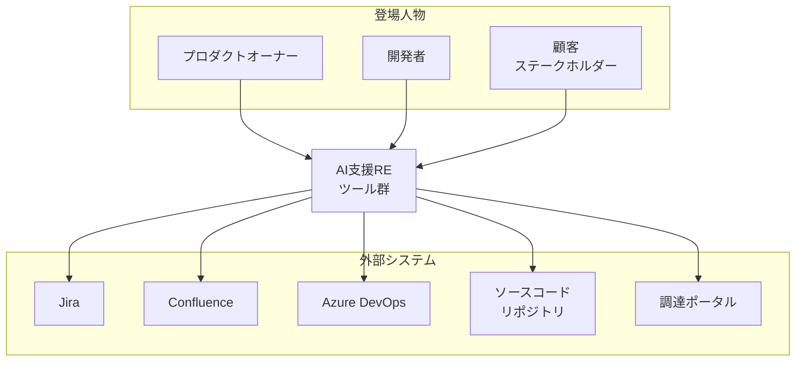
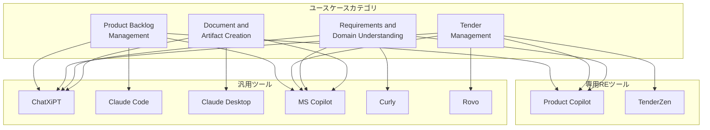
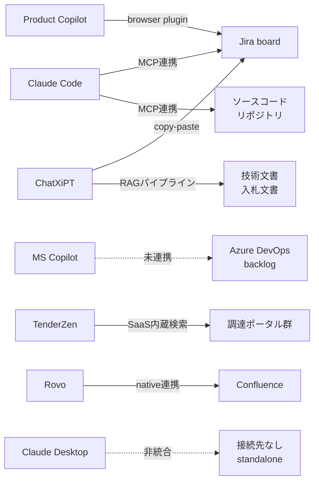
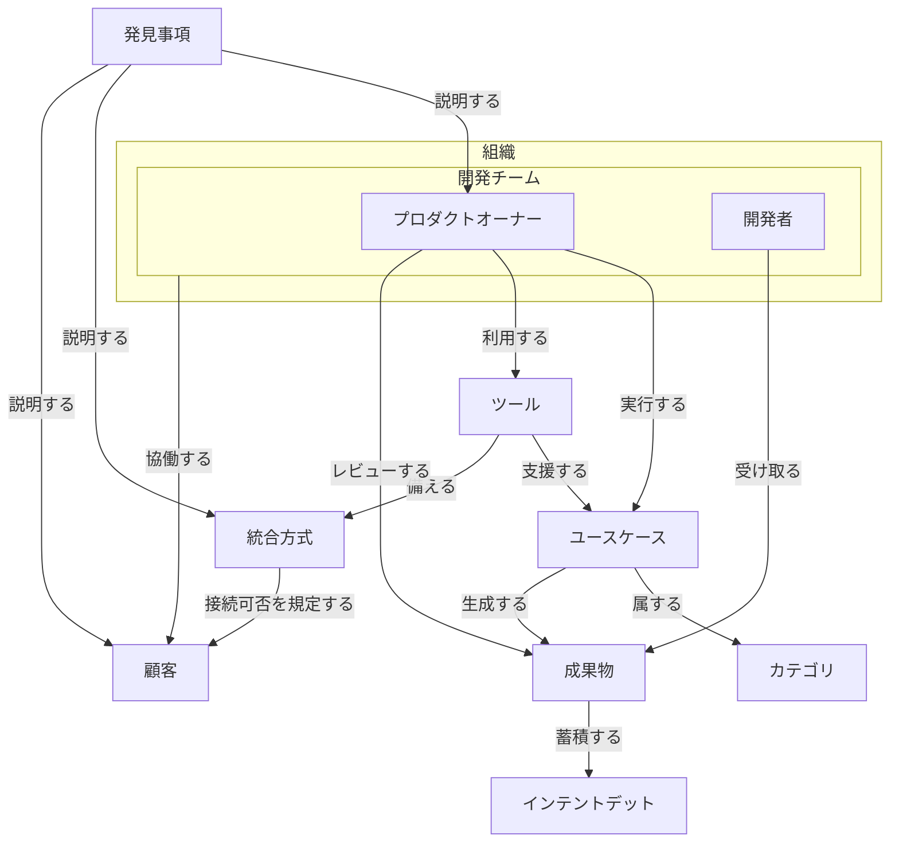
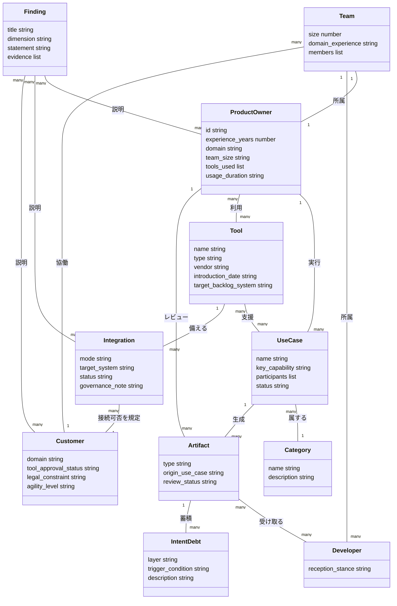
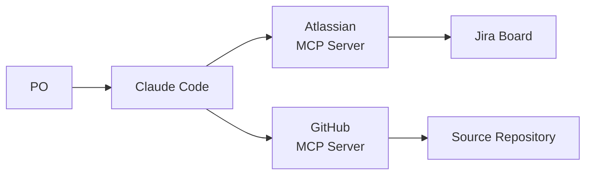
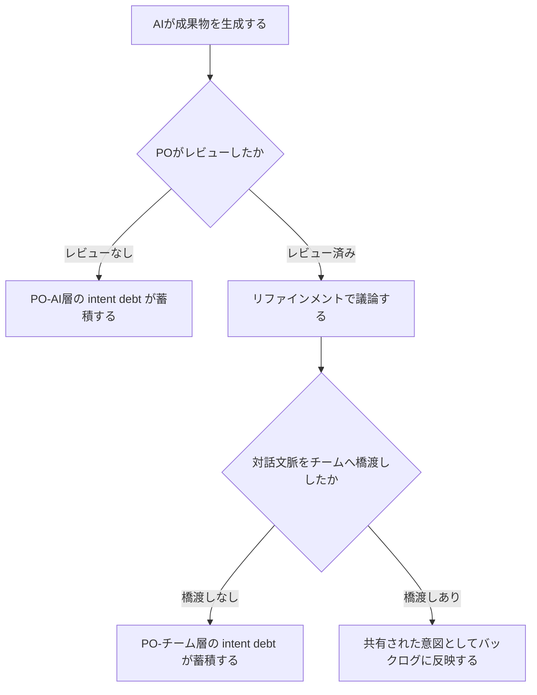

生成AIを要件定義（Requirements Engineering, RE）に使うと、何が変わるのでしょうか。

この記事は、中規模ソフトウェア企業 XITASO で、第1波5名・第2波3名の計8名のプロダクトオーナー（PO）に半構造化インタビューを行った実証研究 (arXiv:2606.01772) を、構造・データ・導入・運用の観点で整理したものです。論文が報告した事実と、再現に役立つ実装案（公式ドキュメント由来の補完）を分けて示します。

> 対象論文: Jan-Philipp Steghöfer, "Faster than the Team, Faster than the Customer: Tool Integration, Collaboration, and Organisational Lag in AI-assisted RE" (arXiv:2606.01772, v1 投稿 2026-06-01 / HTML版 2026-07-16)。
> 単一企業・PO 8名を対象にした記述的な質的研究であり、一般化を主張するものではありません。

## 概要

### 明らかにしたこと

- 調査対象は、中規模ソフトウェア企業 XITASO (ドイツ・アウクスブルク本社、2026年初で従業員240名)。
- 2024年の全社ユースケース調査 (11コミュニティから20ユースケース収集) を起点に、2025年末〜2026年春の2ラウンドで Product Owner (PO) 8名に半構造化インタビューを実施。
- 対象ツールは、社内チャットボット1種 + 商用ツール7種 (計8ツール)。
- 15ユースケースを4カテゴリ (バックログ管理 / 入札管理 / 要件・ドメイン理解 / 文書・成果物作成) に整理。
- リサーチクエスチョン (RQ) は「AI支援 RE がソフトウェア開発組織の RE 業務にどう影響するか」。

### 3つの発見

| 発見 | 内容 |
|---|---|
| ①PO-開発者関係への影響は複合的 | AI は成果物の品質の底を引き上げるが、開発者の受け止め方は一様でない。単一ユーザー対話モデルが、本来チームで行う協働的な練り上げを代替してしまうリスクがある |
| ②ツール連携こそが制約 | 制約要因は AI の性能でなく、既存ツールチェーンとの連携有無。連携がある場合は劇的な時間短縮、ない場合は手作業の回避策に頼る |
| ③AIは組織より速く進む | AI の恩恵は個々の PO に蓄積する一方、チームの業務プロセスや顧客側の受け入れ体制が追いつかず、変化の律速要因になる |

これら3つの発見から、論文タイトル「Faster than the Team, Faster than the Customer (チームより速く、顧客より速く)」が導かれています。

### 調査対象 PO の属性 (Table 1)

インタビュー対象は、AI を実際に活用し PO 経験5年以上という条件で選んだ8名 (17名の PO 中) です。

| ID | 経験 | ドメイン | チーム規模 | 主な利用ツール | 利用歴 |
|---|---|---|---|---|---|
| P1 | 5年 | 機械 | 約10 | ChatXiPT / Product Copilot / Claude Desktop | 8ヶ月 |
| P2 | 7年 | 医療機器・ヘルスケア | 約15 | ChatXiPT / Product Copilot | 2年超 |
| P3 | 10年 | 機械 | 5 | ChatXiPT / Product Copilot / Claude Code | 2年超 |
| P4 | 5年 | 公共・ヘルスケア | 3–8 | ChatXiPT / Product Copilot / TenderZen | 2年超 |
| P5 | 5年 | 公共 | 約15 | ChatXiPT / Product Copilot / Claude Desktop | 1年 |
| P6 | 10年 | 保険 | 約13 | MS Copilot / ChatXiPT | 2年 |
| P7 | 18年 | EC・機械 | 5–8 | ChatXiPT / Claude Code | 1年 |
| P8 | 8年 | 公共 | 7 | ChatXiPT / MS Copilot / TenderZen | 2年超 |

分析では、面談メモの翻訳に DeepL Pro を、コーディング基準の導出・不整合検出に Claude Sonnet 4.6 を、コーディングと発見事項の検証に Claude Opus 4.6 を使用しています (最終判断は著者が実施)。

### AI支援RE研究における位置づけ

従来の GenAI-RE 研究は、ラボ環境や単一タスク・単一エンジニアを対象にした評価が中心でした。本論文は Cheng ら (2026) のシステマティックレビューを引用し、GenAI-RE アプローチの9割以上が early-stage prototype (スタンドアロンのスクリプトや Web デモ) にとどまると述べています (Cheng らの原統計では 90.3% が conceptual/proof-of-concept 段階、production-ready は 1.3%。standalone 型が支配的という点は別集計です)。

本研究は、これに対して次の3点で異なる実証を提供します。

- **実務**: 実際の商用プロジェクトで使われているツールと運用を観察
- **縦断**: 2025年末に5名、2026年春に別の3名の PO へ2波でインタビューし、期間内のツール利用の変化を追跡 (同一 PO の再インタビューではなく、2時点の異なる標本を観察する反復横断デザイン)
- **マルチステークホルダー**: PO 単独でなく、PO-開発者-顧客の三者関係の変化を観察

著者は、実務の現場は GenAI-RE 文献が捉えている状態より先を行っていると位置づけています。実務者はすでにツール間連携を自前で組み立て、顧客側のガバナンスに対応し、役割分担を再交渉している段階にあります。

## 特徴

- **cross-tool 連携が文献より先行**: PO (P7) は、Claude Code を MCP (Model Context Protocol) 経由で Jira ボードとソースコードリポジトリの両方に接続し、実装のコンテキストを踏まえた要件の練り上げを実施しました。この用法は2025年末の第1ラウンド調査では見られず、2026年春の第2ラウンドで初めて出現しており、ツール連携の進化速度の速さを裏付けています。
- **single-user interaction model の副作用**: 調査した全ツール (ChatXiPT、Product Copilot、TenderZen 等) が「1人のユーザーが AI と対話する」設計です。この結果、対話で生まれた文脈がチームに伝わらず、PO と開発チームの間で成果物と意図の乖離 (intent debt、Storey 2026 の概念) が生じます。
- **tool integration が binding constraint**: 論文全体を通じて最も繰り返される訴えは、AI の性能不足でなく既存ツールとの連携不足です。連携がある場合 (TenderZen: 入札審査4時間→30分、Product Copilot: バックログ構築8時間→2時間) は劇的な効果が出る一方、連携がない場合 (P6: Azure DevOps 環境で MS Copilot 連携未許可) は AI がバックログに直接作用できません。
- **organisational lag という概念**: AI が個人の生産性を押し上げても、リファインメントの回数や顧客とのフィードバックサイクルといったチームレベルの業務プロセスは変わらないままという非対称が観察されています。変化は多くの場合、意図的な再設計でなく、PO が個別プロジェクトごとに静かに役割境界を再交渉する形で吸収されます。
- **ガバナンス制約としての連携**: ツール連携は技術的課題だけでなく、顧客側の許諾・ライセンス・法務上の制約 (「顧客が法的な理由で Product Copilot の統合を望まない」等) にも左右されます。
- **AI-as-teammate / intent debt 文献との整合**: Seeber ら (2020) の「AI をチームに組み込むとチームの性質自体が変わる」という研究アジェンダ、Webber (2024) の「AI teammate のパラドックス (個人効率は上がるがチームダイナミクスを損ないうる)」、Storey (2026) の intent debt (人と AI エージェントが安全にコードを進化させるために必要な、明示的な根拠・目標・制約の欠如) の3つの先行研究と、本研究の実証データが整合しています。

### 従来研究と本研究の対比

| 比較項目 | 従来のGenAI-RE研究 (ラボ/単一タスク/単一エンジニア) | 本研究が捉えた実務 (縦断/マルチツール連携/役割再交渉) |
|---|---|---|
| 評価対象 | 個別タスク (要件抽出、ユーザーストーリー生成等) の性能 | 実プロジェクトでの日常的なRE業務全体 |
| 設定 | ラボ環境・アンケート・短期セッション | 実企業 (XITASO) の商用プロジェクト、2025年末〜2026年春の縦断調査 |
| 対象者 | 単一エンジニア/単一ユーザー視点 | PO-開発者-顧客の三者関係 |
| ツールの扱い | スタンドアロンのスクリプト/Webデモが9割以上 | MCP等によるツール間連携 (Jira・コードリポジトリ・Confluence等) |
| 見えるもの | 個別タスクでのAI出力品質・精度 | 連携の有無による効果差、役割境界の再交渉、組織的な追随の遅れ |

## 構造

論文が観測した対象は、単一の製品システムではありません。XITASO 社内で実務上組み上がった「AI支援RE の実践パターン」です。そのため本セクションでは C4 モデルを次のように読み替えます (Pattern B-3)。

| C4 レベル | 通常の意味 | 本稿での読み替え |
|---|---|---|
| システムコンテキスト | システムと外部アクター/外部システムの関係 | RE 実務の登場人物と、AI支援REツール群が接続する社内外システム |
| コンテナ | システム内の主要な実行単位 | 4 ユースケースカテゴリと、それを支える専用/汎用ツール層 |
| コンポーネント | コンテナ内部の構成要素 | ツール統合方式 (MCP / browser plugin / copy-paste / RAG / 未連携) のドリルダウン |

### システムコンテキスト図



#### 登場人物

| 要素名 | 説明 |
|---|---|
| プロダクトオーナー | バックログ作成/リファインメント、入札対応、成果物作成を担う。インタビュー対象 8 名は全員この役割。 |
| 開発者 | PO が作成した要求成果物の受け手。品質向上を認識しないことがあり、AI生成物に感情的に抵抗することもある。 |
| 顧客ステークホルダー | 要求の発注者・承認者。AIツールの利用可否を統制し (例: Product Copilot 統合の拒否)、フィードバックサイクルの速度上限を規定する。 |

#### AI支援RE ツール群 (本体)

| 要素名 | 説明 |
|---|---|
| AI支援REツール群 | 4 ユースケースカテゴリと専用/汎用ツール層からなる、XITASO で実務運用されている AI支援RE の総体。単一システムではなく実践パターンの集合。 |

#### 外部システム

| 要素名 | 説明 |
|---|---|
| Jira | Jiraベースプロジェクトのバックログ管理システム。Product Copilot が browser plugin で、Claude Code が MCP でそれぞれ接続する。 |
| Confluence | wikiページ、過去プロジェクト実績、人材プロファイルの格納先。Rovo が Reference Matching で参照する。 |
| Azure DevOps | ADOベースプロジェクトのバックログシステム。P6 の案件では顧客が MS Copilot の ADO 統合を許可しておらず、AIツールが直接作用できない。 |
| ソースコードリポジトリ | Claude Code が MCP 経由で接続し、実装コンテキストに基づく要求リファインメントを可能にする。 |
| 調達ポータル | 欧州・ドイツの公共調達プラットフォーム群。TenderZen が Tender Discovery で巡回・事前フィルタリングする。 |

### コンテナ図



#### ユースケースカテゴリ

| 要素名 | 説明 |
|---|---|
| Product Backlog Management | Story Authoring・Backlog Bootstrapping・Backlog Refinement・Backlog Search の 4 ユースケースを含む。最も広く実践されるカテゴリで、Backlog Refinement は 8 名中 6 名が言及。P7 の Implementation-aware Requirements Refinement は、この Backlog Refinement を発展させた新しい実践 (Claude Code + MCP 連携) として位置づく。 |
| Tender Management | Tender Discovery・Tender Analysis・Reference Matching・Bid Authoring の 4 段階パイプライン。主に P4・P8 が担当。 |
| Requirements and Domain Understanding | Vision & Roadmap Derivation・Domain Exploration・Interview & Meeting Analysis の 3 ユースケース。詳細要求に先立つ理解形成を支援する。 |
| Document and Artifact Creation | Document Creation & Optimization・UI Prototyping・Documentation Generation・Change Summarisation の 4 ユースケース。UI Prototyping が中心的存在。 |

#### 専用REツール

| 要素名 | 説明 |
|---|---|
| Product Copilot | Jira 統合のバックログ作成/リファインメント支援ツール。既存バックログ・wiki・製品説明・履歴を継続的なコンテキストとして利用する。XITASO では 2025 年 7 月から稼働。 |
| TenderZen | 欧州調達ポータル横断の入札管理プラットフォーム。入札評価時間を 4 時間から 30 分に短縮した実績を持つ。XITASO では 2025 年 9 月から稼働。 |

#### 汎用ツール

| 要素名 | 説明 |
|---|---|
| ChatXiPT | LibreChat ベースの社内 GDPR 準拠チャットボット。複数フロンティアモデル (GPT-5、Claude Sonnet 等) にアクセス可能で、カスタム RAG パイプラインを内蔵する。 |
| Claude Code | MCP 経由で Jira ボードとソースコードリポジトリに同時接続する開発者向け AI アシスタント。P7 が実装コンテキスト対応のリファインメントに利用。 |
| Claude Desktop | プロジェクトのツールチェーンと非統合のスタンドアロン AI アシスタント。UI プロトタイピングとドメイン探索のブレインストーミングに使用。 |
| MS Copilot | Microsoft 365 環境のオフィスタスク支援ツール。Azure DevOps 統合の有効化可否は顧客の裁量に委ねられる。 |
| Curly | 音声/テキストベースの AI インタビューボット。構造化ステークホルダーインタビューを大規模に実施し、質問ごとに要約する。 |
| Rovo | Confluence 統合の Atlassian の AI 知識検索ツール。過去プロジェクト記述の検索・入札文脈への適合に利用される。 |

### コンポーネント図

論文の第二の発見「ツール統合こそが binding constraint」を、具体的な接続方式の対比として表現します。



| 要素名 | 説明 |
|---|---|
| Claude Code → Jira board / ソースコードリポジトリ (MCP連携) | MCP サーバー経由で Jira ボードとソースコードリポジトリに同時接続。PO は AI との対話で技術的制約・実現可能性・受け入れ基準を実装コンテキストに基づいて定義できる。2026 年 4 月の第 2 ラウンド調査で新規に確認されたパターンで、2025 年 12 月時点では存在しなかった。 |
| Product Copilot → Jira board (browser plugin) | ブラウザ拡張として Jira / Confluence に直接組み込まれ、手動のコピー&ペーストを回避する。既存チケットや Confluence ページを継続的なコンテキストとして読み込む。 |
| ChatXiPT → Jira board (copy-paste) | LibreChat ベースの社内チャットボット。コンテキストが限定的なタスク (ストーリーのリファインメント、ブレインストーミング) では、テキストを都度コピー&ペーストして利用する。プロジェクト管理ツールとの直接統合はない。 |
| ChatXiPT → 技術文書/入札文書 (RAGパイプライン) | LibreChat にカスタム RAG パイプラインを拡張し、複雑な技術文書を解析して回答に統合する。入札文書向けの用途はその後 TenderZen に置き換わった。 |
| TenderZen → 調達ポータル群 (SaaS内蔵検索) | 欧州・ドイツの公共調達ポータルを横断検索する専用 SaaS。連携が組み込み済みで、入札評価を4時間から30分に短縮する連携成功例。 |
| Rovo → Confluence (native連携) | Atlassian エコシステム内で Confluence に native 統合され、過去プロジェクト記述を検索する。ただし Reference Matching では TenderZen への引き渡しが手動で、ツール間連携は途切れる。 |
| MS Copilot → Azure DevOps backlog (未連携) | P6 のプロジェクトでは顧客が MS Copilot の ADO 統合を有効化しておらず、Product Copilot も ADO 非対応のため、P6 はバックログに直接作用する AI ツールを持たない。統合が「ツール能力ではなく実現可否の問題」であることを示す代表例。 |
| Claude Desktop → 接続先なし (非統合) | プロジェクトのツールチェーンと一切統合しない standalone 利用。UI プロトタイピングやブレインストーミングに使われるが、成果物を人手でバックログへ転記する必要がある。連携なし側の対照例。 |

## データ

論文には明示的な ER 図はありません。本セクションでは、論文に登場する概念を抽出し、概念モデルと情報モデルとして整理します。

### 概念モデル



#### 要素

| 要素名 | 説明 |
|---|---|
| 組織 | POと顧客を含む活動全体の枠組み(XITASO) |
| 開発チーム | POと開発者で構成するチーム |
| プロダクトオーナー | バックログ管理や要件定義を担う実務者 |
| 開発者 | AI生成成果物を受け取り、レビューに参加するチームメンバー |
| 顧客 | プロジェクトの発注元。ツール利用のガバナンスを規定する |
| カテゴリ | ユースケースを分類する区分 |
| ユースケース | POが実行するAI活用タスク |
| ツール | RE作業を支援するAIツール |
| 統合方式 | ツールとバックログ基盤やリポジトリの接続方式 |
| 成果物 | ユースケース実行によって生成される中間・最終生成物 |
| インテントデット | レビュー前の未検証AI生成物として蓄積する負債 |
| 発見事項 | 調査から導かれた発見 |

### 情報モデル



#### 要素

| 要素名 | 説明 |
|---|---|
| ProductOwner | 経験年数・ドメイン・チーム規模・利用ツール・利用期間を持つ実務者。Table 1のP1-P8に対応 |
| Developer | AI生成成果物への受容姿勢(歓迎/抵抗)を持つチームメンバー |
| Team | 規模・ドメイン経験・メンバー構成を持つ開発チーム |
| Customer | ドメイン・ツール承認状況・法的制約・アジャイル度を持つ顧客組織 |
| Category | ユースケースの4分類(バックログ管理/入札管理/要件ドメイン理解/文書成果物作成)の名称と説明 |
| UseCase | 名称・主要機能・実践PO・状態(確立/desired/experimented-not-adopted)を持つ。Table 2の15件に対応 |
| Tool | 名称・種別(dedicated RE/general-purpose)・提供元・導入時期・対象バックログ基盤を持つ |
| Integration | 接続方式(MCP/browser plugin/copy-paste/RAG/none)・接続先・状態・ガバナンス上の注記を持つ |
| Artifact | 種別(PBI/user story/acceptance criteria/入札レポート/UI prototype/product vision)・生成元ユースケース・レビュー状態を持つ |
| IntentDebt | 蓄積層(PO-AI間/PO-チーム間)・発生条件・説明を持つ |
| Finding | タイトル・対応する次元(PO-developer interaction/tool integration/organisational lag)・主張・裏付け発言を持つ |

## 構築方法

論文 (arXiv 2606.01772) は方法論主体の実証研究であり、実装コードは持ちません。本セクション以降は論文が報告する事実 (どのツールを・誰が・どう使っているか) と、それを再現するための実装案 (公式ドキュメントに基づく補完) を明確に分けて記載します。

> 表記ルール
> - 「論文の記述」= XITASO の実践として論文が報告した事実
> - 「実装案 (補完)」= 論文には実装詳細がないため、公式ドキュメントから補ったサンプル。手元で再現する際の参考です

### AI支援RE ツール選定の考え方

論文はツールを 2 系統に分類しています (Section 5)。

| 系統 | 特徴 | 論文での例 |
|---|---|---|
| dedicated RE tools | バックログ / 入札管理に特化 | Product Copilot、TenderZen |
| general-purpose AI tools | 汎用 AI を RE タスクに転用 | ChatXiPT、Claude Code、Claude Desktop、MS Copilot、Curly、Rovo |

選定の分岐点は、バックログ基盤が **Jira** か **Azure DevOps (ADO)** かです。

- Jira 基盤: Product Copilot (browser plugin) が使えます。論文 §4 は Jira プロジェクトでの Backlog Refinement 利用者を P1, P2, P3, P5, P8 と記載しています。なお論文 §5 は「Product Copilot を特に評価する PO」を P1–P5 とも書いており、原論文内で利用者範囲の記述に揺れがあります。ユースケース単位では Backlog Refinement=P1, P2, P3, P5, P6, P8、Backlog Bootstrapping=P1, P2, P3, P8 が Table 2 の正となります。
- ADO 基盤: Product Copilot は非対応です。MS Copilot の ADO 連携に頼ることになります。
- P6 のケースでは、顧客組織が MS Copilot の ADO 連携を有効化しておらず、Product Copilot も ADO 非対応のため、**バックログに直接作用する AI ツールが 1 つもない**状態でした。これは論文が指摘する「ツール統合の欠如がボトルネック」を最も端的に示す事例です。

実装案 (補完): Microsoft 公式ドキュメントによると、Microsoft 365 Copilot と Azure DevOps の連携は Microsoft 365 管理センターで Azure DevOps Work Items コネクタを組織側が明示的にデプロイする必要があります。ユーザー個人の設定では有効化できません。ただしこのコネクタの主用途は Work Item のインデックス・検索・取得 (読み取りコンテキストの補完) であり、Work Item の作成・更新は行いません。P6 の「AI がバックログを直接操作できない」制約を完全に解消する代替にはならない点に注意してください。

```text
実装案: Microsoft 365 管理センター → Copilot → Connectors → Gallery →
       "Azure DevOps Work Items" を選択してデプロイ (組織管理者権限が必要)
```

選定チェックリスト (論文の観察から抽出):

- バックログ基盤は Jira か ADO か
- 顧客組織が当該 AI 連携を承認・有効化しているか (組織のガバナンス制約)
- 個人ライセンス (例: MS Copilot Pro) が SharePoint 等のドキュメントアクセスに必要か
- 開発者向けにソースコードへのアクセスも要るか (要るなら Claude Code + MCP のような汎用ツール経路)

### MCP 連携のセットアップ実装例

論文の P7 事例 (Implementation-aware Requirements Refinement) が本セクションの核心です。P7 は Claude Code を Jira board とソースコードリポジトリの両方に MCP (Model Context Protocol) 経由で同時接続し、実装の全コンテキストの中でチケットを詳細化しています。この連携パターンは 2026 年 4 月の第 2 回インタビューで初めて確認され、2025 年 12 月・2026 年 1 月の第 1 回インタビューには存在しませんでした。

MCP の位置づけ (実装案の前提知識):

- MCP はオープンプロトコルで、AI アプリケーションを外部システム (データソース・ツール・ワークフロー) につなぐ標準です。
- 公式ドキュメントは「AI アプリケーション向けの USB-C ポート」と説明しています。
- Claude・ChatGPT・VS Code・Cursor など幅広いクライアントが対応しています。

以下は Claude Code の公式ドキュメントに基づく実装案です (論文には具体的なコマンドの記載はありません)。

#### 実装案: Jira board への接続 (Atlassian 公式 remote MCP server)

```bash
# Atlassian 公式 remote MCP server を HTTP transport で追加
# OAuth 2.1 でのユーザー単位認証 (初回同意時に接続アプリが登録される。組織ポリシーによりサイト管理者の事前承認が要る場合あり)
claude mcp add --transport http atlassian https://mcp.atlassian.com/v1/mcp/authv2
```

エンドポイントのパス (`/v1/mcp/authv2`) はクライアントや時期で変わります。導入時は Atlassian 公式の Remote MCP Server ドキュメントで現行の接続コマンドを確認してください。追加後、Claude Code セッション内で `/mcp` を実行して OAuth ログインを完了させます。

```text
/mcp
```

#### 実装案: ソースコードリポジトリへの接続 (GitHub 公式 remote MCP server)

```bash
# GitHub 公式 remote MCP server (Personal Access Token 認証)
claude mcp add --transport http github https://api.githubcopilot.com/mcp/ \
  --header "Authorization: Bearer YOUR_GITHUB_PAT"
```

#### 実装案: チーム共有設定 (.mcp.json、project scope)

個人ローカル設定 (`local` scope、既定) はチームに共有されません。P7 のように**チームの標準ワークフローとして**運用するなら、`project` scope でリポジトリ直下の `.mcp.json` にバージョン管理下で置くのが公式推奨です。

```bash
claude mcp add --transport http atlassian --scope project https://mcp.atlassian.com/v1/mcp/authv2
```

```json
{
  "mcpServers": {
    "atlassian": {
      "type": "http",
      "url": "https://mcp.atlassian.com/v1/mcp/authv2"
    }
  }
}
```

- `.mcp.json` はバージョン管理にコミットする前提のファイルです。
- 各メンバーは初回に承認 (approval) と OAuth ログインを個別に行います。認証情報自体は共有されません。
- 資格情報を直接埋め込みたくない場合は、環境変数展開 (`${VAR}` / `${VAR:-default}`) が使えます。

#### 接続構成の全体像 (実装案)



このように 2 系統の MCP サーバーを同時接続することで、PO は「このチケットは今のアーキテクチャで実現可能か」という問いを、開発者との refinement セッションを待たずに AI に投げられるようになります (論文 Section 4)。

#### 管理コマンド (実装案)

```bash
# 接続済みサーバーの一覧
claude mcp list

# 個別サーバーの詳細確認
claude mcp get atlassian

# サーバーの削除
claude mcp remove atlassian
```

注意点 (公式ドキュメントより):

- SSE transport は非推奨です。新規に組む場合は HTTP transport を使ってください。
- リモートサーバーの認証が必要な場合、Claude Code は 401/403 応答を検知して自動的に `/mcp` に誘導します。
- MCP ツールの出力が大きい場合 (既定 25,000 トークン上限)、`MAX_MCP_OUTPUT_TOKENS` で調整できます。Jira の大規模検索結果などを扱う際に有効です。

### browser plugin / copy-paste / in-house RAG チャットボットの導入パターン対比

論文が挙げる 3 パターンの連携方式を対比します。

| パターン | 代表ツール | 導入の手間 | コンテキスト連携 | 論文での位置づけ |
|---|---|---|---|---|
| browser plugin 型 | Product Copilot | ブラウザ拡張をインストールし Jira/Confluence アカウントを接続する | 既存バックログ・wiki・履歴を自動で参照 | Backlog Refinement=P1, P2, P3, P5, P6, P8 / Bootstrapping=P1, P2, P3, P8 (論文 §5 は評価者を P1–P5 とも記載) |
| copy-paste 型 | ChatXiPT | セットアップ不要 (ブラウザでチャットするだけ) | 手動でテキストを貼り付ける必要がある | 全 8 名の PO が「少ないコンテキストで済むタスク」に利用 |
| in-house チャットボット + RAG 型 | ChatXiPT (LibreChat + カスタム RAG) | LibreChat のセルフホスト構築 + RAG API のセットアップが必要 | 複雑な技術文書を索引化して回答に組み込む | 公開入札文書の分析などに利用 (現在は TenderZen に一部代替) |

#### 実装案: browser plugin 型 (Product Copilot)

```text
1. ブラウザ拡張機能ストアから Product Copilot 拡張機能をインストール
2. Jira と Confluence のアカウントを接続する
3. Jira を開くと即座に利用可能 (追加のサーバー構築は不要)
```

#### 実装案: in-house チャットボット + RAG 型 (LibreChat)

論文の ChatXiPT は LibreChat をベースにした自社 GDPR 準拠チャットボットです。RAG (複雑な技術文書の索引化) 部分は独自拡張と説明されていますが、公式の LibreChat RAG API 設定は次の通りです。

```bash
# .env (Docker Compose 環境)
RAG_API_URL=http://host.docker.internal:8000
RAG_OPENAI_API_KEY=sk-your-openai-api-key-example
```

自社ホストの embeddings モデルを使う場合の例:

```bash
RAG_API_URL=http://host.docker.internal:8000
EMBEDDINGS_PROVIDER=huggingface
HF_TOKEN=hf_xxxxxxxxxxxxxxxxxxxxxxx
```

ローカル embeddings を使う場合は、lite イメージから完全版イメージへの切り替えが必要です。

```yaml
# docker-compose.override.yml
services:
  rag_api:
    image: registry.librechat.ai/danny-avila/librechat-rag-api-dev:latest
```

論文の記述: ChatXiPT の RAG パイプラインは、公開入札文書のような複雑な技術文書からの要件抽出に使われていましたが、この用途は現在 TenderZen (専用入札管理ツール) に置き換わっています。dedicated tool のほうが構造化されたインターフェースを提供するためです。

## 利用方法

論文は 15 のユースケースを 4 カテゴリに整理しています。ここでは代表的なユースケースの操作フローを、入力→AI処理→成果物の形で示します。

### ユースケース×推奨ツール×連携方式の対応表

| ユースケース | カテゴリ | 推奨ツール | 連携方式 | 参加 PO |
|---|---|---|---|---|
| Backlog Refinement | 製品バックログ管理 | Product Copilot / ChatXiPT / MS Copilot | browser plugin / copy-paste / M365埋め込み | P1, P2, P3, P5, P6, P8 |
| Backlog Bootstrapping | 製品バックログ管理 | Product Copilot | browser plugin (bulk入力) | P1, P2, P3, P8 |
| Implementation-aware Requirements Refinement (※) | 製品バックログ管理 | Claude Code | MCP (Jira + source repo) | P7 |
| Tender Discovery〜Bid Authoring (4段階) | 入札管理 | TenderZen (+Rovo, ChatXiPT, MS Copilot) | SaaS platform + 一部手動連携 | P4, P8 |
| UI Prototyping | ドキュメント・成果物作成 | Claude Desktop / ChatXiPT | chat内 artifact 生成 | P1, P3, P5 |

(※) Implementation-aware Requirements Refinement は、論文 Table 2 の15ユースケースには独立項目として含まれません。Backlog Refinement を発展させた P7 固有の新実践 (Claude Code + MCP 連携) です。

以降で詳述する5件のほかに、論文 Table 2 は計15ユースケースを挙げています。全体像を一覧します (`*` は desired = 実践には至らない要望、`†` は試用したが不採用)。

| カテゴリ | ユースケース | 主要機能 | 参加 PO |
|---|---|---|---|
| 製品バックログ管理 | Story Authoring | メモや散文からストーリー雛形を埋め、受入基準・CRUD・検証観点を提案 | P2, P3, P5, P6 |
| 製品バックログ管理 | Backlog Bootstrapping | Excel や仕様書から大量の PBI を一括生成 | P1, P2, P3, P8 |
| 製品バックログ管理 | Backlog Refinement | 並べ替え・分割・重複検出・受入基準追加・抜け漏れ指摘 | P1, P2, P3, P5, P6, P8 |
| 製品バックログ管理 | Backlog Search | バックログを意味的に検索し関連ストーリーを抽出 | P2, P6* |
| 要件・ドメイン理解 | Domain Exploration | ドメイン用語調査・技術選定評価・解決策のブレインストーミング | P3, P6, P7 |
| 要件・ドメイン理解 | Interview & Meeting Analysis | 構造化ステークホルダーインタビューの実施・文字起こし・要約 | P7 (P3*) |
| 要件・ドメイン理解 | Vision & Roadmap Derivation | 成果物から製品ビジョン・対象顧客・付加価値を抽出 | P2, P7 |
| 文書・成果物作成 | Document Creation & Optimization | 文書・提案書の作成・変換・推敲、Excel等への構造化抽出 | P1, P3, P8 |
| 文書・成果物作成 | UI Prototyping | スクリーンショットや仕様から対話的 UI プロトタイプ生成 | P1, P3, P5 |
| 文書・成果物作成 | Documentation Generation | 要件やコードから利用者向け製品説明を生成 | P5 |
| 文書・成果物作成 | Change Summarization | 製品変更・チケット議論の要約 (優先順位付け・オンボード支援) | P5*, P6*, P7* |
| 入札管理 | Tender Discovery | 調達ポータル検索・文書アップロード・適合性事前フィルタ | P4, P8 |
| 入札管理 | Tender Analysis | 入札文書から要件・成果物・品質基準を構造化抽出、能力ギャップ検出 | P4, P8 |
| 入札管理 | Reference Matching | 入札要件に合う過去案件・人材プロファイルを Confluence から照合 | P8 |
| 入札管理 | Bid Authoring | 入札コンセプト・提案書の作成・推敲 | P4, P8 |

### Backlog Refinement

最も広く実践されているユースケースです (8 名中 6 名が言及)。

- 入力: 既存の PBI (プロダクトバックログアイテム)
- AI処理: epic の分割、重複検出、受入基準の追加・改善、エッジケース・抜け漏れの指摘
- 成果物: 整形済みの PBI

```text
実装案プロンプト例 (Product Copilot / ChatXiPT 共通の型):
「このユーザーストーリーの受入基準を、当プロジェクトのテンプレートに沿って
 箇条書きで補ってください。重複する既存ストーリーがあれば指摘してください。」
```

注意点 (論文の記述): **優先順位付けと工数見積もりは現行ツールが不得手な領域**です。POは、この 2 点を引き続き手動で行っています。ツールの「対応」表示を鵜呑みにせず、人間の判断を残す前提で運用してください。

### Backlog Bootstrapping

- 入力: Excel スプレッドシート、スクリーンショット、仕様書などの一括データ
- AI処理: Product Copilot が大量の PBI を一括生成
- 成果物: 複数件の PBI (その後、標準の backlog refinement で磨き込む)
- 効果 (論文の定量記述): P1 は Excel からのバックログ立ち上げ工数を 8 時間から 2 時間に削減したと報告しています。

```text
実装案の入力パターン:
1. Excel の要件一覧シートを Product Copilot にアップロード
2. 画面キャプチャ (UIモック) を添付し画面単位でのPBI分割を指示
3. 生成された PBI 群を一括レビューし、テンプレート逸脱のみ修正
```

### Implementation-aware Requirements Refinement (MCP経由)

P7 のみが実践する、最も統合度の高いユースケースです。

- 入力: Jira チケットの草案 + 実装コンテキスト (ソースコード)
- AI処理: Claude Code が Jira board とリポジトリを MCP 経由で横断参照し、(1) 実際のアーキテクチャに基づく技術制約の定義、(2) 現行実装に対する要件のフィージビリティ評価、(3) 実システムの挙動を反映した受入基準のドラフト、を行う
- 成果物: 技術的に裏付けされたチケット (受入基準・制約条件つき)

```text
実装案プロンプト例:
「Jira の PROJ-123 を読んで、現在の認証モジュール (src/auth/) の実装を踏まえ、
 この要件が実現可能か評価してください。実現困難な場合は理由と代替案を
 提示し、受入基準を実システムの挙動に合わせて書き直してください。」
```

注意点 (論文の記述): この連携は要件エンジニアリングと実装の境界を曖昧にします。開発者との対話でしか得られなかった技術コンテキストを PO が単独で得られるようになるため、後述の「開発者関与の希薄化」のリスクに直結します。導入時はチームの合意形成プロセスとセットで検討してください。

### Tender Pipeline (4段階)

P4, P8 が担う入札管理の 4 段階パイプラインです。


| 段階 | ツール | 入力 | AI処理 | 成果物 |
|---|---|---|---|---|
| Tender Discovery | TenderZen | 調達ポータルの公開情報 | ポータル検索、自社適合性での事前フィルタ | 候補案件リスト |
| Tender Analysis | TenderZen、ChatXiPT、MS Copilot | 入札文書 (ZIPアップロード) | 要件・成果物・品質基準の構造化抽出、自社ケイパビリティとのギャップ検出 | 構造化レポート、対話クエリ応答 |
| Reference Matching | TenderZen、Rovo | 抽出済み要件 | Confluence 内の過去案件・人員プロファイルとの照合 | マッチした参照事例 (Rovo→TenderZenへの引き渡しは**手動**) |
| Bid Authoring | ChatXiPT、Product Copilot、MS Copilot | マッチ済み参照事例 + 要件 | 入札コンセプト・提案書のドラフト・推敲。Product Copilot はここで要件をバックログ化 (Backlog Bootstrapping の再利用) | 提案書ドラフト、初期バックログ |

効果 (論文の定量記述): TenderZen 導入により、1 件あたりの評価時間が 4 時間から 30 分に短縮されました。入札チーム (P4・P8) は1 日あたり約 30 件の入札を予備選定 (約1時間) し、そのうち 3〜5 件を詳細検討 (1.5〜2時間) しています。複雑な入札は 20〜30 ページの文書が最大 30 点に及ぶこともあります。

注意点 (論文の記述):

- TenderZen の分析結果は元データソースを参照しないため、抽出内容の検証が難しいという限界が P8 から指摘されています。
- Reference Matching 段階の Rovo → TenderZen の引き渡しは現状手動です。API 連携は計画段階です。
- 妥当性評価や暫定工数見積もりは依然として手動です。

```text
実装案プロンプト例 (Tender Analysis 段階、ChatXiPT/MS Copilot 併用時):
「アップロードした入札文書から、提出期限・必要書類一覧・入札ボリュームを
 抽出してください。原文の該当ページ番号も併記してください。」
```

(原文ページ番号の併記は、TenderZenが抱える「ソース参照なし」問題への実務的な補完策として有効です。)

### UI Prototyping

P1, P3, P5 が実践するドキュメント・成果物作成カテゴリの主力ユースケースです。

- 入力: プロンプト (要件の説明) + 任意でデザイン言語のスクリーンショット
- AI処理: chat内で対話的にHTMLプロトタイプを生成。修正指示が即座に反映される
- 成果物: chatウィンドウ内で操作可能なインタラクティブHTMLプロトタイプ

論文の記述: 当初は Claude Desktop で実践されていましたが、2026年2月に ChatXiPT が同等の artifact 生成機能を獲得したことで、Claude Desktop での UI Prototyping はほぼ置き換わりました。

実装案 (公式ドキュメントによる Claude の artifacts 機能の一般説明。論文の具体的操作記述を補完):

- artifacts は Claude の会話パネル横に表示される、対話的に生成・編集可能なコンテンツです。HTML/Reactコンポーネント等を含みます。
- 15行以上の自己完結したコード等、生成物が反復編集されそうな場合に自動的にartifactとして分離表示されます。
- 「ボタンを大きくして」のような自然文の追加指示で、文脈を保持したまま反復修正できます。
- publish ボタンで共有可能なURLを発行できます。公開 artifact の基本的な閲覧・操作はアカウントなしでも可能ですが、AI機能の利用にはログインが必要で、Team/Enterprise の artifact は組織内限定です。

```text
実装案プロンプト例:
「添付のスクリーンショットのデザイン言語に合わせて、この要件 (在庫一覧の
 フィルタ機能) のクリック可能なHTMLプロトタイプを作ってください。
 フィルタ項目は右パネルに配置してください。」
```

注意点: 公式チュートリアルは、artifact を prototyping・testing・デモ向けと位置づけ、本番運用にはAPIキー管理などの堅牢なインフラを別途構築する必要があると述べています。顧客との議論のたたき台として使う分には十分ですが、そのまま本番実装に転用する設計書ではありません。

## 運用

論文の主眼は導入前のセットアップではなく、日々の運用の中で何が起きているかです。本節では、稼働後の実務運用として3点を整理します。

### AI生成成果物のレビュー運用

- POが全件レビューし、無レビューでバックログに投入しないことが最低ラインです。
- P1は無レビュー投入の失敗例を報告しています。生成された説明が高度に技術的すぎたまま投入され、開発者が否定的に反応しました。
- P3のチームでは、生成物は毎回POがレビューし、必要に応じて修正してから投入しています。開発者から特段のフィードバックがないのは、レビュー済みの品質が保たれているためとも解釈できます。
- 注意点として、レビュー投資が開発者に伝わらない「非対称」が観測されています。P1は、Product Copilotが番号付き受け入れ基準を生成しても、開発者の多くはその違いに気づかないと述べています。POはレビューの手間を惜しまず、かつその投資が可視化されなくても構わないという前提で運用する必要があります。
- 生成物の信頼性そのものにも限界があります。P2は、ログイン毎に毎回ユーザー登録が必要という誤った前提を含む生成ストーリーを発見しています。もっともらしいが誤った要件が混じるため、レビューは体裁チェックだけでなく内容の正確性チェックを含める必要があります。

### single-user interaction modelへの対処

- 観測された全ツール(ChatXiPT、Product Copilot、TenderZenなど)は、1人のユーザーがAIと対話する設計です。対話で積み上がった文脈は、生成された成果物と一緒にはチームへ渡りません。
- この構造により、AIが生成した文脈と人間が議論した文脈が乖離するリスクがあります。P5は、ストーリー作成がProduct Copilotとの対話に基づいており、その対話で提供された文脈量が多いことを指摘した上で、将来は開発チームとCopilotが直接対話する形に置き換わりうると述べています。
- 運用上は、AI生成物を「議論の出発点」として扱うリファインメント運用が必須です。バックログリファインメントは、ストーリーの生成経路に関わらず常に議論と交渉を要する工程であり、AIが参加できるのは成果物の生成までです。
- 対話の文脈をチームへ橋渡しする具体策として、AIとの対話で得られた論点をPOが要約してリファインメントの冒頭で共有する、あるいは技術的制約の根拠をAIとの対話ログから開発者向けに再構成する、といった運用が必要になります。

以下は、intent debt(Storey, 2026)が生じる2つの層と、それぞれで必要な橋渡し運用を示した図です。



### 縦断で観測された変化と運用移行

- 2025年末時点の運用は、ChatXiPTへのコピー&ペーストやProduct Copilotのブラウザプラグイン経由の手作業連携が中心でした。
- 2026年春の第2ラウンド調査で、P7がClaude CodeをMCP経由でJiraボードとソースコードリポジトリの両方に同時接続する運用が初めて確認されました。この用法は第1ラウンドには存在せず、半年弱でツール側のMCP対応と実務者のスキルの両方が急速に進化したことを示しています。
- この移行は運用面での変化を伴います。コピー&ペーストの段階では、POが手動で転記する分だけ「何をAIに渡したか」を制御できましたが、MCP接続では、AIがJiraと実装コードの両方に直接アクセスするため、アクセス範囲・書き込み権限・顧客のデータガバナンスに関する事前合意がより重要になります。
- MCP接続に移行する際は、技術的な接続性の確認だけでなく、顧客のツール承認・データアクセス許諾の再確認を運用手順に組み込むことを推奨します。
- この P7 の MCP 連携事例は、Cheng ら (2026) が「GenAI-RE アプローチの9割以上がスタンドアロンのプロトタイプ段階」と報告した知見を実務側から更新します。研究文献がまだ扱っていない「本番ツールチェーンへのプログラマティックな統合」が、半年弱の間に現場で立ち上がったことを示す一次観測です。

## ベストプラクティス

論文のfindingsを、「誤解→反証→推奨」の構造で運用知に翻訳します。

### intent debtを溜めない

- 誤解: 生成されたストーリーは体裁が整っていれば、そのままバックログに投入してよい。
- 反証: P1の無レビュー投入例で開発者が否定的に反応しました。Storeyのintent debtは元来「目的・根拠・制約 (intent) が外部化された知識に十分記録されないこと」を指しますが、本論文はこれをRE文脈に適用し、成果物の生成速度が人間の理解速度を上回るほど未検証のAI生成コンテンツがバックログに蓄積する負債として説明しています。本研究では、この蓄積がPO-AI層(生成物の未レビュー投入)とPO-チーム層(対話文脈がチームに伝わらない)の2層で起きています。
- 推奨: 生成物は必ず対話の出発点として扱い、PO-AI層(POによる内容レビュー・修正)とPO-チーム層(リファインメントでの文脈共有)の両方でレビューゲートを設けます。

### 統合をガバナンス課題として扱う

- 誤解: ツール連携は技術的な設定作業であり、API接続さえ済めば解決する。
- 反証: P6のケースでは、顧客側でMicrosoft Copilot自体は承認済みでも、ProライセンスがないためSharePoint文書にアクセスできませんでした。P2は、顧客が法務上の理由でProduct Copilotの統合を望まないと報告しています。P4・P8のリファレンス連携も、API連携が計画段階にとどまり手動アップロードが続いています。
- 推奨: ツール連携は技術検証だけでなく、顧客のツール承認・ライセンス種別・データアクセス許諾・法務確認を含めて能動的に交渉する項目として扱います。連携可否を「技術的に可能か」と「顧客が許可しているか」の2軸で評価します。

### organisational lagへの対処

- 誤解: POの生産性が上がれば、その効果は自動的にチーム・顧客まで波及する。
- 反証: P6はAI活用でPBI作成の手間が大きく減ったと報告する一方、P5はAI利用によってリファインメントのループ回数自体は変わっていないと述べています。P1も、バックログの並べ替え・重複排除・アーカイブなどチームレベルで活用できる余地が未着手のまま残っていると指摘しています。顧客側の準備状況も律速要因になります。P2は、アジャイルな考え方や失敗を許容する文化が乏しい組織では、POの生産速度が上がっても顧客とのフィードバックサイクルは意図的に加速できないと述べています。
- 推奨: PO単体の作成時間短縮だけでなく、リファインメントのループ回数、プランニングの所要時間、顧客フィードバックのターンアラウンドといった下流指標を継続的に計測します。POの生産性向上に対して下流指標が変化しない場合、意図的なワークフロー再設計が必要な兆候と捉えます。

### practitioner向け自己点検の運用チェックリスト化

論文末尾の3観点の問いを、運用チェックリストとして常設化することを推奨します。

| 観点 | チェック項目 |
|---|---|
| developer-PO interaction | 開発者は、POが投資した品質改善に実際に気づいているか |
| developer-PO interaction | AI生成物が対話文脈なしでバックログに届いたときのチームの受け入れ手順は定義されているか |
| tool integration | 既存ツールチェーンとAIツールの連携のうち、実際に稼働しているものはどれか |
| tool integration | 技術的に可能だが有効化されていない連携はどれか |
| tool integration | 手作業の橋渡しが必要で時短効果を目減りさせているギャップはどこか |
| organisational lag | POの生産性向上分を、リファインメント・プランニング・顧客フィードバックといった下流工程は吸収できているか |
| organisational lag | 吸収できていない場合、POが個別プロジェクトごとに静かにワークフローや役割境界を再交渉していないか |

### 効果測定を個人の作成時間だけで測らない

- 誤解: ROIは、PO個人の成果物作成時間の短縮幅で測定すれば十分である。
- 反証: 実際には隠れコストが複数存在します。P2はAIが誤った前提を含む生成ストーリーを出力した例を報告しており、内容検証の追加工数が生産性向上を部分的に相殺します。P8はRovoで検索したリファレンスをTenderZenへ手動転記する工程を挟んでいます。P6・P2は顧客側のライセンス・法務交渉という不可視のコストを負っています。
- 推奨: 効果測定の範囲を、PO単独の対話・作成時間だけでなく、共同レビュー・承認待ち・ツール間転記・顧客ガバナンス交渉のコストまで含めて計測します。

## トラブルシューティング

| 症状 | 原因 | 対処 |
|---|---|---|
| 生成されたuser storyがgenericになる | プロジェクト固有の文脈(バックログ・wiki・過去の判断)がAIに連携されていない | Confluence/Jiraの参照をプロンプトで明示的に指示する、または標準ツールチェーンへの統合を進める |
| 開発者がAI生成物に反発する | 記述が高度に技術的すぎる、感情的な抵抗がある、レビューなしで投入された | レビューを徹底する、AI活用方針を段階的に導入する、開発者を交えてAI運用ルールを合意形成する |
| ツール間で手動転記が発生する(Rovo→TenderZenなど) | ツール間のAPI連携が未整備で、ワークフローが単一ツール前提で設計されている | API連携ロードマップを策定する、複数ツールを前提にワークフローを再設計する、暫定運用を明文化して属人化を避ける |
| Azure DevOpsでバックログAIが使えない(P6) | ベンダのADO対応が未実装、または顧客側のライセンス制約でツール連携が有効化されていない | 代替ツールを検討する、顧客とライセンス・連携有効化を交渉する、当面は手動運用を許容する |
| prioritisation・effort estimationが不正確 | 現行ツールがこの領域を得意としておらず、いずれのツールも信頼できる自動化を提供していない | 手動での優先順位付け・見積もりを維持し、AIは判断材料の提示や気づきの提供までに限定する |
| Tender分析結果の裏取りに手間がかかる(P8) | TenderZenの分析結果が元の原文箇所を参照しない仕様のため、抽出内容の検証が難しい | 重要な抽出項目は原文を人手で照合する運用を残す、ベンダにソース参照機能の追加を要望する |

## 適用条件と限界

本ドキュメントの運用知は、XITASO 1社・PO 8名を対象にした記述的な質的インタビュー研究から導かれたものであり、一般化を主張するものではありません。適用にあたっては以下の限界を踏まえてください。

- **構成概念妥当性**: 「AI支援RE」やツール機能の解釈は回答者ごとに異なりうる点を、半構造化インタビューでのその場での用語確認とメンバーチェックで緩和しています。コーディング基準自体もAI(Claude Sonnet 4.6)支援で作成され、人手でレビューされています。
- **内的妥当性**: 本研究は探索的・記述的であり、因果関係の主張は限定的です。ツールの成熟度、プロジェクト固有の文脈、PO個人の嗜好といった交絡要因の影響を否定できません。2024年の使用事例調査が後続インタビューの着眼点を偏らせた可能性があるため、創発的なテーマ分析パスと、経験年数(5〜18年)・ドメイン・ツールの組み合わせが多様になるよう意図したpurposive samplingで緩和しています。
- **外的妥当性**: 対象は単一のB2Bソフトウェア開発企業(XITASO)、PO 8名、社内チャットボット1種+商用ツール7種というツール環境に限定されます。顧客ドメインの多様性(保険・医療・公共・機械・EC)はある程度の幅を与えますが、プロダクト企業、より大規模な組織、異なるツールエコシステムへの転用可能性は保証されません。
- **信頼性**: オープンコーディングは著者単独で実施され、一次データは録音そのものではなく検証済みの面談メモです。AI支援によるコーディング基準策定・不整合検出は行われていますが、最終判断は人手によるレビューと複数回の分析パスで行われています。メンバーチェックと補足資料(インタビューガイド・コーディングスキーマ)の公開で緩和を図っています。

これらの限界から、本ドキュメントのベストプラクティスやチェックリストは「そのまま正解として適用する」ものではなく、自組織の状況に照らして問い直すための出発点として扱うことを推奨します。論文自身も、この一連の問いを他組織に対する答えとしてではなく、早い段階で問うべき問いの提案として位置づけています。

## まとめ

XITASO で観測された範囲では、AI支援の要件定義は道具の能力だけでなく、連携・協働・組織の受容速度に左右される社会技術的な問題でした。効果を決めるのはツール連携の有無であり、AIが個人を速くしても、チームの合意形成と顧客の受け入れ体制が追いつかなければ律速になります。自組織へ導入する際は、ツール連携をガバナンス課題として交渉し、intent debt を溜めないレビュー運用と、下流工程まで含めた効果測定をセットで検討してください（本研究は単一企業・8名の記述的研究であり、一般化を主張するものではありません）。

この記事が少しでも参考になった、あるいは改善点などがあれば、ぜひリアクションやコメント、SNSでのシェアをいただけると励みになります！

## 参考リンク

### 一次論文 (本フレームワーク)

- [Faster than the Team, Faster than the Customer: Tool Integration, Collaboration, and Organisational Lag in AI-assisted RE (arXiv abs)](https://arxiv.org/abs/2606.01772)
- [同 HTML 全文](https://arxiv.org/html/2606.01772v1)

### 学術系譜 (先行研究)

- [Storey, "From Technical Debt to Cognitive and Intent Debt: Rethinking Software Health in the Age of AI" (arXiv)](https://arxiv.org/abs/2603.22106)
- [同 ACM Queue 版](https://queue.acm.org/detail.cfm?id=3807966)
- [Seeber et al. 2020, "Machines as Teammates: A Research Agenda on AI in Team Collaboration"](https://researchwith.stevens.edu/en/publications/machines-as-teammates-a-research-agenda-on-ai-in-team-collaborati/)
- [Cheng et al., "Generative AI for Requirements Engineering: A Systematic Literature Review" (arXiv)](https://arxiv.org/abs/2409.06741)
- [同 Software: Practice and Experience 掲載版](https://onlinelibrary.wiley.com/doi/10.1002/spe.70029)

### 実務解説

- [cognitive/intent debt の実務的解説 (getdx)](https://getdx.com/blog/cognitive-debt-the-hidden-risk-in-ai-driven-software-development/)

### 関連ツール・プロトコル公式

- [Model Context Protocol — Introduction](https://modelcontextprotocol.io/introduction)
- [Model Context Protocol — 公式発表 (Anthropic)](https://www.anthropic.com/news/model-context-protocol)
- [Claude Code Docs — Connect Claude Code to tools via MCP](https://code.claude.com/docs/en/mcp)
- [atlassian/atlassian-mcp-server (GitHub, 公式 remote MCP server)](https://github.com/atlassian/atlassian-mcp-server)
- [Atlassian — Rovo in Jira: AI features](https://www.atlassian.com/software/jira/ai)
- [LibreChat Docs — RAG API](https://www.librechat.ai/docs/features/rag_api)
- [LibreChat Docs — RAG API Configuration](https://www.librechat.ai/docs/configuration/rag_api)
- [Product Copilot 公式サイト](https://product-copilot.ai/)
- [TenderZen 公式サイト](https://www.tenderzen.de/en)
- [Microsoft Learn — Deploy the Azure DevOps Work Items connector](https://learn.microsoft.com/en-us/microsoft-365/copilot/connectors/azure-devops-work-items-deployment)
- [support.anthropic.com — Prototype AI-Powered Apps with Claude artifacts](https://support.anthropic.com/en/articles/11649438-prototype-ai-powered-apps-with-claude-artifacts)

> 鮮度管理: 2026年7月18日時点で確認した主要検索先 (arXiv / Google Scholar) では、本論文への正式な追試・批判的引用を特定できませんでした。3〜6ヶ月後に反証・追随研究の有無を再確認することを推奨します。
