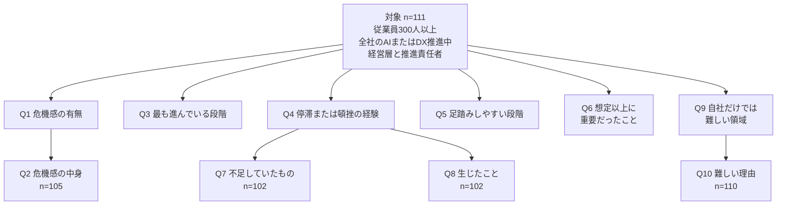

従業員300人以上で、すでに全社的なAIまたはDXの推進に取り組む経営層と推進責任者111人へ、社内主導の案件が期待に届かず止まった経験を聞いた調査があります。2026年8月31日に株式会社TWOSTONE&Sons（東証グロース、証券コード7352）が公表した「企業のAI内製化に関する『限界』の実態調査」です。実施は、IDEATECHが提供するリサーチマーケティング「リサピー」の企画によるインターネット調査で、期間は2026年8月10日から12日です。この記事では、設問文と分母と選択肢を公表リリースに戻し、91.9%を自社の説明に置くときに同じ段落へ添える限定を示します。数値は、特記のない限り2026年8月31日のプレスリリースによります。

*この記事の全体像。以下、順に解説します。*

## AI内製化の限界調査とは

調査名は「企業のAI内製化に関する『限界』の実態調査」です。有効回答は111人です。対象の「取り組んでいる」は、推進の専任担当か部門があること、またはAIプロジェクトか内製開発を実際に進めていることです。

リリースは、構成比を小数点以下第2位で四捨五入しているため、合計が必ずしも100にならない、と注記しています。Q2、Q5、Q6、Q7、Q8、Q9、Q10は複数回答で、一人が複数の選択肢を選べます。

10問は、全員に聞く問と、前の回答で分母が狭まる問に分かれます。

Q2の105人は、Q1で危機感が「かなりある」または「ややある」と答えた人です。111人の94.6%に対応します。Q7とQ8の102人は、Q4で「何度もある」「数回ある」「一度だけある」と答えた人です。111人の91.9%に対応します。Q10の110人は、Q9で「特に難しいと感じる領域はない」と「わからない/答えられない」以外を選んだ人です。

### 危機感と、いま最も進んでいる段階

Q1は単一回答で、分母は111人です。競合他社や業界全体の動きと比べた危機感を聞いています。

| 回答 | 割合 |
|---|---|
| かなりある | 35.1% |
| ややある | 59.5% |
| あまりない | 1.8% |
| 全くない | 2.7% |
| わからない/答えられない | 0.9% |

「かなりある」と「ややある」の合計は94.6%です。

Q2は複数回答で、分母は危機感ありの105人です。首位は「競合他社にAI活用で後れを取ること」の69.5%です。次いで「業界全体の変化に自社が対応できないこと」が62.9%、「AI人材・デジタル人材を確保できないこと」が61.9%です。

Q3は単一回答で、分母は111人です。最も進んでいる取り組みを一つ選ばせています。

| 回答 | 割合 |
|---|---|
| 検討・情報収集の段階 | 8.1% |
| 戦略・活用方針を策定した段階 | 17.1% |
| PoC・実証実験を行っている段階 | 9.0% |
| 一部の部署・業務で実装している段階 | 9.9% |
| 複数部署・業務へ展開している段階 | 22.5% |
| 全社的に活用・運用している段階 | 24.3% |
| 導入後の効果測定・改善を継続している段階 | 7.2% |
| わからない/答えられない | 1.8% |

全社的に活用・運用している、と答えたのは24.3%です。複数部署・業務へ展開している、は22.5%です。

### 停滞・頓挫の経験

Q4は単一回答で、分母は111人です。設問文は次のとおりです。

> あなたのお勤め先では、社内主導で進めたAI活用・AIプロジェクトが、期待した成果や規模に至らず、途中で停滞・頓挫した経験はありますか。

設問は、すでに推進している回答者に、期待した成果や規模に至らなかった経験が一度でもあるかを聞いています。

| 回答 | 割合 | 91.9%との関係 |
|---|---|---|
| 何度もある | 31.5% | 経験ありに含む |
| 数回ある | 55.9% | 経験ありに含む |
| 一度だけある | 4.5% | 経験ありに含む |
| 一度もない | 4.5% | 経験ありに含めない |
| わからない/答えられない | 3.6% | 経験ありに含めない |

31.5%、55.9%、4.5%を足すと91.9%です。五つの選択肢を足すと100.0%です。Q7の対象者指定も、この三つの回答を経験ありとしています。リリースのタイトルとまとめは、この91.9%を「社内主導のAIプロジェクトで停滞・頓挫を経験」と書いています。

### 足踏み、不足、自社だけでは難しい領域

Q5は複数回答で、分母は111人です。足踏みや行き詰まりを感じやすい段階を聞いています。首位は「AI活用の目的・テーマを決める段階」の57.7%です。次の三つはいずれも49.5%です。

- 戦略・構想を具体的な計画に落とし込む段階
- PoC・実証実験から本格導入へ移行する段階
- AIの実装・開発を進める段階

「経営課題・業務課題を特定する段階」は45.9%です。「一部部署から他部署・全社へ展開する段階」は45.0%です。「現場で継続的に利用・定着させる段階」は30.6%です。「導入効果を測定し、改善する段階」は22.5%です。「特に行き詰まりは感じない」は1.8%です。

Q6は複数回答で、分母は111人です。事前には十分認識していなかったが、実際には重要だったことを聞いています。首位は「AI活用の戦略・構想の設計」の58.6%です。「実装・開発を担う人材の確保」は45.9%です。「戦略・構想を実装計画に落とし込むこと」は43.2%です。「AIを活用する経営課題・業務課題の特定」は40.5%です。「プロジェクトを推進・管理する人材の確保」は38.7%です。「AIに関する技術・ツールの選定」は37.8%です。「経営層による継続的な意思決定」は12.6%です。37.8%と12.6%の間には、効果測定や成果の可視化35.1%、現場部門との調整・巻き込み32.4%、導入後の運用・定着28.8%があります。

Q7は複数回答で、分母は経験ありの102人です。停滞・頓挫の背景として不足していたものを聞いています。

| 回答 | 割合 |
|---|---|
| 経営課題・業務課題をAI活用につなげる力 | 58.8% |
| AIの実装・開発を担える人材 | 50.0% |
| 戦略・構想を実装に落とし込む設計力 | 49.0% |
| プロジェクトを推進・管理するPM・PMO人材 | 49.0% |
| AI活用の戦略・構想を描く力 | 47.1% |
| 経営層の関与と継続的な意思決定 | 18.6% |
| AIツール・システムなどの技術基盤 | 18.6% |

47.1%と18.6%の間には、現場の業務を理解し関係者を巻き込む人材37.3%、導入後の運用・定着を担う人材33.3%、効果測定・改善を行う知見33.3%があります。

Q8は複数回答で、分母は同じ102人です。停滞・頓挫によって生じたことを聞いています。「プロジェクトや投資が縮小・凍結された」は56.9%です。「本格導入や全社展開の時期が遅れた」は55.9%です。「現場でAI活用への不信感や抵抗感が高まった」は53.9%です。「推進責任者・担当者の業務負担が増えた」は45.1%です。「投じた費用や工数が十分な成果につながらなかった」は41.2%です。「経営層の期待や関心が低下した」は40.2%です。

Q9は複数回答で、分母は111人です。自社の人材・体制だけでは難しい領域を聞いています。首位は「AI戦略・活用構想の設計」の58.6%です。「AIツール・技術の選定」は54.1%です。「AIの実装・開発」は47.7%です。「AIを活用する経営課題・業務課題の特定」は45.0%です。

Q10は複数回答で、分母は110人です。難しい理由の首位は「経営・事業・業務とAI技術の両方を理解できる人材がいないから」の53.6%です。次いで「複数部門を横断して推進・調整する体制がないから」が45.5%です。「AI技術や市場環境の変化が速く、社内だけでは追随しにくいから」は43.6%です。

リリースのまとめは、つまずきの所在を、AIツールや技術そのものより、経営課題を起点に戦略・構想を描き実装計画へ落とし込む上流の設計工程をはじめ、AI推進の各工程にある、と書いています。

## 注意点

91.9%は、この111人のうち、社内主導の案件が期待した成果や規模に至らなかった経験を一度以上あると答えた人の割合です。プロジェクトの失敗率ではありません。自社の次の案件が止まる確率でもありません。成果の基準、停滞と頓挫の区別、対象期間、案件数は、設問文にありません。「何度もある」は31.5%で、91.9%より小さいです。「一度もない」は4.5%あります。

### 9割超の作り方

＠IT 2026年9月25日のタイトルは「AI内製化、9割超が『停滞、頓挫』を経験」で、続きに「つまずく原因は“技術”ではなかった」とあります。サブタイトルは「AI／DX推進責任者の7割が『後れを取ることに危機感』」です。本文は、「数回ある」55.9%と「何度もある」31.5%を書きます。二つの合計は87.4%です。本文に出ている数だけでは9割超に届きません。9割超は、本文がその段落に置いていない「一度だけある」4.5%を、リリースが経験ありに入れているからです。

サブタイトルの7割は、Q2の69.5%の丸めです。分母は105人です。リリースは人数を掲載していません。69.5%を105人に戻すと73人で、111人に対しては約65.8%です。7割には届きません。

TechTargetジャパン 2026年9月14日の見出しは「9割が頓挫する『AI内製化』」です。リードは「全社展開を進める企業でも、9割以上が頓挫という壁に直面している」です。同じ記事の本文は、31.5%、55.9%、4.5%の合計が91.9%だと書いたうえで、「ほとんどの企業が何らかの挫折を経験している」と、回答者から企業へ単位を移しています。リードの「全社展開を進める企業」は、対象定義より狭いです。全社的に活用・運用していると答えたのはQ3の24.3%です。本文の問いの要約は、「期待した成果や規模に至らず」を省いています。

2026年9月7日のTechTargetは「回答者の91.9%」と人を主語に戻しています。直後の内訳は31.5%と55.9%だけで、4.5%はその段落にありません。

2026年9月17日の適時開示は、この調査を引いて「複数の段階で約5割の企業が足踏みや行き詰まりを感じている」と書いています。対応するのはQ5の57.7%と、三つの49.5%です。Q5は複数回答なので、各段階で約5割、という意味です。回答者の5割が、すべての段階で止まっている、という意味ではありません。主語も、回答者から企業へ移っています。

### 「技術ではなかった」が指せる範囲

＠ITの「つまずく原因は“技術”ではなかった」は、Q7の技術基盤18.6%が、課題をAIにつなげる力58.8%より低い、という対比から読めます。同じリリースには、技術側に置いても矛盾しない数があります。経験者の50.0%が実装・開発を担える人材の不足を挙げています。111人の54.1%が、ツール・技術の選定を自社だけでは難しいと答えています。49.5%が、実装・開発の段階で足踏みすると答えています。

実装人材を技術に含めると、見出しはリリースと両立しません。含めないなら、見出しが言えるのは次までです。技術基盤の不足は、停滞理由の自己申告では下位だった。

同じ「技術」でも、問が違えば順位が違います。Q6で、技術・ツールの選定を「想定以上に重要だった」と答えた割合は37.8%で、戦略・構想の設計58.6%より低いです。Q9では、ツール・技術の選定の難しさが54.1%で、戦略・活用構想の設計58.6%の次です。停滞の自己理由と、自社単独でできるかの自己評価は、別の順位です。

リリース自身のまとめは、「ツールや技術そのものよりも」と書きつつ、「各工程に見られ」とも書いています。ツールだけを原因から外す文と、技術選定や実装人材がボトルネックではない文は、同じ文ではありません。

### 問われていないこと

データの利用許可、決裁権の所在、失敗したときの説明責任は、公表されたQ1からQ10の選択肢にありません。近いのは、経営層の継続的な意思決定です。Q6では12.6%、Q7では18.6%です。どちらも「重要だったと感じた」「不足だと感じる」という自己認知です。

回答者は経営層と推進責任者です。経営層の関与不足は、自分たちの関与を不足と名指す項目でもあります。低く出たことは、決裁が空いていないことの測定ではありません。問われていない項目の割合は、ゼロではありません。

設問の文案を、発行体とIDEATECHのどちらが確定したかは、リリースからは分かりません。

### この数字が置かれている文脈

リサピーのサービスページは、マーケティングリサーチを社内の意思決定を目的とするデータ収集と書き、調査PRは「外部発信」が主目的だと区別しています。強みとして、目的から逆算した切り口設計で、メディアと読者が反応する調査を企画する、と書いています。

2026年9月10日のIR noteは、同月に出したAI関連の調査2件をまとめて「PRにおいて行った施策」と呼んでいます。内製化調査だけの呼称ではありません。内製化調査の結果の直後には、グループ全体で、AI利活用・実装の各フェーズの支援を検討する、と書いています。別調査の段落にある「外部支援（すなわち当社グループ）を想起してもらう」は、内製化調査の段落自体にはありません。

2026年9月17日の適時開示は、子会社TWOSTONE Sync（資本金30百万円）とAgentic（資本金10百万円）の設立理由に、この調査の「約5割」を引いています。両社の設立日は2026年9月1日です。2027年8月期の業績への影響は軽微と見込む、と開示しています。

### 別の調査と並べると、外延はさらに限られる

| 調査 | 何を聞いたか | 母集団 | 本文で使う数 |
|---|---|---|---|
| TWOSTONE 2026年8月 | 社内主導の案件が期待に至らず停滞・頓挫した経験が一度でもあるか | 推進中の責任者111人 | 経験あり91.9% |
| IPA『DX動向2026』2026年7月30日 | 導入または試験利用企業の効果 | 国内企業1,799社のうち該当企業。効果設問の社数は公表本文に無い | 期待以上13.7%、期待どおり18.1%、合計31.8%。一定の効果50.6% |
| IPA 同書 | 生成AIの組織での使われ方 | 導入・試験・検討中の企業 | 個人の業務利用63.3%。全社サービスへの組込18.6%。部署プロセスへの組込11.9% |
| 帝国データバンク 2026年5月14日 | 生成AIへの懸念。3つまで。公開本文は、この懸念の分母を活用企業に限るとは書いていない | 有効10,312社。業務で活用している企業は34.5% | 情報の正確性50.4%。情報漏洩33.5%。責任所在などのルール整備25.5% |
| RAND RRA2680-1 2024年8月13日 | 実務者が知覚した失敗の理由 | 面接は産業50人、学術15人。自前の失敗率は出していない | 他人の推計として「80%超が失敗」。産業界の面接では84%が、リーダーシップ由来を主因の系統に挙げた |

IPAの効果設問で「一定の効果はあった」が50.6%、期待以上と期待どおりの合計が31.8%であることと、TWOSTONEの「一度は停滞を経験した」は同時に成り立ちます。問が違います。

帝国データバンクの25.5%は、失敗時の説明責任が空いている割合ではありません。責任所在などのルール整備が懸念だ、という回答です。公開本文は、効果と悪影響は活用企業に聞いたと書き、懸念の分母を活用企業に限るとは書いていません。情報漏洩33.5%は、データの利用許可が下りない割合でもありません。

RANDの「80%超」は、RANDが測った失敗率ではありません。"by some estimates" という他人の推計です。産業界の面接者の84%は、プロジェクトの84%が経営のせいだ、という意味ではありません。次点は、学習に使えるデータの不足と、データの質・既存データの用途の限界です。この111人の原因割合ではありません。

### 公表からは決まらないこと

原票、個票、業界、経営層と推進責任者の内訳、配信数、回収率、信頼区間は、2026年9月27日時点で公開を確認できませんでした。

「期待した成果や規模」の基準は設問文にありません。全社展開を目標にした案件と、部門の試行では、同じ「至らず」が別の事象になります。停滞と頓挫は一語にまとまっており、凍結と遅延の区別はQ8の結果側にしかありません。

## 社内説明に91.9%を置くときの限定

91.9%を記事や社内説明で使うときは、次の限定を同じ段落に置きます。従業員300人以上であることです。すでに全社推進中であることです。回答者は経営層または推進責任者で、n=111です。インターネット調査の3日間です。社内主導です。期待した成果や規模に至らなかった経験が一度以上で、その中に「一度だけ」4.5%を含みます。

自社の次の案件が止まる確率としては使いません。反復している層の大きさに近いのは、「何度もある」31.5%です。

読みを弱める条件は、対象が推進中の責任者に限られることです。経験が累積であることです。複数の設問が複数回答であることです。調査PRが外部発信を主目的と自認していることです。発行体が子会社設立の開示で同じ調査を引いていることです。Q9のツール選定54.1%とQ7の実装人材50.0%が、「技術ではない」と衝突することです。

逆転条件は三つです。原票が公開され、91.9%が「一度だけ」を除いた値だった場合です。業界クロスで、自社に近い層の経験ありが91.9%から大きく離れる場合です。停滞の定義が「期待未達の経験」ではなく、案件台帳上の中止率だった場合です。いま公表されている範囲では、この三つは起きていません。

## 再開の前に見る順序

モデルやフレームワークの入替を、再開の条件にしません。Q6では、技術・ツールの選定を「想定以上に重要だった」と答えた割合は37.8%で、戦略・構想の設計58.6%より低いです。Q7では、技術基盤の不足は18.6%で、課題をAIにつなげる力58.8%より低いです。入替が再開条件になるのは、今の停滞理由がツール基盤だと切り分けられたときだけです。切り分け前の入替は、Q6の順位と逆になります。

一方で、「原因は技術ではない」を再開の診断表にしません。実装・開発を担える人材は経験者の50.0%です。ツール選定を自社だけでは難しいとする回答は54.1%です。実装段階での足踏みは49.5%です。技術を変えない、と、技術選定や実装人材がボトルネックではない、は別の文です。

停滞の切り分けは、調査が測った順に行います。

1. 目的とテーマが決まっているか。Q5の57.7%が、この段階を足踏みとして挙げています。
2. 経営課題や業務課題を、どのAI利用に接続する人がいるか。Q7の58.8%が、この力の不足を挙げています。
3. その接続を実装計画に落とす人と、実装する人と、PMがいるか。Q6とQ7の43%から50%帯です。
4. その四つが埋まっているのに止まるときだけ、調査が問わなかった三つを見ます。使えるデータが許可されているか。決裁は誰がどの期限でするか。失敗したとき誰が説明するか。

4は、この111人の回答順位からは出てきません。Q7の経営層の関与18.6%を、「決裁は問題が小さい」と読みません。自己認知の低さは、決裁が機能している証拠ではありません。帝国データバンクの懸念順位やRANDの面接は、データ不足と責任の分界が別母集団では繰り返し出る、という対照です。この111人の原因割合ではありません。

## まとめ

91.9%は、従業員300人以上で既にAIまたはDXを推進している責任者111人のうち、社内主導の案件が期待した成果や規模に至らなかった経験を一度以上あると答えた人の割合です。失敗率でも、次の案件の停止確率でもありません。内訳の31.5%が、反復している層の大きさに近い数です。

停滞理由の自己申告では、技術基盤18.6%より、課題とAIの接続58.8%と、設計・人材側の項目が上に来ます。技術選定と実装人材を「技術ではない」の外に出すと、見出しはリリースと衝突します。再開の前に見る順序は、目的、課題とAIの接続、実装計画と実装とPM、その後にデータ許可と決裁と説明責任です。最後の三つは、この調査の順位には現れていません。

この記事が少しでも参考になった、あるいは改善点などがあれば、ぜひリアクションやコメント、SNSでのシェアをいただけると励みになります！

## 参考リンク

- [株式会社TWOSTONE&Sons「企業のAI内製化に関する『限界』の実態調査」](https://prtimes.jp/main/html/rd/p/000000376.000015060.html)（2026年8月31日）
- [＠IT「AI内製化、9割超が『停滞、頓挫』を経験」](https://atmarkit.itmedia.co.jp/ait/articles/2609/25/news049.html)（2026年9月25日）
- [TechTargetジャパン「9割が頓挫する『AI内製化』」](https://techtarget.itmedia.co.jp/tt/article/2609/14/2000001416/)（2026年9月14日）
- [TechTargetジャパン「約9割が頓挫を経験」](https://techtarget.itmedia.co.jp/tt/article/2609/07/2000001162/)（2026年9月7日）
- [適時開示「企業のAI実装支援強化に向けた子会社2社設立のお知らせ」](https://www2.jpx.co.jp/disc/73520/140120260917537800.pdf)（2026年9月17日）
- [TWOSTONE&Sons「IR Monthly Report【2026.8】」](https://note.com/twostone_sons/n/n275ae765ef4c)（2026年9月10日）
- [IDEATECH「リサピー」](https://ideatech.jp/service/research-pr/)
- [IPA『DX動向2026』](https://www.ipa.go.jp/digital/chousa/dx-trend/rcu1hd0000017uk8-att/dx-trend-2026.pdf)（2026年7月30日 第1版）
- [IPA「国内企業のDX動向・AI活用動向のポイントを公開」](https://www.ipa.go.jp/pressrelease/2026/press20260716.html)（2026年7月16日）
- [帝国データバンク「生成AIに関する企業の動向調査（2026年3月）」](https://www.tdb.co.jp/report/economic/20260514-genai/)（2026年5月14日）
- [RAND "The Root Causes of Failure for Artificial Intelligence Projects and How They Can Succeed" RRA2680-1](https://www.rand.org/pubs/research_reports/RRA2680-1.html)（2024年8月13日）
