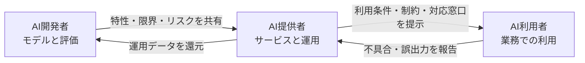

生成AIを業務へ導入するとき、「利用ルールを作ったから対応完了」と考えるのは危険です。

AI事業者ガイドラインは、AIに関わる事業者を開発者・提供者・利用者に分け、企画から運用まで継続的にリスクを管理する考え方を示しています。本稿では、ガイドラインの全体像を短く整理し、各主体が残すべき証跡と、導入時に使えるチェックリストへ落とし込みます。

なお、AI事業者ガイドラインは2024年4月の第1.0版公表後も更新されています。本稿は、2026年3月31日に公表された**第1.2版を最新版**として参照します。

> 本稿は一般的な技術・ガバナンス情報です。個別案件の法的判断は、法務担当者や専門家へ確認してください。

*この記事の全体像。以下、順に解説します。*

## ガイドラインは「罰則がないから任意」ではない

AI事業者ガイドラインは、法律そのものではなく、法的拘束力を直接持たないソフトローです。その目的は、固定的なルールで技術を縛ることではありません。変化の速いAIに対し、事業者がリスクの大きさに応じて対策を選び、継続的に改善することです。

ただし、ソフトローであることと、無視してよいことは同義ではありません。実務では、次の経路を通じて対応が必要になります。

- 取引先からのセキュリティ・AIガバナンス調査
- 委託契約や利用規約における責任分界
- 個人情報保護法や著作権法など、既存法への対応
- インシデント発生時の説明責任
- 海外展開時に適用される現地法への対応

重要なのは、ガイドラインへの「準拠」を宣言することではありません。自社が選んだ対策と判断理由を、後から検証できる形で残すことです。

## 自社の役割はユースケースごとに決める

ガイドラインは、AIに関わる事業者を次の3主体に分けています。

| 主体 | 主な役割 | 典型例 |
|---|---|---|
| AI開発者 | モデル、アルゴリズム、学習・評価プロセスの構築 | 基盤モデル開発、独自モデルの学習 |
| AI提供者 | AIを製品や業務サービスへ組み込み、利用可能な形で提供 | AI搭載SaaS、社内AI基盤の提供部門 |
| AI利用者 | 事業活動でAIシステムやAIサービスを利用 | 生成AIを使う事業部門、導入企業 |

この分類は企業単位で固定されません。同じ企業でも、外部の生成AI APIを社内チャットへ組み込む場合、APIに対しては利用者、従業員に対しては提供者になり得ます。独自データで追加学習すれば、開発者の責務も加わります。

最初に作るべきものは、全社共通の長大な規程ではありません。ユースケースごとに「自社はどの主体を担うか」を記した責任マップです。

## 10の共通指針を運用へ変換する

ガイドラインは、3つの基本理念として、人間の尊厳、多様性・包摂性、持続可能性を掲げています。その実現に向け、全主体に共通する10の指針を示しています。

抽象的な指針は、そのままでは実装できません。確認可能な運用と証跡へ変換します。

| 共通の指針 | 運用へ落とす例 | 残す証跡 |
|---|---|---|
| 人間中心 | AIに任せない最終判断を定義 | 承認フロー、例外規程 |
| 安全性 | 想定被害と停止条件を定義 | リスク評価、テスト結果 |
| 公平性 | 属性別の性能差や不利益を確認 | バイアス評価記録 |
| プライバシー保護 | 入力可能なデータを分類 | データ台帳、同意・委託記録 |
| セキュリティ確保 | 権限、秘密情報、攻撃経路を管理 | 脅威モデル、監査ログ |
| 透明性 | AI利用の事実と限界を表示 | 利用画面、システムカード |
| アカウンタビリティ | 責任者と問い合わせ先を定義 | RACI、判断記録 |
| 教育・リテラシー | 役割別の研修を実施 | 受講記録、理解度確認 |
| 公正競争確保 | ロックインや優越的地位を点検 | 調達評価、契約レビュー |
| イノベーション | 統制下で試行できる場を用意 | サンドボックス基準、実験記録 |

すべてのユースケースへ同じ重さの統制を適用する必要はありません。社内文書の要約と、採用・融資・医療の判断支援では、想定される被害が異なるためです。影響の大きさ、発生可能性、検知可能性を見て、対策の強度を変えます。

## 3主体それぞれが残すべき証跡

### AI開発者：モデルの限界を次工程へ渡す

AI開発者は、データの収集・前処理から学習、評価までを管理します。精度の高さだけでなく、どの条件で性能が落ちるかを明らかにする必要があります。

最低限、次の情報を記録します。

- データの出所、利用条件、前処理、品質上の制約
- 評価データと学習データの分離方法
- ユースケース別の性能指標と受入基準
- バイアス、プライバシー、セキュリティの評価結果
- 既知の限界、禁止用途、監視すべき兆候
- モデルやデータを変更した履歴

成果物はモデルカードだけで完結させません。AI提供者が利用環境で再評価できるよう、評価条件と限界を引き継ぎます。

### AI提供者：利用環境で安全性を再評価する

AI提供者は、モデルをアプリケーションや業務フローへ組み込む主体です。基盤モデルの評価結果だけでは、実際の利用環境における安全性を説明できません。

最低限、次の対策を行います。

- 対象業務、対象利用者、禁止用途の明確化
- プロンプトインジェクションや情報漏えいを含む脅威分析
- 入出力のフィルタリングと権限制御
- 人間が確認する地点と、AIを停止する条件の設定
- AI利用の事実、限界、不具合時の連絡先の表示
- 品質劣化、誤出力、濫用を検知する継続的モニタリング

提供開始はゴールではありません。モデル更新、利用者の変化、新しい攻撃手法に合わせ、リスク評価を更新します。

### AI利用者：入力と出力の両方を管理する

AI利用者は、提供者の規約を守るだけでは不十分です。自社が入力する情報と、AI出力を使って行う判断に責任を持ちます。

最低限、次の運用を整備します。

- 承認済みサービスと利用可能な業務の一覧
- 機密情報、個人情報、顧客データの入力ルール
- 重要な出力に対する人間の確認基準
- 事実確認、引用確認、権利侵害確認の手順
- 誤出力や情報漏えいが疑われる場合の報告経路
- 利用者向けの初回教育と定期的な更新教育

「AIが出した回答だから」という理由は、出力を採用した判断の説明になりません。誰が、何を確認し、どの根拠で採用したかを残します。

## AI推進法と既存法を分けて考える

2025年に成立した「人工知能関連技術の研究開発及び活用の推進に関する法律」、いわゆるAI法・AI推進法は、2025年6月4日に公布・一部施行され、同年9月1日に全面施行されました。

この法律は、EU AI ActのようにAIをリスク分類して包括的な禁止や制裁を直接課す設計ではありません。AIの研究開発と活用を推進しながら、透明性の確保などの施策を進める基本法です。

一方、AI推進法やAI事業者ガイドラインに直接の罰則がないからといって、AI事業に法的責任がないわけではありません。個人情報保護法、著作権法、契約法、不法行為法、業法などは引き続き適用されます。

### 著作権は学習段階と生成・利用段階を分ける

著作権法第30条の4は、著作物に表現された思想・感情を自ら享受し、または他人に享受させることを目的としない利用について、一定の条件で権利制限を定めています。ただし、著作権者の利益を不当に害する場合など、適用には条件があります。

生成物の利用では、既存著作物との類似性や依拠性などが問題になります。「AI学習は常に自由」「AI生成物なら侵害しない」と一括りにせず、開発・生成・公開の各段階で確認します。

### 個人情報にはAI専用の包括的な免責がない

個人情報を入力・学習・分析へ使う場合も、通常の個人情報保護法上の規律を確認します。特に外部の生成AIサービスでは、入力データの利用目的、再学習の有無、第三者提供や国外移転、削除方法を利用前に確認します。

個人情報保護委員会も、生成AIサービスへ個人情報を入力する際に、利用規約やデータの取扱いを確認するよう注意喚起しています。

## 海外展開では国内ガイドラインだけに依存しない

AI事業者ガイドラインは、日本国内でガバナンスを始めるための有力な基準です。しかし、国内ガイドラインへの対応だけで、海外法への適合が完了するわけではありません。

EU AI Actは域外の事業者にも適用される場合があります。高リスクAIシステムには、技術文書、適合性評価、EU適合宣言、CEマーキングなどが関係します。禁止されるAI慣行への違反には、最大3,500万ユーロまたは全世界年間売上高の7%という制裁金の枠組みもあります。

海外提供の可能性があるなら、初期設計から次の証跡を再利用できる形にします。

- ユースケースと対象市場の一覧
- リスク分類と判断根拠
- データ、モデル、評価結果のトレーサビリティ
- 人間による監督とログの設計
- インシデント対応と是正措置の記録
- サプライヤーから受領すべき技術情報

国内向けと海外向けで別々の統制を後付けするより、共通の証跡基盤を作り、適用法ごとの差分を管理する方が運用しやすくなります。

## 30日で始める実装プラン

### 1週目：棚卸しと責任者の決定

利用中・検討中のAIを一覧化します。各ユースケースについて、開発者・提供者・利用者のどの役割を自社が担うかを記録します。業務責任者、システム責任者、法務・セキュリティの相談先も決めます。

### 2週目：リスク評価と利用条件の設定

想定する便益、誤作動時の被害、扱うデータ、影響を受ける人を整理します。禁止用途、人間が確認する地点、停止条件を決めます。高いリスクを持つユースケースは、承認が終わるまで本番利用を止めます。

### 3週目：技術統制と証跡の実装

アクセス制御、ログ、データマスキング、評価テスト、監視アラートを実装します。ベンダーからモデルの限界、データ取扱い、障害・インシデント時の連絡方法を入手します。

### 4週目：教育と運用レビュー

対象者へ役割別の教育を行います。実際の利用ログと報告事例を見て、ルールが守れる設計になっているか確認します。見直し日と、モデル・用途・法令変更時に再評価する条件を決めます。

運用開始時点で、最低限次の問いに答えられる状態を目指します。

- このAIを、誰が、何の目的で使っているか
- どのデータを入力してよいか
- どの判断をAIへ任せてはいけないか
- 品質と安全性をどのテストで確認したか
- 問題をどう検知し、誰が停止できるか
- 判断と変更の証跡がどこにあるか

## まとめ

AI事業者ガイドライン対応の中心は、規程を一度作ることではありません。ユースケースごとに自社の役割を定め、リスクに応じた対策を選び、その判断と結果を証跡として残し続けることです。

まずは、AI台帳、責任マップ、リスク評価、人間の確認地点、停止条件の5点から始めると、抽象的な指針を日々の運用へつなげやすくなります。既存法や海外法は別途適用されるため、ガイドラインを最低限の共通基盤として使い、必要な統制を積み上げてください。

この記事が少しでも参考になった、あるいは改善点などがあれば、ぜひリアクションやコメント、SNSでのシェアをいただけると励みになります！

## 参考リンク

- [経済産業省「AI事業者ガイドライン（第1.2版）」](https://www.meti.go.jp/shingikai/mono_info_service/ai_shakai_jisso/20260331_report.html)
- [経済産業省「AI事業者ガイドライン（第1.2版）本編」](https://www.meti.go.jp/shingikai/mono_info_service/ai_shakai_jisso/pdf/20260331_1.pdf)
- [内閣府「AI法 全面施行―次なるフェーズへ―」](https://www.cao.go.jp/press/new_wave/20251003)
- [内閣府「設置根拠：AI法」](https://www8.cao.go.jp/cstp/ai/ai_hq/konkyo.html)
- [文化庁「AIと著作権について」](https://www.bunka.go.jp/seisaku/chosakuken/aiandcopyright.html)
- [個人情報保護委員会「生成AIサービスの利用に関する注意喚起等について」](https://www.ppc.go.jp/news/careful_information/230602_AI_utilize_alert/)
- [EUR-Lex「Regulation (EU) 2024/1689（EU AI Act）」](https://eur-lex.europa.eu/legal-content/EN/TXT/?uri=CELEX:32024R1689)
