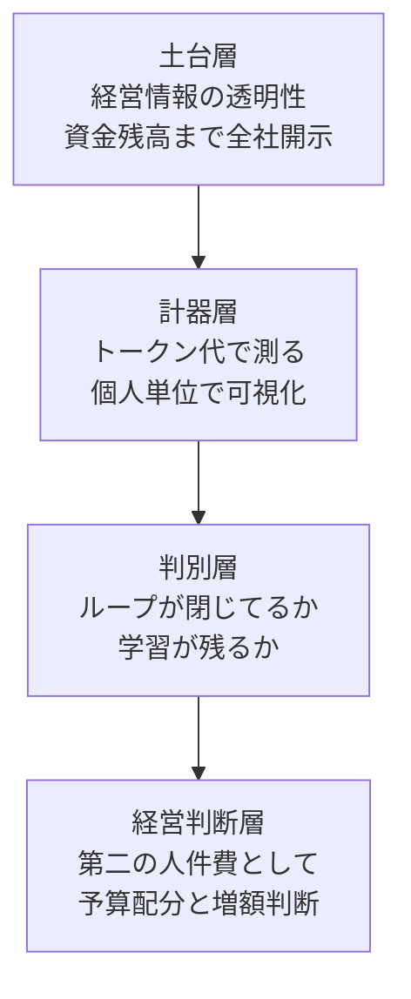

生成AIのコストを「経費」として管理する限り、経営の関心は削減へ向かいます。使ったら消える費用だからです。

一方でAI支出を「投資資産」として扱うと、可視化と評価と予算配分の設計が根本から変わります。かけたコストが翌年度以降の基盤になる、という見方に立てるからです。

LayerX（約700人規模）は、AI費を「第二の人件費」と位置づけました。全社員のトークン利用額を実名と金額でリアルタイムに公開する運用へ踏み込んでいます。共同代表の福島良典CEOの利用額まで、全社員から見えます。

この記事では、この事例を先進事例の紹介として消費せず、発注側と経営側が自組織への適用可否を判断するための構造として整理します。核心は透明性の強さそのものではありません。AI費を投資として見るための「計器」を先に置いた点にあります。あわせて、外部枠組みとの整合、機能条件、反証を示します。

## LayerXの運用を、経営が決める論点で分解する

LayerXの運用を、経営が実際に決める論点ごとに整理します。数値は記事公表時点の値や感覚値であり、恒常水準ではありません。

| 論点 | LayerXの設計 | 一次事実 |
|---|---|---|
| 指標の置き方 | 回数でなくトークン代で測る | 費用の肌感覚を育てるため。回数カウントでは判断力が育たない |
| 可視化の粒度 | 個人単位、実名、金額、ほぼリアルタイム | 全社員の名前と月ごとのトークン数と費用が全社員に見える。CEOも対象 |
| 可視化の土台 | 経営情報の透明性の延長 | 会社の月次資金残高も全社員が閲覧できる。費用公開はその延長線上 |
| 統制の併走 | 上位モデルは申請制 | 上長と情報システム部門が業務上の必要性を判断して許可 |
| 予算超過の扱い | 咎めず価値転換へ方向づけ | 2026年2〜3月にトークン利用が事業計画予算の10倍ほど。経営は価値へ転換すると示した |
| 投資と浪費の判別 | 「ループは閉じてるか」 | 使ったトークンが学習として残り次の改善につながる状態。CEOが繰り返し使い定着 |
| 会計上の見立て | 「第二の人件費」「減価償却に近い」 | 労務費の1割ほどの感覚値。2026年1月から月次決算でAI費を切り出し |
| 予算権限 | 増額判断はCEOとCxO | 1億円を2億円にする判断は経営に集約。前提が変われば期中でも予算を作り直す |

「これなら5ドル、これなら20ドル使う」という費用感覚は、回数のカウントからは育ちません。だからこそLayerXは、最初からトークン代を計器に据えました。

### 「ループが閉じる」の具体像

投資と浪費を分ける言葉が「ループは閉じてるか」です。使ったトークンが組織や製品の学習として残り、次の改善につながる状態を指します。記事には2つの具体例が示されています。

1つは人事評価です。LayerXは評価工数の8割削減を上期目標に掲げます。NotionやSlack、Google Workspace、Salesforceのデータから、半期の振り返りをほぼ自動で生成します。アクティビティの95%ほどはまとめられるという見立てです。1次評価案に上長が最終判断を加え、その判断が記録されて下期にチューニングされます。人間の判断そのものが学習データになる循環です。

もう1つは経費精算です。宿泊費の上限を超えた申請が正当な理由で承認された実績がデータに残れば、翌年の同様の申請を自動で通せるようになります。使ったトークンが再利用可能な学習として残るかどうかが、投資と浪費を分けます。

## AI費を投資として運営する3層構造

LayerXの運用は、次の3層が積み上がって初めて「AI費を投資として運営する」状態に達します。層を飛ばすと、可視化は監視に、増額は浪費に転じます。

| 層 | 役割 | 欠けると起きること |
|---|---|---|
| 土台層 | 透明性を受け止める組織の前提。資金残高まで開示する文化 | 費用の実名公開が監視と不信に転じる |
| 計器層 | 回数でなく金額で測り、個人が費用感覚を持つ | 削減目標への矮小化、判断力の未成熟 |
| 判別層 | 学習が残るかで投資と浪費を分ける | 支出奨励だけが残る垂れ流し |
| 経営判断層 | 投資として予算を配分し、増額をCEOとCxOが決める | ボトムアップ増額要求の不通による停滞 |

この構造の含意は明快です。多くの企業が着手する「利用率の可視化」は、計器層の一部にすぎません。投資として運営するには、その上に判別層と経営判断層を載せ、下に土台層を敷く必要があります。

## 外部枠組みとの整合、FinOps for AI

LayerXの方向性は、FinOps Foundationが2024〜2025年のフレームワーク改訂で追加した「FinOps for AI」と整合します。同フレームワークはAIを独立したtechnology scopeとして定義しました。

| FinOps for AIの論点 | LayerXの対応 |
|---|---|
| cost-per-token を指標にする | 回数でなくトークン代で測る |
| 支出の予測不能性と実験フェーズの読みにくさ | 予算10倍超過を咎めず価値転換へ方向づけ |
| 予算オーナーがITの外へ広がる | 増額判断をCEOとCxOに集約 |
| raw コストでなく business value への接続 | 「ループが閉じるか」で価値を判別 |

差分は透明性の強度にあります。FinOpsのshowbackやchargebackは、一般にチームやプロジェクト単位で運用されます。LayerXは個人単位で、実名で、経営を含む全社公開まで踏み込みました。標準的な運用より一段強い透明性です。この強度は、次に示す機能条件に依存します。

個人単位の費用可視化は、計測機構を伴って初めて成立します。FinOps for AIが挙げるとおり、AIの呼び出しにメタデータ（利用者、チーム、用途）を付与し、ゲートウェイやログ基盤でトークン消費と金額を集約する仕組みが前提です。回数指標なら勤怠に近い集計で足りますが、金額を個人単位で実名表示するには、呼び出しごとの帰属を取りこぼさない計測設計が要ります。「計器を置く」とは、指標の宣言だけでなく、この帰属可能な計測基盤を敷くことを含みます。

## 反証と機能条件

透明性そのものが安全なのではありません。LayerXで萎縮が起きなかったのは、設計が効いているからです。適用可否を判断するために、機能条件と反証を分けて示します。

### 反証1、個人単位で実名の費用公開は無条件には機能しない

相対的な報酬情報の開示が満足度に与える効果は、非対称であることが実証されています。Card、Mas、Moretti、Saez（2012）は、自分が中央値より下だと知ると職務満足度が下がり転職探索が増える一方、中央値より上だと知っても満足度は有意に上がらないことを示しました。

費用の実名公開も、支出の多寡が評価や価値づけと結びついた瞬間に、下位者の萎縮と不公平感を生みます。LayerXで逆に「もうちょっと使っていいんだ」という受け止めが多かったのは、次の2点を設計したからと読めます。

- 公開の狙いを査定から明確に切り離し
- 「使わないほど良い」ではないという価値観の明示

つまり機能条件は「可視化と評価の切り離し」です。この分離がないまま金額だけを実名公開すると、同じ施策が逆効果になります。

### 反証2、「ループを閉じる」は自動では回らない

石黒卓弥CHROは、レビューを与え続けると過学習や前提固執が起き、AIを使うほど成果が悪化する場合もあると認めています。まだこれからトライする領域だといいます。

「使ったトークンが学習資産になる」という投資論は、学習ループの品質管理を伴って初めて成立します。可視化の指標を「使用量」から「ループが閉じたか」へ引き上げないと、投資の看板を掲げた支出奨励に堕します。

### 反証3、「ボーナス期」前提は市況で反転する

増額判断の根拠のひとつは、OpenAIやAnthropicが赤字覚悟の価格で提供する今を「本来の数倍の価値が安く使えるボーナス期」とみる市況認識です。これは値上げや課金体系の変更で反転しうる外部変数です。

投資判断のロジックが市況前提に強く依存すると、価格の正常化局面で「予算を倍にする」判断は逆回転します。市況を恒久前提に据えないヘッジが別に要ります。安価モデルへの振り分け、キャッシュやバッチの最適化、自前モデルの検討です。この含意は本記事の分析であり、記事の主張ではありません。

### 「減価償却に近い」の射程

LayerXの「減価償却費に近いのでは」という表現は、会計処理そのものの主張ではありません。管理会計や意思決定上の見立てと読むのが正確です。記事でも「予算上トークンと人件費は今も別建て」と述べており、制度会計上の資産計上を宣言してはいません。本記事でも「第二の人件費」「減価償却に近い」は、会計事実ではなく経営の管理フレームとして扱います。

## 発注側と経営側への5つの推奨

自組織に適用する際の判断順序を示します。透明性の強度は、土台に合わせて調整する変数です。最初から最大化するものではありません。

1. 指標を回数から金額へ移す。トークン代を計器に据え、費用感覚を現場に持たせる。利用率の可視化は入口であり、ゴールではない
2. 可視化と評価を切り離す。金額を見せる目的を「費用感覚の共有」に固定し、明文化する。切り離しの設計なしに実名公開へ進まない
3. 投資と浪費の判別軸を持つ。「学習が残るか」を合言葉にし、判別軸の品質管理を担当に明示する
4. 増額権限を経営に集約する。予算を大きく動かす判断をCEOとCxOに置き、期中でも作り直せるプロセスを用意する
5. 透明性の強度を土台に合わせる。透明性土台の薄い組織や数千人規模では、個人と実名の全社公開をそのまま輸入しない。チーム単位から始め、評価分離が定着してから粒度を上げる

## 未解決の問い

- 個人単位で実名の費用可視化は、透明性土台の薄い組織や数千人規模で再現するのか。記事もこれを「試金石」と位置づけており、未検証です
- 「労務費の1割」「予算10倍超過」は特定期間の感覚値や実績値であり、恒常水準ではありません。標準指標として一般化できるかは、別途検証が要ります
- 学習ループの品質を、どう定常的に測るのか。投資論の成否はここに集約しますが、記事段階では「これからトライ」とされています

## まとめ

LayerXの事例が示すのは、AI費を投資として運営する鍵が、金額の可視化そのものではなく、その背後の計器と判別と権限の設計にある、という点です。指標をトークン代へ移し、可視化を評価から切り離し、「ループが閉じるか」で投資と浪費を分け、増額をCEOとCxOに集約する。この順序が、経費から投資資産への転換を支えます。

この記事が少しでも参考になった、あるいは改善点などがあれば、ぜひリアクションやコメント、SNSでのシェアをいただけると励みになります！

## 参考リンク

- 記事
  - [CEOの利用額も「全社員に丸見え」 LayerXがAI予算を「第二の人件費」にした真意（ITmedia ビジネスオンライン）](https://www.itmedia.co.jp/business/articles/2607/09/news022.html)
  - [Card, D., Mas, A., Moretti, E., & Saez, E. (2012). Inequality at Work: The Effect of Peer Salaries on Job Satisfaction. American Economic Review, 102(6), 2981-3003.](https://www.aeaweb.org/articles?id=10.1257/aer.102.6.2981)
- 公式ドキュメント
  - [FinOps for AI（FinOps Framework Technology Category）](https://www.finops.org/framework/technology-categories/ai/)
  - [2025 FinOps Framework（FinOps Foundation）](https://www.finops.org/insights/2025-finops-framework/)
