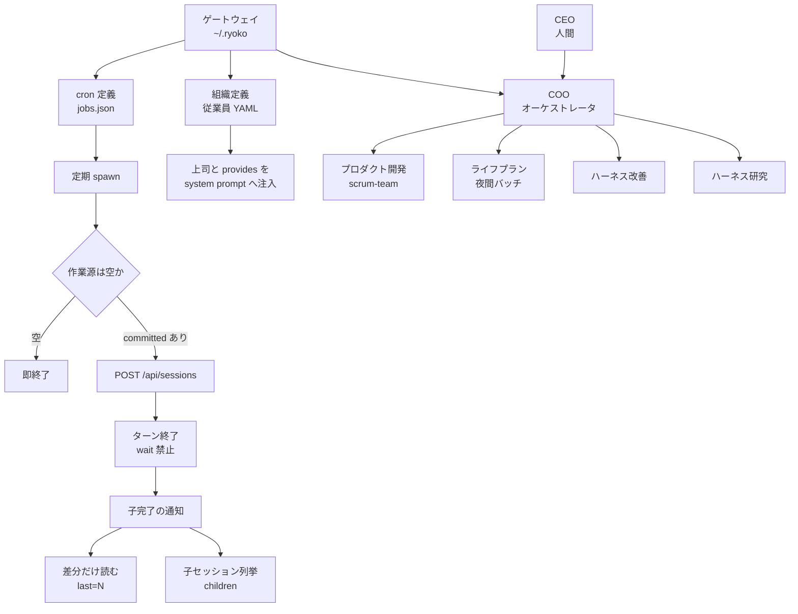
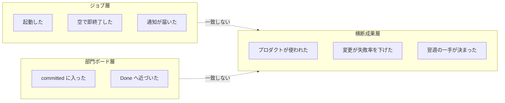

「8部門・22本の cron・約30体のAI従業員を1人で運営している」という構成は、どこまで真似してよいのでしょうか。

この記事では、dtakamiya 氏の連載第1回 [AI組織を1人で運営する（1）全体像](https://zenn.dev/miyan/articles/ai-solo-org-ops-01-overview)（2026-08-29 公開）を題材に、公開されている一次情報と照合しながら次を整理します。

- 記事のどこが公開ソースで裏付けられ、どこが自己申告なのか
- 人数や部門数と切り離して、そのまま採用できる運用契約は何か
- 「ジョブが動いた」と「成果が出た」を混同しないための指標の分け方

結論を先に書きます。**採用してよいのは規模ではなく契約です。** 作業源の単一化、空なら即終了、spawn 後に待たない、到達確認を API で取る。この4点は公開実装で裏が取れます。一方「30体でも1人で継続できる」は、現時点の公開情報では証明されていません。

:::message
本文中の検証はすべて 2026-08-30 時点の公開情報にもとづきます。star 数や liked_count などのメタ情報は変動します。
:::

*この記事の全体像。以下、順に解説します。*

## 何が公開ソースで、何が自己申告なのか

第1回に出てくる要素を、公開されている実装と突き合わせると次のように分かれます。

| 記事の記述 | 公開一次情報 | 判定 |
|---|---|---|
| ホームディレクトリ `~/.ryoko/` | [OpenRyoko](https://github.com/rsensui2/OpenRyoko) の README / paths.ts | 一致 |
| `POST /api/sessions` に `parentSessionId` を渡す | OpenRyoko / [Jinn](https://github.com/hristo2612/jinn) の api.ts | 実在 |
| `GET /api/sessions/{id}?last=N` | 両リポジトリに実在。上限は OpenRyoko 200、Jinn 500 | 実在 |
| `GET /api/sessions?parentSessionId=` で子を列挙 | 公開 api.ts に該当クエリなし。代替は `GET /api/sessions/:id/children` | 記事と公開実装がずれる |
| spawn したらターンを終える、ポーリング禁止 | OpenRyoko テンプレートの CLAUDE.md に公式手順として記載 | 公式プロトコル |
| `jobs.json` の `kind: "prompt"` | OpenRyoko の CronJob 型に存在。現行 Jinn の型には `kind` がない | OpenRyoko 系 |
| 従業員 YAML の `reportsTo` / `provides` / 4ランク | 両リポジトリの types.ts に実在。ただし docs/org.md の Fields 表は両フィールドを欠く | 型では実在、ドキュメントは薄い |
| 8部門 / 22 cron / 約30体 | ハーネスの出荷時 org は 0〜1名。実際の `jobs.json` は未公開 | 著者の自己申告 |
| プロダクト cinch | [dtakamiya/cinch](https://github.com/dtakamiya/cinch) が実在し、README は「Claude Code セッションの採点」 | リポジトリは実在、成果指標なし |

つまり **仕組み（ディレクトリ構成・YAML スキーマ・API・委譲プロトコル）は公開テンプレートで確認できる一方、規模と稼働実績は記事の自己申告** という切り分けになります。

補足として、記事が失敗談・実 `jobs.json` 全文・無効化した3本の理由・コストを「後の回」に先送りしている点は重要です。Zenn の記事一覧 API を 2026-08-30 に確認した時点で、第2回はまだ公開されていません。稼働の証拠は現時点では読めない、という前提で扱う必要があります。

## 土台になっているハーネス

記事は製品名を明示しませんが、ホームパス・`kind: "prompt"`・委譲手順の書き方は OpenRyoko の公式テンプレートとほぼ同じです。OpenRyoko は Jinn の fork で、組織定義・cron・ダッシュボードを継承し、Slack 連携や `/goal`、Canvas を独自に実装しています。

リポジトリのメタ情報（2026-08-30 時点）は次のとおりです。

- hristo2612/jinn: 約 310 stars、最終 push 2026-08-28、アーカイブされていない
- rsensui2/OpenRyoko: 22 stars、最終 push 2026-08-28、Jinn の fork、アーカイブされていない

構成全体を図にすると、ゲートウェイが「組織定義」と「cron 定義」の2系統を持ち、そこから spawn と到達確認へ分岐する形になります。

注目したいのは、**トリガーから到達確認までの経路が、部門構成とは独立している**ことです。人数はこの経路の上に乗るだけで、経路そのものを良くも悪くもしません。

## 人数と切り離して採用できる運用契約

記事から取り出せる設計のうち、規模に依存しないものを整理します。

| 契約 | 内容 | 効く層 |
|---|---|---|
| 作業源 | 自律開発は `sprint.json` の committed のみを入力にする | 入力 |
| 停止 | 作業源が空なら即終了する | 停止条件 |
| 時間分離 | 夜間バッチは 22:00〜03:00 に置き、日中の cron と資源を取り合わない | 資源 |
| ボード分離 | プロダクト・インフラ・研究を同一ボードに混ぜない | 優先順位 |
| 委譲 | spawn 後にターンを終える。履歴の全読みは禁止し、差分だけ読む | コンテキスト |
| 状態検証 | スレッド上の「返答待ち」を信じず、API で子セッションを取得する | 到達確認 |
| フィードバック | 週次レトロが翌週フォーカスを1ファイルに書き、毎朝のジョブが今日の一手へ落とす | 計画 |

このうち効き目が大きいのは **停止条件** です。作業源が空でもエージェントを起動すると、エージェントは「やることを発明」します。空なら即終了という契約は、cron が自分で仕事を作り出す経路を閉じます。

同じく **spawn したら待たない** も、公式テンプレートに明記された作法です。親セッションが子の完了をポーリングすると、待っている間ずっとコンテキストとトークンを消費します。通知で起こしてもらい、差分だけ読む形にします。

一方で、この契約表には**測定が含まれていません**。何が動いたかは分かっても、何の役に立ったかは分かりません。ここが次節の論点です。

## 「30体でも回る」は現時点で証明されていない

エージェント数を増やすことと、ジョブ間の契約・停止・到達確認を置くことは別問題です。後者は採用できますが、前者は公開情報で裏が取れません。むしろ弱める材料が複数あります。

**著者自身の過去記事** — 同じ著者が 2026-05-27 の [AIエージェント本番運用](https://zenn.dev/miyan/articles/ai-agent-production-ops-reality-2026) で、4体構成で月 2,000 ドル超を消費して2体へ戻した経緯を書いています（金額は著者の自己申告）。そこでの教訓は「10体以上を最初から設計するな」でした。

**同型システムの既知の壊れ方** — ゲートウェイ内蔵の cron は、スキーマが整っていても次のような失敗を起こします。openclaw/openclaw の issue には、失敗上限のない無限リトライがレート制限を招いた例（#8520）、セッションが spawn されないまま次回実行時刻だけが進む例（#14116）、分離セッションのハング（#42464）、そして `lastStatus: ok` が配送失敗を隠していた例（#19154）が並びます。別プロダクトのバグではありますが、**ゲートウェイ + cron + LLM 課金という同じ形が持つ失敗パターン**として読めます。

**規模拡大の逓減** — Kim らの研究（[arXiv:2512.08296v3](https://arxiv.org/html/2512.08296v3)）は、単一エージェントの正答率が約45%を超えると、エージェントを追加しても逓減あるいは悪化に転じると報告しています。ソフトウェア修正タスク（SWE-bench Verified）では、マルチエージェント構成が単一エージェント比で −15%〜−2%。逐次計画タスクではさらに大きく落ちます。自律開発のような領域は前者に近く、**人数を足すほど良くなるとは限りません**。

**コストと利用枠が測られていない** — 記事の例ジョブは上位モデルを指定しています。Claude の Max プランは数時間ごとの利用量リセットに加えて週次上限があり、枠に到達すると待つか上位プランへ移るかになります。マルチエージェント構成は、Anthropic 自身が [multi-agent research system の解説](https://www.anthropic.com/engineering/multi-agent-research-system)で、通常のチャットの約15倍のトークンを使うと書いています。22本の定期ジョブが枠を割るかどうかは未計測のままです。ここは Gartner が[エージェント型AIプロジェクトのキャンセル要因](https://www.gartner.com/en/newsroom/press-releases/2025-06-25-gartner-predicts-over-40-percent-of-agentic-ai-projects-will-be-canceled-by-end-of-2027)として挙げるコスト・価値の不明確さ・リスクのうち、コストと価値に正面から当たります。ジョブ契約はそのどちらも測りません。

**レビュー容量は増えない** — 1人が COO としてレビューする以上、ジョブ契約を整えてもレビュー容量は変わりません。著者自身も [PRが3倍になったのにリリースが増えない](https://zenn.dev/miyan/articles/ai-driven-dev-org-speed-illusion-2026) で、コーディングの高速化がボトルネックをレビューへ移すと書いています。

**組織図に置くこと自体の副作用** — Wiles らのワーキングペーパー（2026-07-17 draft）は、企業マネージャを対象にした実験で、AI を「従業員」としてフレーミングすると監視の強度が 16% 下がったと報告しています。1人組織へそのまま外挿はできませんが、組織図に載せる行為が監視を緩める方向に働きうる点は留意に値します。

総合すると、**第1回は設計メモとしては強く、稼働証明としては弱い**という評価になります。

## ジョブ成功と成果を分ける

ここが実務上いちばん効く整理です。3つの層を別々のメトリクスとして持ちます。

| 層 | 例 | 成功の定義 | 第1回で示された範囲 |
|---|---|---|---|
| ジョブ | cron 実行、通知配送 | 起動した / 空で即終了した / 通知が届いた / 連続失敗で無効化された | スキーマと時刻表のみ。失敗率なし |
| 部門ボード | スクラムボード、`sprint.json` | committed が Done へ近づいた。レトロが翌週フォーカスを書いた | ファイルの存在宣言のみ |
| 横断成果 | プロダクトのユーザー価値、ハーネス故障率、人間のレビュー修正率 | プロダクトが使われた。基盤変更が失敗を減らした。修正率が閾値内 | 未掲載 |

運用ルールにすると次の5点です。

1. ジョブ層が緑でも、成果層を自動的に緑にしない
2. 空で即終了はジョブ成功として数える。成果成功としては数えない
3. `lastStatus: ok` と配送成功を別のフラグに分ける
4. 無効化したジョブは失敗ではなく「成果に寄与しなかった設計」として記録に残す
5. レビュー修正率とレビュー待ち時間を、成果層の健康指標に含める

5点目の閾値について、著者は 2026-05 の記事で「修正率 50% で再評価、70% で停止」を提案しています。業界標準ではありませんが、**計測を始める単位としては使えます**。

## 自分の cron 基盤へどう写すか

筆者は Kestra でエージェントを定期実行する基盤を運用しています。対応関係を書き出すと、写せるもの・すでに持っているもの・欠けているものがはっきりします。

| 記事側の要素 | 自分の基盤での対応 |
|---|---|
| `jobs.json` | Kestra Flow の Schedule |
| 空なら即終了 | 3-state exit code / 対象なしで skip |
| spawn して止まる | 対話は Pause で人へ戻し、バッチは完了まで待つ。両者を混同しない |
| 差分だけ読む | 通知は差分のみ。全履歴を読み直さない |
| ジョブ成功 | 実行結果テーブルの起動件数 |
| 横断成果 | 集計マートの接続数と問い合わせ。ジョブ件数で代替しない |
| 朝の到達確認 | 各外部サービスの認証ヘルスチェック。ジョブより先に認証の到達を見る |

比較の軸を広げると、停止条件をどこに置くかが分かれ目になります。

| 基準 | 記事の運用 | OpenRyoko / Jinn | ゲートウェイ内蔵 cron 一般 | Kestra 基盤 |
|---|---|---|---|---|
| トリガー | ゲートウェイの `jobs.json` | 同型、ホットリロードあり | 同型 | Schedule。人格定義に cron を埋め込まない |
| 停止 | プロンプト上の契約 | スケジューラ側の連続失敗上限は本調査では未確認 | 失敗上限なしのリトライ事例あり | timeout、3-state、取りこぼし時は最終回のみ実行 |
| 到達確認 | 子セッション API | `/sessions/:id/children` | 配送モード。`ok` が失敗を隠した例あり | 実行結果 + 明示的な人のゲート |
| 規模の意味 | 8 / 22 / 30 を提示 | 出荷時の組織はほぼ空 | ジョブ数は業務成果ではない | 主指標は接続数。ジョブ数ではない |
| 人間の関与 | COO がレビュー | 信頼レベルを段階で指定 | 任意 | Pause で判断を人へ戻す |

ここで得られる示唆は、**停止をプロンプトだけに置かない**ことです。記事の「空なら即終了」はプロンプト上の契約であり、モデルが従わなければ機能しません。スケジューラ側にも連続失敗の上限、空入力での skip、枠切れ時の残ジョブ破棄を持たせると、二重の防御になります。

## このモデルが向く条件と向かない条件

向く条件は次のとおりです。

- 1人で意思決定でき、ファイルを正本にできる
- 作業源を JSON やボードに固定できる
- 失敗を後から読める実行ログが残る

向かない条件も明確です。

- 部門数や従業員 YAML の数を成熟度の指標にしている
- プロダクトの KPI がない状態で「組織が回っている」と報告する
- 人のレビューなしに、数時間おきの自律開発を本番ユーザーへ出す

未解決のまま残っている論点も挙げておきます。無効化された3本の理由、実際の `jobs.json` 全文、委譲の誤判断が起きた再現手順、ゲートウェイが対話型 PTY で動くのかバッチ実行なのか（後者は課金の枠が変わります）、そしてプロダクトの利用者数と採点回数。いずれも第2回以降の公開待ちです。

判断としては、**契約パターンは第2回を待たずに採用してよく、30体構成のコピーは保留する**、が妥当なところです。

## まとめ

- 第1回で公開実装と一致するのは、ディレクトリ構成・YAML スキーマ・API・委譲プロトコル。8部門 / 22 cron / 約30体という規模は著者の自己申告で、実 `jobs.json` は未公開
- 規模に依存せず採用できるのは4点。作業源の単一化、空なら即終了、spawn 後に待たない、到達確認を API で取る
- 停止条件はプロンプトだけでなくスケジューラ側にも置く。連続失敗の上限、空入力での skip、枠切れ時の残ジョブ破棄
- ジョブ層・部門ボード層・横断成果層を別メトリクスにする。ジョブが緑でも成果は緑にならない
- エージェント数を増やす方向は、著者自身の過去のコスト事例、同型システムの既知の壊れ方、スケーリング研究の逓減報告のいずれからも支持されない

「何体動いているか」ではなく「どのジョブが何の成果に接続しているか」を先に決める。これが第1回から取り出せる、いちばん再現性の高い部分でした。

この記事が少しでも参考になった、あるいは改善点などがあれば、ぜひリアクションやコメント、SNSでのシェアをいただけると励みになります！

## 参考リンク

1. dtakamiya「AI組織を1人で運営する（1）全体像」Zenn, 2026-08-29. https://zenn.dev/miyan/articles/ai-solo-org-ops-01-overview
2. rsensui2/OpenRyoko（README / テンプレート CLAUDE.md / api.ts / types.ts）https://github.com/rsensui2/OpenRyoko
3. hristo2612/jinn（README / api.ts / types.ts）https://github.com/hristo2612/jinn
4. dtakamiya「AIエージェント本番運用 — 3つの壊れ方と撤退基準」Zenn, 2026-05-27. https://zenn.dev/miyan/articles/ai-agent-production-ops-reality-2026
5. dtakamiya「PRが3倍になったのにリリースが増えない」Zenn, 2026-04-10. https://zenn.dev/miyan/articles/ai-driven-dev-org-speed-illusion-2026
6. Gartner "Predicts Over 40% of Agentic AI Projects Will Be Canceled by End of 2027", 2025-06-25. https://www.gartner.com/en/newsroom/press-releases/2025-06-25-gartner-predicts-over-40-percent-of-agentic-ai-projects-will-be-canceled-by-end-of-2027
7. openclaw/openclaw issues #8520 / #14116 / #42464 / #19154（いずれも 2026 年にクローズ済み）
8. Wiles, Hsu, Bedard, Kropp, working paper draft, 2026-07-17. https://www.emmawiles.com/storage/ai_employee.pdf
9. Kim et al. "Towards a Science of Scaling Agent Systems", arXiv:2512.08296v3, 2026-04-08. https://arxiv.org/html/2512.08296v3
10. Anthropic "How we built our multi-agent research system", 2025-06-13. https://www.anthropic.com/engineering/multi-agent-research-system
11. dtakamiya/cinch. https://github.com/dtakamiya/cinch
