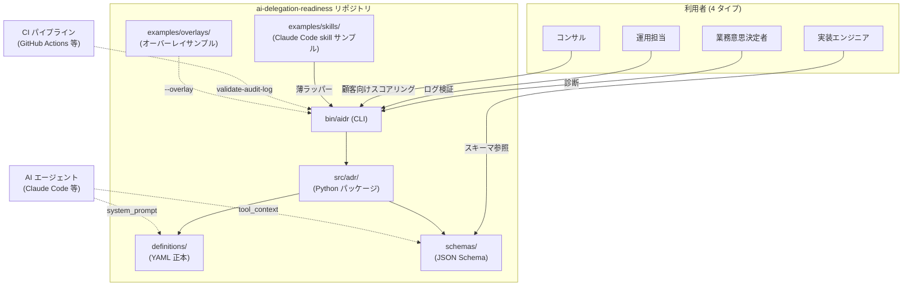

## 概要

高リスクな定型業務を AI エージェントに委任して良いかを採点する **診断 CLI + 拡張可能なフレームワーク**、[ai-delegation-readiness](https://github.com/suwa-sh/ai-delegation-readiness) を OSS で公開しました。

味の素グループの経理 AI エージェント事例(2026 年 2 月本番稼働)について、私が公開報道をもとに書いた分析記事([味の素の経理AIエージェントに学ぶ 承認業務をAIに委任する前提条件](https://suwa-sh.github.io/zenn-contents/articles/ajinomoto-accounting-agent_20260621/))から **再現可能な骨格**(4 層フレーム + 委任マトリクス + 監査ログ最小スキーマ)を抽出し、機械可読の定義 + 動く CLI + AI エージェント連携のサンプルとして配布する形に落とし込んでいます。

事例の出典は ITmedia(2026-06-19)とファーストアカウンティング公式プレスリリース(2026-04-24)です。

本記事は、このリポジトリの **中身と設計判断**をエンジニア向けに解説します。なぜこの構成にしたのか、JSON Schema を二段にした理由、オーバーレイのマージ規則を `add` と `strengthen` のみに絞った理由など、つくり手側の意思決定が中心です。「どう使うか」だけ知りたい方はリポジトリの [README](https://github.com/suwa-sh/ai-delegation-readiness) を直接ご覧ください。

## 解こうとした課題

「経理 AI / 承認 AI を入れたい」という相談を受けたとき、いきなりベンダー比較や LLM 比較から入ると失敗しがちです。元事例の核心は **「AI 性能で差がついたのではなく、業務ロジックを LLM の周りで構造化したから精度が立った」** という点で、上層(モデル選定)を作り込んでも、下層(業務の標準化・判断の構造化・委任範囲の線引き・統制と監査)が崩れていれば委任は成立しません。

この「下から積む」順序を **設計の言語**として再現したかったのが本リポジトリの動機です。具体的には次の 3 点が課題でした。

1. **客観的に診断するフレームがない** — 委任候補の業務に「4 層 + 効果測定」を当てて Go / No-Go を採点する道具がない
2. **AI エージェントが直接消費できる形がない** — フレームを Markdown で書いても AI エージェントの system prompt に再利用しにくい
3. **各社の規定に拡張しづらい** — フレームを直接書き換えるとリポをフォークする運用になり、骨格の一貫性が崩れる

順に解いていきます。

## アーキテクチャ

C4 のコンテナ図で全体を俯瞰します。



要点はシンプルで、**唯一の正本は `definitions/*.yaml` と `schemas/*.json` の機械可読ファイル**です。CLI も AI エージェントの skill サンプルも CI 連携も、すべてこの正本を消費する側に立っています。`docs/*.md` は説明書で、値そのものは持ちません(二重保持しない方針です)。

| コンテナ | 役割 | 実装 |
|---|---|---|
| `definitions/` | 4 層フレーム / 委任マトリクスの構造化正本 | `four-layer.yaml` / `delegation-matrix.yaml`(`extension_points` 宣言つき) |
| `schemas/` | 監査ログの JSON Schema | `audit-log.schema.json`(Draft 2020-12、`$defs` で minimum / extended の二段構成) |
| `src/adr/` | CLI 実装(採点・検証・オーバーレイ) | Python 3.10+、依存は `PyYAML` と `jsonschema[format-nongpl]` のみ |
| `bin/aidr` | 単一エントリポイント | bash の薄いラッパー(`python -m adr.cli` を呼ぶ) |
| `examples/` | 入力サンプル + skill 雛形 | `business/` / `judgments/` / `overlays/` / `skills/` |

## なぜ「診断 CLI + フレームワーク」型にしたか

最初のバージョンは正直に言って失敗で、4 つの Markdown ファイル(4 層フレーム / 委任マトリクス / 監査ログスキーマ / 自社事例)だけを置いた **ドキュメント参照実装**でした。公開直後にユーザーから「clone しても意味がない」という率直なフィードバックを受け、一日かけて全面リファクタしました。

ドキュメントだけの参照実装は、「読まれて気づきは得られても、持ち帰って使われない」という根本的な弱さを抱えています。clone する価値を出すには、**機械可読の定義** + **動く入口** + **AI エージェントへの取り込み口** の 3 点セットを最低限揃える必要があります。

今回のリファクタでは、リポジトリの正体を「ドキュメント参照実装」から「**診断ツール + 拡張可能フレームワーク**」へ昇格させ、上記 3 点を満たしました。同じ反省から、社内向けの作業ガイドにも「P3 OSS 公開前に、機械可読定義 + CLI/API + AI 取り込み口の 3 点セットを揃える」という条件を `references/p3-oss-release-checklist.md` に追加しています。

## 設計判断 1: 監査ログ JSON Schema を二段にした理由

`schemas/audit-log.schema.json` は **A. 記事整合の最低**(`audit_log_minimum`)と **B. J-SOX グレードの設計拡張**(`audit_log_extended`)の二段で提供しています。

```json
{
  "$defs": {
    "audit_log_minimum":  { /* Who/When/What/Why/Result の最小 */ },
    "audit_log_extended": {
      "allOf": [
        { "$ref": "#/$defs/audit_log_minimum" },
        { /* 規定バージョン必須 / Result enum 強制 / escalated_to 必須化 */ }
      ]
    }
  },
  "anyOf": [
    { "$ref": "#/$defs/audit_log_minimum" },
    { "$ref": "#/$defs/audit_log_extended" }
  ]
}
```

理由は **「観測事実と設計提案を混ぜない」** という原則です。記事から観測できるのは Who/When/What/Why/Result の 5 項目を例示するレベルまでで、規定バージョン固定や Result の離散 enum、エスカレーション先必須化は私の **設計上の一般化**であり、原典には書かれていません。

両方を「必須」にしてしまうと、原典から導けない要件を「事例の最低要件」と誤読される恐れがあります。`$defs` で分離し、どちらを採用するかは利用者の規制環境(J-SOX 対象会社か / 社内 PoC か)に委ねる構造にしました。

実装の Codex レビューで指摘された落とし穴が 2 つあるので共有します。

- **ルートを `oneOf` にすると extended が同時に minimum にも valid なため、外部バリデータで失敗する**。`audit_log_extended` は `allOf` で minimum を内包しているので、ルートは `anyOf` が正解です。
- **`jsonschema` パッケージは素のままだと `format: date-time` を no-op で通します**。`jsonschema[format-nongpl]` の extra で `rfc3339-validator` を依存に入れ、`format_checker=Draft202012Validator.FORMAT_CHECKER` を validator に渡して初めて時刻形式が検証されます。監査ログの時刻保証としては致命的な落とし穴でした。

## 設計判断 2: オーバーレイのマージ規則を `add` と `strengthen` のみに絞った理由

各社の独自規定(社内承認手順・追加チェック項目・厳格化した閾値)を取り込めるよう、**オーバーレイ機構**を入れました。サンプルはこんな形です。

```yaml
version: 1
extends: four-layer-delegation-readiness

layers:
  - id: L4
    add_questions:
      - id: ACME_L4Q6
        text: 監査ログは tamper-evident store に保存されているか
        weight: 1.0
    strengthen_thresholds:
      revise: 0.8       # 元 0.6 → 強化のみ可
```

可能な操作は次の 2 つだけです。

- **`add`**: 配列要素の追加。**既存要素の上書き・削除は不可**
- **`strengthen`**: 数値閾値の **強化方向のみ**(緩和は不可)

削除・置換・緩和は merge violation として `aidr check-overlay` が機械的に検出します。`src/adr/overlay.py` のマージエンジンが規則を担保していて、回帰テストでも主要な境界条件(weakening rejected / id collision within same overlay / efficacy_axis 拡張 など)を pytest 48 件でカバーしています。

なぜここまで厳しくしたかというと、**「拡張は許すが骨格は守る」が両立しないとフレームワークとして使い物にならない**からです。各社が自由に書き換えられると、本リポジトリの 4 層フレームを共通言語にした議論ができなくなります。逆に拡張余地ゼロでは、業界・規制ごとの違いを吸収できません。

`add` で各社の固有要件を **追加**でき、`strengthen` で **厳格化方向**にだけ閾値を動かせる構造は、「下流が骨格に従う限り、上流に統合された議論ができる」という性質を持ちます。これが core idea です。

## 設計判断 3: `extension_points` を YAML 内に書く理由(self-documenting)

`definitions/four-layer.yaml` の先頭に、こういうブロックがあります。

```yaml
extension_points:
  - path: layers[].questions
    allow: add
  - path: layers[].verdict_thresholds
    allow: strengthen
  - path: efficacy_axis.questions
    allow: add
  - path: efficacy_axis.verdict_thresholds
    allow: strengthen
```

これは「ここは拡張可」の宣言で、3 つの目的があります。

1. **読み手(人)に対する自己説明** — オーバーレイを書く前に、どこを足せるかが YAML だけで分かる
2. **AI エージェントへの注入** — system prompt に `definitions/four-layer.yaml` を丸ごと渡すと、AI が拡張の制約を読める
3. **将来のランタイム検証の足場** — 今は `src/adr/overlay.py` の分岐がマージ規則の権威ですが、将来 `extension_points` を読んで自動派生する設計に移れます

ただし注意点があって、**現状は宣言と実装が手動で揃えてある**ため、`extension_points` を追加・変更したら必ず `src/adr/overlay.py` の対応する分岐も追従する必要があります。回帰テスト(`tests/test_overlay.py` の `test_efficacy_axis_add_questions_and_strengthen_works` など)でこの対応関係を検証しています。Codex の実装レビューで「宣言と実装のミスマッチ(efficacy_axis が宣言されているのに overlay.py で拒否される)」を一度指摘されたので、ここは正直に運用上の宿題として README にも書きました。

## CLI の終了コード規約

`bin/aidr` のサブコマンドは、**通常の診断結果について決定的な終了コード**を返します(入力ファイル欠落や JSON 破損のような前段エラーは例外として stderr 出力で終了します)。CI のゲートに使えるためで、これも `bin/aidr` を「ライブラリ + 説明」ではなく「ツール」に位置付けた一つの帰結です。

| サブコマンド | 終了コード |
|---|---|
| `check-readiness` | 0 = PASS / 1 = REVISE / 2 = BLOCK / 3 = overlay 入力エラー |
| `score-delegation` | 0 = 全 green / 1 = yellow 混在 / 2 = red あり / 3 = overlay 入力エラー |
| `validate-audit-log` | 0 = valid / 1 = violations |
| `check-overlay` | 0 = valid / 1 = invalid |
| `list-definitions` | 0 = ok / 3 = overlay 入力エラー |

CI で `bin/aidr validate-audit-log` を回して非ゼロをエラーとして扱えば、AI エージェントが書き出した監査ログがスキーマに従っているかをパイプラインでゲートできます。

## 開発プロセスの学び

このリポジトリの開発プロセスは、自分の社内ガイド(idea-implement skill)に **2 段階の Codex レビュー**を盛り込むきっかけになりました。具体的には、**プラン段階で 1 回 + 実装後にもう 1 回**の 2 ラウンドです。

プラン段階のレビューは効きました。例えば「MVP 必須項目の根拠が弱い(`rule_version` を必須化する正当化が記事原典には無い)」「観測事実と設計提案のラベル分けが doc/02 と doc/03 で混線」「監査マトリクスの 2 軸を二値判定と書きながら具体例で 3 値を使っている」など、**設計の論理破綻が実装前に出てきます**。実装後のレビューは、技術的な落とし穴(前述の `oneOf` vs `anyOf`、`format_checker` 未設定、`existing_ids` 更新漏れによる同一オーバーレイ内の id 重複検出失敗など)を拾うのに効きました。

二段重ねの効果が予想以上だったので、idea-implement skill には「プラン段階の Codex レビュー + 反証を ExitPlanMode の前に挟む」を `Step 2B` として正式に組み込みました。

## まとめ

ai-delegation-readiness は、

- **診断 CLI**: 4 層 + 効果測定の readiness、委任マトリクスの region 分類、監査ログの schema 検証を一つの `aidr` コマンドで
- **機械可読フレームワーク**: AI エージェントに直接ロードできる YAML / JSON Schema
- **オーバーレイ拡張**: `add` と `strengthen` のみで各社規定を吸収しつつ骨格の一貫性は機械的に保証

の 3 点を、味の素事例の分析記事から抽出した骨格として配布する OSS です。「AI に承認業務を任せたい」という議論の入口に、客観的な採点道具を持ち込みたい方に届けば嬉しく思います。

https://github.com/suwa-sh/ai-delegation-readiness

ライセンスは **MIT** です。各社のオーバーレイ運用も、自社プライベートリポでフォークなしに足せます。

この記事が参考になったり、リポへのフィードバック・PR などいただけると励みになります。

## 参考リンク

- 抽出元の分析記事: [味の素の経理AIエージェントに学ぶ 承認業務をAIに委任する前提条件](https://suwa-sh.github.io/zenn-contents/articles/ajinomoto-accounting-agent_20260621/)
- 元事例の報道:
  - [ファーストアカウンティング公式プレスリリース (2026-04-24)](https://www.fastaccounting.jp/news/20260424/15929/)
  - [ITmedia「工数 76% 削減」(2026-06-19)](https://www.itmedia.co.jp/business/articles/2606/19/news033.html)
- JSON Schema Draft 2020-12: https://json-schema.org/draft/2020-12
