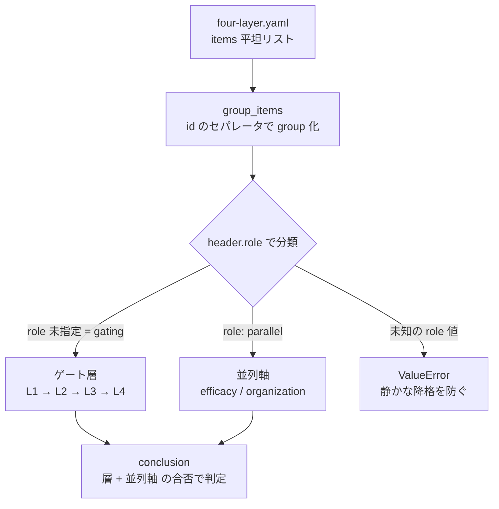
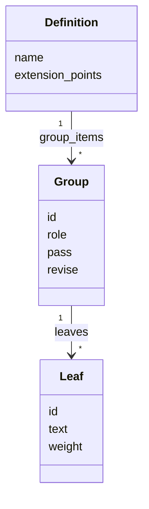

## 概要

AI 委任の readiness を機械採点する OSS [ai-delegation-readiness](https://github.com/suwa-sh/ai-delegation-readiness) に、**組織 readiness 軸**を追加しました(v0.3.0)。

これまでこのツールは「業務プロセスが委任に耐えるか」を 4 層(標準化 → 構造化 → 委任範囲 → 統制)+ 効果測定で採点していました。しかし AI 導入提案の現場で本当の障害は、業務プロセスより**組織側**にあります。撤退判断の権限が無い、受け皿となるリテラシー層が育っていない、知識移転契約を書けない、bus factor が 1 のまま。これらは業務プロセスをどれだけ磨いても解けません。

そこで、姉妹記事「[AI 前提時代の少人数フルスタック組織](https://zenn.dev/)」で整理した**味の素モデルの 6 条件チェックリスト + 反証 5** を、ツールの**並列軸**として実装しました。「業務は委任できるが、組織がまだ受け止められない」を、緑の業務スコアに隠さず独立した穴として表面化させます。

## 特徴: 2 軸を「並列」に採点する

キモは、組織軸を 4 層に**積み上げない**ことです。4 層は下層が崩れると上層の点検に意味がない「ゲート層」ですが、組織 readiness は業務プロセスとは別の観点なので、efficacy(効果測定)と同じ**並列軸**として置きます。

同梱サンプル `ajinomoto-discovery-team.yaml`(業務は整っているが組織が未成熟なチーム)を採点するとこうなります。

```text
[OK] L1 業務標準化層: PASS (100%)
[OK] L2 判断構造化層: PASS (100%)
[OK] L3 委任範囲層: PASS (100%)
[OK] L4 統制・追跡層: PASS (100%)
[OK] efficacy 効果測定: PASS (100%)
[NG] organization 組織 readiness層: BLOCK (33%)
    no: organization.C2, organization.C4, organization.C5, organization.C6

Conclusion: BLOCK
```

業務層は全て PASS でも総合判定は BLOCK。組織軸が、受け皿(C2)・知識移転契約(C4)・漸進分割の設計(C5)・bus factor 対策(C6)の不足を指し示します。これが「ベンダー比較から入る顧客に、組織側の障害を材料として返せる」という価値です。

## ■構造: role で層と並列軸を振り分ける

実装は既存の採点パイプラインに `role` という 1 フィールドを足すだけで済みました。`check-readiness` は定義の全 group を読み、header の `role` でゲート層と並列軸に分けます。



設計上こだわった点が 3 つあります。

- **未知の role はエラーにする**: `paralell` のような typo が入ると、組織軸が静かにゲート層へ降格し、変更の目的そのものが無言で反転します。これを防ぐため、許可値以外の role は `ValueError` で落とします。
- **空の並列軸はスキップする**: leaf を持たない並列軸(overlay 前提の空軸)は score 0.0 → block になりがちですが、「未評価」として採点から外し、誤 BLOCK を防ぎます。
- **JSON 出力を軸の集合に一般化**: `efficacy`(単数)を `parallel_axes`(配列)に変えました。将来 CI や AI エージェントが軸を横断的に読めます。

## ■データ: 定義の概念モデル

組織軸は正本の定義ファイルに直接足しました。overlay で自社固有の条件を追加・強化することもできます。



- **Group.role** が振り分けの唯一のキー。`organization` は `role: parallel`。
- 合否基準は **pass 1.0(6/6)/ revise 0.66(4/6 以上)**。元記事の「4 つ以上なら試行は妥当、3 つ以下ならまず受け皿作り」に一致します。
- **反証 5** は軸の `case_evidence` に根拠として記録。ただし元記事が数値の再確認を留保した反証(技能 17% 低下・ジュニア 20% 減)は `claim_needs_verification` とし、事実断定していません。

## 使う

```bash
docker run --rm ghcr.io/suwa-sh/ai-delegation-readiness:v0.3.0 \
  check-readiness examples/business/ajinomoto-discovery-team.yaml
```

自社を採点したいときは、`examples/business/` のサンプルをひな型に `yes` / `no` を埋め、必要なら overlay で自社固有の組織条件を足してください。詳細は [docs/05_organization_axis.md](https://github.com/suwa-sh/ai-delegation-readiness/blob/main/docs/05_organization_axis.md) にまとめています。

## まとめ

- 業務プロセスの readiness(4 層)と、組織の readiness(6 条件)は別物です
- 並列軸として採点すると、「業務は委任可だが組織が未成熟」を分離して見せられます
- 実装は `role` フィールド 1 つの追加で、既存の overlay 拡張(add / strengthen)もそのまま効きます
