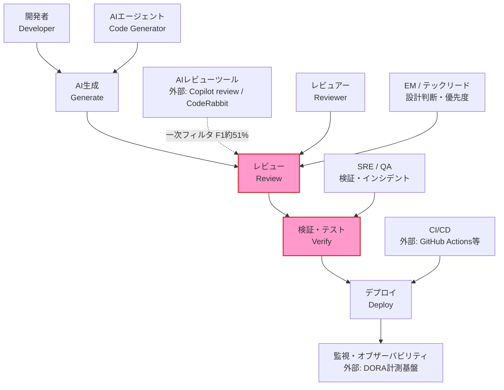
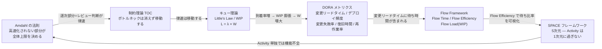
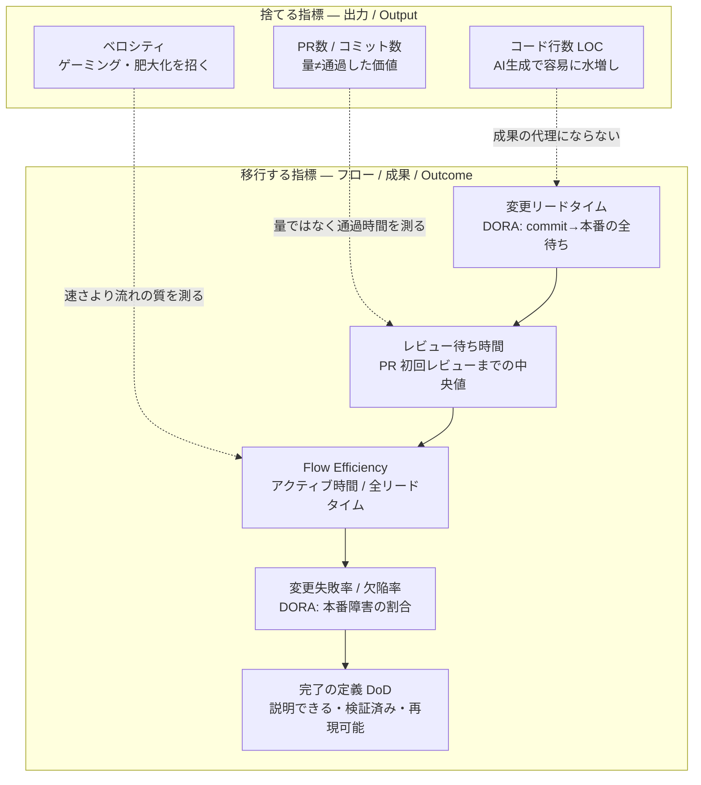
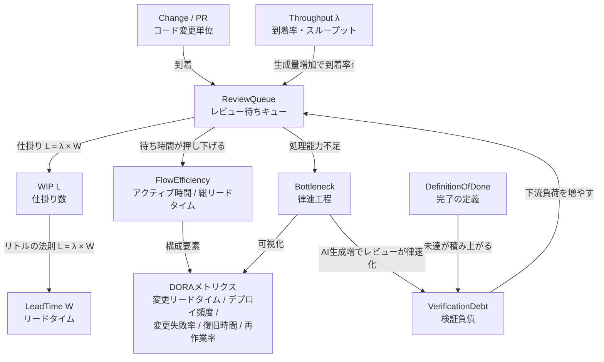
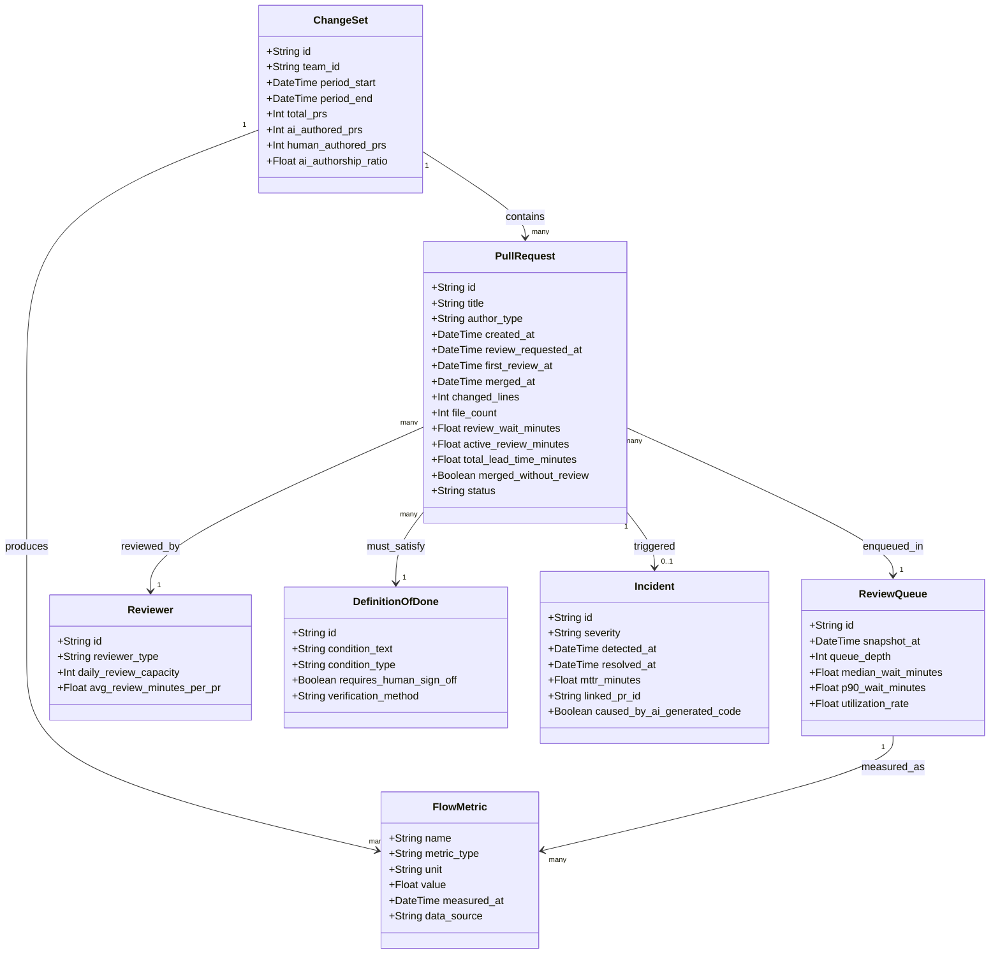

> 調査日: 2026-06-07 / 起点: Anthropic Institute「When AI builds itself」(Marina Favaro, Jack Clark, 2026-06-04)

## 概要

AIコーディングエージェントが「コードを書く」コストを劇的に下げた結果、開発組織のボトルネックは **生成（作ること）から、レビュー・検証・設計判断（何を通すかを決めること）へ移動** しつつあります。

Anthropic Institute の記事「When AI builds itself」（Favaro, Clark, 2026-06-04）は、これを組織の内側から記録した一次証言です。同記事は「As of May 2026, more than 80% of the code we merge into Anthropic's codebase was authored by Claude（2026年5月時点で、マージするコードの80%超を Claude が書いた）」「human code review has become a new bottleneck（人間のコードレビューが新しいボトルネックになった）」と明言しています。ただし後述するとおり、この数値は利害相反のある自己申告であり、過信は禁物です。

この構造は新しい法則ではありません。並列計算における **Amdahl の法則**（高速化されない部分が全体性能の上限を決める）と、Reinertsen の **製品開発フローのキュー理論**（リトルの法則 `L = λ × W`: 仕掛り（WIP）が増えればリードタイムは比例して悪化する）を開発組織に当てはめれば、到着率 λ だけが跳ね上がりレビュー処理能力が一定のとき、レビュー待ちキューが膨張しリードタイムが悪化することは数理的に自明です。この理論予測は、Faros AI のテレメトリ（22,000 開発者・4,000 超チーム・2年間、ベンダー実測）が示す「AI 高採用チームで PR 初回レビューまでの中央値 +156.6%、レビューなしマージ PR +31.3% 増」という観測とも整合します。

なぜ今これが重要なのでしょうか。AI コード生成ツールの普及によって、「生成量（コード行数・PR 数・コミット数）」が組織の成果指標として定着しやすくなっています。しかし SPACE フレームワーク（Forsgren ら, ACM Queue 2021）が論じたとおり、活動量は5次元のうちの1つに過ぎず、単独で使うと誤った像を与えます。AI 時代にはこれが先鋭化し、生成量が伸びても「レビューを通過した価値」が伸びなければ、組織は加速したと勘違いしたまま品質劣化に気づけません。日本企業の実測（Findy）では、AI 導入後に人員を1.5倍にしても1人あたりの PR 作成数はほぼフラットで、Approve までの時間が約20分延び、レビューコメント数が30%近く増加しました。これはフロー下流が詰まっていることの傍証です。

本記事は、この主張を支える2つの有名な証拠 ——「AI で開発者は19%遅くなった」（METR）と「Claude が80%を書く」（Anthropic）—— に依存しすぎないことを最初に断っておきます。前者は研究チームが2026-02に実験設計を見直し、「30〜50%の開発者が AI 無しではやりたくないタスクの提出を控えた」という選択効果を自ら告白しています。後者は Anthropic の IPO 申請の約1週間後の自己申告で、測定方法も非公開です。本記事では、これら2証拠への依存を下げ、複数の独立した実測・理論・一次証言で主張を組み立てます。

## 特徴

### 1. ボトルネックは消えず、移動する

制約理論（TOC）と Amdahl の法則が共に示すのは、ある工程を速くしても全体スループットは「次に遅い工程」で頭打ちになるという原理です。Brian Conn（Connsulting, 2026-05-26, 個人ブログ・査読なし）は、これを AI 支援開発に直結させて端的に述べました。*"Speed up one stage in a constrained system, and the bottleneck moves."*（制約系の一段を速くすると、ボトルネックは移動する）。コーディングが加速した結果、ボトルネックはレビュー・テスト・デプロイへ移りました。Faros AI の実環境テレメトリ（ベンダー実測）では、AI 高採用チームで PR 初回レビューまでの中央値 +156.6%、コードレビュー平均時間 +199.6%、レビュー中の中央値 +441.5% と、下流の滞留が複数の粒度で悪化しています。

### 2. AI レビューは人間レビューを「肩代わり」できていない

AI コードレビュー（GitHub Copilot review・CodeRabbit 等）は大量に導入されています（Copilot review は累計6,000万件・GitHub 上のコードレビューの5件に1件超、2026-03-05 時点）。しかし捕捉率は不完全です。CodeRabbit は独立ベンチ（Martian）で F1 約51%（precision 約49%）にとどまります。これは AI レビュー一般の上限を示すものではありませんが、静的解析ツールの検知率も従来50〜60%で頭打ちとされており（NIST SATE）、O'Reilly Radar も「AI Code Review Only Catches Half of Your Bugs」と論じています。少なくとも半分前後を見逃しうる、と捉えるのが安全です。GitHub の公式ドキュメント自身が「careful human code review で補完すべき」と明記し、推論モデル採用で positive フィードバック +6% の一方でレビュー遅延 +16% を記録しています。AI レビューは「最初の一掃」には有効ですが、設計判断・業務ロジック・認可の最終検証は人間に残ります。なお CodeRabbit は2025年に RCE 脆弱性「PwnedRabbit」（Rubocop の非サンドボックス実行で GitHub App の秘密鍵が漏洩、100万超リポジトリに影響）を指摘されており（Endor Labs ブログ, CVE 番号は一次未確認）、AI レビューベンダーの主張は一層相対化して読む必要があります。

### 3. 生成が安くなった分、欠陥は検証フェーズへ移転する

AI 生成コードは速く・多く生まれますが、欠陥率はむしろ高くなります。CodeRabbit の分析（ベンダー, GitHub OSS PR 470件）では、AI 共著 PR が人間のみの PR の約 **1.7倍** の問題（10.83 vs 6.45 件/PR）を含み、security カテゴリは最大 **2.74倍** でした（いずれもベンダー由来、一次生データ未公開）。Veracode（ベンダー）の評価では、生成課題のうち **45%** がセキュリティテストに失敗しました（＝構文的には動作しても OWASP Top 10 級の脆弱性を含む。セキュリティ通過は約55%にとどまる。Java 72% 失敗、XSS 86% 防御失敗。これは評価課題での失敗率であり、実運用コードの脆弱性率そのものではない点に注意）。一次証言として、curl の Daniel Stenberg（2025-07-14）は「1件の AI slop 報告で3〜4人が30分〜数時間拘束される」と記録し、Ladybird（2026-06-05）は「PR が提出者について以前ほど多くを語らなくなった」として公開 PR の受付を停止しました。生成の加速は、検証・トリアージ・修正確認という下流の負荷を増やします。

### 4. 「完了の定義」が後ろ倒しになる（検証負債の蓄積）

「動きました（It works）」は完了ではなくなります。AI が書いたコードは「書いた人がいない」ため、レビュー時に意図と正しさを再構築する必要があり、これを "verification debt"（検証負債）と呼びます（Werner Vogels の概念として二次文献が引用）。Addy Osmani（"Code Review in the Age of AI"）も、コードが「動く」ことと「正しく・安全で・保守可能である」ことは別だと論じ、AI 時代こそレビューでの理解の再構築が要ると指摘しています。日本企業の現場でも、完了条件を「自分のコードを説明できること」（サイバーエージェント, qsona）へ、レビューの単位を「差分を読む → 判断を読む」（135yshr）へ再定義する動きが出ています。

METR の RE-Bench（arXiv:2411.15114, 7環境・61専門家・71試行）は、時間予算によって AI と人間の優劣が逆転することを実測で示しました。2時間予算では AI が人間の4倍スコアを出しますが、32時間予算では人間が AI の2倍になります。長い時間をかけて試行錯誤を積み上げる「returns to time」において、人間はまだ優位を保っています。これが「判断・見極め・bigger picture」という残存比較優位の実証的裏付けです。

### 5. 生成量は成果指標として機能しなくなる

最も実務的な含意がこれです。SPACE フレームワーク（Forsgren ら, ACM Queue 2021）は「活動量（commits・LOC・PR 数）は5次元のうち1つに過ぎず、単独で使うと誤った像を与える」と論じました。AI 時代にはこれが先鋭化します。Findy の実測では、生成 AI 導入後に人員を1.5倍にしても1人あたりの PR 作成数はほぼフラットで、むしろ Approve までの時間が約20分延び、レビューコメント数が30%近く増えました。生成量は伸びても、成果（通過した価値）は伸びていません。Accelerate（Forsgren ら, 2018, 4年・2,000超企業・23,000超データセット）は、LOC 報酬が「肥大化と高保守コスト」に、velocity が「ゲーミング」に陥ると指摘しました。AI はこのゲーミングを自動化します。DORA の5指標（変更リードタイム・デプロイ頻度・変更失敗率・失敗復旧時間・デプロイ再作業率）と Flow Framework の Flow Efficiency（待ち時間対作業時間の比率）が、生成量に代わる測定軸の候補です。ただし DORA 公式すら「メトリクスは診断用であって目標値ではない」と述べており（Goodhart の法則）、いずれも万能ではありません。

## 構造

具体的なプロダクトではなく方法論・概念を扱うため、ここでは C4 model を「関係マップ／依存マップ」に読み替えて表現します。

### システムコンテキスト図

AI 生成から本番デプロイまでの開発フローに関わるロールと外部要素の関係マップです。AI が到着率（生成量）を急増させる一方、人間側のレビュー・検証・判断が律速として残る構造を示します。



赤枠は AI 導入後の新ボトルネックを表します。

| 要素 | 役割 | 出典・補足 |
|---|---|---|
| AIエージェント | コード生成を担い到着率 λ を急増させる主体 | Anthropic「When AI builds itself」2026-06-04 |
| 開発者 | AIへの指示・意図の定義・レビュー参加 | METR arXiv:2507.09089 |
| レビュアー | PR の内容・意図・正しさを人間として保証する律速点 | Faros AI 2026, atama plus |
| EM / テックリード | 設計判断・優先度・「何を作るか」の意思決定 | Anthropic 記事「research taste」比較優位 |
| SRE / QA | 変更失敗率・インシデント対応・検証の最終保証 | DORA 5指標, Faros incidents-to-PR +242.7% |
| AIレビューツール | 初回フィルタ役だが捕捉率は F1約51%、公式も人間補完必須と明記 | GitHub Copilot docs, CodeRabbit Martian bench |
| CI/CD | 自動テスト・デプロイパイプライン（高速化済みの工程） | DORA 4 Keys |
| 監視 | DORA メトリクス計測基盤（生成量でなくフロー品質を観測） | dora.dev |

### コンテナ図

このテーマを構成する理論ブロックの関係マップです。各理論が「生成加速後の律速」をどう説明するかを示します。



| 理論ブロック | 生成加速後の律速への説明 | 出典 |
|---|---|---|
| Amdahl の法則 | レビュー・判断という「高速化されない工程」が全体スループット上限を決める | Amdahl 1967 AFIPS; Conn 2026-05-26 |
| キュー理論 / リトルの法則 | λ（到着率=生成量）が増えスループット一定なら L・W が直線増大（レビュー待ちキューの膨張） | Reinertsen 2009 |
| 制約理論 TOC | 「制約系の一段を速くするとボトルネックは移動する」（コーディング→レビューへ） | Brian Conn 2026 (引用); Goldratt |
| DORA メトリクス | 変更リードタイム / 変更失敗率 / 再作業率で滞留と品質劣化を測定 | dora.dev; Accelerate 2018 |
| SPACE フレームワーク | Activity（commits/LOC/PR 数）は5次元中1つ（単独使用は誤像を生む） | Forsgren ら ACM Queue 2021 |
| Flow Framework | Flow Time（待ち込み）/ Flow Efficiency（待ち比率）で滞留を直接可視化 | Kersten 2018; flowframework.org |

### コンポーネント図

「測定軸の組み替え」を具体化する依存マップです。出力指標から捨てるべきもの、移行すべきフロー指標、それぞれの依存関係を示します。



| 指標 | カテゴリ | 役割・測るもの | 出典・補足 |
|---|---|---|---|
| コード行数 LOC | 捨てる | AI 生成で容易に増量。品質・価値と無相関 | Accelerate 2018; SPACE 2021 |
| PR 数 / コミット数 | 捨てる | 生成ツール導入後は水増し可能。Findy: 人員1.5倍でも PR数フラット | SPACE Activity 次元; Findy 実測 |
| ベロシティ | 捨てる | ゲーミング・タスク細断・肥大化を誘発 | Accelerate; Reinertsen 高稼働率の罠 |
| 変更リードタイム | 移行先 | commit から本番までの全工程（待ちを含む）。ボトルネック位置が現れる | DORA 4 Keys |
| レビュー待ち時間 | 移行先 | PR 初回レビューまでの中央値。Faros: AI 採用高で +156.6% 悪化 | Faros AI 2026（ベンダー実測） |
| Flow Efficiency | 移行先 | アクティブ作業時間 / 全リードタイム。待ち比率を直接可視化 | Flow Framework; Kersten 2018 |
| 変更失敗率 / 欠陥率 | 移行先 | AI 生成コードの欠陥下流移転を検知。CodeRabbit: AI 共著は1.7倍 | DORA; CodeRabbit 2025-12（ベンダー） |
| 完了の定義 DoD | 移行先 | 「動いた」から「説明できる・検証済み・再現可能」へ。検証負債の解消条件 | qsona / サイバーエージェント; Addy Osmani 2026 |

## データ

### 概念モデル



リトルの法則の定義は `L = λ × W` です。

- **L**（WIP）: ある時点でシステム内に存在する仕掛り数（例: レビュー待ち PR 数）
- **λ**（Throughput）: 単位時間あたりの到着率・スループット（例: AI が生成する PR 数/日）
- **W**（LeadTime）: 仕掛り1件がシステムを通過するのに要する平均時間（例: PR 作成からマージまで）

λ（到着率）が増加してスループット（処理能力）が一定のまま変わらない場合、L（仕掛り）か W（リードタイム）のいずれか、または両方が増大します。なお、リトルの法則が成り立つのは安定状態（到着率 ≦ 処理能力）が前提です。到着率が処理能力を超え続けると、キューと待ち時間は平衡せず発散します（AI 生成が人間レビュー能力を恒常的に上回る状況がまさにこれにあたります）。

Flow Efficiency の定義は `Flow Efficiency = アクティブ作業時間 / 総リードタイム W` です。逆に言えば `待ち比率 = 待ち時間 / 総リードタイム W` であり、Flow Efficiency が低いほど、リードタイムのほとんどが「待ち」で占められていることを示します。

| 概念 | 定義 | このテーマでの意味 |
|---|---|---|
| Change / PR | レビュー・マージの対象となるコード変更の単位 | AI生成により到着量が急増する起点 |
| ReviewQueue | レビュー待ちの変更が滞留するキュー | 人間レビュー能力の上限に当たって膨張する律速点 |
| Throughput λ | 単位時間あたりにシステムへ投入・処理される変更数 | AIが生成（到着率）を上げても処理側が追随しないと詰まる |
| WIP L | ある時点でシステム内に存在する仕掛り数 | L = λ × W の L。WIPが増えるとリードタイムが悪化する |
| LeadTime W | PR作成からマージ（価値提供）までの総時間 | 待ち時間を含む。フロー遅延の直接指標 |
| FlowEfficiency | アクティブ作業時間 / 総リードタイム | 典型的製品開発では15〜40%。残りは待ち |
| DORAメトリクス | 変更リードタイム・デプロイ頻度・変更失敗率・復旧時間・再作業率 | 生成量（LOC/PR数）に代わるフロー・品質の成果指標 |
| DefinitionOfDone | 「完了」と見なす条件の明示的な定義 | 「動いた」ではなく「説明できる・検証済み」への更新が必要 |
| VerificationDebt | 検証・確認が後回しになった負の蓄積（検証負債） | AI生成コードは意図が不在で、レビュー時に再構築コストが発生する |
| Bottleneck | システム全体のスループットを律速している工程 | Amdahlの法則: コーディングが加速すると律速はレビュー・検証へ移動する |

### 情報モデル



| エンティティ | 属性 | 型 | 出典・備考 |
|---|---|---|---|
| PullRequest | author_type | String (`human` / `ai` / `human+ai`) | 推測。CodeRabbitレポートで「AI共著PR」を区別 |
| PullRequest | review_wait_minutes | Float | Faros AI実測: AI採用で中央値+156.6% |
| PullRequest | active_review_minutes | Float | Faros AI実測: 平均+199.6% |
| PullRequest | total_lead_time_minutes | Float | DORAの変更リードタイムに対応 |
| PullRequest | merged_without_review | Boolean | Faros AI実測: AI採用で+31.3% |
| PullRequest | status | String (`open` / `in_review` / `approved` / `merged` / `closed`) | 一般的なGit/PR管理システムの状態 |
| ReviewQueue | queue_depth | Int | リトルの法則のL（WIP）に対応 |
| ReviewQueue | utilization_rate | Float | Reinertsenの「高稼働率での混雑爆発」の根拠指標 |
| Reviewer | reviewer_type | String (`human` / `ai_tool`) | Copilot review・CodeRabbitなどAIツールを区別 |
| Reviewer | daily_review_capacity | Int | スループット（λの処理側）の上限。人間は一定、AIツールはスケーラブル |
| FlowMetric | metric_type | String (`output` / `outcome` / `flow`) | output=生成量, outcome=ビジネス価値, flow=リードタイム・効率 |
| FlowMetric | data_source | String | ベンダー由来データは留保が必要（Faros/CodeRabbit/Veracode） |
| DefinitionOfDone | condition_type | String (`functional` / `testable` / `explainable` / `verified`) | サイバーエージェント・135yshr から推測 |
| DefinitionOfDone | requires_human_sign_off | Boolean | AIレビューは捕捉率約50〜60%のため人間最終確認が残る |
| Incident | caused_by_ai_generated_code | Boolean | 推測。AI生成コードと障害の因果は現状測定困難 |
| ChangeSet | ai_authorship_ratio | Float | Anthropic社内実測「80%超」(2026-05)。測定方法は非公開 |

FlowMetric の `metric_type` は次の3分類で扱います。

| metric_type | 定義 | 代表指標 | 批判リスク |
|---|---|---|---|
| `output` | 活動量・生成量 | LOC / PR数 / コミット数 / ベロシティ | Goodhartでゲーミング可能。AI時代に成果の代理として機能しない |
| `outcome` | ビジネス・品質価値 | 変更失敗率 / MTTR / 欠陥率 | 測定ラグあり。因果帰属が困難 |
| `flow` | プロセス効率・滞留 | 変更リードタイム / Flow Efficiency / レビュー待ち時間 | output より良いproxyだが DORA自身が「診断用、目標値ではない」と留保 |

## 構築方法

ここからは「計測基盤と運用ルールの導入手順」を、具体的なコード例つきで示します。コード例はすべて「実装案・例」であり、補完元（一次ソース・実在 API）を添えています。

### 1. DORA / Flow メトリクスの計測基盤

#### 1-1. GitHub GraphQL でレビュー待ち時間を算出する（実装案・例）

補完元は GitHub GraphQL API v4（実在エンドポイント `https://api.github.com/graphql`）と、Faros AI が用いた「PR 初回レビューまでの時間」指標です。以下の Python スクリプトは「PR 作成時刻 → 初回レビュー時刻 → マージ時刻」を取得し、レビュー待ち時間（分）を算出します。

```python
#!/usr/bin/env python3
"""
pr_wait_metrics.py — PR レビュー待ち時間・変更リードタイムを GitHub GraphQL で取得する
実装案/例。補完元: GitHub GraphQL API v4 公式スキーマ
https://docs.github.com/en/graphql/reference/objects#pullrequest
"""

import os
import sys
import json
from datetime import datetime
import urllib.request

GITHUB_TOKEN = os.environ.get("GITHUB_TOKEN", "")
OWNER = sys.argv[1] if len(sys.argv) > 1 else "your-org"
REPO  = sys.argv[2] if len(sys.argv) > 2 else "your-repo"
LIMIT = int(sys.argv[3]) if len(sys.argv) > 3 else 50

QUERY = """
query($owner: String!, $repo: String!, $limit: Int!, $cursor: String) {
  repository(owner: $owner, name: $repo) {
    pullRequests(
      first: $limit,
      after: $cursor,
      states: [MERGED],
      orderBy: {field: UPDATED_AT, direction: DESC}
    ) {
      pageInfo { hasNextPage endCursor }
      nodes {
        number
        title
        createdAt
        mergedAt
        reviews(first: 1, states: [APPROVED, CHANGES_REQUESTED, COMMENTED]) {
          nodes { submittedAt }
        }
      }
    }
  }
}
"""

def graphql(query, variables):
    payload = json.dumps({"query": query, "variables": variables}).encode()
    req = urllib.request.Request(
        "https://api.github.com/graphql",
        data=payload,
        headers={
            "Authorization": f"bearer {GITHUB_TOKEN}",
            "Content-Type": "application/json",
        },
    )
    with urllib.request.urlopen(req) as resp:
        return json.loads(resp.read())

def parse_dt(s):
    if not s:
        return None
    return datetime.fromisoformat(s.replace("Z", "+00:00"))

def minutes_between(a, b):
    if not a or not b:
        return None
    return round((b - a).total_seconds() / 60, 1)

rows = []
cursor = None
while True:
    result = graphql(QUERY, {"owner": OWNER, "repo": REPO, "limit": LIMIT, "cursor": cursor})
    prs = result["data"]["repository"]["pullRequests"]
    for pr in prs["nodes"]:
        created  = parse_dt(pr["createdAt"])
        merged   = parse_dt(pr["mergedAt"])
        reviews  = pr["reviews"]["nodes"]
        first_rv = parse_dt(reviews[0]["submittedAt"]) if reviews else None
        rows.append({
            "pr": pr["number"],
            "first_review_min": minutes_between(created, first_rv),  # レビュー待ち時間
            "lead_time_min": minutes_between(created, merged),       # 変更リードタイム
        })
    if not prs["pageInfo"]["hasNextPage"]:
        break
    cursor = prs["pageInfo"]["endCursor"]

wait_vals = sorted(r["first_review_min"] for r in rows if r["first_review_min"] is not None)
lt_vals   = sorted(r["lead_time_min"]    for r in rows if r["lead_time_min"]    is not None)

def median(lst):
    n = len(lst)
    return lst[n // 2] if n else None

print(f"対象PR数: {len(rows)}")
print(f"初回レビュー待ち中央値: {median(wait_vals)} 分")
print(f"変更リードタイム中央値:  {median(lt_vals)} 分")
```

```bash
export GITHUB_TOKEN="ghp_..."
python3 pr_wait_metrics.py your-org your-repo 100
```

`reviews` は GitHub の `PullRequestReview` オブジェクト（実在）を使います。インラインコメント初回も見たい場合は `comments(first:1)`（`IssueComment`）を追加してください。

#### 1-2. レビューなしマージ率を算出する（実装案・例）

補完元は GitHub REST API の `GET /repos/{owner}/{repo}/pulls` と `/pulls/{pull_number}/reviews`（実在）、および Faros AI の実測「レビューなしマージ +31.3%」（ベンダー）です。

```bash
#!/usr/bin/env bash
# no_review_merge_rate.sh — レビューなしマージ PR 率を算出（実装案/例）
# 補完元: https://docs.github.com/en/rest/pulls/reviews
OWNER="${1:?usage: $0 owner repo [limit]}"; REPO="${2:?}"; LIMIT="${3:-100}"

gh api "repos/$OWNER/$REPO/pulls?state=closed&per_page=$LIMIT" --jq '.[].number' | while read -r N; do
  MERGED=$(gh api "repos/$OWNER/$REPO/pulls/$N" --jq '.merged_at // empty')
  [ -z "$MERGED" ] && continue
  # 「レビューなしマージ」= レビューが1件も付かずにマージされた PR（reviews.length == 0）
  REVIEWS=$(gh api "repos/$OWNER/$REPO/pulls/$N/reviews" --jq 'length')
  # 「承認なしマージ」を別に見たい場合は APPROVED 件数も併せて数える
  APPROVED=$(gh api "repos/$OWNER/$REPO/pulls/$N/reviews" --jq '[.[]|select(.state=="APPROVED")]|length')
  LABEL=$([ "$REVIEWS" -eq 0 ] && echo NO_REVIEW || ([ "$APPROVED" -eq 0 ] && echo NO_APPROVAL || echo REVIEWED))
  echo "$N,$LABEL"
done | sort -t, -k2 | uniq -c -f1
```

出力の `NO_REVIEW`（レビューが1件も付かずマージ）比率を週次でトレンド追跡します。`COMMENTED` や `CHANGES_REQUESTED` はあるが Approve が無い PR は `NO_APPROVAL` として区別します。増加傾向なら WIP 制限の適用サインです。

#### 1-3. Flow Efficiency（待ち比率）の簡易算出（実装案・例）

補完元は Flow Framework の「Flow Efficiency = Active Time / Flow Time」と、ourly の実測（サイクルタイム中央値 15.7h、レビュー→Approve 2.5h）です。

```python
# flow_efficiency.py — PR の Flow Efficiency を推定する（実装案/例）
# 補完元: Flow Framework (Mik Kersten 2018) https://flowframework.org/ffc-discover/
# 注意: 本例は「初回レビュー待ちのみ」を待ち時間と見なす簡易モデル。
# 実際には CI 待ち・デプロイ待ちも待ち時間に含まれるため、提示値は過楽観になりうる。
# 正確な FE は各フェーズのタイムスタンプを別途収集して算出すること。
def flow_efficiency(lead_time_min: float, first_review_wait_min: float) -> dict:
    wait_time = first_review_wait_min
    active_time = lead_time_min - wait_time
    if lead_time_min <= 0:
        return {}
    fe = max(0.0, active_time / lead_time_min * 100)
    return {
        "lead_time_min": lead_time_min,
        "wait_time_min": wait_time,
        "active_time_min": active_time,
        "flow_efficiency_pct": round(fe, 1),
    }

# 使用例（ourly 実測値を参考）
print(flow_efficiency(lead_time_min=15.7 * 60, first_review_wait_min=2.5 * 60))
# -> {'lead_time_min': 942.0, 'wait_time_min': 150.0, 'active_time_min': 792.0, 'flow_efficiency_pct': 84.1}
```

解釈の目安として、Flow Efficiency が40%未満は「待ち支配型」、70%超はハイパフォーマーとされます（Flow Framework 二次解説）。AI 導入後に分母（リードタイム）が増え分子（アクティブタイム）が伸びない場合、FE 低下がボトルネック可視化の早期警報になります。

### 2. 生成量指標を成果ダッシュボードから外す（診断用に格下げ）

補完元は Findy の実測（人員1.5倍でも PR 数フラット）、KDDI の「生成量を成果指標にしない」、DORA 公式の「診断用であって目標値ではない」です。

| 種別 | 指標 | 推奨区分 | 理由 |
|------|------|----------|------|
| 成果（Outcome） | 変更リードタイム | Primary KPI | ボトルネック位置を直接反映 |
| 成果 | 変更失敗率（CFR） | Primary KPI | AI 生成コードの欠陥密度悪化を検知 |
| 成果 | MTTR（障害復旧時間） | Primary KPI | — |
| フロー | 初回レビュー待ち中央値 | Primary KPI | 律速の定量シグナル |
| フロー | Flow Efficiency | Primary KPI | 待ち比率の構造可視化 |
| フロー | レビューなしマージ率 | Primary KPI（上昇で警告） | 品質迂回の検知 |
| 活動量（Output） | PR 数 / コミット数 | Diagnostic（診断用） | 急増が待ちキュー膨張の先行指標になる場合のみ参照 |
| 活動量 | LOC / トークン消費 | Diagnostic（診断用） | 「生成量≠成果」（DORA Goodhart 留保あり） |

```json
{
  "title": "Dev Flow Health",
  "panels": [
    {
      "title": "初回レビュー待ち中央値 (分)",
      "type": "stat",
      "thresholds": {"steps": [
        {"color": "green", "value": null},
        {"color": "yellow", "value": 240},
        {"color": "red", "value": 480}
      ]}
    },
    {"title": "変更リードタイム中央値 (時間)", "type": "stat"},
    {"title": "PR数/週 [診断用]", "type": "timeseries",
     "description": "成果指標ではない。レビュー待ち増加と連動するかの診断にのみ使用"}
  ]
}
```

「診断用」パネルはデフォルトで折り畳み（collapsed row）に置き、Primary KPI より目立たない配置にして「見る頻度の差」を設計に組み込みます。

### 3. 完了の定義（Definition of Done）をリポジトリに明文化する

補完元はサイバーエージェントの「自分のコードを説明できる」「テスト比率」、qsona の「ペーストした瞬間からそれは自分が責任をもつべき」、GitHub の PR テンプレート機能（実在）です。PR テンプレート（`.github/pull_request_template.md`）の骨子は次のとおりです。

```markdown
## このPRの目的（1行で）
<!-- 1PR=1目的 — 複数目的なら分割してください -->

## 完了の定義チェックリスト（提出前に自己確認）
- [ ] この差分を第三者に口頭で説明できる（AI生成箇所も含め理解済み）
- [ ] ユニットテストを追加・更新した（テスト比率: テスト行 / コード行 を確認）
- [ ] ローカルで動作確認した（再現手順を下記に書く）
- [ ] セキュリティ影響を確認した（認可・入力検証・シークレット漏洩）
- [ ] AIセルフレビューチェックリストを実施した

## レビュアーへの依頼事項
<!-- 特に見てほしい点・迷った設計判断を書く。差分ではなく「判断」を共有する -->
```

あわせて、`docs/THREAT_MODEL.md`（信頼境界・STRIDE 脅威表・AI 生成コード特有のレビュー必須項目）と `docs/REVIEW_GUIDELINES.md`（レビュアーの責任範囲・優先度・WIP 制限ルール）をリポジトリに置きます。AI 生成コード特有のレビュー必須項目は「認可チェックの欠落／入力検証の抜け／シークレットのハードコード／OWASP Top 10 準拠確認」です。

## 利用方法

### 1. WIP 制限の日次運用

補完元は ourly の「1人同時 PR は最大1つ」（実測サイクルタイム 15.7h）、すてぃおの「1PR=1目的」、atama plus の日次担当アサイン制です。

- **1人1PR 原則**: 実装者は「自分がレビュー待ちの PR」が存在する間、新規 PR を作りません（例外は変更行数20行未満の hotfix）。「レビュー待ちの間に後続実装を始めて即応できない」を防ぎます（ourly の自己開示）。
- **1PR=1目的 原則**: 機能追加とリファクタリングを混在させません。複数目的があるなら分割してシリアルに出します。

日次担当アサインの実装案（GitHub CLI）は次のとおりです。

```bash
#!/usr/bin/env bash
# assign_reviewer.sh — 日次レビュー担当をローテーションでアサイン（実装案/例）
REPO="${1:?usage: $0 owner/repo}"
MEMBERS=("alice" "bob" "charlie" "dave")
DOW=$(date +%u)                       # 1-7
IDX=$(( (DOW - 1) % ${#MEMBERS[@]} ))
REVIEWER="${MEMBERS[$IDX]}"
echo "本日のレビュー担当: $REVIEWER"
gh pr list --repo "$REPO" --state open --json number,reviewRequests \
  --jq '.[] | select(.reviewRequests | length == 0) | .number' | while read -r N; do
  gh pr edit "$N" --repo "$REPO" --add-reviewer "$REVIEWER"
done
```

atama plus の実測では、日次担当アサイン導入後、PR 件数が201→535（約2.7倍）に増えても、リードタイム中央値は14.2h→4.3h（約1/3）に短縮しました（2026-05-12）。

### 2. AI セルフレビューのチェックリスト運用

補完元は Findy の「過去レビューコメントを LLM 分析しカスタムチェックリスト生成 → Claude Code が従う」、TOKIUM の「agent-review 最大5体並列」です。過去 PR のレビューコメントを `gh api .../pulls/{n}/comments` で収集し、LLM でよく指摘されるパターンを抽出して `.github/ai_review_checklist.md` を生成します。これを `CLAUDE.md` から読み込ませ、PR 作成前に Claude Code が全項目をセルフチェックします。PR オープン時にチェックリストを自動コメントする GitHub Actions と組み合わせると徹底しやすくなります。

```yaml
# .github/workflows/ai_self_review_reminder.yml（実装案/例）
name: AI Self-Review Reminder
on:
  pull_request:
    types: [opened, ready_for_review]
jobs:
  post-checklist:
    runs-on: ubuntu-latest
    permissions:
      pull-requests: write
    steps:
      - uses: actions/checkout@v4
      - uses: actions/github-script@v7
        with:
          script: |
            const fs = require('fs');
            const p = '.github/ai_review_checklist.md';
            const body = fs.existsSync(p) ? fs.readFileSync(p, 'utf8')
              : '`.github/ai_review_checklist.md` が見つかりません。';
            await github.rest.issues.createComment({
              owner: context.repo.owner, repo: context.repo.repo,
              issue_number: context.issue.number,
              body: `## AIセルフレビュー確認\n\n${body}`,
            });
```

### 3. レビュー単位を「差分 → 判断」に変える運用

補完元は 135yshr の「コードを読むのをやめた」（checkpoint ID・セッションビュー・Line Attribution）、atama plus の「中〜大規模 PR は依然人間レビュー」、qsona の「自分のコードを説明できる」です。

AI 利用 PR には、PR 説明に「AI 生成ログ」（セッション日時・使用ツール/モデル・プロンプト概要・主要な判断ポイント）と「設計上の判断」（なぜこのアプローチか／棄却した選択肢／特に確認してほしい箇所）を添付します。レビュアーは差分そのものより「判断」を読みます。

大型 PR を自動でラベル・警告する CI の実装案を示します。Google「Modern Code Review」（ICSE-SEIP'18）は「変更の中央値は約24行」「小さい変更ほどレビューが速い（全体中央値4時間未満、超大型変更では初回フィードバックまで約5時間）」を示しており、これと一般的なレビュー上限の目安（200〜400行。135yshr や古典的なレビュー研究が挙げる範囲）を踏まえて、ここでは400行を上限目安とします。

```yaml
# .github/workflows/pr_size_check.yml（実装案/例）
name: PR Size Check
on:
  pull_request:
    types: [opened, synchronize]
jobs:
  size-check:
    runs-on: ubuntu-latest
    permissions:
      pull-requests: write
    steps:
      - uses: actions/github-script@v7
        with:
          script: |
            const { data: files } = await github.rest.pulls.listFiles({
              owner: context.repo.owner, repo: context.repo.repo,
              pull_number: context.issue.number, per_page: 100,
            });
            const total = files.reduce((s, f) => s + f.changes, 0);
            if (total > 800) {
              await github.rest.issues.createComment({
                owner: context.repo.owner, repo: context.repo.repo,
                issue_number: context.issue.number,
                body: `⚠️ この PR は **${total} 行**（推奨上限 400 行）。Google 実測では超大型でレビューレイテンシ約5時間。分割を検討してください。`,
              });
            }
```

## 運用

### 週次フロー効率レビューの回し方

最低週1回、以下の5指標を揃えてチームで確認します。「レビュー待ち」を可視化しないと、生成量の増大がボトルネック悪化を隠してしまいます。

| 指標 | 計測方法 | 閾値の目安（参考値） |
|---|---|---|
| PR 初回レビューまでの中央値 | git log / Findy Team+ / LinearB | チーム合意値（絶対値より変化率） |
| レビューなしマージ率 | レビューなしマージ数 / 全マージ数 | 上昇傾向で即アラート |
| レビュー中時間（Cycle Time 分解） | PR open→approve の中央値 | 前週比 +20% 以上で要因調査 |
| Flow Efficiency | アクティブ作業時間 / 総リードタイム | 50% 未満はレビュー滞留の兆候 |
| 変更失敗率 / 欠陥率 | インシデント数 / デプロイ数 | 生成量増後の推移を並べる |

手順は次のとおりです。①指標を前週と並べてグラフ表示する（絶対値より傾向）②「PR 初回レビュー待ち」トップ5件の原因を確認する（レビュアー不足／PR サイズ過大／可読性低下）③レビューなしマージが増えたらアラート設定を見直す ④「生成量（PR 数・コミット数）」は参考列に置くが議題にしない。

ただし注意が必要です（Goodhart）。指標を KPI に設定すると「PR を小さく分割してレビュー待ち数を下げる」等のゲーミングが起きます。あくまで診断用に使い、チーム目標値にはしないでください。

### レビュー待ちアラートとレビューなしマージ率の監視

GitHub Actions の `schedule`（平日朝9時）で「レビュー待ち24時間超」の PR を検知し Slack 通知します。アラートは「営業時間の開始時」に発火させ、夜間マージ後の積み残しを朝一で検知します。閾値は絶対値でなく、チーム合意の SLA で決めます。レビューなしマージ率（`merged_without_review / total_merged`）は、直近100件のスナップショットを週次で比較します。

### メトリクスの見方

- **「PR 数が増えた」は単体では情報量ゼロ**: Findy では人員1.5倍でも1人あたり PR 数フラット、Approve まで約20分延長。PR 数増は生成量増であって成果増ではありません。
- **「レビュー待ち時間が短縮した」は施策の成功**: atama plus は AI セルフレビュー導入後にリードタイム中央値14.2h→4.3h。フロー指標の改善として正しく成果を測れています。
- **「変更失敗率が上がった」は欠陥移転のシグナル**: 「AI がバグを増やした」ではなく「下流での欠陥顕在化が増えた」と読み、発生源（PR の種別・著者）を分解します。

## ベストプラクティス（誤解 → 反証 → 推奨）

反証（METR の自己見直し、Anthropic の利害相反、ベンダーバイアス、CodeRabbit の RCE、Goodhart）を織り込んで整理します。

### 誤解1: AIレビューを入れれば律速は消える

- **反証**: GitHub Copilot review は公式が「careful human code review で補完すべき」と明記しています。CodeRabbit の F1 は約51%（Martian）にとどまり（静的解析も従来50〜60%で頭打ち。O'Reilly Radar / NIST SATE）、少なくとも半分前後を見逃しうると考えるのが安全です。AI レビューが律速を解消した独立実証は、2026-06 時点で見つかっていません。CodeRabbit 自身が RCE「PwnedRabbit」を指摘されています。
- **推奨**: AI レビューは first-pass（明らかなバグ・スタイルの一次フィルタ）に限定します。設計判断・業務ロジック・認可・セキュリティの最終確認は人間に残し、捕捉率（約50〜60%）を「十分」と見なしません。

### 誤解2: 生成量が増えた = 生産性が上がった

- **反証**: Findy は人員1.5倍でも1人あたり PR 数フラット、Approve +約20分、コメント +30%近く（ベンダー）。SPACE では活動量は5次元中1つ。KDDI は「本当の生産性はビジネス価値の創出」と述べています。Anthropic の「8倍マージ」は「生成量≠成果」と論理的に衝突します。
- **推奨**: 生成量（LOC・PR 数・コミット数）を成果 KPI から外すか診断用に格下げします。測るべきは変更リードタイム・Flow Efficiency・変更失敗率です。

### 誤解3: フロー指標を使えば万能

- **反証**: Goodhart の法則により、デプロイ頻度の水増し等でゲーム可能です。DORA 公式すら「診断用であって目標値ではない」と留保しています。InfoQ のアンチパターン調査では、リードタイム短縮を目的にすると「大きな変更を分割して偽の短縮」が起きると報告されています。
- **推奨**: フロー指標は「現在地を診断する羅針盤」として使い、OKR・評価に直結させません。四半期ごとにゲーミングの有無を確認します。

### 誤解4: AI 生成コードのレビューは従来と同じやり方でできる

- **反証**: 135yshr によれば、AI の巨大差分（4,356行）は200〜400行の閾値を超過し、一貫した誤りが systemic な問題を隠します。Ladybird は「労力＝誠意」プロキシの崩壊で公開 PR 受付を停止しました。CodeRabbit では AI 共著 PR が約1.7倍の問題を含みます（ベンダー）。
- **推奨**: 「差分を読む」から「判断を読む」へ転換します。Checkpoint ID・セッションビュー・Line Attribution で判断プロセスを追い、1 PR = 1 目的を守り、「自分のコードを説明できる」をマージの前提にします。

### 誤解5: METR の「+19% 遅延」が AI 生産性低下の証拠だ

- **反証**: METR は2026-02-24に設計を自ら見直し、「30〜50%の開発者が AI 無しではやりたくないタスクを提出しなかった」という選択効果を告白しました。テスト対象は early-2025 モデルで、METR 自身が「early-2026 では速くなっている可能性が高い」と述べています。点推定は約19%遅延ですが、n=16・246タスクと小規模で信頼区間も広く、頑健性は高くありません。この結果は early-2025 のツールに対する RCT としては有効ですが、2026年時点への外挿は後続実験の選択効果により弱まります。
- **推奨**: 「+19%」を「AI は生産性を下げる」の直接証明には使いません。有効な傍証は「開発者は AI の生産性向上を過大評価しがち（事前予想 -24%、実測 +19%）」という知覚と実測の乖離です。律速の実証には CodeRabbit の捕捉率・Faros の pickup time データを当てます。

### 誤解6: Anthropic の「80%」はレビューボトルネックの権威的証拠だ

- **反証**: 開示は IPO 申請の約1週間後で、「安全議論は投資家向けの生産性アピールでもある」との指摘があります（VentureBeat）。「authored by Claude」の定義は非公開で、サードパーティ検証もありません。「8倍マージ」の誇示は「生成量≠成果」と衝突します。
- **推奨**: 記事を「問題提起の起点」として使い、「AI 生産性の代表例」としては引用しません。「示唆する一事例（利害相反あり）」にとどめ、実証は独立企業の実測（atama plus / Findy / サイバーエージェント / TOKIUM）とフロー理論で組み立てます。

### 誤解7: テスト比率を上げれば完了の定義が担保できる

- **反証**: Veracode（ベンダー）では AI 生成コードの45%に OWASP Top 10 級の脆弱性があり、「テスト通過＝完了」が成立しません。curl の AI slop（2025年提出の約20%、真正脆弱性は約5%）も傍証です。サイバーエージェントのテスト比率（78.6%→112.6%）も、単体では欠陥ゼロを保証しません。
- **推奨**: 「自分のコードを説明できる」という定性条件をテスト比率に組み合わせます。テスト比率は診断用の一代理メトリクスとし、唯一の合否閾値にはしません。業務ロジック・セキュリティ境界は人間レビュー必須にします。

## トラブルシューティング

### レビュー待ちが伸び続ける

- **症状**: PR 初回レビューまでの中央値が週ごとに伸びる。「朝10本の PR 通知を見て悩む」（TOKIUM）。
- **原因候補**: ①到着率 > 処理能力（`L = λ × W`）②WIP 制限なしの「お見合い」③PR サイズの肥大化 ④レビュアー未割り当て。
- **対処**: まず計測する（待ち時間と PR サイズの散布図でサイズ起因か件数起因かを切り分ける）→ WIP 制限「1人同時1PR」（ourly: 34h→15.7h）→ 日次担当アサイン（atama plus: 14.2h→4.3h）→ 1 PR = 1 目的で分割する。

### レビューなしマージが増えた

- **症状**: AI 導入後にレビューなしマージ率が上昇。Faros では +31.3%（ベンダー）。
- **原因候補**: ①「どうせ AI が確認した」過信 ②詰まったキューのバイパス圧力 ③ブランチ保護が緩い（required reviewers = 0）。
- **対処**: ブランチ保護で `Require a pull request before merging` + `Required approvals: 1` を必須化 → CONTRIBUTING.md に「AI レビューは first-pass、マージには人間 Approve 必須」を明文化 → 緊急マージか慢性圧迫かを分析し、後者は前項の処方を適用する。

### AI 生成 PR の欠陥が本番に出る

- **症状**: AI 生成コードを含む PR のデプロイ後にインシデント・バグが頻発。
- **原因候補**: ①捕捉率の過信（AI レビューの検知率は50〜60%で頭打ち＝半分前後を見逃す）②「テスト通過＝完了」の誤解（Veracode 45%）③レビュアーが差分を「読んだ」だけで「判断した」になっていない ④AI レビューツール自体のリスク（PwnedRabbit）。
- **対処**: 「自分のコードを説明できる」を条件化 → 認証・認可・入力検証・外部 API 連携は人間レビュー必須 → `THREAT_MODEL.md` をセルフレビューチェックリストに組み込む → 使用中の AI レビューツールのセキュリティ情報を追う。

### 生成量は増えたがリードタイムが悪化した

- **症状**: PR 数・コミット数は増えたが、変更リードタイムが伸びている。
- **原因候補**: ①Amdahl の法則の顕在化（律速が下流へ移動）②検証フェーズの負荷増（AI 生成は1 PR あたりの問題数が多い）③「動いた」で終わらせロールバックが発生。
- **対処**: リードタイムをフェーズ別（コミット→レビュー→Approve→デプロイ→本番）に分解し、どこが延びたかを特定 → 下流（CI/CD・手動検証）の処理能力を計測 → 生成量指標をダッシュボードの前面から外す。

### メトリクスがゲーミングされる

- **症状**: フロー指標の数値は改善しているのに体感が良くならない。スプリント最後の no-op デプロイ頻発、PR の過剰分割。
- **原因**: Goodhart の法則（測定値が目標になると良い測定値でなくなる。DORA 公式・InfoQ アンチパターン）。
- **対処**: 指標を「目標値」から「診断ツール」に格下げ（OKR・スプリント目標から外す）→ 定性（体感・本番品質）と定量を併せて議論 → 四半期ごとにゲーミング検出をレトロに入れる → 「今の課題を診断する最も敏感な指標」を都度選ぶ。

## まとめ

AI がコード生成を加速した結果、開発組織の律速は「作ること」から「レビュー・検証・判断」へ移動しました。これは Amdahl の法則とキュー理論が予測する構造であり、複数の独立した企業実測でも確認されています。だからこそ、AI 導入の成果を生成量（LOC・PR 数・コミット数）で測ると、ボトルネックを見誤ります。測るべきは、レビュー待ち・検証待ちという滞留と、変更リードタイム・Flow Efficiency・変更失敗率といったフロー指標です。ただし METR の「+19%」も Anthropic の「80%」も単独では脆く、フロー指標すら Goodhart の法則から逃れられない点には注意が必要です。

この記事が少しでも参考になった、あるいは改善点などがあれば、ぜひリアクションやコメント、SNSでのシェアをいただけると励みになります！

## 参考リンク

### 一次ソース（起点・理論）

- [When AI builds itself (Anthropic Institute, Favaro & Clark, 2026-06-04)](https://www.anthropic.com/institute/recursive-self-improvement)
- [RE-Bench (METR, arXiv:2411.15114)](https://arxiv.org/abs/2411.15114)
- [Measuring the Impact of Early-2025 AI on Experienced OSS Developer Productivity (METR, arXiv:2507.09089)](https://metr.org/blog/2025-07-10-early-2025-ai-experienced-os-dev-study/)
- [METR 実験設計の見直し (2026-02-24)](https://metr.org/blog/2026-02-24-uplift-update/)
- [Responsible Scaling Policy v3 (Anthropic)](https://www.anthropic.com/news/responsible-scaling-policy-v3)
- [Amdahl (1967) AFIPS Vol.30 (PDF)](https://www3.cs.stonybrook.edu/~rezaul/Spring-2012/CSE613/reading/Amdahl-1967.pdf)
- [The Principles of Product Development Flow 第1章 (Reinertsen, 2009, PDF)](http://lpd2.com/wp-content/uploads/2013/06/ReinertsenFLOWChap1.pdf)
- [DORA メトリクス (4 Keys + 安定性指標)](https://dora.dev/guides/dora-metrics-four-keys/)
- [DORA — Goodhart 留保 (tokenmaxxing)](https://dora.dev/insights/finding-balance-in-the-era-of-tokenmaxxing/)
- [The SPACE of Developer Productivity (Forsgren ら, ACM Queue 2021)](https://www.microsoft.com/en-us/research/publication/the-space-of-developer-productivity-theres-more-to-it-than-you-think/)
- [Flow Framework](https://flowframework.org/ffc-discover/)
- [Modern Code Review: A Case Study at Google (ICSE-SEIP'18, PDF)](https://sback.it/publications/icse2018seip.pdf)
- [Little's Law 入門 (Businessmap)](https://businessmap.io/continuous-flow/littles-law)

### API・ツール（実在エンドポイント）

- [GitHub GraphQL API v4 — PullRequest](https://docs.github.com/en/graphql/reference/objects#pullrequest)
- [GitHub REST API — Pull Request Reviews](https://docs.github.com/en/rest/pulls/reviews)
- [GitHub Actions](https://docs.github.com/en/actions/writing-workflows)
- [GitHub CLI (gh)](https://cli.github.com/)
- [OWASP Top 10](https://owasp.org/www-project-top-ten/)

### 実証データ（ベンダー由来、留保あり）

- [The Acceleration Whiplash (Faros AI)](https://www.faros.ai/blog/ai-acceleration-whiplash-takeaways)
- [State of AI vs Human Code Generation (CodeRabbit, 2025-12-17)](https://www.coderabbit.ai/blog/state-of-ai-vs-human-code-generation-report)
- [CodeRabbit Martian ベンチ (F1 51.2%)](https://www.coderabbit.ai/blog/coderabbit-tops-martian-code-review-benchmark)
- [2025 GenAI Code Security Report (Veracode)](https://www.veracode.com/blog/genai-code-security-report/)
- [60 million Copilot code reviews and counting (GitHub, 2026-03-05)](https://github.blog/ai-and-ml/github-copilot/60-million-copilot-code-reviews-and-counting/)
- [GitHub Copilot code review docs](https://docs.github.com/en/copilot/concepts/agents/code-review)

### 反証・批判・利害相反の指摘

- [AI Code Review Only Catches Half of Your Bugs (O'Reilly Radar)](https://oreillyradar.substack.com/p/ai-code-review-only-catches-half)
- [Anthropic says 80% of its new production code is now authored by Claude (VentureBeat)](https://venturebeat.com/technology/anthropic-says-80-of-its-new-production-code-is-now-authored-by-claude-how-your-enterprise-can-keep-up)
- [DORA Metrics Anti-Patterns (InfoQ)](https://www.infoq.com/articles/dora-metrics-anti-patterns/)
- [Goodhart's Law and Engineering Metrics (CodePulse)](https://codepulsehq.com/guides/goodharts-law-engineering-metrics)
- [When CodeRabbit became PwnedRabbit (Endor Labs)](https://www.endorlabs.com/learn/when-coderabbit-became-pwnedrabbit-a-cautionary-tale-for-every-github-app-vendor-and-their-customers)
- [The Amdahl's Law Problem in AI-Assisted Development (Brian Conn, 2026-05-26)](https://www.connsulting.io/blog/amdahl-law)

### 事例（一次証言・国内）

- [Death by a thousand slops (Daniel Stenberg / curl, 2025-07-14)](https://daniel.haxx.se/blog/2025/07/14/death-by-a-thousand-slops/)
- [Changing How We Develop Ladybird (2026-06-05)](https://ladybird.org/posts/changing-how-we-develop-ladybird/)
- [Code Review in the Age of AI (Addy Osmani)](https://addyo.substack.com/p/code-review-in-the-age-of-ai)
- [コードレビューのボトルネックを"する側"と"される側"の両面から解消する (atama plus)](https://zenn.dev/atamaplus/articles/resolve-review-bottleneck)
- [Findyの爆速開発を支えるAI×チェックリスト型セルフレビュー (ファインディ)](https://tech.findy.co.jp/entry/2026/01/05/070000)
- [コミット数2倍でもレビュー品質を維持 (サイバーエージェント)](https://developers.cyberagent.co.jp/blog/archives/60882/)
- [3人で週30PR、溺れかけた開発チームがClaude Codeスキルでレビューを回した話 (TOKIUM)](https://zenn.dev/tokium_dev/articles/pr-review-workflow-with-claude-code-skills)
- [リードタイム革命を起こすWIP制限の力について (ourly)](https://zenn.dev/ourly_tech_blog/articles/5cff1f6f2b6771)
- [Claude Codeによる生産性向上の限界 (すてぃお)](https://note.com/suthio/n/n45a179642d7d)
- [コードを読むのをやめた——AIが書いたコードはどうレビューするのか (135yshr)](https://zenn.dev/135yshr/articles/f14c01658cd157)
- [生成AIの成果物に責任を持ってくれ (qsona)](https://note.com/qsona/n/na422e3a68e72)
- [生成量を成果指標にしない (KDDIアジャイル開発センター, @IT 2026-03-24)](https://atmarkit.itmedia.co.jp/ait/articles/2603/24/news010.html)
