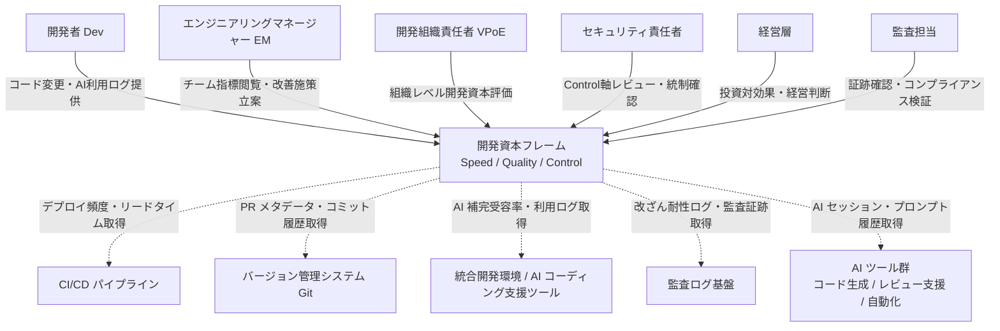
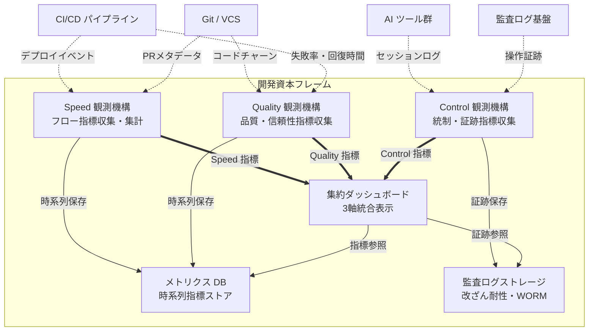
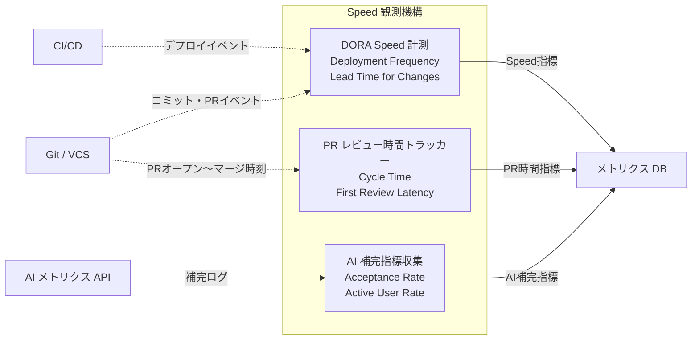
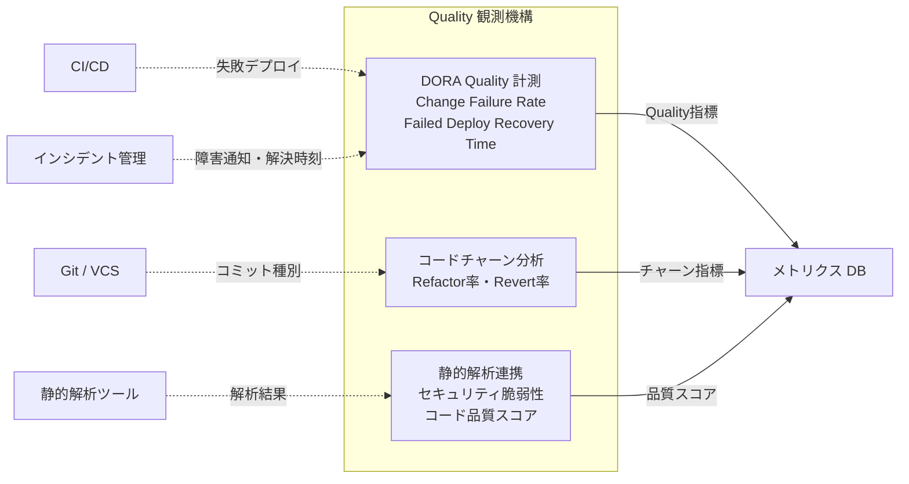
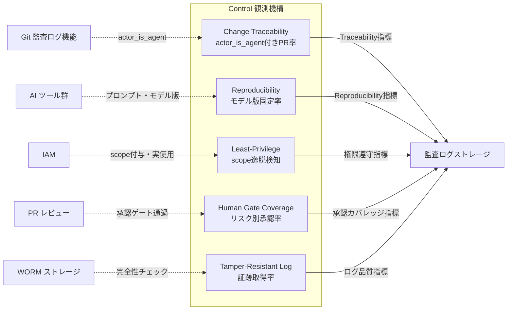
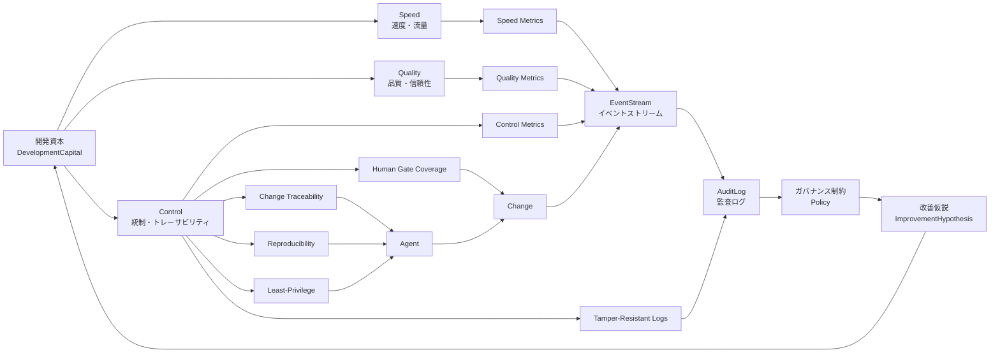
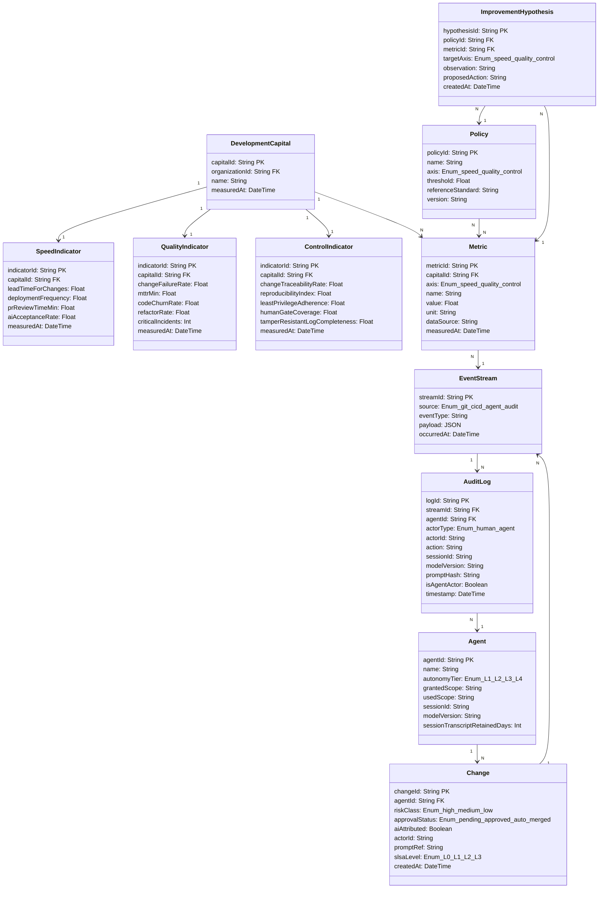

## 概要

ファインディ株式会社は2026年5月22日、「AI時代の開発資本」策定プロジェクトを発表しました。AI導入による開発効果を **Speed（成果物の提供速度）/ Quality（成果物の品質）/ Control（AIを安全に使いこなせる環境かを定量的に測る）** の3軸で再設計する取り組みです。AI投資の対効果を組織レベルで可視化することを目的としています。

検証パートナーにはKDDI・DMM.com・パーソルキャリア・SmartHRの4社が参画しています。各社の実データと運用条件をもとに指標の妥当性を検証します。具体的なサブ指標は2026年9月末までにβ版としてFindy Team+内へ搭載予定です。発表時点では Speed / Quality / Control の定性的定義と問題意識のみが公開されています。

3軸中Controlの独立化が最大の提案ポイントです。Findy西澤氏は「誰が、何を根拠に、どの範囲を変更したのか、その履歴をどう残すのかが大切」と述べています。既存のデファクト指標（DORA / SPACE / DevEx / DX Core 4）がSpeedとQualityを中心に設計され、Controlを独立軸として持たないことへの問題提起がプロジェクトの出発点となっています。

## 特徴

- **Control軸の独立化** — 既存フレームはDORA / SPACE / DevEx / DX Core 4いずれもControlを独立軸に置きません。Findyフレームは「AIガバナンス（誰が・何を根拠に・どの範囲を変更したか）」を開発生産性ダッシュボードへ統合する最初の商用フレームとして位置づけられます。

- **ストック型 vs フロー型の分離** — SpeedとQualityはフロー指標（どれだけ流したか）であるのに対し、Controlはストック指標（どれだけ確かめられる状態を貯めているか）として再定義されます。「開発資本」という名称はこのストック性を強調した概念設計によるものです。

- **DX Core 4との差分構成** — DX Core 4（Speed / Effectiveness / Quality / Business Impact）が4軸目に「Business Impact」を置くのに対し、Findy版はBusiness Impactを切り落とし「Control」を入れた差分構成となります。日本企業のエンタープライズ統制ニーズに寄せた設計と推定されます。

- **個人レベルと組織レベルの測定レイヤー分離** — SPACE / DevExが個人の体験・フロー状態を測るのに対し、開発資本フレームはSpeed / Quality / Controlを組織レベルに統一します。DORA 2024が示す「AI採用でチーム/組織レベルのスループット -1.5%・安定性 -7.2%」と、個人実験の「+55.8%高速完了」が矛盾して見える問題は、測定レイヤーの混同に起因しています。本フレームはその分離を明示的に設計に組み込みます。

- **Findy Team+とFindy AI+の統合基盤** — 従来Findy Team+がDORA由来のSpeed / Quality軸を可視化し、2026年3月にβ提供開始したFindy AI+がClaude Code / GitHub Copilotなど7ツールの横断分析を担います。開発資本フレームはこの2製品の上にControl軸を追加して統合する構図として読み取れます。

- **外部規格との縦結合設計** — Control軸はNIST AI RMF / ISO/IEC 42001 / EU AI Act Art.14・15 / SLSA Provenanceと概念的に対応しており、開発生産性ダッシュボードと規制対応を単一フレームで接続できる可能性を持ちます。

- **業種横断の4社検証** — KDDI（通信）・DMM.com（Webサービス）・パーソルキャリア（HR）・SmartHR（HR Tech）という業種・規模の異なる4社が参画することで、特定ドメインへの偏りを排した汎用指標の妥当性検証を意図しています。

- **サブ指標はβ版まで非公開** — 発表時点で公開されているのは3軸の定性的定義のみです。Speedのサブ指標（PR cycle time・Lead Timeなど）、Qualityのサブ指標（Change Failure Rate・MTTRなど）、ControlのAI判断トレーサビリティ・権限境界・監査ログ等のサブ指標は2026年9月末のβ版策定まで未確認です。

## 構造

### システムコンテキスト図

開発資本フレームと、それを利用するアクターおよび外部システムの関係を示します。



| 要素名 | 説明 |
|---|---|
| 開発者 Dev | コード変更・AI活用の主体。フレームへコード変更・AI利用ログを提供 |
| EM | チーム単位の指標運用・改善施策立案。Speed/Qualityダッシュボードを参照 |
| VPoE | 組織横断の開発資本評価・投資判断。3軸統合レポートを参照 |
| セキュリティ責任者 | Control軸の統制確認・リスク評価。Control観測レポートを参照 |
| 経営層 | 開発資本の事業価値換算・投資対効果判断。経営向けサマリレポートを参照 |
| 監査担当 | 外部規制・内部統制への準拠確認。監査証跡・ログを参照 |
| 開発資本フレーム | Speed/Quality/Control 3軸で組織能力を観測・集約するシステム本体 |
| CI/CD パイプライン | デプロイ自動化・品質ゲート。デプロイ頻度・失敗率を提供 |
| バージョン管理システム | コード変更の履歴管理。PRメタデータ・変更履歴を提供 |
| IDE / AI支援ツール | コーディング支援・AI補完。受容率・セッションログを提供 |
| 監査ログ基盤 | 改ざん耐性を持つ操作証跡の保管。監査証跡・ログ検索を提供 |
| AI ツール群 | コード生成・レビュー・テスト自動化。AI出力・セッション情報を提供 |

### コンテナ図

開発資本フレームの内部を主要コンテナに分解します。



| コンテナ名 | 説明 |
|---|---|
| Speed 観測機構 | フロー系指標（リードタイム・デプロイ頻度・PR処理速度）を収集。CI/CDイベント・PRメタデータ・AI補完ログを入力とし、DORA Four KeysのSpeed側を担う |
| Quality 観測機構 | 品質・信頼性指標（CFR・MTTR・コードチャーン）を収集。CI/CD失敗イベント・チャーン・障害ログを入力とし、DORA Four KeysのQuality側を担う |
| Control 観測機構 | 統制・トレーサビリティ指標を収集。AIセッションログ・監査ログ・PRレビューを入力とし、外部規格と縦結合するAI固有の統制概念を担う |
| 集約ダッシュボード | 3軸指標を統合表示・ロール別ビューで提供。軸合算スコア化しない設計が重要 |
| メトリクス DB | 時系列指標を永続化・クエリ提供。保持期間・リテンション設定が重要 |
| 監査ログストレージ | 改ざん耐性のある操作証跡を保管。WORM / append-only形式で、EU AI Act Art.19のログ保持義務を支える実装候補、SOC 2要件にも対応 |

### コンポーネント図

各コンテナのドリルダウンです。代表的な実装パターン・ツール例を示します。

#### Speed 観測機構



| コンポーネント | 説明 |
|---|---|
| DORA Speed 計測 | DF と Lead Time for Changes を自動収集。CI/CDイベントフック + Git tag解析で実装し、DF・LT時系列値を出力 |
| AI 補完指標収集 | 補完受容率・アクティブ利用者数を収集。Copilot Metrics APIポーリングで実装し、Acceptance Rate・Active User Rateを出力 |
| PR レビュー時間トラッカー | PR Cycle Time と First Review Latency を追跡。Git webhook + タイムスタンプ差分で実装 |

#### Quality 観測機構



| コンポーネント | 説明 |
|---|---|
| DORA Quality 計測 | CFR と Failed Deployment Recovery Time を収集。CD失敗フック + インシデント管理APIで実装し、CFR・回復時間時系列値を出力 |
| コードチャーン分析 | AI生成コードのリファクタ率・リバート率を追跡。Gitコミットメッセージ分類 + 行単位追跡で実装 |
| 静的解析連携 | セキュリティ脆弱性・コード品質スコアを収集。SAST/LinterのCI結果を収集して脆弱性件数・品質スコアを出力 |

#### Control 観測機構



| コンポーネント | 説明 |
|---|---|
| Change Traceability | AI変更が誰の判断・どのプロンプトから発生したかを追跡。Git監査ログの `actor_is_agent` + SLSA Provenanceで実装。NIST AI RMF MEASURE / ISO 42001に対応 |
| Reproducibility | AI判断再現性（モデル版・プロンプト・seed固定）を管理。エージェントセッションログ集計で実装し、モデル版固定率・seed記録率を出力。NIST AI RMF MEASURE 2.8/2.9・MEASURE 3.1/3.2 / SLSA等に対応 |
| Least-Privilege | scope付与と実使用の差分・権限境界逸脱件数を監視。IAM/custom roleのscope差分分析で実装。ISO 42001 / NIST GOVERN / SOC 2 CC6に対応 |
| Human Gate Coverage | リスククラス別の人間承認ゲート通過率を計測。PRレビューメタデータのリスクラベル別集計で実装。NIST AI RMF MANAGE / EU AI Act Art.14に対応 |
| Tamper-Resistant Log | 監査証跡の取得完全率・改ざん耐性を観測。WORM/append-only整合性チェック自動実行で実装。EU AI Act Art.19のログ保持義務を支える実装候補、SOC 2 CC7 / ISO 42001に対応 |

## データ

### 概念モデル



| エンティティ名 | 説明 |
|---|---|
| DevelopmentCapital | Speed / Quality / Control 3軸を統合したストック型組織能力。`capitalId, organizationId, measuredAt` を主要属性とし、Metricと1:Nの関係を持つ |
| Speed | デリバリーの速度・流量を測る軸。`axis="speed"` でDevelopmentCapitalに従属 |
| Quality | 変更の品質・信頼性を測る軸。`axis="quality"` でDevelopmentCapitalに従属 |
| Control | 統制・トレーサビリティを測る軸。**本記事では仮説として5指標（Traceability / Reproducibility / Least-Privilege / Human Gate / Tamper-Resistant）に分解しており、Findy公式のβ版指標ではなく独自整理である点に注意** |
| Metric | 各軸の観測値。`metricId, axis, name, value, unit, measuredAt` を保持 |
| EventStream | Git / CI-CD / エージェントセッションからの原始データ。`streamId, source, eventType, payload, occurredAt` を保持 |
| AuditLog | エージェント行動・変更・承認の不変記録。`logId, actorType, sessionId, modelVersion, promptHash, timestamp` を保持 |
| Agent | AI コーディングエージェント実体。`agentId, autonomyTier, grantedScope, usedScope` を保持 |
| Change | PR / コミット / デプロイの抽象。`changeId, riskClass, approvalStatus, aiAttributed, slsaLevel` を保持 |
| Policy | ガバナンス制約。外部規格（NIST AI RMF、EU AI Actなど）を参照し、`policyId, axis, threshold, referenceStandard, version` を保持 |
| ImprovementHypothesis | 改善仮説。Policy違反から生成し、`hypothesisId, targetAxis, proposedAction` を保持 |

### 情報モデル



| エンティティ | 主要属性 | 注記 |
|---|---|---|
| DevelopmentCapital | capitalId, organizationId, measuredAt | 集計ルート |
| SpeedIndicator | LT / DF / PRレビュー時間 / acceptance rate | aiAcceptanceRateは論文記述から補完 |
| QualityIndicator | CFR / MTTR / churn / refactor / 重大障害件数 | churn / refactorはGitClear指標から補完 |
| ControlIndicator | 5指標（Traceability / Reproducibility / Least-Privilege / Human Gate / Tamper-Resistant） | 全フィールドが「論文記述から推測 / 既存実装から補完」。Findy草案は概念4要素のみ公開 |
| AuditLog | agentId, sessionId, modelVersion, promptHash, isAgentActor | GitHub Enterprise AI Controlsの`actor_is_agent` / `agent_session.task`に対応 |
| Agent | autonomyTier（L1-L4）, grantedScope, usedScope | NIST AI RMF Agentic Profileから補完 |
| Change | riskClass, approvalStatus, slsaLevel, promptRef | SLSA v1.0実装から補完。promptRefはprompt-to-PRトレース用 |
| Policy | axis, threshold, referenceStandard | 例: "NIST AI RMF MEASURE 2.7", "EU AI Act Art.14" |

## 構築方法

> **注記**: 以下のコード例は「実装案 / 例」であり、論文や公式仕様の引用ではありません。参考にする際は各公式ドキュメントで最新仕様を確認してください。**Control 軸のサブ指標は Findy 草案 (2026-09 末 β 公開予定) 確定前の推測ベース**であるため、本番適用前には Findy 公式仕様との突合が必要です。Findy Team+ 未導入のチームは Speed/Quality は four-keys (Google Cloud OSS) で代替可能ですが、Control 軸は GitHub Enterprise AI Controls + SLSA Provenance + WORM 監査ログ基盤の自社構築が必要になります。

### DORA Four Keys 計測基盤の整備

Speed / Quality 軸の基礎となるDORA Four Keysを GitHub Actions + four-keys（Google Cloud OSS）で計測します。

```yaml
# .github/workflows/four-keys-events.yml (実装案)
name: Four Keys Event Publisher
on:
  push: { branches: [main] }
  pull_request: { types: [closed] }
  workflow_run:
    workflows: ["Deploy"]
    types: [completed]
jobs:
  publish-event:
    runs-on: ubuntu-latest
    steps:
      - name: Publish deployment event
        if: github.event_name == 'workflow_run'
        env:
          FOUR_KEYS_WEBHOOK_URL: ${{ secrets.FOUR_KEYS_WEBHOOK_URL }}
          FOUR_KEYS_SECRET: ${{ secrets.FOUR_KEYS_SECRET }}
        run: |
          EVENT_PAYLOAD=$(jq -nc \
            --arg id "${{ github.run_id }}" \
            --arg repo "${{ github.repository }}" \
            --arg branch "${{ github.ref_name }}" \
            --arg conclusion "${{ github.event.workflow_run.conclusion }}" \
            --arg created "${{ github.event.workflow_run.created_at }}" \
            --arg sha "${{ github.event.workflow_run.head_sha }}" \
            '{event_type:"deployment",id:$id,metadata:{repository:$repo,branch:$branch,conclusion:$conclusion,created_at:$created,head_sha:$sha}}')
          SIGNATURE=$(echo -n "${EVENT_PAYLOAD}" | openssl dgst -sha1 -hmac "${FOUR_KEYS_SECRET}" | awk '{print "sha1="$2}')
          curl -X POST "${FOUR_KEYS_WEBHOOK_URL}" \
            -H "Content-Type: application/json" \
            -H "X-Hub-Signature: ${SIGNATURE}" \
            -d "${EVENT_PAYLOAD}"
```

```sql
-- BigQuery 集約クエリ例 (lead_time_for_changes)
WITH deployments AS (
  SELECT id AS deploy_id,
    JSON_EXTRACT_SCALAR(metadata, '$.head_sha') AS sha,
    time_created AS deployed_at
  FROM `your_project.four_keys.events_raw`
  WHERE event_type = 'deployment'
    AND JSON_EXTRACT_SCALAR(metadata, '$.conclusion') = 'success'
),
commits AS (
  SELECT JSON_EXTRACT_SCALAR(metadata, '$.sha') AS sha,
    time_created AS committed_at
  FROM `your_project.four_keys.events_raw`
  WHERE event_type = 'push'
)
SELECT DATE_TRUNC(d.deployed_at, WEEK) AS week,
  AVG(TIMESTAMP_DIFF(d.deployed_at, c.committed_at, HOUR)) AS avg_lead_time_hours
FROM deployments d JOIN commits c USING (sha)
GROUP BY 1 ORDER BY 1 DESC
```

### GitHub Copilot Metrics APIによるSpeed指標収集

AI補完 acceptance rate / lines_suggested を Copilot Metrics API（Enterprise）から定期取得します。

```bash
#!/usr/bin/env bash
# 実装案: Copilot Metrics API → BigQuery
set -euo pipefail
ENTERPRISE_SLUG="${GITHUB_ENTERPRISE_SLUG}"
BQ_TABLE="${BQ_PROJECT}.copilot.daily_metrics"
TODAY=$(date -u +%Y-%m-%d)

gh api \
  --header "Accept: application/vnd.github+json" \
  --header "X-GitHub-Api-Version: 2022-11-28" \
  "/enterprises/${ENTERPRISE_SLUG}/copilot/metrics" \
  --jq ".[] | select(.date == \"${TODAY}\")" \
  > /tmp/copilot_metrics_${TODAY}.json

bq insert --project_id="${BQ_PROJECT}" "${BQ_TABLE}" /tmp/copilot_metrics_${TODAY}.json
```

### GitHub Enterprise AI ControlsによるControl指標収集

`actor_is_agent` フィールドを含む audit log を収集し、Change Traceability / Least-Privilege指標の基礎データとします。

```sql
-- 実装案: Change Traceability Rate の計算
SELECT
  DATE_TRUNC(PARSE_DATE('%Y-%m-%d', SUBSTR(created_at, 1, 10)), MONTH) AS month,
  COUNT(*) AS total_merges,
  COUNTIF(actor_is_agent = TRUE) AS agent_merges,
  COUNTIF(
    actor_is_agent = TRUE
    AND agent_session_id IS NOT NULL
    AND model_version IS NOT NULL
  ) AS traceable_agent_merges,
  SAFE_DIVIDE(
    COUNTIF(actor_is_agent = TRUE AND agent_session_id IS NOT NULL AND model_version IS NOT NULL),
    COUNTIF(actor_is_agent = TRUE)
  ) AS change_traceability_rate
FROM `your_project.github.audit_log`
WHERE action = 'pull_request.merged'
GROUP BY 1 ORDER BY 1 DESC
```

### SLSA Provenanceの生成とControl軸への組み込み

AI生成コードを含むビルド成果物にSLSA Provenanceを付与し、Control軸の成果物完整性指標の基礎とします。

```yaml
# .github/workflows/slsa-provenance.yml (実装案)
name: Build and Generate SLSA Provenance
on:
  push: { branches: [main] }
jobs:
  build:
    runs-on: ubuntu-latest
    outputs:
      binary-digest: ${{ steps.hash.outputs.sha256 }}
    steps:
      - uses: actions/checkout@v4
      - name: Build artifact
        run: |
          make build
          sha256sum ./dist/app > checksums.txt
      - name: Compute artifact digest
        id: hash
        run: echo "sha256=$(sha256sum ./dist/app | awk '{print $1}')" >> "$GITHUB_OUTPUT"
      - uses: actions/upload-artifact@v4
        with: { name: app-binary, path: ./dist/app }
  provenance:
    needs: [build]
    permissions:
      actions: read
      id-token: write
      contents: write
    uses: slsa-framework/slsa-github-generator/.github/workflows/generator_generic_slsa3.yml@v2.0.0
    with:
      base64-subjects: "${{ needs.build.outputs.binary-digest }}"
      upload-assets: true
```

### 3軸ダッシュボードの集約と可視化

Speed / Quality / Control の各指標をDWHで統合し、Looker / Metabase / Grafanaで可視化します。

```sql
-- 実装案: Speed / Quality / Control の週次サマリービュー
CREATE OR REPLACE VIEW `your_project.dashboard.weekly_dev_capital` AS
WITH speed AS (
  SELECT week, avg_lead_time_hours, deployment_frequency_per_day
  FROM `your_project.four_keys.weekly_metrics`
),
quality AS (
  SELECT week, change_failure_rate, mean_time_to_restore_hours
  FROM `your_project.four_keys.weekly_quality`
),
control AS (
  SELECT DATE_TRUNC(month, WEEK) AS week,
    change_traceability_rate, human_gate_coverage,
    slsa_l2_rate, tamper_resistant_log_rate
  FROM `your_project.control.weekly_control_metrics`
)
SELECT s.week,
  s.avg_lead_time_hours, s.deployment_frequency_per_day,
  q.change_failure_rate, q.mean_time_to_restore_hours,
  ctrl.change_traceability_rate, ctrl.human_gate_coverage,
  ctrl.slsa_l2_rate, ctrl.tamper_resistant_log_rate
FROM speed s
LEFT JOIN quality q USING (week)
LEFT JOIN control ctrl USING (week)
```

## 利用方法

### シナリオA: AI採用率↑だがQualityが悪化した場合の意思決定

Copilot acceptance rateが前四半期比+15pt改善した一方で、Change Failure Rateが2.1%→4.8%に悪化した状況（DORA 2024 AIパラドックスのパターン）です。

| 指標 | 期待値 | 現状 | 判断 |
|---|---|---|---|
| Copilot Acceptance Rate | 参考値 | 上昇中 | Speed は改善 |
| Change Failure Rate | < 5% (DORA Elite) | 4.8% | 閾値超過 |
| Code Churn Rate (AI生成) | 社内ベースライン | 上昇 | Quality 低下シグナル |
| Human Gate Coverage (medium) | ≥ 80% | 確認必要 | Control で補完か評価 |

**アクション**:
1. `actor_is_agent = TRUE` / `FALSE` でCFRを分けて計算し、AI起因か判別
2. Human Gate Coverageをmediumリスク変更で一時引き上げ
3. AI生成コードのチャーン率を追跡し、再生成ループになっていないか確認
4. 2〜4週単位で再測定後にacceptance rate拡大を再開

### シナリオB: Human Gate Coverage低下の改善

エージェントモード全社展開時の自動マージ設定ミスで、high-risk変更へのHuman Gate Coverageが100%→72%に低下した状況です。EU AI Act Art.14 / NIST AI RMF MANAGEのhuman oversight要件に関わるリスクです。

```bash
# 実装案: gh CLI でブランチ保護を強制適用
gh api --method PUT \
  -H "Accept: application/vnd.github+json" \
  "/repos/${ORG}/${REPO}/branches/main/protection" \
  --field required_pull_request_reviews='{"required_approving_review_count":1,"require_code_owner_reviews":true}' \
  --field enforce_admins=true
```

**アクション**: ブランチ保護即時修正 / エージェント権限棚卸 / リスク自動ラベリング / Audit Log監視で再発防止。

### シナリオC: チーム単位の開発資本スコアを四半期報告で経営説明

3軸を**合算せず**、チームごとの四半期変化を独立して示します。

| 軸 | 指標 | Green | Yellow | Red |
|---|---|---|---|---|
| Speed | Lead Time | < 24h (Elite) | 24h-168h | > 168h |
| Speed | Deploy Frequency | > 1回/日 | 1回/週-日 | < 1回/週 |
| Speed | Acceptance Rate | > 30% | 15-30% | < 15% |
| Quality | CFR | < 5% | 5-15% | > 15% |
| Quality | MTTR | < 1h | 1-24h | > 24h |
| Control | Change Traceability | > 95% | 80-95% | < 80% |
| Control | Human Gate (high) | 100% | 95-99% | < 95% |
| Control | SLSA L2+ 達成率 | > 90% | 70-90% | < 70% |

**経営報告の構成**: 3軸の差分を独立表示（合算禁止）/ Control改善は規制対応コスト削減で説明 / チーム差分で優先投資先提示 / 次四半期KPIコミット。

## 運用

3軸ダッシュボードは計測基盤を敷くだけでは機能しません。各軸の時定数（Speed: 日次-週次 / Quality: 週次-月次 / Control: 月次-四半期）に合わせ、レビューサイクルを3層に分けて運用します。

### 週次レビュー（Speed / Qualityの異常検知）

**チェックリスト**:
- Lead Time for Changesが前週比+20%超でないか
- Deployment Frequencyが前週比-30%超でないか
- PR acceptance rate（AI補完）が前週比-10pt超でないか
- Code churn rate（2週以内 revert/update）が閾値超でないか
- Change Failure Rateが直近5デプロイで異常増加していないか

```yaml
# .github/workflows/weekly-speed-digest.yml
name: weekly-speed-digest
on:
  schedule:
    - cron: '0 0 * * MON'   # 毎週月曜 09:00 JST
jobs:
  digest:
    runs-on: ubuntu-latest
    steps:
      - uses: actions/checkout@v4
      - run: python scripts/weekly_speed_digest.py
        env:
          BQ_PROJECT: ${{ vars.BQ_PROJECT }}
          SLACK_WEBHOOK: ${{ secrets.SLACK_WEBHOOK_OPS }}
```

### 月次レビュー（3軸クロス分析 + Control品質評価）

**チェックリスト**:
- 3軸ダッシュボードを前月比でコメント付き記録
- Speed↑ / Quality↓の同時発生（トレードオフ顕在化）を確認
- Control 5指標の月次集計を確認
- Shadow AI検出数のトレンド確認
- ジュニア/シニア別の指標比較で二極化スコアを記録
- AIモデルバージョン更新と指標変動の相関確認

```sql
-- monthly_control_traceability
SELECT
  DATE_TRUNC('month', commit_date) AS month,
  team_slug,
  COUNT(*) AS total_commits,
  SUM(CASE WHEN prompt_log_id IS NULL THEN 1 ELSE 0 END) AS no_prompt_log_commits,
  ROUND(100.0 * SUM(CASE WHEN pr_id IS NOT NULL AND prompt_log_id IS NOT NULL THEN 1 ELSE 0 END) / COUNT(*), 2) AS traceability_pct
FROM commit_metadata
WHERE commit_date >= DATE_TRUNC('month', CURRENT_DATE) - INTERVAL '3 months'
GROUP BY 1, 2 ORDER BY 1 DESC, 2;
```

### 四半期レビュー（戦略整合・ベンチマーク比較・指標改訂）

**チェックリスト**:
- DORA Report / DX Core 4ベンチマーク値と自社指標を比較
- Control 5指標とNIST AI RMF / ISO 42001 / EU AI Act / 経産省ガイドラインの要求水準のギャップを評価
- 各指標を「自社で再計算可能か」で再検証
- Shadow AIの四半期トレンドを評価し、統制設計見直し判断
- ジュニア/シニア二極化スコアの推移を評価
- 3軸の指標セット追加・削除・重みづけ変更を文書化

## ベストプラクティス

反証エビデンスを「誤解 → 反証 → 推奨」の構造で統合します。

### BP-1: 3軸を合算スコアにしてチーム比較しない

**誤解**: Speed/Quality/Controlを0-100正規化して合算すれば公平比較できる。

**反証**: Goodhartの法則により、合算スコアをKPI化した瞬間、上げやすい軸（Speed）に資源が集中し、上げにくい軸（Control）が放置されます。各軸の時定数が異なる（Speed: 日次 / Control: 月次-四半期）ため、合算するとノイズと信号が混在します（Storey et al. SPACE論文）。

**推奨**: 3軸独立観測 / 合算スコアを作らない / チーム比較は「軸ごとのトレンド方向（改善/維持/悪化）」3値で / Speed↑+Quality↓同時発生時のみ要確認フラグ。

### BP-2: Control軸の目標を「遵守率100%」に設定しない

**誤解**: Change Traceability・Human Gate Coverageを100%にすればControl完成。

**反証**: Governance-Velocity Paradox（本記事ではこのトレードオフをそう呼びます）により、Controlを遵守率で厳格化するほど開発者は統制外ツール（Shadow AI）に流れます。Lenovo 2026では70%超の従業員が週次でAIを使い、最大3分の1がIT oversight外と報告されています。SamsungのChatGPT全社禁止は採用数を変えず、開示を減らすだけでした。

**推奨**: 「禁止と監視」ではなく「許可範囲の明確化と証跡」に寄せる / 遵守率ではなく「追跡できないケースを発見する仕組みの稼働率」を測る / Shadow AI計測を別軸（Adoption Coverage）として追加。

### BP-3: 個人KPIに3軸を割り当てない

**誤解**: 3軸指標を個人OKR/MBOに組み込めばチーム開発資本が上がる。

**反証**: SPACE論文とDORA 2024の結論反転により、個人レベル（+30-55%改善）と組織レベル（delivery throughput -1.5%、delivery stability -7.2%）で結果が逆転します。Will Larsonも「学習目的メトリクスが人事評価転用されるとゲーミング対象になる」と警告しています。

**推奨**: 3軸はチーム/組織レベルで観測 / 個人ヘルスはSPACE Satisfaction / DevEx Flow Stateで別途計測 / 個人指標と組織指標を同ダッシュボードに混在させない。

### BP-4: Findy Team+のみに依存せず外部検証を並走させる

**誤解**: Findy Team+に集約すれば計測完結。

**反証**: Will Larsonの構造的懐疑（評価転用 / 計装コスト / 「正しい開発モデル」押し付け / theory of improvement欠落）が指摘する通り、FindyフレームはSaaSベンダー設計で、学術コミュニティからの中立検証が現時点で存在しません。

**推奨**: 年1回以上DORA Report公開ベンチマークと突合 / 各KPIを「自社で再計算可能か」で評価 / β公開（2026年9月末）後に4社検証結果とKPI草案を一次確認して再評価。

### BP-5: AIモデル更新時に指標の継続性を保護する

**誤解**: モデルアップグレード後も同じ指標で前後比較できる。

**反証**: モデル更新はacceptance rate・churn rate・Traceability収集方法に断絶を生みます。Reproducibility指標はモデル更新直後に構造的に0%になります。

**推奨**: 更新前後2週間を「比較除外期間」フラグ / 更新前指標ベースラインのスナップショット保存 / 更新後4週で統計的差異検定 / Reproducibilityはウォームアップ期間（2週）を除外。

### BP-6: 生成行数・利用率をインパクト指標として使わない

**誤解**: AI生成コード行数 / Copilot seat利用率が高いほど開発資本が高まる。

**反証**: GitClear 2025によると、2021年比でChurnは約1.7倍（3.3%→5.7%）に増加し、Moved code は24.8%→9.5%へ低下、Copy/pasted lines は2020年8.3%→2024年12.3%へ増加しています（指標ごとに性質が異なるため分けて読む必要があります）。Stack Overflow 2024ではAI accuracy信頼が43%にとどまり、利用（76%）と乖離しています。

**推奨**: SpeedのAI効果指標は「acceptance rate + downstream churn rateのペア」 / 生成行数・seat利用率は「utilization」として参考表示に留めKPI化しない / Quality軸で「AI生成コード由来のchurn」をGit blameベースで集計。

## トラブルシューティング

### TS-1: Speed↑だがQuality↓ — 両軸トレードオフが顕在化

**症状**: Deployment FrequencyとLead Timeが改善したのに、CFRとCode Churnが同時上昇。

**対応**: Git blame × PR authorのシニア/ジュニア分類でチャーン率内訳確認 / AI生成コードのレビュー所要時間を人間コードと比較 / Short-term: チャーン率高PR著者に1on1 / Medium-term: PRテンプレに「AI出力か人間コードか」明示欄追加 / Control軸Human Gate Coverage確認。

### TS-2: Control軸のChange Traceabilityが記録されない

**症状**: `no_prompt_log_commits` が全体の20%超、Traceability欠損率が目標（5%未満）超過。

**原因**: IDEプラグインのプロンプト履歴が収集設定漏れ / ローカル直接pushがプロンプトログと未紐付け / GitHub Enterprise AI Controlsの`agent_session.task`ログ保存期間（28日）経過。

**対応**:

```bash
# プロンプトログ未紐付けコミット一覧
gh api repos/:owner/:repo/commits \
  --paginate \
  --jq '.[] | select(.commit.message | test("ai-session:") | not) | .sha + " " + .commit.author.email' \
  | head -50
```

IDE設定監査 / audit logを28日以内にBigQuery転送するcron設定 / Direct pushを制限しPR経由統一。

### TS-3: 3軸の集約タイミングがズレてダッシュボードが乖離

**症状**: SpeedとQualityチャートで集計期間ズレ / Control月次とSpeed週次が整合しない。

**原因**: データソースのタイムゾーン不一致 / ETL実行タイミングのズレ / Findy Team+集計窓と自社BQ集計窓不一致。

**対応**: 全データソースをUTC統一しダッシュボード表示時にJST変換 / ETLを `Speed → Quality → Control → dashboard` の順に依存設定 / 集計期間定義を文書化。

### TS-4: ジュニア層のスコアだけ低い — 二極化問題

**症状**: シニア/ジュニア別集計でシニア改善・ジュニア横ばい/悪化（Findy山田氏「シニア+30-50% / ジュニア-20-30%」パターン）。

**原因**: ジュニアがAI出力正誤判断できず差し戻し率高 / AI過剰依存で基礎力学習機会減 / タスク複雑性が異なり比較不公平。

**対応**: Short-term: PRにタスク複雑性ラベル付与 / Medium-term: AI補完なしペアプロ週1 / ジュニア向け「AI出力レビュー観点チェックリスト」整備 / Control軸で「ジュニアのHuman Gate Coverage」個別追跡 / 二極化スコアを四半期レビューに組み込み。

### TS-5: Shadow AIが増えてAdoption Coverageが見えない

**症状**: 統制ツール（Copilot / Cursor）利用統計は取れるが、統制外ツール（個人ChatGPT/Claude/Gemini）利用増の気配。

**対応**:
- Detection — ネットワークプロキシで `api.openai.com` / `claude.ai` / `generativelanguage.googleapis.com` への社用端末アクセスを計測し、Adoption Coverage補助軸として月次集計
- 根本対策 — 統制ツールの申請フロー簡素化（「許可範囲を広げて証跡取る」設計）
- ガイドライン — 統制外ツール生成コードをcommitする場合のプロセス明文化（「記録すれば使える」ルール）
- 四半期でAdoption Coverage推移を評価し、閾値超過時は統制設計見直しを議題化

## まとめ

FIndyの「AI時代の開発資本」フレームは、既存のDORA / SPACE / DevExが見落としていたAIガバナンスをControl軸として独立させ、Speed / Quality / Controlの3軸でAI投資の対効果を組織レベルで可視化する新しいアプローチです。3軸を合算せず独立観測し、週次・月次・四半期のレビューサイクルで運用することで、AI導入の「個人は改善・組織は悪化」というパラドックスを正確に捉えられます。

この記事が少しでも参考になった、あるいは改善点などがあれば、ぜひリアクションやコメント、SNSでのシェアをいただけると励みになります！

## 参考リンク

- 公式
  - [Findy Team+](https://jp.findy-team.io/)
  - [Findy AI+ β版](https://prtimes.jp/main/html/rd/p/000000216.000045379.html)
  - [GitHub Copilot Metrics API](https://docs.github.com/en/rest/copilot/copilot-metrics)
  - [GitHub Enterprise AI Controls GA](https://github.blog/changelog/2026-02-26-enterprise-ai-controls-agent-control-plane-now-generally-available/)
  - [GitHub Enterprise Audit Log Streaming](https://docs.github.com/en/enterprise-cloud@latest/admin/monitoring-activity-in-your-enterprise/reviewing-audit-logs-for-your-enterprise/streaming-the-audit-log-for-your-enterprise)
  - [NIST AI RMF 1.0](https://nvlpubs.nist.gov/nistpubs/ai/nist.ai.100-1.pdf)
  - [CSA Labs NIST AI RMF Agentic Profile v1](https://labs.cloudsecurityalliance.org/agentic/agentic-nist-ai-rmf-profile-v1/)
  - [ISO/IEC 42001:2023](https://www.iso.org/standard/81230.html)
  - [EU AI Act 全文](https://eur-lex.europa.eu/eli/reg/2024/1689/oj)
  - [EU AI Act Art.14 Human Oversight](https://artificialintelligenceact.eu/article/14/)
  - [EU AI Act Art.15 Accuracy Robustness](https://artificialintelligenceact.eu/article/15/)
  - [EU AI Act Art.19 Automatically Generated Logs](https://artificialintelligenceact.eu/article/19/)
  - [SLSA v1.0](https://slsa.dev/spec/v1.0/)
  - [SLSA Provenance Spec](https://slsa.dev/spec/v0.1/provenance)
  - [経産省 AI事業者ガイドライン v1.2](https://www.meti.go.jp/shingikai/mono_info_service/ai_shakai_jisso/pdf/20260331_1.pdf)
  - [IPA DX動向 2025](https://www.ipa.go.jp/digital/chousa/dx-trend/dx-trend-2025.html)

- GitHub
  - [four-keys (Google Cloud OSS)](https://github.com/dora-team/fourkeys)
  - [slsa-framework/slsa-github-generator](https://github.com/slsa-framework/slsa-github-generator)

- 記事
  - [ITmedia AI+ 「開発現場のAI導入、リアルな効果どう測る？」](https://www.itmedia.co.jp/aiplus/article/2605/22/2000000015/)
  - [日本経済新聞「AI使ったシステム開発の評価指標 ファインディやKDDIが策定へ」](https://www.nikkei.com/article/DGXZQOUC195O90Z10C26A5000000/)
  - [Findy ニュース一覧](https://findy.co.jp/news/)
  - [DORA 2024 State of DevOps Report](https://dora.dev/research/2024/dora-report/)
  - [SPACE - Forsgren et al. 2021 ACM Queue](https://queue.acm.org/detail.cfm?id=3454124)
  - [DevEx - Noda et al. 2023 ACM Queue](https://queue.acm.org/detail.cfm?id=3595878)
  - [DX Core 4](https://getdx.com/dx-core-4/)
  - [Kalliamvakou et al. CACM 2024 Copilot acceptance rate](https://cacm.acm.org/research/measuring-github-copilots-impact-on-productivity/)
  - [ANZ Bank RCT arXiv 2402.05636](https://arxiv.org/abs/2402.05636)
  - [Copilot効果測定 - Peng et al. 2023](https://www.microsoft.com/en-us/research/publication/the-impact-of-ai-on-developer-productivity-evidence-from-github-copilot/)
  - [GitClear「Coding on Copilot 2024」](https://www.gitclear.com/coding_on_copilot_data_shows_ais_downward_pressure_on_code_quality)
  - [GitClear Code Quality 2025](https://www.gitclear.com/ai_assistant_code_quality_2025_research)
  - [Stack Overflow Developer Survey 2024 AI](https://survey.stackoverflow.co/2024/ai)
  - [Will Larson「meta-productivity tools への懐疑」](https://lethain.com/developer-meta-productivity-tools/)
  - [Will Larson「theory of improvement」](https://lethain.com/measuring-developer-experience-benchmarks-theory-of-improvement/)
  - [McKinsey「Unleashing developer productivity with generative AI」](https://www.mckinsey.com/capabilities/tech-and-ai/our-insights/unleashing-developer-productivity-with-generative-ai)
  - [Findy Team+ Blog: DMM.com事例](https://jp.findy-team.io/blog/ai-casestudy/ai_effectiveness_verification_dmm/)
  - [Findy Team+ Case: KDDIアジャイル開発センター](https://jp.findy-team.io/case/posts/intereview_kddiagile/)
  - [Findy Team+ Blog: SmartHR × Four Keys](https://blog.findy-team.io/posts/0824-fourkeys-event-smarthr/)
  - [パーソル総研 生成AI実態調査](https://rc.persol-group.co.jp/thinktank/data/generative-ai/)
  - [山田裕一朗 note「生成AIで上がらなかった開発組織の生産性」](https://note.com/yuichiro826/n/n285026b11564)
  - [Lenovo 2026 Shadow AI 70%](https://www.sphereinc.com/blogs/shadow-ai-governance-gap)
  - [Samsung ChatGPT全社禁止事例](https://moveo.ai/blog/companies-that-banned-chatgpt)
