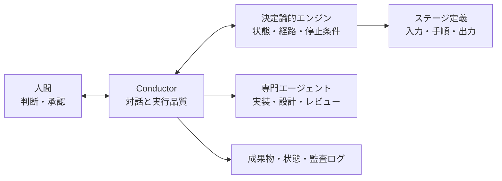
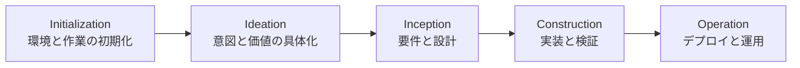

生成AIを開発へ導入しても、コード補完や単発のプロンプトだけでは、要件・設計・実装・テスト・運用の分断は残ります。AI-DLC（AI-Driven Development Life Cycle）は、AIを個別作業の補助ではなく、開発ライフサイクルの進行役として扱う方法論です。

ただし、AI-DLCを調べると「3フェーズのMarkdownルール」と「5フェーズ・32ステージの実行エンジン」という異なる説明が見つかります。これは概念の揺れではなく、AWSが紹介した方法論、OSS実装のv1、全面的に再設計されたv2が併存しているためです。

この記事では、最初に3者を分けたうえで、**現行のAI-DLC Workflows 2.0**を中心に、実行エンジン、フェーズ、成果物、Claude CodeとCodex CLIへの導入、運用上の注意点を整理します。検証対象は2026年8月3日時点のv2.5.34、コミット`67f0c8fb8f615fef1e056f9c68495864ded08db0`です。

## 最初に区別したい3つのAI-DLC

AI-DLCという名前は、方法論と、その方法論を動かすOSS実装の両方に使われます。さらにOSS実装はv1とv2で構造が大きく異なります。

| 対象 | 中心となる構造 | 実体 | 成果物の主な保存先 |
| --- | --- | --- | --- |
| AWSの方法論 | Inception、Construction、Operations | AI主導・人間監督の開発方法論 | 実装に依存 |
| Workflows v1.0.1 | 3フェーズ | プロジェクトへ配置するMarkdownルール | `aidlc-docs/` |
| Workflows 2.0 | 5フェーズ・32ステージ | 決定論的エンジン、エージェント、フック、スキル、ツール | `aidlc/spaces/<space>/intents/<YYMMDD>-<label>/` |

AWSの方法論紹介では、Inception、Construction、Operationsの3フェーズを使います。v1.0.1もこの構造をMarkdownルールとして実装しましたが、Operationsはデプロイと監視を扱う「将来」の領域として記載されていました。

一方、現行のv2はInitializationとIdeationを加えた5フェーズです。Operationも実行対象に含まれます。v1のルールファイルを`CLAUDE.md`や`AGENTS.md`へ置く導入方法と、v2のエンジン一式をコピーする方法は互換ではありません。

## AI-DLC固有の考え方

AI-DLCの特徴は「AIが実装し、人間が承認する」だけではありません。AWSの方法論では、次の2つを柱としています。

- **AI Powered Execution with Human Oversight**：AIが計画を作り、質問し、実行する一方、重要な判断は人間へ委ねる
- **Dynamic Team Collaboration**：AIが定型作業を担い、職能横断のチームはリアルタイムの問題解決と意思決定へ集中する

方法論では、Inceptionでチーム全体がAIの質問と提案を検証する協働を**Mob Elaboration**、Constructionで設計や技術判断を共同検討する協働を**Mob Construction**と呼びます。また、Epicに相当する単位を**Unit of Work**、従来のSprintより短く、時間または日単位で進める作業サイクルを**Bolt**と呼びます。

AI支援開発や完全自律型の開発と比べると、位置づけは次のようになります。

| アプローチ | AIの役割 | 人間の役割 | 判断の記録 |
| --- | --- | --- | --- |
| AI-assisted | 個別タスクの補助 | 作業分解と工程管理 | ツール外へ残すことが多い |
| AI-autonomous | ゴールから自律実行 | 事後確認が中心 | 実装依存 |
| AI-DLC | 構造化された工程を主導 | 各ゲートで文脈を補い承認 | 状態・成果物・監査ログとして保持 |

AI-DLCは、AIの自律性を無制限に上げる方式ではありません。AIが次の作業を提案・実行しつつ、人間が判断すべき地点をワークフローへ組み込む方式です。

## v2は決定論的エンジンとConductorで動く

v1はMarkdownルールが中心でした。v2は、ハーネス非依存のコアから、Claude Code、Kiro IDE、Kiro CLI、Codex CLI、opencode向けの配布物を生成する構造です。

中心には、状態遷移と次のステージを決める決定論的エンジンがあります。対話セッション内のConductorが、エンジンの決定に従ってステージを実行し、必要な専門エージェントを使い、人間へ承認を求めます。



公式ドキュメントが示す主な構成は次のとおりです。

- 5フェーズ、32ステージ
- 14エージェント：11のドメイン専門家、2つのレビュー専用エージェント、1つのComposer
- 9つの適応スコープと自動判定
- Minimal、Standard、Comprehensiveの3段階の成果物深度
- 成果物深度とは独立した3段階のテスト戦略
- Initializationを除く承認・検証ゲートと、ConstructionのBolt単位の自律性選択
- 状態管理、構造化監査ログ、セッション再開
- 人間の修正を継続的な行動ルールへ反映する学習ループ

同じエンジンを複数ハーネスで動かし、ハーネスごとの差異を薄い表層へ閉じ込める設計です。v1のように「対応するルールファイルへコアワークフローを貼り付ける」だけではありません。

## 5フェーズ・32ステージ

v2のフェーズはInitialization、Ideation、Inception、Construction、Operationです。



### Initialization

実行環境、作業対象、状態を初期化します。v2では同じリポジトリ内で複数の作業をSpaceとIntentとして管理するため、どの文脈でワークフローを進めるかを確定する入口でもあります。

### Ideation

自由形式のIntentから、問題、価値、対象範囲を具体化します。すぐに要件定義へ進むのではなく、そもそも何を解くのか、どのスコープと深度が妥当かを整理します。

### Inception

要件分析、ユーザーストーリー、アプリケーション設計、作業単位への分解を行います。方法論上のMob Elaborationに相当する協働を通じて、AIの質問や提案をチームが検証します。

### Construction

設計を実装、テスト、品質確認へ落とします。v2では専門エージェントとレビュー用エージェントを使い分け、ステージ定義に従って成果物を生成します。方法論上はMob Constructionに対応する領域です。

承認ゲートは単純に「全ステージの後で承認」ではありません。Initializationの3ステージは承認なしで自動実行されます。Constructionの3.1〜3.5はUnitごとのゲートを抑止し、Boltまたは並列バッチの単位へ集約します。最初のWalking Skeletonは必ずゲートを通し、その後に残りのBoltを自律実行するか、Boltごとに承認するかを人間が選びます。自律モードでも失敗時は停止して、再試行、スキップ、中断の判断を求めます。

### Operation

デプロイ、運用準備、監視などを扱います。ここはv1との差が大きい点です。v1.0.1のOperationsは将来拡張用でしたが、v2ではOperationに7つのステージが定義されています。

すべての作業で32ステージを同じ深さで実行するわけではありません。スコープ、成果物深度、テスト戦略に応じて、エンジンが通る経路と作業量を調整します。

## Space、Intent、成果物の構造

v2は、チームや製品の文脈を**Space**、個別の作業目的を**Intent**として管理します。最初の`/aidlc`実行時にIntentの記録ディレクトリが作られます。

```text
aidlc/spaces/<space>/
├── memory/                         # チームで確認済みの実践・学習
├── knowledge/                      # Spaceで共有する知識
└── intents/
    └── <YYMMDD>-<label>/
        ├── aidlc-state.md          # Intent単位の状態
        ├── audit/                  # 判断・承認の監査ログ
        └── <phase>/<stage>/...     # ステージごとの成果物
```

たとえば、要件分析の成果物は`inception/requirements-analysis/requirements.md`のようにIntent配下へ保存されます。チーム知識はIntentより上のSpaceへ置かれるため、1件の作業だけでなく、同じSpaceの次のIntentにも引き継げます。

この構造により、会話履歴だけに依存せず、次をファイルとして追跡できます。

- 現在のフェーズとステージ
- 人間が承認した内容
- 各ステージの入力と成果物
- 誰がどの判断を行ったかを示す監査ログ
- チームで再利用する知識と行動ルール

## v2を導入する

以下はv2.5.34、コミット`67f0c8fb8f615fef1e056f9c68495864ded08db0`に基づく手順です。インターフェースや導入モデルは安定扱いですが、`v2`ブランチは更新され続けるため、本番利用では検証済みコミットへ固定します。

### 共通の前提

v2のTypeScript製フックとCLIツールは`bun`で動きます。また、公式配布設定はAmazon Bedrockを使用するため、対象モデルへのアクセスとAWS認証情報が必要です。ハーネスごとの必要バージョンもREADMEで確認します。

```bash
git clone https://github.com/awslabs/aidlc-workflows.git
cd aidlc-workflows
git checkout v2
git checkout 67f0c8fb8f615fef1e056f9c68495864ded08db0
```

GitHub Releasesのv1.0.1配布物ではなく、`v2`ブランチの`dist/<harness>/`を使う点が重要です。

### Claude Codeへ導入する

リポジトリのルートで、Claude Code用のエンジンとWorkspace Shellを対象プロジェクトへコピーします。

```bash
cp -r dist/claude/.claude/ your-project/.claude/
cp -r dist/claude/aidlc/   your-project/aidlc/
cd your-project
claude
```

既存の`.claude/`がある場合は、設定やスキルを無条件に上書きせず差分を確認してください。公式配布の`.claude/settings.json`にはBedrock向け設定も含まれるため、既存設定との統合が必要です。

Claude Codeのセッション内で診断し、ワークフローを開始します。

```text
/aidlc --doctor
/aidlc Build a REST API for inventory management
```

`--doctor`は、`bun`、フック、設定、Workspace Shell、状態と監査ログの整合、ステージグラフなどを検証し、問題があれば終了コード1を返します。

### Codex CLIへ導入する

Codex CLIでは、Codex向け配布物をGitリポジトリへコピーします。

```bash
cp -r dist/codex/.codex/  your-project/.codex/
cp -r dist/codex/.agents/ your-project/.agents/
cp -r dist/codex/aidlc/   your-project/aidlc/
cp dist/codex/AGENTS.md   your-project/AGENTS.md
```

既存の`AGENTS.md`がある場合は置き換えず、必要な指示と`.gitignore`項目をマージします。公式READMEではCodex CLI 0.145.0以上を前提としています。

次にフックを信頼します。Codexは未信頼のフックを実行せず、`--dangerously-bypass-hook-trust`でもこの制約は回避できません。対話環境では、最初のTUI起動時にフックのダイアログで「Trust all and continue」を選びます。

非対話で事前設定する場合は、AI-DLCのソース側で次を実行します。

```bash
bun install --frozen-lockfile
bun scripts/package.ts codex trust \
  --project "/absolute/path/to/your-project"
```

標準出力へ生成された`[hooks.state]`のTOML全体を、Codexのユーザー設定へ反映します。同じ`hooks.json`に対する既存エントリがある場合は、重複追加せず一式を置き換えます。その後、Bedrockプロバイダー設定を確認して診断します。

```bash
cd your-project
bun .codex/tools/aidlc-utility.ts doctor
```

セッション内では`$aidlc`、または`/skills`から`aidlc`を選んで起動します。

```text
$aidlc feature Add JWT authentication
```

## Codex向け配布物を実測する

ここまでの構造説明だけでなく、上記の固定コミットを一時Gitリポジトリへ配置し、Codex向け`doctor`を実行しました。検証環境はmacOS、Codex CLI 0.145.0、bun 1.3.13です。モデルを使うワークフローは起動せず、ローカルで完結する配置・グラフ・スキーマ検証までを対象にしました。

配布物をすべてコピーした状態では、次の結果になりました。

```text
AI-DLC Health Check
...
✓ codex CLI version 0.145.0 >= 0.145.0
✓ workspace shell ready (.codex/ + aidlc/spaces/default/memory/)
✓ Orphan stage files: 32 graph entries all have files
✓ Scope validation: 9 scopes valid (27 advisories)
✓ Schema validation: 32/32 stages validated
✓ Graph references: 122 artifacts + edges resolved
...
41 passed, 0 failed
```

ここで注意したいのは、`doctor`のフック信頼に関する行は「信頼済みであることの検証」ではなく、TUIまたは`codex trust`で設定するよう促す確認メッセージだったことです。`41 passed`だけを見て、未信頼フックまで動作可能と判断してはいけません。実際に`codex trust`を実行すると、`session_start`、`user_prompt_submit`、`pre_tool_use`、`post_tool_use`などのフックごとに`[hooks.state]`とハッシュが生成されました。

次に、Workspace Shellの`aidlc/`だけを一時的に外して再実行しました。

```text
✗ workspace shell ready (.codex/ + aidlc/spaces/default/memory/)
  — copy the workspace shell from `dist/codex/` into your project root
...
40 passed, 1 failed
```

この場合の終了コードは1でした。つまり、`.codex/`だけをコピーしても導入は完了せず、`dist/codex/aidlc/`をプロジェクト直下へ置く必要があります。一方、今回の実測はIntentを最後まで実行したE2E検証ではありません。モデル、AWS認証、承認ゲート、生成コードの品質は別途確認が必要です。

## 小さな変更でE2Eを確認する

最初から大規模な新規開発へ適用するより、境界が明確な変更で、状態遷移と承認ゲートが期待どおり動くかを確認する方が安全です。

たとえば既存APIへ入力検証を追加する場合、次の点を観察します。

1. Ideationで問題と価値が過不足なく整理されるか
2. Inceptionで互換性、異常系、受け入れ条件が明文化されるか
3. Constructionで実装とテストが成果物に対応しているか
4. Operationでデプロイ条件、監視、ロールバックが検討されるか
5. 各ゲートの承認と修正が監査ログへ残るか

完了後は、コード差分だけでなく、Intent配下の`aidlc-state.md`、`audit/`、各ステージの成果物を照合します。承認した条件が実装やテストへ反映されていなければ、ワークフローが完走しても成功とはいえません。

## 運用で失敗しやすい点

### 承認ゲートが形式化する

人間が計画や成果物を読まずに承認すると、Human-in-the-loopは単なる待ち時間になります。承認時には、要件と受け入れ条件、代替案、影響範囲、検証方法、残存リスクを確認します。

### v1とv2の資料を混ぜる

「3フェーズ」「`aidlc-docs/`」「`Using AI-DLC, ...`」「Markdownルールの配置」はv1の資料に多い説明です。「5フェーズ・32ステージ」「決定論的エンジン」「SpaceとIntent」「`/aidlc`または`$aidlc`」はv2の実装です。導入手順を探すときはURLのブランチとドキュメントの対象版を確認します。

### 検証がAIの自己申告になる

ツールを実行できない状況で、AIが推測により「問題なし」と結論づける可能性は残ります。必須ツールを実行できない場合は未検証とし、コマンド、終了コード、主要な出力を残すFail-closedの運用が必要です。

`--doctor`はフレームワークの配置や状態整合を検証しますが、生成したシステムの品質まで保証するものではありません。プロジェクト固有のテスト、静的解析、セキュリティ検査、デプロイ検証は別途必要です。

### 配布設定を既存プロジェクトへ上書きする

v2は`.claude/`、`.codex/`、`.agents/`、`AGENTS.md`などを配布します。既存プロジェクトにも同名の設定がある場合、単純なコピーで独自ルールや権限設定を失う可能性があります。導入前に差分を確認し、設定、フック、モデル、権限、`.gitignore`を統合します。

## まとめ

AI-DLCは、AI主導・人間監督とDynamic Team Collaborationを柱に、開発工程を構造化する方法論です。Mob Elaboration、Mob Construction、Unit of Work、Boltといった概念により、AIの生成能力だけでなく、チームの判断方法まで再設計します。

現行のAI-DLC Workflows 2.0は、v1のMarkdownルールから大きく進み、5フェーズ・32ステージ、決定論的エンジン、14エージェント、状態と監査ログを備えたマルチハーネス実装です。導入時は`v2`ブランチを使い、ハーネス向けの配布物とWorkspace Shellをセットで配置し、`--doctor`で検証します。

AIの自律性を高めるほど、承認を形式化せず、成果物と実行証拠を人間が照合できる仕組みが重要になります。まずは小さな変更で、コードだけでなくIntentの状態・監査・成果物まで確認するのが現実的です。

この記事が少しでも参考になった、あるいは改善点などがあれば、ぜひリアクションやコメント、SNSでのシェアをいただけると励みになります！

## 参考リンク

- [AI-DLC Workflows 2.0 README（v2ブランチ）](https://github.com/awslabs/aidlc-workflows/blob/v2/README.md)
- [AI-DLC Workflows：Introduction](https://awslabs.github.io/aidlc-workflows/guide/00-introduction/)
- [AI-DLC Workflows：Getting Started](https://awslabs.github.io/aidlc-workflows/guide/01-getting-started/)
- [AI-DLC Workflows：Phases and Stages](https://awslabs.github.io/aidlc-workflows/guide/04-phases-and-stages/)
- [AI-DLC on Codex CLI](https://awslabs.github.io/aidlc-workflows/guide/harnesses/codex-cli/)
- [AI-Driven Development Life Cycle（AWS DevOps Blog）](https://aws.amazon.com/blogs/devops/ai-driven-development-life-cycle/)
- [AI-DLC Workflows v1.0.1 README](https://github.com/awslabs/aidlc-workflows/blob/v1.0.1/README.md)
- [v1.0.1 Generated aidlc-docs Reference](https://github.com/awslabs/aidlc-workflows/blob/v1.0.1/docs/GENERATED_DOCS_REFERENCE.md)
