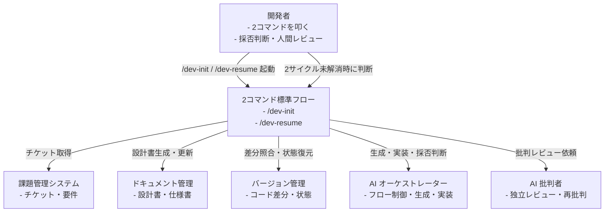
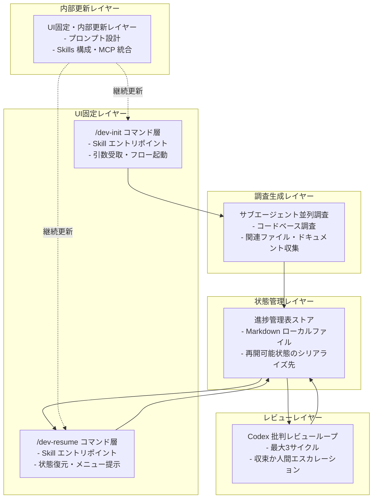
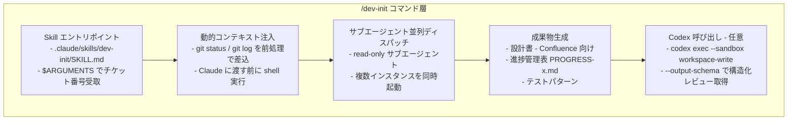
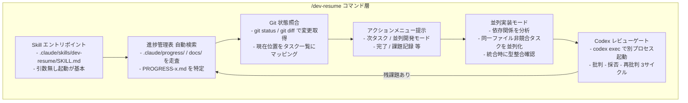
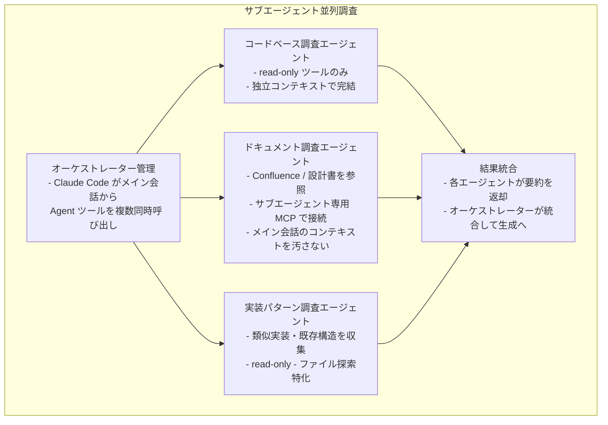
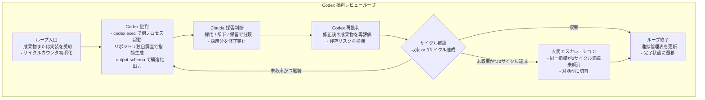
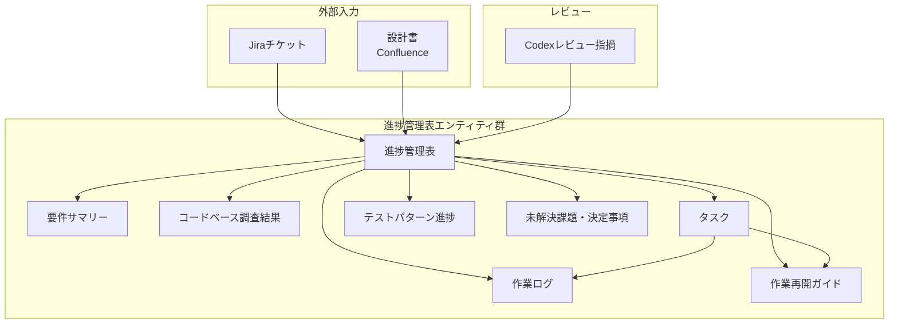
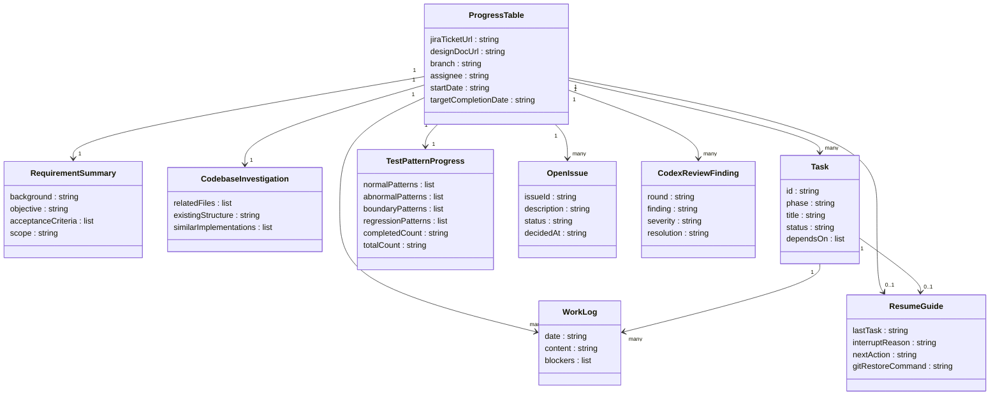

AI コーディングエージェントを個人で使いこなすエンジニアは増えました。では、それを**組織の標準**にするにはどうすればよいでしょうか。

ZOZO の答えは「便利なプロンプト集を配る」ではありませんでした。開発フローの入口を `/dev-init` と `/dev-resume` の 2 コマンドに固定し、その内側に**再開可能な作業状態**を設計するというものです。本記事は、この取り組みを「手順書ではなく状態を設計する」という観点から、構造・データモデル・構築方法・運用、そして反証まで整理します。

> 検証日: 2026-06-09 / 一次情報: [ZOZO TECH BLOG「AI駆動開発を2コマンドで組織標準に」](https://techblog.zozo.com/entry/ai-development-two-commands)

## 概要

### 背景と目的

ZOZO の基幹システム本部は、Claude Code や Codex といった AI コーディングエージェントの活用が**個人の技量に依存**する状況に直面しました。エンジニアごとにプロンプトの書き方・ツールの組み合わせ・中断時の引き継ぎ方が異なり、組織として再現性と品質の一貫性を確保できませんでした。

この状況を解消するため、開発フローの入口を `/dev-init` と `/dev-resume` の **2 つの標準コマンド**に集約しました。利用者が覚えるのはこの 2 コマンドだけです。内部にあるプロンプト設計・Skills 構成・Claude と Codex の連携ロジック・MCP(Model Context Protocol)統合は、組織が継続的に更新します。

### 何を解決するか

この取り組みが解決しようとする問題は、3 層に分かれます。

| 問題層 | 具体的な症状 | ZOZO の解法 |
|---|---|---|
| 個人技の固定化 | 熟練者のノウハウが属人化し、横展開できない | 暗黙知を SKILL.md に明文化し、コマンドとして配布する |
| 中断・再開コスト | セッションが切れると文脈が失われ、最初から調査し直す | 進捗管理表を一次成果物として設計し、状態を保存・復元する |
| 標準化の陳腐化 | プロンプト集はモデル交代や仕様変更のたびに更新漏れが生じる | 利用者 UI(2 コマンド)を固定し、内部実装だけを継続更新する |

### 位置づけ

ZOZO は 2025 年 7 月に「1 人あたり月額 200 ドルを基準として」AI エージェントを全エンジニアに展開しており、Claude Code 利用者は数百名規模です(ZOZO TECH BLOG 本文記載)。本コマンドは、その全社導入を「個人技から組織知」へ転換する仕掛けとして位置づけられています。

## 特徴

### 特徴 1: UI を 2 コマンドに固定し、内部を継続更新する

利用者に見える層は `/dev-init`(初回)と `/dev-resume`(再開)の 2 コマンドのみです。内部のプロンプト・Skills・連携ロジック・MCP は組織が更新し続けるため、モデルやツールが変わっても**利用者の学習コストを増やさずに全社へ反映**できます。この発想は「安定したインタフェース / 揮発する実装」という API 設計の原則を、AI 開発ワークフローに適用したものと読めます。

### 特徴 2: 進捗管理表を「再開可能な作業状態」として設計する

`/dev-init` が生成する**進捗管理表(Markdown ローカルファイル)を一次成果物**として設計している点が、このアプローチの核心です。`/dev-resume` はその進捗管理表と `git status` / `git diff` を照合し、「今どこにいて、次に何をするか」を復元します。

```
/dev-init   = 作業状態を「生成する」関数
/dev-resume = 作業状態から制御を「復元する」関数
```

ZOZO が掲載している進捗管理表テンプレートは、基本情報・要件サマリー・コードベース調査結果・詳細タスク一覧・テストパターン進捗・総合進捗・作業ログ・**作業再開ガイド**・関連リンク・未解決課題などのセクションを含みます。特に「作業再開ガイド」(最終タスク・中断理由・次アクション・Git 復帰コマンドを記載)が明示的に置かれており、**人間の引き継ぎドキュメントの構造をそのまま AI への状態受け渡しに転用**しています。

### 特徴 3: 生成は Claude、批判は Codex ── 単一モデル依存を避ける

役割分担は明確に分かれます。

| 役割 | モデル | 担当内容 |
|---|---|---|
| オーケストレーター | Claude Code | 全体フロー制御・設計書生成・コード実装・採否判断・修正実行 |
| 独立した批判者 | Codex | リポジトリ独自調査に基づく批判的レビュー・採否判断への再批判・残存リスク指摘 |

批判的対話の最小単位は 3 ラウンド(Codex 批判 → Claude 採否 → Codex 再批判)です。自動実行は各ポイント最大 3 サイクルで、同一指摘が 2 サイクル連続で解消しない場合は対話型に切り替えます。

この分業の根拠は LLM の構造的特性にあります。reasoning 誤りの**発見**ベンチマーク(BIG-Bench Mistake)では GPT-4 が最高成績ながら全体精度 52.87% にとどまります(Tyen et al., arXiv:2311.08516)。自分が書いたコードは自分には自然に見え、欠陥を過小評価します(self-preference bias、Wataoka et al., arXiv:2410.21819)。別ベンダーのモデルは訓練履歴を共有しないため、別系統の欠陥を表面化させる可能性があります。

### 特徴 4: 変換方向で AI 適性を分類し、標準化の対象範囲を限定する

ZOZO は AI を「学習データと文脈から最も確からしい出力を返す変換機」と捉え、入出力の抽象度の関係で工程を分類しています。

| 変換方向 | 例 | AI 適性 | 担当 |
|---|---|---|---|
| 同一レベル変換 | Jira → 設計書、設計書 → 実装、差分 → レビュー | 高 | AI |
| 具体 → 抽象 | 障害報告 → 課題パターン、コード → レビュー観点 | 高 | AI |
| 抽象 → 具体 | 要求整理・実現案選択・優先順位決定 | 低 | 人間主導 |

2 コマンドが標準化する対象は「**確定した仕様を設計・実装・検証につなぐ領域**」に限定されます。企画・要求の最終判断は人間が行う前提であり、標準化の過信を防ぐ境界設定として機能しています。

### 手順書アプローチ vs 状態アプローチ

ZOZO のアプローチは、従来の組織標準化手法と根本的に異なります。

| 観点 | 手順書アプローチ | 状態アプローチ(ZOZO) |
|---|---|---|
| 標準化の単位 | プロンプト集・利用ガイドライン | 再開可能な作業状態(進捗管理表) |
| モデル変化への耐性 | 弱い(プロンプトが陳腐化する) | 強い(UI を固定し内部を更新) |
| 中断・再開 | 手動でコンテキストを再構築 | 進捗管理表 + git 状態から自動復元 |
| 利用者の学習コスト | 更新のたびに再学習が必要 | 2 コマンドのみ(内部変化が透過) |

手順書アプローチの本質的な弱点は、「何をすべきか」を記述するものの「今どこにいるか」を保持しない点にあります。セッションが切れると文脈が失われ、次の作業者(あるいは次のセッションの AI)は最初から探索し直す必要が生じます。ZOZO は進捗管理表を「シリアライズ可能な作業状態」として設計することで、この問題を構造的に解消しています。

### 他社標準化アプローチとの比較

国内大手の AI 開発標準化は、大きく 3 つの型に収斂しつつあります。ZOZO はその最前線に位置します。

| 観点 | SmartHR(CLAUDE.md 一元化) | freee / LINEヤフー(Bedrock+Proxy) | メルカリ(MDM 属性別配布) | ZOZO(2 コマンド標準化) |
|---|---|---|---|---|
| 標準化の単位 | ルール文書(AGENTS.md) | LLM 基盤・セキュリティ境界 | 配布設定(職種属性別) | ワークフロー全体(コマンド) |
| 利用者が覚える量 | ルールの読み込みは自動 | ツールを使う(基盤は透過) | ツールを使う(設定は透過) | 2 コマンドのみ |
| 中断・再開対応 | 個別に対応 | 個別に対応 | 個別に対応 | 進捗管理表で標準化 |
| マルチモデル | 複数エージェント(ルール共有) | 主に Claude(Bedrock 経由) | 主に Claude | Claude 生成 + Codex 批判 |

SmartHR の「CLAUDE.md 一元化」がルールの横展開を解決した次のステップとして、ZOZO は**ルールだけでなくワークフローそのものをコマンド化**しました。freee・LINEヤフーの Bedrock+Proxy が「安全に通す基盤」を解決したのに対し、ZOZO は「通した後の開発プロセスを揃える」層を担います。アプローチは競合でなく補完関係にあります。

なお ZOZO 派生記事の数値(CS 問い合わせ調査のリードタイム平均 70% 削減、TECH BLOG レビューで過去 PR の約 75% カバー、各社の削減率など)は各社公式記事由来ですが、本調査では各記事本文を未精読のため [二次情報] 扱いです。引用時は原典リンクを添付してください。

## 構造

C4 model を「提案フレームワークの論理構造」に読み替えて 3 段階で図解します(Pattern B)。

### システムコンテキスト図



| 要素名 | 説明 |
|---|---|
| 開発者 | 2コマンドを起動し、AI が収束できない場合の採否判断を担う人間アクター |
| 2コマンド標準フロー | /dev-init と /dev-resume を外部インタフェースとする方法論の本体 |
| 課題管理システム | /dev-init への入力となるチケット・要件を保持する外部システム |
| ドキュメント管理 | /dev-init が生成する設計書の保存先となる外部システム |
| バージョン管理 | /dev-resume が差分照合で現在位置を特定するために参照する外部システム |
| AI オーケストレーター | 全体フロー制御・設計書生成・コード実装・採否判断を担う生成側エージェント |
| AI 批判者 | 独立したリポジトリ調査に基づく批判的レビューと再批判を担うレビュー側エージェント |

### コンテナ図



#### UI固定レイヤー

| 要素名 | 説明 |
|---|---|
| /dev-init コマンド層 | Skill エントリポイントとして機能し、チケットを受け取って並列調査と成果物生成を起動するコンテナ |
| /dev-resume コマンド層 | 進捗管理表と Git 差分を照合して現在位置を特定し、アクションメニューを提示するコンテナ |

#### 状態管理レイヤー

| 要素名 | 説明 |
|---|---|
| 進捗管理表ストア | Markdown ローカルファイルとして機能する、中断と再開を可能にするシリアライズ済み作業状態のストア |

#### 調査・生成レイヤー

| 要素名 | 説明 |
|---|---|
| サブエージェント並列調査 | 独立したコンテキストウィンドウを持つ複数サブエージェントがコードベース・ドキュメント・既存実装を並列収集するコンテナ |

#### レビューレイヤー

| 要素名 | 説明 |
|---|---|
| Codex 批判レビューループ | 生成側とは独立した AI が最大3サイクルで批判・再批判を繰り返し、収束しない場合は人間へエスカレーションするコンテナ |

#### 内部更新レイヤー

| 要素名 | 説明 |
|---|---|
| UI固定・内部更新レイヤー | 外部インタフェース(2コマンド)を変えずにプロンプト設計・Skills 構成・MCP 統合を継続更新するコンテナ |

### コンポーネント図

#### /dev-init コマンド層のドリルダウン



| 要素名 | 説明 |
|---|---|
| Skill エントリポイント | .claude/skills/dev-init/SKILL.md として配置され、チケット番号を $ARGUMENTS で受け取る Claude Code Skill |
| 動的コンテキスト注入 | バッククォートのコマンド構文で git 状態を Claude に渡す前に前処理として差し込むコンポーネント |
| サブエージェント並列ディスパッチ | read-only のサブエージェントを複数同時起動してコードベース調査を並列化するコンポーネント |
| 成果物生成 | 調査結果を統合して設計書・進捗管理表・テストパターンを生成するコンポーネント |
| Codex 呼び出し | codex exec で別プロセスとして起動し --output-schema で構造化レビュー結果を受け取るオプションコンポーネント |

#### /dev-resume コマンド層のドリルダウン



| 要素名 | 説明 |
|---|---|
| Skill エントリポイント | .claude/skills/dev-resume/SKILL.md として配置され、引数なし起動で状態復元を開始する Claude Code Skill |
| 進捗管理表 自動検索 | .claude/progress/ や docs/ 等を走査して PROGRESS-x.md を特定するコンポーネント |
| Git 状態照合 | git status と git diff の変更内容を進捗管理表のタスク一覧と突き合わせて現在位置を特定するコンポーネント |
| アクションメニュー提示 | 次タスク・並列開発・完了・課題記録などの選択肢を開発者に提示するコンポーネント |
| 並列実装モード | 依存関係分析で同一ファイルを編集しないタスクを特定し複数サブエージェントで並行実装するコンポーネント |
| Codex レビューゲート | codex exec で独立した批判者を起動し批判・採否・再批判を最大3サイクル繰り返すコンポーネント |

#### サブエージェント並列調査のドリルダウン



| 要素名 | 説明 |
|---|---|
| オーケストレーター管理 | Claude Code のメイン会話が Agent ツールを複数同時呼び出すことで並列調査を制御するコンポーネント |
| コードベース調査エージェント | read-only ツールのみで独立コンテキスト内でコードを走査するサブエージェント |
| ドキュメント調査エージェント | サブエージェント専用 MCP サーバーを使いメイン会話のコンテキストを汚さずに外部ドキュメントを参照するエージェント |
| 実装パターン調査エージェント | 既存の類似実装や構造を read-only で収集し設計生成の参照情報を提供するエージェント |
| 結果統合 | 各サブエージェントが返す要約をオーケストレーターが一元統合して成果物生成に渡すコンポーネント |

#### Codex 批判レビューループのドリルダウン



| 要素名 | 説明 |
|---|---|
| ループ入口 | 成果物または実装を受け取りサイクルカウンタを初期化するコンポーネント |
| Codex 批判 | codex exec で独立したプロセスを起動しリポジトリを独自調査して構造化された指摘を生成するコンポーネント |
| Claude 採否判断 | Codex の指摘を採用・却下・保留に分類し採用分の修正を実行するコンポーネント |
| Codex 再批判 | 修正後の成果物を再評価して残存リスクを指摘するコンポーネント |
| サイクル確認 | 収束判定と3サイクル上限チェックを行い後続の遷移先を決定するコンポーネント |
| 人間エスカレーション | 同一指摘が2サイクル連続で解消しない場合に対話型に切り替えて開発者の判断を求めるコンポーネント |
| ループ終了 | 進捗管理表を更新して完了状態へ遷移させるコンポーネント |

## データ

### 概念モデル



| 要素名 | 説明 |
|---|---|
| Jiraチケット | /dev-init の入力。要件と背景を提供する外部入力エンティティ |
| 設計書 | Confluence に出力される設計成果物。進捗管理表と相互参照する |
| 進捗管理表 | 再開可能な作業状態の中心エンティティ。全子エンティティを束ねる |
| 要件サマリー | 背景・目的・受入条件・スコープを保持する子エンティティ |
| コードベース調査結果 | サブエージェント並列調査が収集した関連ファイル・既存構造・類似実装 |
| タスク | フェーズ別の詳細タスク。ステータスと依存関係を持つ |
| テストパターン進捗 | 正常系・異常系・境界値・回帰の実施状況 |
| 作業ログ | 実施内容とブロッカーの時系列記録 |
| 作業再開ガイド | 最終タスク・中断理由・次アクション・Git 復帰コマンド。再開の直接の手がかり |
| 未解決課題・決定事項 | 判断待ち事項と確定した決定の記録 |
| Codexレビュー指摘 | 批判ループで生成され、進捗管理表に反映される指摘エンティティ |

### 情報モデル

> 属性が記事に未記載のもの(Codexレビュー指摘の severity / resolution 等)は「記事記述から推測」です。



| 要素名 | 説明 |
|---|---|
| ProgressTable | 進捗管理表。基本情報(チケット・ブランチ・担当・開始日・目標完了日)を保持する |
| RequirementSummary | 要件サマリー。背景・目的・受入条件・スコープ |
| CodebaseInvestigation | コードベース調査結果。関連ファイル・既存構造・類似実装 |
| Task | タスク。ID・フェーズ・タイトル・ステータス・依存タスク |
| TestPatternProgress | テストパターン進捗。正常・異常・境界・回帰の各パターンと完了数 |
| WorkLog | 作業ログ。日時・実施内容・ブロッカー |
| ResumeGuide | 作業再開ガイド。最終タスク・中断理由・次アクション・Git 復帰コマンド |
| OpenIssue | 未解決課題・決定事項。課題 ID・説明・状態・決定日 |
| CodexReviewFinding | Codexレビュー指摘。ラウンド・指摘内容・深刻度・解消状況(深刻度と解消状況は推測属性) |

## 構築方法

> Pattern B(方法論)の補完。記事が方法論のみ示す箇所は、Claude Code / Codex CLI 公式ドキュメントから「実装例」として補完しています。補完箇所には「(実装例・補完)」と明示し、補完元を参考リンクに記載します。

### 前提: Claude Code / Codex CLI のインストールと認証

Claude Code は npm でグローバルインストールします。

```bash
npm install -g @anthropic-ai/claude-code
claude --version
claude login   # ブラウザで Anthropic アカウント認証
```

Codex CLI は npm または公式バイナリでインストールします。

```bash
npm install -g @openai/codex
codex --version
export OPENAI_API_KEY="sk-..."
```

Codex は Git リポジトリ内での実行を前提とします(`--skip-git-repo-check` フラグで回避も可能ですが、通常はリポジトリ直下で実行します)。

### Skill と カスタム slash command の関係(公式現行仕様)

**現在の公式仕様では、カスタム slash command は Skills に統合されています。** `.claude/commands/dev-init.md` と `.claude/skills/dev-init/SKILL.md` はどちらも `/dev-init` を生成し、同じ frontmatter を解釈します。旧来の `.claude/commands/*.md` は引き続き動作しますが、公式は `.claude/skills/<name>/SKILL.md` を推奨しています。

- コマンド名はディレクトリ名(Skills)またはファイル名(commands)から決まります。
- `$ARGUMENTS[N]` / `$N` は **0 始まり**です。`$0` が第 1 引数、`$1` が第 2 引数です。
- `$ARGUMENTS` は渡した全引数文字列に展開されます。

### `/dev-init` の最小 Skill 定義例

```
.claude/skills/dev-init/
├── SKILL.md                  # エントリポイント(必須)
├── templates/
│   └── progress-template.md  # 進捗管理表のひな形
└── references/
    └── codebase-analysis.md  # 調査観点リスト(必要時のみロード)
```

```markdown
---
# .claude/skills/dev-init/SKILL.md
name: dev-init
description: Jiraチケットを受け取り、サブエージェント並列調査・設計書・進捗管理表を生成する開発初期化コマンド。
argument-hint: "<jira-ticket-id>"
disable-model-invocation: true   # 人間が /dev-init で手動起動するコマンド
allowed-tools:
  - Read
  - Write
  - Bash
  - WebFetch
---

# /dev-init: 開発初期化

## 入力
- チケット ID: `$0`(第 1 引数)

## 手順
1. コードベース並列調査 — 関連ファイル・既存実装パターン・テスト構造を read-only サブエージェントに委譲して並列実行します。
2. 進捗管理表を生成 — `templates/progress-template.md` を読み込み、調査結果を埋めて `.claude/progress/PROGRESS-$0.md` として出力します。
3. Codex 批判的レビュー(任意) — `codex exec --sandbox workspace-write` で設計案をレビューし、結果を進捗管理表の「未解決課題」へ追記します。
4. 完了報告 — 生成した進捗管理表のパスと主要タスク一覧を出力します。
```

### `/dev-resume` の最小 Skill 定義例

```markdown
---
# .claude/skills/dev-resume/SKILL.md
name: dev-resume
description: 進捗管理表とgit状態から作業を再開し、次アクションを提示するコマンド。
disable-model-invocation: true
allowed-tools:
  - Read
  - Bash
  - Edit
---

# /dev-resume: 作業再開

## 手順
1. 進捗管理表を特定 — `.claude/progress/PROGRESS-*.md` を glob で検索し、更新日時が最新のものを使います。
2. 現在位置を把握 — 進捗管理表の「作業再開ガイド」と git status / git diff の出力を照合します。
3. アクションメニューを提示 — 並列開発モード / 次タスク / 特定タスク指定 / ステータス更新 / 課題記録 / 作業ログ追記。
4. 選択に応じて実行 — 完了後は進捗管理表のタスクステータスを更新します。
```

### 動的コンテキスト注入の使い方(実装例・補完)

バッククォートのコマンド注入構文は、Claude が見る前に shell コマンドを実行し、出力を本文にインライン化します。`/dev-resume` で git 状態を自動挿入する例です。

```markdown
## 現在の変更差分

!`git status --short`

!`git diff HEAD --stat`
```

この前処理は Claude による実行ではなく、Skill が Claude に渡される前の**プリプロセス**です。

### 進捗管理表テンプレートの最小例

```markdown
# 進捗管理表: {{TICKET_ID}}

## 基本情報
| 項目 | 値 |
|---|---|
| Jira チケット | {{TICKET_ID}} |
| ブランチ | feature/{{TICKET_ID}} |
| 担当者 | {{ASSIGNEE}} |
| 開始日 | {{START_DATE}} |
| 目標完了日 | {{TARGET_DATE}} |

## 要件サマリー
- 背景: {{BACKGROUND}}
- 目的: {{OBJECTIVE}}
- 受入条件: {{ACCEPTANCE_CRITERIA}}
- スコープ外: {{OUT_OF_SCOPE}}

## コードベース調査結果
- 関連ファイル: {{RELATED_FILES}}
- 既存構造: {{EXISTING_STRUCTURE}}
- 類似実装: {{SIMILAR_IMPL}}

## 詳細タスク一覧
| # | フェーズ | タスク | ステータス | 備考 |
|---|---|---|---|---|
| 1 | 設計 | インタフェース定義 | pending | |
| 2 | 実装 | コア処理実装 | pending | |
| 3 | テスト | ユニットテスト追加 | pending | |
| 4 | レビュー | Codex 批判レビュー | pending | |

## テストパターン進捗
- [ ] 正常系
- [ ] 異常系
- [ ] 境界値
- [ ] 回帰

## 作業ログ
| 日時 | 実施内容 | ブロッカー |
|---|---|---|
| {{DATE}} | 初期化 | なし |

## 作業再開ガイド
- 最終完了タスク: {{LAST_DONE_TASK}}
- 中断理由: {{INTERRUPTION_REASON}}
- 次アクション: {{NEXT_ACTION}}
- Git 復帰コマンド: `git checkout feature/{{TICKET_ID}}`

## 未解決課題・決定事項
| # | 課題 | 状態 | 決定内容 |
|---|---|---|---|
```

### Codex を別プロセスで批判レビューに使う連携

#### 方法 1: OpenAI 公式プラグイン `codex-plugin-cc` を使う(推奨)

OpenAI が Claude Code 向けに公式プラグインを提供しています。インストール後は `/codex:review` コマンドが使えます。

```text
# プラグインのインストール(Claude Code のプラグインシステム経由)
/plugin marketplace add openai/codex-plugin-cc
/plugin install codex@openai-codex
/reload-plugins

# Claude Code セッション内で使う
/codex:review             # 現在の差分をレビュー
/codex:review --base main # main との差分をレビュー
```

Stop hook として設定すると、Claude の応答ごとに Codex が自動レビューを走らせ、問題検出時は応答をブロックして Claude に先に修正させます。

#### 方法 2: `codex exec` を Skill から直接呼ぶ(実装例・補完)

`codex exec` は stdout に最終エージェントメッセージのみを出力するため、パイプや Bash から扱いやすい設計です。

```bash
# read-only で設計レビュー
codex exec "以下の設計案をレビューし、問題点を箇条書きで列挙してください: $(cat .claude/progress/PROGRESS-PROJECT-123.md)"

# JSON イベント出力: 改行区切り JSON(NDJSON)で実行イベントを stream し、後続スクリプトでパース可能
codex exec --json "設計のリスクを洗い出してください"

# スキーマ強制: 出力構造を固定(リスク配列など構造化レビューはこちら)
codex exec --output-schema review-schema.json --sandbox workspace-write "設計のリスクを {risk, severity, suggestion} の配列で返してください"
```

## 利用方法

### `/dev-init <Jiraチケット>` の使い方と生成物

```
/dev-init PROJECT-123
```

実行後に生成されるものは以下です。

- **進捗管理表** `.claude/progress/PROGRESS-PROJECT-123.md` — 基本情報・要件・調査結果・タスク一覧・再開ガイドを含む
- **設計書(任意)** — Confluence 等のドキュメントシステムに書き出す場合は Skill 内で MCP 経由で書き込む
- **Codex レビュー結果** — 進捗管理表の「未解決課題」セクションに追記

`/dev-init` は「**作業状態を生成する関数**」です。この進捗管理表が後続の `/dev-resume` の入力になります。

### サブエージェント並列調査の使い方

`/dev-init` 内でサブエージェントを並列起動するには、Claude に対して複数の調査タスクを一度に依頼します。

```markdown
以下の 3 つの調査を並列でサブエージェントに委譲してください。

1. 構造調査エージェント: プロジェクト全体のディレクトリ構造・主要モジュールを read-only で把握する
2. パターン調査エージェント: 関連する既存の実装パターン・類似コードを検索する
3. テスト調査エージェント: 既存テストの構造・カバレッジ方針を確認する

各エージェントの結果を統合して進捗管理表に反映してください。
```

サブエージェントは**独立したコンテキストウィンドウ**で動作し、互いの状態を共有しません。そのため並列実行でもレースコンディションなく同時調査できます。ただし、**サブエージェントは別のサブエージェントを spawn できません**(無限ネスト防止のための公式制約)。

### `/dev-resume` で作業を再開する流れ

```
/dev-resume
```

実行すると以下の順で動作します。

1. `.claude/progress/PROGRESS-*.md` を自動検索して最新の進捗管理表を読み込みます。
2. git status / git diff で現在の変更状態を取得し、進捗管理表と照合して現在位置を特定します。
3. 以下のアクションメニューを提示します。

```
現在位置: PROGRESS-PROJECT-123.md
最終完了タスク: [2] コア処理実装 (done)
次タスク候補: [3] ユニットテスト追加 (pending)

アクションを選んでください:
  a) 並列開発モード — 依存関係を分析し、同一ファイルを触らないタスクを並列実行
  b) 次タスクへ進む — [3] ユニットテスト追加を開始
  c) 特定タスクを指定 — タスク番号を入力
  d) ステータスのみ更新
  e) 未解決課題を記録
  f) 作業ログを追記
```

### 並列開発モードの流れ

並列開発モードを選ぶと、以下の手順で進みます。

1. タスク一覧の依存関係を分析し、**同一ファイルを編集しないタスク**を特定します。
2. 独立したサブエージェントで並列実装します。
3. 各実装が完了したら統合時にファイル競合・import 整合性・型定義を確認します。
4. 問題がなければ Codex レビューへ連携します(`codex exec` または `/codex:review`)。
5. 進捗管理表の該当タスクを `done` に更新します。

## 運用

### 進捗管理表の更新・維持

ZOZO の設計では、進捗管理表は「そのファイルだけを読めば再開できる詳細さ」を目標として定義されています(一次: ZOZO TECH BLOG)。更新タイミングと内容の運用原則は以下のとおりです。

- **タスク完了時**: 対象タスクのステータスを即時更新します。更新を先送りすると `/dev-resume` が古い状態から再開し、重複作業を引き起こします。
- **中断時**: 「作業再開ガイド」セクション(最終タスク・中断理由・次アクション・Git 復帰コマンド)を明示的に書き込んでから離席します。このセクションが欠落すると再開精度が著しく落ちます。
- **ブロッカー発生時**: 「未解決課題・決定事項」に即記録し、人間判断が必要な事項は判断者と期限を付記します。AI は曖昧な記述を補完するため、空欄より「未決定」明示が安全です。
- **マージ・リベース後**: git status / git diff と進捗表のタスク状態を照合し、コードの実態と表の記述が乖離していないか確認します。

```markdown
## 作業再開ガイド
- 最終タスク: フェーズ2-3「バリデーションロジック追加」 進行中
- 中断理由: レビュー待ち(デザイン仕様確認)
- 次アクション: デザイン確認後、UserValidator の境界値処理を実装
- Git 復帰: `git checkout feature/JIRA-1234`
```

AI が維持する進捗管理表は、コード変更に更新が追従しないと現実から drift し形骸化します(spec rot)。Spec-Driven Development のようにドキュメントを起点にする手法(arXiv:2602.00180 等)でも避けがたい一般的な運用リスクのため、スプリント単位など定期的に人間が内容とコードの一致を確認する前提を外しません。

### Codex 批判ループの回し方

ZOZO が採用する批判的対話の構造は最小 3 ラウンドを基本単位とします(一次: ZOZO TECH BLOG)。

```
[Round 1] Codex  : リポジトリを独自調査し批判的レビューを出力
[Round 2] Claude : 指摘を精査して採用 / 却下 / 保留を判断・修正実行
[Round 3] Codex  : 却下判断への再批判 + 残存リスクの指摘
```

- **自動実行の上限**: 各レビューポイントにつき最大 3 サイクル。
- **強制エスカレーション条件**: 同一の指摘内容が 2 サイクル連続で解消しない場合は自動実行を停止し、対話型(人間判断)に切り替える。
- **circuit breaker の典型実装**(参考: OSS `alecnielsen/adversarial-review`): 3 連続 no-fix、または継続的な disagreement、または反復する unfixable issue を検出したら即停止・人間へ委譲する。
- **コスト予算をハードガードに**: トークン上限をループの外側で設定し、サイクル数上限と二重に管理する。無限ループによるコスト暴走を防ぐ安全弁として機能する。

### 並列開発モードでの統合確認

`/dev-resume` の並列開発モードは、依存関係を分析した上で「同一ファイルを編集しないタスク」だけを複数サブエージェントで並行実装します(一次: ZOZO TECH BLOG)。統合フェーズでは次の順序で確認します。

1. **ファイル競合検出**: git diff で変更箇所を照合し、同一行に競合がないか確認する。サブエージェントは独立したコンテキストを持つため、互いの変更を知らずに同一ファイルを書き換えるリスクがある。
2. **import 整合性確認**: 追加された import が他サブエージェントの変更によって削除・移動されていないか確認する。
3. **型定義の整合性確認**: 共有型や DTO が並列変更で不整合になっていないか静的解析で確認する。
4. **Codex レビューへ連携**: 上記 3 点が通過してから Codex の批判ループに入る。統合前に Codex を呼ぶとファイル競合由来の指摘が混在し、ノイズが増える。

### 効果測定の観点

ZOZO の記事では継続的な効果測定の必要性が述べられており、以下の観点が明示されています(一次: ZOZO TECH BLOG)。

| 指標 | 測定の意図 |
|---|---|
| 設計書作成時間 | /dev-init による設計工程の短縮を定量化する |
| 実装着手までのリードタイム | 設計→実装のハンドオフ遅延を把握する |
| レビュー指摘の質 | Codex 批判が表面化する欠陥の密度・種類を追跡する |
| 手戻り件数 | 設計段階での問題検出が実装後の手戻りをどれだけ削減するかを測る |
| 利用回数・チーム別利用状況 | 組織標準化の普及度と偏りを把握する |

効果測定を設計する際は、AI 利用者の体感(「速くなった」)と実測値が乖離する傾向(事前期待 +24%・体感 +20% に対し実測 -19% の METR RCT: arXiv 2507.09089)を念頭に置き、主観アンケートだけでなく `git log` やチケットシステムのタイムスタンプを用いた客観測定を組み合わせます。

## ベストプラクティス

### Codex レビューは高リスク変更に限定して回す

- **誤解**: Codex 批判ループはすべてのコミットに常時かけるほど安全性が上がる。
- **反証**: マルチエージェント debate は self-correction の 2.1〜3.4 倍のトークンを消費するという報告がある [二次情報]。Codex 常用は API コストを押し上げ、強いモデルほど批判ループの限界効用は小さくなる(ZOZO 自身も Codex レビューのコスト増を理由に常用を非推奨としている。一次: ZOZO TECH BLOG)。
- **推奨**: 検証可能性が高く高リスクな変更(認証・決済・データ移行・公開 API)にのみ Codex 批判を適用する。低リスク変更(スタイル調整・定型実装・既存パターンの単純適用)はサイクルを省略するゲート設計にする。収束 / N サイクル / circuit breaker のいずれかで必ず打ち切り、コスト予算をハードガードとして外側に重ねる。

### AI に進捗管理表を維持させる運用は人間レビューを前提に組む

- **誤解**: 進捗管理表を AI に生成・更新させれば、人間が確認しなくても常に正確な状態を保てる。
- **反証**: ドキュメントを起点にする spec-anchored アプローチ(Spec-Driven Development, arXiv:2602.00180 等)でも、チームがコード変更に合わせて spec を更新し損なえば spec が現実から drift し、コードが de facto の真実になる。AI は古いドキュメントを読んでも立ち止まらず、自信を持って誤答する特性がある。AI 生成ドキュメントの量産がレビュアー・メンテナへコストを外部化する「コモンズの悲劇」として機能しうるという質的分析(arXiv:2603.27249)も出ている。
- **推奨**: 進捗管理表は AI が生成・更新する初稿であり、人間が確認する最終稿を別に持つ設計にする。スプリントの区切りや重要な判断ポイントで人間がコードの実態と表の記述を照合する。「AI が維持しているから正しい」という前提を組織標準として持ち込まない。

### 熟練者×大規模既存コードへの適用は領域を絞る

- **誤解**: AI 駆動開発の標準化は、熟練エンジニアが大規模既存コードを扱う場面でも生産性を底上げする。
- **反証**: METR の無作為化比較試験(arXiv:2507.09089)では、熟練 OSS 開発者 16 名・大規模で成熟した OSS リポジトリ・246 タスクという条件で、AI 利用が完了時間を 19% 増(遅延)させた。事前期待 +24%・体感 +20% と実測が真逆だった点が重要で、体感による効果測定の信頼性にも疑問を投げかける。著者は「代表性の限界・最適利用戦略の未保証」を明記しており条件付きの反証だが、ZOZO が想定する「大規模既存コードベースを熟知した熟練者」の母集団に直撃する。
- **推奨**: 適用領域を「確定した仕様以降・既存パターンの実装・入力チェック追加」など AI の変換適性が高い工程に限定する。大規模既存コードの全面リファクタリングや曖昧な要求の具体化(抽象→具体の変換)は AI 主導を避け、人間が主導するタスクとして分離する。ZOZO 自身もこの境界設定を明示している(一次: ZOZO TECH BLOG)。

### 生成と批判を別モデルに割る設計の根拠を理解する

- **誤解**: 別モデルに批判をさせれば、同一モデルより確実に高精度のレビューが得られる。
- **反証**: LLM-as-judge には agreeableness bias(誤ったフィードバックを棄却し損ねる)、primacy/recency bias、verbosity bias、トークンサンプリングによる非再現性(同一入力で Pass/Fail が割れる)が実証されている。別モデルを当てても judge 自体のバイアスが無くなるわけではなく、「批判のための批判」を量産するリスクも残る。
- **推奨**: 別モデル批判の価値は「確実な高精度」ではなく「共有していない blind spot を別系統で炙り出す確率を上げる」という確率的な性質のものと理解する。この根拠は Tyen et al.(arXiv:2311.08516)の「GPT-4 でも自己の reasoning 誤りを発見できるのは 52.87% にとどまり、発見能力がボトルネック」、Wataoka et al.(arXiv:2410.21819)の「自己生成物は低 perplexity で過大評価される(GPT-4 SPB=0.520)」という一次研究が提供している。judge モデル自体の bias も前提に含め、Codex 批判の結果を無批判に採用しない。

### flat コスト前提(1 人月 200 ドル×数百名)の持続性を都度確認する

- **誤解**: per-seat の月額固定料金は agentic ワークフローでも安定して維持される。
- **反証**: agentic ワークフローが compute 需要を押し上げ、主要ツールが flat-rate から usage-based 課金へ移行する潮流が報じられている [二次情報]。Claude + Codex の二重 API を全社常用する設計は二重のベンダーロックインに転化し、一方の値上げ・廃止でワークフロー全体が影響を受ける。
- **推奨**: コスト計画は per-seat 前提と usage-based 前提の両シナリオを試算し、agentic 利用量の増加に対してブレークイーブンを定期確認する。Codex 批判を高リスク変更に限定する設計はコスト管理の観点からも一致する。二重依存に対しては、Claude / Codex を交換可能なインタフェースとして抽象化し、将来モデルを差し替えられる設計余地を残す。

## トラブルシューティング

| 症状 | 原因 | 対処 |
|---|---|---|
| Codex 批判が収束せず 3 サイクル超で同じ指摘が繰り返される | (1) 指摘が技術的に解消不能(外部仕様・レガシー制約)、(2) agreeableness bias で Claude が誤った修正を受け入れ Codex が同じ問題を再検出、(3) 位置依存バイアスで Codex が同種の指摘を生成 | 強制エスカレーション条件(2 サイクル未解消)を発動して人間判断に切り替える。指摘が「批判のための批判」か「技術的根拠のある指摘」かを人間が仕分けし、外部仕様由来の場合は進捗表の「未解決課題」に記録して許容扱いにする |
| 進捗表とコードの乖離(進捗表では完了・コードは未実装、またはその逆) | AI による進捗表更新漏れ、または `git rebase` / `git reset` 後の手動修正忘れ | `git log --oneline` と進捗表のフェーズ×タスク一覧を突き合わせて差分を特定する。乖離が大きい場合は進捗表を破棄して `/dev-init` から再生成し、既存コードの状態を反映させる方が安全なケースがある |
| 並列サブエージェントが同じ Markdown ファイルをサイレント上書き | サブエージェントは独立したコンテキストを持ち互いの編集を知らないため、進捗管理表・設計書などの共有 Markdown に同時書き込みをすると後勝ちで内容が消える | 並列モードでは進捗表・設計書への書き込みを禁止し、各サブエージェントには個別の作業ログファイルを割り当てる。統合フェーズでオーケストレーター(Claude Code 本体)が各ログを集約してから共有ファイルを更新する |
| コスト超過(月次予算を数週間で消尽) | Codex 批判ループをすべての PR に適用、または circuit breaker なしで無限ループが続いている | Codex 呼び出しに高リスク変更ゲートを設ける。circuit breaker とトークン予算ハードガードを実装する。`codex exec --output-schema` で呼び出しを非対話化し、呼び出し回数をログに記録して週次でモニタリングする |
| `/dev-resume` が古い状態から再開し重複実装が発生 | 前回セッションで進捗表の「作業再開ガイド」が未更新のまま中断した | `/dev-resume` 実行前に `git log --oneline -5` で直近コミットを確認し、進捗表の「最終タスク」と一致しているか手動検証する。不一致の場合は進捗表の該当箇所を先に修正してから再開コマンドを実行する |

## まとめ

ZOZO の「2 コマンド標準化」の本質は、便利なコマンドを 2 つ作ったことではなく、`/dev-init` で**再開可能な作業状態(進捗管理表)**を生成し、`/dev-resume` でそこから制御を復元するという「状態の設計」にあります。組織で AI 開発を標準化するなら、揮発する手順書ではなく、中断しても AI と人間が同じ地点に戻れる作業状態を一次成果物として設計する——そして生成と批判を別モデルに割り、適用領域と人間レビューの境界を引く——のが、モデル変化にもコストにも耐える現実解だと言えそうです。

この記事が少しでも参考になった、あるいは改善点などがあれば、ぜひリアクションやコメント、SNSでのシェアをいただけると励みになります！

## 参考リンク

### 一次ソース(元記事)

- [ZOZO TECH BLOG「AI駆動開発を2コマンドで組織標準に」](https://techblog.zozo.com/entry/ai-development-two-commands)

### 一次ソース(Claude Code / Codex 公式)

- [Claude Code Skills 公式ドキュメント](https://code.claude.com/docs/en/skills)
- [Claude Code Subagents 公式ドキュメント](https://code.claude.com/docs/en/sub-agents)
- [Claude Code Agent teams 公式ドキュメント](https://code.claude.com/docs/en/agent-teams)
- [Claude Code MCP 公式ドキュメント](https://code.claude.com/docs/en/mcp)
- [OpenAI Codex CLI 公式ドキュメント](https://developers.openai.com/codex/cli)
- [OpenAI Codex 非対話実行 (codex exec)](https://developers.openai.com/codex/noninteractive)
- [OpenAI Codex CLI リファレンス(フラグ一覧)](https://developers.openai.com/codex/cli/reference)
- [OpenAI 公式 Codex Plugin for Claude Code](https://github.com/openai/codex-plugin-cc)

### マルチモデルレビュー・自己レビューの研究(一次)

- [Tyen et al. "LLMs cannot find reasoning errors, but can correct them" (arXiv:2311.08516)](https://arxiv.org/abs/2311.08516)
- [Huang et al. "Large Language Models Cannot Self-Correct Reasoning Yet" (arXiv:2310.01798)](https://arxiv.org/abs/2310.01798)
- [Wataoka et al. "Self-Preference Bias in LLM-as-a-Judge" (arXiv:2410.21819)](https://arxiv.org/abs/2410.21819)
- [adversarial-review (OSS マルチモデル adversarial review 実装)](https://github.com/alecnielsen/adversarial-review)

### 反証・限界(一次・準一次)

- [METR "Measuring the Impact of Early-2025 AI on Experienced Open-Source Developer Productivity"](https://metr.org/blog/2025-07-10-early-2025-ai-experienced-os-dev-study/)
- [METR RCT 論文 (arXiv:2507.09089)](https://arxiv.org/abs/2507.09089)
- [Spec-Driven Development / spec rot (arXiv:2602.00180)](https://arxiv.org/abs/2602.00180)
- [AI slop / コモンズの悲劇 (arXiv:2603.27249)](https://arxiv.org/abs/2603.27249)
- [GitClear AI Copilot Code Quality 2025](https://www.gitclear.com/ai_assistant_code_quality_2025_research)
- [DORA 2024 Report](https://dora.dev/research/2024/dora-report/)

### 国内事例(標準化アプローチ)

- [SmartHR Tech Blog(AGENTS.md でルール一元管理)](https://tech.smarthr.jp/)
- [freee Developers Hub(AI 駆動開発)](https://developers.freee.co.jp/)
