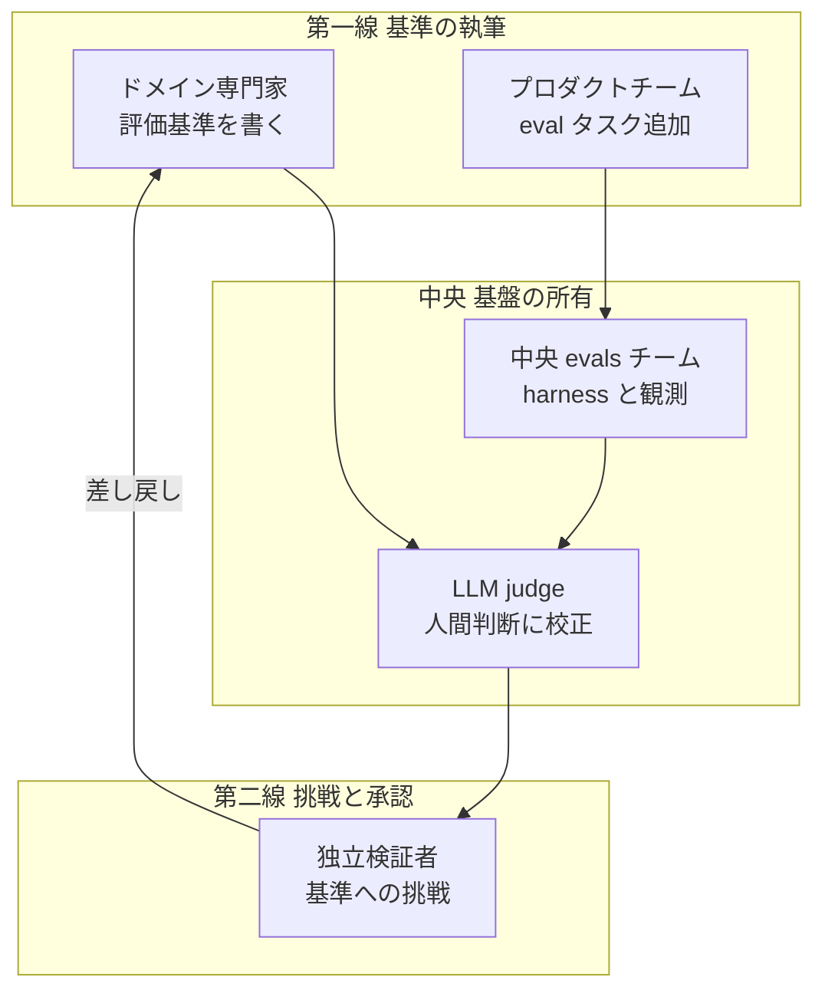

## この記事で検証すること

Databricks のチーフ AI サイエンティスト Jonathan Frankle が、次の趣旨を述べました。「AI はもう十分賢い。投資する資金があるなら、賢いモデルではなく評価とガバナンスに投資すべきだ」。日本では ITmedia AI+ の取材記事がこの発言を広めました。

この主張は、発注側・経営として投資判断を下すときに直結します。モデル更改に予算を割くのか、評価・検証の体制に割くのか。二択を迫られる場面が増えているためです。

そこで本記事は、この「モデル性能から評価・ガバナンスへ」というシフト論を一次ソースまで遡って検証します。買い手調査・資金流入・製品投資・規制の 4 系統を突き合わせ、さらに反証も並べたうえで、実務に落とせる形に整理します。

先に結論を 3 点で示します。

| 結論 | 要旨 |
|---|---|
| シフトは実在する | 買い手調査・資金・製品・規制の 4 系統が独立に同じ方向を指す |
| 「十分賢い」は条件付き | 短時間タスクでは成立するが、長時間・複雑タスクではモデル能力が依然ボトルネック |
| 焦点は責任設計へ | 「評価基準を誰が書き、誰が承認するか」が実務の中心論点 |

本記事は、モデルと評価のどちらに投資するかを判断する発注側・経営を主な読者に想定します。実装エンジニアにとっては、評価基盤をどの責任分担で組むかの設計指針として読めます。

発言の帰属について、1 点補足します。「70% では不十分、90% でも足りない」といった印象的な言い回しは、英語の公開発言では今回の調査範囲で確認できませんでした。ITmedia の日本向け独自取材が事実上の一次ソースです。同趣旨の英語一次は存在します。VentureBeat の独占ブリーフィング (2025-11-04) で Frankle は "The intelligence of the model is typically not the bottleneck, the models are really smart" と語っています。「モデルの知能は通常ボトルネックではない。モデルは実に賢い」という趣旨です。

## シフトは実在する: 4 系統が同じ方向を指す

まず「評価・ガバナンスが主要投資領域として立ち上がった」というトレンドの実在を確認します。買い手・資金・言説・規制の 4 系統が、それぞれ独立に同じ方向を示します。

### 買い手側: モデルは good enough、差がつくのは評価と調達

発注側の一次証言が、モデル性能の頭打ちと評価の重要化を裏づけます。

| 調査 | 主な発見 | 留意点 |
|---|---|---|
| a16z Enterprise CIO 調査 (2025-06、VP/C 100 名) | ほとんどのタスクでモデルは十分に機能し、価格が重要な選定要因に。外部ベンチは初期フィルタ、最終判断は内部評価 (golden dataset) | 投資家による調査 |
| McKinsey State of AI 2025 (n=1,993) | AI の EBIT 影響を報告できる組織は 39%、大半は 5% 未満。high performer を最も判別する要因の一つが「モデル出力をいつ・どう人間検証するかのプロセス定義」(65% 対 23%) | 自己申告ベース |
| LangChain State of Agent Engineering (n=1,340) | 「品質」が本番化の最大障壁として 2 年連続 1 位。オフライン評価の導入率は 39.8% から 52.4% へ上昇 | LangChain のオーディエンスに偏る自己選択標本 |

3 系統の調査が「モデルは足りている。詰まりは品質検証にある」という同じ像を描きます。

### 資金と製品: 評価カテゴリへの資本集中

資本の流れも評価に向かっています。

- 評価・observability 専業 3 社に約 1 年で計 $275M が集まりました。内訳は Arize $70M (2025-02)、LangChain $125M @$1.25B (2025-10)、Braintrust $80M (2026-02) です。
- Databricks は MLflow 3 と Agent Bricks を投入しました。LLM judge を開発と本番監視で共用する設計で、「高品質評価が無いと gut check 頼みになる」と明言しています。
- 対照的に OpenAI はホスト型 Evals プラットフォームを 2026 年末に停止予定です。公式移行先は自社機能ではなく、サードパーティの Promptfoo です。

OpenAI の動きは「評価軽視」ではなく、「評価基盤の内製提供から撤退し、ユーザー側ツールに返す」動きと読めます。評価を自社プラットフォームの中核に置く Databricks と、エコシステムに委ねる OpenAI で戦略が分岐しました。

資金額の解釈には割引が要ります。eval スタートアップ市場には、「難しい部分 (代表的テストスイート構築、gold data 収集、pass/fail 定義) を顧客に丸投げして enterprise 価格を取る」という実務側の批判があります。資金流入額をそのまま需要の証拠として使うのは危ういと考えます。

### 言説: 「evals がモート」論の系譜

「評価こそが競争優位 (モート) だ」という主張は、複数の論者が独立に述べています。

| 論者 | 立場 | 発言の要旨 | 時期 |
|---|---|---|---|
| Greg Brockman (OpenAI) | ベンダー | evals があれば十分なことが驚くほど多い | 2023-12 |
| Kevin Weil (OpenAI CPO) | ベンダー | 今のモデルは知能ではなく eval に制約されている | 2024-11 |
| Mike Krieger (Anthropic CPO) | ベンダー | 一つ教えるなら evals を書くことが最重要 | 2024-11 |
| Garry Tan (YC CEO) | VC | evals は AI スタートアップの本当のモート | 2025-02 |
| Hamel Husain (実務家) | 中立寄り | 失敗する AI プロダクトの共通根本原因は評価システムの欠如 | 2024-03 |

Weil と Krieger の発言が、Frankle と別系統の場 (2024-11 の同一パネル) で出ている点に注目します。シフト論が Databricks 単独のポジショントークではない傍証になります。ただし、これらの論者はいずれも評価に利害を持つ側 (ベンダー・VC) です。この点は割り引いて読みます。

### 規制: 評価の義務化・実装物化

規制は評価を「任意のベストプラクティス」から「コンプライアンス要件」へ格上げしました。

| 法域・枠組み | 内容 |
|---|---|
| EU AI Act (Art.55) | systemic risk を持つ GPAI プロバイダに model evaluation と adversarial testing の実施・文書化を義務化。Chapter V は 2025-08-02 適用 |
| ISO/IEC 42001:2023 | Clause 9 で評価の恒常プロセス化を認証要件化 |
| NIST AI RMF | Measure 機能と GenAI Profile で評価・red-teaming を具体化 |
| 日本 AISI | 評価観点ガイド 1.10 版 (10 観点) に加え、自動レッドチーミング付き評価ツールを OSS 公開 |
| 金融庁 AI DP 1.1 版 | 130 社調査で「生成 AI は評価軸が未確立で客観的な性能検証が困難」を金融機関共通の課題として一次記録。独立検証者による本番適用前検証・継続監視の事例を採取 |

規制が評価を実装物として要求し始めた点が重要です。評価は倫理的な努力目標から、監査対象の成果物へと変わりました。

## 「モデルはもう十分賢い」は条件付き

シフト論の実在を確認したうえで、前提となる「モデルはもう十分賢い」を検証します。この前提は、条件を付けたときにだけ成立します。

METR の実証 (arXiv:2503.14499) が明快な反証です。人間換算 4 分未満のタスクでは成功率がほぼ 100% ですが、4 時間超のタスクでは 10% 未満に落ちます。しかも、自律で完遂できるタスクの時間長 (time horizon) は約 7 か月ごとに倍増しています。つまり「モデル向上への投資はもうリターンが薄い」という前提自体が、長時間タスクでは崩れます。

Frankle の発言は「単発タスクの知能」に限定して読むべきです。無条件の一般化は反証されています。Gartner も agentic AI プロジェクトの 4 割超が 2027 年末までに中止されると予測し、理由に現行モデルの成熟度不足を挙げました。

反証を取り込むと、単線の物語より三層の併存モデルの方がエビデンスに合います。

| 層 | ボトルネックの中身 | 支持エビデンス | 効く条件 |
|---|---|---|---|
| モデル能力 | 長時間・複雑タスクの自律完遂 | METR: 4 時間超で成功率 10% 未満 | 長いワークフローをエージェントに任せるほど |
| 評価・ガバナンス | 「良い仕事」の定義と検証手段の欠如 | 買い手・資金・規制・言説の 4 系統 | 単発品質は足りるのに本番化が止まる組織 |
| 組織学習 | ワークフロー統合・ユースケース選定 | MIT NANDA: パイロット 95% 失敗の主因は learning gap | 業務プロセス側が未整備な組織 |

三層は併存します。組織の成熟度とタスク特性で、どの層が効くかが変わります。自社がどの層で詰まっているかを見極めることが、投資判断の起点になります。

## 評価責任をどう設計するか

「評価に投資する」と決めた瞬間、次の問いが立ち上がります。評価基準を誰が書き、誰が承認するのか。実務の焦点はここに移っています。調査で確認できた収束形は、次の 3 層構造です。

| 要素名 | 説明 |
|---|---|
| ドメイン専門家 | 業務側で評価基準を執筆する第一線 |
| プロダクトチーム | eval タスクを PR で追加する現場 |
| 中央 evals チーム | harness・CI・観測基盤を所有する中央 |
| LLM judge | 人間判断に校正した自動採点器 |
| 独立検証者 | 基準そのものへ挑戦し承認する第二線 |

### 執筆責任: ドメイン専門家主導への収束

評価基準の執筆責任は、業務側のドメイン専門家に寄っています。

- Hamel Husain と Shreya Shankar は、単一のドメイン専門家を品質の最終決定者に任命する「benevolent dictator」方式を推奨します。
- Anthropic は「プロダクト要件とユーザーに最も近い人が成功を定義できる」とし、PM や CS が eval タスクを PR で足せる体制を推奨します。良いタスクの判定基準は「2 人のドメイン専門家が独立に同じ pass/fail に達すること」です。
- 大規模実例が OpenAI HealthBench です。60 か国の医師 262 名が 48,562 のルーブリック基準を執筆し、採点は model grader が実行しました。「基準の執筆は専門家、実行は judge」という分業です。

一方で内部対立も残ります。MLflow 公式ドキュメントは「複数のドメイン専門家で多視点を確保」を推奨し、Hamel の単一専門家論と逆を向きます。組織規模とドメインのハイステークス度で使い分ける段階です。

### 基準は事前に確定できない: criteria drift

評価基準を「一度書いて終わり」にできない点も、設計上の重要な制約です。

Shankar らは criteria drift を実証しました (UIST 2024, arXiv:2404.12272)。「基準が無いと採点できないが、採点を通じてしか基準は定まらない」という循環です。評価基準の執筆は一回限りの文書作業ではありません。専門家が出力を見続ける反復プロセスとして設計する必要があります。

Databricks Judge Builder の運用知見も同型です。「専門家は思ったほど合意しない」といいます。同一出力に専門家 3 人が 1 点・5 点・中立を付けた事例もありました。batched annotation と inter-rater reliability チェックで一致度 0.6 を達成し (外部アノテーションサービスの典型値 0.3 に対して)、20〜30 の well-chosen な edge case で堅牢な judge を構築できる、と報告しています。

### 組織構造: hub-and-spoke と二線の承認

3 層構造の背骨は、中央がインフラを持ち、現場が基準を書く hub-and-spoke です。ハイステークス用途では、そこに承認レイヤを重ねます。

- Anthropic の運用実感は明快です。「最も効果的だったのは、専任の evals チームが中核インフラを所有し、ドメイン専門家とプロダクトチームがほとんどの eval タスクを提供して自ら実行する体制」でした。
- 規制業種は承認レイヤをさらに分離します。米銀のモデルリスク管理では、materiality tier に応じて Tier-1 モデルの本番昇格に独立検証グループの承認を必須化します。eval set・prompt variant・agent trace が「effective challenge」の対象物になります。
- judge の校正手順も各社公式が具体化済みです。LangSmith は人間ラベル 20 件以上で alignment% を測定し、MLflow は 10〜100 traces (負例 30% 以上) を推奨します。OpenAI は「コスト最適化の前に human labels との一致を検証せよ」と述べます。

金融庁 AI DP 1.1 版も、「モデル開発者と独立した検証者による本番適用前検証・継続監視」の事例を記録しました。評価責務が業務部門側へ寄る議論の、日本側の一次記録です。

## 反証と限界

結論の頑健性を保つため、反証を明示します。ここまでの整理を弱める材料も、正面から並べます。

| 反証 | 強度 | 中身 |
|---|---|---|
| 「もう十分賢い」への直接反証 | 強 | METR が長時間タスクの低成功率と能力の急成長を実証。前提が崩れる |
| 因果の弱さ | 中 | Databricks の「評価ツール利用組織は本番化約 6 倍」は相関。成熟組織ほど両方進む交絡が濃厚 |
| 失敗主因は別にある論 | 強 | MIT NANDA はパイロット 95% 失敗の主因を learning gap とし、評価基盤の欠如を主因に挙げない (二次情報経由) |
| governance theater | 中 | 「Governance by PDF」への批判。EU AI Act には 50 社超の CEO が実装 2 年停止を求める公開書簡を提出 |
| judge の科学的限界 | 強〜中 | LLM judge に 12 種のバイアス。偽の引用で judge をハック可能。校正後もモデル更新でドリフト |

judge のバイアスについては、注意深い解釈が必要です。position・verbosity・authority など 12 種のバイアスが定量化されており、偽の引用文献で judge を騙せます (authority bias)。ただし、これらは「校正して運用せよ」という結論をむしろ補強します。反証として効くのは「校正の維持コストが想定より高い」という運用条件の追加にとどまります。

なお、探しても見つからなかった反証もあります。「モデルが賢くなれば evals は不要」とする著名な一次言説、judge 校正の全否定エビデンス、evals 投資が ROI に見合わなかった具体的企業事例です。いずれも今回の調査範囲では確認できませんでした。この不在は、結論の頑健性を示す情報として記録します。

## 発注側・経営への 4 つの推奨

検証結果を、発注側・経営の投資判断に落とします。

1. **「モデル更改 対 評価基盤」の二択にしない**。タスク長で切り分けます。人間換算で分単位のタスクは現行モデルで品質が足りている可能性が高く、評価・検証体制が投資先です。時間単位の自律ワークフローはモデル能力自体が制約であり、evals を整えても本番化しません。
2. **評価基準の執筆責任を先に決める**。推奨形は、業務側ドメイン専門家が基準を書き (小規模なら単一の最終決定者)、プラットフォームチームが harness と観測を持ち、ハイステークス用途は独立検証を挟む形です。基準は criteria drift を前提に、採点とセットの反復プロセスとして予算化します。
3. **judge は校正・再校正コスト込みで見積もる**。人間ラベル 20〜30 件からの校正で立ち上げられます。一方で、バイアス・ハッキング・ドリフトへの定期監査 (judge の judge) が恒常運用になります。
4. **ガバナンス投資は「文書」でなく「本番前ゲートと監視」に紐付ける**。Governance by PDF を避けます。evals・承認権限・監視閾値という実装物に落ちているかで、進捗を測ります。

## 未解決の問い

今回の調査で残った空白も記録します。ここは記事化や社内議論の独自論点になり得ます。

1. **許容失敗率を誰が決めるか**。「どの水準が健全か」を語る一次ソースはあります。しかし「どの職種が合意し署名するか」を正面から扱う一次ソースは確認できませんでした。最近接は SRE のエラーバジェットと米銀 MRM の tier 別承認権限です。
2. Databricks の 6 倍・12 倍という数字の因果方向。第三者検証を待つ段階です。
3. ITmedia 記事の固有の言い回し (70%/90% など) の英語初出。Summit の未転写素材に残る可能性はあります。
4. 手作り evals がモデル世代交代で陳腐化する速度。評価資産の減価率を扱う定量研究は未発見です。

## まとめ

「AI はもう十分賢い。評価とガバナンスに投資せよ」というシフト論は、買い手・資金・規制・言説の 4 系統が支持する実在のトレンドです。ただし前提はタスク長で条件付きであり、実務の焦点は「評価基準を誰が書き、誰が承認するか」という責任設計へ移っています。発注側は、モデルと評価の二択に陥らず、自社がどの層で詰まっているかを見極めたうえで、評価責任と本番前ゲートを実装物として設計することが要点です。

この記事が少しでも参考になった、あるいは改善点などがあれば、ぜひリアクションやコメント、SNSでのシェアをいただけると励みになります！

## 参考リンク

- 公式ドキュメント・一次資料
  - [Databricks: From Pilot to Production with Custom Judges](https://www.databricks.com/blog/pilot-production-custom-judges)
  - [Databricks: 2026 State of AI Agents](https://www.databricks.com/blog/enterprise-ai-agent-trends-top-use-cases-governance-evaluations-and-more)
  - [Anthropic: Demystifying evals for AI agents](https://www.anthropic.com/engineering/demystifying-evals-for-ai-agents)
  - [OpenAI: HealthBench](https://openai.com/index/healthbench/)
  - [OpenAI: API deprecations](https://developers.openai.com/api/docs/deprecations)
  - [a16z: Enterprise CIO 調査 2025](https://a16z.com/ai-enterprise-2025/)
  - [McKinsey: The State of AI 2025](https://www.mckinsey.com/capabilities/quantumblack/our-insights/the-state-of-ai)
  - [LangChain: State of Agent Engineering](https://www.langchain.com/state-of-agent-engineering)
  - [EU AI Act: Article 55](https://ai-act-service-desk.ec.europa.eu/en/ai-act/article-55)
  - [金融庁: AI ディスカッションペーパー 1.1 版](https://www.fsa.go.jp/news/r7/sonota/20260303/aidp_version1.1.pdf)
  - [IPA/AISI: 評価観点ガイド 1.10 版](https://www.ipa.go.jp/pressrelease/2025/press20250402.html)
  - [IPA/AISI: 評価ツール OSS 公開](https://www.ipa.go.jp/pressrelease/2025/press20250916.html)
- 論文
  - [METR: Measuring AI Ability to Complete Long Tasks](https://arxiv.org/abs/2503.14499)
  - [Shankar et al.: Who Validates the Validators? (UIST 2024)](https://arxiv.org/abs/2404.12272)
  - [Justice or Prejudice? (LLM judge bias)](https://llm-judge-bias.github.io/)
- 記事・調査
  - [ITmedia AI+: 「AIはもう十分賢い」活用のボトルネックは「モデル性能」から「評価」へ](https://www.itmedia.co.jp/aiplus/article/2607/06/2000000160/)
  - [VentureBeat: Databricks research on building better AI judges](https://venturebeat.com/infrastructure/databricks-research-reveals-that-building-better-ai-judges-isnt-just-a)
  - [Madrona: Founded & Funded with Jonathan Frankle](https://www.madrona.com/databricks-ia40-ai-data-jonathan-frankle/)
  - [MIT NANDA / The GenAI Divide (Fortune 経由)](https://fortune.com/2025/08/18/mit-report-95-percent-generative-ai-pilots-at-companies-failing-cfo/)
  - [Hamel Husain: evals FAQ](https://hamel.dev/blog/posts/evals-faq/)
  - [Hamel Husain: LLM judge](https://hamel.dev/blog/posts/llm-judge/)
  - [NextWord: Evals startups want enterprise money](https://nextword.substack.com/p/evals-startups-want-enterprise-money)
