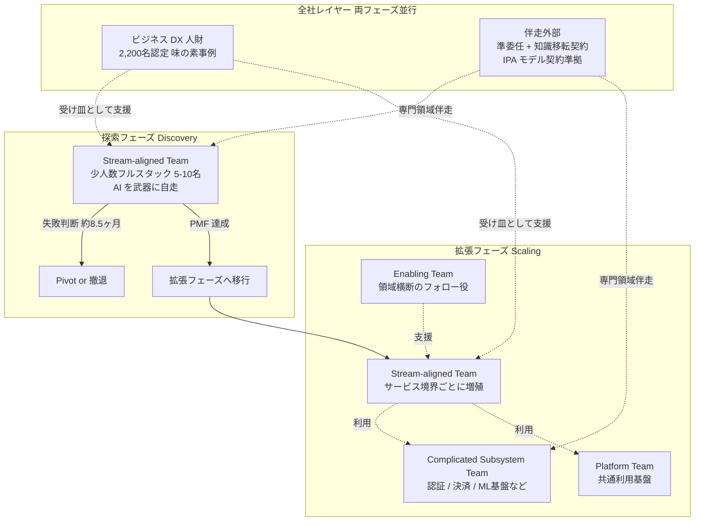
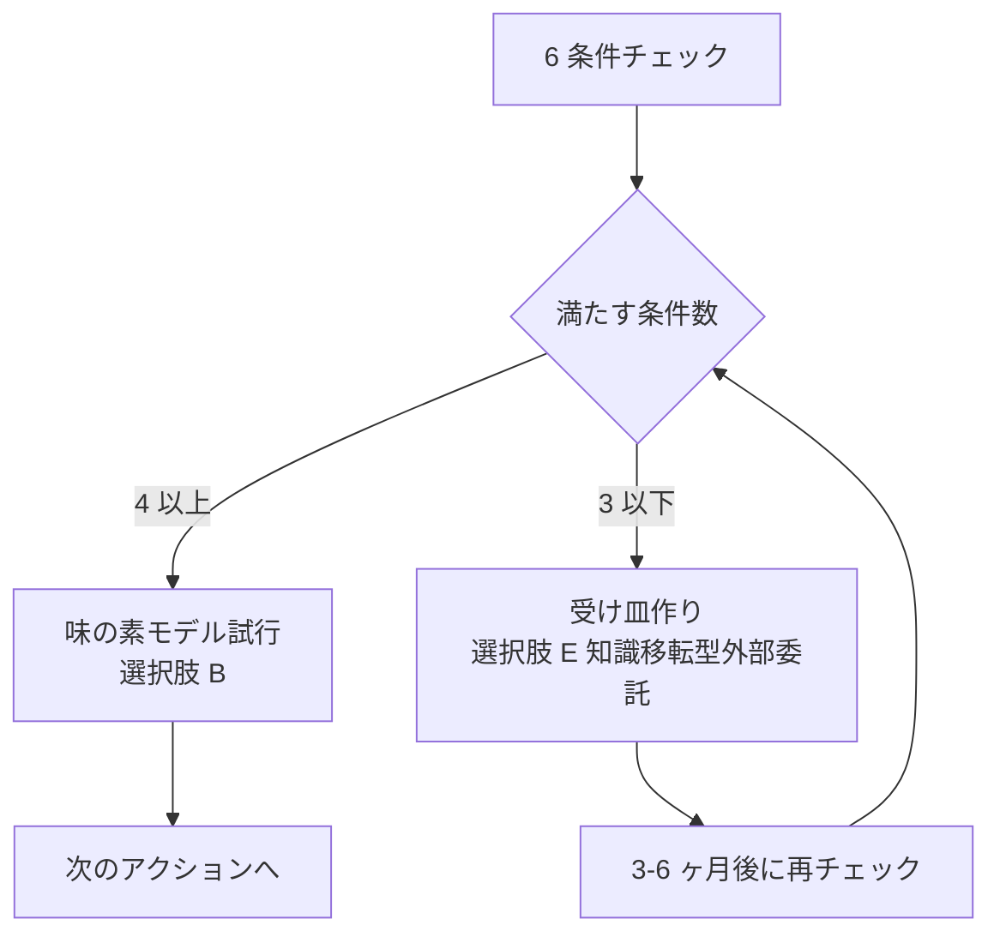

## 概要

味の素は、コーポレート本部 DX 推進部の中に **先進 IT グループ**(マネージャー高木亮輔氏、平均年齢 33.5 歳)を置き、「**それぞれのエキスパートの配置ではない、一人ひとりが AI を武器に自走するフルスタック人財で構築する内製開発組織**」を運営しています。社内チャット **AJI AI Chat** は 2025-12 時点で月間アクティブ率 約 70% に達し、社内ナレッジ検索 **AJIBO** と Microsoft 365 Copilot を含む 3 本立て体制で AI を業務に組み込んでいます。

ITmedia ビジネスオンラインの記事(2026-06-25)は、この体制を「**専門分業の調整コストを少人数フルスタックで消し、AI が個人の弱点を埋める**」モデルと位置付け、「年 300 時間削減」「10 人 → 1 人」「専門家 20 人ほど」「約 1 年で撤退」といった具体数値を示しました。撤退プロジェクトは女性向けセルフケアサブスク **LaboMe®**(2023-08 ローンチ → 2024-04-30 終了、約 8.5 ヶ月)です。

本記事は、この味の素事例を出発点に次の 4 点を横断します。

- 少人数フルスタックチームの組織論(Team Topologies / Two-Pizza / Spotify Squad の自己批判)
- AI が組織の調整コストをどこまで削減できるかのエビデンス(GitHub Copilot RCT / METR / DORA)
- 知識移転型外部委託の契約形態(IPA モデル契約 / Pivotal Labs / ThoughtWorks)
- 探索フェーズから拡張フェーズへの組織遷移(Ambidextrous Organization / Skelton/Pais 漸進分割)

結論を先取りすると、味の素モデルは「**探索フェーズ専用の構成**」として強い合理性を持ちます。ただし「少人数フルスタック化すれば AI 時代に勝てる」という一般化は、Anthropic 自身の研究や Gartner の「内製化 50% 失敗」レポートなど複数の反証を踏まえると過大表現になります。本稿で示すのは「**条件付き有利論**」であり、その条件は本文で 6 つに整理します。

## 特徴

### 特徴 1: 「フルスタック少人数 + 全社リテラシー 2,200 名」の二層構造

味の素モデルの最大の見落としは、先進 IT グループの少人数開発と全社のリテラシー底上げが **別レイヤーで併走している** 点にあります。同社のサステナビリティ資料・IR 開示によれば次のとおりです。

| レイヤー | 内容 |
|---|---|
| 先進 IT グループ | 平均年齢 33.5 歳の少人数開発チーム(具体人数は公開なし) |
| ビジネス DX 人財育成プログラム | 2,200 名認定 |
| デジタル人材育成計画 | 800 人を前倒し達成 |

この二層構造があるからこそ、少人数フルスタックチームが社内に AI プロダクト(AJI AI Chat / AJIBO)を投下したときに、**現場側の受け皿(2,200 名のビジネス DX 人財)が利用文化を作って定着** させられます。ITmedia 記事の「フルスタック化」だけを切り取って真似ようとすると、全社リテラシー側の投資を見落とします。Spotify Squad モデルが他社で失敗した主因の 1 つに「coach 不足」と「collaboration を assumed skill 扱い」が挙げられています(Jeremiah Lee 2020 自己批判)。味の素はこの落とし穴を二層構造で回避していると読めます。

### 特徴 2: 「内製一色」ではなく「内製 + 伴走外部」の共創モデル

同じ味の素グループでも、経理 AI エージェント(年 1 万時間削減見込み)は **味の素フィナンシャル・ソリューションズ (AFS) × ファーストアカウンティング**の共同開発であり、本体 DX 推進部の内製ではありません。子会社の味の素冷凍食品は外部 SaaS(ChatSense)を全社導入しています。グループ全体としては次の 3 モードを使い分けています。

| モード | 説明 | 味の素事例 |
|---|---|---|
| 自分たちで作る | 内製プロダクト開発 | AJI AI Chat / AJIBO |
| 業務特化ベンダーと共同で作る | 知識移転型の共同開発 | AFS × ファーストアカウンティング |
| 既製品を買う | SaaS 導入 | 味の素冷凍食品の ChatSense |

これは IPA「情報システム・モデル取引・契約書(アジャイル開発版)」(2020 公開、2025-04 まで継続更新)が想定する「準委任 + アジャイル請負 + 混合型」の三本立てとも整合します。

外部委託を「**納品 (deliverable)**」ではなく「**知識移転 (knowledge transfer)**」モードで運用する代表例として、海外では Pivotal Labs / VMware Tanzu Labs の終日ペアプロと "I do / We do / You do" + Anchor 制、ThoughtWorks の Seed and Split + Ownership Transfer があります。国内では NTT データの Altemista Lab for Agile が JCB の内製化を伴走した事例が公開されています。

ただしこのモデルの落とし穴は深く、Gartner の調査では **内製化プロジェクトの約 50% が期待した成果に届かない**と報告されています(複数解説記事経由の二次情報。一次は Gartner 有料レポート)。共通因は次の 3 点に集約されます。

- 契約 KPI が知識移転に紐づいていない
- 受け皿となる内製エンジニアがいない
- PO(プロダクトオーナー)まで外注した

極端事例として、**みずほ MINORI(35 万人月・約 4,000 億円・1,000 社並走)** が、契約の入口で知識移転を設計しないとどこまで肥大化するかを示す参照点になります(数値は複数報道経由の二次情報)。

### 特徴 3: 「撤退判断が速い」ことが少人数フルスタックの前提

ITmedia 記事の **LaboMe® 約 8.5 ヶ月で撤退** という事実は、見出しの「育成」より重要な含意を持ちます。Marty Cagan / Teresa Torres の Dual-Track Discovery や、Rita McGrath の Discovery-Driven Planning(HBR 1995)は、探索フェーズでは早期に失敗を可視化し、学びを次に回すことを前提にしています。専門家 20 人を集めて 1 プロダクトに張り付けてしまうと、撤退判断は政治的に困難になります(投資の埋没コスト効果)。少人数フルスタックチームは、**撤退コストが小さいからこそ意思決定が速い** わけで、これが新規事業フェーズで効く構造的理由になります。

逆に言えば、**撤退判断ができない組織が少人数フルスタックを真似ても効果は出ません**。10 → 50 人の inflection ポイントで 40-60% の velocity decline が観測される研究や、bus factor 1 で 16% のプロジェクトが消滅するという調査を踏まえると、撤退判断と人員流動性が無い組織で少人数化だけ進めるのは危険です。

### 特徴 4: AI による調整コスト削減は「個人レベルでは強い、組織レベルでは条件付き」

「少人数で済むのは AI が調整コストを消すから」という直感は、エビデンスを揃えると **個人レベルでは支持、組織レベルでは留保付き** になります。

**個人レベルの楽観派**

| 研究 | 条件 | 主な結果 |
|---|---|---|
| GitHub 2022 RCT | n=95、JavaScript HTTP サーバ単一タスク | Copilot 群 -55.8% 時間、CI [21%, 89%]、p=.0017 |
| Cui / Demirer / Salz et al. | n=4,867、MS+Accenture+F100 三社合同 | 完了 PR 数 +26.08%。ジュニアほど効く |

**組織レベルの反例**

| 研究 | 条件 | 主な結果 |
|---|---|---|
| METR 2025 (arXiv:2507.09089) | n=16 熟練 OSS 開発者、246 タスク、録画 143h | +19% 遅延。事前予測 -24%、事後主観 -20%(40pp 乖離) |
| DORA 2024 | 大規模アンケート | AI 採用 25%↑ で個人 +2.1% productivity、組織 throughput -1.5% / stability -7.2% |
| DORA 2025 | 大規模アンケート | throughput は正に転換、stability 依然負。"AI is a multiplier, not a fix" |

**重要な留保**として、METR 自身が 2026/02 に方法論を改定し、「2025 と比較して 2026 早期は AI で多分速くなっている」と認めています。19% 遅延の結論をそのまま 2026 に引くのは過剰反論になります。同様に、**会議時間や Slack 件数を直接従属変数にした RCT がほぼ存在しない** ため、「AI が調整コストを削減」の主張は厳密には経験則レベルで、自社で before / after を測ること自体が組織能力になります。

### 特徴 5: 「フルスタック」の定義は文脈に依存する

味の素の「フルスタック」は SWE 業界一般の「Frontend + Backend + Infra」とは異なります。高木氏の社内定義は「**AI を武器に自走する**」であり、**業務理解 + 生成 AI 活用 + ローコード / 標準ツール組み合わせ** に重心がある可能性が高いです。公開資料には Cursor / Claude Code / Devin といった SWE エージェント系ツールの利用は明示されておらず、Microsoft 365 Copilot と Power Platform 系の利用が中心と推定されます。

これは Stack Overflow Developer Survey 2024 で **31%(6 年連続首位)** が「full-stack」と自称するという事実と組み合わせて読む必要があります。フルスタックは **業界で意味が拡張中の用語** であり、自社で導入するときは「**何を含めて何を含めないか**」を定義し直さないと、既存メンバーが「フルスタック化に追従できない人材」というレッテルを背負うリスクがあります。

Team Topologies(Skelton & Pais 2019)の **Cognitive Load 三分類** を使うと、フルスタック化は次のトレードオフになります。

| 認知負荷 | 内容 | フルスタック化の影響 |
|---|---|---|
| intrinsic | 解こうとしている問題そのものの本質的複雑度 | AI が初期実装を肩代わりして下がる |
| extraneous | 周辺ツール・環境・文脈切替に由来する負荷 | 複数領域を持つため上がる |
| germane | 学習を促進する認知的努力 | チームの成長戦略次第 |

AI が intrinsic を十分に下げない領域(高度な分散システム設計 / セキュリティ監査 / 法規制対応)では、フルスタック化はむしろ生産性を落とします。

### 特徴 6: 拡張フェーズで「Complicated Subsystem」を剥がす設計が必須

味の素モデルを「探索フェーズ専用」と位置付けた上で、拡張フェーズで何が起きるかを設計しておく必要があります。Skelton/Pais の Team Topologies が提示する **漸進分割 6 ステップ** が現実解になります。

| ステップ | 内容 |
|---|---|
| 1 | Stream-aligned team(=フルスタック少人数チーム)で全領域を持ったまま開始 |
| 2 | Cognitive load の超過領域を identify |
| 3 | 超過領域を Complicated Subsystem Team として剥がす(認証認可、決済、ML 基盤など) |
| 4 | 共通利用基盤を Platform Team として剥がす |
| 5 | 領域横断のフォロー役を Enabling Team として設置 |
| 6 | Stream-aligned team はサービス境界に沿って増殖 |

これは Amazon の **Two-Pizza Team(<10 人)→ Single-Threaded Leader(STL)** への進化とも整合します。Amazon 自身が「人数だけでなくリーダー専任の方が本質」と再定義したのは、**人数を縛り続けると拡張期に詰む** ことへの自己批判と読めます。

「ずっと少人数フルスタックでスケールする」という選択肢は、Spotify Model の自己批判(matrix の責任空洞 / autonomy without alignment)や、Zappos の Holacracy 撤回といった **歴史的な失敗事例で支持されていません**。逆に「最初から専門分業でスケール準備」も、Bimodal IT が Mode 1 の腐敗で批判された(Humble 2014, Fowler 2014)ように現実解になりません。**漸進分割が、両極端を避ける現実的な経路** になります。

## 概念構造

### 全体像: フェーズ別の組織構成

### 探索フェーズの構成要素

| 構成要素 | 内容 | 味の素事例での実装 |
|---|---|---|
| Stream-aligned Team | 1 つの価値ストリームを所有する小チーム | 先進 IT グループ(平均年齢 33.5 歳の少人数) |
| 自走基盤 | AI ツールセット | AJI AI Chat / AJIBO / M365 Copilot |
| 撤退判断 | 早期失敗を可視化する仕組み | LaboMe® 8.5 ヶ月で撤退の意思決定 |
| 全社受け皿 | 利用文化を作るリテラシー層 | ビジネス DX 人財 2,200 名認定 |
| 伴走外部 | 知識移転モードの SI / ベンダー | AFS × ファーストアカウンティング共同開発 |

### 拡張フェーズへの遷移トリガー

「いつ拡張フェーズに移すか」の判断軸は次の 4 つです。

| トリガー | 兆候 |
|---|---|
| PMF 達成 | 探索ループで「作る価値があるもの」が確定 |
| Cognitive Load 超過 | コードレビュー滞留 / インシデント対応が回らない / 新規メンバーのオンボーディングが 3 ヶ月超 |
| 規制 / SLA 要件の追加 | コンプライアンス / 監査 / SLO が独立した専門知を要求 |
| チームサイズ 10 人超過 | Two-Pizza の上限を恒常的に超過 |

### 知識移転型外部委託の SECI 配置

野中郁次郎 SECI モデルを契約 KPI に分解すると次のようになります。

| SECI フェーズ | 内容 | 契約 KPI 例 |
|---|---|---|
| S (Socialization / 共同化) | 終日ペアプロで暗黙知共有 | ペアプロ時間 / 内製エンジニア参加率 |
| E (Externalization / 表出化) | 暗黙知を文書化・コード化 | ADR (Architecture Decision Record) 数 / Runbook 整備率 |
| C (Combination / 連結化) | 文書化された知を組織知に統合 | 社内勉強会開催数 / 内製チームへの転載率 |
| I (Internalization / 内面化) | 内製チームが自走可能になる | 常駐解除後 3 ヶ月の自走率 / インシデント自己解決率 |

特に **I (内面化) が契約終了時の自走条件** であり、ここを契約に書かないまま常駐を続けると、解除時に knowledge が一斉に抜けます(SES 解除でナレッジ消失パターン)。

## 5 つの組織選択肢の比較

| 選択肢 | 適合フェーズ | エビデンス強度 | 主な反証 |
|---|---|---|---|
| A. 専門分業 + AI ツール底上げ | 拡張フェーズ | 中 (DORA 2025 throughput 改善) | 探索フェーズで撤退判断が遅い / 個人レベル -55.8% の効果を組織で再現しにくい |
| B. 探索だけフルスタック、拡張で専門化 (味の素モデル) | 探索→拡張の橋渡し | 中 (味の素 / キリン / サントリー事例で再現) | 二層構造の維持コスト / 拡張時の人員流動性が要件 |
| C. 全社フルスタック少人数 (Spotify 模倣) | (なし) | 弱 (Jeremiah Lee 自己批判) | matrix 責任空洞 / autonomy without alignment / coach 不足 |
| D. SI 委託 + Devin 等で内製コスト置換 | 拡張フェーズ | 弱 (現状は Copilot Agent 統合段階) | ベンダーロックイン / コンテキスト移転失敗 / みずほ MINORI 型肥大化 |
| E. 知識移転型外部委託 + 内製ハイブリッド | 探索→拡張の橋渡し | 中 (Pivotal Labs / ThoughtWorks / Altemista) | Gartner 50% 失敗 / I (内面化) を契約 KPI 化しないと崩壊 |

意思決定の補助線として、新規事業の探索フェーズなら B か E、拡張フェーズなら A + Complicated Subsystem 剥がしが基本になります。組織能力に余裕があれば B と E を組み合わせます。C は推奨しません。D は AI Agent 技術の成熟を待つのが現実的です。

## 反証と留保

本稿の結論「条件付き有利論」を弱める反証エビデンスを 5 つ明記します。これらを満たさない組織では味の素モデルの再現に失敗するリスクが高いです。

### 反証 1: AI 委譲モードでの技能低下

Anthropic 自身の研究で、AI に委譲する作業モードでは技能が **17% 低下** することが観測されています(詳細値要再確認)。少人数フルスタックチームが AI に依存しすぎると、人材自身のスキルが空洞化します。**「学習モード」と「委譲モード」を意識的に切り替える運用** が必要です。

### 反証 2: ジュニア雇用の構造的減少

Stanford の payroll データ研究で **ジュニア雇用が 20% 減** という観測があります(詳細値要再確認)。ジュニアほど Copilot の効果が大きい(Cui RCT)一方で、ジュニアの採用機会自体が AI で削られています。少人数フルスタックチームに必要な人材プールが社外で育たなくなる可能性があります。

### 反証 3: Bus factor 1 のリスク

少人数フルスタックは bus factor が下がりやすいです。bus factor 1(=その人がいなくなるとプロジェクトが止まる状態)のリポジトリは **16% が消滅する** という研究があります。**ペアプロ + ADR + Knowledge Transfer Day** など意図的な知識分散が必要です。

### 反証 4: 10→50 人 inflection の velocity decline

10 人から 50 人への拡張時、**40-60% の velocity decline** が観測される研究があります。Spotify の Tribe / Chapter / Guild 構造はこの inflection を吸収する設計でしたが、その Spotify 自身が後に「机上ほどうまくは行かなかった」と認めています。**漸進分割の準備を探索フェーズから始めない** と拡張時に詰みます。

### 反証 5: METR 2026/02 改定の留意

METR 自身が「2025 と比較して 2026 早期は AI で多分速くなっている」と方法論改定で認めています。19% 遅延の結論をそのまま 2026 に引くのは過剰反論になります。**AI 影響評価は時間軸を 6-12 ヶ月以内に区切って再測定する** のが現状の現実解です。

## 自社で味の素モデルを採用するときのチェックリスト

新規事業フェーズで少人数フルスタックチームを組むかを判断する 6 条件を整理します。

| # | 条件 | 確認方法 |
|---|---|---|
| 1 | 撤退判断ができるか | 8-12 ヶ月以内に「やめる」決定ができる権限と文化がある |
| 2 | 全社リテラシー層があるか | 受け皿となるビジネス側人材が 2 桁人数で育っている(味の素は 2,200 名) |
| 3 | AI ツール基盤が整っているか | 個人レベルで Copilot / 社内チャット / RAG 基盤の利用が定着している |
| 4 | 知識移転契約を書けるか | SI / ベンダー契約で I (内面化) を KPI 化できる(IPA モデル契約を起点に) |
| 5 | 拡張時の漸進分割を設計できるか | Stream-aligned → Complicated Subsystem / Platform への剥がし方を事前に決められる |
| 6 | bus factor 対策があるか | ペアプロ / ADR / Knowledge Transfer Day の運用が回せる |

6 条件のうち 4 つ以上を満たせるなら、味の素モデルの試行は妥当です。3 つ以下なら、まずは「**選択肢 E: 知識移転型外部委託 + 内製ハイブリッド**」で受け皿を作る方が成功率が高いです。

## 次のアクション

- 自社の新規事業候補のうち、**8-12 ヶ月の撤退判断ができる粒度のもの** を 1-3 件選ぶ
- 既存組織から **平均年齢 30 代前半 / 自律性高めのメンバー 5-10 名** をフルスタックチームとして編成
- **IPA「情報システム・モデル取引・契約書(アジャイル開発版)」** を取り寄せ、SI / ベンダーとの既存契約を知識移転モードに書き換え
- **DORA メトリクス**(deployment frequency / change failure rate / lead time / time to restore)の自社 baseline 計測を始める。AI 導入前後で比較できる土台にする
- 3 ヶ月後の振り返り KPI として **撤退判断件数 / 内製プロダクト利用率 / Bus factor チェック結果** を設定

## まとめ

味の素の少人数フルスタック内製組織は、AI 前提時代の有力な選択肢として注目に値しますが、「少人数フルスタック化すれば AI 時代に勝てる」という単純な一般化は反証エビデンスで支持されません。本稿では味の素モデルを「探索フェーズ専用 + 全社リテラシー二層構造 + 撤退判断の速さ」として位置付け直し、自社採用を判断する 6 条件と、拡張フェーズへの漸進分割の道筋を整理しました。

この記事が少しでも参考になった、あるいは改善点などがあれば、ぜひリアクションやコメント、SNS でのシェアをいただけると励みになります!

## 参考リンク

- 公式ドキュメント・公的資料
  - [Team Topologies key concepts](https://teamtopologies.com/key-concepts)
  - [DORA State of DevOps Report](https://dora.dev/)
  - [IPA 情報システム・モデル取引・契約書(アジャイル開発版)](https://www.ipa.go.jp/digital/model/agile20200331.html)
  - [VMware Tanzu Labs](https://tanzu.vmware.com/labs)
- GitHub
  - [METR Measuring the impact of early-2025 AI on experienced open-source developer productivity (arXiv:2507.09089)](https://arxiv.org/abs/2507.09089)
- 記事
  - [ITmedia ビジネスオンライン 2026-06-25 味の素、少人数フルスタック内製組織を AI 前提で育成](https://www.itmedia.co.jp/business/articles/2606/25/news021.html)
  - [Jeremiah Lee Failed #SquadGoals (2020)](https://www.jeremiahlee.com/posts/failed-squad-goals/)
  - [GitHub Research Quantifying GitHub Copilot's impact on developer productivity (2022)](https://github.blog/news-insights/research/research-quantifying-github-copilots-impact-on-developer-productivity-and-happiness/)
