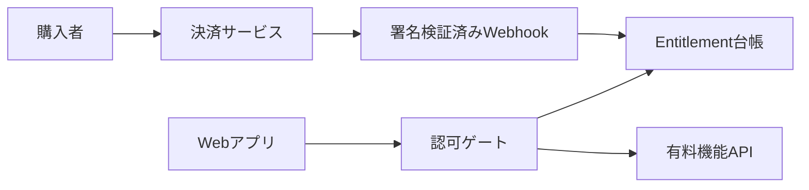

AI に小規模 SaaS を連続して作らせると、実装速度だけでなく設計上の誤りも複製されます。

特に危険なのは、ブラウザの保存値を「有料ユーザーである証拠」として扱う設計です。1 本のアプリで見つけた不備を直しても、共通プロンプトやスターターテンプレートに原因が残っていれば、次のアプリへ同じ不備が入ります。

この記事では、AI 生成 SaaS の課金・利用可否を、個別画面の条件分岐ではなく `entitlement` を中心に設計する方法を整理します。対象は、複数の Web アプリを共通テンプレートから生成・運用するチームです。

## 問題は生成物ではなく供給経路にある

ある実装記録では、AI で生成した複数のミニ SaaS に、ブラウザ保存の premium フラグをそのまま信頼する同型の不備が見つかりました。固定の解除キーを廃止した後も、ページ起動時にクライアント保存の真偽値を読んで有料 UI を解除する構造が残っていたためです。

この事例から得るべき教訓は、特定のキー名を禁止することではありません。次の三つが同じ設計を共有すると、不備も横展開されます。

- 生成プロンプト
- スターターテンプレート
- 生成結果を通すテストとレビュー

つまり、脆弱性は個別アプリのバグであると同時に、生成パイプラインの品質不備です。

## まず、表示状態と利用可否を分ける

`localStorage`、URL パラメータ、隠したボタン、クライアントの JavaScript 変数は、ユーザーの端末上にあります。これらは表示を便利にする情報として扱えますが、権限を認める根拠にはできません。

OWASP は、クライアント側のアクセス制御を決定的な許可・拒否に使わず、サーバー、ゲートウェイ、またはサーバーレス関数で実施するよう勧めています。ブラウザの storage は開発者ツールから閲覧・変更でき、XSS が発生すれば JavaScript からも読み書きできます。

| 区分 | クライアントに置ける情報 | 権限の根拠にできる情報 |
| --- | --- | --- |
| 表示状態 | ローディング状態、メニュー表示、案内の既読 | できない |
| セッションの補助情報 | 再検証に使う識別子 | 識別子だけではできない |
| 利用可否 | UI に表示する直近の結果 | サーバーが検証した結果だけ |

「有料である」という真実の源は、サーバー側の entitlement 台帳です。ブラウザは台帳を直接変更できず、リクエストごとに照合された結果だけを受け取ります。

## entitlement を中心にした構成

`entitlement` は、誰が、どのアプリで、どのプランを、いつまで使えるかを表すサーバー側の記録です。ライセンスキーや決済イベントは、その記録を作るための入力であって、機能利用を直接許可するものではありません。



| 要素名 | 説明 |
| --- | --- |
| 決済サービス | 支払いの完了、失敗、取消などを通知する外部サービス |
| 署名検証済みWebhook | 通知の真正性を確認し、台帳更新を起動するサーバー入口 |
| Entitlement台帳 | 利用可否の真実の源。アプリ、主体、プラン、期限、失効、利用量を保持 |
| 認可ゲート | 有料操作の直前で台帳を照合するサーバーまたはサーバーレス関数 |
| 有料機能API | 認可成功後だけ実行する生成、出力、保存、閲覧などの処理 |

### 台帳の最小モデル

実装に使うストレージは RDB、KV、認可サービスなどから選べます。重要なのは、少なくとも次の属性を同じレコードとして評価できることです。

| 属性 | 用途 |
| --- | --- |
| `app_id` | entitlement が有効なアプリを限定 |
| `subject_id` | ユーザー、組織、または顧客を限定 |
| `plan` | 使える機能と上限を決定 |
| `status` | active、expired、revoked などの状態を管理 |
| `valid_until` | 期限を評価 |
| `usage` | 回数、容量、同時実行数などを評価 |
| `source_event_id` | 決済イベントを冪等に処理 |
| `policy_version` | どのルールで許可したかを追跡 |

`app_id` を省くと、ある生成アプリの entitlement を別アプリに流用する設計になりやすくなります。複数アプリが共通の認可 API を使う場合ほど、この境界を明示します。

## 決済から権限発行までの流れ

Stripe は、決済完了後の処理をリダイレクト先だけに依存せず、Webhook を使うよう案内しています。購入者が決済後に接続を失い、戻りページを開かない場合があるためです。

entitlement 発行も同じ考え方で設計します。

1. 決済サービスから Webhook を受ける
2. 署名を検証する
3. イベント ID が未処理か確認する
4. 支払い状態と購入内容をサーバー側で取得・照合する
5. `app_id`、`subject_id`、プラン、期限を含む entitlement を作成または更新する
6. 処理済みイベント ID を保存する
7. クライアントには、再検証用の識別子またはセッションだけを渡す

Webhook は再送されます。Stripe も、同じ Checkout Session に対する処理が複数回、並行して呼ばれる可能性を説明しています。そのため、イベント ID または決済セッション ID を一意にし、同じ支払いから entitlement を二重に発行しない実装が必要です。

返金、取消、期限切れ、支払い失敗も同じ状態機械に入れます。成功イベントだけを実装すると、失効したはずの権限が残ります。

## 有料操作の直前でサーバーが判定する

画面で有料メニューを隠すことには、操作を分かりやすくする価値があります。しかし、保護対象は画面ではありません。生成の実行、エクスポート、保存、データ閲覧のように、価値が発生する処理です。

次の疑似コードでは、クライアントが送る値を許可根拠にせず、サーバーが `subject` と `app_id` を使って entitlement を照合します。

```ts
export async function runPremiumFeature(request: Request) {
  const subject = await authenticate(request)
  const appId = resolveAppId(request)

  const entitlement = await findActiveEntitlement({
    subjectId: subject.id,
    appId,
    requiredFeature: "export",
    now: new Date(),
  })

  if (!entitlement) {
    return Response.json({ error: "entitlement_required" }, { status: 403 })
  }

  return executeExport(request)
}
```

この API に到達するたびに判定します。クライアントの `isPremium` は、レスポンスを受け取った後の表示を速くするためにだけ使えます。保存してもよい状態と、保存してはいけない認可判断を混ぜないことが重要です。

## 生成パイプラインへ防御を戻す

アプリを一つ直して終わると、次の生成で再発します。修正を供給経路へ戻します。

### 1. プロンプトを設計契約にする

「キーをハードコードしない」のような禁止だけでは、別のクライアント保存フラグが生まれます。テンプレートには、禁止事項と同時に守る構造を書きます。

- 有料操作はサーバー側の認可ゲートを通す
- クライアント永続値を entitlement の根拠にしない
- 起動時は未許可で始め、サーバー照合後に UI を更新する
- Webhook の署名検証と冪等性を実装する
- entitlement はアプリ、主体、プラン、期限、状態をまとめて評価する

生成モデルは抽象的な要件より、具体的な境界とテスト可能な受け入れ条件に従いやすくなります。

### 2. テンプレートに否定テストを置く

正常な購入フローだけを E2E テストしても、改変に対する耐性は確認できません。テンプレートの CI に、次のような否定テストを加えます。

| 試験 | 期待結果 |
| --- | --- |
| クライアントの premium フラグを改変 | 有料 API は 403 |
| entitlement のない主体で有料 API を呼ぶ | 403 |
| 別アプリの entitlement を使う | 403 |
| 期限切れまたは返金済みの entitlement | 403 |
| 同じ決済イベントを再送 | entitlement を重複発行しない |
| Webhook 署名が不正 | 台帳を更新しない |

OWASP が示すように、クライアント側の検査は UX 補助には使えても、アクセス制御の決定要因にはできません。否定テストでは、その原則を API の振る舞いとして固定します。

### 3. 生成済みアプリを逆引きできるようにする

生成プロンプト、テンプレート、認可 API の各版を記録し、どのアプリへ適用したかを追跡します。脆弱性が見つかったとき、検索対象を「全アプリ」ではなく「テンプレート v3.2 を使ったアプリ」と絞れます。

最低限、次の対応表を残します。

| 資産 | 記録する項目 |
| --- | --- |
| 生成プロンプト | バージョン、ルール ID、変更理由 |
| スターターテンプレート | コミット SHA、依存関係、認可契約の版 |
| 生成済みアプリ | アプリ ID、生成日時、採用テンプレート版 |
| entitlement API | ポリシー版、デプロイ版、監査ログの参照先 |

この対応表があれば、修正は「個別アプリを探して直す」作業から、「原因となった供給経路を修正し、影響範囲を回収する」作業へ変わります。

## よくある誤解

### ブラウザ保存を暗号化すれば安全か

暗号化だけでは、クライアントが有料かどうかを決める構造を変えません。復号・検証の鍵やロジックをクライアントに置く限り、改変耐性は限定的です。サーバーが再検証する認可境界を置く必要があります。

### ライセンスキーを保存すること自体が問題か

再検証に使う識別子をクライアントに持たせる設計はあり得ます。ただし、キーの存在や任意の真偽値から有料状態を導かず、サーバーがアプリ、主体、期限、失効状態と照合する必要があります。

### オフライン機能は実現できないか

オフライン要件では、短命で失効可能な資格情報、利用回数の後追い照合、端末整合性など、リスクに応じた設計を追加します。それでもクライアント単独の判定は改変可能です。守る対象と許容するオフライン期間を明示し、オンライン復帰時の再検証を設けます。

## まとめ

AI 生成 SaaS で防ぐべきなのは、特定の解除キーではありません。ブラウザの状態を権限の根拠にし、同じ誤りをプロンプトとテンプレートで複製する構造です。

entitlement をサーバー側の真実の源に置き、有料操作の直前で判定し、生成ルールと否定テストまで遡って修正します。これにより、生成速度を落とさずに、修正速度が追いつかない問題を避けられます。この記事が少しでも参考になった、あるいは改善点などがあれば、ぜひリアクションやコメント、SNSでのシェアをいただけると励みになります。

## 参考リンク

- 公式ドキュメント
  - [OWASP Authorization Cheat Sheet](https://cheatsheetseries.owasp.org/cheatsheets/Authorization_Cheat_Sheet.html)
  - [OWASP HTML5 Security Cheat Sheet](https://cheatsheetseries.owasp.org/cheatsheets/HTML5_Security_Cheat_Sheet.html)
  - [OWASP Web Security Testing Guide: Testing Browser Storage](https://owasp.org/www-project-web-security-testing-guide/latest/4-Web_Application_Security_Testing/11-Client-side_Testing/12-Testing_Browser_Storage)
  - [Stripe Documentation: Fulfill orders](https://docs.stripe.com/checkout/fulfillment)
- 記事
  - [生成AIに「課金システムを作らせた」ら、同じ脆弱性を3回複製された話](https://zenn.dev/emilia_lab/articles/ai-saas-factory-license-bypass-xss)
