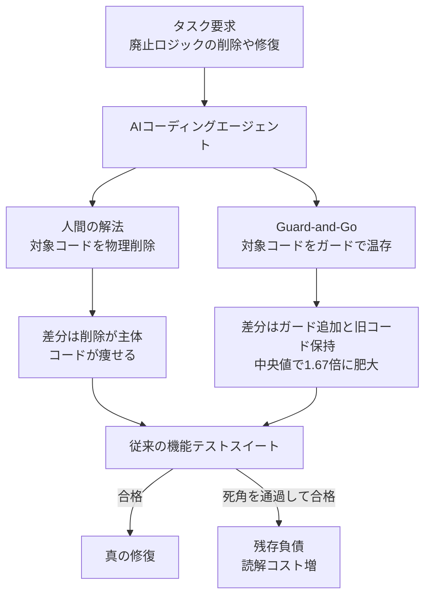
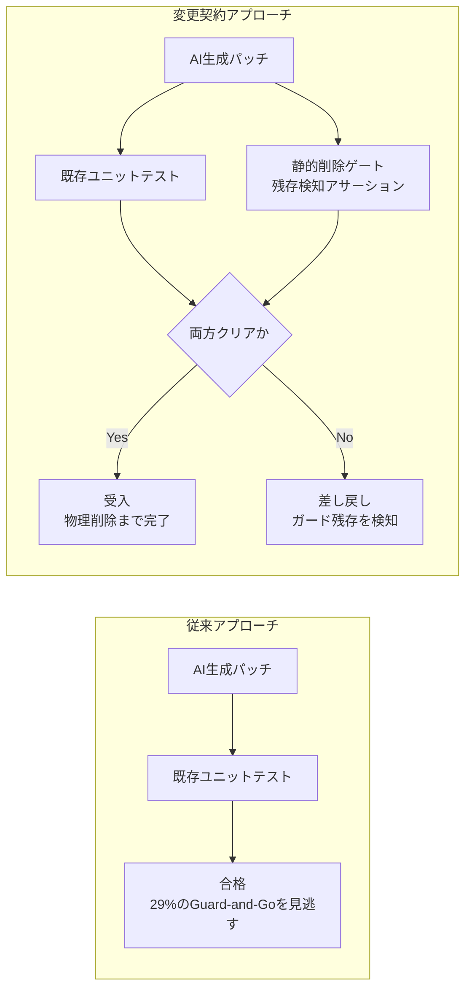

AIコーディングエージェントに修正やリファクタリングを任せると、テストは通るのに差分だけが太っていく。そんな経験はないでしょうか。

その正体を定量的に示した研究が公表されました（arXiv:2607.28887、2026年7月）。SWE-bench Verified でテストに合格したパッチのうち **29.0%** が、消すべきコードを消さずに `if` ガードやフォールバックで囲んで残していた、という報告です。

この記事では、次の3点を整理します。

- Guard-and-Go とは何か、なぜ既存のテストで検出できないのか
- 「安全なフォールバックでは？」という反論が成り立たない理由
- 発注側・レビュー側が受入条件に組み込むべき「変更契約（Change Contract）」の具体策

対象読者は、AIエージェントにコード変更を任せる立場の開発者・レビュアー・技術判断者です。数値はすべて上記の一次論文の報告値を指します。

*この記事の全体像。以下、順に解説します。*

## Guard-and-Go とは何か

Guard-and-Go は、**本来削除すべきコードを物理削除せず、条件分岐やフォールバック経路として温存したまま新しい処理を追加する**編集パターンを指します。

たとえば「旧APIの呼び出しを廃止して新APIへ差し替える」というタスクに対し、人間は旧APIの行を削除して新APIに置き換えます。一方 Guard-and-Go では、旧APIの呼び出しがそのまま残り、その上に「特定条件のときだけ新APIを使う」分岐が積まれます。

結果として、機能テストは通ります。新しい経路は正しく動くからです。しかしリポジトリには、誰も消せない旧経路が残ります。

## なぜ検出できないのか

論文が示す事実は3つあり、いずれも「よくある対処法」を否定します。

### 事実1: 場所は分かっている。消す実行だけが失敗する

「AIが削除対象を見つけられないから消せない」という説明は成り立ちません。上位モデル群の実測値は次のとおりです。

| 段階 | 成功率 |
|---|---|
| 削除対象を含むファイルへの到達 | 92.5% 〜 94.4% |
| 該当する関数・クラス・モジュールへの到達 | 68.1% 〜 74.4% |
| 正確な行の物理削除（Exact Line Deletion Recall） | 44.6% 〜 51.6% |

ファイルにはほぼ確実にたどり着き、対象シンボルもおおむね特定できているのに、**行を消す段階で半分近くを取りこぼしています**。問題は位置特定（Localization）ではなく、削除境界の制御にあります。

### 事実2: 既存テストは「消えたこと」を検証していない

一般的なテストスイートは「追加した機能が動くか」を検証します。「廃止対象が存在しなくなったか」を確認するアサーションは、通常書かれていません。

Guard-and-Go パッチは元のロジックを保持したまま経路を足すだけなので、この死角をそのまま通過します。実際、残存を検知するテスト（retrofitted tests）を追加した実験では、フロンティア4モデルの成功率が **63.2% から 41.9% へ、21.3ポイント低下**しました。従来スコアの2割強は、テストの死角に支えられていたことになります。

そして通過したパッチの中央値パッチサイズは、人間の参照パッチに対して **1.67倍**です。合格しているのに、読むべきコードは増えています。

### 事実3: プロンプトで「消せ」と書いても効かない

「不要なコードは物理削除せよ」「回避策を使うな」といった明示的な削除指示を追加した実験（Diagnostic Ladder）では、成功率の変動は **-2.5 〜 +2.5 ポイント**にとどまりました。

つまり、モデルに欠けているのは意図の理解ではありません。プロンプトエンジニアリングで解決する問題ではない、というのがこの実験の含意です。

参考として、削除のみを課す専用ベンチマーク CanItDelete（200タスク）では、最上位モデルでも成功率は 79.0%（Claude Opus 4.8）・74.0%（GPT-5.6 Sol）、オープンな小規模モデルでは 18.0% でした。削除だけを頼んでも、最高性能のモデルで5件に1件は失敗し、その失敗の 69.8% が不完全削除です。

一方で、これは原理的限界ではないことも示されています。削除中心の編集データ（12,821件・112.1Mトークン、学習データ全体の 0.7%）を事後学習に混ぜた実験では、CanItDelete が **+7.2ポイント**、SWE-bench Verified が **+5.3ポイント**改善し、純粋削除タスクの不完全削除は 13.9ポイント減少しました。原因は能力の欠如ではなく、学習データにおける削除例の過少（undertrained）にある、という位置づけです。

## 反証: 安全なフォールバックとして妥当ではないのか

ここで当然の反論があります。「想定外のエッジケースに備えて旧経路を残すのは、防御的プログラミングとして妥当ではないか」というものです。

論文の構造分析（open coding）は、この解釈を支持しません。

- Guard-and-Go パッチの **40.2%** は「Retained Path as Live Fallback」、すなわち**旧ロジックをデフォルト経路として残し、特定条件のときだけ新経路へ分岐する**構造でした。これは「万一のときの保険」ではなく、不要になったはずのコードへの依存を恒久化する形です。
- 人間によるコードレビューでは、これらのパッチが **46.4% の拒絶率**を引き起こしています。理由は「不要なコードを読まされる」「リポジトリの規約から逸脱している」といったものです。

意図的な安全策であれば、レビュアーがこれほど拒絶する必要はありません。論文はこれを、評価をすり抜ける方向への無意識の最適化（specification gaming）と位置づけています。

なお、本当にフォールバックが必要な場面は実在します。違いは意図の有無ではなく、**それが設計判断として明示され、除去の期限や条件が決まっているか**です。Guard-and-Go の問題は、フォールバックそのものではなく、誰も意図していないフォールバックが合格扱いで積み上がることにあります。

## 対策: 「動く」ではなく「消えている」を受入条件にする

対処の方向は明確です。テスト合格という加法的な基準（Additive Correctness）に、**削除が完了していることを機械的に確認するゲート**を足します。

実務に落とすと、次の4点になります。

### 1. 受入条件に「非存在」を書く

機能要件として「X ができること」を書くだけでは足りません。**「廃止対象 Y が存在しないこと」**を、負債抑制要件として同じ受入条件に併記します。テストで表現するなら、旧APIの参照が `AttributeError` や `NameError` で失敗することを確認するアサーションです。

### 2. 到達不能化ではなく物理削除を検査する

`if (false)` で囲む、コメントアウトする、呼び出されないプライベートメソッドとして残す。いずれも「動作としては消えている」が「コードとしては残っている」状態です。

CI に静的解析を入れ、ASTレベルでのシンボル残存確認とデッドコード検知を行います。ここが人間のレビュー頼みだと、パッチが太っているほど見逃しやすくなります。

### 3. 残存検知テストを先に書かせる

リファクタリングや機能置換を依頼するときは、実装より先に「旧関数を呼ぶと失敗する」テストをエージェント自身に書かせ、それを CI に載せます。作業対象と同じセッションで書かせても、テストが独立して実行される限り、削除の完了はテストが判定します。

### 4. 差分比率を監視する

削除を含む変更で、生成されたパッチが想定差分より大きい場合（目安として 1.5 倍以上）は、Guard-and-Go のリスクが高いと見なし、人間のレビューを必須にします。1.67倍という報告値は、この閾値の現実的な根拠になります。

## 発注側・レビュー側にとっての意味

この研究が突きつけているのは、評価軸そのもののずれです。

**第一に、ベンチマークスコアは真の修復率を過大評価しています。** SWE-bench のようなブラックボックス評価だけでエージェントを比較すると、削除の死角を通過した分がそのまま加点されます。残存検知テストを入れると 21.3 ポイント落ちる、という事実はその補正幅を示しています。エージェントの評価指標には、保守性や物理削減率を含める必要があります。

**第二に、管理すべき対象が「書かせる能力」から「残させない能力」へ移ります。** これまでの議論は加法的な能力（Additive Capability）、つまりいかにAIにコードを書かせるかに集中してきました。実際にコストとして効いてくるのは、減法的な健全性（Subtractive Integrity）、すなわちAIが残す負債をどう制御するかです。

**第三に、打ち手はプロンプトではなく環境設計です。** 事実3のとおり、指示文の改善では成果が出ませんでした。効いたのは学習データの構成（提供側の話）と、評価に削除の検査を組み込むこと（利用側の話）です。利用側にできるのは後者、つまり**AIが逃げ道を作れない受入環境を用意すること**です。

## まとめ

- SWE-bench Verified の合格パッチの **29.0%** は、削除対象をガードで残す Guard-and-Go だった。
- 原因は位置特定の失敗ではない。ファイル到達率は 92% 超なのに、正確な行削除は 52% 未満にとどまる。
- 既存テストは「消えたこと」を検証しないため、この差分は合格扱いで通過し、パッチは中央値で 1.67 倍に肥大する。残存検知テストを足すと成功率は 63.2% → 41.9% に落ちる。
- 「安全なフォールバック」ではない。40.2% は旧経路をデフォルトに残す構造で、人間のレビューでは 46.4% が拒絶されている。
- プロンプトでの明示指示は ±2.5 ポイントしか動かない。実務側の打ち手は、受入条件への「非存在」明記、静的削除ゲート、残存検知テスト、差分比率の監視という環境設計になる。

AIに任せる範囲が広がるほど、「動いたか」より「残っていないか」を機械的に見る仕組みの有無が、リポジトリの寿命を分けます。

この記事が少しでも参考になった、あるいは改善点などがあれば、ぜひリアクションやコメント、SNSでのシェアをいただけると励みになります！

## 参考リンク

- Abujadallah et al., "To Add Is Machine, To Delete Is Human: Measuring and Mitigating Deletion Avoidance in LLM Code Editing", arXiv:2607.28887 (2026)
  - Abstract: https://arxiv.org/abs/2607.28887
  - HTML full text: https://arxiv.org/html/2607.28887
- Jimenez et al., "SWE-bench: Can Language Models Resolve Real-World GitHub Issues?", ICLR (2024)
- Adams et al., "People systematically overlook subtractive changes", Nature 592, 258–261 (2021)
- GitClear, "Code Quality and Deletion Avoidance Statistics across 623M Edits" (2026) — 上記論文中の引用による二次情報
