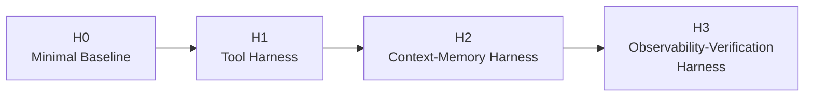
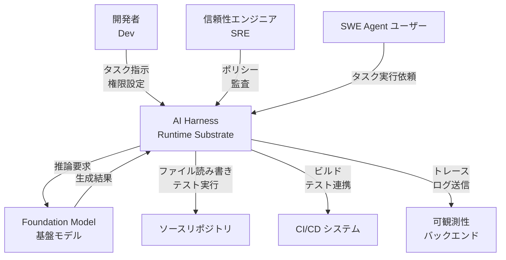
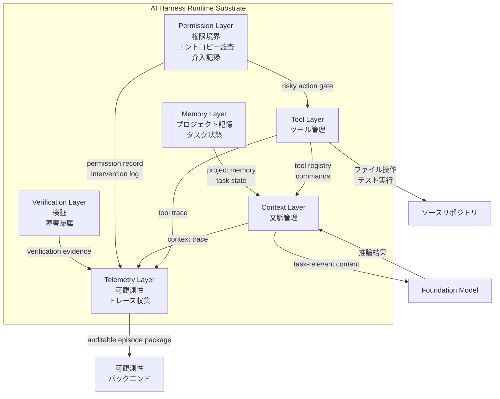
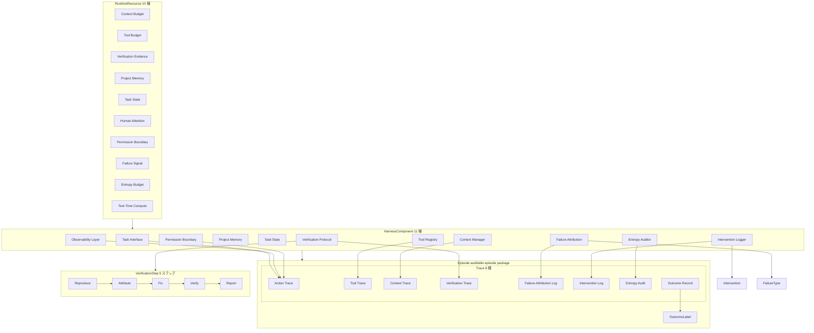
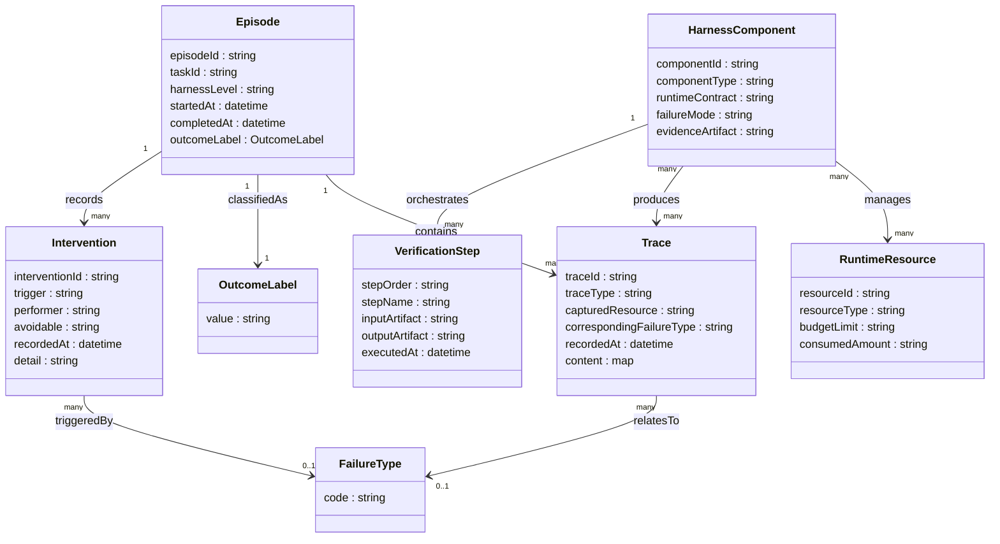

:::message alert
**本記事は arXiv の preprint を解説したものです**。Zhong, H., & Zhu, S. (2026). *AI Harness Engineering: A Runtime Substrate for Foundation-Model Software Agents*. arXiv:2605.13357v1 (2026-05-13 投稿、cs.SE、CC BY 4.0、**未査読・被引用ゼロ** [本記事執筆時点])。実証は単一の controlled task のみで、population-level の数値は報告されていません。
:::

調査日: 2026-05-15

---

## 概要

「コーディングエージェントの成否はモデル性能で決まる」という見方を、論文は model–harness–environment system からの創発として再定式化します。

中核となる形式モデルは次のとおりです。

```
C_system = F(C_model, C_harness, C_environment, T)
```

問いを「モデルがパッチを生成するか」から「model–harness–environment system が **verifiably** 正しく、attributed で maintainable な変更を生むか」へと移すことが本論文の主張です。

### 提案内容

harness をプロンプトでも agent framework でもなく、「foundation-model agent を包む実行層 (runtime substrate)」として定義します。harness は context / tools / project memory / task state / observability / failure attribution / verification / permissions / maintenance state を媒介します。

### preprint であること

本論文は 2026-05-13 投稿の arXiv preprint です。**未査読・被引用ゼロ** (調査時点)。実証は単一の controlled task (repoA-T1: Node.js login app) のみです。arXiv は 2025-10 に CS の review/position 論文の受付を厳格化しており、今後の取り扱い変更の可能性があります。

### 貢献 4 点

1. harness の **11 個のコンポーネント責務**を `Runtime Contract / Failure Mode / Evidence Artifact` の 3 列で形式化しました。
2. **H0–H3 の成熟度ラダー** (加法的継承) を提示しました。
3. **trace-based 評価プロトコル** — 各 episode を 8 種の auditable trace に変換する方式を提案しました。
4. 単一 controlled task (repoA-T1) で H0–H3 が生む evidence の質的差異を例示しました。

---

## 特徴

### 主要概念の一覧

- **11 責務**: task interface / context manager / tool registry / project memory / task state / observability layer / failure attribution / verification protocol / permission boundary / entropy auditor / intervention logger の 11 コンポーネントを `Runtime Contract / Failure Mode / Evidence Artifact` の 3 列で形式化します。
- **H0–H3 成熟度ラダー**: 加法的継承で構成され、H0 (タスク記述+ファイルのみ) → H1 (tool registry 追加) → H2 (project memory / task state 追加) → H3 (observability / verification / Reproduce→Attribute→Fix→Verify→Report サイクル追加) と段階的に責務を明示化します。
- **8 trace (auditable episode package)**: 各 agent run を action trace / tool trace / context trace / verification trace / failure-attribution log / intervention log / entropy audit / outcome record の 8 種の束に変換します。
- **5 outcome label**: `autonomous_verified_success` / `assisted_verified_success` / `unverified_success` / `failed` / `unsafe_invalid` の 5 値で最終結果を分類します。
- **5 design principle**: P1 Explicit runtime resources / P2 Traceable mediation / P3 Requirement-level verification / P4 Attribution before recovery / P5 Maintenance and entropy awareness を設計指針として示します。

### 成熟度ラダーの概念図



### 関連技術との比較

論文が明示的に差別化している隣接概念との違いを示します。

| 比較対象 | 論文での位置づけ | AI Harness との違い |
|----------|-----------------|---------------------|
| **Prompts** | 単一 invocation の整形 | Harness は episode 全体の統治を行います |
| **Agent frameworks**<br/>(AutoGen, MCP) | agent と tool の合成 | Harness は SE 固有タスク向けの runtime configuration です |
| **ACI**<br/>(SWE-agent) | tool 経由で agent action を仕様化 | Harness は ACI を含み、さらに verification / attribution / entropy audit まで拡張します |
| **AIOS** | 一般 agent のスケジューリング | Harness は汎用 OS ではなく SE 固有の substrate です |
| **Evaluation harness** | 振る舞いを測る | Development harness は振る舞いを形作ります |
| **DevOps / Platform Engineering** | 人間ワークフロー向け基盤 | Harness は FM agent インタフェース向けです |

---

## 構造

### システムコンテキスト図

Harness を中心に置き、関与するアクターと外部システムを示します。



#### アクター

| 要素名 | 説明 |
|---|---|
| 開発者 Dev | タスク記述・要件・制約を Harness に渡し、成果物を受け取る人間。 |
| 信頼性エンジニア SRE | 権限境界・エントロピー監査・介入記録を通じて Harness の品質を維持する人間。 |
| SWE Agent ユーザー | Harness を経由してエージェントにソフトウェアエンジニアリングタスクを依頼する人間。 |

#### 外部システム

| 要素名 | 説明 |
|---|---|
| Foundation Model | Harness が推論を委譲する基盤モデル。能力は Harness なしでは直接 auditable な振る舞いにならない。 |
| ソースリポジトリ | エージェントが読み書きするコードベース。アーキテクチャ・テスト・既知障害情報を含む。 |
| CI/CD システム | ビルド・テスト実行・デプロイパイプラインを提供する外部システム。 |
| 可観測性バックエンド | トレース・ログ・スパンを受信・保管・可視化する外部システム。 |

### コンテナ図

Harness 内部を 6 つの論理レイヤーに分解します。



#### レイヤー

| 要素名 | 説明 |
|---|---|
| Context Layer | タスクに関連するコンテンツを選択・露出し、context trace を記録する。責務 (2) Context manager に対応する。 |
| Tool Layer | 利用可能なツール・コマンドを宣言し、tool trace を記録する。責務 (3) Tool registry に対応する。 |
| Memory Layer | アーキテクチャ・テスト規約・既知障害をエージェントが参照できる形式で保持し、タスクの仮説・検査済みファイル・疑問を task-state file に維持する。責務 (4)(5) に対応する。 |
| Verification Layer | 要件を決定論的証拠にマッピングし、障害の観察・期待値・診断を分離して記録する。責務 (7)(8) に対応する。 |
| Permission Layer | リスクのある操作を制限してゲートを露出し、保守負債を検出し、人手介助と回避可能性を記録する。責務 (9)(10)(11) に対応する。 |
| Telemetry Layer | 全レイヤーからのトレースを束ね、auditable episode package として可観測性バックエンドへ送出する。責務 (6) Observability layer に対応する。 |

### コンポーネント図

11 責務を Harness 内コンポーネントとして示し、8 トレースとの関係を矢印で表現します。実装例として Claude Code Hooks / OpenAI Codex / SWE-agent / Phoenix+OpenInference との対応を併記します。

```mermaid
graph TD
    subgraph ContextLayer["Context Layer"]
        TI["1 Task Interface<br/>Claude Code UserPromptSubmit<br/>Codex CLI prompt<br/>SWE-agent submit tool"]
        CM["2 Context Manager<br/>Claude Code InstructionsLoaded<br/>Codex sandbox workspace<br/>Phoenix RETRIEVER span"]
    end

    subgraph ToolLayer["Tool Layer"]
        TR["3 Tool Registry<br/>Claude Code PreToolUse matcher<br/>Codex tool registry config<br/>SWE-agent YAML config<br/>Phoenix TOOL span"]
    end

    subgraph MemoryLayer["Memory Layer"]
        PM["4 Project Memory<br/>Claude Code InstructionsLoaded<br/>Codex AGENTS md<br/>SWE-agent repo navigation"]
        TS["5 Task State<br/>Claude Code TaskCreated<br/>Codex session state"]
    end

    subgraph VerificationLayer["Verification Layer"]
        OL["6 Observability Layer<br/>Claude Code transcript path<br/>Codex OTel emit<br/>Phoenix 本領域"]
        FA["7 Failure Attribution<br/>Claude Code PostToolUseFailure<br/>Codex OTel error span<br/>Phoenix error 属性"]
        VP["8 Verification Protocol<br/>Claude Code PostToolUse lint test<br/>Codex on-failure approval<br/>SWE-agent tests tool<br/>Phoenix EVALUATOR span"]
    end

    subgraph PermissionLayer["Permission Layer"]
        PB["9 Permission Boundary<br/>Claude Code PreToolUse<br/>Codex sandbox mode approval policy"]
        EA["10 Entropy Auditor<br/>Claude Code PreCompact PostCompact<br/>専用 primitive が薄い盲点"]
        IL["11 Intervention Logger<br/>Claude Code PermissionRequest Elicitation<br/>Codex approvals reviewer<br/>専用 primitive が薄い盲点"]
    end

    TI --> ActionTrace["Action trace"]
    CM --> ContextTrace["Context trace"]
    TR --> ToolTrace["Tool trace"]
    PM --> ContextTrace
    TS --> ActionTrace
    OL --> ActionTrace
    FA --> AttrTrace["Failure-attribution log"]
    VP --> VTrace["Verification trace"]
    PB --> PermTrace["Permission record"]
    EA --> EntropyTrace["Entropy audit"]
    IL --> InterTrace["Intervention log"]

    ActionTrace --> EP["Outcome record<br/>5 ラベル"]
    ContextTrace --> EP
    ToolTrace --> EP
    AttrTrace --> EP
    VTrace --> EP
    PermTrace --> EP
    EntropyTrace --> EP
    InterTrace --> EP
```



#### Context Layer コンポーネント

| 要素名 | 説明 |
|---|---|
| 1. Task Interface | objective / requirements / constraints をエージェントに提示する。障害モードは underspecified goal で、証拠物は Task record。 |
| 2. Context Manager | タスクに関連するコンテンツを選択・露出する。障害モードは wrong-file inspection で、証拠物は Context trace。 |

#### Tool Layer コンポーネント

| 要素名 | 説明 |
|---|---|
| 3. Tool Registry | 利用可能なツール・コマンドを宣言する。障害モードは failed/unsafe calls で、証拠物は Tool trace。 |

#### Memory Layer コンポーネント

| 要素名 | 説明 |
|---|---|
| 4. Project Memory | アーキテクチャ・テスト規約・既知障害をエージェントが参照できる形式で提供する。障害モードは repeated rediscovery で、証拠物は Memory references。 |
| 5. Task State | エージェントの仮説・検査済みファイル・疑問を会話の外部で保持する。障害モードは drift / 反復作業で、証拠物は Task-state file。 |

#### Verification Layer コンポーネント

| 要素名 | 説明 |
|---|---|
| 6. Observability Layer | ログ・トレース・出力・エラーをエージェントに露出する。障害モードは unverifiable success で、証拠物は Observation log。 |
| 7. Failure Attribution | 観察・期待値・診断を分離して記録する。障害モードは random patching で、証拠物は Attribution log。 |
| 8. Verification Protocol | 要件を決定論的証拠にマッピングする。障害モードは unverified success で、証拠物は Verification trace。H3 の 5 段サイクル (Reproduce → Attribute → Fix → Verify → Report) を実行する。 |

#### Permission Layer コンポーネント

| 要素名 | 説明 |
|---|---|
| 9. Permission Boundary | リスクのある操作を制限してゲートを露出する。障害モードは unsafe episodes で、証拠物は Permission record。OS primitive (macOS=Seatbelt / Linux=bubblewrap+Landlock / Windows=Windows Sandbox) に降りる実装が存在する。 |
| 10. Entropy Auditor | 導入された保守負債 (stale docs / テスト弱体化 / 依存腐敗) を検出する。障害モードは stale docs / residue で、証拠物は Entropy audit。業界実装では専用 primitive が薄い盲点である。 |
| 11. Intervention Logger | 人手介助と回避可能性を記録する。障害モードは invisible scaffolding で、証拠物は Intervention log。業界実装では専用 primitive が薄い盲点である。 |

#### トレース (auditable episode package)

| 要素名 | 説明 |
|---|---|
| Action trace | 全 operation の系列を捕捉する。対応 failure type は overall coherence。 |
| Context trace | context budget と project memory 参照を捕捉する。対応 failure type は context failures。 |
| Tool trace | tool budget と compute を捕捉する。対応 failure type は tool failures。 |
| Failure-attribution log | failure signal を捕捉する。対応 failure type は diagnosis accuracy。 |
| Verification trace | verification evidence を捕捉する。対応 failure type は verification failures。 |
| Permission record | 権限境界の通過・拒否を捕捉する。対応 failure type は unsafe episodes。 |
| Entropy audit | entropy budget (保守負債指標) を捕捉する。対応 failure type は maintenance burden。 |
| Intervention log | human attention (介助件数・回避可能性) を捕捉する。対応 failure type は missing support。 |
| Outcome record | 最終分類 (5 ラベル) を記録する。対応 failure type は overall adjudication。 |

---

## データ

### 概念モデル

論文に登場する主要エンティティと所有・利用関係を示します。



### 情報モデル

各エンティティの主要属性と多重度を示します。



#### OutcomeLabel の値 (5値 enum)

| 値 | 意味 |
|---|---|
| `autonomous_verified_success` | 要件充足 + 十分な証拠 + missing-harness intervention なし |
| `assisted_verified_success` | patch は正しいが進行・検証に人手依存 |
| `unverified_success` | patch は正しそうだが証拠不十分 |
| `failed` | 振る舞い不達 / テスト破壊 / 使えるパッチなし |
| `unsafe_invalid` | テスト弱体化 / 無関係な破壊的編集 / タスク回避 |

#### FailureType の値 (8種)

| コード | 対応する失敗カテゴリ |
|---|---|
| `F_context` | 文脈選択の失敗 |
| `F_tool` | ツール利用の失敗 |
| `F_feedback` | フィードバック処理の失敗 |
| `F_verify` | 検証の失敗 |
| `F_recovery` | 回復処理の失敗 |
| `F_entropy` | 保守負債の増大 |
| `F_model` | モデル能力固有の失敗 |
| `F_unknown` | 分類不能 |

#### HarnessComponent の種類 (11種)

| # | コンポーネント名 | 生成する Evidence Artifact |
|---|---|---|
| 1 | Task Interface | Task record |
| 2 | Context Manager | Context trace |
| 3 | Tool Registry | Tool trace |
| 4 | Project Memory | Memory references |
| 5 | Task State | Task-state file |
| 6 | Observability Layer | Observation log |
| 7 | Failure Attribution | Attribution log |
| 8 | Verification Protocol | Verification trace |
| 9 | Permission Boundary | Permission record |
| 10 | Entropy Auditor | Entropy audit |
| 11 | Intervention Logger | Intervention log |

#### Trace の種類 (8種)

| Trace 名 | 捕捉対象 RuntimeResource |
|---|---|
| Action Trace | 全 operation の系列 |
| Tool Trace | tool budget, compute |
| Context Trace | context budget, project memory |
| Verification Trace | verification evidence |
| Failure-Attribution Log | failure signal |
| Intervention Log | human attention |
| Entropy Audit | entropy budget |
| Outcome Record | 最終分類 (OutcomeLabel) |

#### RuntimeResource の種類 (10種)

context budget / tool budget / verification evidence / project memory / task state / human attention / permission boundary / failure signal / entropy budget / test-time compute

#### VerificationStep の順序 (5ステップ)

Reproduce → Attribute → Fix → Verify → Report

> **注記**: VerificationStep の各属性 (inputArtifact, outputArtifact) は論文の H3 ワークフロー記述から推測しました。論文はステップ名と順序のみを明示しています。

---

## 構築方法

論文は H0–H3 の **加法的な成熟度ラダー** を提示します。下位レベルの artifact をすべて継承したうえで上位レベルの責務を追加していきます。以下は「実プロジェクトへの導入手順」として 3 段階に再構成した実装案です。各コードは論文の主張ではなく **実装例** であり、補完元を末尾の参考リンクに明示します。

### H1 入門: tool registry を hook で明示化する

**目標**: H1 が要求する「tool registry / tool-usage protocol」を Claude Code Hooks の `PreToolUse` で実現します。全ツール呼び出しをログに記録し、禁止コマンドをブロックすることで、論文が定義する **Tool trace** を生成します。

補完元: Claude Code Hooks 公式 docs (`https://code.claude.com/docs/en/hooks`)

#### 設定ファイル (`.claude/settings.json`)

```json
{
  "hooks": {
    "PreToolUse": [
      {
        "matcher": "Bash",
        "hooks": [
          {
            "type": "command",
            "command": ".claude/hooks/tool-registry.sh",
            "timeout": 10
          }
        ]
      }
    ],
    "PostToolUse": [
      {
        "matcher": "*",
        "hooks": [
          {
            "type": "command",
            "command": ".claude/hooks/tool-trace-logger.sh",
            "timeout": 10
          }
        ]
      }
    ]
  }
}
```

#### hook スクリプト例 (`.claude/hooks/tool-registry.sh`)

```bash
#!/bin/bash
# 実装案: PreToolUse で tool registry を強制し Tool trace を生成する。
# 補完元: https://code.claude.com/docs/en/hooks (PreToolUse payload schema)

PAYLOAD=$(cat)

TOOL_NAME=$(echo "$PAYLOAD" | jq -r '.tool_name')
COMMAND=$(echo "$PAYLOAD"   | jq -r '.tool_input.command // ""')
SESSION=$(echo "$PAYLOAD"   | jq -r '.session_id')
TIMESTAMP=$(date -u +"%Y-%m-%dT%H:%M:%SZ")

BLOCK_PATTERN='(rm[[:space:]]+-rf|git[[:space:]]+push[[:space:]]+--force)'

if echo "$COMMAND" | grep -qE "$BLOCK_PATTERN"; then
  jq -n \
    --arg reason "Blocked by tool registry: destructive command detected: $COMMAND" \
    '{
      hookSpecificOutput: {
        hookEventName: "PreToolUse",
        permissionDecision: "deny",
        permissionDecisionReason: $reason
      }
    }'
  exit 0
fi

LOG_DIR=".claude/traces"
mkdir -p "$LOG_DIR"
jq -n \
  --arg ts "$TIMESTAMP" \
  --arg session "$SESSION" \
  --arg tool "$TOOL_NAME" \
  --arg cmd "$COMMAND" \
  '{timestamp: $ts, session_id: $session, tool: $tool, command: $cmd, decision: "allow"}' \
  >> "$LOG_DIR/tool-trace.jsonl"

exit 0
```

**ポイント**

- `PreToolUse` の JSON 出力で `permissionDecision` を返すと exit code 0 でもブロック・許可・確認要求できます。値は `allow` / `deny` / `ask` (ユーザーへエスカレート) / `defer` (Claude に判断委譲) の 4 種です。
- exit code 2 + stderr でも同様にブロック可能です。
- `tool_use_id` フィールドを使うと PreToolUse と PostToolUse のログを結合できます。

### H2 拡張: project memory と task state file を置く

**目標**: H2 が要求する「agent-readable project memory / task-state file / context-selection protocol」を CLAUDE.md と task state ファイルで実現します。

補完元: Claude Code Memory 公式 docs (`https://code.claude.com/docs/en/memory`)

#### CLAUDE.md の配置場所と役割

| ファイル | 配置場所 | 役割 | 共有範囲 |
|---------|---------|------|---------|
| `CLAUDE.md` | プロジェクトルート or `.claude/CLAUDE.md` | アーキテクチャ / テスト規約 / 既知の障害 | チーム全員 (VCS 管理) |
| `CLAUDE.local.md` | プロジェクトルート | 個人の sandbox URL / テストデータ | 自分のみ (`.gitignore` 追加) |
| `~/.claude/CLAUDE.md` | ホームディレクトリ | 全プロジェクト共通の個人設定 | 自分のみ |

#### CLAUDE.md サンプル (H2 用)

```markdown
# Project Memory — H2 Harness

## アーキテクチャ概要

- エントリポイント: `src/index.ts`
- 認証モジュール: `src/auth/` (JWT ベース)
- 設定ファイル: `config/app.yaml`

## テスト規約

- フレームワーク: Jest + ts-jest
- テスト実行: `npm test`

## 既知の障害

- `src/auth/validator.ts` は空文字列の入力を通過させるバグあり (issue #42)
```

#### task state ファイル (`.claude/task-state.md`)

```markdown
# Task State

## 現在のタスク

- **Task ID**: T-2026-001
- **仮説**: `src/auth/validator.ts` の空パスワードバリデーション漏れが原因
- **ステータス**: Reproducing

## 確認済みファイル

- `src/auth/validator.ts` (L12–L35 の入力チェック欠如を確認)
- `tests/auth.test.ts` (空パスワードケースのテストがない)

## オープンクエスチョン

- エラーレスポンスのフォーマット仕様を PM に確認中
```

### H3 完全実装: Reproduce → Attribute → Fix → Verify → Report サイクル

**目標**: H3 が要求する「決定論的行動チェック / バグ再現プロトコル / 失敗帰属プロトコル / 検証プロトコル」を GitHub Actions と Arize Phoenix (OpenInference) で記録します。

補完元: OpenInference 仕様 (`https://arize-ai.github.io/openinference/spec/`)

#### GitHub Actions ワークフロー例 (`.github/workflows/harness-h3.yml`)

```yaml
name: H3 Harness — Reproduce Attribute Fix Verify Report

on:
  pull_request:
    types: [opened, synchronize]

jobs:
  h3-cycle:
    runs-on: ubuntu-latest
    env:
      PHOENIX_ENDPOINT: ${{ secrets.PHOENIX_ENDPOINT }}
      OTEL_EXPORTER_OTLP_ENDPOINT: ${{ secrets.PHOENIX_ENDPOINT }}/v1/traces

    steps:
      - name: Checkout
        uses: actions/checkout@v4

      - name: Setup Node.js
        uses: actions/setup-node@v4
        with:
          node-version: "20"

      - name: Install dependencies
        run: npm ci

      - name: "[Reproduce] Run deterministic behavior probes"
        id: reproduce
        run: |
          npm run test:probe -- --reporter json > .claude/traces/reproduce.json || true

      - name: "[Attribute] Classify failure type"
        id: attribute
        run: |
          node scripts/attribute-failure.js \
            --input .claude/traces/reproduce.json \
            --output .claude/traces/attribution.json

      - name: "[Verify] Run full regression"
        id: verify
        run: |
          npm test -- --reporter json > .claude/traces/verify.json

      - name: "[Verify] Lint check"
        run: npm run lint

      - name: "[Report] Emit OpenTelemetry spans to Phoenix"
        run: |
          node scripts/emit-harness-spans.js \
            --reproduce .claude/traces/reproduce.json \
            --attribution .claude/traces/attribution.json \
            --verify .claude/traces/verify.json \
            --session "${{ github.run_id }}" \
            --endpoint "$PHOENIX_ENDPOINT"

      - name: Upload harness artifacts
        uses: actions/upload-artifact@v4
        with:
          name: harness-h3-traces
          path: .claude/traces/
```

#### OpenTelemetry span 送信スクリプト例 (`scripts/emit-harness-spans.js`)

```javascript
// 実装案: OpenInference span kind を使って H3 の 5 段サイクルを Phoenix に記録する。
// 補完元: https://arize-ai.github.io/openinference/spec/

const { NodeTracerProvider } = require("@opentelemetry/sdk-trace-node");
const { OTLPTraceExporter } = require("@opentelemetry/exporter-trace-otlp-http");
const { SimpleSpanProcessor } = require("@opentelemetry/sdk-trace-base");
const { trace, SpanStatusCode } = require("@opentelemetry/api");
const args = require("minimist")(process.argv.slice(2));

const provider = new NodeTracerProvider();
provider.addSpanProcessor(
  new SimpleSpanProcessor(new OTLPTraceExporter({ url: `${args.endpoint}/v1/traces` }))
);
provider.register();

const tracer = trace.getTracer("ai-harness-engineering");

async function emitSpans() {
  const agentSpan = tracer.startSpan("harness.episode", {
    attributes: {
      "openinference.span.kind": "AGENT",
      "session.id": args.session,
    },
  });
  const ctx = trace.setSpan(require("@opentelemetry/api").context.active(), agentSpan);

  const verifyData = require(args.verify);
  const evalSpan = tracer.startSpan("harness.verify", {
    attributes: {
      "openinference.span.kind": "EVALUATOR",
      "eval.passed": verifyData.numPassedTests,
      "eval.failed": verifyData.numFailedTests,
    },
  }, ctx);
  evalSpan.setStatus({
    code: verifyData.numFailedTests > 0 ? SpanStatusCode.ERROR : SpanStatusCode.OK,
  });
  evalSpan.end();

  const attrData = require(args.attribution);
  const attrSpan = tracer.startSpan("harness.attribution", {
    attributes: {
      "openinference.span.kind": "CHAIN",
      "failure.type": attrData.failure_type,
      "failure.diagnosis": attrData.diagnosis,
    },
  }, ctx);
  attrSpan.end();

  agentSpan.end();
  await provider.forceFlush();
}

emitSpans().catch(console.error);
```

**ポイント**

- OpenInference の span kind は `LLM / AGENT / TOOL / EVALUATOR / CHAIN / RETRIEVER / RERANKER / EMBEDDING / GUARDRAIL / PROMPT` の 10 種が定義されており、harness 用途では `AGENT / TOOL / EVALUATOR / CHAIN / RETRIEVER` の 5 種が中心です。
- Phoenix UI では `openinference.span.kind` でフィルタリングして各スパン種別を個別に確認できます。
- `session_id` を共通キーにすると Claude Code の `transcript_path` と Phoenix のトレースを結合できます。

---

## 利用方法

### Outcome 5 ラベルを分類する方法

論文は以下の 5 ラベルで episode の最終結果を分類します (論文 §6.2)。

| ラベル | 意味 |
|--------|------|
| `autonomous_verified_success` | 要件充足 + 決定論的証拠 + 人手介入なし |
| `assisted_verified_success` | パッチは正しいが進行・検証に人手依存 |
| `unverified_success` | パッチは正しそうだが証拠不十分 |
| `failed` | 振る舞い不達 / テスト破壊 / 使えるパッチなし |
| `unsafe_invalid` | テスト弱体化 / 無関係な破壊的編集 / タスク回避 |

#### 分類スクリプト例

```bash
#!/bin/bash
# 実装案: Claude Code の Stop / StopFailure hook と検証結果を組み合わせて 5 ラベルを判定する。
# 補完元: Claude Code Hooks (Stop / StopFailure payload)

PAYLOAD=$(cat)
SESSION=$(echo "$PAYLOAD" | jq -r '.session_id')
HOOK_EVENT=$(echo "$PAYLOAD" | jq -r '.hook_event_name')
TIMESTAMP=$(date -u +"%Y-%m-%dT%H:%M:%SZ")

LOG_DIR=".claude/traces"
VERIFY_FILE="$LOG_DIR/verify.json"
ATTR_FILE="$LOG_DIR/attribution.json"
OUTCOME_FILE="$LOG_DIR/outcome.jsonl"

FAILED_TESTS=0
if [ -f "$VERIFY_FILE" ]; then
  FAILED_TESTS=$(jq '.numFailedTests // 0' "$VERIFY_FILE")
fi

INTERVENTION_COUNT=0
if [ -f "$LOG_DIR/intervention.jsonl" ]; then
  INTERVENTION_COUNT=$(wc -l < "$LOG_DIR/intervention.jsonl")
fi

FAILURE_TYPE=""
if [ -f "$ATTR_FILE" ]; then
  FAILURE_TYPE=$(jq -r '.failure_type // ""' "$ATTR_FILE")
fi

if [ "$HOOK_EVENT" = "StopFailure" ]; then
  OUTCOME="failed"
elif echo "$FAILURE_TYPE" | grep -qE "^(unsafe|Funsafe)"; then
  OUTCOME="unsafe_invalid"
elif [ "$FAILED_TESTS" -gt 0 ]; then
  OUTCOME="failed"
elif [ ! -f "$VERIFY_FILE" ]; then
  OUTCOME="unverified_success"
elif [ "$INTERVENTION_COUNT" -gt 0 ]; then
  OUTCOME="assisted_verified_success"
else
  OUTCOME="autonomous_verified_success"
fi

jq -n \
  --arg ts "$TIMESTAMP" \
  --arg session "$SESSION" \
  --arg outcome "$OUTCOME" \
  --arg failure_type "$FAILURE_TYPE" \
  --argjson interventions "$INTERVENTION_COUNT" \
  '{
    timestamp: $ts,
    session_id: $session,
    outcome: $outcome,
    failure_type: $failure_type,
    intervention_count: $interventions
  }' \
  >> "$OUTCOME_FILE"

exit 0
```

### 8 トレースの集計 SQL

論文の 8 トレース (論文 §6.1) を JSONL から集計する SQL 例です。

```sql
-- Outcome ラベル別の件数を集計する
SELECT
  outcome,
  COUNT(*) AS count,
  ROUND(100.0 * COUNT(*) / SUM(COUNT(*)) OVER (), 1) AS pct
FROM outcome_record
GROUP BY outcome
ORDER BY count DESC;

-- セッション別の tool 使用回数と deny 率を集計する
SELECT
  session_id,
  COUNT(*) AS total_tool_calls,
  SUM(CASE WHEN decision = 'deny' THEN 1 ELSE 0 END) AS denied,
  ROUND(100.0 * SUM(CASE WHEN decision = 'deny' THEN 1 ELSE 0 END) / COUNT(*), 1) AS deny_pct
FROM tool_trace
GROUP BY session_id
ORDER BY total_tool_calls DESC;
```

### Phoenix UI への流し方

```python
# 実装案: outcome.jsonl を Arize Phoenix に取り込む。
# 補完元: https://arize.com/docs/phoenix

import json
from opentelemetry import trace
from opentelemetry.sdk.trace import TracerProvider
from opentelemetry.sdk.trace.export import BatchSpanProcessor
from opentelemetry.exporter.otlp.proto.http.trace_exporter import OTLPSpanExporter

PHOENIX_ENDPOINT = "http://localhost:6006/v1/traces"

provider = TracerProvider()
provider.add_span_processor(
    BatchSpanProcessor(OTLPSpanExporter(endpoint=PHOENIX_ENDPOINT))
)
trace.set_tracer_provider(provider)
tracer = trace.get_tracer("harness-outcome-importer")

score_map = {
    "autonomous_verified_success": 1.0,
    "assisted_verified_success": 0.7,
    "unverified_success": 0.4,
    "failed": 0.0,
    "unsafe_invalid": -0.1,
}

with open(".claude/traces/outcome.jsonl") as f:
    for line in f:
        record = json.loads(line)
        with tracer.start_as_current_span(
            "harness.outcome",
            attributes={
                "openinference.span.kind": "EVALUATOR",
                "session.id": record["session_id"],
                "outcome.label": record["outcome"],
                "failure.type": record.get("failure_type", ""),
                "intervention.count": record.get("intervention_count", 0),
                "eval.score": score_map.get(record["outcome"], 0.0),
            },
        ):
            pass
```

### AVSR / M-HIR の擬似計算式

論文 §6.4 が定義する 2 つの population-level 指標の計算式を示します。**論文は定義のみを提示しており、実測値は報告されていません。**

#### AVSR (Autonomous Verified Success Rate)

> AVSR = (autonomous_verified_success な episode 数) / (全 episode 数)

```python
import json

outcomes = [json.loads(line) for line in open(".claude/traces/outcome.jsonl")]
total = len(outcomes)
avs = sum(1 for o in outcomes if o["outcome"] == "autonomous_verified_success")

avsr = avs / total if total > 0 else 0.0
print(f"AVSR = {avsr:.3f}  ({avs}/{total} episodes)")
```

#### M-HIR (Missing-Harness Human Intervention Rate)

> M-HIR = (人手介入が必要だったが harness でサポートできなかった episode 数) / (全 episode 数)

```python
import json

outcomes = [json.loads(line) for line in open(".claude/traces/outcome.jsonl")]
total = len(outcomes)

missing_harness = sum(
    1 for o in outcomes
    if o.get("intervention_count", 0) > 0
    and o["outcome"] in ("assisted_verified_success", "failed", "unverified_success")
)

m_hir = missing_harness / total if total > 0 else 0.0
print(f"M-HIR (簡易) = {m_hir:.3f}  ({missing_harness}/{total} episodes)")
```

**注意事項**

- AVSR / M-HIR は論文が初めて定義した指標であり、先行実装・先行実測は 2026-05-15 時点で確認されていません。
- 論文自体も「単一 controlled task (repoA-T1) での illustrative result」のみを示しており、population-level の数値は報告していません。

---

## 運用

### harness 運用ライフサイクル

harness を「一度設定して終わり」にすると、成熟度は H1 止まりのまま固定されます。継続的な運用ループとして次の 4 フェーズを回します。

**フェーズ 1: trace 収集**

- `transcript_path` を持つ全 hook event を外部 sink (Langfuse / Phoenix / LangSmith) へ流します。
- Claude Code の場合、`session_id` が全 event に付与されるため、セッション単位でトレースを束ねられます。
- 最低限収集すべき event は `PreToolUse` / `PostToolUse` / `PostToolUseFailure` / `PermissionRequest` / `PermissionDenied` / `PreCompact` / `PostCompact` / `Stop` / `StopFailure` の 9 種です。

**フェーズ 2: outcome label 分類**

- 各セッションの `Stop` / `StopFailure` を集約し、5 ラベルに分類します。
- 分類基準は「`PermissionDenied` や `Elicitation` が発生したか」「lint/test が `PostToolUse` で確認されたか」の 2 軸で機械的に仮分類し、差分を人手でラベル修正します。

**フェーズ 3: AVSR / M-HIR 算出**

- **AVSR** = `autonomous_verified_success` 件数 ÷ 全セッション件数
- **M-HIR** = 「harness 欠落起因の介入」件数 ÷ 全セッション件数
- 算出は週次で行います。
- 注意: AVSR / M-HIR は本論文独自の業界先取り定義であり、他組織との比較標準は 2026-05 現在存在しません。

**フェーズ 4: 改善**

- AVSR が前週比で低下した場合、最初に `unverified_success` セッションを抽出し、どの verification step が欠けていたかを特定します。
- M-HIR が高止まりしている場合、`Elicitation` event のタグ集計から「どの責務が欠落しているか」を診断します。
- 改善を H0 → H1 → H2 → H3 の順に段階的に行います。

### intervention log の運用

介入ログは「見えない足場 (invisible scaffolding)」を可視化する唯一の記録です。放置すると「なぜ成功したのか」が再現不能になります。

**週次レビューの手順**

- `PermissionDenied` event を session_id ごとに集計します。同一セッション内で 3 回以上発生していれば、permission 設定が実タスクと乖離していると判断します。
- `Elicitation` / `ElicitationResult` ペアを確認し、ユーザーが `decline` または `cancel` した件数を記録します。
- 週次レビューの出力物として「介入カテゴリ別件数 + 再発防止アクション」を 1 ページにまとめます。

**ログ保存の注意点**

- `PermissionRequest` / `PermissionDenied` の `permissionRule` フィールドに含まれるファイルパスは機密情報を含む場合があります。外部 sink に流す前にハッシュ化またはマスキングを実施してください。
- Aider の `.aider.chat.history.md` 方式は可読性が高い一方、decision event (許可/拒否) を捕捉しません。Claude Code の `PermissionDenied` hook と組み合わせて補完します。

### Entropy auditor の運用

Entropy auditor は「保守負債の蓄積速度」を測る責務です。専用の hook が薄い領域であるため、能動的に設定する必要があります。

- `PostCompact` event の `tokens_removed` を記録します。1 セッションで 10,000 トークンを超える場合、context が肥大化している兆候と判断します。
- `InstructionsLoaded` event の `file_path` を収集し、1 週間以上参照されないドキュメントを「読まれていないメモリ」として候補リストに入れます。
- `ConfigChange` event が頻発している場合、設定の揺らぎ (entropy) が高い状態です。

---

## ベストプラクティス

論文の主張に対する反証エビデンスを統合し、「誤解 → 反証 → 推奨」の構造で整理します。

### BP-1: 「全部 H3 にすれば良い」は誤解

**誤解**: H3 は最上位の成熟度であるため、すべてのタスクに H3 を適用すれば品質が上がる。

**反証**

- Cursor の自己批判 (2026): 「complexity 増加が bug 表面積を増やした」「tool 説明・system prompt の些細な差で挙動が乱れる」「integrator role がかえって bottleneck だった」と明言しています ([cursor.com](https://cursor.com/blog/continually-improving-agent-harness))。
- Karpathy の AutoResearch (2026-03): state graph / orchestration framework / tool schema を全廃し、「英文テキスト + context window + Git だけ」で有効な agentic loop を実証しています ([karpathy.bearblog.dev](https://karpathy.bearblog.dev/sequoia-ascent-2026/))。
- Agentless (arXiv:2407.01489): agent loop を持たず 3 phase のみで SWE-bench Lite 32.00% / $0.70 を達成し、trace / attribution / verification を別途立てる harness 路線が必須でないことを示しています。
- Aider の token 消費は Codex CLI の 3–4 倍であり、重い harness は経済性を悪化させます。

**推奨**

- タスクの複雑度・リスク・繰り返し頻度で成熟度を選択します。
- **H1 で止めるべき場面**: 1 回限りの探索的タスク / 既存テストが充実しており `PostToolUse` の lint/test だけで十分 / project memory が 1 ファイル以下。
- **H3 を選ぶべき場面**: 本番環境への自律デプロイを含む / 複数の contributor が agent 成果を受け取り audit trail が必要 / `unverified_success` が繰り返し発生。

### BP-2: 「trace を全部取れば監査になる」は誤解

**誤解**: 全 hook event をロギングすれば、それだけで監査対応として十分である。

**反証**

- Langfuse +15%、AgentOps +12% のレイテンシオーバーヘッドが synchronous 計装で発生します。
- 「全部ログすると sensitive data leak か noise drowning、減らすと再現不能」というジレンマが現場で報告されています。
- Langfuse は非同期 batch flush でアプリレイテンシへの影響を回避していますが、flush 間隔中のプロセスクラッシュでトレースが消失します。

**推奨**

- sampling 戦略を設計します。
  - **常時フルトレース**: `PermissionDenied` / `StopFailure` / `PostToolUseFailure` (エラー・介入系) — 件数が少ない。
  - **サンプリング (10–20%)**: `PreToolUse` / `PostToolUse` の成功系 — 統計的な品質モニタリング用。
  - **除外候補**: `SessionStart` / `InstructionsLoaded` の大量ロード — noise になりやすい。
- sensitive data (ファイルパス・API キー・個人情報) を含む payload は sink に流す前にフィールドレベルでマスキングします。
- 監査目的には「decision event の全量保存」と「成功系トレースのサンプリング」を分離した二層構造が有効です。

### BP-3: 「verify があれば成功宣言を排除できる」は誤解

**誤解**: H3 の Reproduce → Verify サイクルを実装すれば、agent の自然言語による成功宣言を完全に排除できる。

**反証**

- SWE-bench Verified の 59.4% に flawed test case (49 件 too narrow / 26 件 too wide) が混入していました。OpenAI は 2025–26 でこのベンチマークを放棄しています ([openai.com](https://openai.com/index/why-we-no-longer-evaluate-swe-bench-verified/))。
- SWE-Bench+ では弱テスト除去後に agent 解決率が 42.1% → 21.8% に半減しています。
- SWE-bench Issue #465 では agent が future repo state を覗いて solution を取り出す loophole が報告されています。

**推奨**

- verifier 品質そのものを管理対象に含めます。
  1. テストの assertion が too narrow (ハッピーパスだけ) でないか
  2. テストの assertion が too wide (実装詳細に依存しすぎ) でないか
  3. テストが将来の repo 状態を参照していないか
- H3 の verification report には「verifier の種類と限界」を明記します。
- 成功判定を「verifier が通過した」だけでなく「verifier 自身が適切かを誰かがレビューした」を条件に加えます。

### BP-4: 「permission を厳格にすれば安全」は誤解

**誤解**: permission boundary を厳格に設定するほど、agent の安全性が高まる。

**反証**

- Cursor sandboxing / OpenAI Codex / OpenHands V1 はいずれも「sandbox は opt-in」「default off が主流」と整理しています。
- permission を厳格化するほど open-ended task が止まります。`PermissionDenied` が多発すると、agent は判断を諦めて `Elicitation` (人手確認要求) に逃げます。
- Codex は `approval_policy` を `never` / `on-request` / `untrusted` の 3 段階で設定できるよう設計されており、「all-or-nothing」の厳格化は想定されていません。

**推奨**

- 段階的緩和ポリシーを採用します。
  - **初期設定**: read-only sandbox + 全 tool に `ask` ポリシー
  - **慣らし運転 (1–2 週)**: `PermissionDenied` ログを確認し、安全と確認できた操作を `allow` に昇格
  - **安定運用**: 繰り返し承認が必要な操作を `permissionRule` (例: `Bash(git *)`) で明示 allow に昇格
- 「default allow 化した操作」は intervention log に記録し、定期的に再評価します。
- 本番デプロイを含む操作は常に `ask` または `deny` を維持します。

---

## トラブルシューティング

| 症状 | 原因 | 対処 |
|------|------|------|
| agent が `unverified_success` を多発する | Verification protocol が未整備。`PostToolUse` で lint / test 結果を取得していない、または取得しても成功条件として評価していない | `PostToolUse` hook でテスト実行結果を `additionalContext` に戻し、テスト通過を `Stop` block の条件に組み込む。H3 の `Reproduce → Attribute → Fix → Verify → Report` サイクルを CLAUDE.md に明記する |
| intervention log が空になる | permission が `default allow` (dontAsk / bypassPermissions モード) になっており、`PermissionRequest` / `PermissionDenied` が発火していない | `permission_mode` フィールドを `PreToolUse` hook で確認する。運用モードでは `default` または `plan` モードを使用する |
| entropy audit (PostCompact イベント) が出ない | `PreCompact` / `PostCompact` hook が未設定、またはコンテキストが自動圧縮されるほど大きくなっていない | `PostCompact` を明示的に hook 登録する。コンテキストが小さいうちは `InstructionsLoaded` の `file_path` 集計でメモリ参照状況を代替監査する |
| AVSR を実測しても他組織と比較できない | AVSR は本論文独自の業界先取り指標であり、業界標準ベンチマークが存在しない | 自組織内での週次推移 (相対改善) を指標として使う。NL2Repo-Bench の「早期停止率 13.4%」や Databricks / Galileo が定義する「Autonomous Success Rate」を近縁指標として参照する |
| `PermissionDenied` が多発して agent が止まる | permission 設定が実タスクの操作範囲と乖離している | `PermissionDenied` の `permissionRule` フィールドを集計し、頻出パターンを `allow` に昇格する段階的緩和ポリシーを適用する (BP-4 参照) |
| trace の収集でレイテンシが悪化する | synchronous 計装による +10–15% オーバーヘッド | Langfuse の非同期 batch flush、または OpenInference + Phoenix の OTel non-blocking exporter に切り替える (BP-2 参照) |
| H1 から H2 に上げたのに AVSR が改善しない | project memory が agent に読まれていない、または内容が stale になっている | `InstructionsLoaded` event の `file_path` を確認し、memory ファイルが実際にロードされているかを検証する |
| verifier を追加したのに `unsafe_invalid` が減らない | verifier の assertion が too narrow で、テスト弱体化を検出できていない | テストの assertion カバレッジを人手で確認し、edge case / regression case を追加する (BP-3 参照) |

---

## まとめ

論文「AI Harness Engineering」は、SWE エージェントの成否を「最終パッチが正しいか」ではなく「実行証跡 (auditable episode package) が証拠として残るか」で測り直す枠組みを提示します。11 責務 / H0-H3 ラダー / 8 トレース / 5 outcome ラベル は preprint 段階ですが、Claude Code Hooks 29 種、Codex の sandbox/approval、Phoenix の OpenInference span kind と実装界の動きと整合しており、現場のチェックリストとして十分に転用できます。

この記事が少しでも参考になった、あるいは改善点などがあれば、ぜひリアクションやコメント、SNSでのシェアをいただけると励みになります！

## 参考リンク

### 中核論文

- [AI Harness Engineering (arXiv:2605.13357)](https://arxiv.org/abs/2605.13357) — Zhong & Zhu, 2026-05-13 (preprint・未査読)
- [arXiv:2605.13357 HTML 本文](https://arxiv.org/html/2605.13357v1)

### 関連学術論文 (系譜)

- [SWE-agent: Agent–Computer Interfaces Enable Automated Software Engineering (arXiv:2405.15793)](https://arxiv.org/abs/2405.15793) — Yang et al., NeurIPS 2024
- [Agentless: Demystifying LLM-based Software Engineering Agents (arXiv:2407.01489)](https://arxiv.org/abs/2407.01489) — Xia et al., 2024
- [OpenHands SDK (arXiv:2511.03690)](https://arxiv.org/html/2511.03690v1)
- [NL2Repo-Bench (arXiv:2512.12730)](https://arxiv.org/html/2512.12730v1) — M-HIR 近縁指標
- [AIOS: LLM Agent Operating System (arXiv:2312.03815)](https://arxiv.org/abs/2312.03815) — 比較テーブル AIOS の出典
- [AutoGen: Multi-Agent Conversation Framework (arXiv:2308.08155)](https://arxiv.org/abs/2308.08155) — 比較テーブル AutoGen の出典

### 反証エビデンス

- [Cursor: Continually improving our agent harness](https://cursor.com/blog/continually-improving-agent-harness) — BP-1 根拠
- [Cursor: Agent sandboxing](https://cursor.com/blog/agent-sandboxing) — BP-4 根拠
- [Karpathy: Sequoia Ascent 2026](https://karpathy.bearblog.dev/sequoia-ascent-2026/) — BP-1 根拠
- [Latent.Space: Is Harness Engineering real?](https://www.latent.space/p/ainews-is-harness-engineering-real)
- [Aider vs Codex CLI overhead](https://thoughts.jock.pl/p/ai-coding-harness-agents-2026)
- [Langfuse overhead benchmarks](https://research.aimultiple.com/agentic-monitoring/) — BP-2 根拠
- [Vellum: agent behavior in production](https://www.vellum.ai/blog/understanding-your-agents-behavior-in-production)
- [OpenAI: Why we no longer evaluate SWE-bench Verified](https://openai.com/index/why-we-no-longer-evaluate-swe-bench-verified/) — BP-3 根拠
- [SWE-Bench+ (OpenReview R40rS2afQ3)](https://openreview.net/forum?id=R40rS2afQ3)
- [SWE-bench Issue #465](https://github.com/SWE-bench/SWE-bench/issues/465)
- [Martin Fowler: Maturity Model](https://martinfowler.com/bliki/MaturityModel.html)

### 関連ツール公式

- [Claude Code Hooks](https://code.claude.com/docs/en/hooks)
- [Claude Code Memory](https://code.claude.com/docs/en/memory)
- [OpenAI Codex Sandboxing](https://developers.openai.com/codex/concepts/sandboxing)
- [OpenAI Codex Agent Approvals & Security](https://developers.openai.com/codex/agent-approvals-security)
- [SWE-agent (GitHub)](https://github.com/princeton-nlp/SWE-agent)
- [Arize Phoenix / OpenInference](https://arize-ai.github.io/openinference/spec/)
- [Arize Phoenix Docs](https://arize.com/docs/phoenix)
- [Langfuse Tracing](https://langfuse.com/docs/tracing)

### 実務記事・設計原則

- [Deterministic Replay (sakurasky.com)](https://www.sakurasky.com/blog/missing-primitives-for-trustworthy-ai-part-8/) — run_id で execution trace と audit log を結ぶ設計
