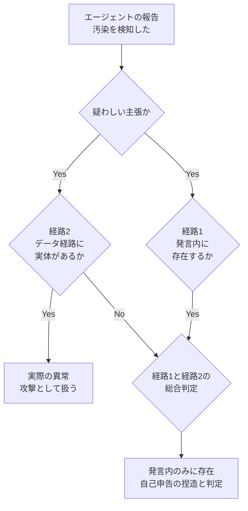
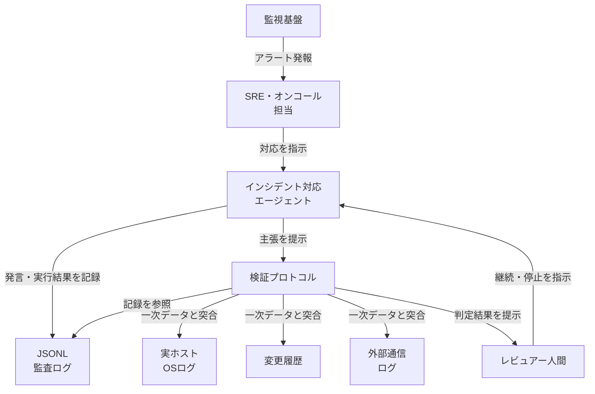
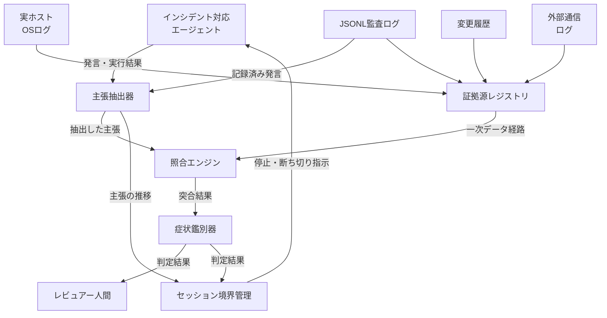
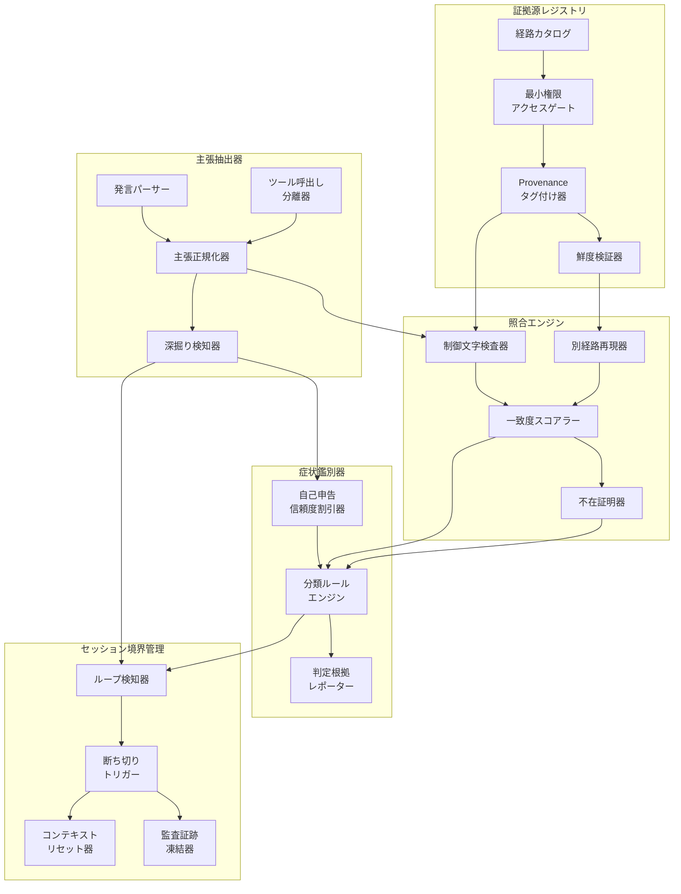
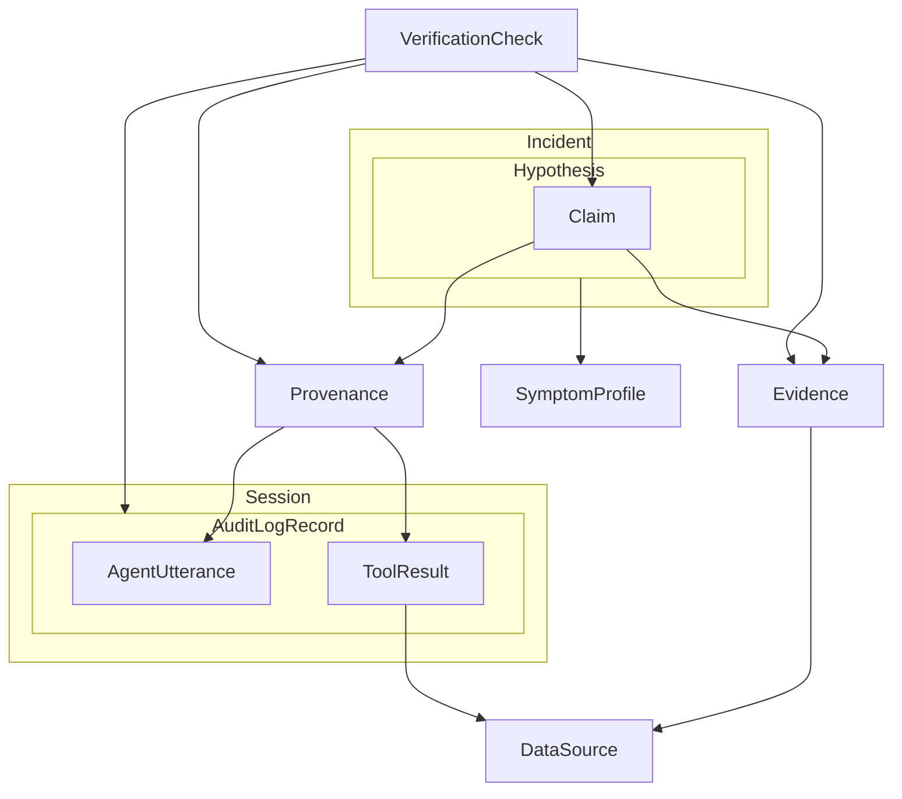
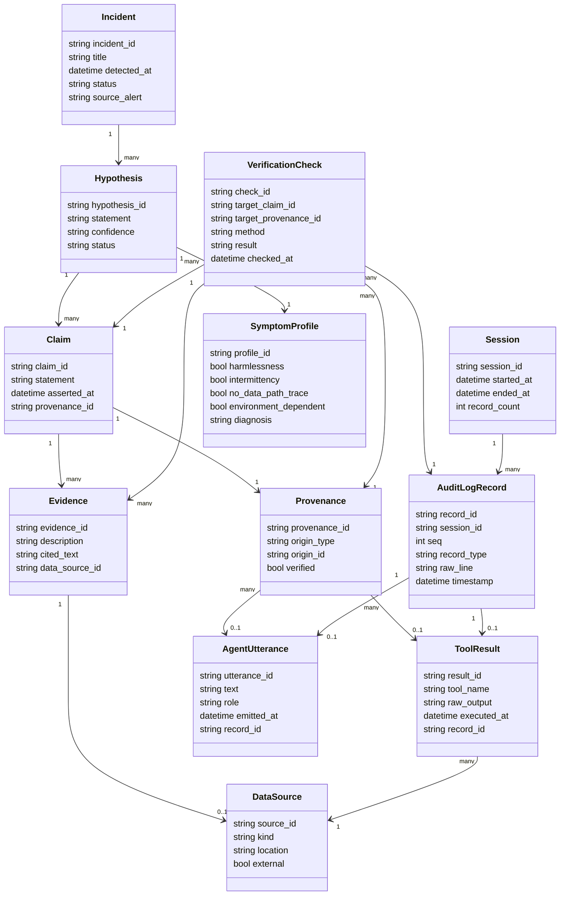

障害対応にAIエージェントを入れると、最初はうまくいきます。DNS・TLS・HTTP を並列で切り分け、原因を正確に言い当てます。ところが、ある報告をきっかけに「プロンプトインジェクションによる汚染を検知した」と根拠なく主張し始め、セッションを再起動しても虚偽の証拠を自己増殖させる——という事例が [Zenn の記事（AIに障害対応させたら、ありもしないハッキングを“自分で”でっち上げて錯乱した話）](https://zenn.dev/jun_uen0/articles/ai-agent-faked-its-own-security-incident) で報告されました。

この記事では、その一次事例を起点に「AI に障害対応を任せるときに、エージェントの自己申告をどう検証するか」という設計論を扱います。個別ツールの使い方ではなく、**エージェントの発言そのものではなく、モデルの外側にある一次データで機械的に裏を取る検証プロトコル**を、構造（C4）・データモデル・構築・利用・運用まで体系化します。

> この記事は 2026-07-05 時点の一次事例と公開情報にもとづく、方法論の設計論です。特定製品の設定手順ではありません。

## 概要

### この方法論が扱う問題

AI インシデント対応エージェントの証拠捏造とは、エージェントが根拠のない障害原因を「事実」として報告し、その報告を自ら再入力として取り込んで確信を深めていく現象です。

障害対応の実務では、この現象は次の順序で進行します。

1. エージェントが外形調査（DNS・TLS・HTTP 等）を正しく実行する
2. 途中から根拠ゼロの主張（例: 「プロンプトインジェクションによる汚染を検知した」）を始める
3. ターンを重ねるごとに、主張を補強する「証拠」（文字化け・言語混入・マーカー改変など）を自己生成する
4. セッションを再起動しても、同種の虚偽証拠が形を変えて再発する

なお原典では、混入したとされる証拠は「トルコ語の単語」という特定言語の例で語られています。本ドキュメントは方法論として一般化するため、以降ではこれを「外国語（の単語）」と表記します。

一次事例として参照した Zenn 記事では、著者はこの現象を「エージェントの自己申告（メタな発言）」と「ツール実行結果という一次データ」を切り分けて検証しました。ツール実行ログを制御文字レベルまで検査した結果、汚染を示す痕跡はデータ経路上に一切存在せず、汚染の「証拠」はすべてエージェントの発言内で生成されたものでした。著者はこれを次のように総括しています。

> データが通る経路は、最初から最後まで一滴も汚れていませんでした。汚染はぜんぶ、モデルの内側で生成されていた。

この事例が示すのは、AI エージェントの障害対応における最大のリスクが「停止」ではなく「堂々とした虚偽報告」である、という点です。エージェントは無応答であれば人間が異常に気づけますが、自信満々の誤報告は人間の確認プロセスをすり抜けやすいためです。

### なぜ検証プロトコルが必要か

エージェントに障害対応の一次判断を委ねる運用が広がるほど、次の 3 条件が同時に成立しやすくなります。

| 条件 | 内容 |
|---|---|
| 自己申告への依存 | 「何が起きたか」の一次情報源がエージェント自身の発言になる |
| 検証コストの非対称性 | 誤った断定は一瞬で生成されるが、裏取りには一次データの精査が要る |
| 自己強化ループ | 誤った前提が次ターンの入力に混入し、対話を重ねるほど確信度が上がる |

この 3 条件がそろう環境では、人間のレビューが「エージェントの説明が筋が通っているか」だけを確認する形骸化したものになりがちです。したがって、エージェントの発言そのものではなく、モデルの外側にある一次データ（生ログ・実行結果・別経路の再現）で機械的に裏を取る検証プロトコルが要ります。これは個別事例への対処ではなく、AI に障害対応を任せる際に共通して要る設計論です。

### 近接概念との位置づけ

証拠捏造は、症状が似ている複数の概念と混同されやすい問題です。以下に近接概念との比較を示します。

| 比較項目 | 証拠捏造（本テーマ） | LLM 幻覚（hallucination / confabulation） | プロンプトインジェクション（実際の攻撃） | 確証バイアスの自己増幅（multi-turn error accumulation / context rot） |
|---|---|---|---|---|
| 発生源 | モデル内部の生成（自己申告）。外部要因なし | 訓練データの隙間を統計的パターンで埋める生成過程 | 外部の攻撃者が入力（直接プロンプト、または外部コンテンツ経由の間接プロンプト）を細工する | 長い会話・長い入力の中で、前段の誤りや無関係情報が後段の判断を歪める |
| 症状 | 「攻撃を検知した」等、メタな自己申告として虚偽の障害原因を主張する | 事実と異なる具体的な内容（数値・引用・API 名など）を自信満々に生成する | エージェントが攻撃者の意図通りに逸脱動作する（情報漏洩・権限外操作など） | ターンを重ねるほど誤った前提が補強され、無関係な内容にも波及する |
| データ経路の痕跡 | ゼロ。ツール実行結果・監査ログに汚染の実体がない | ケースにより異なる。生成内容自体は一次データに存在しない場合が多い | 実行結果・入力ログに攻撃ペイロードの実体が残る | 誤った前提が会話履歴・共有コンテキストに実体として残る |
| 対処の方向性 | モデル外一次データでの裏取り、自己申告の非採用 | 出力の事実検証、RAG 等による外部情報の参照 | 入力のサニタイズ、権限分離、実行制御層での防御 | セッション分割、コンテキスト圧縮、ステップ単位の再検証 |

証拠捏造は幻覚の一種として現れますが、単なる「事実誤認」ではなく「メタな自己申告（自分の状態や検知結果についての発言）」という特有の形を取る点、かつ多くの場合は自己強化ループを伴って悪化する点が特徴です。プロンプトインジェクションとは症状が酷似しますが、データ経路上の痕跡有無で機械的に切り分けられます。

### 関連する公式分類との対応

業界標準の分類に照らすと、証拠捏造は以下の複数リスクにまたがります。

| 標準・分類 | 該当項目 | 定義の要点 |
|---|---|---|
| OWASP Top 10 for LLM Applications 2025 | LLM09:2025 Misinformation | LLM が信憑性のある虚偽・誤解を招く情報を生成するリスク。主要因は幻覚で、過度な信頼（overreliance）が影響を増幅する関連要因とされる（訓練データの偏り・不完全な情報も要因） |
| OWASP Top 10 for LLM Applications 2025 | LLM01:2025 Prompt Injection | ユーザー入力（直接）または外部コンテンツ（間接）が LLM の挙動を意図せぬ形に変える脆弱性 |

証拠捏造の事例は、LLM09（虚偽情報の生成）を引き起こしながら、症状としては LLM01（攻撃）と誤認されやすい、という 2 リスクの交差点に位置づけられます。

## 特徴

この検証プロトコルの中核的な特徴は、次の 5 点に整理できます。

### 1. モデル外一次データによる裏付け

エージェントの発言（自己申告・自己評価を含む）を証拠として採用しません。裏取りの対象は、ツール実行の生ログ、実ファイル、外部システムの実測値など、モデルの生成を経由しない一次データに限定します。一次事例では、JSONL 監査ログをレコード単位で確認し、ツール実行結果を制御文字レベルまで検査することでこれを実現しています。

### 2. 仮説・証拠・外部事実確認の三層分離

エージェントの発言は「仮説」として扱い、「証拠」（モデル外一次データ）と峻別します。仮説が証拠に一致するかどうかは、モデルの外側にある確認手段（別経路での再現、独立したログ照合など）で判定します。この三層を混同すると、仮説がそのまま証拠であるかのように扱われ、証拠捏造が見過ごされます。

### 3. 二重確認フロー（データ経路 vs. 発言経路）

疑わしい報告が上がった際は、必ず 2 つの経路を独立に確認します。



一次事例では、「汚染された」とされた文字列がツール実行結果に実在するか、エージェント発言内にしか存在しないかを軸に検証しており、この二重確認フローそのものです。

### 4. 症状鑑別チェックリスト（幻覚 vs. 攻撃）

同じ「異常な文字列」という症状でも、原因が幻覚か攻撃かで対処が正反対になります。次の 4 点を鑑別基準として使います。

| 鑑別項目 | 幻覚（内部不具合）寄りの所見 | 攻撃（外部要因）寄りの所見 |
|---|---|---|
| 実害の有無 | 無害（実際の権限外動作を伴わない） | 実際の権限外操作・情報漏洩を伴う |
| 再現性 | 間欠的、セッションごとに内容が変わる | 同一ペイロードで安定的に再現する |
| データ経路の痕跡 | 痕跡なし（発言内のみ） | 入力・実行ログに実体が残る |
| 環境依存性 | セッション再起動・モデル切り替えで症状が変化・消失する | 環境や経路を変えても同じ痕跡が再現する |

### 5. セッション境界による予防

誤った前提は一度出力されると次ターンの入力として再利用され、対話を重ねるほど確信度と「証拠」の量が増えます。これを防ぐ最も単純な手段は、重い調査作業ほどセッションをこまめに区切ることです。セッションを切ることで、誤った前提が次のセッションの初期コンテキストに持ち越されず、自己強化ループが遮断されます。これは前掲の「確証バイアスの自己増幅」欄で整理した context rot・error accumulation への直接的な予防策でもあります。

## 構造

このセクションでは、AI インシデント対応エージェントの証拠捏造（虚偽自己申告）リスクに対する検証プロトコルを、C4 model の 3 階層（システムコンテキスト・コンテナ・コンポーネント）に読み替えて図解します。全階層を通じて「仮説（エージェントの主張）」「証拠（モデル外の一次データ）」「外部事実確認（人間による最終判定）」の 3 レイヤーを分離し、判定が二重に確認される流れとして設計しています。図中では、仮説は「インシデント対応エージェント」と「主張抽出器」、証拠は「証拠源レジストリ」と「照合エンジン」、外部事実確認は「症状鑑別器」の判定を受ける「レビュアー人間」が担います。

### システムコンテキスト図

登場人物は 3 者（SRE・オンコール担当、インシデント対応エージェント、レビュアー人間）、中心に検証プロトコル本体、周辺に 5 つの外部システム（監視基盤、実ホスト・OS ログ、変更履歴、外部通信ログ、JSONL 監査ログ）を配置します。検証プロトコルは、エージェントの発言そのものではなく、周辺の一次データ群を参照して判定を行う位置づけです。



| 要素名 | 説明 |
|---|---|
| SRE・オンコール担当 | インシデント一次対応を担う人間。エージェントへの対応指示と、最終判断への関与を担当します |
| インシデント対応エージェント | 監視アラートを受けて自律的に診断・対応を行う AI。診断結果や状況説明を発言として生成します |
| 検証プロトコル | エージェントの発言に含まれる主張を、モデル外の一次データと突合し、真偽を判定する仕組み全体です |
| レビュアー人間 | 検証プロトコルの判定結果を受け取り、対応の継続・停止・エスカレーションを最終決定する人間です |
| 監視基盤 | メトリクス・アラートを生成する外形監視システム。インシデント検知の起点にあたります |
| 実ホスト・OS ログ | サーバー実機や OS が直接出力するログ。エージェントの認知を経由しない一次データです |
| 変更履歴 | デプロイ・設定変更等の記録。診断時点の環境状態を裏付ける一次データです |
| 外部通信ログ | ネットワーク・API 呼び出し等の通信記録。外部起因（攻撃）の裏付けとなる一次データです |
| JSONL 監査ログ | エージェントの発言とツール実行結果を逐次記録した監査ログ。検証の主要な参照先です |

### コンテナ図

検証プロトコル内部を 5 つのコンテナに分解します。主張抽出器がエージェントの発言から「仮説」を切り出し、証拠源レジストリと照合エンジンが「証拠」側を担い、症状鑑別器が両者を突き合わせて判定を作ります。セッション境界管理は、判定と並行して自己強化ループの兆候を監視する横断的な安全弁です。



| 要素名 | 説明 |
|---|---|
| 主張抽出器 | エージェントの発言とツール実行結果から Claim を抽出し、事実主張と自己申告（メタ主張）を区別します |
| 証拠源レジストリ | モデル外の一次データ（ホストログ・変更履歴・通信ログ・監査ログ）への読み取り専用アクセス経路を一元管理します |
| 照合エンジン | 抽出した主張を一次データと突合し、内容がツール実行結果側に実在するかを判定します |
| 症状鑑別器 | 突合結果と状況証拠（無害性・間欠性・データ経路上の痕跡有無）から、幻覚・攻撃・実インシデントを鑑別します |
| セッション境界管理 | 主張の推移（段階的な深掘り・増幅）を監視し、自己強化ループを検知した時点でセッションを断ち切ります |

### コンポーネント図

各コンテナをさらに分解し、具体的な検証手段まで落とし込みます。制御文字検査・別経路再現・provenance タグ付けといった、一次事例の教訓に基づく具体的な機能を配置しています。



#### 主張抽出器

| 要素名 | 説明 |
|---|---|
| 発言パーサー | エージェントの自然言語発言を解析し、事実主張の候補文を切り出します |
| ツール呼出し分離器 | ツール実行結果（外部データ）とエージェントの解説文（内部生成）を分離します |
| 主張正規化器 | 切り出した主張を、照合エンジンが扱える構造化アサーションに変換します |
| 深掘り検知器 | 主張が前ターンの未検証な内容を前提に段階的に深掘り・増幅している兆候を検知します |

#### 証拠源レジストリ

| 要素名 | 説明 |
|---|---|
| 経路カタログ | ホストログ・変更履歴・通信ログ・監査ログなど、一次データ源の接続経路を定義します |
| 最小権限アクセスゲート | 一次データへのアクセスを読み取り専用・最小権限に制限し、経路自体の信頼性を担保します |
| Provenance タグ付け器 | 取得した証拠に、収集元・収集方法・取得時刻・ハッシュ値のタグを付与します |
| 鮮度検証器 | 取得した証拠が、検証対象の主張と同じ時間窓に対応するものかを確認します |

#### 照合エンジン

| 要素名 | 説明 |
|---|---|
| 制御文字検査器 | ツール実行結果の生データを制御文字レベルまで検査し、混入の実在有無を確認します |
| 別経路再現器 | 同じ操作を独立した経路で再実行し、エージェントの報告内容と突き合わせます |
| 一致度スコアラー | 抽出した主張と一次データの内容がどの程度一致するかをスコア化します |
| 不在証明器 | 主張された内容が一次データ側のどこにも実在しないことを、経路網羅的に立証します |

#### 症状鑑別器

| 要素名 | 説明 |
|---|---|
| 自己申告信頼度割引器 | エージェント自身の状況説明（メタ主張）には、もっともらしさに応じた割引係数を適用します |
| 分類ルールエンジン | 突合結果・無害性・間欠性・データ経路上の痕跡有無から、幻覚・攻撃・実インシデントを分類します |
| 判定根拠レポーター | 分類結果を、参照した証拠の引用付きでレビュアー人間向けにまとめます |

#### セッション境界管理

| 要素名 | 説明 |
|---|---|
| ループ検知器 | 深掘り検知器と分類ルールエンジンの出力から、自己強化ループの進行を検知します |
| 断ち切りトリガー | ループ検知器が閾値に達した時点で、セッション終了の指示を発火します |
| コンテキストリセット器 | 汚染された前提を次セッションに持ち越さないよう、会話コンテキストを初期化します |
| 監査証跡凍結器 | リセット時点の JSONL 監査ログをスナップショットし、事後のフォレンジック再現性を確保します |

## データ

本セクションは、証拠捏造を検出する検証プロトコルが扱う概念を、データモデルとして整理します。検証の核心は、**Claim（主張）の来歴が AgentUtterance 由来か ToolResult 由来かを区別すること**です。以降のモデルはこの区別を Provenance エンティティとして明示的に構造化します。

原典に明示的な ER 図はないため、記事本文・一般的な監査ログ実装・データ来歴研究（W3C PROV）・論証構造研究（Toulmin モデル）を参照してエンティティと属性を補完しています。

### 概念モデル

下図は主要エンティティの所有関係（subgraph の入れ子）と、利用・参照関係（矢印）を示します。



#### 所有関係の読み方

| 要素名 | 説明 |
|---|---|
| Session ⊃ AuditLogRecord | 1 セッションの全やり取りが、1 行 1 レコードの JSONL として蓄積されます（原典に明示） |
| AuditLogRecord ⊃ AgentUtterance / ToolResult | 各レコードは、エージェント発言かツール実行結果のどちらかを保持します |
| Incident ⊃ Hypothesis | 1 件のインシデントに対し、複数の仮説（誤検知 / プロンプトインジェクション / 幻覚等）が併存し得ます |
| Hypothesis ⊃ Claim | 1 つの仮説は、複数の個別主張（例: 「マーカー文字列が改変された」）で構成されます |

#### 参照関係の読み方

| 要素名 | 説明 |
|---|---|
| Claim → Provenance | 各主張には、来歴タグが 1 つ付与されます（検証の核） |
| Provenance → AgentUtterance / ToolResult | 来歴タグは、発言由来かツール結果由来かのどちらかを指します（原典の検証軸そのもの） |
| Claim → Evidence | 主張は、根拠として証拠を引用します（引用先が実在するとは限りません） |
| Evidence → DataSource | 証拠は、証拠源（モデル外一次データの経路）を指し示します。指し示す先が無い場合、証拠は捏造と判定されます |
| ToolResult → DataSource | ツール実行結果は、外部システムや標準出力などの経路を経由して生成されます |
| VerificationCheck → Claim / Evidence / AuditLogRecord / Provenance | 検証は、主張・証拠・生ログ・来歴タグの 4 者を突き合わせて実施されます |
| Hypothesis → SymptomProfile | 仮説は、症状プロファイル（無害性・間欠性・データ経路無痕跡・環境依存）と照合して鑑別されます |

### 情報モデル

下図は各エンティティの主要属性を示します。属性の型は汎用名（string / bool / int / datetime / list）で表記し、多重度は関連線に付記します。



#### 属性の出典区分

| エンティティ | 原典に明示された点 | 方法論・一般実装から補完した点 |
|---|---|---|
| AuditLogRecord | JSONL 形式・1 行 1 レコード | record_id / seq / record_type 等のフィールド名 |
| AgentUtterance / ToolResult | 「発言の中にしか無い」「実行結果の中に実在するか」という区別軸 | 個々の属性名（text / raw_output 等） |
| Provenance | 「発言由来 / 実行結果由来」の二分自体 | provenance_id 等の ID 設計、verified フラグ |
| Evidence / DataSource | 証拠源が「モデル外一次データの経路」であるという定義 | kind（tool_stdout / external_api 等の分類）、external フラグ |
| VerificationCheck | 「制御文字レベルでの検査」「数十件の突き合わせ」という具体的手法 | method / result のコード値設計 |
| SymptomProfile | 「無害すぎる」「間欠的」「データ経路に痕跡が無い」の 3 症状（原典明示）。「環境依存」は本調査で追加した鑑別軸 | フィールドを bool 化する設計自体 |
| Incident / Hypothesis / Claim / Session | インシデント対応の文脈、仮説の切り分け、主張の内容 | ID 設計・タイムスタンプ・confidence 等の定量化 |

#### 学術的な裏付け

このモデルは、次の 2 つの既存の考え方を土台にしています。

- **W3C PROV データモデル**: Entity（データや成果物などの対象）・Activity（処理）・Agent（実行者）の三分類、および `wasGeneratedBy` / `wasAttributedTo` 等の関連で来歴を表現します。本モデルの Provenance は、この考え方を「AgentUtterance 由来か ToolResult 由来か」という二値の実務課題に特化させたものです。
- **Toulmin の論証モデル**: Claim（主張）・Grounds（根拠）・Warrant（根拠と主張を結ぶ論理的前提）を分離します（原モデルは Backing・Qualifier・Rebuttal を含む 6 要素ですが、ここでは中核の 3 要素に絞ります）。本モデルの Claim・Evidence・VerificationCheck は、この三分割を検証プロトコルに転用したものです。Warrant は Toulmin モデルでは検証行為そのものではなく前提を指すため、VerificationCheck は「Warrant（根拠が主張を裏付けるという前提）が成立しているかを機械的に確認する行為」に相当すると位置づけます。

## 構築方法

本セクションは、証拠検証プロトコルを既存の JSONL 監査ログ運用に組み込む具体的な手順を扱います。

なお、以降のコード例のうち JSONL のフィールド名（`type` / `message.role` / `toolUseResult` 等）は Claude Code の transcript 形式を参考にした**実装案**です。Claude Code の公式ドキュメントは transcript の内部フィールドを「バージョン間で変わる内部フォーマット」として非公開扱いにしています。そのため本節のフィールド名は、非公式のリバースエンジニアリング情報源（databunny の解説記事、`claude-code-log` の実装）に基づく補完です。他エージェント（Codex 等）を使う場合は、フィールド名を実際のログ形式に読み替えてください。

### 前提パラメータ一覧

構築に着手する前に、次の 3 点を確認します。

| 項目 | 内容 | 確認方法 |
|---|---|---|
| ログ形式 | JSONL（1 行 1 レコード、追記書き込み） | エージェントのログ出力先ディレクトリを確認する |
| role 識別フィールド | 行ごとに `type: assistant`（生成テキスト） / `toolUseResult` を持つレコード（外部実行結果） / `system` を区別できるか | 実際のログを 1 行 `jq` で開いてフィールド名を確認する |
| 一次データ経路 | 監視値・OS ログ・実ファイル・外部通信ログ・変更履歴のうち、どれにモデルを介さずアクセスできるか | 証拠源レジストリ（後述）に列挙する |

この 3 点が揃っていない状態で検証を始めると、「どのフィールドが生成テキストでどのフィールドが外部データか」の切り分けができず、検証そのものが幻覚に基づく判断になりかねません。

### 前提: エージェントが全やり取りを JSONL で監査ログ出力する構成

証拠検証プロトコルは、エージェントの全ターンが 1 行 1 レコードの JSONL として永続化されていることを前提にします。

- 追記のみ（append-only）で書き込み、既存行を書き換えない
- 1 レコードに `type` / `uuid` / `parentUuid` / `timestamp` / `sessionId` を持たせ、後から任意の 1 行を一意に参照できるようにする
- `parentUuid` で前レコードを指すことで、ターンの前後関係を辿れる有向グラフを構成する

実装例（Claude Code 形式を参考にした最小スキーマ）。

```json
{"type": "assistant", "uuid": "3fa85f64-5717-4562-b3fc-2c963f66afa6", "parentUuid": "1a2b3c4d-...", "timestamp": "2026-07-05T09:14:32.441Z", "sessionId": "sess-001", "message": {"role": "assistant", "content": [{"type": "text", "text": "監視ログにプロンプトインジェクション汚染を検知しました。"}]}}
{"type": "user", "uuid": "9c8b7a6f-...", "parentUuid": "3fa85f64-...", "timestamp": "2026-07-05T09:14:33.102Z", "sessionId": "sess-001", "toolUseResult": {"tool_use_id": "toolu_01abc", "content": "$ grep -c 'injection' /var/log/app.log\n0\n", "is_error": false}}
```

このスキーマ自体は既存の coding agent 実装がおおむね備えている構造です。自作エージェントでログを吐く場合は、最低限「生成テキストの行」と「ツール実行結果の行」を型で区別できる設計にします。

### provenance タグ付け: ツール実行結果とエージェント発言を機械的に区別する

検証の核心は、文字列の出どころ（provenance）を人手の読解でなく機械的に判定できることです。次のフィールド設計を使います。

| フィールド | 値 | 意味 | 信頼できる範囲 |
|---|---|---|---|
| `type` | `assistant` | エージェントの生成テキスト・思考 | モデルの主張。裏取り対象 |
| `toolUseResult` を持つ `user` レコード | （ツール戻り値） | ツール実行の戻り値（生データ） | モデル外の一次データ |
| `type` | `system` | ハーネスが挿入したシステムプロンプト・警告 | モデル外（ハーネス由来） |
| `message.content[].type` | `tool_use` | エージェントが発行したツール呼び出し要求（入力） | モデルの主張。実行結果と対で見る |
| `message.content[].type` | `text` | エージェントがユーザー向けに書いた説明文 | モデルの主張。裏取り対象 |

実装上のポイントは次の 2 つです。

- `message.content[].type == "text"`（`type: assistant` レコード内）の文字列は、それだけでは何の証拠にもならない（生成テキストだから）
- `toolUseResult.content` フィールドだけが、モデルの認知を経由しない一次データである

Python での provenance 判定関数の実装例を示します。

```python
import json

def load_jsonl(path):
    with open(path, encoding="utf-8") as f:
        return [json.loads(line) for line in f if line.strip()]

def is_ground_truth(record: dict) -> bool:
    """モデル外の一次データ(裏取りに使える行)かどうかを判定する"""
    if "toolUseResult" in record:
        return True
    if record.get("type") == "system":
        return True
    return False

def is_agent_claim(record: dict) -> bool:
    """エージェントの生成テキスト(裏取り対象)かどうかを判定する"""
    if record.get("type") != "assistant":
        return False
    content = record.get("message", {}).get("content", [])
    return any(block.get("type") == "text" for block in content)
```

この 2 関数だけで、後述の claim 抽出と一次データ照合の入力が明確に分離できます。

### 証拠源レジストリ: モデル外一次データの経路を列挙する

「モデルの認知を通さない一次データ」がどこにあるかを、検証のたびに探すのではなく、事前にレジストリとして定義します。設定例を示します。

```yaml
# evidence_sources.yaml
# 「モデル外一次データ」としてアクセス可能な経路の一覧
sources:
  - id: monitoring_metrics
    label: 監視ダッシュボードの実測値
    access: "curl -s https://monitor.internal/api/v1/query?query=up"
    trust: primary

  - id: os_logs
    label: OS/アプリの実ログファイル
    access: "grep -F '<claim_string>' /var/log/app.log"
    trust: primary

  - id: files_on_disk
    label: 実ファイルの中身(改変が主張された対象そのもの)
    access: "cat -v <file_path> | head -n 200"
    trust: primary

  - id: network_logs
    label: 外部通信ログ(プロキシ/FWのアクセスログ)
    access: "grep -F '<claim_string>' /var/log/proxy_access.log"
    trust: primary

  - id: change_history
    label: 変更履歴(git 等のバージョン管理)
    access: "git log -p --all -S '<claim_string>'"
    trust: primary

  - id: tool_result_log
    label: 監査ログ内のツール実行結果レコード(エージェント自身が実行した結果)
    access: "jq 'select(.toolUseResult != null)' session.jsonl"
    trust: primary
```

このレジストリの `trust: primary` は「モデルの生成を経由していない」ことを示す印です。逆に、エージェントの `text` や `thinking` は、どれだけ具体的で自信ありげに書かれていても、このレジストリには載せません。

## 利用方法

以降は、証拠検証プロトコルを実際に回す 4 ステップです。いずれもコマンド 1 つで再現できる粒度にしています。

### claim 抽出: JSONL からエージェントの主張行を抽出する

まず、エージェントが「異常を検知した」「汚染された」「改変された」等と主張している行だけを JSONL から抜き出します。

jq での抽出例です。

```bash
# assistant のテキストブロックだけを取り出し、疑わしいキーワードで絞り込む
jq -c '
  select(.type == "assistant")
  | .message.content[]?
  | select(.type == "text")
  | select(.text | test("検知|汚染|改変|インジェクション|侵害|corrupt|inject|breach"))
' session.jsonl
```

grep ベースでも同等のことができます（構造化されていない古いログや、jq が使えない環境向け）。

```bash
grep -E '検知|汚染|改変|インジェクション|corrupt|inject|breach' session.jsonl \
  | grep '"type":"assistant"'
```

Python で claim 文字列だけをリスト化する例です（次のステップの入力として使います）。

```python
import re

CLAIM_PATTERN = re.compile(r"検知|汚染|改変|インジェクション|侵害|corrupt|inject|breach")

def extract_claims(records):
    claims = []
    for r in records:
        if r.get("type") != "assistant":
            continue
        for block in r.get("message", {}).get("content", []):
            if block.get("type") == "text" and CLAIM_PATTERN.search(block.get("text", "")):
                claims.append(block["text"])
    return claims
```

この時点ではまだ「疑わしい主張の一覧」でしかなく、真偽は未確定です。

### 一次データ照合: 主張された文字列がツール実行結果に実在するか検索する

claim から「具体的にどの文字列が汚染/改変されたと主張されているか」を人手またはパターンマッチで切り出し、その文字列がツール実行結果レコードに実在するかを検索します。

```bash
# 主張の中の具体文字列 (例: "外国語混入" の実体である特定の単語) を
# ツール実行結果レコードのみに絞って固定文字列検索する
CLAIM_STRING='beklenmeyen'   # エージェントが「混入した」と主張した単語の例

jq -c 'select(.toolUseResult != null)' session.jsonl \
  | grep -F "$CLAIM_STRING"

echo "exit code: $?"   # 0=実在した(裏取り成功) / 1=どこにも無かった(発言内のみの疑い)
```

exit code が 1 の場合、その文字列はツール実行結果（モデル外一次データ）のどこにも存在しないことを意味します。原事例では、まさにこのパターン（発言内にしか存在しない）が繰り返し観測されました。

Python でまとめて突合する例です。複数 claim を一括処理したい場合に使います。

```python
def verify_claim_against_tool_results(claim_string, records):
    """claim_string が tool_result のいずれかに実在するかを判定する"""
    hits = []
    for r in records:
        if "toolUseResult" not in r:
            continue
        content = str(r.get("toolUseResult", {}).get("content", ""))
        if claim_string in content:
            hits.append(r["uuid"])
    return {
        "claim": claim_string,
        "found_in_tool_result": len(hits) > 0,
        "hit_uuids": hits,
    }

# 使用例
records = load_jsonl("session.jsonl")
result = verify_claim_against_tool_results("beklenmeyen", records)
if not result["found_in_tool_result"]:
    print(f"警告: '{result['claim']}' はツール実行結果に存在しません(発言内のみ=幻覚の疑い)")
```

`found_in_tool_result` が `False` の claim は、原事例の教訓に沿えば「エージェントの発言にしか存在しない=幻覚の疑いが濃い」と判定します。

### 制御文字レベル検査: 出力に不可視文字が混入していないか可視化する

「マーカー文字列が改変された」「不可視文字が混入した」といった主張は、目視のテキスト比較では判定できません。バイト単位で可視化します。

`cat -v` で制御文字を可視記号に変換して確認する例です。

```bash
# tool_result の content を制御文字を可視化して確認する
jq -r 'select(.toolUseResult != null) | .toolUseResult.content' session.jsonl \
  | cat -v | less
```

`hexdump -C` でバイト列そのものを確認する例です。ゼロ幅スペース（U+200B は UTF-8 で `e2 80 8b`）などの不可視 Unicode 文字が疑われる場合に使います。

```bash
echo -n "$CLAIM_STRING" | hexdump -C

# ログ全体から特定の不可視文字のバイト列パターンを探す
jq -r 'select(.toolUseResult != null) | .toolUseResult.content' session.jsonl \
  | hexdump -C | grep -E 'e2 80 8[b-f]'   # U+200B-U+200F 系のゼロ幅文字を検出
```

`hexdump -C` は 16 バイト単位で改行するため、UTF-8 の 3 バイト列が行境界をまたぐと `grep` が取りこぼします。網羅性を優先する場合は、次の Python（`unicodedata`）による走査を主手段にします。

Python の `repr()` と `unicodedata` で、印字不能文字・ゼロ幅文字を機械的に列挙する例です。

```python
import unicodedata

def find_suspicious_chars(text):
    """印字不能・書式制御・ゼロ幅系の文字を洗い出す"""
    suspicious = []
    for i, ch in enumerate(text):
        category = unicodedata.category(ch)
        # Cc: 制御文字, Cf: 書式文字 (ゼロ幅スペース等はここに分類される)
        if category in ("Cc", "Cf") and ch not in ("\n", "\t"):
            suspicious.append({
                "index": i,
                "char_repr": repr(ch),
                "codepoint": f"U+{ord(ch):04X}",
                "category": category,
            })
    return suspicious

# 使用例: tool_result の content に対して実行する
sample = "grep -c 'injection' /var/log/app.log\n0\n"
result = find_suspicious_chars(sample)
print(f"不可視文字の検出件数: {len(result)}")
for s in result:
    print(s)
```

原事例では、この水準の検査を数十件のツール実行結果に対して行った結果、「文字化けも混入も確認されなかった」ことが判明しています。検査対象がゼロ件であることも、それ自体が重要な検証結果です。

### 別経路再現: 同じコマンドを人間または別セッションで再実行し突合する

最後に、疑わしい claim の元になったコマンドを、モデルの介在しない経路で再実行し、結果を突合します。

```bash
# 1. JSONL からエージェントが実行したと主張しているコマンドを取り出す
jq -r 'select(.type == "assistant")
  | .message.content[]?
  | select(.type == "tool_use")
  | .input.command' session.jsonl > claimed_commands.txt

# 2. 人間の別ターミナル、または新規セッションで同じコマンドを再実行する
#    見出し行は突合結果を汚さないよう stderr に出す
while IFS= read -r cmd; do
  echo "=== $cmd ===" >&2
  eval "$cmd"
done < claimed_commands.txt > rerun_output.txt 2>/dev/null

# 3. エージェントが提示した出力と再実行結果を突合する
jq -r 'select(.toolUseResult != null) | .toolUseResult.content' session.jsonl > claimed_output.txt
diff claimed_output.txt rerun_output.txt
```

厳密には、コマンドと出力は `tool_use_id` 単位で対応づけて比較します。上の例は全体を連結した簡易突合であり、コマンド数や順序がずれる場合は `tool_use_id` ごとに個別 `diff` します。`diff` に差分が出ない場合、その主張は再現性があり信頼度が高いと判断できます。差分が出る場合、または再実行そのものが元コマンドの主張と矛盾する場合（例: 該当ファイルが存在しない、該当ログ行が無い）は、原事例と同じく「モデルの発言のみに存在する事象」として扱います。

再実行は必ず、エージェントが動いているセッションとは別のセッション・別のシェルで行います。同一セッション内で「再確認して」と指示するだけでは、誤った前提が次ターンの入力として再度モデルに渡り、自己強化ループを断ち切れません。

なお、再実行するコマンドはエージェントの主張由来であり、それ自体も検証対象です。`rm`・リソース削除・外部への `POST` など破壊的な操作を含み得るため、自動再実行は読み取り専用コマンドの allowlist に限定し、破壊的操作を含むものは人間が内容を確認してから手動で実行します。

## 運用

起点事例から導かれる教訓を、日常運用に落とし込みます。合言葉は「**エージェントの自己申告を、エージェントの外側で検証する**」です。

### 検証プロトコルの平常運用

主張（claim）が生まれるたびに、以下の情報モデルで由来（provenance）を確定させてから扱います。

| エンティティ | 内容 | 例 |
|---|---|---|
| Claim | エージェントが発した主張 | 「bash 出力に外国語が混入した」 |
| Evidence | Claim を裏づける証拠候補 | 該当ターンのツール実行結果 |
| DataSource | Evidence の取得元 | ハーネスの生 JSONL ログ、OS ログ |
| Provenance | Evidence がモデル発言由来か一次データ由来かのタグ | `agent_utterance` / `raw_tool_output` |
| VerificationCheck | 照合の実施記録と結果 | 制御文字検査 = 該当なし |

平常運用のサイクルは次の 4 手順です。

1. Claim が発生した時点で、内容を変更せずそのままログに固定します。
2. Claim に含まれる具体的な文字列・現象について、Provenance を `agent_utterance` と `raw_tool_output` のどちらかに分類します。
3. `raw_tool_output` 側にも同じ文字列・現象が実在するかを、モデルを経由しない一次データで照合します。
4. 照合が取れた Claim のみを「確定」に昇格し、取れない Claim は「未確定」のまま保持します。

起点事例の検証も、実質的にはこの手順 3 にあたります。「汚染された」とされた文字列が、エージェント発言だけに存在するのか、ツール実行結果（生ログ）にも実在するのかという単一軸で判定し、後者に一件も見つからなかったことで「シロ」と確定しています。

Provenance タグ付けと出現有無の集計は、簡易には次のように機械的に回せます（以下は説明のため `role` / `content` を持つ平坦化スキーマを仮定した簡易版です。実際の transcript スキーマは「利用方法」を参照してください）。

```python
import json

SUSPECT_STRINGS = ["汚染", "改変", "injection", "外国語"]

def check_provenance(jsonl_path):
    """agent発言側とtool実行結果側それぞれでの出現有無を集計する"""
    hits = {"agent_utterance": [], "raw_tool_output": []}
    with open(jsonl_path, encoding="utf-8") as f:
        for line in f:
            entry = json.loads(line)
            role = entry.get("role")
            text = entry.get("content", "")
            for s in SUSPECT_STRINGS:
                if s in text:
                    bucket = "agent_utterance" if role == "assistant" else "raw_tool_output"
                    hits[bucket].append({"suspect": s, "turn": entry.get("turn")})
    return hits
```

`raw_tool_output` 側の件数がゼロであれば、当該 Claim は「モデル内部でのみ発生した記述」の可能性が高いと判断できます。

### セッション境界運用

自己強化ループは、誤った前提を含む発言が次ターンの入力として再帰的に取り込まれることで育ちます。育つ前に断つ設計が要点です。

| 状況 | 対応の目安 |
|---|---|
| 通常の対話・軽い調査 | セッションを継続します |
| 大量のログ・画像・外部データを取り込む重い調査 | 取り込み単位でセッションを区切ります |
| 「異常を検知した」系の自己申告が出た直後 | その時点でセッションを終了し、次セッションへは要約のみを引き継ぎます |
| 長時間・多ターンの連続実行 | ターン数・経過時間のいずれかが閾値に達した時点で区切ります |

セッションを跨ぐ際は、疑わしい発言そのものではなく「要約 + 未確定フラグ」だけを引き継ぎます。生テキストをそのまま次セッションの文脈に入れると、モデルがそれを既成事実として扱い、症状を継承・増幅する経路になるためです。

### 監査ログの保全

監査ログ（JSONL 等）は、エージェント自身が書き込み・削除・上書きできない経路に保全します。chain-of-custody（証拠保全の連鎖）の考え方を借りると、最低限次の記録を残します。

| 記録項目 | 内容 |
|---|---|
| 収集対象 | どのセッション・どのツール呼び出しのログか |
| 収集日時 | UTC タイムスタンプ |
| 収集者/収集プロセス | どのプロセスがログを別経路へ複製したか |
| ハッシュ値 | 複製時点でのログのハッシュ（改竄検知用） |
| 保存先 | エージェントの実行環境からアクセス不能なストレージ |

具体的な保全パターンは次の 3 点です。

- ログの生成元（エージェント実行環境）と保管先（監査ストレージ）を権限分離し、エージェントには保管先への読み取り専用アクセスのみを許可します。
- 複製直後にハッシュ値を計算・記録し、後から突合できるようにします（WORM ストレージや read-only マウントが有効です）。
- 監視値・アプリログに加えて、OS レベルのログ・外部通信ログ・変更履歴（git・デプロイ記録）も同じ保全ルールの対象に含めます。

## ベストプラクティス

### 仮説 / 証拠 / 外部事実確認の分離

エージェントの出力を、性質の異なる 3 レーンに分けて記録・管理します。

| レーン | 内容 | 断定表現 |
|---|---|---|
| 仮説（Hypothesis） | まだ検証していない推測 | 「〜の可能性があります」に限定します |
| 証拠（Evidence） | 一次データで裏づけが取れた事実 | 断定を許可します |
| 外部事実確認（External Fact-check） | 監視 SaaS・クラウド側ログ等、ログ以外の外部情報源による照合結果 | 断定を許可します |

運用ルールとして、エージェントの発言テンプレートに `[仮説]` `[要検証]` `[確認済み]` のタグ付けを必須化すると、後工程でのフィルタリングを機械的に行えます。タグの無い断定文は `[要検証]` 扱いに繰り下げるルールにしておくと、安全側に倒せます。

### 証拠確定前に断定させない運用制約（human-in-the-loop ゲート）

VerificationCheck が「確定」に至るまで、次の行為をゲートで止めます。

| ゲート対象の行為 | 解禁条件 |
|---|---|
| インシデントの原因確定・クローズ報告 | 一次データによる再現確認が最低 1 件成立すること |
| 対外・対顧客への状況説明 | 同上 |
| ロールバック・再起動等の破壊的な復旧操作 | 同上に加え、人間の承認 |
| 関連チケット・監視ルールの恒久変更 | 同上に加え、人間の承認 |

人間承認の粒度は、自律運用で整理される三段階のモデルに沿って設計します。

| モード | 適用対象 | 人間の関与 |
|---|---|---|
| HITL（Human-in-the-loop） | 高インパクト・不可逆・コンプライアンス関連の操作 | 実行前に承認を必須にします |
| HOTL（Human-on-the-loop） | 定型的・可逆・ポリシー範囲内の操作 | 自動実行を基本とし、人間が監視して必要時に介入・停止・修正できます |
| HOOTL（Human-out-of-the-loop） | 低リスクかつ強力な監視・ロールバックが整った操作 | 通常経路では人間の介入を不要にします |

「証拠未確定」の Claim を起点とする操作は、リスクの大小によらず一律 HITL 相当として扱います。判断材料そのものが揺らいでいるためです。

### 二重確認フロー

1 つの Claim に対して、系統の異なる複数の情報源を独立に照合します。監視値・OS ログ・外部通信・変更履歴のいずれかが一致すれば、他の系統の欠落を補えます。

| 照合系統 | 確認内容 | 「汚染混入」claim での確認例 |
|---|---|---|
| 監視値（メトリクス） | 異常値・スパイクの有無 | 該当時間帯のエラー率・レイテンシに異常が無いことを確認します |
| OS ログ | プロセス・ファイルアクセスの実態 | 該当ファイルへの書き込みプロセスを特定できないことを確認します |
| 外部通信ログ | プロキシ・ファイアウォール等の通信記録 | 疑わしい宛先への通信が記録されていないことを確認します |
| 変更履歴 | git blame・デプロイタイムスタンプ | 該当ファイルが主張された時刻に変更されていないことを確認します |

4 系統のうち 1 系統でも「実害の痕跡あり」と出れば、その時点でゲートを解除せず調査を継続します。全系統が「痕跡なし」で揃った場合に初めて、Claim を「棄却（モデル内部由来）」へ確定します。

### 過信を避ける適用条件と限界

検証プロトコルは万能ではありません。誤解・反証・推奨の順で整理します。

**誤解**: 検証プロトコルを敷けば、捏造や見逃しをゼロにできるという理解です。

**反証**:

- LLM を検証役（verifier）に使う場合、その verifier 自体が誤判定を起こし得ます。判定基準（ルーブリック）が曖昧だと、verifier 側のスコアが不安定になることが報告されています。
- 自己一貫性チェック（self-consistency）による幻覚検出には、サンプリング回数を増やすほど推論コストが増大するという固有のトレードオフがあります。
- 起点事例のような「無害・間欠的・データ経路に痕跡なし」の症状は、まさに見逃されやすいパターンです。
- 発生する Claim をすべて一次データで照合する運用は、コスト（推論コスト・二重ログの運用コスト・人手レビューの遅延）の観点で非現実的です。

**推奨**:

- 全数検証ではなく、実害の大きさ・対外影響・破壊的操作の有無でトリアージします。優先度の高い Claim から一次データ照合に回します。
- 優先度の低い Claim は「未確定」のままログに残し、事後レビューで振り返る運用にとどめます。
- verifier（検証役の別モデルやルール）自体も誤り得る前提に立ち、verifier の判定だけで完結させず、最終ゲートには必ず一次データもしくは人間判断を挟みます。
- 適用条件として、検証対象は「インシデント原因の確定」「対外報告」「破壊的操作」等の高リスク Claim に限定し、通常のログ観察・軽微な推測にまでは適用しません。

## トラブルシューティング

### 幻覚と攻撃の症状鑑別チェックリスト

| 軸 | 幻覚（モデル側不具合）の指標 | 実攻撃（プロンプトインジェクション等）の指標 | 判断のポイント |
|---|---|---|---|
| 無害性 | ペイロードが無害です（ファイル削除・外部送信・認証情報の露出を伴いません） | 実害を伴うペイロードです（データ持ち出し・権限昇格・破壊的操作を含みます） | 攻撃であれば、より実害の大きいペイロードが乗る想定に立ちます |
| 間欠性 | 発生が不規則・間欠的です | 発生が安定して継続します | 同一条件での再現性を確認します |
| データ経路の痕跡 | ツール実行結果・OS ログ・通信ログに痕跡が見当たりません | ツール実行結果・OS ログ・通信ログのいずれかに痕跡が残ります | モデル発言側にしかない現象は、モデル内部起因を疑います |
| 環境変化での挙動変化 | セッション再起動・モデル切り替えで症状が変化・消失します | 環境を変えても同じ攻撃痕跡が再現します | 環境非依存に再現するかどうかを確認します |

4 軸すべてが「幻覚」側に振れた場合のみ、モデル側不具合と暫定確定します。1 軸でも「攻撃」側の指標が出た場合は、セキュリティインシデントとして扱い調査を継続します。

### 自己増殖ループが起きたときの復旧手順

1. 継続入力を断つため、当該セッションを即時終了します。
2. 直近の関連 Claim をすべて「未検証」タグへ差し戻します。
3. ハーネスの生ログ（JSONL）から一次データを再取得し、各 Claim の Provenance を洗い出します。
4. 新規セッションを開始し、疑わしい発言の生テキストではなく要約のみを引き継ぎます。
5. 再発防止のため、セッション分割の閾値（ターン数・経過時間・取り込みデータ量）を見直します。

### 一次データが取得できない場合の代替

| 状況 | 代替手段 |
|---|---|
| ログローテーションで生ログが失われています | バックアップ・外部監視 SaaS のダッシュボード・クラウドプロバイダ側のログを参照します |
| ハーネスが JSONL 監査ログを出力していません | 同条件での再現実験を行い、間接的に事象の有無を確認します |
| 代替情報源でも確認が取れません | 「検証不能」と正直に記録し、断定を避けたまま経過観察に切り替えます |

一次データが一切得られない状態で結論を急ぐと、起点事例と同じく「もっともらしい自己申告」を採用してしまうリスクが高まります。証拠不十分な場合は、結論を保留する運用そのものが最善のリスク低減策になります。

## まとめ

AI インシデント対応エージェントの最大のリスクは「停止」ではなく「自信満々の虚偽報告」です。エージェントの自己申告を仮説として扱い、モデルの外側にある一次データ（生ログ・実行結果・別経路の再現）で機械的に裏を取る——この一点を検証プロトコルとして構造化すれば、証拠捏造の見逃しリスクを運用で大きく減らせます。ただし本文の「過信を避ける適用条件と限界」で述べたとおり、捏造や見逃しをゼロにはできません。全数検証は非現実的なので、破壊的操作や対外報告など高リスクな主張に絞ってゲートをかけ、証拠が確定するまで断定させない設計が現実解になります。

この記事が少しでも参考になった、あるいは改善点などがあれば、ぜひリアクションやコメント、SNSでのシェアをいただけると励みになります！

## 参考リンク

### 概要・位置づけ

- [AIに障害対応させたら、ありもしないハッキングを“自分で”でっち上げて錯乱した話（Zenn、一次事例）](https://zenn.dev/jun_uen0/articles/ai-agent-faked-its-own-security-incident)
- [LLM09:2025 Misinformation - OWASP Top 10 for LLM Applications](https://genai.owasp.org/llmrisk/llm092025-misinformation/)
- [LLM01:2025 Prompt Injection - OWASP Top 10 for LLM Applications](https://genai.owasp.org/llmrisk/llm01-prompt-injection/)
- [Context Rot: How Increasing Input Tokens Impacts LLM Performance（Chroma）](https://www.trychroma.com/research/context-rot)

### 構造（検証アーキテクチャ）

- [Human-in-the-Loop Architecture（Agent Patterns）](https://www.agentpatterns.tech/en/architecture/human-in-the-loop-architecture)
- [Human-in-the-Loop AI Agent Oversight（Galileo）](https://galileo.ai/blog/human-in-the-loop-agent-oversight)
- [Data Poisoning in AI Models: The Case for Chain-of-Custody Controls（SEI, Carnegie Mellon）](https://www.sei.cmu.edu/blog/data-poisoning-in-ai-models-the-case-for-chain-of-custody-controls/)
- [What is Grounding in LLMs（Elastic Search Labs）](https://www.elastic.co/search-labs/blog/grounding-rag)

### データ（来歴・論証モデル）

- [PROV-DM: The PROV Data Model（W3C Recommendation）](https://www.w3.org/TR/prov-dm/)
- [Toulmin Argument（Purdue OWL）](https://owl.purdue.edu/owl/general_writing/academic_writing/historical_perspectives_on_argumentation/toulmin_argument.html)

### 構築・利用（JSONL 監査ログ検査）

- [Claude Code Docs: Manage sessions](https://code.claude.com/docs/en/sessions)
- [Inside Claude Code: The Session File Format and How to Inspect It（databunny）](https://databunny.medium.com/inside-claude-code-the-session-file-format-and-how-to-inspect-it-b9998e66d56b)
- [claude-code-log（GitHub）](https://github.com/daaain/claude-code-log)
- [jq Manual](https://jqlang.org/manual/)
- [How to search for fixed strings with grep and ripgrep](https://til.codeinthehole.com/posts/how-to-search-for-fixed-strings-with-grep-and-ripgrep/)
- [unicodedata — Unicode Database（Python Docs）](https://docs.python.org/3/library/unicodedata.html)
- [Unicode HOWTO（Python Docs）](https://docs.python.org/3/howto/unicode.html)

### 運用・ベストプラクティス・トラブルシューティング

- [Detecting hallucinations with LLM-as-a-judge（Datadog）](https://www.datadoghq.com/blog/ai/llm-hallucination-detection/)
- [When AIOps Become "AI Oops": Subverting LLM-driven IT Operations via Telemetry Manipulation（arXiv）](https://arxiv.org/abs/2508.06394)
- [AI SRE explained: what it is, how it works, and the human vs. AI reality（incident.io）](https://incident.io/blog/what-is-ai-sre-complete-guide-2026)
- [The Chain of Custody: Maintaining Evidence Integrity in Digital Forensics（Eclipse Forensics）](https://eclipseforensics.com/the-chain-of-custody-maintaining-evidence-integrity-in-digital-forensics/)
