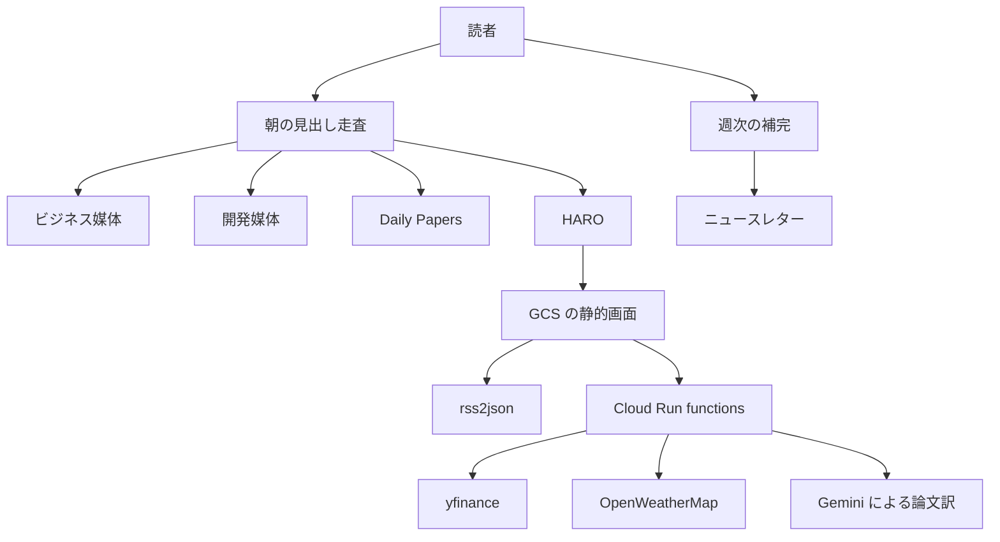

2025年1月に松尾研究所テックブログで公開された、小川雄太郎さんの記事「[AI系の情報収集手法を紹介（ビジネス・開発・研究）【2025年版】](https://zenn.dev/mkj/articles/1357a7ea2970c4)」を取り上げます。
この記事は、AIの一次情報を3つのレーンで追う個人の型と、朝の確認を1画面にまとめた自作アシスタント「HARO」を紹介しています。

本記事では、その型と構成を整理したうえで、2026-10-03時点で各情報源と部品がまだ使えるかを一次情報で確認した結果をまとめます。
次の内容がわかります。

- 3レーン（ビジネス・開発・研究）の情報収集の型
- HAROの構成と使っている部品
- 2026-10-03時点で応答したRSSと、改名・統合されたニュースレター
- 同じ型を今から自分の朝の確認に載せるときの置き換え先

なお、紹介記事は会社の公式手順ではなく、著者個人の実践メモです。

*この記事の全体像。以下、順に解説します。*

## 「AI系の情報収集手法（2025年版）」とは

### 概要

| 項目 | 内容 |
| --- | --- |
| 著者 | 小川雄太郎（松尾研究所テックブログ） |
| 公開 / 本文更新 | 2025-01-15 / 2025-05-22 |
| 反応（2026-10-03時点の概数） | いいね約580、ブックマーク約350 |
| 想定読者 | 同じ型を自分の朝の確認に載せたい個人の開発者・研究者 |
| 主題 | 3レーンの情報収集の型と、自作アシスタントHARO |

### 特徴

型の基本方針は次のとおりです。

- 朝は見出しを見る
- 週次で取りこぼしを埋める
- 見逃した日は気にしない

レーンごとの情報源は次のとおりです。

| レーン | 日次 | 週次・メール |
| --- | --- | --- |
| ビジネス | 日経ビジネス電子版、Business Insider Japan、日経クロステックのIT、ITmedia AI+ | 紙の日経ビジネス、日経コンピュータ |
| 開発 | はてなブックマークのIT人気とAI検索、Zennの指定トピック、Google Cloud公式ブログ（英語・日本語）、G-genのブログ | TLDR各版、Medium daily digest など |
| 研究 | Hugging Face Daily Papers | Elvis Saravia の週次など、論文系の週次リスト |

メールは、Gmailのラベル「情報収集」と「なんかいろいろ」へ差出人（From）で振り分けます。
論文については、Deep Learning MonitorとTrending Papersのサイトは使わないと著者は書いています。

### HAROの構成

HAROは、著者が「AI-Agentと呼ぶには低レベルで、ルールベースが多い」と書くアシスタントです。
名前のモチーフはガンダムのハロです。
動作の様子は[デモ動画](https://youtu.be/oqBEd2ugnqk)で確認できます。

| 層 | 使っているもの |
| --- | --- |
| 画面 | React、Vite、MUI、chat-ui-kit-react、SCSS |
| 配信 | Cloud Storage（GCS）の静的ファイル |
| 表示 | 一括取得したMarkdownをmarkdown-itでHTMLにし、要素単位で「カタカタ」と描く |
| RSS取得 | rss2json（CORS回避のため） |
| サーバー側 | Cloud Run上の関数で株価・天気・論文訳を取得 |
| 株価 | yfinance（日経平均、ドル円、S&P 500） |
| 天気 | OpenWeatherMapの5 Day / 3 Hour Forecast |
| 論文訳 | Vertex AIのGemini 2.0 Flash Experimental、SDKはgoogle-genai |
| 認証 | Googleログイン |

朝の流れとHAROの構成を図にすると次のようになります。

図は2025年時点の構成です。
2026-10-03時点で止まった部品や変わった部品は、次の節以降で扱います。

## 注意点

2025年版の記述を2026-10-03の一次情報と並べると、次のずれがあります。

### 記述と一次情報のずれ

| 記述 | 2026-10-03時点の一次情報 |
| --- | --- |
| Googleとのパートナーシップ | 研究室の発表（2024-06-25）とGoogle Japanのブログ（2024-06-19）の契約主体は、東京大学 松尾・岩澤研究室です。株式会社松尾研究所とは分けて読む必要があります。記事の注は研究室を指しており、一次と一致します |
| 「有料なのはElvisの月5ドルだけ」 | 記事時点の自己申告です。2026-10-03に確認したAI Agents Weeklyの号はPaid表示でしたが、現行の月額は確認できていません |
| 「Daily Papersに公式RSSは無い」 | 言い切れません。`https://huggingface.co/papers/rss` は401、`GET https://huggingface.co/api/daily_papers?limit=1` は200でした。記事が案内する個人XML `https://jamesg.blog/hf-papers.xml` は410 Goneです |
| 「無料の市場APIは見つからなかった」 | 著者の探索結果であり、無料の市場APIが存在しないことの証明ではありません |
| 「無料のRSSリーダーは一度に読める記事数が制限される」 | 具体数は記事にありません。FeedlyのヘルプのBasicは100 sources、3 Feeds、3 Boardsで、これはソース数です。InoreaderのFreeはRSS購読150、Proは2500です |

### Daily Papersは論文の全量ではない

- Daily Papersは、論文を宣伝するための提出です。Hugging Faceに載る論文のすべてが提出されるわけではありません
- 提出期限は、HuggingDiscussions #32の現行本文が「7日未満」、Hugging Faceのskills文書が「arXiv公開から14日」と書いており、食い違っています

### 翻訳モデルIDはすでに止まっている

- Gemini APIの2025-11-04のchangelogは、Gemini 2.0 Flash Experimentalを12月9日の停止予定に並べています。モデルページは同IDを「Shut down」と表示しています
- 安定版の `gemini-2.0-flash` と `gemini-2.0-flash-001` は2026-06-01に停止しました
- 置き換え先は面によって異なります
  - Gemini APIのdeprecationsページ: `gemini-3.6-flash`
  - Gemini APIのモデルページの警告: Gemini 3.5 Flash
  - Agent Platform（旧Vertex AI）の退役表: `gemini-3.1-flash-lite`
- Agent Platform側の `gemini-2.0-flash-exp` の停止日は確認できていません。Gemini APIの停止日と同一視しないでください

### yfinanceの位置づけ

- READMEは、Yahoo非提携であること、研究・教育目的であること、Yahooの利用条件を読むことを求めています。さらに “the Yahoo! finance API is intended for personal use only.” と書いています
- Yahooの利用条件は、提供するインタフェースと手順以外の方法でアクセスしないよう求めています
- 個人の朝のスクリプトを例外とする文は、確認した範囲にはありません

### その他

- 各ニュースレターの購読者数はページ表示の概数で、監査値ではありません
- chat-ui-kit-reactはアーカイブされていませんが、最新コミットは2025-05-15のリリース2.1.1で、活発に更新されているとは言えません
- 「HARO」は、「Help A Reporter Out」と同じ綴りです。検索ではそちらが優先されます

## 2026年10月にまだ使える入口はどれか

### RSS

2026-10-03に各フィードをHTTPで取得した結果です。
日付は応答の先頭付近の1件から抜いています。

| 入口 | フィードURL | HTTP | 先頭の日付 |
| --- | --- | --- | --- |
| 日経ビジネス | `https://business.nikkei.com/rss/sns/nb.rdf` | 200 | 2026-10-03 |
| Business Insider Japan | `https://www.businessinsider.jp/feed/index.xml` | 200 | 2026-10-02 |
| 日経クロステック IT | `https://xtech.nikkei.com/rss/xtech-it.rdf` | 200 | 2026-10-03 |
| ITmedia AI+ | `https://rss.itmedia.co.jp/rss/2.0/aiplus.xml` | 200 | 2026-10-03 |
| はてなブックマーク IT人気 | `https://b.hatena.ne.jp/hotentry/it.rss` | 200 | 2026-10-02 |
| はてなブックマーク AI検索 | `https://b.hatena.ne.jp/q/ai?users=5&mode=rss&sort=recent` | 200 | 2026-10-02 |
| Zenn トピック ai | `https://zenn.dev/topics/ai/feed` | 200 | 2026-10-02 |
| Zenn トピック llm | `https://zenn.dev/topics/llm/feed` | 200 | 2026-10-02 |
| Zenn トピック googlecloud | `https://zenn.dev/topics/googlecloud/feed` | 200 | 2026-10-02 |
| Google Cloud ブログ（英語） | `https://cloudblog.withgoogle.com/rss/` | 200 | 2026-10-02 |
| Google Cloud ブログ（日本語） | `https://cloudblog.withgoogle.com/ja/rss/` | 200 | 2026-10-02 |
| G-gen | `https://blog.g-gen.co.jp/feed` | 200 | 2026-10-01 |
| テクノエッジ | `https://techno-edge.net/rss20/index.rdf` | 200 | 2026-10-02 |

はてなブックマークのAI検索は、条件（`users=5`、新着順）によって結果が変わります。

日経系のRSSには次の制約があります。

- 日経ビジネス編集部の案内（2022-10-28）は、RSSを「見出しや概要」と説明しています
- 2026-10-03に取得した先頭のdescriptionは、日経ビジネスで104字と131字、日経クロステックITで84〜181字のリードでした
- RSSは有料本文の代わりになりません

テクノエッジの生成AIウィークリーは、2026-10-02に第161回が掲載されています。

### ニュースレター

2026-10-03時点で、改名・統合・停止があったものを中心に整理します。

| 2025年版での名前 | 2026-10-03の状態 | 購読時の扱い |
| --- | --- | --- |
| TLDR Tech | 継続。約800万以上と表示 | そのまま購読 |
| TLDR AI | 2026-10-02の号あり。平日配信 | そのまま購読 |
| TLDR Web Dev | 独立版は終了し、TLDR Devに統合 | TLDR Devを購読 |
| TLDR Founders | 継続。月水金 | そのまま購読 |
| Founder Weekly | 継続。Issue 750は2026-09-30 | TLDR Foundersとは別媒体 |
| AI Agents Weekly（Elvis） | 2026-09-26の号はPaid | 月額は購読画面で確認 |
| Top AI Dev News | 独立号の最新は2024-11-27。2026年はAgents Weekly内の節 | Agents Weeklyで読む |
| Top ML Papers of the Week | 表題がTop AI Papers of the Weekに変更 | 新名で購読・フィルタ |
| Last Week in AI | 2026-08-25の#342で再開。#345は2026-09-30 | 再開後の差出人でフィルタ |
| Data Science Weekly | 公式アーカイブの最新はIssue 484（2023-03-02） | 継続は要確認 |
| Towards Data Science / The Variable | 媒体は更新中。レターのウェブ号は2026-02-05まで | 2026-03以降は要確認 |
| Import AI / PyCoder's Weekly / Python Weekly / Data Engineering Weekly | 2026年9〜10月の号あり | そのまま購読 |
| Deep Learning Weekly / AI Weekly / Data Elixir | 継続。AI Weeklyは2026-10-02、Data Elixirは2026-09-15の号あり。無料 | そのまま購読。AI Weeklyは `aiweekly.co` で、`ai-weekly.ai` は別媒体 |
| Weekly Kaggle News | #355。日本語、金曜配信 | そのまま購読 |
| The Machine Learning Engineer | #406は2026-09-27。旧URLは `/newsletter/` へ転送 | 新URLで購読 |

Medium daily digestは、ヘルプに日次と週次の選択が残っています。
Qiitaの週次ランキングメールは、公式バックナンバーで2026-09-02号まで「先週いいねが多かった投稿ベスト20」を含んでいます。

### HAROの部品

| 部品 | 2025年版の記述 | 2026-10-03の一次情報 |
| --- | --- | --- |
| サーバーレス | Google Cloud Run Function | 現行名はCloud Run functions（旧Cloud Functions 2nd gen）。SLAの月間稼働率は99.95% |
| rss2json Free | 無料で足りる | 25フィード、24時間あたり10,000リクエスト。`api_key` は必須ではないが、`count` の指定にはキーが要る |
| yfinance | 3指標を関数で取る | PyPIの版は1.7.0（2026-08-26）。3指標が今日取れるかは未確認 |
| 天気 | 5 Day / 3 Hour Forecastが無料 | `/data/2.5/forecast` はFree Weather API accessに含まれる。60回/分、100万回/月、`appid` 必須 |
| 翻訳 | Gemini 2.0 Flash Experimental、google-genai | Gemini APIではShut down表示。Agent Platform側の実験版IDの停止日は未確認。`google-genai` は現行SDK（2025-05 GA）。旧 `google-generativeai` は2025-11-30以降deprecated |
| 論文の入口 | 個人RSSをrss2json経由 | 個人XMLは410。JSON APIは未認証で200だが、`access-control-allow-origin` は `https://huggingface.co` のみ |
| 画像・動画の次候補 | Imagen 3、Veo / Veo 2 | Gemini APIで `imagen-3.0-generate-002` は2025-11-10、`veo-2.0-generate-001` は2026-06-30にshutdown |
| OAuth | 静的フロントとGoogleログイン | 公式は、公開クライアントはclient secretを安全に保存できないと説明 |

補足事項は次のとおりです。

- yfinanceのissue [#2441](https://github.com/ranaroussi/yfinance/issues/2441)（`[0.2.58/59] Yahoo may return bad crumb`）は、crumbの値が `Too Many Requests` になる429が間欠的に出ると報告しています。2025-05-18にcloseされていますが、1.7.0で症状が残るかは確認できていません
- Hugging Face Hub APIのレートは、匿名で5分あたり500、Free userで5分あたり1,000です（September '25時点の表）。Daily Papers専用の枠ではありません
- Daily Papers APIはCORSで `https://huggingface.co` だけを許可しているため、GCS上のブラウザから直接呼べるとは読めません

## 同じ型を今から自分の朝に載せるには

### 残すもの

- ビジネス・開発・論文の3レーン
- 「朝は見出し、週は補完」の方針
- 見逃した日を埋め直さない運用

### 置き換えるもの

| 対象 | 置き換え方 |
| --- | --- |
| RSS | 上の表で200だったURLに限って購読する。日経系は見出しとリードとして扱う |
| ニュースレター | 改名・統合後の名前で購読する。TLDRのウェブ開発はTLDR Dev、論文の週次はTop AI Papers of the Week |
| Gmailフィルタ | TLDR Dev、Top AI Papers of the Week、再開後のLast Week in AIを購読し、最初に届いたメールの差出人アドレスをFromに設定する。Data Science Weeklyの旧差出人は継続確認まで固定しない |
| 論文の取り込み | `jamesg.blog/hf-papers.xml` ではなく `GET https://huggingface.co/api/daily_papers` を使う。CORSで許可されるのは `https://huggingface.co` だけなので、静的画面から直接呼ばず、Cloud Run functions などのサーバー側で取得して画面へ渡す。arXivの全日次とは扱わない |
| 翻訳モデル | `gemini-2.0-flash-exp` を書かない。呼ぶ面（Gemini APIかAgent Platformか）を決め、その面の廃止表から現行IDを写す |

### 設計上の判断基準

- **APIキーを静的フロントに置かない**
  - rss2jsonの公式サンプルはブラウザのajaxに `api_key` を置いていますが、公開フロントに本物のキーを載せてよいという意味ではありません
  - rss2jsonのキーやOpenWeatherの `appid` は、運用者だけが読む関数側に置きます
- **rss2jsonの更新間隔を契約値として固定しない**
  - 画面には「1 Hour」と表示されますが、JSON上のcacheの単位は明記されていません
- **株価ウィジェットは外せる位置に置く**
  - yfinanceを公式の無料APIとして扱わないでください
  - 残すなら利用条件を自分で読み、表示が止まっても朝の情報収集が壊れない位置に置きます
- **名前を分けて扱う**
  - Googleとのパートナーシップを話すときは、東京大学 松尾・岩澤研究室と株式会社松尾研究所を分けます
  - 自作画面の名前に裸の「HARO」を使うと、検索でHelp A Reporter Outに埋もれます

## まとめ

- 2025年版の記事は、3レーンの見出し走査と週次補完という型、それを1画面に載せたHAROを紹介しています
- 2026-10-03時点でも、名指しされたRSSの多くは200で応答し、型そのものは使えます
- 一方で、ニュースレターの改名・統合、論文RSSの消失、Geminiモデルの停止により、2025年の固有名とモデルIDはそのまま移植できません
- 型は残し、固有名とモデルIDは公式の現行ページから写し直すのが現実的です

この記事が少しでも参考になった、あるいは改善点などがあれば、ぜひリアクションやコメント、SNSでのシェアをいただけると励みになります！

## 参考リンク

- [AI系の情報収集手法を紹介（ビジネス・開発・研究）【2025年版】](https://zenn.dev/mkj/articles/1357a7ea2970c4)
- [HARO デモ動画](https://youtu.be/oqBEd2ugnqk)
- [東京大学 松尾・岩澤研究室 ニュース（2024-06-25）](https://weblab.t.u-tokyo.ac.jp/news/2024-06-25/)
- [Google Japan ブログ: AI Google for Japan 2024](https://blog.google/intl/ja-jp/company-news/technology/ai-google-for-japan-2024/)
- [Gemini API deprecations](https://ai.google.dev/gemini-api/docs/deprecations)
- [Gemini API changelog](https://ai.google.dev/gemini-api/docs/changelog)
- [Gemini 2.0 Flash モデルページ](https://ai.google.dev/gemini-api/docs/models/gemini-2.0-flash)
- [Agent Platform のモデルバージョンとライフサイクル](https://docs.cloud.google.com/vertex-ai/generative-ai/docs/learn/model-versions)
- [Cloud Run functions の比較](https://docs.cloud.google.com/run/docs/functions/comparison)
- [Cloud Run functions SLA](https://cloud.google.com/functions/sla)
- [rss2json docs](https://rss2json.com/docs)
- [rss2json plans](https://rss2json.com/plans)
- [OpenWeather 価格](https://openweathermap.org/price)
- [OpenWeather 5 day / 3 hour forecast](https://openweathermap.org/forecast5)
- [yfinance (PyPI)](https://pypi.org/project/yfinance/)
- [yfinance README](https://github.com/ranaroussi/yfinance/blob/main/README.md)
- [yfinance issue #2441](https://github.com/ranaroussi/yfinance/issues/2441)
- [Yahoo 利用条件](https://legal.yahoo.com/us/en/yahoo/terms/otos/index.html)
- [Hugging Face papers skill](https://github.com/huggingface/skills/blob/main/skills/huggingface-papers/SKILL.md)
- [HuggingDiscussions #32](https://huggingface.co/spaces/huggingface/HuggingDiscussions/discussions/32)
- [Feedly ヘルプ](https://docs.feedly.com/article/43-how-can-i-cancel-the-subscription)
- [Inoreader 料金](https://www.inoreader.com/pricing)
- [日経ビジネスの RSS 案内](https://business.nikkei.com/atcl/gen/19/00062/102700043/)
- [Google OAuth 2.0 ポリシー](https://developers.google.com/identity/protocols/oauth2/policies)
- [chat-ui-kit-react](https://github.com/chatscope/chat-ui-kit-react)
