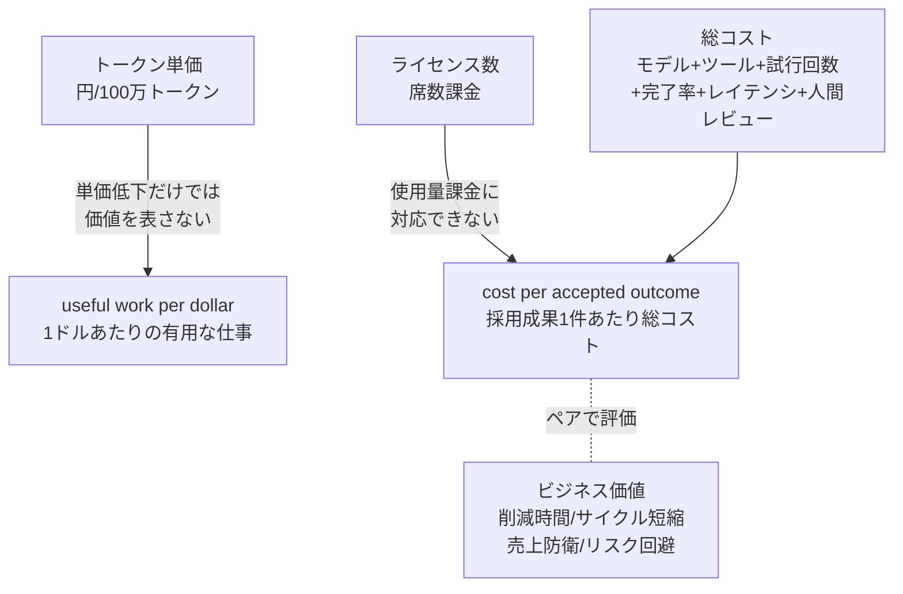
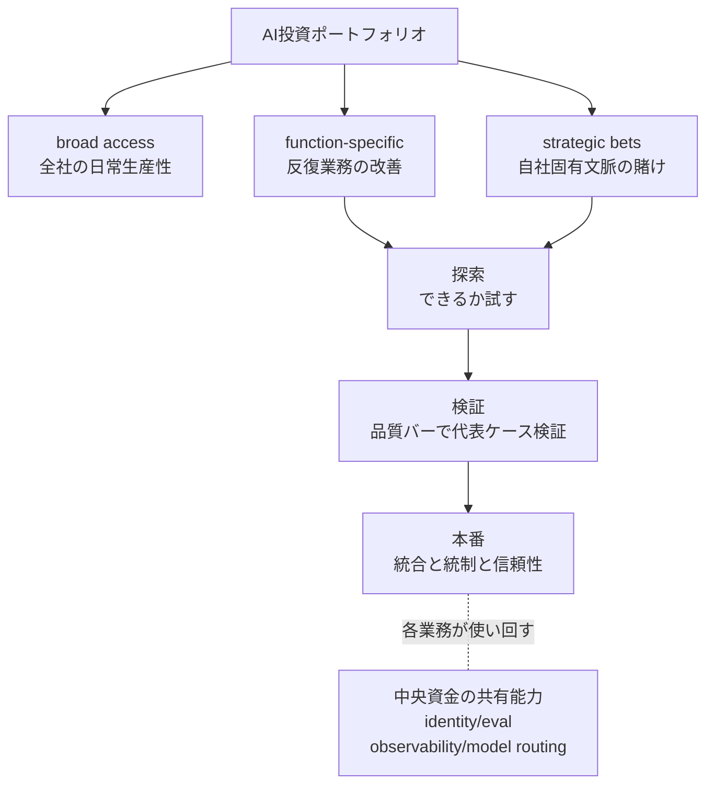

OpenAIが2026年7月14日に公開した投資管理フレームは、AI投資を測る単位を変えるべきだと主張します。トークン単価ではなく「1ドルあたりの有用な仕事（useful work per dollar）」と「採用可能な成果1件あたりのコスト（cost per accepted outcome）」で測る、という転換です。

この記事は、その主張を「OpenAIが言ったから正しい」として受け取りません。発注側・経営が自組織へ適用してよいかを判断するための構造として分解します。想定読者は、AIを使う側（発注者・経営）の投資判断を支援する構造設計者です。実装エンジニアには、AIコストをどの粒度で計装し、どの層に投資を寄せるかの設計指針として読めます。

## この記事の結論

先に3点で示します。

| 結論 | 要旨 |
|---|---|
| 単位転換の発想は業界の収斂点 | OpenAI発の新規性ではない。FinOps Foundationが約2ヶ月前に同型の主張を公表し、国内でも先行して立ち上がっていた |
| この記事は自社販促を兼ねる | 5ステップの各々がOpenAIの有償プロダクトへ誘導する。中立な投資判断ツールとしては読めない |
| 効くのは発想でなく前提への反証 | 罠は3つ。単一KPI化、単一ベンダー中央集権、コストは制御可能という前提 |

## OpenAIが示した「測定単位の転換」

### トークン単価では価値を測れない

OpenAIの起点は、トークン単価の低下だけでは価値を語れないという指摘です。記事は自社モデルの価格低下を引き合いに出します。

- 「GPT-4からGPT-5.4で、100万トークンあたりの価格は97%下落した」との主張
- 「token price alone does not show whether AI is creating value. Leaders should look at **useful work per dollar**」

そのうえで、最安トークンが最安総コストとは限らないと論じます。安いモデルは失敗し、再試行し、修正が必要な仕事を生むからです。だから測るべきは、「良い（good enough）」の基準を先に定義したうえでの**総コスト**です。総コストにはモデルとツールの利用、試行回数、完了率、レイテンシ、人間レビューが含まれます。

優先ワークフローでは「採用可能な成果1件あたりのコスト（cost per accepted outcome）」を追え、と続きます。カスタマーサポートなら解決した1件、エンジニアリングならレビューを通ったコード変更1件です。そのコストを、削減できた時間、短縮したサイクルタイム、守った売上、避けたリスク、生んだ余力といったビジネス価値とペアにします。

注意すべき点があります。記事冒頭の数値はOpenAI自社モデルの効率を示すものです。97%は「GPT-4からGPT-5.4への100万トークンあたり価格」、54%（出力トークン減）と57%（タスク時間減）は「GPT-5.6のArtificial Analysis Coding Agent Indexでの値」で、GPT-5.4一般の効率値ではありません。「単価より成果で見よ」という主張と、「うちの新モデルは成果効率が高い」という宣伝が、同じ記事の中で重なっています。

### 5ステップの投資フレーム

記事は「自信を持って投資する5つの方法」を提示します。

| # | ステップ | 中身 | 誘導先のOpenAI製品 |
|---|---|---|---|
| 1 | 使用量と支出の可視化 | 誰が・どの製品やモデルを・どれだけ使い・どんな仕事を支えるか。ワークスペース、チーム・ユーザー、製品・モデルの3階層で見る | Admin Console の usage analytics |
| 2 | 成果ROIでモデル効率を評価 | good enough を先に定義し、総コストで比較。cost per accepted outcome を追う。明確な指示、focused tools、再利用文脈、停止条件でループと無駄を削る | evals、ChatGPT Work |
| 3 | スケール前にガバナンス | ガバナンスを「どのAI業務が拡大できるかを決める運用層」と位置づける。文脈、ツール、アクション、承認、容量付与を定義 | ChatGPT Work、AI Deployment Engineers |
| 4 | 複利で効く業務に投資 | broad access、function-specific、strategic bets の3層。資金は成熟度に追随。共有能力は中央資金 | 共有基盤としてのOpenAIスタック |
| 5 | 実証された需要に容量を合わせる | 価値が実証された業務に、製品・容量・サポートを合わせる | OpenAI Frontier、Deployment Company |

ステップ2とステップ4が、この記事の実質的な核心です。

### 相対的な新規性: 成熟度追随と中央投資

ステップ4には、一般的なunit economics議論より一段踏み込んだ運用モデルがあります。

> Funding should follow maturity. Exploration should test whether the model can handle the task; validation should test representative cases against a clear quality bar; production funding should support the integrations, controls, reliability, and change management required to scale. Shared capabilities such as identity, trusted connectors, curated knowledge, evaluations, observability, model routing, and reusable agent patterns should be funded centrally.

要点は2つです。第1に、探索・検証・本番の成熟度に資金を追随させます。第2に、identity、eval、observability、model routingなどの共有能力を中央資金でまかないます。この2点は、コスト測定の話を投資配分の運用モデルまで具体化したものです。今回確認した資料では、この運用モデルに直接対応する表現を業界の一次ソースに見つけられませんでした。ただし見つからなかったことは独自性の証明にならず、相対的な新規性は未確定です。加えて後述のとおり、この中央投資の路線はプラットフォームチームの失敗パターンと裏表です。

## 測定と投資配分を図で捉える

### 測定軸の転換

| 要素名 | 説明 |
|---|---|
| トークン単価 / ライセンス数 | 従来の測定軸。量と席数の課金 |
| useful work per dollar | 1ドルで得た有用な仕事の量 |
| cost per accepted outcome | 採用可能な成果1件あたりの総コスト |
| 総コスト | モデル、ツール、試行回数、完了率、レイテンシ、人間レビューの合算 |
| ビジネス価値 | 成果単価とペアで評価する効果指標 |

### 投資配分の構造

| 要素名 | 説明 |
|---|---|
| broad access | 全社の日常生産性への広い投資 |
| function-specific | 反復業務を改善する機能別ワークフロー |
| strategic bets | 自社固有文脈に張る少数の戦略投資 |
| 探索・検証・本番 | 成熟度に資金を追随させる3段階 |
| 中央資金の共有能力 | identity、eval、observability、model routing の共通基盤 |

この2図は、「測定単位を変える」と「投資を段階配分する」という別々の意思決定を1本の記事に束ねたものです。前者の測定は発注側が単独で始められます。後者の配分は組織設計と中央投資の意思決定を伴い、罠が増えます。

## OpenAIは初出ではない: 業界の収斂点

この単位転換の発想は、OpenAIの独自提案ではありません。独立した複数の一次ソースが同方向を指す収斂点です。

| ソース | 日付 | 核心 | 種別 |
|---|---|---|---|
| FinOps Foundation「Token Economics」（J.R. Storment） | 2026-05-10 | 目的はトークン最小化でなく、token consumption を value に接続すること | 公式・一次 |
| FinOps for AI 公式フレーム | 記載なし | unit economics（value÷cost）を能力領域に定義。token は主要メーターだが単体では不十分 | 公式・一次 |
| a16z Enterprise Newsletter | 2024-12 | AIが per-seat から outcome-based pricing を駆動する3要因。ただし値付けは難しく発展途上と留保 | 公式・一次 |
| Intercom Fin | 2026-03-12 | 成果課金の代表実例。月額49ドル（50 resolutions込）+超過分0.99ドル/outcome、平均解決率76%（2026-06時点の自己申告） | 公式・一次 |

FinOps Foundationが、OpenAIの約2ヶ月前（2026-05-10の表示日）に、ほぼ同一の核心を公表していた点は重要です。ただし当該ページは本文に2026-06-03の出来事を含み、公開後に更新されています。核心文が5月時点から存在したかはアーカイブなしでは断定できません。OpenAIが初出でなく、複数の先行資料と方向性が一致するのは事実です。そのうえで「業界の合意を自社製品の導線に沿って再パッケージしたもの」という読みは、5ステップ全体の同一性まで証明されたわけではなく、本記事の分析・仮説として提示します。

### 国内の受容

国内では、本記事の直接報道が薄い一方で、論点そのものは先行して立ち上がっていました。

- OpenAI本記事（2026-07-14）の日本語での翻訳・解説は、公開翌日時点でITmedia、Publickey、クラスメソッド、日経xTECHに見当たりませんでした。
- 「トークン単価から成果単価へ」の論点は、本記事に先行して2026年6月から7月に国内で立ち上がっていました。
  - @IT（2026-06-27）: Gartner調査を引き、ROIを明確に達成できているのは14%、効果測定が難しいが43%（原典Gartner、@IT経由の二次）。
  - GENDA（Zenn、2026-06-26、一次）: 「企業が買っているのはトークン総量でなく、使える出力の量だ」との認識。useful work per dollar と同思想。
  - LayerX 実態調査2026（2026-06-30、LayerXのプレスリリース、n=400のAIコスト管理担当者層）: 73.3%が「AI利用コストは経営課題」、月平均AI利用コスト約274万円、今後整備したい項目のトップは「AI利用額と成果・ROIを紐づけたデータ」（21.8%）。母集団は企業全体でなくAIコストを管理する担当者層である点に注意。
  - Sansan（幹部発言をITmediaが報道、二次）: 「AIを使ったかどうか」でなく「成果の質が変わったか」で測定。cost per accepted outcome と直結。

国内では、可視化（ステップ1）から成果ROI（ステップ2）までの需要が、少なくともAIコスト管理担当者層で示されつつあります。土壌は先にできており、本記事の直接報道が薄いだけです。

## 3つの罠: 効くのは発想でなく前提への反証

「outcome単価という発想」そのものを全否定する材料は乏しく、一次ソースは広く支持側です。反証が効くのは、記事が置く運用の前提に対してです。

### 罠1: 単一KPI化とゲーミング

- cost per accepted outcome を最適化の的（単一KPI）にした瞬間、Goodhartの法則として知られる一般的リスクが働きます。指標と本来の目的が乖離するリスクです。AIエージェントでも、指標を狙って動く挙動（specification gaming）が起こり得ます。これは理論と類推レベルの懸念で、エージェントが人間より激しくゲームするという実証データは今回確認できていません。
- 「accepted」の定義は操作可能です。Intercom Finは「顧客が解決を確認したresolution」と「顧客が24時間沈黙したためみなしたresolution（assumed resolution）」を同額（0.99ドル）で課金します。Intercom Communityの単一ユーザー投稿では、前者が6〜7%、後者が約60%と報告されました。自己申告で正否は未監査です。投稿者自身は、assumed の少なくとも3分の1は正答だったと推定しています。この比率だけでは誤判定率を実証できませんが、attribution を検証しない運用では、成果単価がみなし成果で下がって見え得ることは示します。
- 記事自身も「複数の視点（altitude）で見よ」と一部緩和しています。この反証は単一KPI化した運用に限って効きます。

### 罠2: 単一ベンダー中央集権とロックイン

- 5ステップの各々がOpenAIの有償プロダクトへ誘導します。可視化はAdmin Console、outcome ROIはChatGPT Work、ガバナンスはAI Deployment Engineers、容量はOpenAI FrontierとDeployment Companyです。これは記事本文から直接読み取れる事実で、フレームは「単一モデルプロバイダ（OpenAI）集中」を最適解に見せる設計です。発注側の中立な投資判断ツールとしては読めません。
- ステップ4の「共有能力を中央資金でまかなう」は、実装上OpenAIスタックへの集中を促します。価格改定、モデル廃止、障害、イノベーション停滞のリスクに晒されます。model gateway や抽象化層を挟めば緩和できますが、それは記事が推す構成ではありません。

### 罠3: コストは制御可能という前提の崩壊

記事は「単価が97%下がった、だから成果で見よ」と説きます。しかし実データは逆です。単価が下がっても、総コストはエージェントの長時間実行と並列実行で膨張しています。

- FinOps Foundation公式: 「ループするエージェントは数時間で指数的に膨らむ請求を生む」「単一のユーザー操作が5、10、50のAPI呼び出しにカスケードする」（一次）。
- 個社の予算超過とライセンス集約の報道があります。Uberは2026年のAIコーディング予算を4ヶ月で使い切りました（The Information、Fortune経由の二次）。MicrosoftはClaude Codeの大半をGitHub Copilot CLIへ集約しました。費用削減と製品集約の両方が理由で、Claudeモデル自体はCopilot経由で継続します（The Verge、Fortune経由の二次）。これらは個社事例で、企業一般の総支出増を直接実証するものではありません。
- Gartnerは「高度モデルの推論コストは2030年までに約90%下落するが、エージェントがタスクあたり遥かに多くトークンを消費するため、エンタープライズAI総支出は上昇する」と分析します（Fortune、CIO.com経由の二次）。Goldman Sachsは、トークン消費量（世界全体、消費者と企業）が2030年に約24倍という需要量予測を示します。これは需要量予測で、購入企業の支出制御不能を直接実証するものではありません（Fortune経由の二次）。

成果単価に注目を移す前に、そもそも総支出が制御不能になり得ます。これが最も強い反証です。核である「ループで総額が膨らむ構造」はFinOps Foundation公式（一次）で裏づき、個社の予算超過は二次報道で補強されます。ただし記事も「停止条件（stopping conditions）でループを抑えよ」と一部同じ懸念を共有している点は、公平に付記します。

### 反証が効かない: 結論が頑健な論点

- outcome-based pricing を完全撤退したAIベンダーの事例は見つかりませんでした。あったのはSalesforceのハイブリッド化とIntercomの定義修正という調整で、撤退ではありません。成果課金の実務は、撤退でなく修正で存続しています。
- 「ガバナンス先行が導入を明確に遅らせた」という定量的失敗データも見つかりませんでした。この角度からは、記事のガバナンス先行の主張を崩せません。

### 罠4: 中央投資はプラットフォーム失敗と裏表

「共有能力を中央資金で」は、内部プラットフォーム（IDP）で繰り返し失敗している中央集権のアンチパターンと同型です。

| アンチパターン | 説明 |
|---|---|
| Golden Cage | 統制を優先し、現場の文脈と自律を奪う硬い抽象 |
| Ivory Tower | 現場課題を無視して真空で設計する |
| Premature Abstraction | 全ユースケースを抽象化し、巨大な保守面積を抱える |

これらは実務家コミュニティで広く共有されます。AI基盤への適用は類推です。中央基盤を「プロダクトとして現場需要駆動で」運営すれば緩和できます。

## 発注側の判断チェックリスト

記事をそのまま採るのでなく、次を自組織の文脈で問い直すのが判断支援者の役割です。

1. 測定は始める、単一KPI化はしない。まず1業務を選び、「成果1件」の定義（例: レビューを通ったPR1件）を先に決めます。cost per accepted outcome は有用な計器です。ただし単一の最適化目標にせず、総支出、完了率、人間レビュー負荷と並べます。「accepted」の定義と成果の帰属（attribution）を監査ログで裏づけます。
2. ベンダー中立で設計する。可視化、eval、observability、model routing を、単一プロバイダのコンソールでなく抽象化層に置けないかを検討します。中央投資を単一ベンダー集中にしません。
3. 単価より先に総支出の上限を握る。タスク単位でretry、再帰深さ、ツール呼び出し、トークン予算に上限を設けます。閾値到達で人間へエスカレーションします。成果単価の議論は、コスト暴走を止めてから行います。
4. 成熟度配分は採る価値がある。探索、検証、本番で資金を段階化する発想は健全です。ただし中央基盤はプロダクトとして現場駆動で運営し、塩漬けと過剰設計を避けます。
5. 国内の土壌を使う。FinOps for AI や Tokenomics の語彙と、LayerX調査などの国内データは、社内合意形成の足場になります。「OpenAIが言った」でなく「業界と国内が同方向」で通します。

## 残された問い

- cost per accepted outcome を主指標に運用した企業の成否データは、まだ蓄積されていません。指標運用が新しいためです。反証は理論（Goodhart）と類似指標（cost-per-resolution）からの類推にとどまります。
- McKinsey「Cost versus value: Managing agentic AI system performance」の本文は、今回の環境で直接取得できませんでした。「agent sprawl」などの具体像は二次要約どまりで、一次再取得が必要です。
- agentic コストの倍率（chat比で数倍から100倍など）の一次データ源は未確保です。罠3は「総額上昇」の核のみ一次で依拠しています。

## まとめ

OpenAIのフレームは、AI投資の測定単位をトークン単価から採用成果単価へ移す提案です。発想自体は業界の収斂点で、効くのは発想でなく「単一KPI化・単一ベンダー中央集権・コスト制御可能という前提」への反証です。発注側は「OpenAIが言った」でなく「業界と国内が同方向」で読み替え、測定は始めつつ総支出の上限とベンダー中立を先に握るのが実務的です。

この記事が少しでも参考になった、あるいは改善点などがあれば、ぜひリアクションやコメント、SNSでのシェアをいただけると励みになります！

## 参考リンク

- 公式ドキュメント
  - [How to manage AI investments in the agentic era（OpenAI）](https://openai.com/index/managing-ai-investments-in-agentic-era/)
  - [Token Economics: The Atomic Unit of AI Value（FinOps Foundation）](https://www.finops.org/insights/token-economics-the-atomic-unit-of-ai-value/)
  - [FinOps for AI（FinOps Foundation）](https://www.finops.org/framework/technology-categories/ai/)
  - [FinOps for AI Tools & Services Considerations（FinOps Foundation）](https://www.finops.org/wg/finops-for-ai-tools-services-considerations/)
  - [From resolutions to outcomes（Intercom）](https://www.intercom.com/blog/from-resolutions-to-outcomes-evolving-how-fin-delivers-value/)
  - [Fin pricing: outcomes（Intercom）](https://fin.ai/help/en/articles/13975800-fin-pricing-outcomes)
  - [AI is driving a shift towards outcome-based pricing（a16z）](https://a16z.com/newsletter/december-2024-enterprise-newsletter-ai-is-driving-a-shift-towards-outcome-based-pricing/)
  - [Tokenomics Foundation 設立意向（Linux Foundation）](https://www.linuxfoundation.org/press/linux-foundation-announces-the-intent-to-launch-the-tokenomics-foundation-to-establish-open-standards-for-ai-cost-management)
- 記事
  - [Microsoft's AI cost problem（Fortune）](https://fortune.com/2026/05/22/microsoft-ai-cost-problem-tokens-agents/)
  - [Cost versus value: Managing agentic AI system performance（McKinsey）](https://www.mckinsey.com/capabilities/quantumblack/our-insights/cost-versus-value-managing-agentic-ai-system-performance)
  - [Agentic AI puts $234B in enterprise SaaS spending at risk, Gartner says（CIO.com）](https://www.cio.com/article/4192242/)
  - [「AI時代のコスト削減」の本当のリスク（@IT）](https://atmarkit.itmedia.co.jp/ait/articles/2606/27/news005.html)
  - [生成AIの請求書、人件費と並べる時代へ 国内5社（ITmedia NEWS）](https://www.itmedia.co.jp/news/articles/2606/30/news027.html)
  - [トークンマネジメントとは何か（メンバーズ）](https://www.members.co.jp/column/20260706-ai-token)
  - [単価は下がるのに、なぜ請求は増えるのか（GENDA、Zenn）](https://zenn.dev/genda_jp/articles/0a70408c4a6b99)
  - [FinOps for AIとは（アイスリーデザイン）](https://www.i3design.jp/in-pocket/finops-for-ai/)
  - [OpenAI's five-step framework for managing agentic AI spend（MarketScale）](https://www.marketscale.com/industries/software-and-technology/openais-five-step-framework-for-managing-agentic-ai-spend)
