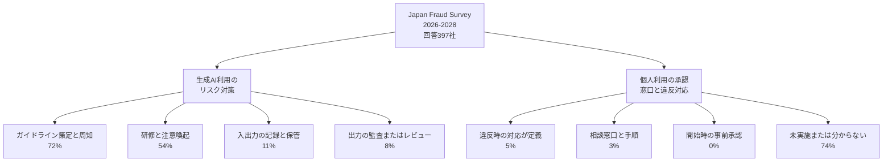

デロイト トーマツ グループは、2026年9月29日に「企業の不正リスク調査白書 Japan Fraud Survey 2026-2028」の結果を公表しました。公開リリースは、業務で使う生成AIのガイドライン策定・周知を72%とし、業務での活用を目的としたAIの個人利用については、社内ガイドラインの策定と周知を5%、未実施または分からないを74%と書いています。

この記事は、その5%と74%、およびリスク対策の72%・54%・11%・8%が、公開された本文と2枚の棒グラフのどこに付いているかを整理します。社内の周知文や規程へ数字を移すときに、どのラベルをどの項目へ対応させるかの材料になります。白書本文は申込フォームの背後にあり、設問票は公開範囲に含まれていません。

*この記事の全体像。以下、順に解説します。*

## 生成AIの個人利用に関する調査とは

### 調査の枠

調査名は「企業の不正リスク調査白書 Japan Fraud Survey 2026-2028」です。2006年からの定期調査で、今回が10回目です。グループCEOは長川知太郎です。

公開されている設計は、対象が上場企業と非上場企業の無作為抽出、期間が2026年5月から8月、回答が397社です。発送数、回収率、回答者の役職、上場と非上場の内訳、Webか紙かは、リリースにありません。

前回調査は2024年10月9日公表、回答714社、調査方法はWebと紙です。その方法は、今回のリリースには書かれていません。

白書案内の目次には「回答企業の分布」と「Chapter 3 Ⅳ AIの個人利用における方針・リスクマネジメント体制」があります。全文PDFの入口は、[申込フォーム](https://tohmatsu.smartseminar.jp/public/application/add/70141)です。

### リリース本文が並べる数字

業務効率化を目的にAIを活用していない企業は9%です。続く文は「これらの企業では」と書き、次の4つを並べます。

| 項目 | 割合 |
|---|---|
| 生成AIのガイドライン策定・周知 | 72% |
| 研修や注意喚起 | 54% |
| 入出力の記録・保管 | 11% |
| 出力の監査またはレビュー | 8% |

次の文は「また」で始まります。業務での活用を目的としたAIの個人利用について、承認フロー、教育、インシデント対応をまとめ、「社内ガイドラインの策定と周知を実施している」企業が5%、「実施していない、わからない」が74%と書きます。

公開文が「個人利用」に付けている限定は、「業務での活用を目的とした」だけです。私用契約か、会社契約の私的利用かは、公開文も公開図も分けていません。

### 二つの図

公開資料は、生成AIのリスク対策と、個人利用の承認・窓口・違反対応を、別の段落および別の図に置いています。

個人利用の図の棒は次のとおりです。図題は「承認フロー、教育、インシデント対応」です。

| 棒のラベル | 割合 |
|---|---|
| 違反時の対応が定義されている | 5% |
| 相談・通報窓口とインシデント対応手順が整備されている | 3% |
| 個人利用開始時の事前承認 | 0% |
| 実施していない・分からない | 74% |

リスク対策の図の棒は次のとおりです。

| 棒のラベル | 割合 |
|---|---|
| 社内ガイドラインの策定と周知 | 72% |
| 研修や注意喚起 | 54% |
| 入出力の記録・保管 | 11% |
| 出力の監査またはレビュー | 8% |

72%の段落は「これらの企業では」と、AIを業務に入れている側へ母数を寄せて書きます。5%と74%の文は、その限定を繰り返しません。図のパーセントに印字された回答数はありません。

## 注意点

### 本文の5%と図の5%は同じラベルを持たない

公開リリースの中で、本文の5%と図の5%は同じ言葉が付いていません。

| 場所 | 5%に付いている言葉 |
|---|---|
| リリース本文 | 個人利用に関する承認・教育・インシデント対応について、「社内ガイドラインの策定と周知を実施している」 |
| 個人利用の図 | 違反時の対応が定義されている |
| 別図（リスク対策） | 生成AI利用に関する社内ガイドラインの策定と周知は72% |

図の代替テキストは「違反対応や相談窓口の整備は5%以下」「74%が未実施または不明」です。本文の「ガイドライン5%」より、図の5%と3%に近い書き方です。

ITmedia AI+（2026年9月29日 17:50）の見出しは「7割の企業が生成AI『個人利用』への対策せず」です。本文が書くのは74%と72%で、5%の文は転記していません。この見出しは、デロイトのリリースを報じた二次情報です。

「個人利用のガイドラインを策定している企業は5%」は、図の棒ラベルと一致しません。72%と5%を、二つのガイドライン整備率として並べる根拠は、公開資料の中で割れています。

### 74%は未整備の企業の割合としては読めない

74%は「実施していない」と「分からない」の合算です。未整備の企業の割合としては読めません。74%を「ルールが無い」と読むのは、合算の言い切りです。

「約7割が個人任せ」は、デロイトのリリース見出しの言い回しです。図の項目名ではありません。担当欄はフォレンジック＆クライシスマネジメントで、隣接案内に Forensic Webinar があります。低い棒を前景にしている、という読みは仮説であり、設問が歪んでいることの証明には使いません。

### 棒の合計と0%の読み方

個人利用の図の4本は 5+3+0+74 で82%です。複数回答か、図に無い選択肢かは、画像に注がありません。図題には「教育」があります。教育だけの棒はありません。

リスク対策の図は 72+54+11+8 で100%を超えます。互いに排他な単一回答としては読めません。

0%は図の表示です。397社なら1社は約0.25%なので、整数パーセントの丸めで0%になり得ます。図に「0社」の注はありません。0社と丸めのどちらでも、公開図だけでは決まりません。

5%と74%の母数が、72%と同じ「AIを業務に入れている企業」かは、公開文が書いていません。

前回調査の方法（2024年10月9日公表、回答714社、Webと紙）は、今回のリリースに書かれていません。前回の方法を、今回の設計として使いません。

### 他の調査のパーセントとは混ぜない

ガイドライン、シャドーAI、事前承認は、調査ごとに別の問いと母数で測られます。この白書の5%や0%を、日本企業一般の個人利用ガイドライン率や事前承認率としては使いません。

### 公開定義がまだ閉じていない点

白書全文を申込のうえ読まないと、次は閉じません。

- 個人利用の設問の選択肢の全文と、単一回答か複数回答か
- 5%、3%、0%、74%の分母が397社全体か、AI利用企業か
- 「分からない」だけの割合と、回答者の役職
- 0%が0社か、丸めか
- 「個人利用」が、私用契約か、会社契約の私的利用か、私用アカウントかを、白書が定義しているか

個人情報保護委員会の令和5年6月2日の注意喚起の別添1（1）は、個人情報取扱事業者に二つの確認を求めます。個人情報を含むプロンプトが、特定された利用目的の範囲内であること。応答以外の目的（機械学習を含む）で個人データが取り扱われるなら、提供事業者がその取扱いをしないことを確認することです。別添1には、このほか（2）行政機関等向けと、（3）一般利用者向けの留意があります。（3）は確認義務の書き方ではなく、機械学習での再利用、不正確な個人情報の出力、利用規約とプライバシーポリシーの確認を挙げます。この注意喚起は、シャドーAI一般の禁止ではありません。

総務省・経済産業省の「AI事業者ガイドライン」（PDFファイル名 `20260331_10.pdf`）は、事業活動以外の利用者を「業務外利用者」と呼び、ガイドラインの対象に含まない、と書きます。表紙の版番号と日付は抽出が重なり、版は断定しません。この「業務外」は、調査の「業務での活用を目的とした個人利用」とは別の概念です。

## 社内規程へ落とすときに分けること

全社の生成AIガイドラインの有無と、個人利用の違反対応・相談窓口・事前承認は、公開資料の上では別の項目です。未整備の間に先に置く一文は、言葉「個人利用」の禁止ではなく、業務上のデータを、会社が契約または承認していないアカウントに入力しない、という行為の指定です。私用アカウントの成果物を業務リポジトリへ入れてよいかは、入力禁止とは別の行にします。

社内に書くときは、次の3行を分けます。

1. 全社の生成AIガイドラインがあるか。公開図では、策定と周知の棒は72%です。これを「個人利用ガイドラインが5%」と書き換えません。
2. 入力してよいアカウント。禁止する行為は、「業務上のデータを、会社が契約または承認していないアカウントに入力しない」と書きます。「個人利用」という語だけでは、私用契約と会社契約の私的利用が分かれていません。
3. 出力を業務のリポジトリや成果物へ入れてよいか。記録11%とレビュー8%は、入力禁止とは別の棒です。入れてよい条件（どのアカウントの出力か、誰が確認するか）を、入力禁止の行とは別に書きます。

禁止の一文を先に出す場合は、代わりに使ってよい手段を同じ案内に書きます。全社で契約したアカウントが既にあるなら、そのアカウント名を書きます。まだ無いなら、「業務データは入力しない。入力が必要な作業は、承認された手段ができるまで人が行う」までを書きます。

IPAの中核人材育成プログラム最終成果の手引書は、公式ガイドラインではありません。手引書にある記述は、禁止だけを先行させると申告されない利用が増えること、過度に厳しいルールは代替手段とセットにすること、入力基準と出力結果の取扱いは表の別行であること、企業ネットワークを経由しない端末からの利用は技術的な制御が難しいこと、です。禁止だけを置いて、申告先も代替も空にする書き方は、この手引書が避ける形です。私用端末は技術的に見えにくい、という記述も残ります。禁止の一文だけを先に周知すれば足りる、という読みは、ここで弱ります。

周知文の根拠には、次の書き方を使います。

- 74%は、「未実施と、分からない、の合計が74%」と書きます。「7割は対策していない」とは書きません。
- 0%は、図の表示が0%である、までにとどめます。「どの企業も事前承認を課していない」とは書きません。

## まとめ

公開リリースの72%は、リスク対策の図では社内ガイドラインの策定と周知です。個人利用の図では、違反時の対応5%、相談窓口と手順3%、事前承認0%、未実施または分からない74%が別の棒です。本文が個人利用の5%に付ける言葉は「社内ガイドラインの策定と周知」ですが、図の5%のラベルは「違反時の対応が定義されている」です。

社内に移すときは、全社ガイドライン、入力してよいアカウント、成果物を入れてよいか、を3行に分けます。74%は合算として書き、0%は図の表示として書きます。分母、単一回答か複数回答か、個人利用の定義は、白書全文を読むまで閉じていません。

この記事が少しでも参考になった、あるいは改善点などがあれば、ぜひリアクションやコメント、SNSでのシェアをいただけると励みになります！

## 参考リンク

- [デロイト トーマツ グループ「生成AIリスク対策は約7割が『個人任せ』」（2026-09-29）](https://www.deloitte.com/jp/ja/about/press-room/nr20260929-2.html)
- [同内容の配信（2026-09-29 16:34）](https://digitalpr.jp/r/142602)
- [個人利用の図](https://digitalpr.jp/simg/2100/142602/700_157_202609291602566abb62a033da2.jpg)
- [リスク対策の図](https://digitalpr.jp/simg/2100/142602/700_156_202609291602566abb62a02f713.jpg)
- [白書案内](https://www.deloitte.com/jp/ja/services/consulting/research/fraud-survey.html)
- [白書全文の申込フォーム](https://tohmatsu.smartseminar.jp/public/application/add/70141)
- [ITmedia AI+（2026-09-29 17:50）](https://www.itmedia.co.jp/aiplus/article/2609/29/2000001855/)
- [個人情報保護委員会「生成AIサービスの利用に関する注意喚起」（令和5年6月2日）](https://www.ppc.go.jp/news/careful_information/230602_AI_utilize_alert/)
- [別添1 PDF](https://www.ppc.go.jp/files/pdf/230602_alert_generative_AI_service.pdf)
- [総務省・経済産業省「AI事業者ガイドライン」PDF](https://www.meti.go.jp/shingikai/mono_info_service/ai_shakai_jisso/pdf/20260331_10.pdf)
- [IPA 中核人材育成プログラム 2026 最終成果の手引書](https://www.ipa.go.jp/jinzai/ics/core_human_resource/final_project/2026/rcu1hd0000018kkn-att/rcu1hd0000019kwj.pdf)
