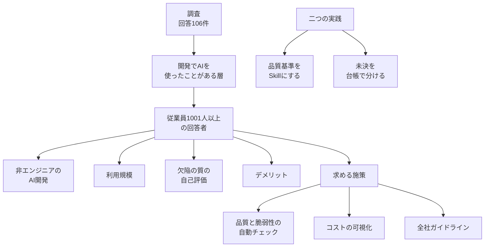

2026年9月30日、ITmedia エンタープライズはキーマンズネットと共同で「[開発におけるAIの活用に関する調査（2026年）](https://www.itmedia.co.jp/enterprise/articles/2609/29/news097.html)」を公開しました。執筆は田中広美です。実査は2026年7月27日から8月5日で、回答は106件です。

この記事は、従業員1001人以上を大企業とした回答のうち、非エンジニアがAIツールで開発していると答えた65.0%が、どの層のどの設問かを整理します。同じ公開記事が示す欠陥の見え方、デメリット、必要施策と、検証の置き方として併記された二つの実践を並べ、社内で数字を使うときの対応を残します。数値は公開記事本文の集計であり、調査票と個票は付いていません。

*この記事の全体像。以下、順に解説します。*

## 開発におけるAI活用調査とは

### 調査が聞いている範囲

記事は、従業員1001人以上を大企業としています。開発でAIを使っている、または使ったことがある層に、非エンジニアがAIツールで開発しているかを尋ねています。同じ記事は、生成コードの欠陥の見え方、デメリット、今後の施策を、企業規模と部門で分けて示しています。

注1の「AIを利用した開発」は、次を含みます。

- コード補完
- 自律エージェント
- バイブコーディング
- ローコード／ノーコードに内蔵されたAI
- 汎用AIチャットを使った開発

### 公開記事が並べる割合

非エンジニアがAIツールで開発している、と答えた割合は、全体40.0%、大企業回答者20件では65.0%です。

| 項目 | 大企業回答者 | 全体または比較 |
|---|---|---|
| 非エンジニアがAIツールで開発している | 20件中 65.0% | 全体 40.0% |
| IT部門の対応が要るトラブルを把握できていない・分からない | 開発でAIを使っている大企業回答者の 55.0% | この設問の全体割合は併記されていない |
| 全社で利用している | 50.0% | 全体 37.8% |
| 欠陥の質の最多 | 検証をしていないため分からない 33.3% | 全体の最多は深い欠陥が増えた、または目立つ 32.5%。未検証は 30.0% で2番目 |
| デメリットの最多（複数回答可） | 理解負債 46.0% | 全体 53.8% |
| レビューに時間がかかる | 26.0% | 全体 21.7% |
| 体感ほど生産性は上がらない | 22.0% | 全体 17.0% |
| 必要施策の1位（複数回答可） | 品質や脆弱性の自動チェック 56.0% | 全体 53.8% |
| 全社ガイドライン | 1001人以上 18.0%。5001人以上 9.1% | 101〜1000人 38.2% |

部門別では、コストの可視化と制限がIT部門41.4%、IT以外26.0%です。非エンジニア向けの開発基盤はIT以外24.7%、IT部門13.8%です。大企業のIT部門14件では、品質チェックとコストの可視化が同率64.3%です。

非エンジニアのAI開発を取りやめるべき、と答えた割合は、IT部門13.8%、IT以外1.3%です。記事は、この層は少ないので参考程度、と書いています。

### 併記されている二つの実践

検証の置き方の事例として、公開記事は次の二つを併記しています。

[バクラクQAの Skill](https://tech.layerx.co.jp/entry/articulatin_quality) は、フェーズごとの品質、プロダクト固有のリスクと基準、自動テストの範囲を手順に載せます。skill-creator の Evals の一例では、スキルなしのテストカバレッジが65%、ありが95%です。続編は、共有テンプレートを埋める Skill で、会議中に叩き台が出たと書いています。

[カンリーの設計フェーズ](https://zenn.dev/canly/articles/2a9002ac195232) は5ファイル、約6700行です。モブは1日1時間です。未決は台帳に載せる前に、既決か、後続で決まるか、閉じる前に決めるかに分けました。AIは500件程度を処理する前提で設計を進めようとしていました。数千件規模のデータを持つ利用顧客がいるため、処理できる件数に上限を設け、上限を超える分は今回の対象外にしました。

### 設問と実践の位置

左側は調査の設問の並びです。右側は、バクラクQAが品質の言語を Skill に載せたことと、カンリーが設計の未決を台帳で分けたことです。

## 注意点

### 65.0%の母集団

見出しの「大企業回答者の過半数」は、従業員1001人以上の会社一般の過半ではありません。65.0%の母集団は、開発でAIを利用している、または利用したことがある大企業回答者20件です。単位は企業数ではなく回答者数です。1社1人かは記事に書いていません。

定義はチャットと補完を含むので、本番の業務システムを非エンジニアが作っている割合でもありません。設問は自己申告です。

開発でAIを利用している大企業回答者の55.0%は、IT対応が要るトラブルや事件を把握できていない、または分からないと答えています。記事はこの55.0%の分母を20件とは書いていません。

### 割合の刻み

20件の1件は5.0ポイントです。65.0%、55.0%、50.0%はこの刻みに合います。33.3%、46.0%、26.0%、22.0%、56.0%、18.0%は乗りません。記事はこれらの分母を20件とは書いていません。設問ごとに分母が変わると読むのが、本文と整合します。記事に無い分母は補いません。

デメリットと必要施策は複数回答可です。合計は100%を超えてよいです。

106件の抽出枠、回収率、信頼区間は記事にありません。注3が「Webサイト上の自記式・読者」と書くのは別調査です。期間は2026年6月10日から24日、回答360件、「成果を測る指標がない」が35.8%です。106件を読者調査だと、公開記事は断定していません。

20件のうち13件にあたる65.0%を、独立な単純無作為抽出とみなした場合の95% Wilson区間は、およそ43%から82%です。区間は過半未満を含みます。抽出が無作為ではないので、この区間は母比率の推定には使いません。

取りやめ派の13.8%と1.3%には、層が少ないので参考程度、という但し書きが付いています。65.0%と、大企業IT部門14件の64.3%には、同じ但し書きは付いていません。

### 三つの境界は設問に無い

外部公開、権限、データの書き込みだけを人の確認に残す、という分け方は、調査の設問にも記事の結論にもありません。記事の結論は、開発を止めず、利用とコストを可視化し、生成コードを検証する土台をITが用意する、です。三つの境界は、この調査を読んだうえでの解釈です。

### 二つの事例の数字

調査の設問は、バクラクQAの Skill とカンリーの台帳を選んだ割合を聞いていません。二つは、検証の置き方の事例として併記されています。

LayerX の65%と95%は、skill-creator の Evals の一例のテストカバレッジです。欠陥数、件数、再現条件は記事にありません。人は生成物を確認し、妥当性を判断し、チューニングする、と著者は書いています。[続編](https://tech.layerx.co.jp/entry/10minute_test_plan_gen)の「10分以内くらい」は、Google Testing Blog の題へのオマージュであり、統制した計測ではありません。

続編が言う理解負債は、共有テンプレートを他チームが読めるかです。調査が言う理解負債は、生成コードの意図を理解しないまま使うことです。同じ言葉でも、指す対象が違います。

カンリーの記事は、500件程度を処理する前提で設計を進めようとした、と書きます。採用した上限の数値は記事にありません。数千規模は、管理しているデータの規模であり、顧客数が数千という意味ではありません。同じ記事は「開発サイクルを一巡していません」と二度書いています。2026年10月1日の検索では、カンリーまたは三上が AI-DLC を3周したと書く一次情報は見つかりませんでした。3周が公開記事以外の記録にある可能性は残ります。

### 母集団の違う調査は足さない

次の二つは、106件とは母集団が違います。パーセントを106件へ足しません。

| 調査 | 母集団 | ここで使う数値 | 106件との差 |
|---|---|---|---|
| [EY US AI Risk and Governance Survey](https://www.ey.com/en_us/newsroom/2026/09/ey-survey-finds-that-autonomous-ai-implementation-outpaces-oversight-yielding-an-ai-governance-gap)。公表 2026-09-15。実査 2026-05-28〜06-15 | 年商10億ドル以上の公開会社。回答者は米国の取締役、CxO、VP以上で、AIシステム、ガバナンス、または監査を直接監督する202名。誤差±7ポイント（95%信頼区間）は総数202 | 方針あり98%。緊急の導入で自社の手続きを適用しなかった47%。過去1年のAI関連リスク89%（サイバー52%、人的47%、シャドーAI 46%）。重大な負の影響があったインシデントまたは障害36%。エージェンティックAI利用組織に限ると、フレームワーク未更新49%、無許可エージェントを検知できない26%、少なくとも一部がリアルタイムの人の関与なし85%。この三つの誤差は、総数202の±7ポイントをそのまま当てない | 日本の読者媒体の開発担当ではない。方針の素通りの自己申告としてだけ使う |
| [ファインディ「開発資本 実態調査」](https://findy.co.jp/4529/)。公表ページを2026-10-01に確認。実査 2026-07-01〜07-15 | Findy Team+ 導入企業を中心とした開発責任者、マネジメント層。有効185名 | ルール明文化の合計83%。遵守のモニタリングまたは監査6%。ログ未取得または一部のみ60%。ハーネスはチーム整備62%が最多、組織全体で継続的に遵守4% | 非エンジニアの事業部門ではない。ベンダー顧客への調査でもある |

## 人の確認をどこに残すか

ここでの問いは、ITが非エンジニアのAI開発を禁止せず、検証対象を分類し、全件の人の確認が無理なときに、見る範囲をどう残すかです。社内で65.0%を使うときは、「開発でAIを使ったことがある大企業回答者20件のうち65.0%」と置きます。大企業一般の過半が実施している、とまではこの数字から言いません。

### 主張と、それを弱める材料

| 主張 | 支持 | 弱める材料 |
|---|---|---|
| 大企業では非エンジニアのAI開発が過半まで広がっている | 大企業回答者20件の65.0%。全体は40.0%。全社利用は大企業50.0%、全体37.8% | 母集団は、開発でAIを使ったことがある回答者。定義はチャットと補完を含む。自己申告。20件。参考の Wilson 区間は過半をまたぐ |
| 禁止を既定にしない | 記事の結論。取りやめ派は参考値（IT 13.8%、IT以外 1.3%） | 開発でAIを使う大企業回答者の55.0%は、IT対応が要るトラブルを把握できていない。見えていない層の「禁止不要」は弱い |
| 全件の人の確認を既定の運用にできない | レビュー時間がデメリット（大企業26.0%）。カンリーは設計1フェーズが約6700行で、1日1時間では全部読めないと書く | 絞ったあとの人の仕事は、三つの境界ではなく、割れた論点と、いつ決めるかだった。一巡前の記録であり、運用の成功例ではない |
| 三つの境界で足りる | 調査結果としては無い。外へ出るもの、権限、書き込みは、影響が外へ出る境界の例にはなる | 最多デメリットは理解負債（大企業46.0%）。理解していないコードは、公開も権限変更も書き込みもせずに社内業務へ入る。カンリーが実装前に決めた復旧経路、処理時間の実測、件数の上限を超える分を今回提供しない、は三つの境界の外。上限の数値は記事に無い。経費精算や会計に触れる社内ツールは、外部公開しなくてもデータの書き込みそのものが業務になる |
| ガイドラインを書けば足りる | 101〜1000人では38.2%が全社ガイドラインを選んだ | 1001人以上は18.0%、5001人以上は9.1%。選ばれないことは、不要の証明ではない。別標本では、方針98%でも緊急時に47%が手続きを飛ばし、明文化83%でも監査は6% |
| 自動チェックを入れれば足りる | 必要施策の1位（大企業56.0%、全体53.8%）。大企業IT 14件ではコスト可視化と並び64.3% | 自動チェックは理解負債の対策としては記事が書いていない。カンリーの「提供しない範囲」は、スキャナの検出項目ではない |
| LayerX の Skill が事業部門の品質を証明する | 基準を Skill にすると、一例ではカバレッジが65%から95%になり、リスクに沿ったテスト項目が出た | 指標はカバレッジ。欠陥数は不明。前提は、品質の言語を既に持つQA。続編は叩き台であり、そのまま使わない、と書く |

自由回答は率ではありません。若手の経費精算ツールが異動後に動かなくなった例、経理の独自ツールがセキュリティソフトに検知された例、過信した仕組みが予想外の実務でエラーになった例があります。前の二つは、外部公開の前に社内で起きています。三つの境界のどれで止まっていたかは、記事からは判定できません。

### 五つの置き方

| 基準 | 開発を止める | ガイドラインだけ | 全件レビュー | 三つの境界に固定 | 分類して人の判断を残す |
|---|---|---|---|---|---|
| 調査の結論との一致 | 記事は止めない、と書く | 規模が上がると選択率が下がる | 記事は検証する、とは書く。全件とは書かない | 設問に無い | 可視化、自動チェック、人の検証を分けて置ける |
| 量に耐えるか | 耐える。開発でAIを使ったことがある大企業回答者20件のうち65.0%が、非エンジニアの実施と答えている。開発を止める方針は、その自己申告と衝突する | 文書は耐える。監査は別標本で6% | 6700行とレビュー時間に衝突する | 境界の件数だけなら減る | 境界と、割れた論点だけを人に残す |
| 理解負債 | 発生源を止める | 拾わない | 読む時間があれば拾いうる | 拾わない | 意図を説明できるかを人の問いに残す |
| 提供範囲 | 新機能も止める | 拾わない | 確認する人が気づけば拾う | 拾わない | カンリーが台帳に残した種類を残す |
| この調査での根拠 | 参考値の13.8%と1.3% | 18.0%まで低下 | 直接の設問は無い | 解釈 | 1位の施策と、記事が土台と呼んだ役割を組み合わせた解釈 |

### 残す四つの分類

禁止を既定にはしません。根拠は、取りやめ派を記事が参考値にとどめ、結論で止めないと書いていることです。

人の確認を三つの境界に固定しません。全件レビューも既定にしません。残す分類は次の四つです。

1. 外へ出るもの、権限、データの書き込み。回答が1位に選んだ品質と脆弱性の自動チェックは、この境界の機械側に置きます。大企業のIT部門14件が同率で選んだコストの可視化も、同じ土台に置きます。
2. 意図を説明できるか。理解負債がデメリットの最多です。説明できない生成物は、公開も権限変更も書き込みもしていない段階で止めます。
3. 今回提供しない範囲と、実装前に決めないと進めない項目。カンリーの例は、件数の上限、認可の範囲、失敗時の復旧、処理時間の実測です。認可は1の権限と重なります。残りは重なりません。
4. トラブルの有無を把握しているか。開発でAIを利用している大企業回答者の55.0%は、IT対応が要るトラブルや事件が起きたかを把握できていない、または分からないと答えています。例外のときだけ人が見る運用が成立するかは、この設問からは分かりません。確認の範囲を細くする前に、何が起きているかを見る手段があるかを確認します。

ガイドラインは、この四つを書いた文書としては使えます。文書だけを確認の関門にすると、別標本では素通りと未監査が残ります。

### まだ記事から決まらないこと

- 33.3%、46.0%、56.0%、18.0%、9.1%の分母。個票が無い限り確定しません。
- 106件の抽出枠と回収率。記事は書いていません。
- 三つの自由回答が、自動チェック、権限、書き込みのどれで止まっていたか。
- カンリーの「3周」が、公開記事以外の記録にあるか。公開されている一次情報は、一巡前です。
- 事業部門に、バクラクQAと同種の品質の言語を書ける人がいるか。
- 書き込みそのものが業務のツールで、書き込みの確認を残すと全件レビューに戻るか。この調査はその件数を測っていません。

## 品質の言語を手順へ載せる条件

バクラクQAの Skill は、品質の言語を既に持つQAが、テスト計画の叩き台を会議中に出す一つのやり方です。載せる中身は、フェーズごとの品質、プロダクト固有のリスクと基準、自動テストの範囲です。

カバレッジが65%から95%になった一例は、その組織の欠陥が減った証明ではありません。続編は、共有テンプレートを埋める Skill であり、出てきたものは叩き台です。そのまま使いません。

非エンジニアの部門へこの形を移す前に、基準を書ける人がいるかを別に見ます。調査の理解負債（生成コードの意図を理解しないまま使うこと）と、続編の理解負債（他チームがテンプレートを読めるか）は、別の問いにします。

## 未決を台帳で分ける条件

カンリーが設計の未決を台帳に載せる前に分けたのは、次の三つです。

- 既に決まっている
- 後続で決まる
- 閉じる前に決める

設計は5ファイル、約6700行で、モブは1日1時間です。全部を人が読む前提には置けません。AIが500件程度を処理できる前提で進もうとしたのに対し、数千件規模のデータを持つ利用顧客がいるため、処理件数に上限を置き、上限を超える分は今回の対象外にしました。上限の数値自体は記事にありません。

この記録は、開発サイクルを一巡する前のものです。復旧経路、処理時間の実測、今回提供しない範囲は、外部公開、権限、書き込みの三つの境界には収まりません。台帳に残す価値は、境界の外にある「今回やらないこと」と「実装前に決めないと進めないこと」を、人の問いに残す点にあります。

## まとめ

65.0%は、開発でAIを使ったことがある大企業回答者20件のうち、非エンジニアがAIツールで開発していると答えた割合です。従業員1001人以上の会社一般の過半でも、本番システムを非エンジニアが作っている割合でもありません。定義はチャットと補完を含み、設問は自己申告です。

開発は止めません。人の確認は、外へ出るもの、権限、データの書き込みだけに固定しません。意図を説明できるか、今回提供しない範囲、実装前に決める項目、トラブルの有無を把握しているかを、同じ分類に残します。自動チェックとコストの可視化は、境界の機械側と土台に置きます。品質の言語を Skill に載せるのは、基準を書ける人がいるときの叩き台です。カバレッジの一例は、欠陥が減った証明には使いません。

この記事が少しでも参考になった、あるいは改善点などがあれば、ぜひリアクションやコメント、SNSでのシェアをいただけると励みになります！

## 参考リンク

- 田中広美「大企業回答者の過半数が非エンジニアによるAI開発を実施」ITmedia エンタープライズ、2026-09-30。https://www.itmedia.co.jp/enterprise/articles/2609/29/news097.html
- 小山「品質の言語化のススメ」LayerX TECHBLOG、2026-05-01。https://tech.layerx.co.jp/entry/articulatin_quality
- コヤマン「The 10 Minute Test Plan Generate」LayerX TECHBLOG、2026-09-30。https://tech.layerx.co.jp/entry/10minute_test_plan_gen
- 三上「AI-DLCで設計してみたら、自分たちが決めていなかったことに気づいた」Zenn、2026-09-16。https://zenn.dev/canly/articles/2a9002ac195232
- EY「EY survey finds that autonomous AI implementation outpaces oversight, yielding an AI governance gap」2026-09-15。https://www.ey.com/en_us/newsroom/2026/09/ey-survey-finds-that-autonomous-ai-implementation-outpaces-oversight-yielding-an-ai-governance-gap
- ファインディ「【開発資本 実態調査】AIが品質に与えた影響を、自社データで説明できない組織が3社に1社」。実査 2026-07-01〜07-15。https://findy.co.jp/4529/
