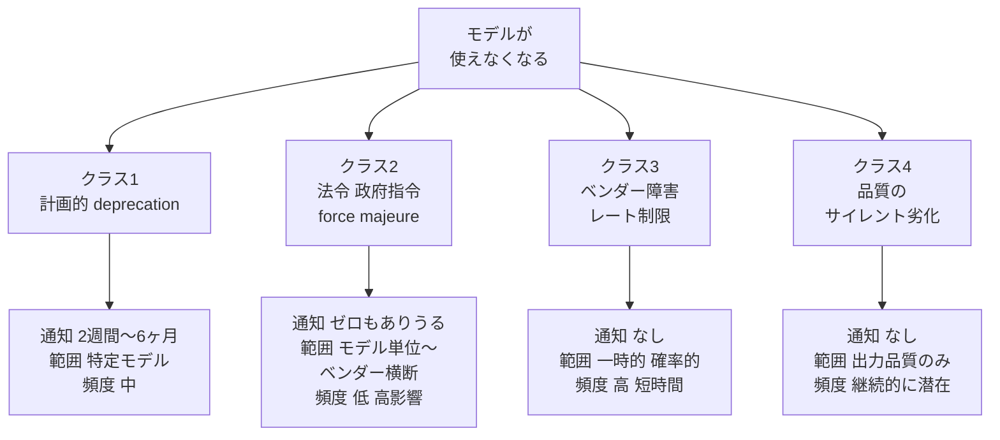
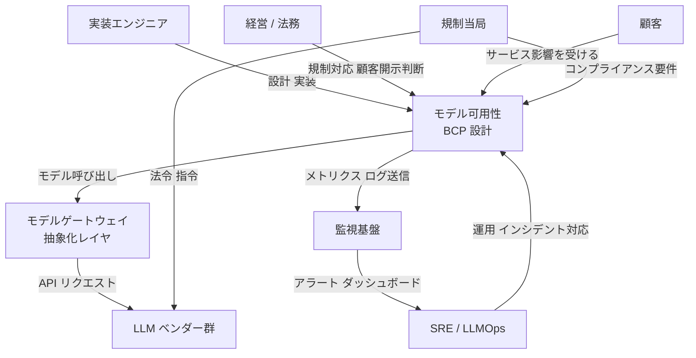
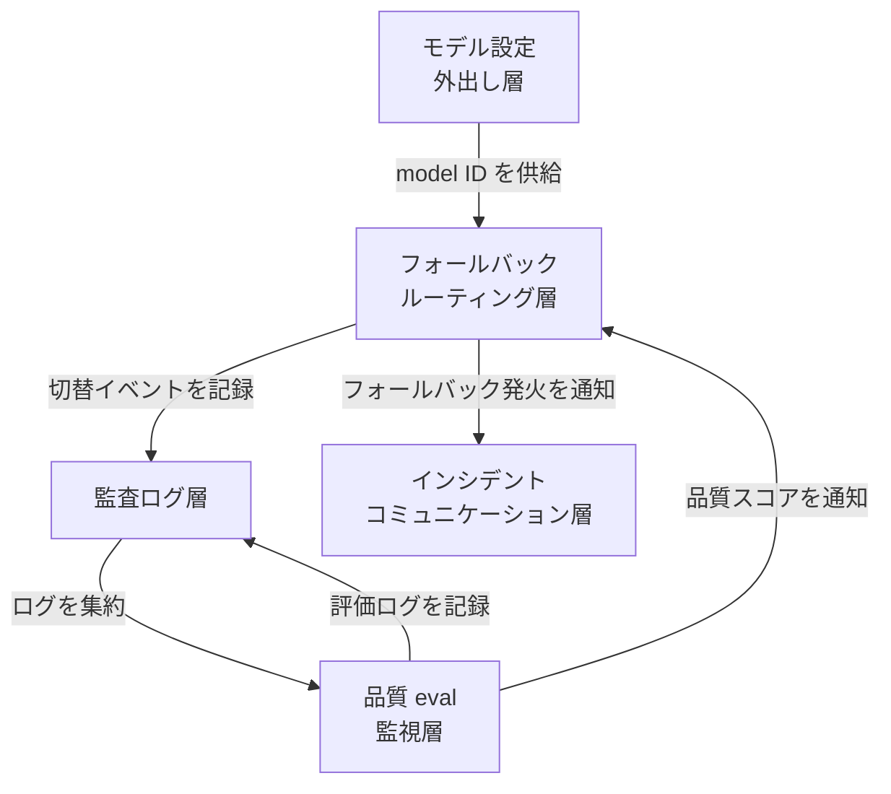
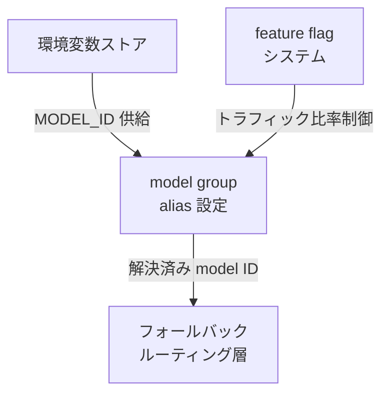
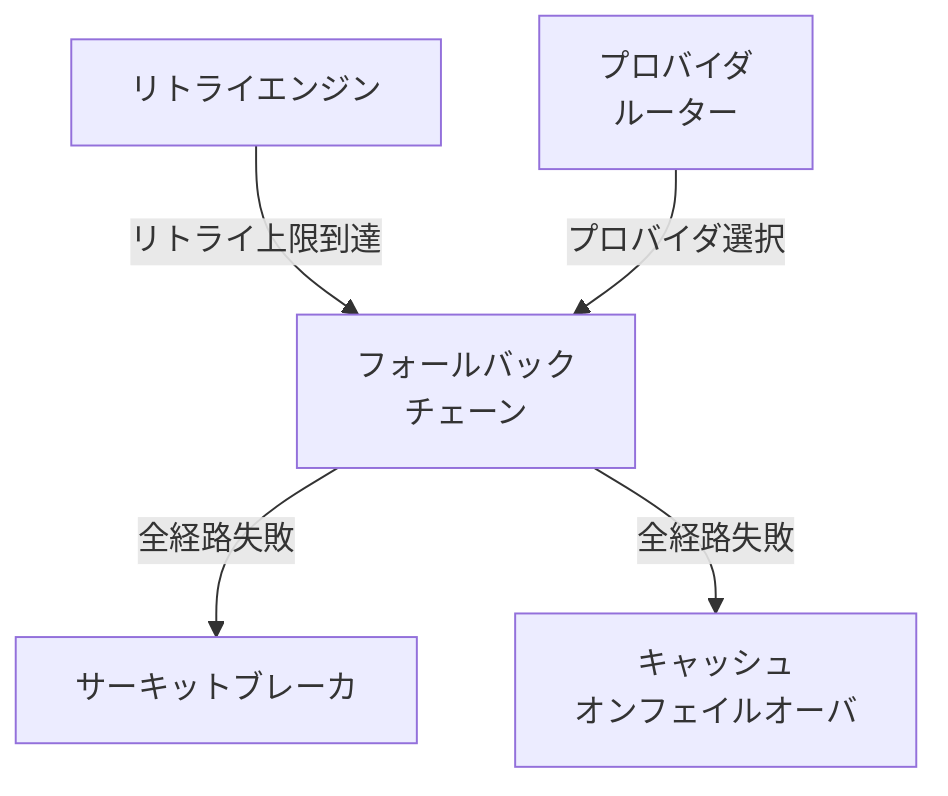
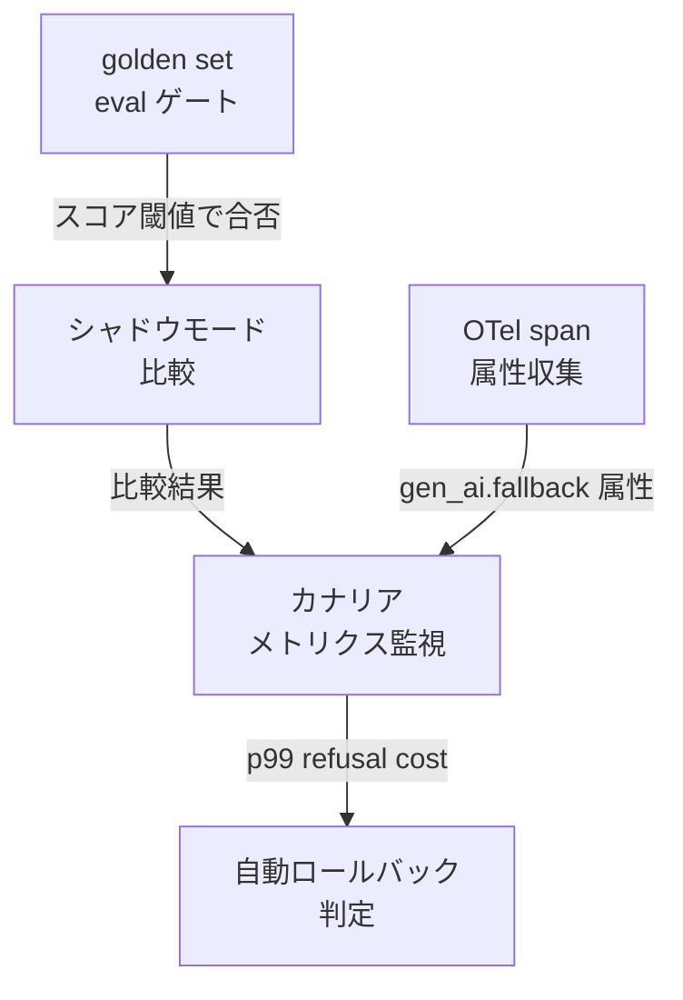
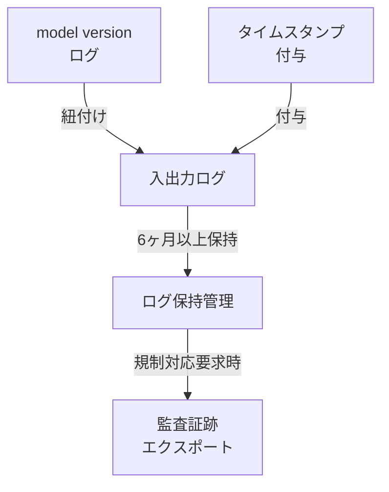
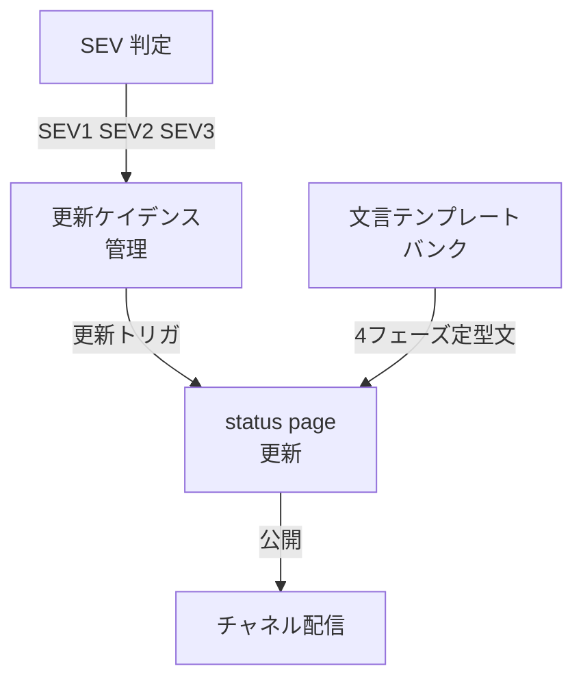
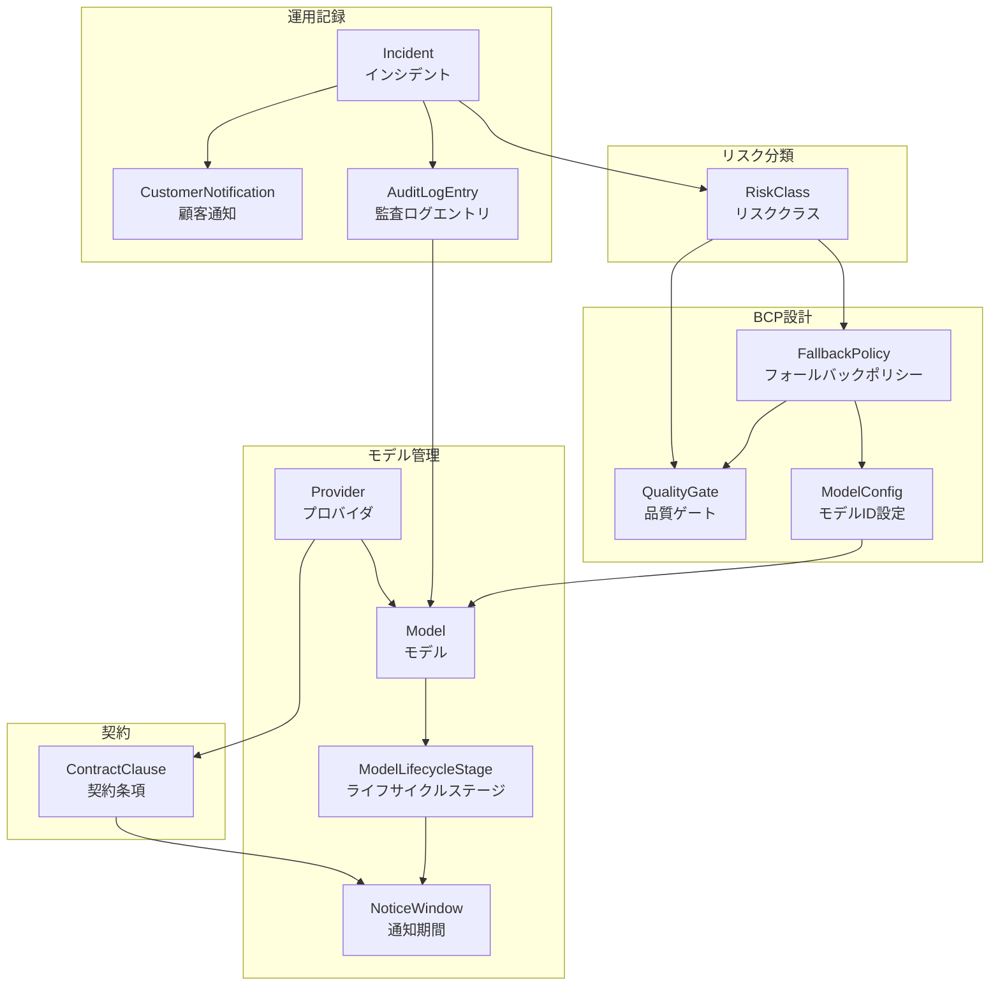
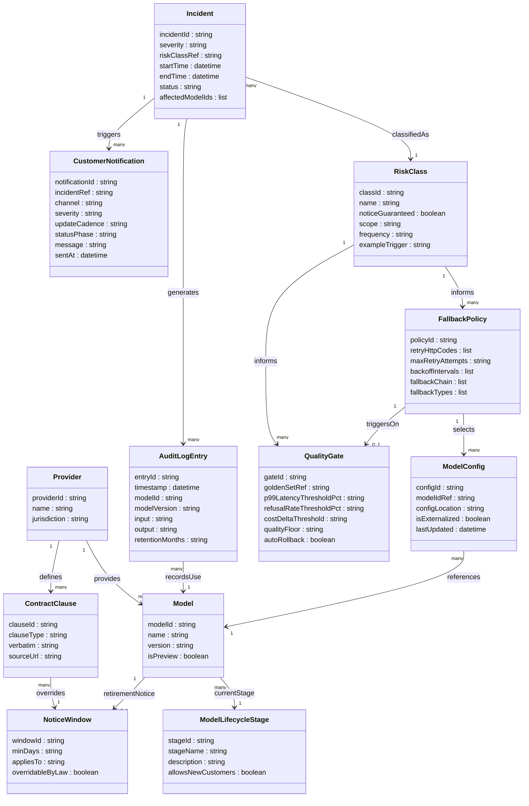

> 検証日: 2026-06-14 / 契機: 2026-06-12 の Anthropic Claude Fable 5 / Mythos 5 米政府指令停止
> 対象読者: 実装エンジニア / LLMOps / SRE

## ■概要

AIモデル可用性 BCP（Business Continuity Plan）は、「特定の AI モデルが突然使えなくなる」リスクを事前に想定し、サービスを継続できるようにする運用設計です。

従来のシステム可用性設計は「ベンダー障害」や「計画メンテナンス」を主な中断シナリオとして想定してきました。しかし 2026 年 6 月 12 日の事象は、それとは異なる種類の中断——**規制当局の指令による予告なしの即時停止**——が現実に起きることを示しました。

### 契機イベント: Fable 5 / Mythos 5 の即時停止（2026-06-12）

2026 年 6 月 12 日（金）17:21 ET、Anthropic は米商務省からの**輸出管理指令**を受け、最新モデル **Claude Fable 5** および非公開上位モデル **Claude Mythos 5** を**全顧客向けに即時無効化**しました（Anthropic 公式声明より）。

指令の対象は「米国内外を問わず、すべての外国籍者（自社の外国籍従業員を含む）への提供」でした。外国籍ユーザーと国内ユーザーをリアルタイムに選別することが実務上不可能なため、Anthropic はコンプライアンス確保の手段として**全面停止**を選択しました。

この事象には次の3つの特徴があります。

1. **通知ゼロ・即日全停止だった** — 通常の計画的 deprecation で保証される通知期間が一切適用されませんでした。
2. **契約上、通知ゼロは規約どおりだった** — 各ベンダーの利用規約には法令遵守 / force majeure 条項があり、それが通知日数の保証を上書きします。
3. **同一ベンダー内で生き残ったモデルがあった** — 停止対象は Fable 5 / Mythos 5 のみで、Claude Opus 4.8 等は影響を受けませんでした。

本ドキュメントは、この事象を起点に「AIモデルが突然使えなくなる」リスクを4クラスに分解し、クラスごとに効く対策・効かない対策を、構造・データ・実装・運用の各面から整理します。

> 不確実性の明示: 援用された具体的法令名（IEEPA / ECRA / EAR の deemed export 条項のいずれか）は公式声明に明記されておらず "national security authorities" の総称のみです（[未確認]）。政府側の制限解除条件・期限も確認できていません（[未確認]）。事実は一次ソース（Anthropic 公式声明）と複数報道のクロスチェックに基づきますが、WebFetch がブロックされた一部報道（Bloomberg / CNBC / CNN / NBC / Axios）は検索スニペット経由のため [二次情報] とマークします。

## ■特徴

### 特徴1: 「モデルが消える」を4クラスに分解する

「特定モデルが突然使えなくなる」を単一リスクとして扱うと、対策を誤ります。発生メカニズム・通知の有無・影響範囲が異なる4クラスに分けると、クラスごとに効く対策が変わります。



| クラス | 発生メカニズム | 通知 | 影響範囲 | 頻度 |
|---|---|---|---|---|
| **1. 計画的 deprecation** | ベンダーによる計画退役 | 2週間〜6ヶ月あり | 特定モデル | 中 |
| **2. 法令・政府指令 / force majeure** | 規制当局の指令、輸出管理、不可抗力 | ゼロもありうる | モデル単位〜ベンダー横断 | 低・高影響 |
| **3. ベンダー障害・レート制限** | API 障害、過負荷、429 / 5xx | なし | 一時的・確率的 | 高・短時間 |
| **4. 品質のサイレント劣化** | モデルの内部更新、プロンプト感度の変化 | なし | 出力品質のみ | 継続的に潜在 |

今回の事象はクラス2に該当します。クラス1への備え（計画退役の前倒し移行）をいくら整えても、クラス2を防ぐことはできません。

### 特徴2: ベンダー横断の最小通知日数は桁が違う

計画的 deprecation（クラス1）において、主要ベンダーは一定の通知期間を設けています。一次ソースで確認した最小通知日数を横並びにすると、**preview と GA の間で桁が一つ違います**。

| ベンダー | GA / 公開モデルの最小通知 | preview / experimental | 出典 |
|---|---|---|---|
| **Anthropic** | **60日以上** | 明示なし | [platform.claude.com/docs](https://platform.claude.com/docs/en/docs/about-claude/model-deprecations) |
| **OpenAI** | **GA: 6ヶ月以上** / specialized variant: 3ヶ月以上 | **2週間程度** | [developers.openai.com](https://developers.openai.com/api/docs/deprecations) |
| **Microsoft Azure Foundry** | **60日以上**（GA ライフサイクルは launch から18ヶ月） | **30日以上** | [learn.microsoft.com](https://learn.microsoft.com/en-us/azure/ai-foundry/openai/concepts/model-retirements) |
| **Google Vertex / Gemini** | GA の一律日数の明示なし（"earliest possible date" + advance notice 方式）[未確認] | **2週間以上**（preview。[models 頁](https://ai.google.dev/gemini-api/docs/models)に明記）/ experimental は subject to change | [ai.google.dev](https://ai.google.dev/gemini-api/docs/deprecations) |
| **Amazon Bedrock** | Legacy 入り後 **6ヶ月以上**（launch から EOL まで最短12ヶ月） | preview 固有ポリシーの記載は薄い | [docs.aws.amazon.com](https://docs.aws.amazon.com/bedrock/latest/userguide/model-lifecycle.html) |

BCP 設計上は「最弱リンク = preview / experimental の2週間（または通知なし）」を前提に置くことが適切です。また Anthropic の通知は Claude API 直販のみに適用され、Amazon Bedrock 経由の場合は Bedrock 側のライフサイクル日程が優先されます。

### 特徴3: 通知日数の保証は法令遵守 / force majeure 条項で上書きされる

上記の通知日数は「計画的な退役（deprecation）」に対する commitment にすぎません。主要ベンダーの利用規約・サービス条件には、法令遵守・政府指令・不可抗力による**即時停止を認める条項**が概ね存在し、それが通知日数の保証を上書きします（AWS / Azure は一般条件またはサービスライフサイクル文書上の例外として規定。逐語の確認状況は下表と[未確認]マークを参照）。

| ベンダー | 即時停止を認める条項（要旨） | 出典 |
|---|---|---|
| **Anthropic** | Commercial Terms I.2.c / I.3.a: applicable law で禁止されると判断した場合は**即時 terminate / suspend** 可。M.10 force majeure で履行遅延を免責 | [anthropic.com/legal/commercial-terms](https://www.anthropic.com/legal/commercial-terms) |
| **OpenAI** | "required to do so by law" なら access を **limit / suspend** 可。force majeure の列挙語に **"governmental action"** を明記 | [openai.com/policies/services-agreement](https://openai.com/policies/services-agreement/) |
| **Microsoft Azure** | "compliance or security issues" 発見時は **emergency retirement（短縮通知）** を留保 | [learn.microsoft.com](https://learn.microsoft.com/en-us/azure/ai-foundry/openai/concepts/model-retirements) |
| **Google Cloud** | TOS 1.4(e): 12ヶ月通知の例外として **"comply with applicable law"** を明記。pre-GA は "changed, suspended or discontinued at any time without prior notice" | [cloud.google.com/terms](https://cloud.google.com/terms) |
| **Amazon Bedrock** | EOL 通常スケジュールに "private arrangement" 例外あり。AWS 一般規約の law / force majeure 条項が適用（逐語は[未確認]） | [docs.aws.amazon.com](https://docs.aws.amazon.com/bedrock/latest/userguide/model-lifecycle.html) |

計画的 deprecation の通知日数（lifecycle 文書の commitment）と、法令/政府指令による即時停止（Terms の suspension / force majeure 条項）は**別レイヤー**です。後者が前者を上書きするため、「数ヶ月の猶予があれば移行できる」という前提だけで BCP を組むと、今回のような事象に無防備になります。

### 特徴4: 同一ベンダー内の別モデルへの退避で凌げる場合がある

今回の停止は Fable 5 / Mythos 5 の2モデルのみで、Claude Opus 4.8 等の他モデルは影響を受けませんでした。この事実は BCP 設計の方向性を大きく左右します。

規制による停止は「ベンダー全体」ではなく「特定モデル単位」で発動しうる点が重要です。一方で Anthropic 自身が「この基準を業界全体に適用すれば、全フロンティアプロバイダの新モデル展開を実質停止させる」と述べており（[Fortune](https://fortune.com/2026/06/13/anthropic-disables-fable-mythos-export-controls-national-security-threat/) [二次情報]）、規制はベンダー横断で同時に効く可能性もあります。この非対称性が、「マルチプロバイダ化」という直感的な対策がクラス2に対して**的外れになりうる**理由です。

## ■構造

「モデル可用性 BCP」は具体的な単一システムを持たない設計方法論のため、C4 model を「BCP 設計の論理構造」に読み替えて表現します。

### ●システムコンテキスト図



| 要素名 | 説明 |
|---|---|
| 実装エンジニア | model ID 外出し・フォールバック設定・eval 統合を担うアプリ開発者 |
| SRE / LLMOps | インシデント検知・退避 runbook 実行・カナリアロールアウト管理 |
| 経営 / 法務 | 規制対応の意思決定・顧客向け公式説明の承認・SLA 影響判断 |
| 顧客 | モデル変更による出力品質変動・サービス停止の影響を受ける利用者 |
| モデル可用性 BCP 設計 | 本設計の対象。クラス別リスクに対応する構成要素群の総体 |
| LLM ベンダー群 | API を提供するプロバイダ。規制・障害・deprecation の発生源 |
| 規制当局 | 輸出管理・AI 規制（EU AI Act 等）を通じてベンダーと設計に制約を課す |
| モデルゲートウェイ / 抽象化レイヤ | 複数プロバイダへのルーティング・フォールバックを束ねる中間層 |
| 監視基盤 | OTel トレース・メトリクス・アラートを受け取る可観測性インフラ |

### ●コンテナ図



| 要素名 | 説明 |
|---|---|
| モデル設定外出し層 | model ID・プロバイダ設定を環境変数・設定ファイル・feature flag で管理し、コード変更なしの切り替えを可能にする |
| フォールバック・ルーティング層 | retry-then-fallback チェーン・プロバイダルーティング・サーキットブレーカを実装し、自動切替を担う |
| 品質 eval・監視層 | golden set eval によるフォールバック候補の事前検証と、本番出力の継続品質監視を行う |
| 監査ログ層 | model version・タイムスタンプ・入出力を紐付けて記録し、規制対応・責任分界・品質劣化の事後分析を支える |
| インシデント・顧客コミュニケーション層 | SEV 別更新ケイデンス・status page 文言テンプレートを用意し、顧客とステークホルダへの説明を定型化する |

### ●コンポーネント図

#### モデル設定外出し層



| 要素名 | 説明 |
|---|---|
| 環境変数ストア | MODEL_ID 等の設定値をコードから分離して保持する。例: `MODEL_ID=claude-opus-4-8` |
| feature flag システム | カナリア比率や kill switch をコード変更なしに制御する。LLM 切替の瞬時停止にも使用 |
| model group alias 設定 | 論理モデル名と実 model ID のマッピング定義。例: LiteLLM `model_group_alias`、OpenRouter `models` 配列 |

#### フォールバック・ルーティング層



| 要素名 | 説明 |
|---|---|
| リトライエンジン | 429 / 5xx を対象に exponential backoff + jitter でリトライする。4xx はリトライしない |
| フォールバック・チェーン | retry 上限到達後に次候補モデルへ順次切り替える。例: `fallbacks=[{"claude-fable-5": ["claude-opus-4-8"]}]` |
| サーキットブレーカ | 一定失敗数（allowed_fails）超過でデプロイを cooldown し、カスケード障害を防ぐ |
| プロバイダルーター | latency / cost / throughput 等の戦略でプロバイダを選択する。例: LiteLLM `routing_strategy`、OpenRouter `provider.order` |
| キャッシュオンフェイルオーバ | 全自動経路が失敗した際にセマンティックキャッシュ応答を返すか、degraded UI へ落とす |

#### 品質 eval・監視層



| 要素名 | 説明 |
|---|---|
| golden set eval ゲート | フォールバック候補を事前に同一データセット・同一 assert で評価し、品質閾値を超えたものだけを採用候補とする |
| シャドウモード比較 | 本番リクエストを現行・候補の両モデルに並行送信し、出力差分を自動採点する（コスト約2倍） |
| カナリアメトリクス監視 | 1% → 5% → 20% → 50% → 100% の段階トラフィックで p99 latency・refusal rate・cost を追跡する |
| OTel span 属性収集 | `gen_ai.fallback.reason` / `gen_ai.fallback.hop` / `gen_ai.fallback.route` 等の**カスタム属性例**で稼働中モデルを可視化する（OTel gen_ai semantic conventions の標準属性ではない。独自属性は `app.llm.fallback.*` 等の名前空間にする案も可） |
| 自動ロールバック判定 | p99 latency +40% 超・refusal rate +5% 超・cost delta 超過のいずれかで自動ロールバックを発火する |

#### 監査ログ層



| 要素名 | 説明 |
|---|---|
| model version ログ | 各リクエストに使用 model ID とバージョンを記録する。切替前後の出力差の根拠になる |
| 入出力ログ | 入力プロンプト・出力テキスト・tool call を記録する。EU AI Act Article 12 の記録要件に対応 |
| タイムスタンプ付与 | 開始・終了日時を各ログに付与する。「使用期間の記録」要件に直結 |
| ログ保持管理 | 最低6ヶ月の保持期間を設定し、削除ポリシーをドキュメント化する |
| 監査証跡エクスポート | 規制当局・法務・顧客からの説明責任要求に応じてログを出力する機能 |

#### インシデント・顧客コミュニケーション層



| 要素名 | 説明 |
|---|---|
| SEV 判定 | 影響範囲・収益インパクトに基づき SEV1〜3 を割り当て、対応優先度を決める |
| status page 更新 | 外部公開のインシデントページを更新する。モデル変更による品質変動も degraded performance として掲載 |
| 文言テンプレートバンク | Investigating / Identified / Monitoring / Resolved の4フェーズ別に定型文を事前準備する |
| 更新ケイデンス管理 | SEV1: 20〜30分ごと / SEV2: 4時間ごと / SEV3: 営業時間内 の頻度を自動リマインドする |
| チャネル配信 | Slack（内部）/ メール / SMS / status page（外部）へ重大度別に配信する |

## ■データ

### ●概念モデル



| 要素名 | 説明 |
|---|---|
| RiskClass | モデル可用性リスクの4分類（計画 deprecation / 法令・force majeure / ベンダー障害 / 品質劣化） |
| Provider | LLM API を提供するベンダー。法管轄（jurisdiction）を持つ |
| Model | 個別のモデル。ライフサイクルステージと通知期間を持つ |
| ModelLifecycleStage | Active / Legacy / Deprecated / Retired / EOL 等の段階 |
| NoticeWindow | 退役通知の最小日数。契約条項により上書きされうる |
| ContractClause | force majeure / 法令遵守による即時停止条項 |
| ModelConfig | 外出しされた model ID 設定（環境変数 / 設定ファイル / feature flag） |
| FallbackPolicy | retry 対象・チェーン・backoff を定義するフォールバックの方針 |
| QualityGate | golden set・閾値・自動ロールバック条件 |
| AuditLogEntry | model version + 時刻 + 入出力を紐付けた監査記録 |
| Incident | リスククラスに分類されるインシデント。監査ログと顧客通知を生む |
| CustomerNotification | SEV 別ケイデンスと status フェーズを持つ顧客向け通知 |

### ●情報モデル



## ■構築方法

すべての抽象化ツールを使わない場合でも、**モデル ID をコードに直書きしない**だけで、クラス1（計画 deprecation への移行）とクラス2（同一ベンダー内退避）の両方に対応できます。まずこの「外出し」を最優先で行い、マルチプロバイダ抽象化はクラス3の目的で費用対効果を見て判断します。

### 設定キー早見表（各ツール）

| ツール | モデル指定キー | フォールバック設定キー | リトライ | クールダウン |
|---|---|---|---|---|
| LiteLLM SDK | `model` / `model_name` | `fallbacks=[{A:[B]}]` | `num_retries` | `cooldown_time` |
| LiteLLM Proxy (YAML) | `model_name` | `router_settings.fallbacks` / `litellm_settings.fallbacks` | `num_retries` | `cooldown_time` |
| OpenRouter | `model` / `models:[...]` | `models:[...]`（配列）/ `fallbacks:[{model}]` | 自動（provider フォールバック） | — |
| Vercel AI Gateway | `model:'creator/name'` | `providerOptions.gateway.models:[...]` | 自動（`order` 順試行） | — |
| LangChain | `init_chat_model("provider:model")` | `.with_fallbacks([...])` | `max_retries` | — |
| Amazon Bedrock | `modelId` (Converse API) | 障害時 fallback はクライアント実装。`fallback-model`（Intelligent Prompt Routing）は品質/コスト最適化用で可用性フェイルオーバーとは別 | クライアント実装 | — |

### model ID を設定値として外出しする（最小実装）

#### 環境変数で外出し（最小コスト）

```python
# 実装案 / 例
import os
from anthropic import Anthropic

client = Anthropic()
MODEL_ID = os.environ.get("LLM_MODEL_ID", "claude-opus-4-8")  # 環境変数で切替可能

response = client.messages.create(
    model=MODEL_ID,
    max_tokens=1024,
    messages=[{"role": "user", "content": "Hello"}],
)
```

```bash
# 切り替えは環境変数1つで完結。退避時は1行変更するだけ
export LLM_MODEL_ID=claude-opus-4-8
export LLM_MODEL_ID=claude-haiku-4-5
```

#### 設定ファイル（YAML）で外出し

```yaml
# config/model.yaml（実装案 / 例）
llm:
  primary_model: "claude-opus-4-8"
  fallback_model: "claude-haiku-4-5"
  timeout_seconds: 30
```

#### Feature Flag で外出し（段階ロールアウト向け）

```python
# 実装案 / 例（GrowthBook / LaunchDarkly 等の SDK と組み合わせ）
import os

def get_model_id(user_id: str) -> str:
    # flag が true の場合に新モデルへ段階的に移行
    if feature_flag_enabled("use_new_model", user_id):
        return os.environ.get("LLM_NEW_MODEL_ID", "claude-opus-4-8")
    return os.environ.get("LLM_MODEL_ID", "claude-haiku-4-5")
```

### LiteLLM — マルチプロバイダ抽象化の最小セットアップ

```bash
# SDK のみ（Python 直呼び出し）
pip install litellm
# Proxy サーバとして使う場合
pip install "litellm[proxy]"
```

各プロバイダの API キーは環境変数で設定します。

```bash
export OPENAI_API_KEY="sk-..."
export ANTHROPIC_API_KEY="sk-ant-..."
export AZURE_API_KEY="..."
export AZURE_API_BASE="https://your-resource.openai.azure.com/"
export AZURE_API_VERSION="2024-10-21"
```

#### SDK（Router クラス）最小セットアップ

出典: <https://docs.litellm.ai/docs/routing>

```python
import os
from litellm import Router

model_list = [
    {
        "model_name": "claude-opus",           # アプリ側が使う名前
        "litellm_params": {
            "model": "anthropic/claude-opus-4-8",
            "api_key": os.getenv("ANTHROPIC_API_KEY"),
        },
    },
    {
        "model_name": "claude-opus",           # 同じ名前で Bedrock も登録（フェイルオーバー候補）
        "litellm_params": {
            "model": "bedrock/anthropic.claude-opus-4-8",
            "aws_region_name": "us-east-1",
        },
    },
]

router = Router(
    model_list=model_list,
    routing_strategy="simple-shuffle",
    num_retries=3,
    allowed_fails=3,
    cooldown_time=30,
)

response = router.completion(
    model="claude-opus",
    messages=[{"role": "user", "content": "Hello"}],
)
```

#### Proxy（config.yaml）最小セットアップ

出典: <https://docs.litellm.ai/docs/proxy/configs>

```yaml
# config.yaml
model_list:
  - model_name: claude-opus
    litellm_params:
      model: anthropic/claude-opus-4-8
      api_key: os.environ/ANTHROPIC_API_KEY
  - model_name: gpt-fallback
    litellm_params:
      model: openai/gpt-4o
      api_key: os.environ/OPENAI_API_KEY

litellm_settings:
  num_retries: 3
  request_timeout: 30
  fallbacks: [{"claude-opus": ["gpt-fallback"]}]
  allowed_fails: 3
  cooldown_time: 30

general_settings:
  master_key: sk-1234
```

```bash
# Proxy 起動と確認
litellm --config config.yaml
curl http://0.0.0.0:4000/chat/completions \
  -H "Authorization: Bearer sk-1234" \
  -H "Content-Type: application/json" \
  -d '{"model": "claude-opus", "messages": [{"role": "user", "content": "Hello"}]}'
```

### OpenRouter / Vercel AI Gateway / LangChain / Bedrock の最小セットアップ

OpenRouter はインストール不要で、OpenAI 互換クライアントの `base_url` を差し替えるだけで利用できます。

```python
# 実装案 / 例（補完元: https://openrouter.ai/docs/guides/routing/provider-selection）
import os
from openai import OpenAI

client = OpenAI(api_key=os.getenv("OPENROUTER_API_KEY"), base_url="https://openrouter.ai/api/v1")
response = client.chat.completions.create(
    model="anthropic/claude-opus-4.8",
    messages=[{"role": "user", "content": "Hello"}],
)
```

```python
# LangChain: プロバイダ:モデル 形式で指定（出典: https://docs.langchain.com/oss/python/langchain/models）
from langchain.chat_models import init_chat_model
model = init_chat_model("anthropic:claude-opus-4-8")
```

```python
# Amazon Bedrock Converse API: modelId を変えるだけで別モデルへ切替
import boto3
bedrock = boto3.client("bedrock-runtime", region_name="us-east-1")
response = bedrock.converse(
    modelId="anthropic.claude-opus-4-8-v1:0",
    messages=[{"role": "user", "content": [{"text": "Hello"}]}],
)
```

## ■利用方法

### フォールバック設定キー一覧表

| ツール | キー名 | 型 | 説明 |
|---|---|---|---|
| LiteLLM SDK | `fallbacks` | `list[str]` または `list[dict]` | モデル切替は `["代替1", "代替2"]`、キー/api_base 切替は `[{"プライマリ": ["代替1"]}]` |
| LiteLLM SDK | `num_retries` | `int` | 同一モデルへのリトライ回数 |
| LiteLLM SDK | `allowed_fails` | `int` | cooldown 発動前に許可する失敗数 |
| LiteLLM SDK | `cooldown_time` | `int`（秒） | 失敗したデプロイを一時停止する期間 |
| LiteLLM SDK | `content_policy_fallbacks` | `list[dict]` | コンテンツポリシー違反時のフォールバック先 |
| LiteLLM SDK | `context_window_fallbacks` | `list[dict]` | コンテキスト長超過時のフォールバック先 |
| OpenRouter | `models` | `string[]` | 優先順のモデル配列（先頭から試行） |
| OpenRouter | `fallbacks` | `[{model}]` | Anthropic Messages API 互換エンドポイント用（最大3件） |
| OpenRouter | `provider.order` | `string[]` | プロバイダ試行順（同一モデル内） |
| OpenRouter | `provider.allow_fallbacks` | `boolean` | プロバイダ間フォールバックの許可（デフォルト `true`） |
| Vercel Gateway | `providerOptions.gateway.models` | `string[]` | モデルレベルのフォールバック配列 |
| Vercel Gateway | `providerOptions.gateway.order` | `string[]` | プロバイダ試行順 |
| LangChain | `.with_fallbacks([...])` | メソッド | 失敗時に試行する Runnable のリスト |
| LangChain | `max_retries` | `int` | `init_chat_model` でのリトライ回数 |
| Bedrock | `modelId` | `string` | Converse API のモデル指定（差し替えだけで切替） |

### retry と fallback の順序（共通原則）

「同一モデルへのリトライを尽くしてから別モデルへフォールバック」が基本順序です。

```text
リクエスト
  └─ プライマリモデルへ送信
       ├─ 429 / 5xx → 同一モデルへ retry（num_retries 回）
       │     └─ retry 尽きたら → fallback モデルへ
       ├─ 4xx（400/401/403 等） → retry しない（即失敗 / 別 fallback へ）
       └─ 200 → 成功、schema 検証して返却
```

- **retry 対象**: 429（レート超過）、5xx（サーバ障害）
- **retry 非対象**: 400（不正リクエスト）、401（認証）、403（権限）など 4xx 系
- 4xx はリトライしても解決しないため即座に fallback（またはエラー）へ移行します。

### LiteLLM — フォールバック設定の書き方

出典: <https://docs.litellm.ai/docs/completion/reliable_completions> / <https://docs.litellm.ai/docs/routing>

```python
from litellm import completion

# 基本フォールバック（モデル名リスト）
response = completion(
    model="anthropic/claude-opus-4-8",
    messages=[{"role": "user", "content": "Hello"}],
    num_retries=3,                                    # 同一モデルへのリトライ
    fallbacks=["openai/gpt-4o", "openai/gpt-4o-mini"], # 順に試す
)
```

```python
# Router でエラー種別ごとにリトライ回数を分ける（実装案 / 例）
from litellm import Router
from litellm.router import RetryPolicy, AllowedFailsPolicy

retry_policy = RetryPolicy(
    ContentPolicyViolationErrorRetries=0,   # コンテンツポリシー違反はリトライしない
    AuthenticationErrorRetries=0,           # 認証エラーはリトライしない
    RateLimitErrorRetries=3,               # 429 は 3 回リトライ
    InternalServerErrorRetries=3,          # 5xx は 3 回リトライ
)
router = Router(
    model_list=model_list,
    num_retries=3,
    cooldown_time=30,
    retry_policy=retry_policy,
)
```

テスト用フラグ `mock_testing_fallbacks: true` を付けると、実際の障害なしにフォールバック動作を検証できます。

### OpenRouter — フォールバック設定の書き方

出典: <https://openrouter.ai/docs/guides/routing/model-fallbacks>

```python
# models 配列（標準エンドポイント用）。実際に使ったモデルは response.model で確認できる
response = client.chat.completions.create(
    model="anthropic/claude-opus-4.8",   # プライマリ（先頭として扱われる）
    messages=[{"role": "user", "content": "Hello"}],
    extra_body={
        "models": [
            "anthropic/claude-opus-4.8",
            "openai/gpt-4o",
            "google/gemini-2.0-flash",
        ],
    },
)
```

`fallbacks` パラメータ（Anthropic Messages API 互換エンドポイント用）は最大3件まで、`models` との併用は不可です。

### LangChain — フォールバック設定の書き方

出典: <https://docs.langchain.com/oss/python/langchain/models>

```python
from langchain.chat_models import init_chat_model

primary = init_chat_model("anthropic:claude-opus-4-8")
fallback_1 = init_chat_model("openai:gpt-4o")
fallback_2 = init_chat_model("google_genai:gemini-2.5-flash-lite")

# primary 失敗 → fallback_1 → fallback_2 の順に試行
model = primary.with_fallbacks([fallback_1, fallback_2])
response = model.invoke("Hello")
```

実行時に `config={"configurable": {"model": "...", "model_provider": "..."}}` で切り替えられるようにするには `init_chat_model(..., configurable_fields=("model", "model_provider"))` を使います。

### Vercel AI Gateway — フォールバック設定の書き方

出典: <https://vercel.com/docs/ai-gateway/models-and-providers/model-fallbacks>

```typescript
import { streamText } from 'ai';

const result = streamText({
  model: 'openai/gpt-5.5',                     // プライマリモデル
  prompt: 'Hello',
  providerOptions: {
    gateway: {
      models: ['anthropic/claude-opus-4.7', 'google/gemini-3.1-pro-preview'],
    },
  },
});
// 最初に成功したモデルから返す（公式逐語: "Failover happens automatically."）
```

フォールバック後にどのモデルが使われたかは `result.providerMetadata` のゲートウェイ情報から取得でき、監査ログに残せます（具体フィールド名は[公式 provider-options リファレンス](https://vercel.com/docs/ai-gateway/models-and-providers/provider-options)で確認してください）。

### fallback 先での出力 schema 検証

フォールバック後のモデルはプライマリと同じ出力フォーマットを返すとは限りません。下流の JSON パーサが壊れることを防ぐため、fallback 先でも出力を検証します。

```python
# 実装案 / 例: pydantic を用いた schema 検証
from pydantic import BaseModel, ValidationError
import json

class OutputSchema(BaseModel):
    answer: str
    confidence: float

def parse_validated(content: str) -> OutputSchema:
    try:
        return OutputSchema(**json.loads(content))
    except (json.JSONDecodeError, ValidationError) as e:
        # schema 不一致はフォールバック成功とみなさず再試行またはエラーにする
        raise ValueError(f"Output schema validation failed: {e}\nRaw: {content}")
```

## ■運用

### 退避ルートの runbook 化

モデル停止イベントを「障害」として扱い、手順を事前に文書化しておくことが稼働後の核心です。

夜間インシデント中に素引きできる最小手順は次のとおりです。

```bash
# 1. model ID を切り替える（環境変数 or feature flag）
export LLM_MODEL_ID=claude-opus-4-8
# 2. ロールアウト反映を確認
kubectl rollout status deployment/app-backend
# 3. 5分後に確認するメトリクス: gen_ai.fallback.hop>0 のリクエスト数 / parser エラー率 / p99 latency
# 4. 閾値（p99 +40% / 拒否率 +5%）を超えなければ 1% → 5% へ段階拡大
```

1. **model ID の切り替え**: 設定値として外出しされた model ID を変更するだけで退避が始まる（コード変更なし）。
2. **カナリアロールアウト**: 退避先へ一度に全トラフィックを流さず、段階的に増やして品質を確認する。

| フェーズ | トラフィック比率 | 継続条件 | 自動ロールバック条件 |
|---|---|---|---|
| 初期 | 0.1% | 5分間エラーなし | - |
| 初期拡大 | 1% | 10分間品質 floor 通過 | p99レイテンシ +40% 超 |
| 中期 | 5% → 20% | 各フェーズ15分 | 拒否率 +5% 超 |
| 大規模 | 50% → 100% | 品質モニタリング継続 | コスト per request 予算超過 |

同一セッション内で同じモデルに当たるよう、セッション ID でハッシュしてカナリアを割り当てます（高リスクアプリは 0.1% 開始が推奨 [二次情報]）。

3. **品質監視**: レイテンシ（p50/p95/p99）、エラー・拒否率、出力スキーマ適合率、コスト per request、ユーザーフィードバックを継続監視する。
4. **自動ロールバック**: p99 latency +40% 超・拒否率 +5% 超・コスト超過のいずれかで feature flag 経由で前モデルへ戻す。

### 観測（OTel span 属性）

フォールバック発生時に以下の OTel span 属性を emit し、「今どのモデルが動いているか」「なぜ退避したか」を可視化します（futureagi.com [二次情報]）。

| 属性 | 意味 | 例 |
|---|---|---|
| `gen_ai.fallback.reason` | 退避トリガー | `rate_limit_429` / `provider_5xx` / `timeout` |
| `gen_ai.fallback.hop` | 何番目の退避か | `1` / `2` |
| `gen_ai.fallback.route` | 退避先ルート | `claude-opus-4-8` |
| `gen_ai.fallback.score` | 品質スコア | `0.87` |
| `gen_ai.fallback.mttr_ms` | 退避完了までの時間 | `1240` |

```python
# すべてのリクエストに model version と rollout 状態を付与する
with tracer.start_as_current_span("llm.request") as span:
    span.set_attribute("gen_ai.model", model_id)
    span.set_attribute("gen_ai.model_version", response.headers.get("x-model-version"))
    span.set_attribute("gen_ai.rollout_state", "canary")  # canary / stable / shadow
    span.set_attribute("gen_ai.request_id", request_id)
```

### 品質劣化時の degraded mode 設計

自動フォールバックチェーンがすべて尽きた場合、または品質 floor を下回った場合のフォールバック先として degraded mode を定義します（Google SRE Book / futureagi.com）。

- **静的 UI 表示**: LLM 呼び出しなしで「現在 AI 機能が一時的に利用できません」を返す
- **ルールベース回答**: ナレッジベース検索・FAQ テンプレート・hardcoded 回答
- **人間オペレータへのエスカレーション**: チケット起票・Slack 通知

品質 floor の値はカナリアしきい値（p99 +40% / 拒否率 +5%）を転用するのが現実的です。

### 顧客説明（SEV 別ケイデンスと status 文言テンプレ）

モデル停止は「サービス障害」として扱い、incident communication のプロセスを適用します（incident.io [二次情報]）。

| SEV | 影響範囲 | 受信者 | 更新頻度 |
|---|---|---|---|
| SEV1 | 全顧客・収益影響あり | On-call + 経営 + CS + 公開 status page | 20〜30分ごと |
| SEV2 | 一部顧客・回避策あり | On-call + Slack stakeholder | 4時間ごと |
| SEV3 | 軽微影響 | チームチャンネルのみ | 営業時間内 |

```text
[Identified]
We have identified the issue affecting [AI model / AI feature name].
Our team is implementing a fix and we expect resolution within [timeframe].
Note: During this period, [alternative model / reduced capability] is in use.
Output quality may differ from the usual standard.
```

> モデル品質変動（停止でなく出力品質の低下）を顧客に開示する専用テンプレートは一次ソースに見当たりませんでした（[未確認]）。Atlassian の「degraded performance」文言が最も近い転用元です。

### 監査ログ保持（EU AI Act への対応）

監査ログは規制対応・説明責任・品質劣化検知の三用途を兼ねます。

```json
{
  "request_id": "req_abc123",
  "timestamp": "2026-06-14T08:00:34Z",
  "model_id": "claude-opus-4-8",
  "model_version": "20261001",
  "rollout_state": "canary_5pct",
  "input_hash": "sha256:...",
  "output_hash": "sha256:...",
  "fallback_hop": 1,
  "fallback_reason": "rate_limit_429"
}
```

EU AI Act の条文帰属は次のとおりです（条文ビューア artificialintelligenceact.eu で確認。一次ソースは [EUR-Lex の Regulation (EU) 2024/1689](http://data.europa.eu/eli/reg/2024/1689/oj)）。

- **Article 12 §1 / §2**: 高リスク AI システムに、存続期間を通じたイベントの自動記録（ログ）を技術的に可能にすることを義務付ける。
- **Article 19（providers）/ Article 26(6)（deployers）**: Article 12 で自動生成されるログを**最低6ヶ月保持**することを求める。「最低6ヶ月」は Article 12 本文ではなく Article 19・26(6) 側に帰属します。

## ■ベストプラクティス

リスククラスごとに「誤解 → 反証 → 推奨」の構造で整理します。

### クラス1: 計画的 deprecation

- **誤解**: 「モデルが廃止されるかもしれないから常時マルチプロバイダを稼働させておく」
- **反証**: 主要ベンダーは GA モデルに60日〜6ヶ月の通知を義務付けており、計画的 deprecation の大半は前倒し移行で対処できます。常時マルチプロバイダの維持コストは過剰投資になりえます。
- **推奨**: 退役日カレンダーを監視し、通知が来たら後継モデルへの移行 eval を実施する。model ID を設定外出しにしておけば移行コードは最小です。

### クラス2: 法令・政府指令 / force majeure（最重要）

- **誤解**: 「今回の Anthropic 停止事件の教訓は、マルチプロバイダ化でベンダーロックインをなくすことだ」
- **反証**: Anthropic 自身が「同じ jailbreak で OpenAI の GPT-5.5 を含む他の公開モデルからも同様の能力を引き出せる」「この標準が業界全体に適用されれば全フロンティアモデルプロバイダの新モデル展開を実質停止させる」と明言しています（Fortune [二次情報] / Anthropic 公式声明）。規制・輸出管理は**米国ベンダー横断**で効きうるため、OpenAI/Google に切り替えても同じ指令で同時に止まる可能性があります。また今回の停止対象は Fable 5 / Mythos 5 の2モデルのみで Opus 4.8 は無影響でした。**同一ベンダー内の別 GA モデルへの退避が第一候補になりえた**（品質 eval と契約要件の確認が前提）ため、マルチプロバイダ抽象化はオーバースペックだった疑いがあります。
- **推奨**: 同一ベンダー内の別モデルへの退避経路を runbook 化する。preview モデルを本番に置かない。顧客説明テンプレと監査ログを整備する。マルチプロバイダはクラス3の目的で導入を判断し、クラス2の保険として期待しない。
- **復旧期待値（RTO）の補助情報**: Anthropic は公開モデルの[重み保全をコミット](https://www.anthropic.com/research/deprecation-commitments)しています。規制による停止は「重みの消滅」ではなく「コンプライアンス確認後に復旧しうる一時停止」である場合があり、この区別が復旧期待値（どこまで待つか / 恒久退避に切り替えるか）の判断材料になります。ただし重み保全は再提供（推論可用性）の保証ではない点に注意します。

### クラス3: ベンダー障害・レート制限

- **誤解**: 「多段フォールバックを組んでおけば障害に強い」
- **反証**: テストされない failover は本番で失敗します（zylos.ai [二次情報]）。また抽象化レイヤ自身が新たな単一障害点になる事例があります（OpenRouter は公式ステータスで 2026-02-17 に「401 Errors across API surfaces」約1時間21分を記録、解説ブログは 80〜90% 失敗と報じる [二次情報]）。LiteLLM は #15526 で高負荷時に K8s pod が再起動ループに陥るカスケード障害が報告されています（open issue・一次確認済）。
- **推奨**: リトライ（429/5xx のみ、4xx はリトライしない）を尽くしてからフォールバック。フォールバックチェーンはカオスエンジニアリングで定期検証する。抽象化レイヤを導入する場合はその可用性自身を SLO に含める。

### クラス4: 品質のサイレント劣化

- **誤解**: 「自動フォールバックを設定しておけばサービスは継続できる」
- **反証**: 自動フォールバックは「動くが結果が劣化して気づかない」リスクを生みます。「Claude Opus 向けに調整したワークフローを小型モデルに routing すると構造的に異なる出力を生み、下流の parsing/validation を壊す」（tianpan.co [二次情報] / arXiv 2606.08162）。eval ゲートも golden set が本番分布を外す・overfitting・継続保守コストという限界があり、安全性の錯覚（false assurance）を生むおそれがあります。
- **推奨**: フォールバック先での出力スキーマ適合率を必ず監視する。golden set は本番の実際の失敗事例から作る。自動退避は degraded mode と組み合わせ、品質 floor を割ったら人間にエスカレーションする。

### 全クラス共通で最も堅い2施策

| 施策 | 理由 |
|---|---|
| **model ID を設定値として外出しする** | クラス1（前倒し移行）とクラス2（同一ベンダー内退避）の両方に効く。今回の事象で「最小の備えとして即日復旧できた」唯一の施策。コードを変えずに運用で対処できる |
| **監査ログ（model version + タイムスタンプ + 入出力の紐付け）** | 参照した主要ベンダー文書・運用文献の範囲では「やるべきでない」とする論は見つからなかった。規制対応・クラス4の品質劣化検知・顧客説明の根拠の三用途を兼ね、コストが最も低い割に汎用性が最高 |

## ■トラブルシューティング

| # | 症状 | 原因 | 対処 |
|---|---|---|---|
| **① サイレント品質劣化** | フォールバック後も API は 200 を返すが、下流 parser が JSON decode error を出す / 品質クレーム増加 | フォールバック先モデルの出力スキーマが primary と異なる（array→object、フィールド名変化等）。自動退避は品質連続性を保証しない（arXiv 2606.08162 / tianpan.co [二次情報]） | フォールバック先ごとに出力スキーマの smoke test を事前実施。本番では `gen_ai.fallback.hop` が1以上のリクエストの parser エラー率を別途モニタリングし、閾値超過で自動ロールバックまたは degraded mode へ遷移する |
| **② 抽象化レイヤ自身の障害** | プロバイダは正常なのに抽象化ゲートウェイが 401 / 5xx を返す。開発者が「API キーが原因」と誤切り分け | OpenRouter は 2026-02-17 にキャッシュ層障害で 80〜90% 失敗、401 "User not found" を返し誤誘導（tokenmix.ai [二次情報]）。LiteLLM は高負荷時に K8s readiness probe 失敗→再起動ループ（BerriAI/litellm#15526 / open / 一次確認済）。LiteLLM v1.82.7・v1.82.8 は PyPI で侵害（compromised packages は 2026-03-24 10:39 UTC から約40分 live、影響確認対象は 10:39〜16:00 UTC に pip install/upgrade した環境、公式 Docker image は非影響）（LiteLLM advisory 一次ソース） | 抽象化ゲートウェイの可用性を SLO に含める。切り分けは「ベンダー直 API」と「ゲートウェイ経由」を並列で叩いて比較する。LiteLLM は公式 Docker image（ghcr.io/berriai/litellm）を使い PyPI 直インストールを避ける |
| **③ テストされない fallback が本番で失敗** | フォールバックチェーンが紙の上では整備されているが、実際に primary が落ちたときに fallback も失敗 | フォールバックパスが本番相当の負荷でテストされていない（zylos.ai [二次情報]）。chaos engineering を行わない限り検証できない | 月次でカオステスト（tool call への障害注入・429 シミュレート・primary タイムアウト注入）を実施。fallback 発火時の p99 レイテンシを SLO に含める |
| **④ OSS/ローカル退避の品質ギャップ** | コスト削減・依存排除を目的にローカル LLM へ退避したが、complex reasoning で品質が落ちる | 実用的なローカルデプロイ（≤14B active params）は frontier モデルに対し **11〜13% の精度劣化**（arXiv 2511.07885 [二次情報]、QWEN3-14B が NATURALREASONING で 11.8〜13.2% trailing） | ローカル LLM を「保険」として設計しない。退避先は同一ベンダー内の別 GA モデルか同等 frontier モデルを第一候補に。採用する場合は golden set 品質 eval を必須とし、精度低下を業務許容範囲と照合する |

## ■まとめ

AIモデルの突然停止は「計画 deprecation」「法令・政府指令（force majeure）」「ベンダー障害・レート」「サイレント品質劣化」の4クラスに分けると、効く対策が見えてきます。今回の Anthropic Fable 5 / Mythos 5 停止のような規制起因の停止にはマルチプロバイダ化が的外れになりうる一方、全クラスに効く最小の備えは「model ID を設定値として外出しすること」と「どのモデルがいつ何を出したかの監査ログ」です。

この記事が少しでも参考になった、あるいは改善点などがあれば、ぜひリアクションやコメント、SNSでのシェアをいただけると励みになります！

## ■参考リンク

### 概要・契機イベント（一次 / 報道）

- [Anthropic 公式声明 — Statement on the US government directive](https://www.anthropic.com/news/fable-mythos-access)
- [Al Jazeera 報道（二次情報）](https://www.aljazeera.com/news/2026/6/13/us-orders-anthropic-to-disable-ai-models-for-all-foreign-nationals)
- [Fortune 報道（二次情報）](https://fortune.com/2026/06/13/anthropic-disables-fable-mythos-export-controls-national-security-threat/)
- [9to5Mac 報道（二次情報）](https://9to5mac.com/2026/06/12/anthropic-pulls-claude-mythos-5-and-claude-fable-5-following-us-government-directive/)

### ライフサイクル・契約条項

- [Anthropic Model deprecations](https://platform.claude.com/docs/en/docs/about-claude/model-deprecations)
- [Anthropic Commercial Terms](https://www.anthropic.com/legal/commercial-terms)
- [Anthropic 重み保全コミットメント](https://www.anthropic.com/research/deprecation-commitments)
- [OpenAI Deprecations](https://developers.openai.com/api/docs/deprecations)
- [OpenAI Services Agreement](https://openai.com/policies/services-agreement/)
- [Microsoft Azure Foundry Models lifecycle](https://learn.microsoft.com/en-us/azure/ai-foundry/openai/concepts/model-retirements)
- [Google Gemini API deprecations](https://ai.google.dev/gemini-api/docs/deprecations)
- [Google Gemini API models](https://ai.google.dev/gemini-api/docs/models)
- [Google Cloud Terms of Service](https://cloud.google.com/terms)
- [Amazon Bedrock Model lifecycle](https://docs.aws.amazon.com/bedrock/latest/userguide/model-lifecycle.html)

### 技術的緩和（構築・利用）

- [LiteLLM Routing](https://docs.litellm.ai/docs/routing) / [Proxy Reliability](https://docs.litellm.ai/docs/proxy/reliability) / [Reliable Completions](https://docs.litellm.ai/docs/completion/reliable_completions) / [Proxy Configs](https://docs.litellm.ai/docs/proxy/configs)
- [OpenRouter Model Fallbacks](https://openrouter.ai/docs/guides/routing/model-fallbacks) / [Provider Selection](https://openrouter.ai/docs/guides/routing/provider-selection)
- [Vercel AI Gateway Model Fallbacks](https://vercel.com/docs/ai-gateway/models-and-providers/model-fallbacks)
- [LangChain Models](https://docs.langchain.com/oss/python/langchain/models)
- [Amazon Bedrock Converse API](https://docs.aws.amazon.com/bedrock/latest/userguide/conversation-inference.html) / [Prompt Routing](https://docs.aws.amazon.com/bedrock/latest/userguide/prompt-routing.html)
- [promptfoo](https://www.promptfoo.dev/docs/intro/) / [Braintrust eval SDK](https://www.braintrust.dev/docs/start/eval-sdk)

### 運用・トラブルシューティング

- [EU AI Act Article 12 (Record-keeping)](https://artificialintelligenceact.eu/article/12/)
- [Google SRE Book — Handling Overload](https://sre.google/sre-book/handling-overload/) / [Cascading Failures](https://sre.google/sre-book/addressing-cascading-failures/) / [Workbook — Implementing SLOs](https://sre.google/workbook/implementing-slos/)
- [incident.io — Incident Communication Best Practices](https://incident.io/blog/incident-communication-best-practices) / [Atlassian — Incident Communication](https://www.atlassian.com/incident-management/incident-communication)
- [futureagi — LLM Fallback Strategy 2026](https://futureagi.com/blog/what-is-llm-fallback-strategy-2026/) / [tianpan — LLM API Resilience](https://tianpan.co/blog/2026-03-11-llm-api-resilience-production)
- [LiteLLM Security Update 2026-03](https://docs.litellm.ai/blog/security-update-march-2026) / [BerriAI/litellm#15526](https://github.com/BerriAI/litellm/issues/15526)
- [tokenmix — Is OpenRouter Reliable?](https://tokenmix.ai/blog/is-openrouter-reliable-uptime-rate-limits-2026) / [cycode — LiteLLM Supply Chain Attack](https://cycode.com/blog/lite-llm-supply-chain-attack/)
- [MintMCP — AI Agent Liability](https://www.mintmcp.com/blog/ai-agent-liability)

### 準一次ソース（arXiv）

- [arXiv 2511.07885 — Intelligence per Watt（OSS vs frontier 精度比較）](https://arxiv.org/pdf/2511.07885)
- [arXiv 2606.08162 — Silent Failure in LLM Agent Systems](https://arxiv.org/pdf/2606.08162)
- [arXiv 2601.20727 — Audit Trails for Accountability in LLMs](https://arxiv.org/pdf/2601.20727)
- [arXiv 2603.23471 — Regulating AI Agents](https://arxiv.org/pdf/2603.23471)
