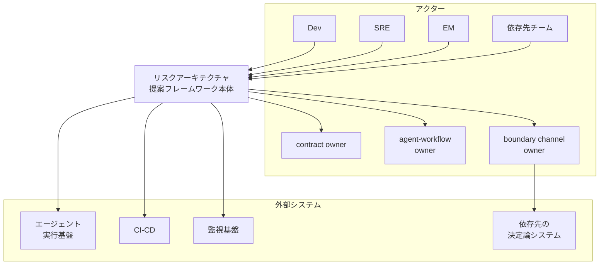
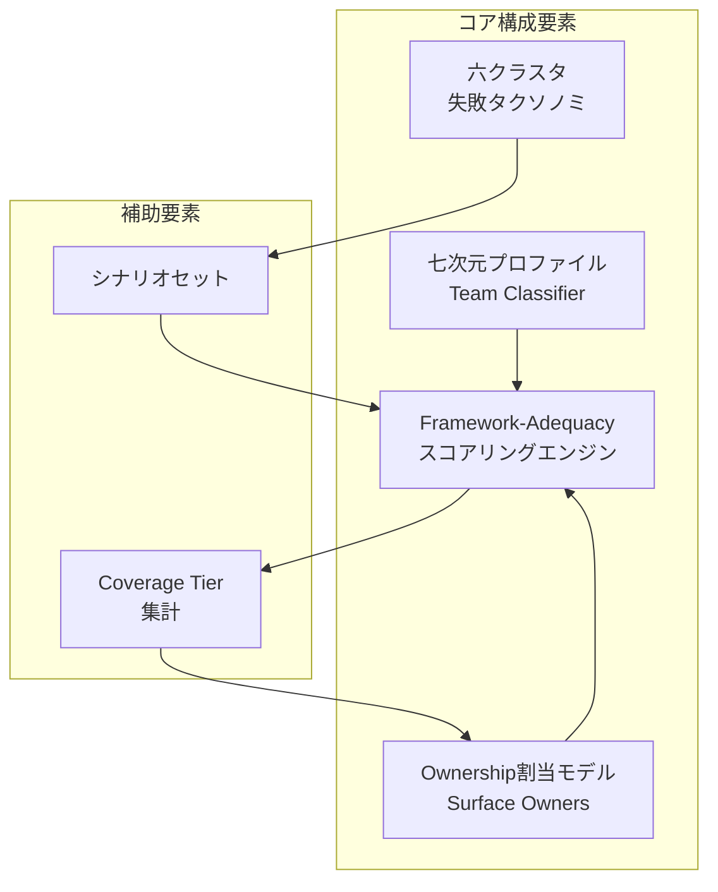
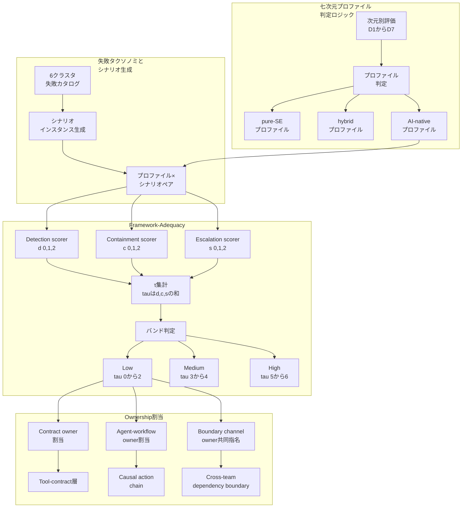
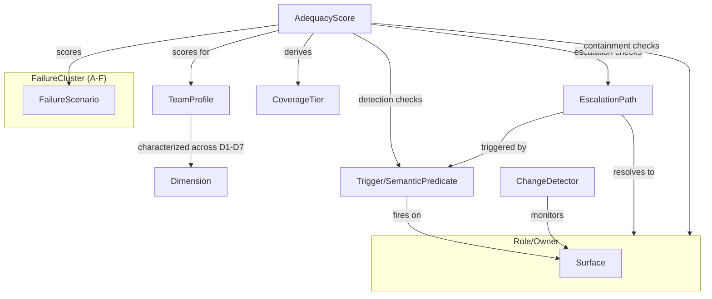
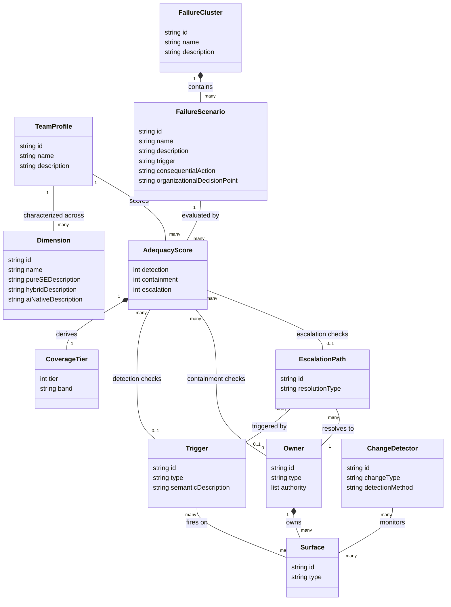
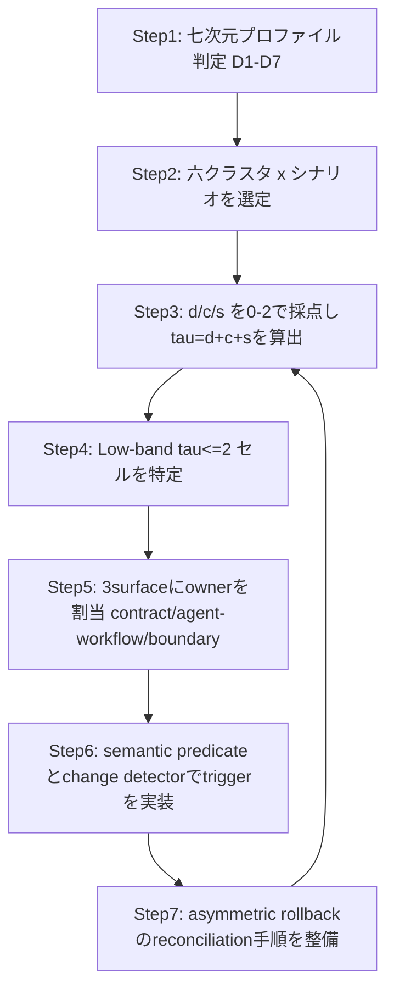
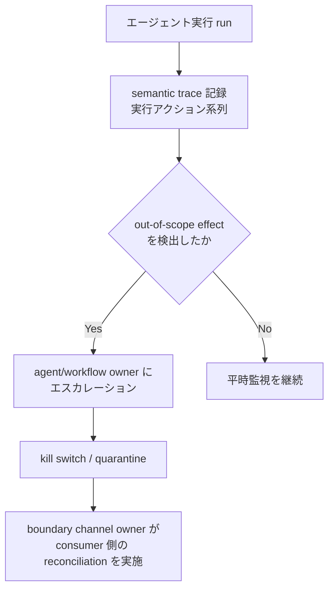

エージェントに本番作業を任せ始めると、事故の性質が変わります。失敗して止まるのではなく、per-action の人手承認なしに多段実行を進める側で顕在化します。そして最も深刻な事故は、AI チームの内部ではなく、確率的な出力を「決定論の前提」で受け取る依存先との境界で起きます。

この記事は、その構造を組織設計の問題として扱った論文を、実装エンジニア向けに構造化して読み解きます。

> 対象論文: Laxmipriya Ganesh Iyer, "Risk Architecture for AI-Native Engineering Teams: An Organizational Framework for Agentic System Governance" (arXiv:2607.01421, cs.SE; cs.AI)
> 一次ソース: https://arxiv.org/abs/2607.01421 / https://arxiv.org/html/2607.01421v1
> 本記事のコード・YAML・RACI 例は、論文が方法論のみを提示するため、本記事が補完した「実装案」です (各所に明記)。

## ■概要

この論文は、エージェント型 (agentic) AI システムを開発・運用する組織に向けて、リスク管理の**組織アーキテクチャ**を再設計する方法論を提案しています。

対象読者はエンジニア個人ではなく、リスク所有権を割り当てる立場の EM (Engineering Manager)・PMO・SRE です。個人の AI 活用ノウハウの話ではありません。

論文の出発点は、従来のソフトウェア工学のリスク管理が暗黙に置いている 3 つの仮定です。エージェント型システムはこの 3 つを同時に破ります。

| 仮定 | pure-SE (従来) | AI-native (エージェント型) |
|---|---|---|
| 出力の決定論性 | 同じ入力は同じ出力になる | モデル生成出力は確率的で再現性がない |
| 変更イベントの離散性 | 変更は diff 可能な離散イベント | デプロイ間でも silent update により連続的・多層的に変異する |
| コンポーネント→オーナー対応 | feature team が明確に所有 | model / prompt / tool-contract / approval に責任が分散し曖昧になる |

3 つの仮定が同時に崩れる結果、次の現象が起きると論文は主張しています。

- 検出 (Detection)・抑制 (Containment)・エスカレーション (Escalation) を合算した coverage tier の中央値が、pure-SE → hybrid → AI-native の順に単調に低下する
- 「未カバー (Low band)」の失敗が AI-native の段階で初めて、しかも突然出現する
- 最も深刻で最もカバーされない失敗は、AI-native チームの内部ではなく、確率的出力が決定論前提の依存先へ流れ込む**組織境界**で発生する

これらを示すために、論文は次の 3 つを構築しています。

1. チームを 7 次元で分類するプロファイル
2. 6 クラスタの失敗モード分類
3. 各 (チーム, シナリオ) の組を検出・抑制・エスカレーション能力で採点する framework-adequacy 方法論

そのうえで分析により、3 つの新しい surface (契約層・因果連鎖・組織境界) にオーナーシップを割り当てると、分析上 (derived counterfactual) は未カバーだった失敗セルが解消されることを示しています。これは実組織での観測結果ではなく、著者がモデル上で導出した反事実的結論である点に注意が必要です (詳細はベストプラクティスの誤解1)。

### 関連研究/系譜との関係

論文は Related Work で、既存の AI リスク関連文献が「2 つの高度 (altitude)」に集まっていると整理し、自身の組織・EM 層を第 3 の高度として新設しています。

| 高度 | 該当するフレームワーク | 扱う単位 | 限界 |
|---|---|---|---|
| 政策・ガバナンス層 (既存) | NIST AI RMF、ISO/IEC 42001、EU AI Act | AI システムそのもの | 「何をすべきか」は規定するが、実行の細かなメカニズムには意図的に踏み込まない |
| 技術・脅威分類層 (既存) | OWASP agentic AI guidance、UC Berkeley CLTC の脅威分類 | システムへの攻撃・脆弱性 | 脅威を列挙するが、契約ドリフトのようなインシデントを誰が所有するかは処方しない |
| 組織・EM 層 (本論文が新設) | 本論文 | チームの構造とオーナーシップ | 既存 2 層のどちらも扱っていなかった領域 |

なお、以下は**本レポートが主要フレームワークと本論文を並べた比較**です (論文本文が直接引用するのは上表の NIST AI RMF / ISO/IEC 42001 / EU AI Act / OWASP agentic guidance / CLTC。Google SRE・RACI は本論文の別セクションで触れられるか、本レポートが理解の補助として追加した外部比較であり、Related Work の系譜整理には含まれません)。

| フレームワーク | 分析単位 | 性質 | チーム内オーナーシップの処方 | 組織境界のリスクの扱い |
|---|---|---|---|---|
| NIST AI RMF | AI システム/組織全般 | 政策・機能ガイド (Govern/Map/Measure/Manage) | なし (自発的枠組みのみ) | 扱わない |
| ISO/IEC 42001 | 組織の AI マネジメントシステム | 認証可能な管理システム規格 | 組織方針レベルに留まる | 扱わない |
| OWASP (agentic guidance / LLM Top 10) | LLM/エージェントアプリケーション | 脆弱性カタログ + 緩和策 | 扱わない | 扱わない |
| Google SRE エラーバジェット (本レポート補完) | サービスの信頼性 | 統計的リスク許容の運用モデル | product team と SRE team 間の対立解消のみ | 扱わない |
| RACI (本レポート補完) | タスク・意思決定 | 責任分担の可視化マトリクス | 静的な役割表。動的に変異する surface は想定しない | 扱わない |
| 本論文 | AI-native チームの構造 | 組織リスクアーキテクチャの処方 | contract / agent-workflow / boundary channel owner を surface 単位で新設 | Cluster F として新カテゴリ化 |

**新規性のまとめ**: 既存フレームワークは「システムに何のリスクがあるか」または「組織は何をすべきか」を扱います。一方で本論文は「誰が」「どの surface を」「どう検知・抑制・エスカレーションするか」という EM 層の実務処方に踏み込んでいます。特に、決定論を前提に作られた依存先が確率的出力を受け取る組織境界の失敗 (Cluster F) を独立したカテゴリとして特定した点は、参照した既存フレームワークのいずれにも見られません。

## ■特徴

- **七次元プロファイル (Seven-Dimension Profile)**: 出力決定性・アクション自律性・テスト検証モデル・リスク責任・エスカレーション契機・データ面/プライバシー露出・変更速度の 7 軸で、pure-SE / hybrid / AI-native の 3 チームプロファイルを区別する
- **六クラスタ失敗モード分類 (Six-Cluster Failure-Mode Taxonomy)**: Security / Privacy / Autonomy / Change-Induced / Ownership/Accountability の 5 クラスタに加え、新カテゴリの Dependency-Boundary Determinism Mismatch (Cluster F) を定義する
- **framework-adequacy 採点方法論**: (チームプロファイル, シナリオ) の各組を Detection・Containment・Escalation の 3 能力で {0,1,2} 採点し、合算した coverage tier τ (0〜6) を Low/Medium/High の順序バンドに分類する
- **依存境界の決定論ミスマッチという新カテゴリ**: hard-threshold 違反、複数コンシューマーへの variance cascade、silent contract drift、rollback asymmetry、boundary ownership gap といった、単一システム分析では捉えられない組織境界特有の失敗を定式化する
- **surface へのオーナーシップ割当という処方箋**: コンポーネント単位でなく、tool-contract 層 (contract owner)・causal-action chain (agent/workflow owner)・cross-team dependency boundary (boundary channel owner、producer/consumer 共同指名) の 3 surface に説明責任を割り当てることで、未カバーの失敗セルを解消する

## ■構造

論文は具体システムの実装を持たない組織ガバナンス方法論です。そのため本セクションでは C4 model を「対象システムの構造」ではなく「提案フレームワークの論理構造」に読み替えて描きます。

### ●システムコンテキスト図



#### アクター

| 要素名 | 説明 |
|---|---|
| Dev | AI-native チームでエージェント型システムを開発・運用する実装者。フレームワークが定義する検証モデル・エスカレーション契機に従う対象 |
| SRE | 監視基盤からのシグナルを受け、containment 権限を行使する運用担当 |
| EM | チームプロファイル判定と ownership map の合意形成に責任を持つマネジメント層 |
| contract owner | フレームワークがツール/レジストリ単位で新設する surface owner。ランタイム契約違反への authority を持つ |
| agent-workflow owner | フレームワークが causal action chain 単位で新設する surface owner。semantic action trace と scope 外効果の検出に責任を持つ |
| boundary channel owner | producer チームと consumer チームが共同指名する surface owner。cross-boundary reconciliation の authority を持つ |
| 依存先チーム | AI-native チームの確率的出力を消費する、決定論を前提とした外部チーム。ownership gap が最も顕在化する組織境界の相手側 |

#### フレームワーク本体

| 要素名 | 説明 |
|---|---|
| リスクアーキテクチャ 提案フレームワーク本体 | 七次元プロファイル・六クラスタ失敗タクソノミ・framework-adequacy スコアリング・ownership 割当モデルを束ねる論理的中枢 |

#### 外部システム

| 要素名 | 説明 |
|---|---|
| エージェント実行基盤 | エージェントの semantic action trace・ツール呼び出し・run 単位のキルスイッチ対象を提供する実行環境 |
| CI-CD | 離散的で監査可能な変更イベント (デプロイ) を記録する。AI-native 環境ではデプロイ間の silent update を捉えられない限界を持つ |
| 監視基盤 | 例外・エラー率閾値・SLA 違反といった観測可能シグナルを供給する。フレームワークはこれを semantic predicate まで拡張する |
| 依存先の決定論システム | hard-threshold 判定・binary label 期待・完全一致検証など、決定論を前提に構築された consumer 側システム。boundary channel owner の reconciliation 対象 |

### ●コンテナ図



#### コア構成要素

| 要素名 | 説明 |
|---|---|
| 七次元プロファイル Team Classifier | D1 出力決定性から D7 変更速度までの 7 次元でチームを pure-SE / hybrid / AI-native の 3 プロファイルに分類する |
| 六クラスタ失敗タクソノミ | Security / Privacy / Autonomy / Change-Induced / Ownership/Accountability / Dependency-Boundary Determinism Mismatch の 6 クラスタで失敗モードを分類する |
| Framework-Adequacyスコアリングエンジン | team profile と scenario のペアごとに detection / containment / escalation を採点し coverage tier を算出する |
| Ownership割当モデル Surface Owners | coverage tier が Low band に落ちたセルに対し、contract owner / agent-workflow owner / boundary channel owner を割り当てて gap を解消する |

#### 補助要素

| 要素名 | 説明 |
|---|---|
| シナリオセット | 六クラスタ失敗タクソノミから生成される、team profile に対して採点する具体的な失敗シナリオの集合 |
| Coverage Tier集計 | スコアリングエンジンが出力した d, c, s を τ = d + c + s に集約し、複数シナリオがある場合は中央値でロールアップする |

### ●コンポーネント図



#### 七次元プロファイル判定ロジック

| 要素名 | 説明 |
|---|---|
| 次元別評価 D1からD7 | 出力決定性・アクション自律性・テスト検証モデル・リスク責任・エスカレーション契機・データ面・変更速度の 7 次元を個別に評価する |
| プロファイル判定 | 7 次元の評価結果を集約し、チームを 3 つの canonical profile のいずれかに割り当てる |
| pure-SEプロファイル | 決定論的出力・人間トリガー・カバレッジベース検証を持つチーム。カバレッジが最も高い |
| hybridプロファイル | 決定論と確率的要素が混在するチーム |
| AI-nativeプロファイル | 確率的出力・多段階自律実行・semantic escalation を持つチーム。Low band が突如出現する |

#### 失敗タクソノミとシナリオ生成

| 要素名 | 説明 |
|---|---|
| 6クラスタ失敗カタログ | Security / Privacy / Autonomy / Change-Induced / Ownership/Accountability / Dependency-Boundary Determinism Mismatch の 6 分類を保持する |
| シナリオインスタンス生成 | カタログの各クラスタから、採点可能な具体的失敗シナリオ (例: silent contract drift、hard-threshold 違反) を生成する |
| プロファイル×シナリオペア | team profile とシナリオ 1 件を組にした、スコアリングエンジンへの入力単位 |

#### Framework-Adequacyスコアリング

| 要素名 | 説明 |
|---|---|
| Detection scorer d 0,1,2 | シナリオでトリガが発火できるかを採点する。0=トリガなし、1=事後/間接トリガのみ、2=直接トリガあり |
| Containment scorer c 0,1,2 | 説明責任ある role が帰結を止める権限を持つかを採点する。0=なし、1=部分的/手動、2=直接的に停止可能 |
| Escalation scorer s 0,1,2 | 所有権が説明責任ある role と定義済み経路に解決するかを採点する。0=ownerless、1=cross-team triage で解決可、2=一意な所有者に直結 |
| τ集計 tauはd,c,sの和 | d, c, s を合算し τ ∈ {0..6} の coverage tier を算出する。複数シナリオがある場合は中央値でロールアップする |
| バンド判定 | τ を Low / Medium / High の 3 段階バンドに変換する |
| Low tau 0から2 | 最大でも 1 能力しか直接的でない、または 2 能力が間接的にとどまる未カバー帯。AI-native でのみ出現する |
| Medium tau 3から4 | セル単位で τ が 3〜4 の中位帯。プロファイル別中央値では hybrid (τ=4) がここに位置する (pure-SE の中央値 τ=4.5 は上限を超え High 寄り、AI-native は τ=3) |
| High tau 5から6 | 3 能力すべてがほぼ直接的に機能する帯 |

#### Ownership割当モデル

| 要素名 | 説明 |
|---|---|
| Contract owner割当 | Low band セルのうち tool-contract 層に起因するものへ、ツール/レジストリ単位の contract owner を割り当てる |
| Agent-workflow owner割当 | Low band セルのうち causal action chain に起因するものへ、agent/workflow owner を割り当てる |
| Boundary channel owner共同指名 | Low band セルのうち cross-team dependency boundary に起因するものへ、producer と consumer が共同指名する boundary channel owner を割り当てる |
| Tool-contract層 | ランタイム契約違反 (silent contract drift 等) を監視し、ツール無効化・バージョンピン留めの authority を持つ surface |
| Causal action chain | semantic action trace と run 単位のキルスイッチを持つ surface。scope 外の不可逆アクションを containment 対象とする |
| Cross-team dependency boundary | producer の確率的出力と consumer の決定論前提が交差する surface |

## ■データ

論文は ER 図を明示しません。ただし framework-adequacy 方法論と Reference Risk Architecture の記述から、以下のエンティティ構造が復元できます。

### エンティティ概要

| エンティティ | 論文上の対応 | 役割 |
|---|---|---|
| TeamProfile | pure-SE / hybrid / AI-native | 7 次元 (D1-D7) で特徴づけられるチーム類型 |
| Dimension | D1〜D7 | 各次元が 3 プロファイル分の記述を持つ固定タクソノミー |
| FailureCluster | Cluster A〜F | 失敗モードの上位分類 |
| FailureScenario | 個別シナリオ | trigger・consequential action・organizational decision point を持つ個別失敗事例 |
| AdequacyScore | (team profile, scenario) の採点 | detection(d) / containment(c) / escalation(s) を {0,1,2} で記録 |
| CoverageTier | τ = d+c+s、Low/Medium/High | AdequacyScore から一意に導出される評価結果 |
| Owner | Contract / Agent-workflow / Boundary channel / Model / Change-surface owner | Surface に対する説明責任と authority を持つ主体 |
| Surface | Tool-contract layer / Causal action chain / Dependency boundary (+ Model version / Change surface) | 論文が「新たに所有割当すべき」と主張する対象 |
| EscalationPath | s=2 で要求される一意に解決する経路 | Trigger から Owner へ解決する経路 |
| Trigger | 直接トリガ / semantic predicate | Surface 上の逸脱を検知する条件 |
| ChangeDetector | change detector (not a change record) | provider update / prompt / tool / state mutation の変異を継続監視する仕組み |

### ●概念モデル



| 要素名 | 説明 |
|---|---|
| FailureCluster ⊃ FailureScenario | 1 シナリオは必ず 1 クラスタに属する所有関係 |
| Owner ⊃ Surface | Owner は自身が説明責任を持つ Surface を所有する (論文の核心的推奨) |
| AdequacyScore → TeamProfile / FailureScenario | 採点は team profile とシナリオの組を評価対象として参照する |
| AdequacyScore → Trigger / Owner / EscalationPath | detection/containment/escalation の 3 サブスコアが各実在/実効性を問い合わせる |
| Trigger / ChangeDetector → Surface | いずれも Surface を観測対象として利用する |

### ●情報モデル



属性の根拠:

- `AdequacyScore.detection/containment/escalation` は論文の 3 値順序尺度 `{0,1,2}` をそのまま採用します。detection = 0 (トリガ無し) / 1 (事後・間接) / 2 (直接)、containment = 0 (無し) / 1 (部分・手動) / 2 (直接)、escalation = 0 (ownerless) / 1 (cross-team triage で解決可) / 2 (一意な owner)。
- `CoverageTier.tier` = detection + containment + escalation ∈ {0..6}。`band` は Low (τ≤2) / Medium (3≤τ≤4) / High (τ≥5)。
- `FailureScenario` は 1 つの `TeamProfile` に固定されず、3 プロファイルそれぞれで別個に採点されます。そのため `FailureScenario` と `AdequacyScore` は 1:many、`TeamProfile` と `AdequacyScore` も 1:many としました。
- `Owner.type` は Contract owner / Agent-workflow owner / Boundary channel owner (joint) / Model owner / Change-surface owner の 5 種を値として取ります。`authority` はそれぞれ tool version pin/disable・kill switch・cross-boundary reconciliation・model rollback・freeze/gate on mutation に対応します。
- `Surface.type` は Tool-contract layer / Causal action chain / Dependency boundary / Model version / Change surface の 5 種です (うち前 3 者が論文の主張する「新規に所有割当すべき」surface)。
- `EscalationPath` の `0..1` 多重度は escalation スコアが 0 (ownerless) の場合に経路が存在しないケースを、`Trigger` 側の `0..1` は detection=0 (トリガ無し) を表します。

## ■構築方法

本セクション以降のコード例・チェックリスト・YAML 定義はすべて**実装案 (補完)** です。論文は組織ガバナンスの方法論論文であり、実装コードや運用ツールは提示していません。論文の主張部分には出典を明記し、実装案には参考にした公式ドキュメント/OSS へのリンクを付します。

### 1. 自チームの七次元プロファイル判定

論文は D1〜D7 の 7 次元それぞれについて、pure-SE / hybrid / AI-native の 3 段階の典型像を定義しています。判定用の質問票やスコアリング式は提示していません。

| 次元 | Pure SE | Hybrid | AI-Native |
|---|---|---|---|
| D1 出力決定性 | 決定論的 (同じ入力→同じ出力) | 中核ロジックは決定論、AI 部分のみ確率的 | 主要出力がモデル生成、再現には重み固定が必要 |
| D2 アクション自律性 | 人間が全ての重要アクションを起動 | AI が推奨、不可逆な処理は人間が承認 | エージェントが per-action 承認なしに multi-step 実行 |
| D3 テスト・検証モデル | line/branch カバレッジ基準 | カバレッジ + 振る舞いテスト | 敵対的プロービング・契約ベース検証 |
| D4 リスク・インシデント責任 | feature team が所有 | 分割/クロスチーム | 曖昧・未定義 |
| D5 エスカレーション契機 | 観測可能・測定可能な指標 | 上記 + ドリフト検知 | semantic/causal (エージェントの行為の意味理解) |
| D6 データ面・プライバシー露出 | 静的・境界明確 | 上記 + モデル経由の露出 | 動的・エージェントがランタイムで決定 |
| D7 変更速度・リスク面変異 | 離散的・監査可能 | 上記 + モデル更新 | 連続的・サイレントな変異 |

**実装案: 七次元プロファイル判定チェックリスト** (Table II の定義から本レポートが補完。閾値は論文に根拠なし)

```yaml
# 実装案: team-profile-checklist.yaml
# 各 dimension に 0 (pure SE) / 1 (hybrid) / 2 (AI-native) を記入する
team: <team-name>
assessed_at: <YYYY-MM-DD>
dimensions:
  d1_output_determinism:
    question: "同じ入力に対して同じ出力が返るか。出力の主要部分はモデル生成か。"
    score: 0
  d2_action_autonomy:
    question: "重要アクションは人間が都度起動するか、エージェントが多段階を承認なしで実行するか。"
    score: 0
  d3_test_verification:
    question: "検証はカバレッジ基準か、敵対的プロービング/契約検証を含むか。"
    score: 0
  d4_risk_ownership:
    question: "インシデント責任は単一チームに帰属するか、複数当事者で曖昧か。"
    score: 0
  d5_escalation_trigger:
    question: "エスカレーションは閾値/エラー率か、エージェントの行為の意味理解を要するか。"
    score: 0
  d6_data_surface:
    question: "データ面は静的スキーマか、エージェントがランタイムで呼ぶツールに依存し動的か。"
    score: 0
  d7_change_velocity:
    question: "変更はデプロイ単位で離散的か、デプロイ間でサイレントに変異しうるか。"
    score: 0
# 判定ロジック (本レポートによる補完。閾値は論文非記載):
#   avg = sum(scores) / 7
#   avg <= 0.6       -> pure_se
#   0.6 < avg <= 1.3 -> hybrid
#   avg > 1.3        -> ai_native
```

判定は EM 単独ではなく、contract owner 候補・agent/workflow owner 候補・下流 consumer チームを交えたワークショップで行うことを推奨します。

### 2. 六クラスタ × team profile の scenario マトリクス運用

論文は 6 クラスタ (A〜F) にシナリオを定義し、各シナリオを実際の公開インシデントに対応付けています。

| クラスタ | シナリオ概要 |
|---|---|
| A. Security | 敵対的インジェクション、権限昇格、未認可ツールアクセス |
| B. Privacy | 外部 API への PII 露出、lineage 喪失、再構成リーク |
| C. Autonomy | スコープ外不可逆アクション、因果連鎖の帰結、run 内権限昇格 |
| D. Change-Induced | サイレントモデル更新、tool-contract ドリフト、prompt 変更伝播 |
| E. Ownership/Accountability | オーナーなきインシデント、triage 失敗、authority gap |
| F. Dependency-Boundary Determinism Mismatch | hard-threshold 違反、variance cascade、silent contract drift、rollback asymmetry、boundary ownership gap |

**採点手順**: 各 (team profile, scenario) の組について、3 能力を {0,1,2} の順序尺度で採点します。

| 能力 | 定義 | 0 | 1 | 2 |
|---|---|---|---|---|
| Detection (d) | シナリオでトリガが発火できるか | トリガ不可 | 事後/間接的に検知 | 直接検知 |
| Containment (c) | ある role が帰結を止める十分な権限を持つか | 止める権限なし | 部分的/手動での抑止 | 直接的な抑止権限 |
| Escalation (s) | 所有権が説明責任ある role と定義済み経路に解決するか | オーナーなし | クロスチーム triage で解決可能 | 一意に解決 |

coverage tier τ = d + c + s ∈ {0..6}。バンド: Low (τ≤2) / Medium (3≤τ≤4) / High (τ≥5)。

論文の採点例 (F3: Silent Boundary Contract Drift、AI-native) を参考基準にします。

> - Detection (d=0): producer のトリガは自身の宣言済み出力境界に対する述語であり、シナリオはその境界を侵さない (second-moment の挙動だけが変化)。
> - Containment (c=1): 原因が特定されれば producer はモデルの rollback authority を持つが、手動かつ事後に限られる。
> - Escalation (s=0): producer の所有は異常を示さず (出力は境界内)、consumer の所有は自身が所有しない予期せぬ入力を示す。
> - τ = 0 + 1 + 0 = 1 (Low band)

**実装案: 採点ワークシートと自動集計スクリプト**

```yaml
# 実装案: scenario-scoring.yaml (1 シナリオ = 1 レコード)
team_profile: ai_native
cluster: F
scenario_name: "Silent Boundary Contract Drift"
scores:
  detection: 0
  containment: 1
  escalation: 0
reviewers:
  - role: contract_owner
  - role: agent_workflow_owner
  - role: boundary_channel_owner
notes: "APIシグネチャ不変のまま出力分散が増加。producerの宣言済み境界内のため検知不可。"
```

```python
# 実装案: coverage_tier.py (τ算出とバンド化)
def coverage_tier(detection: int, containment: int, escalation: int) -> tuple[int, str]:
    tau = detection + containment + escalation
    if tau <= 2:
        band = "Low"
    elif tau <= 4:
        band = "Medium"
    else:
        band = "High"
    return tau, band

# 例: F3 (AI-native) スコア
tau, band = coverage_tier(detection=0, containment=1, escalation=0)
assert (tau, band) == (1, "Low")
```

### 3. Low-band セル (未カバー高影響失敗) の特定ワークシート

論文が特定した AI-native プロファイルの Low-band セルは、その多く (5 件中 4 件) が escalation (s=0) を主因とし、新しい surface (契約層・因果連鎖層・境界層) にオーナーが割り当てられていないことが構造的原因と結論付けられています。

```python
# 実装案: low_band_worksheet.py
def flag_low_band(records: list[dict]) -> list[dict]:
    """coverage_tier.py の出力レコード群から Low band のみ抽出する"""
    return [r for r in records if r["tau"] <= 2]
```

論文の結論は、この Low-band セルに対し「3 つの新 surface (契約層・因果連鎖層・境界層) のオーナーシップを付与すると、分析上 (derived counterfactual) は全て消える」というものです。あくまでモデル上の反事実であり実測ではありません (ベストプラクティスの誤解1)。次章のロール割当がその是正手順に当たります。

## ■利用方法

### 1. contract owner / agent-workflow owner / boundary channel owner の割当

論文の Reference Risk Architecture は、5 つの surface それぞれについて accountable owner・detection trigger・containment authority を定義しています。

| Surface | Accountable Owner | Detection Trigger | Containment Authority |
|---|---|---|---|
| Tool-contract layer | Contract owner (ツール/レジストリ単位) | ランタイム契約違反モニタ (宣言済み効果 vs 観測効果) | ツールバージョンの無効化/ピン留め、違反時ブロック |
| Causal action chain | Agent/workflow owner | 実行アクション列の semantic trace、out-of-scope-effect アラート | run の kill switch、workflow の隔離 |
| Dependency boundary | Boundary channel owner (producer + consumer を共同指名) | 境界での出力分散/形状モニタ、confidence-band チェック | cross-boundary reconciliation authority、協調ロールバック |
| Model version | Model owner | ドリフト・出力品質モニタ | 下流影響評価付きモデルロールバック |
| Change surface (silent) | Change-surface owner | change detector (provider update / prompt / tool / state) | 検知した変異に対するフリーズ/ゲート |

**実装案: RACI マトリクス** (論文は Accountable owner と権限のみ定義。Responsible/Consulted/Informed は本レポートが補完)

```yaml
# 実装案: raci-surfaces.yaml
surfaces:
  - name: tool_contract_layer
    accountable: contract_owner            # 論文 Reference Architecture
    responsible: tool_maintainer_team
    consulted: [agent_workflow_owner, security_team]
    informed: [em, downstream_consumer_teams]
  - name: causal_action_chain
    accountable: agent_workflow_owner
    responsible: agent_platform_team
    consulted: [contract_owner, privacy_team]
    informed: [em, incident_response]
  - name: dependency_boundary
    accountable: boundary_channel_owner    # producer + consumer 共同指名
    responsible: [producer_team, consumer_team]
    consulted: [agent_workflow_owner, contract_owner]
    informed: [em, affected_downstream_teams]
  - name: model_version
    accountable: model_owner
    responsible: ml_platform_team
    consulted: [contract_owner, boundary_channel_owner]
    informed: [em]
  - name: change_surface
    accountable: change_surface_owner
    responsible: platform_reliability_team
    consulted: [model_owner, contract_owner, agent_workflow_owner]
    informed: [em, all_downstream_teams]
```

boundary channel owner は producer と consumer の共同指名である点が他の surface と異なります。論文はこれを "jointly named producer + consumer" と明記し、単独チームへの帰属を避ける設計です。

### 2. semantic predicate による escalation trigger の実装案

論文の主張: エスカレーショントリガーは semantic predicate を含めなければならず、エラーと閾値のみを観測するアラートは AI-native と Cluster F の失敗に構造的に盲目である、というものです。

エージェントの action trace を [OpenTelemetry GenAI semantic conventions](https://opentelemetry.io/docs/specs/semconv/gen-ai/gen-ai-spans/) に沿って記録し、宣言済みスコープと突き合わせて out-of-scope-effect を検出する疑似コードです。

```python
# 実装案: semantic_escalation_trigger.py
# 参考: OpenTelemetry GenAI semantic conventions
from dataclasses import dataclass


@dataclass
class DeclaredScope:
    allowed_tools: set[str]
    allowed_effects: set[str]          # 例: {"read:orders", "write:draft_email"}
    reversible_only: bool = True


@dataclass
class ActionTraceEvent:
    span_name: str
    tool_name: str                     # OTel: gen_ai.tool.name
    effect: str
    reversible: bool
    crosses_team_boundary: bool = False


def detect_out_of_scope_effect(scope: DeclaredScope, trace: list[ActionTraceEvent]) -> list[dict]:
    """agent/workflow owner 向け semantic predicate。
    宣言済みスコープに無いツール呼び出し・効果・不可逆アクションを検出する。
    """
    escalations = []
    for event in trace:
        violations = []
        if event.tool_name not in scope.allowed_tools:
            violations.append("unauthorized_tool")
        if event.effect not in scope.allowed_effects:
            violations.append("out_of_scope_effect")
        if scope.reversible_only and not event.reversible:
            violations.append("irreversible_action_outside_scope")
        if violations:
            escalations.append({
                "span_name": event.span_name,
                "tool_name": event.tool_name,
                "violations": violations,
                "severity": "critical" if event.crosses_team_boundary else "high",
                "notify_boundary_owner": event.crosses_team_boundary,
            })
    return escalations
```

契約層側の runtime 検証は、宣言済み効果と観測効果の突き合わせをポリシーエンジンで実装するのが実務的です。以下は [OPA/Rego v1](https://www.openpolicyagent.org/docs/policy-language) の `import rego.v1` 構文を用いた実装案です。

```rego
# 実装案: tool_contract_violation.rego
package contract

import rego.v1

# runtime contract-violation monitor (declared vs. observed effect) の実装
violation contains msg if {
	some call in input.tool_calls
	not call.effect in data.declared_contracts[call.tool_name].allowed_effects
	msg := sprintf("tool %s produced undeclared effect %s", [call.tool_name, call.effect])
}

# contract owner の containment authority: 違反があればブロック
allow if {
	count(violation) == 0
}
```

### 3. change detector の実装案 (provider / prompt / tool / state の変異監視)

論文の主張: リスク面を継続的に変異するものとして扱い、silent mutation (provider update / contract drift / state accumulation) を first-class signal として監視し、change event record ではなく change event detector を定義せよ、というものです。

| 監視対象 | フィンガープリント例 | 変更検知の意味 |
|---|---|---|
| provider | モデル ID + `gen_ai.response.model` (実際に処理したモデルバージョン) | サイレントなモデル更新 |
| prompt | system prompt のハッシュ値 | prompt 変更の伝播 |
| tool | tool registry のスキーマハッシュ (契約内容) | tool-contract ドリフト |
| state | エージェントの累積 state のハッシュ | 蓄積 state による挙動変化 |

```yaml
# 実装案: .github/workflows/change-surface-detector.yml
# 参考: GitHub Actions によるドリフト検知の定期実行パターン
name: change-surface-detector
on:
  schedule:
    - cron: "0 */6 * * *"   # 6時間毎。閾値は本レポートの補完で論文に根拠なし
  workflow_dispatch: {}

jobs:
  detect:
    runs-on: ubuntu-latest
    steps:
      - uses: actions/checkout@v4
      - name: Fetch current fingerprints
        run: python3 scripts/fingerprint_surfaces.py --out current.json
      - name: Diff against last known snapshot
        run: python3 scripts/diff_surfaces.py --baseline snapshots/last.json --current current.json --out diff.json
      - name: Escalate on drift
        if: ${{ steps.diff.outputs.drift_detected == 'true' }}
        run: python3 scripts/notify_change_surface_owner.py --diff diff.json
```

```python
# 実装案: fingerprint_surfaces.py の中核ロジック
import hashlib
import json


def fingerprint(payload: dict) -> str:
    canonical = json.dumps(payload, sort_keys=True).encode("utf-8")
    return hashlib.sha256(canonical).hexdigest()


def build_snapshot(provider_model_id: str, system_prompt: str, tool_registry_schema: dict, agent_state_summary: dict) -> dict:
    return {
        "provider": fingerprint({"model_id": provider_model_id}),
        "prompt": fingerprint({"system_prompt": system_prompt}),
        "tool": fingerprint(tool_registry_schema),
        "state": fingerprint(agent_state_summary),
    }
```

### 4. asymmetric rollback のための cross-boundary reconciliation 手順

論文の問題定義 (rollback asymmetry): インシデントで producer がモデルを rollback しても、consumer は既に不良バージョンの出力を処理し行動済み (records updated / communications sent / decisions logged) です。producer の rollback は producer 状態のみを復元し consumer 状態は復元せず、reconciliation を所有する role がいません。

論文の推奨: authority は asymmetric rollback 向けに設計されなければならず、producer 状態のみを復元する containment では不十分であり、境界をまたぐ reconciliation authority を含めよ、というものです。

**手順 (実装案)**

1. producer がモデル/契約ロールバックを実施したら、boundary channel owner に自動通知する (change detector の出力を trigger にする)。
2. boundary channel owner は影響範囲の consumer 一覧を特定し、ロールバック対象バージョンの出力を消費した期間を確定する。
3. 各 consumer は「既に確定した行為」を棚卸しする。
4. consumer ごとに reconciliation アクション (取り消し / 再送 / 訂正通知など) を個別に計画する。
5. reconciliation の完了までを boundary channel owner が一元的にトラッキングする (producer 単独のインシデントクローズでは完了扱いにしない)。

```yaml
# 実装案: cross-boundary-reconciliation-runbook.yaml
incident_id: <id>
trigger: "producer_model_rollback_detected"
boundary_channel_owner: <producer_team>+<consumer_team> 共同指名
producer_rollback:
  rolled_back_version: <version>
  faulty_version_active_window: { from: <timestamp>, to: <timestamp> }
affected_consumers:
  - consumer: <team_name>
    actions_taken_on_faulty_output:
      - type: record_update
        status: needs_reconciliation
      - type: communication_sent
        status: needs_reconciliation
    reconciliation_plan:
      - action: retract_or_correct
        owner: <consumer_team>
        due_date: <date>
reconciliation_closed: false   # producer rollback だけでは true にしない
```

### 構築・利用フローの全体像



## ■運用

### 運用サイクル: risk architecture の定期再評価

論文の Coverage Tier (τ = Detection + Containment + Escalation, 0〜6) は、著者が一度だけ算出した静的スコアです。論文自身が次の 2 点の制約を明示しています。

- スコアリングは著者本人による deterministic derivation であり、継続測定の仕組みではありません。
- Coverage tier の定期再評価メカニズムについて、論文は具体的な運用手順を記述していません。

したがって、この τ スコアを組織で使う場合は、次のような**自組織の運用サイクル**を独自に設計する必要があります。

| タイミング | トリガー | 実施内容 |
|---|---|---|
| 四半期定例 | カレンダー駆動 | 7 次元プロファイル (D1〜D7) を再採点し、どの帯にいるか確認する |
| チーム profile 遷移時 | hybrid → AI-native への移行 | 6 クラスタ失敗モードの再点検と、影響を受ける surface owner の再指名 |
| 新規 agentic 機能リリース時 | デプロイ判断 | 新しい surface の owner が定義済みか確認するチェックリスト運用 |
| インシデント発生時 | ポストモーテム | 発生シナリオを 6 クラスタで分類し、既存 τ スコアの見直しトリガーにする |

D2 (Action Autonomy) の変化がプロファイル遷移の最も強いシグナルです。「人間が per-action 承認する」から「エージェントが承認なしで multi-step シーケンスを実行する」に変わった時点で、hybrid の運用のままでは Cluster C と Cluster F の Low band が再出現するリスクがあります。

Google SRE の error budget policy は四半期ごとの棚卸しと定量トリガーを持ちます ([Error Budget Policy](https://sre.google/workbook/error-budget-policy/))。論文には同等の定量トリガーが存在しないため、運用チームは coverage tier 版の「閾値超過で強制再点検」ルールを自作することを推奨します。

### 境界チャネル (producer-consumer) の継続的 reconciliation 運用

論文は boundary channel owner に cross-boundary reconciliation authority を与えると規定しますが、reconciliation の具体的な運用プロセスまでは踏み込んでいません。これを運用に落とすと、次の 3 点が最低限必要です。

- **平時の reconciliation**: producer の出力仕様と consumer の消費前提を data contract の考え方で明文化し、CI/CD でスキーマ検証する ([Atlan - Data Contracts](https://atlan.com/data-contracts/), [Acceldata](https://www.acceldata.io/blog/how-data-contracts-guarantee-pipeline-reliability-data-quality-slas))。
- **契約変更時の reconciliation**: 破壊的変更には事前通知期間を設け、フィールド廃止時は移行期間を挟む ([Syntaxia](https://www.syntaxia.com/post/how-to-build-data-contracts-that-reduce-breakages))。論文の「silent contract drift」問題は、この事前通知プロセスの欠如そのものです。
- **障害時の reconciliation**: producer が rollback した際、consumer 側の状態を洗い出し、coordinated rollback を実施する runbook を boundary channel owner が事前に用意します。

### semantic predicate / change detector の監視運用

論文は D5 と D7 で 2 つの新しい監視カテゴリを要求します。実装アルゴリズムは範囲外としているため、運用上は MLOps のモデル監視の枠組みを転用するのが現実的です。

- 予測 (出力) だけでなく入力分布・特徴量・統計的関係も監視対象に含める MLOps の考え方は、semantic predicate 設計に応用できます ([Galileo - MLOps Guide](https://galileo.ai/blog/mlops-operationalizing-machine-learning))。
- 「200 OK を返し続けながら精度だけが劣化する」silent failure は MLOps では既知の課題です ([DevopsRoles](https://www.devopsroles.com/practices-robust-model-drift-detection-mlops))。change detector はこれを「モデル出力」だけでなく「prompt / tool-contract / エージェントの状態」まで拡張したものです。
- ただし MLOps の drift 検知は「統計的な分布変化」の検知が中心であり、論文が要求する semantic predicate はより高次の要求です。既存 MLOps 監視をそのまま流用しても Cluster C・F を完全にはカバーできない点は運用設計者が認識すべきギャップです。



## ■ベストプラクティス

論文の open questions / limitations を「誤解 → 反証 → 推奨」の構造で運用推奨に翻訳します。発注側・PMO・経営層が本論文の主張をそのまま採用判断に使わないよう、過度な一般化への警鐘を含めます。

### 誤解1: 「3 つの surface にオーナーシップを割り当てれば Low-band 失敗は消える」

- **論文の主張**: AI-native アーキテクチャに contract / causal-chain / boundary の 3 surface オーナーシップを付与すると、Low-band セルがすべて Medium 以上に改善する。
- **反証**: この定量結果は、著者自身が rubric に基づいて deterministic に算出したスコアです。Detection/Containment/Escalation の採点は「R とシナリオ仕様が与えられれば決定論的」と記述され、著者本人によるシナリオ想定上の分析的評価です。構成概念妥当性を検証したシニア EM パネルは「7 次元・6 クラスタが実務から見て認識可能か」を検証したのみで、τ スコアの改善量そのものを実組織で観測・追試したものではありません。論文自身も「derived rather than observed coverage claims」であり、実際にチームがこれらの失敗にどう反応するか (behavioral validity) は今後の課題と明記しています。
- **推奨**: オーナーシップ割当は「Low-band が確実に消える施策」ではなく「Low-band を減らす仮説」として扱ってください。導入後は自組織のインシデント実績で効果を検証し、論文の τ スコアを目標値ではなく仮説的な出発点として使うことを推奨します。

### 誤解2: 「RACI を細かく書けば boundary の責任は明確になる」

- **論文の主張**: boundary channel owner は producer + consumer を共同指名し、cross-boundary reconciliation authority を持たせる。
- **反証**: 共同指名 (joint ownership) は、Accountable を 2 者に分散させる典型的な RACI アンチパターンです。2 者が Accountable を共有すると、双方が「相手が見ているはず」と考え、実際の意思決定の瞬間に誰も動かない diffusion of responsibility が生じます ([Meegle - RACI Pitfalls](https://www.meegle.com/en_us/topics/raci-matrix/raci-matrix-pitfalls))。論文の boundary channel owner 設計は、まさにこの「共同 Accountable」の形を取っており、実装時に無自覚だと同じ落とし穴に陥ります。
- **推奨**: producer + consumer を「共同 Accountable」にするのではなく、平時は producer が Accountable・consumer が Responsible (またはその逆) と役割を分け、reconciliation が必要な事態が発生した瞬間にのみ単一の意思決定者へ権限を一本化する設計を推奨します。「誰が最終的に kill switch を押すか」を 1 名に絞ってから、周辺のレビュー・情報共有を Consulted / Informed に位置づけてください。

### 誤解3: 「カバレッジが劣化する AI-native チームには一律で追加ガバナンスを課せばよい」

- **論文の主張**: pure-SE → hybrid → AI-native の順にカバレッジが単調に劣化するため、AI-native チームには一律で追加ガバナンスを課すべきという読み方をされやすい。
- **反証**: Gartner は「AI エージェントに一律のガバナンスを適用する企業は失敗する」と予測し、根本原因を「ガバナンスを『完全ロックダウン』か『全面信頼』の二択で扱っていること」だとしています。過剰統制はシンプルなエージェントの開発速度を落として shadow development を誘発し、過小統制はより自律的なエージェントのリスクを増大させます ([Gartner](https://www.gartner.com/en/newsroom/press-releases/2026-05-26-gartner-says-applying-uniform-governance-across-ai-agents-will-lead-to-enterprise-ai-agent-failure))。Gartner は自律性レベルごとに要件を変える「比例的ガバナンス」を推奨しています。
- **推奨**: 論文の 7 次元プロファイルは「チームがどの帯にいるか」を診断するツールとして使い、そこから先の統制強度は自律性レベル (D2) に比例させてください。読み取り専用の補助エージェントと、承認なしで multi-step アクションを実行するエージェントを同一のガバナンスで縛らないことを推奨します。

### 発注側・PMO・経営層への実務的な落とし込み

- **意思決定前に確認すべきこと**: ベンダー/開発チームに対し「3 つの surface それぞれに、名前のついた単一の accountable owner がいるか」を契約要件・SLA レビュー項目として明文化することを推奨します。論文の貢献は「owner を置くべき surface の分類」であり、組織設計のチェックリストとして即座に転用できます。
- **投資判断で誤らないこと**: 「オーナーを置いたので Low-band 失敗は解消済み」という報告を鵜呑みにしないでください。導入後 1〜2 四半期は自社のインシデント実績で効果を確認する期間として予算・工数を確保することを推奨します。
- **PMO の役割**: 7 次元プロファイルの四半期再評価を既存のリスク管理会議体に組み込み、D2 (autonomy) の変化を hybrid → AI-native 遷移の早期警戒シグナルとして PMO がモニタリングする運用を推奨します。

## ■トラブルシューティング

| 症状 | 原因 (論文のクラスタ対応) | 対処 |
|---|---|---|
| AI-native チームだけ強化しても事故が減らない | 最も深刻な失敗は AI-native チーム内部でなく、確率的出力を決定論前提で消費する組織境界 (Cluster F) で起きている | boundary channel owner を producer 側・consumer 側の双方に指名し、境界単位でシナリオを個別に点検する |
| 境界で silent contract drift が起きる | producer 側の変更が consumer に通知されないまま伝播する。従来の change-management は離散的変更イベントを前提とし silent な変更を検知できない (D7) | change event record ではなく change event detector を実装する。破壊的変更には事前通知期間を設け CI/CD でスキーマ検証を自動化する ([Conduktor](https://www.conduktor.io/glossary/schema-evolution-best-practices)) |
| producer が rollback したのに consumer が既にアクション実行済み | rollback asymmetry。producer 状態は復旧するが consumer 状態は復旧せず、reconciliation の owner が unowned | boundary channel owner に coordinated rollback の runbook を事前設計させ、producer rollback をトリガーに consumer 側の影響範囲を自動列挙する |
| エージェントが承認スコープ外の不可逆アクションを実行した | Cluster C。per-action 承認を前提にした escalation trigger は multi-step 自律実行では機能しない (D2, D5) | semantic trace で実行アクション系列を記録し、out-of-scope-effect を検出したら kill switch / quarantine を自動発動する ([Harper Foley](https://www.harperfoley.com/blog/ai-agents-destroyed-production-zero-postmortems)) |
| インシデントが起きても誰が対応するか決まらない | Cluster E。RACI 上「共同 Accountable」になっている、または surface 自体に owner が未定義 | 共同 Accountable を避け、平時と障害時で意思決定者を明確に分ける。インシデント発生時点で単一 owner を必ず割り当てる ([Google SRE Postmortem](https://sre.google/workbook/postmortem-culture/)) |
| model / prompt の silent 更新で挙動が変わったが誰も気づかない | Cluster D。provider 側のモデル更新は組織の変更管理プロセスの外で起きる (D7) | MLOps のモデル監視にならい、出力だけでなく入力分布・特徴量・モデルバージョンをテレメトリ化し統計的 drift を自動アラート化する ([DevopsRoles](https://www.devopsroles.com/practices-robust-model-drift-detection-mlops)) |
| ガバナンスを強化したのに開発速度が落ち抜け道が増えた | 一律ガバナンスのオーバーヘッド。7 次元プロファイルを診断に使わず全チームに同一統制を課した | 自律性レベル (D2) に応じた比例的ガバナンスに切り替える ([Gartner](https://www.gartner.com/en/newsroom/press-releases/2026-05-26-gartner-says-applying-uniform-governance-across-ai-agents-will-lead-to-enterprise-ai-agent-failure)) |

## ■まとめ

この論文は、AI-native チームのリスクを「誰がどの surface を検知・抑制・エスカレーションするか」という組織設計の問題に落とし込み、契約層・因果連鎖・組織境界の 3 surface にオーナーを割り当てる処方を示します。最も重要な指摘は、最悪の失敗が AI チーム内部ではなく、確率的出力を決定論前提で消費する組織境界で起きるという点です。ただし「オーナー割当で未カバー失敗が消える」という結論は著者による分析上の反事実であり実測ではないため、自組織のインシデント実績で検証する仮説として扱うのが安全です。

この記事が少しでも参考になった、あるいは改善点などがあれば、ぜひリアクションやコメント、SNSでのシェアをいただけると励みになります！

## ■参考リンク

### 一次論文
- [Risk Architecture for AI-Native Engineering Teams (arXiv abstract)](https://arxiv.org/abs/2607.01421)
- [Risk Architecture for AI-Native Engineering Teams (arXiv HTML)](https://arxiv.org/html/2607.01421v1)

### 系譜 (既存フレームワーク)
- [NIST AI Risk Management Framework](https://www.nist.gov/itl/ai-risk-management-framework)
- [NIST AI RMF Core (Govern/Map/Measure/Manage)](https://airc.nist.gov/airmf-resources/airmf/5-sec-core/)
- [OWASP GenAI / LLM Top 10 (論文は agentic AI guidance を引用。LLM Top 10 は補助)](https://genai.owasp.org/llm-top-10/)
- [Google SRE - Embracing Risk](https://sre.google/sre-book/embracing-risk/)

### 関連ツール・実装
- [OpenTelemetry: GenAI semantic conventions](https://opentelemetry.io/docs/specs/semconv/gen-ai/gen-ai-spans/)
- [Open Policy Agent: Rego policy language](https://www.openpolicyagent.org/docs/policy-language)
- [Firefly: Continuous Drift Detection with GitHub Actions](https://www.firefly.ai/academy/implementing-continuous-drift-detection-in-ci-cd-pipelines-with-github-actions-workflow)
- [CIO.com: What is RACI](https://www.cio.com/article/287088/project-management-what-is-raci-and-how-does-it-improve-clarity.html)

### 運用・データ契約
- [Google SRE Workbook - Error Budget Policy](https://sre.google/workbook/error-budget-policy/)
- [Google SRE Workbook - Postmortem Culture](https://sre.google/workbook/postmortem-culture/)
- [Atlan - Data Contracts Explained](https://atlan.com/data-contracts/)
- [Acceldata - How Data Contracts Guarantee Pipeline Reliability](https://www.acceldata.io/blog/how-data-contracts-guarantee-pipeline-reliability-data-quality-slas)
- [Syntaxia - How to Build Data Contracts That Reduce Breakages](https://www.syntaxia.com/post/how-to-build-data-contracts-that-reduce-breakages)
- [Conduktor - Schema Evolution Best Practices](https://www.conduktor.io/glossary/schema-evolution-best-practices)
- [Galileo - MLOps Guide](https://galileo.ai/blog/mlops-operationalizing-machine-learning)
- [DevopsRoles - Model Drift Detection Best Practices](https://www.devopsroles.com/practices-robust-model-drift-detection-mlops)

### 反証・実務事例
- [Gartner - Uniform Governance Across AI Agents Will Lead to Failure](https://www.gartner.com/en/newsroom/press-releases/2026-05-26-gartner-says-applying-uniform-governance-across-ai-agents-will-lead-to-enterprise-ai-agent-failure)
- [Meegle - RACI Matrix Pitfalls](https://www.meegle.com/en_us/topics/raci-matrix/raci-matrix-pitfalls)
- [Harper Foley - Ten AI Agents Destroyed Production. Zero Postmortems.](https://www.harperfoley.com/blog/ai-agents-destroyed-production-zero-postmortems)
- [Tricentis - The accountability gap in agentic AI software delivery](https://www.tricentis.com/blog/accountability-gap-agentic-ai-software-delivery)
