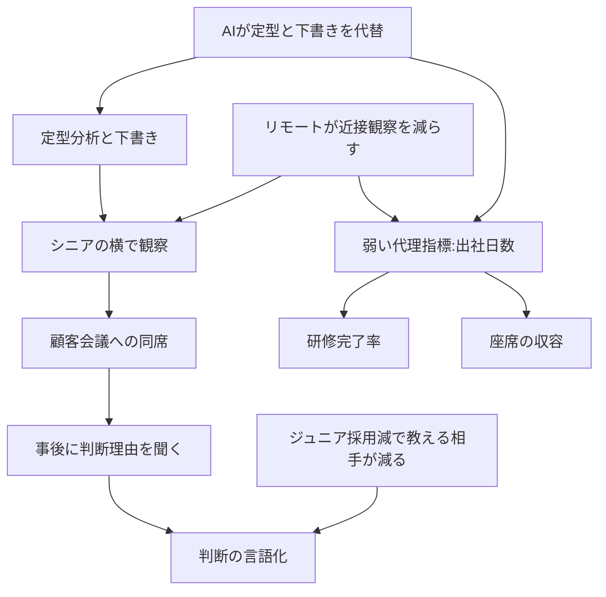

英国のコンサルティング各社が、ジュニア（若手）の出社を増やす方向に動いている、と Financial Times が 2026-08-27 に報じました。理由は「AI が定型分析を代替した結果、人間に残る技能の価値が上がったから」というものです。

この記事では、その動きを発注側・経営側の視点で読み直します。扱うのは次の3点です。

- 報道の中身を、確定している事実と伝聞に切り分けて読む方法
- 若手の熟達経路が壊れた原因を、AI・リモート・採用縮小の3層に分けて捉える枠組み
- 「出社日数」に代えて育成KPIに据えるべき、観察可能な4つの作業単位と、その測り方

結論を先に置きます。**出社日数は育成の目的変数になりません。**それは観察とコーチングの機会コストを下げる配置手段の一つであり、判断力が育ったかどうかを一切測れないからです。

*この記事の全体像。以下、順に解説します。*

## 何が報じられたのか

報道の骨子は次のとおりです。

| 主体 | 確認できる内容 | 確度 |
|---|---|---|
| 記事メタ | *Junior consultants called back to office as AI increases need for human skills*、Ellesheva Kissin、2026-08-27 | 高 |
| EY UK コンサルティング Sayeh Ghanbari | 在宅中心の生活設計は「AI の世界での成功経路ではない」。定型は AI が担い、人間は「人間であること」に時間を使う。エージェントがリモートで働くなら人間は対面へ | 高（正規転載） |
| EY 広報 | 長年の柔軟性方針そのものに正式な変更はない | 高 |
| Deloitte | 出社頻度はチーム裁量 | 転載のみ |
| KPMG Lisa Fernihough | 対面研修フォーマットを実験中。「対面の学習速度はリモートより速い」 | 転載のみ。公式プレスに当該文言なし |
| Accenture Matt Prebble | 対面の必要性は検討したが、出席義務は不要 | 転載のみ |
| Azets | ジュニアに週4日出社を奨励 | 転載のみ |
| BCG London | チェス・パデル・ネットボールの部活動を拡大 | 転載のみ |

ここで最初の注意点が出ます。見出しの「called back（呼び戻された）」は、実態より強い言葉です。EY 広報は在宅方針の正式変更を否定しており、書き出しも義務化ではなく「より頻繁な出社の検討」です。**出社義務化のうねりが起きた、と読むと事実を踏み外します。**

読者が取り出すべきなのは、出社義務の有無ではありません。「AI 後に何が育たなくなったのか」という問題設定のほうです。

## なぜ徒弟制が壊れたのか

コンサルティングの育成は、長らく徒弟制で成立してきました。ジュニアが定型分析と下書きを担い、シニアの横で顧客対応を観察し、会議のあとで判断の理由を聞き、自分の言葉に置き換える。この連鎖です。

いま、この連鎖には3つの力が同時にかかっています。どれか1つに還元すると、打ち手を誤ります。

### 1. AI が「考える前の仕事」を取った

EY の Errol Gardner は、かつてのジュニアの仕事を資料まとめ・提案ドラフト・合成（assembly）だと整理し、AI 後は判断に時間を使うことになると述べています。これは前向きな枠付けですが、裏返すと**観察と模倣の入口だった作業が消えた**という意味でもあります。

The Guardian に載った元コンサルタントの証言（2026-06-22、意見記事）は、1年目が「プロンプトを送ってくれ」と頼み、その出力が経験年数を超えて見えた、という逸話を伝えます。逸話ではありますが、症状の形はよく表しています。

### 2. リモートが観察を高くした

ここには数量的な裏づけがあります。*Quarterly Journal of Economics* 2026 掲載の Emanuel・Harrington・Pallais は、Fortune 500 のソフトウェア技術者を対象に、同僚の近くに座るとコーディングのフィードバックが **18.3%** 増えると示しました。利得は若手・低 tenure に集中し、逆に熟練者のコード出力は減ります。

ただし注意が要ります。ここで測られたのはコメント量とコード品質であって、**コンサルタントの判断力ではありません。**「出社すれば判断が育つ」という主張の証拠には使えません。

近接の価値そのものは、医療の規制とも整合します。ACGME は Direct Supervision の第一定義を「手技の重要部分における身体的な同席」と置き、通信による同時モニタリングは委員会が認めた場合のオプションにとどめています。初期学習者ほど共在が効く、という設計思想です。

### 3. ピラミッドの底が薄くなった

3つ目が本丸です。育成の再設計は、ジュニアが存在し、シニアが教える時間を持つ、という前提の上に乗っています。その前提自体が縮んでいます。

- PwC UK の Marco Amitrano は、大学院採用を 1,500 から 1,300 へ減らしたと本人寄稿で書きました（2025-09）。主因は景気だとしています。
- McKinsey の Bob Sternfels は CES 2026 で、入口を採用しないことは「梯子の下から4段を外して今日を節約する」ことに等しいと警告しました。同時に、同社は人間側の人数を絞りエージェントを増やしています。

ここが分岐点です。**出社日数を戻しても、ジュニア採用は自動では戻りません。**この点は、対立する2つの研究のどちらを採っても変わりません。

- Stanford Digital Economy Lab の *Canaries in the Coal Mine?*（2026-08 改訂）は、22〜25歳の AI 露出職の雇用が、低露出の同年代のペースに乗っていた場合より **約19%** 低いと報告します。著者は、リモートワークを統制しても乖離は残ると書いています。
- Warwick CAGE の *The Broken Ladder*（WP 808/2026）は、4か国・2.43億件の新規採用を使い、ジュニア採用シェアが 2017〜19年比で **約10ポイント** 低下した背景として、在宅勤務（WFH）の交絡が大きいと主張します。生成AI 露出と WFH 露出の順位相関は **0.77** で、同時推定すると WFH が残ると述べます。

どちらもデータセット依存であり、因果の決着はついていません。しかし**実務含意は同じ方向に収束します。**採用の回復は出社政策の外側にある、ということです。

## 「ヒューマンスキル」を操作可能な形に分解する

報道に出てくる語彙は empathy（共感）、storytelling、leadership です。この語彙のまま KPI を作ると、必ず研修完了率と出社率に落ちます。育成の対象を、測れる粒度まで割ってから設計する必要があります。

| 層 | 中身 | 出社で足りるか | 測り方 |
|---|---|---|---|
| 社交・所属 | 雑談、部活動、弱いつながり | 出社が効きやすい | バッジ、ネットワーク調査 |
| 対人プレゼン | 部屋を読む、物語、説得 | 顧客の前か、模擬の観察評定が必要。座席では代替しにくい | OSCE 型の観察評定 |
| 判断 | 不確実性の下で仮説の確信度を動かす | 思考過程の可視化と段階的責任が必要。日数KPIでは届かない | SCT 型のシナリオ課題 |
| AI 監督 | 自動出力を疑い、却下理由を残す | リモートでも手続として実装できる | 初稿と修正の差分 |

4層のうち、出社で素直に効くのは最上段の1つだけです。残り3つは、場所ではなく**手続の設計**の問題です。

この分解は日本の監査法人の公開資料とも符合します。PwC Japan は自動化バイアスを明示的に警告し、監査判断は全て人が行うと書いています。トーマツは調書レビューAI を「若手の学習機会」として位置づけています。いずれも出社日数ではなく、**AI が先に出した案を本人が確かめて直す**という作業単位を軸にしています。

## 育成単位を比較する

打ち手を4案に整理し、同じ基準で並べます。

| 基準 | A. 出社日数KPI | B. 顧客同席と直後デブリーフ | C. 模擬案件と判断理由レビュー | D. ジュニア削減 |
|---|---|---|---|---|
| 効く対象 | 弱いつながり、偶発的観察 | 顧客の恐れと切り返し | 安全な失敗、試行回数 | レバレッジとコスト |
| 実装の重さ | 軽い（バッジ集計） | 重い（非請求枠、守秘、顧客同意） | 中（シナリオ設計） | 軽いが後継者不在を招く |
| 運用の実態 | 在席しているだけの状態に落ちやすい | 法律事務所 Proskauer は shadowing を別番号の非請求業務にし、1年目に 200時間の目標を置いた | 設計コストが要る | 採用ブランドを毀損する |
| 監査可能性 | 日数は測れる。判断は測れない | 同席回数とデブリーフ記録 | シナリオ成績、却下理由ログ | 人員数 |
| 主なリスク | 学習を伴わない収容。出社義務はシニア流出も招く | 稼働率KPIと衝突し、規模を出しにくい | 転移の失敗。採用イベント化 | 梯子の下段の切断 |

A を選びたくなるのは、唯一すぐ測れるからです。しかしこの表で A が測れているのは日数だけであり、目的である判断力には触れていません。**測りやすさで代理指標を選ぶと、代理指標そのものが目的化します。**

日数を最大化する根拠も乏しいのが実情です。Bloom・Han・Liang が *Nature* 2024 に載せた Trip.com のランダム化比較試験では、週2日の在宅は完全出社と業績・昇進で差がなく、離職は **33%** 減りました。一方で NBER の分析は、コールセンターでは月1日の出社が通話効率を上げることを示しています。**対面ゼロは劣り得るが、日数の最大化に根拠はない**、というのが現在地です。

## 反証を通したうえで残るもの

主張を弱める材料も並べておきます。

- **顧客同席は規模が出ません。**非請求扱いになり、守秘と顧客同意も要ります。コンサルティングで全ジュニアに 200時間を保証した公開事例は見つかりませんでした。
- **ソフトスキル研修は現場に転移しにくいです。**Saks と Belcourt（2006）は、研修内容の現場適用率が直後 62%、6か月後 44%、1年後 34% と報告しています。
- **高忠実度シミュレータの優位は小さいです。**Norman ら（2012）によれば、高忠実度と低忠実度の学習効果の差は平均 1〜2% です。没入型の設備投資は、教育効果よりブランドになり得ます。
- **コンサルティング版の評価尺度は未検証です。**判断力を測る SCT 型や OSCE 型の公開バリデーションは、この業界には見当たりません。測れない推奨は、現場では結局バッジ集計に戻ります。

それでも結論は生き残ります。ただし適用範囲は狭まります。**対象は「雇い続けるジュニア」であり、採用規模の回復策ではありません。**

支持側の材料は次のとおりです。

- Collins の認知的徒弟制（1991）は、学校教育との差を**思考過程の可視化**に置きました。可視化されるのは身体ではなく思考です。
- 事後レビュー（after-action review）のメタ分析は効果を支持します。Tannenbaum と Cerasoli（2013）は **d=0.67**（おおむね +25%）を報告し、構造化されていることを調整因子に挙げています。
- FAA の LOFT（Line Operational Simulations）は、評価ではない訓練、実クルー編成、シナリオ、no-jeopardy を要件にします。ここにも日数の概念はありません。
- EY US が 2026-08-17 に公表した Career Residency は、8〜12か月を remote and in-person で構成し、シミュレーションと実案件を組み合わせます。場所ではなく段階で設計されています。
- PwC Japan の Digital OJT は、観察（Trial）、模擬（Immersive）、実案件（Real）の順で組まれています。

## 発注側・経営側が求めるべきこと

自組織、あるいは発注先ファームに対して要求すべきなのは、出社率の回復ではありません。次の7点です。

1. **育成KPIを日数から作業単位へ替える。**四半期で数えるのは、非請求の同席時間、会議直後デブリーフの実施率、AI 初稿に対する却下理由の記録件数、条件付き独立に到達した人数の4つです。
2. **顧客同席を請求から外す。**「顧客が払わない」「ジュニアの稼働率評価が落ちる」「だからシニアが教えない」という三角形を先に壊します。予算化しない同席は掛け声で終わります。
3. **仮説を先に書かせてから AI を開かせる。**答えを先に出す道具は思考を止めます。順序を手続として固定します。
4. **模擬は安く、デブリーフは高くする。**忠実度の差は 1〜2% しか生みません。効くのは構造化された振り返りのほうです。
5. **判断力の代理に 360度評価と自己申告を使わない。**最低限、シナリオでの確信度が専門家パネルに近いか、独立して task を完了するまでの所要時間が縮むか、を事前に定義します。
6. **出社方針はシニアの定着とセットで見る。**教える側が辞める出社義務は、近接効果の前提そのものを壊します。
7. **ジュニアを採らない決断は、育成方針とは別文書で書く。**梯子の下段を外すなら、シニアの中途採用とエージェント品質管理が代替になります。それを「ヒューマンスキル研修」と呼び替えないことです。

この推奨が覆る条件も明示しておきます。

- ジュニア採用がゼロに近づくなら、4つの作業単位は不要になります。問題は育成ではなくパイプラインの消滅に移ります。
- 顧客が観察目的の同席を拒み、内部コストも負担しないなら、模擬と AI 差分学習に寄せ、熟達速度の低下を織り込みます。
- 自組織のデータで、出社日数のほうがシナリオ成績より判断品質をよく予測すると分かったら、この推奨は弱まります。共在の最小日数を残す判断になります。

## 4週間で確かめる手順

大きな制度変更の前に、小さく確かめられます。

1. 直近2年のジュニア採用数、稼働率、非請求の育成時間を一表にする。
2. 重要顧客会議について、ジュニアの観察時間が請求対象になっているかを1件ずつ確認する。
3. 既存の「ヒューマンスキル研修」の転移を、完了率とは別に6か月後の行動で測る。
4. 1チームで「仮説の先出し、AI 起動、却下理由の記録、会議直後15分のデブリーフ」を4週間回し、独立所要時間だけを見る。

4番目のパイロットは、場所を変えずに始められます。**まず動かすべきは座席表ではなく、手続の順序です。**

## まとめ

- 報道の見出しは出社義務化を示唆しますが、EY 広報は在宅方針の正式変更を否定しています。事実は「対面の頻度を検討」であり、うねりと読むと踏み外します。
- 若手の熟達経路には、AI による入口作業の消失、リモートによる観察機会の減少、採用縮小による教える相手の減少、という3つの力が同時にかかっています。
- 近接の効果は測られていますが、測定対象はコードのフィードバック量であって判断力ではありません。出社日数は育成の目的変数になりません。
- 対立する2つの研究のどちらを採っても、出社を戻せばジュニア採用が戻るという含意は出ません。採用の判断は育成の判断とは別に書くべきです。
- 育成KPIに据えるのは、非請求の同席時間、デブリーフ実施率、AI 出力の却下理由の記録件数、条件付き独立の到達人数、という4つの作業単位です。
- 効果の源は設備の忠実度ではなく、構造化された振り返りです。模擬は安く作り、デブリーフに投資します。

この記事が少しでも参考になった、あるいは改善点などがあれば、ぜひリアクションやコメント、SNSでのシェアをいただけると励みになります！

## 参考リンク

- [Ellesheva Kissin, "Junior consultants called back to office as AI increases need for human skills," *Financial Times*, 2026-08-27](https://www.ft.com/content/7fd9c234-a92b-4ab2-ba1f-969cf9a23f52)
- [*Diario Financiero*（FT 正規転載）, 2026-08-27](https://www.df.cl/internacional/ft/equipos-de-consultoras-vuelven-a-las-oficinas-a-medida-que-la-ia-aumenta-la)
- [Erik Brynjolfsson, Bharat Chandar, Ruyu Chen, "Canaries in the Coal Mine?," Stanford Digital Economy Lab, 2026-08-12 改訂](https://digitaleconomy.stanford.edu/app/uploads/2026/08/Canaries_August2026.pdf)
- [Peter John Lambert, Yannick Schindler, "The Broken Ladder," CAGE Working Paper 808/2026](https://warwick.ac.uk/fac/soc/economics/research/centres/cage/manage/publications/wp808.2026.pdf)
- [Natalia Emanuel, Emma Harrington, Amanda Pallais, "The Power of Proximity to Coworkers," *Quarterly Journal of Economics* 141(3), 2026](https://doi.org/10.1093/qje/qjag027)
- [EY US, "From intern to leader: EY US introduces Career Residency," 2026-08-17](https://www.ey.com/en_us/newsroom/2026/08/from-intern-to-leader-ey-us-introduces-career-residency-program)
- [All-In Podcast（CES 2026、Bob Sternfels 発言の書き起こし）](https://podcasts.happyscribe.com/all-in-with-chamath-jason-sacks-friedberg/why-ai-will-dwarf-every-tech-revolution-before-it-robots-manufacturing-ar-glasses-from-ces-2026)
- [Nicholas Bloom, Ruobing Han, James Liang, *Nature*, 2024](https://doi.org/10.1038/s41586-024-07500-2)
- [ACGME Common Program Requirements (Residency), 2026](https://www.acgme.org/globalassets/pfassets/programrequirements/2026-prs/cprresidency_2026_feb_revision.pdf)
- [PwC Japan, PwC's View 第53号（Digital OJT と自動化バイアス）](https://www.pwc.com/jp/ja/knowledge/prmagazine/pwcs-view/202412/53-01.html)
- [有限責任監査法人トーマツ, 調書レビューAI, 2025-10-02](https://www.deloitte.com/jp/ja/services/audit-assurance/perspectives/audit-review-ai-agent.html)
- [Alice Lassman, *The Guardian*, 2026-06-22](https://www.theguardian.com/commentisfree/2026/jun/22/consulting-ai-prestige-careers)
- Scott I. Tannenbaum, Christopher P. Cerasoli, "Do Team and Individual Debriefs Enhance Performance?," *Human Factors* 55(1), 2013.
- Geoffrey Norman, Karen Dore, Lawrence Grierson, "The minimal relationship between simulation fidelity and transfer of learning," *Medical Education* 46(7), 2012.
- Alan M. Saks, Monica Belcourt, "An investigation of training activities and transfer of training in organizations," *Human Resource Management* 45(4), 2006.
- FAA Advisory Circular 120-35D, Line Operational Simulations, 2015.
- Allan Collins, "Cognitive Apprenticeship and Instructional Technology," 1991.
- Proskauer Rose, "Developing Talent Through a Shadowing Program."
