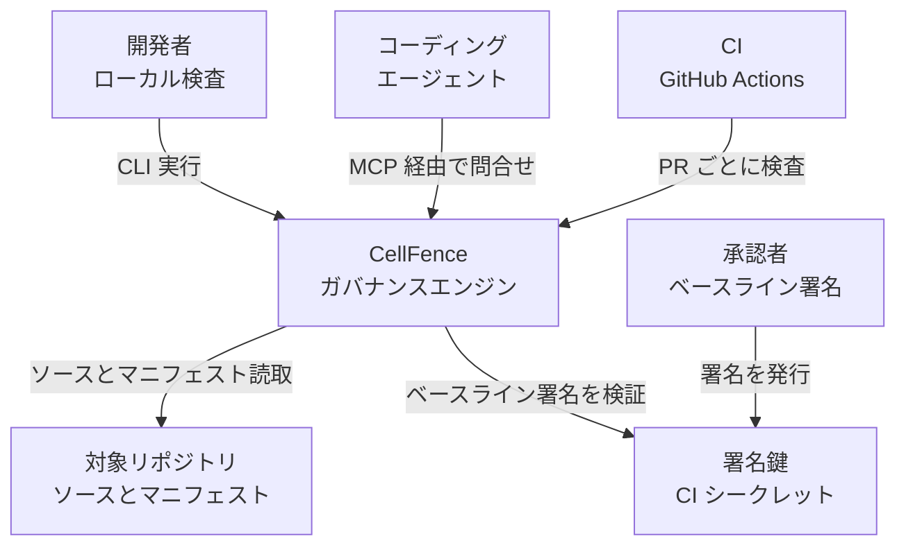
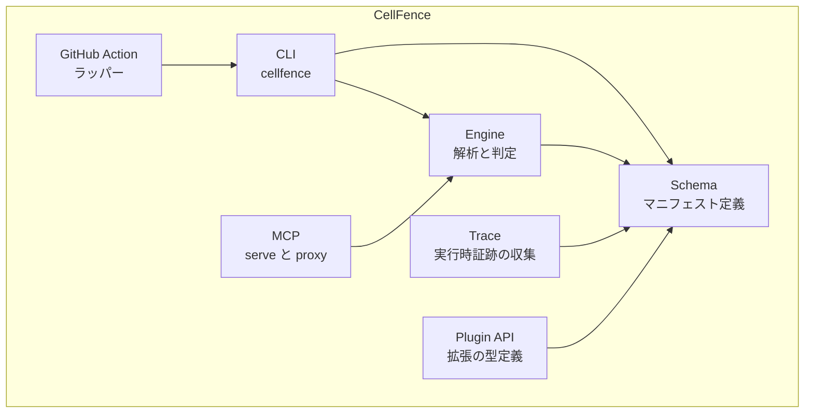
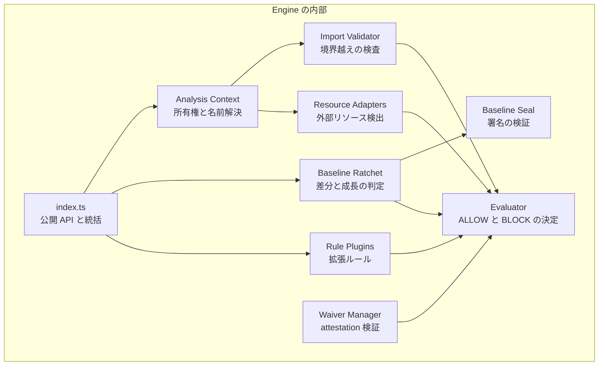
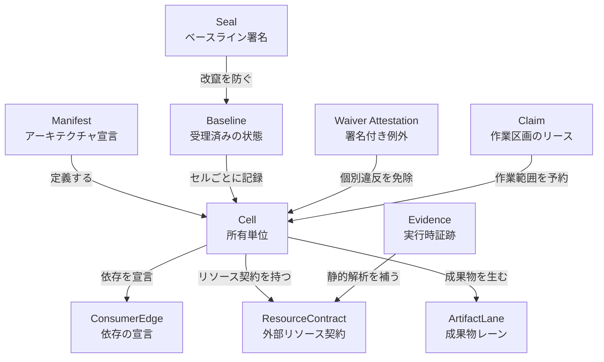
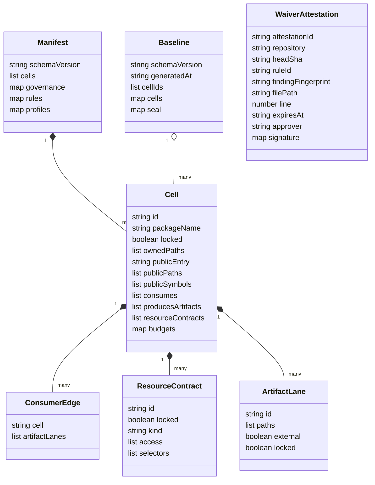

コーディングエージェントに実装を任せると、動くコードは出てきます。ただし、動くことと構造が保たれていることは別です。ドメイン層がインフラ層を直接参照する、内部実装を他モジュールから直に読む、サービスが他サービスのテーブルを直接叩く。レビューで毎回指摘していると、そのうち指摘が追いつかなくなります。

`AGENTS.md` に「レイヤーの依存方向を守ってください」と書く方法は広く使われていますが、この指示は検証されません。守ったかどうかを判定する主体が存在しないからです。

CellFence は、この制約をプロンプトの外側に置く OSS です。リポジトリのアーキテクチャ境界を 1 つのマニフェストファイルへ宣言し、境界が破られていないかを CI の終了コードとして判定します。

この記事では、CellFence が何をどう判定しているのか、内部構造とデータモデルまで踏み込んで整理します。導入を検討する際の判断材料になるよう、公式が明示している適用範囲の外側と、pre-release 特有の注意点も併せて扱います。


*この記事の全体像。以下、順に解説します。*

## 概要

CellFence は、リポジトリを **セル** という所有単位に分割し、セル間の依存と外部リソースへのアクセスを宣言的に管理する検査ツールです。リポジトリの自己紹介は「並行して作業するコーディングエージェント向けの、マニフェスト駆動のリポジトリガバナンス」となっています。

基本的な仕組みは次のとおりです。

1. `cellfence.manifest.json` に、各セルが所有するパス、公開するエントリー、依存してよい相手、アクセスしてよい外部リソースを宣言する
2. `cellfence check` が、実際のソースコードを AST で解析し、宣言と実装のずれを違反として報告する
3. CI で違反があれば終了コード 1 を返し、マージを止める

技術的な位置づけをまとめます。

| 項目 | 内容 |
|---|---|
| 実行方式 | CLI、GitHub Action、MCP サーバー |
| 対応言語 | TypeScript / JavaScript は `enforced`、Python は `partially_enforced` |
| 解析方式 | AST ベースの静的解析 + 任意の実行時証跡 |
| 実行環境 | Node.js 20 以上 |
| npm パッケージ | `cellfence` |
| ライセンス | Apache-2.0 |

### 成熟度について先に確認しておく

導入判断に直結するため、先に書いておきます。本プロジェクトは README 自身が pre-release であることを宣言しています。

> Status: pre-release v0.x. Schemas and CLI flags may still change between minor versions.

さらに、リポジトリ・npm 公開版・ドキュメントの三者にバージョンのずれがあります。

| 参照先 | バージョン |
|---|---|
| npm レジストリの `latest` | `0.1.13` |
| GitHub リポジトリのワークスペース | `0.2.1` |
| 一部ドキュメントの記述 | `0.4.0 prototype` |

つまり、ドキュメントに書かれている機能が npm の公開版に入っているとは限りません。後述しますが、公式の GitHub Action のデフォルトバージョンが npm に存在しない値を指しているという実害も出ています。

:::message alert
**この記事が対象とするバージョン**

以降の説明は、原則として GitHub リポジトリの `main`（`0.2.1` 系）を対象としています。公開版 `0.1.13` との差で、特に大きいものは次のとおりです。

| 機能 | `main`（0.2.1 系） | 公開版 `0.1.13` |
|---|---|---|
| 例外承認（waiver） | 署名付き attestation。ソース中の `approved-by` は拒否、最長 90 日 | 行ローカルのコメントのみ。期限・承認者・ルール・理由をコメントに書く |
| `cellfence waivers sign` | あり | **なし** |
| `@cellfence/mcp-proxy` | リポジトリ内に存在 | **npm 未公開**（リリースノートで意図的と明記） |
| ベースライン署名（Ed25519 / HMAC） | あり | あり |

`v0.1.13` のツリーには `docs/waivers.md` も engine の waiver 実装ファイルも存在しません。**公開版を使う場合、後述の attestation を用いた例外承認は利用できません。** 該当箇所には都度その旨を記載します。
:::

## 関連技術との比較

「ESLint の `no-restricted-imports` で足りるのでは」という疑問が最初に来ると思います。そこが一番の分かれ目なので、先に整理します。

| 比較項目 | CellFence | ESLint の no-restricted-imports | Nx / Turborepo | dependency-cruiser |
|---|---|---|---|---|
| 主な目的 | セル間の境界とリソースアクセスの宣言と強制 | ファイル単位のインポート禁止 | ビルドタスクの並列化とキャッシュ | 依存グラフの可視化とルール検査 |
| 制約の置き場所 | 中央の `cellfence.manifest.json` | 各 ESLint 設定 | ワークスペース設定 | 専用ルールファイル |
| 公開インターフェースの概念 | `publicEntry` と `publicSymbols` を宣言し、実装との一致を検査 | なし | パッケージの entry に依存 | なし |
| 外部リソースアクセスの検査 | あり（DB / キュー / HTTP / ファイル） | なし | なし | なし |
| 表面の増加抑止 | 合格時点を固定するラチェット（署名可能） | なし（個別に無効化） | なし | なし |
| 例外承認の仕組み | 期限付き waiver（`main` では署名付き attestation、最長 90 日） | `eslint-disable` コメント | なし | ルールコメント |
| 対応言語 | TypeScript / JavaScript / Python | JavaScript 系 | JavaScript 系 | JavaScript 系 |

差が出るのは次の 2 点です。

**1 つ目は、公開面そのものを検査対象にしている点です。** ESLint は個々のインポートを禁止できますが、「このモジュールの公開シンボルが 3 つ増えた」という事実を検知しません。CellFence は公開シンボルの集合をマニフェストに宣言させ、実装のエクスポートと一致しなければ違反にします。

**2 つ目は、制約を緩める操作に別の文書を経由させる点です。** ESLint なら、ルールに引っかかったエージェントは設定ファイルを書き換えるか `eslint-disable` を足せば通してしまえます。CellFence では、マニフェストを書き換えるだけでは `baseline check` は通りません。ベースラインという別の文書を更新する必要があり、さらに署名検証を構成していれば、その更新にはリポジトリ外の秘密鍵が要ります。この設計が中核なので、後の「運用」で詳しく扱います。

:::message
CellFence の README には競合比較表と性能表が掲載されていますが、いずれもリポジトリ内に `TODO(author): verify every competitor cell against current versions before publishing` というコメントが残っており、著者自身が未検証と印を付けています。この記事では両表を根拠として採用していません。上の比較表は各ツールの設計目的から筆者が整理したものです。
:::

用途別に整理すると、次の切り分けになります。

| ユースケース | 適した選択肢 |
|---|---|
| ファイル単位のコーディング規約・整形 | ESLint / Biome |
| 巨大モノレポのビルド時間短縮と依存グラフ整理 | Nx / Turborepo |
| 依存グラフの可視化とルール検査 | dependency-cruiser |
| 既存違反を許容しつつ新規違反だけを止め、緩和には人の承認を必須にしたい | CellFence |

## 特徴

- **宣言的マニフェスト**: `cellfence.manifest.json` に所有パス、公開エントリー、公開シンボル、依存先、リソース契約を定義します。未知のフィールドは無視されずエラーになるため、綴り間違いが黙って通ることはありません。
- **ラチェット（ベースライン）**: 検査に合格した時点のアーキテクチャ表面（公開シンボル集合、依存エッジ集合、所有パス集合など）を固定し、以後の増加方向の変化を検知します。マニフェストを書き換えて公開面を広げても、ベースラインを更新しない限り `baseline check` は通りません。ベースラインには Ed25519 または HMAC-SHA256 の署名を付けられます。署名の付与は任意ですが、付けて検証を構成すると、ベースラインの手編集も検出できます。
- **リソースアクセスの静的解析**: Prisma / TypeORM / Drizzle / BullMQ / KafkaJS / NestJS / Fastify / Django / FastAPI / SQLAlchemy / Celery など 16 種のアダプタで、DB・キュー・HTTP・ファイルへのアクセスを検知します。解決できないアクセスは安全側に倒して違反にします。
- **例外承認の外部化**（`main` のみ）: ソース中の `// cellfence-ignore` コメントは申請へのポインタでしかありません。承認は、リポジトリ外の鍵で署名された attestation ファイルが担います。有効期限は最長 90 日です。公開版 `0.1.13` では、期限と承認者をコメントに直接書く行ローカル方式です。
- **エージェント連携**: MCP サーバー、`AGENTS.md` / `CLAUDE.md` への規約埋め込み、エージェント間で作業区画を予約するクレームリースを備えます。
- **自己適用**: CellFence 自身が 17 セルのマニフェストで管理され、CI で自分自身に対して `baseline check` を実行しています。

## 構造

### システムコンテキスト図



| 要素名 | 説明 |
|---|---|
| 開発者 | ローカルで検査を実行し、違反を直す人 |
| コーディングエージェント | MCP 経由でセルの契約を取得し、その範囲内で変更を行う実行主体 |
| CI | PR ごとに検査を実行し、違反があればマージを止める外部システム |
| 承認者 | ベースラインの拡大を承認し、署名を発行する人 |
| CellFence | マニフェストとソースを突き合わせ、違反を判定するエンジン |
| 対象リポジトリ | 検査対象のソースと `cellfence.manifest.json` |
| 署名鍵 | ベースライン署名の秘密鍵。PR ジョブには公開鍵だけを渡す |

この図で注目すべきは、**承認者と署名鍵をリポジトリの外に置ける**ことです。リポジトリ内のファイルは、エージェントも PR 作成者も書き換えられます。だからこそ、制約を緩める権限だけは外へ出す設計になっています。ただしこれは署名検証を構成した場合の姿であり、既定で自動的にそうなるわけではありません。

### コンテナ図



| 要素名 | npm 名 | 説明 |
|---|---|---|
| CLI | `cellfence` | 唯一の公開バイナリ。引数解析と出力整形を担う |
| GitHub Action | `@cellfence/github-action` | CI 用の薄いラッパー。実体は `npx cellfence` を呼ぶコンポジットアクション |
| MCP | `@cellfence/mcp-proxy` | 下流 MCP サーバーの書込を検査するプロキシ。**公開版 `0.1.13` では npm 未公開**。公開版で使えるのは CLI 内蔵の `serve --mcp` のみ |
| Engine | `@cellfence/engine` | インデックス化、AST 解析、ルール評価、ベースライン比較、waiver 検証を担う中核 |
| Trace | `@cellfence/trace` | 実行時証跡の収集。Node の `fs` と `fetch` を monkey patch して best-effort で記録し、DB・HTTP・キューは明示的な helper 呼び出しの記録を取り込む。パッチ前に取得された参照や ESM の named import は観測から漏れるため、「アクセスが無かった」証明には使えない |
| Plugin API | `@cellfence/plugin-api` | ルールプラグインとリソースアダプタが実装する安定インターフェース |
| Schema | `@cellfence/schema` | マニフェスト・ベースライン・証跡の型定義と JSON Schema |

依存は一方向です。`schema` が最下層、その上に `plugin-api` と `engine`、さらに上に `cli` と各ラッパーが載ります。興味深いのは、`engine` が `plugin-api` に依存していない点です。`engine` は構造的に同じ型を自前で持っています。これにより、ルールプラグインが `engine` 本体を巻き込むことがありません。自分自身のルールを設計に反映している例と言えます。

### コンポーネント図



| 要素名 | 説明 |
|---|---|
| index.ts | CLI や外部から呼ばれる公開 API。検査の順序を統括する |
| Analysis Context | マニフェストから所有権情報とパッケージルートを導出する |
| Import Validator | インポートを解決し、private 参照や未宣言依存を検出する |
| Resource Adapters | ORM や Web フレームワークのコードを解釈し、リソースアクセスを抽象化する |
| Baseline Ratchet | 現在の状態とベースラインを比較し、増加方向の変化を違反として扱う |
| Baseline Seal | Ed25519 または HMAC-SHA256 でベースラインの署名を検証する |
| Waiver Manager | `cellfence-ignore` 指示と署名付き attestation を突き合わせる |
| Evaluator | 検出結果と証跡の完全性から `ALLOW` / `BLOCK` / `NOT_EVALUATED` を決める純関数層 |
| Rule Plugins | ブラスト半径や依存主権など、追加のルールを提供する拡張 |

設計上の要点は、**観測と決定を分離している**ことです。まず検査対象のファイル集合をスナップショットとして固定し、次に各観測系統がそれを処理します。このとき、パースに失敗したファイルや解決できない参照は「観測できなかった」という証跡として記録されます。

そして最終判定を行う Evaluator は、ファイルシステムや git、環境変数に一切触れません。渡された検出結果と証跡だけを見て結論を出します。結果として、証跡が不完全なら違反 0 件でも `CELLFENCE_EVIDENCE_COVERAGE` として安全側へ倒せます。「解析できなかった部分は安全とみなさない」という方針が、層の分離によって構造的に保証されています。

## データ

### 概念モデル



| 要素名 | 説明 |
|---|---|
| Manifest | アーキテクチャ制約のルート。`cellfence.manifest.json` |
| Cell | 所有パス群と 1 つの公開エントリーを持つ論理モジュール |
| ConsumerEdge | あるセルが別のセルへ依存してよいという宣言 |
| ResourceContract | セルがアクセスしてよい DB・キュー・HTTP・ファイルの契約 |
| ArtifactLane | セルが生成し、他のセルが消費してよい成果物のパス契約 |
| Baseline | 検査に合格した時点のアーキテクチャ表面のスナップショット。違反そのものは保持しない |
| Seal | ベースラインの署名。ガバナンスの実質的な境界 |
| Waiver Attestation | 個別の違反を期限付きで免除する証明。`main` ではリポジトリ外で署名される |
| Claim | 並行するエージェント同士が同じ範囲を触らないための作業リース |
| Evidence | 静的解析で捉えられない実行時のリソースアクセス記録 |

このモデルで最も重要なのは、**Manifest と Baseline が別の文書である**ことです。

- Manifest は「どうあるべきか」の宣言。開発者もエージェントも自由に書き換えられる
- Baseline は「何が既に承認されているか」の記録。署名により書き換えが検出される

この分離が、後述するラチェットの成立条件になっています。

### 情報モデル



主なフィールドの意味と制約です。`WaiverAttestation` は `main` の構造で、公開版 `0.1.13` には存在しません。

| 型 | フィールド | 必須 | 意味と制約 |
|---|---|---|---|
| Manifest | `schemaVersion` | 必須 | `cellfence.manifest.v1` 固定。他の値はエラー |
| Manifest | `cells` | 必須 | セルの配列。`id` はリポジトリ内で一意 |
| Manifest | `governance` | 任意 | 検査対象範囲、必須ルール、リソースアダプタの on/off |
| Manifest | `extends` / `plugins` | 予約 | 存在するだけでエラー。将来の拡張のため予約されている |
| Cell | `ownedPaths` | 必須 | 所有パスのパターン。リポジトリ相対、`..` 不可 |
| Cell | `publicEntry` | 必須 | 唯一の公開エントリー。`ownedPaths` に含まれる必要がある |
| Cell | `publicSymbols` | 必須 | 公開シンボル名。実装のエクスポートと一致しないと違反 |
| Cell | `consumes` | 任意 | 依存してよい相手セル。相手セルの実在が検証される |
| Cell | `locked` | 任意 | 人のレビューが必須な面。ベースライン拡大を拒否する |
| Cell | `budgets` | 任意 | 所有パターン数・公開シンボル数・公開面行数・依存数の上限 |
| ResourceContract | `kind` | 必須 | `file` / `database` / `queue` / `http` |
| ResourceContract | `access` | 必須 | `read` / `write` / `publish` / `subscribe` / `call` / `serve` |
| ResourceContract | `selectors` | 必須 | テーブル名・トピック名・ルート・パスなどの識別子 |
| ArtifactLane | `paths` | 必須 | 成果物のパス契約。`external: true` でない限り所有パス内 |
| Baseline | `seal` | 任意 | `ed25519` の `signature` か `hmac-sha256` の `digest` |
| WaiverAttestation | `expiresAt` | 必須 | 評価時点から最長 90 日 |
| WaiverAttestation | `approver` | 必須 | 環境変数 `CELLFENCE_APPROVERS` の許可リストに含まれること |
| WaiverAttestation | `findingFingerprint` | 必須 | 対象違反の指紋。ルール・重大度・パス・セルから算出する sha256 |

`governance` ブロックの主なキーです。

| キー | 意味 | 値 |
|---|---|---|
| `requireOwnership` | 対象ファイルがすべていずれかのセルに属することを要求 | boolean |
| `include` / `exclude` | 検査対象のパスパターン | 文字列配列 |
| `requiredRules` | 常に `error` へ固定するルール。弱めると違反 | ルール ID 配列 |
| `resourceAdapters` | 16 種のリソースアダプタの有効・無効 | `on` / `off`、省略時は `on` |
| `pathClasses` | パスを source / runtime / generated へ分類し、コミット方針を課す | オブジェクト配列 |

`publicSymbols` を必須にしている点が、この設計の芯です。「このモジュールは何を公開しているか」を人が明示的に書き、実装との一致を機械が検査します。公開面が意図せず広がることを、宣言と実装の突き合わせで捉えています。

## 構築方法

### 前提条件

- Node.js 20 以上
- 対象リポジトリが TypeScript / JavaScript または Python であること
- GitHub Actions を使う場合、`contents: read` と、SARIF を送るなら `security-events: write`

### インストール

```bash
npm install --save-dev cellfence
```

前述のとおり npm の最新は `0.1.13` です。CI では必ずバージョンを固定します。

```bash
npm install --save-dev cellfence@0.1.13
```

### マニフェストの初期化

リポジトリのルートで初期化すると `cellfence.manifest.json` が生成されます。

```bash
npx cellfence init
```

プリセットは `python-service` と `polyglot-monorepo` の 2 つです。

```bash
npx cellfence init --preset polyglot-monorepo
```

生成内容は対象リポジトリによって変わります。`init` はまず既存のディレクトリ構成やワークスペースからセル候補を推論し、候補を見つけられなかった場合にだけ `example` セル（`src/example/**`）をフォールバックとして作ります。ここでは構造を読み取りやすくするため、同じ形をした説明用の最小例を示します。

```json
{
  "schemaVersion": "cellfence.manifest.v1",
  "governance": {
    "requireOwnership": true,
    "include": ["src/**"],
    "requiredRules": [
      "CELLFENCE_PRIVATE_IMPORT",
      "CELLFENCE_UNDECLARED_CONSUMER",
      "CELLFENCE_UNOWNED_SOURCE"
    ]
  },
  "cells": [
    {
      "id": "app",
      "ownedPaths": ["src/app/**"],
      "publicEntry": "src/app/public.ts",
      "publicSymbols": ["app"],
      "consumes": [],
      "producesArtifacts": []
    }
  ]
}
```

### 既存のサービス定義からの生成

サービスごとの記述子が既にある場合、そこからマニフェストを生成・検証できます。

```bash
npx cellfence init --from "systems/*/service.json"
npx cellfence manifest verify --from "systems/*/service.json"
```

`--preset` と `--from` は同時に指定できません。

## 利用方法

日常的に使うコマンドは次の 4 つに集約されます。

- `cellfence check`: マニフェストに対する違反の検査
- `cellfence baseline check`: ベースラインに対する増加方向の検査
- `cellfence graph`: セル間依存の可視化
- `cellfence context`: エージェントへ渡すセル契約の取り出し

### 検査の実行

カレントディレクトリのマニフェストに基づいて検査します。

```bash
npx cellfence check
```

PR では、base と比較して新規に増えた違反だけを報告させられます。

```bash
npx cellfence check --changed --base origin/main
```

名前に反して、これは変更ファイルだけを検査するモードではありません。現在のツリー全体を解析したうえで、安定した違反フィンガープリントを base 側と突き合わせ、base に無かったものだけを報告します。したがって解析時間は縮まりません。既存の違反を報告から外し、その PR が持ち込んだ分だけを見せるための機能です。

終了コードの意味は次のとおりです。

| 終了コード | 意味 |
|---|---|
| 0 | 違反なし |
| 1 | ガバナンス違反あり |
| 2 | 設定またはマニフェストの誤り |
| 3 | ツール内部エラー |

### 出力形式

`check` が受け付ける `--format` は `markdown` と `sarif` の 2 つです。`--json` と `--format` は同時に指定できません。

```bash
npx cellfence check --format markdown
npx cellfence check --format sarif > cellfence.sarif
```

監査ログとサマリを別ファイルへ書き出せます。

```bash
npx cellfence check \
  --audit-log tmp/cellfence/audit.jsonl \
  --summary-json tmp/cellfence/summary.json
```

### 依存関係の可視化

セル間の依存を Mermaid として出力します。ドキュメントへ貼るための可視化であり、公式も「強制の代替ではない」と明記しています。

```bash
npx cellfence graph --format mermaid
```

### エージェント向けコンテキストの提供

対象セルの契約を、エージェントが読める形で取り出せます。

```bash
npx cellfence context --cell reporting --format agents-md
npx cellfence context --auto-allocate --task "change the reporting cell" --json
```

`AGENTS.md` や `CLAUDE.md` へ、管理ブロックとして規約を埋め込むこともできます。

```bash
npx cellfence install --target agents-md --file AGENTS.md
npx cellfence install --check
```

MCP サーバーとして起動すると、`get_cell_context` / `check_change` / `create_claim` / `explain_finding` の 4 ツールを提供します。

```bash
npx cellfence serve --mcp
```

## 運用

### ベースラインによる段階導入

ここは誤解しやすいところなので、先に正確に書きます。**ベースラインは「既存の違反を許容リストとして登録する」仕組みではありません。**

```bash
npx cellfence baseline create
npx cellfence baseline check
```

`baseline create` は内部でベースライン無しの検査を実行し、**違反が残っていれば例外を投げて生成に失敗します。** つまりベースラインを作れるのは、検査に合格した状態だけです。保存されるのも違反のフィンガープリントではなく、セルごとの件数と集合です。

したがって、既存の巨大なコードベースへ入れる手順はこうなります。

1. セル・公開エントリー・所有パスを宣言する
2. **まず `check` を合格させる。** 実態に合わせて宣言を書く段階であり、違反を消す作業ではない
3. 合格した時点で `baseline create` を実行し、その表面を固定する
4. CI で `baseline check` を回し、以後の増加だけを止める

ベースラインが記録するのは、セル ID 集合、所有パス集合、公開エントリーのパス、公開シンボル集合、公開面の署名ハッシュ、依存エッジ集合、成果物契約、リソースアクセス目録です。**減る方向の変化は通り、増える方向だけが一方向に閉じます。**

言い換えると、ベースラインは「今の汚さを許す」道具ではなく、「今の広さから広げさせない」道具です。まず現状を正直に宣言して合格させ、そこから先の拡大に人の承認を要求する、という設計になっています。

ここが CellFence の核心なので、具体例で説明します。エージェントが内部関数を公開したいとき、次の 2 つを同時にやれば整合は取れます。

1. `src/parser/public.ts` に `export` を追加する
2. マニフェストの `publicSymbols` にその名前を足す

この状態で `cellfence check` は通ります。マニフェストと実装が一致しているからです。しかし `cellfence baseline check` は落ちます。ベースラインに記録された公開シンボル集合と一致しないためです。

> Editing the manifest authorizes nothing by itself.

**マニフェストの編集それ自体は何も承認しない。** ドキュメントのこの一文が設計思想を端的に表しています。制約の宣言（マニフェスト）と、制約を緩める記録（ベースライン）を、別の文書に分けているわけです。

ただし、ここで止まると防御は 1 段だけです。ベースラインファイル自体もリポジトリ内にあるので、エージェントは `baseline update` を実行すれば通せてしまいます。2 段目が次に述べる署名です。

### CI への組み込み

PR ごとに検査し、違反があればマージを止めます。

```yaml
- uses: actions/setup-node@v6
  with: { node-version: 20 }
- run: npm ci
- run: npx cellfence check --changed --base origin/main
- run: npx cellfence baseline check
```

SARIF を GitHub のコードスキャンへ送ると、違反が PR の該当行に表示されます。

```yaml
- name: Emit SARIF
  if: always()
  run: npx cellfence baseline check --format sarif > cellfence.sarif
- uses: github/codeql-action/upload-sarif@v3
  if: always()
  with:
    sarif_file: cellfence.sarif
```

:::message alert
公式が提供する GitHub Action のラッパーは、デフォルトで `cellfence@0.2.1` を実行しますが、このバージョンは npm に公開されていません（最新は `0.1.13`）。ラッパーを使う場合は `version` 入力で実在するバージョンを明示的に指定してください。公式ドキュメント自身も「A reusable externally pinned GitHub Action remains pre-release」と述べています。
:::

### ベースライン署名の分離

ベースラインの署名は**任意**です。付けなければラチェットは「ベースラインファイルを更新しないと通らない」という一段の防御に留まります。署名を付けて検証を構成して初めて、承認の権限がリポジトリの外へ出ます。逆に言えば、**署名検証を構成していない CI では、外部鍵による保護は働きません。**

公式の Root of Trust 文書も seal を任意と位置づけ、v0.x のリポジトリ内検査だけでは完全な信頼の起点にならないと明記しています。外部の改竄不能なチェッカーや封印されたハッシュ台帳は、いずれも `planned` で未実装です。

構成する場合、PR ジョブへ渡すのは公開鍵だけにします。

```bash
export CELLFENCE_BASELINE_ED25519_PUBLIC_KEY="$(cat baseline-ed25519-public.pem)"
npx cellfence baseline verify
npx cellfence baseline check
```

署名は、承認を経た別のワークフローでのみ行います。

```bash
export CELLFENCE_BASELINE_ED25519_PRIVATE_KEY="$(cat baseline-ed25519-private.pem)"
export CELLFENCE_BASELINE_ED25519_KEY_ID="baseline-2026q3"
npx cellfence baseline sign
```

秘密鍵を、信頼できない PR のコードが動くジョブへ渡してはいけません。Ed25519 が推奨されるのは、PR 側の検証に公開鍵しか要らないためです。HMAC-SHA256 も選べますが、検証にも同じ共有鍵が必要になるため、隔離された検証環境に限る運用が推奨されています。

さらに、`locked: true` を付けたセルは、検証鍵が設定されていないと `baseline check` が通りません。重要な境界だけを人のレビュー必須にできます。

### 例外承認の運用

ここは 2 つのバージョンで方式が大きく異なります。

| | 公開版 `0.1.13` | `main`（0.2.1 系） |
|---|---|---|
| 承認の所在 | ソースコード中のコメント | リポジトリ外の署名済み attestation |
| コメントに書く内容 | ルール、期限、承認者、理由 | ルールと `attestation:<id>` のみ |
| `waivers sign` | なし | あり |
| 期限の上限 | 明示的な上限なし | 90 日 |

**公開版 `0.1.13` の場合**は、行ローカルのコメントで完結します。期限・承認者・具体的なルール・理由のいずれかが欠けると検査に落ちます。

以下は `main` の方式です。まず申請を作ります。このコマンドはソースを書き換えません。

`--json` を付けないと Markdown が出力され、次の署名手順で解析できません。承認者も指定します。

```bash
npx cellfence waivers request \
  --rule CELLFENCE_UNRESOLVED_IMPORT \
  --file src/app/main.ts \
  --line 42 \
  --expires 2026-10-31 \
  --reason "legacy import path pending refactor" \
  --approved-by alice \
  --json > waiver-request.json
```

承認された環境で署名し、attestation ファイルを出力します。署名にはベースラインの Ed25519 とは別に、**共有の HMAC 鍵**が必要です。

```bash
export CELLFENCE_WAIVER_ATTESTATION_HMAC_KEY="$(cat waiver-hmac.key)"
export CELLFENCE_REPOSITORY_IDENTITY="example-org/example-repo"

npx cellfence waivers sign \
  --from waiver-request.json \
  --attestation-id waiver-2026-09-core-import \
  --finding-fingerprint <sha256> \
  --approved-by alice \
  --output .cellfence/waiver-attestations/waiver-2026-09-core-import.json
```

承認者が未確定（`PENDING`）のままだと署名は失敗します。`--finding-fingerprint` は小文字 64 桁の sha256 である必要があり、対象の違反から取得します。

検証する CI 側では、HMAC 鍵に加えて承認者の許可リストを設定します。

```bash
export CELLFENCE_WAIVER_ATTESTATION_HMAC_KEY="$(cat waiver-hmac.key)"
export CELLFENCE_REPOSITORY_IDENTITY="example-org/example-repo"
export CELLFENCE_APPROVERS="alice,bob"
```

:::message alert
waiver の署名は共有 HMAC 鍵方式のため、**検証側にも同じ秘密鍵が必要**です。ベースラインの Ed25519 のように「PR ジョブへ公開鍵だけ」という分離ができません。信頼できない PR のコードが動くジョブへこの鍵を渡してはいけません。
:::

ソース側には、対象行の直前にポインタだけを置きます。

```ts
// cellfence-ignore CELLFENCE_UNRESOLVED_IMPORT attestation:waiver-2026-09-core-import
import { legacy } from "./legacy";
```

`main` ではソース中に `approved-by:` を書くとエラーになります。理由は明快で、PR は同じ差分の中でその行を書き換えられるからです。承認はリポジトリの外にしか存在しません。同じ理屈で、承認者の許可リストは CODEOWNERS ではなく環境変数 `CELLFENCE_APPROVERS` から読まれます。PR が CODEOWNERS を同じ差分で書き換えられる以上、そこを信頼できないという判断です。

有効期限は最長 90 日です。これはエージェントが恒久的な免除を 1 つのコメントに焼き付けることを防ぐための上限として設定されています。さらに、必須ルールに指定されたものは免除自体ができません。

公開版から `main` の方式へ移る際は、ソース中に承認者を書く運用がそのままエラーになるため、既存の waiver コメントの書き換えが必要になります。

### 並行エージェントの排他

複数のエージェントが同時に作業する場合、作業範囲をリースとして予約できます。

```bash
npx cellfence claim create --agent codex-1 --cell parser --ttl 2h
npx cellfence claim check --agent codex-1
```

これは調整のための仕組みであり、書き込みを物理的に禁止するものではありません。永続化されるバックエンドは現時点で `local-file` のみです。

## ベストプラクティス

運用で効いてくる指針は次の 4 点です。

- 適用範囲を過大評価しない
- ベースラインの拡大を実装 PR から切り離す
- 使っていないリソースアダプタを明示的に切る
- エージェント側に規約を配り、改竄を検知する

### 適用範囲を過大評価しない

CellFence 自身が README で「これに使うな」を明示しています。

- ランタイムのサンドボックス、ツール呼び出しの権限管理
- 保護ブランチ、コードレビュー、ESLint、Nx、CODEOWNERS の代替
- 生成コードの機能的な正しさの保証
- 悪意あるリポジトリ管理者や、侵害された CI ランナーへの防御

ドキュメントには「CellFence does not prevent an agent from editing a path at runtime」「CellFence does not identify which particular agent wrote a changed file」とも書かれています。**リポジトリが残した最終状態を検証する仕組みであり、実行中の書き込みを止めるものではありません。** エージェントごとの書き込み権限を強制したいなら、worktree の分離、ファイルシステムやサンドボックスの権限、保護ブランチと組み合わせる必要があります。

この線引きが明示されているのは、評価する側としてはありがたい設計です。できないことを書いているツールのほうが、判断材料としては信用できます。

### ベースラインの拡大を実装 PR から切り離す

ベースラインの更新は実装の変更ではなく、ガバナンスの変更です。同じ PR に混ぜると、レビュアーは実装差分に埋もれて境界の拡大を見落とします。

ベースラインファイルのディレクトリには、セル所有者とは別の CODEOWNERS を設定します。

```
/.cellfence/baselines/   @alice @bob
```

ドキュメントの指摘が的確です。セル所有者が自分でベースラインを広げられるなら、この仕組みは何も変えません。承認者と実装者を分けて初めて、ラチェットは機能します。

### 使っていないリソースアダプタを明示的に切る

誤検知を減らし解析を軽くするため、使っていないフレームワークのアダプタを `off` にします。省略時はすべて `on` です。

```json
{
  "governance": {
    "resourceAdapters": {
      "prisma": "off",
      "typeorm": "off",
      "sqlalchemy": "off"
    }
  }
}
```

ただし、対応していないライブラリが安全とみなされるわけではありません。ドキュメントは「Unsupported adapters are not treated as implicitly safe」と明記しています。解決できないアクセスは、契約の宣言か証跡の提出を要求されます。

### エージェント側に規約を配り、改竄を検知する

エージェントは、検査に落ちたとき「ベースラインを更新して黙らせる」という最短経路を選びがちです。公式はこれを封じる文言を用意しています。

> When `cellfence check` fails, DO NOT run `cellfence baseline update` to silence the error. Baseline updates require human governance review.

この文言は `cellfence install` で `AGENTS.md` や `CLAUDE.md` へ管理ブロックとして埋め込めます。ブロックにはチェックサムが付き、`install --check` が改竄・陳腐化・重複を検知します。

規約は書いて終わりではなく、書いた状態が保たれているかを検査するところまで含めて設計されています。指示の遵守を期待するのではなく、指示の存在自体を機械が確認する構図です。

## トラブルシューティング

つまずきどころは大きく 3 つに分かれます。

- マニフェストの宣言と実装の食い違いによる違反
- 静的解析で解決できないコードによる、安全側に倒した違反
- リポジトリ・npm 公開版・ドキュメントのバージョン差

### 主なエラーコードと対処

| エラーコード | 原因 | 対処 |
|---|---|---|
| `CELLFENCE_UNOWNED_SOURCE` | 検査対象のファイルがどのセルの `ownedPaths` にも属していない | 所属すべきセルの `ownedPaths` を広げるか、新しくセルを定義する |
| `CELLFENCE_PRIVATE_IMPORT` | 他セルの公開エントリー以外を直接インポートしている | 公開エントリー経由に直すか、相手セルの所有者へ公開を依頼する |
| `CELLFENCE_UNDECLARED_CONSUMER` | 依存が消費側のマニフェストに宣言されていない | インポートをやめるか、`consumes` へ相手セルを宣言する |
| `CELLFENCE_PUBLIC_SYMBOL_MISMATCH` | `publicSymbols` と実際のエクスポートが一致しない | 実装側のエクスポートを直すか、マニフェストを実態へ合わせる |
| `CELLFENCE_UNDECLARED_RESOURCE_ACCESS` | 宣言のない DB・キュー・HTTP・ファイルへのアクセス | アクセスをやめるか、`resourceContracts` へ契約を宣言する |
| `CELLFENCE_UNRESOLVED_IMPORT` | 相対インポートを静的に解決できない | 動的なパス生成をやめ、静的な文字列リテラルへ書き換える |
| `CELLFENCE_RATCHET_PUBLIC_SYMBOL_SET_CHANGE` | ベースラインにない公開シンボルが増えた | 内部に留めるか、承認を得てベースラインを更新・再署名する |
| `CELLFENCE_BASELINE_SEAL_INVALID` | ベースラインが手で書き換えられ、署名と一致しない | `baseline update` と `baseline sign` で正規の手順を踏み直す |
| `CELLFENCE_LOCKED_BASELINE_EXPANSION` | `locked: true` のセルを広げようとした | 人のレビューを通す。自動更新はできない |
| `CELLFENCE_WAIVER_INVALID` | waiver が期限切れ、必須項目の欠落、または必須ルールを免除しようとした（`main` では attestation の不備や 90 日超過も含む） | 必須ルールは免除できないため、実装側を直す |
| `CELLFENCE_EVIDENCE_COVERAGE` | 観測が不完全で、状態を証明できない | パースできないファイルを特定して解消する |

各違反には、機械可読な修正候補が付きます。種別は `change-code` / `change-manifest` / `update-baseline` / `ask-human` の 4 つで、それぞれに承認が必要かどうかのフラグが付きます。エージェントへ「どう直せるか」を構造化して渡す設計です。

### 解析できないコードの扱い

パースできない構文や、動的に組み立てたインポートは、黙って無視されず違反になります。

- `CELLFENCE_UNSUPPORTED_DYNAMIC_IMPORT`
- `CELLFENCE_UNSUPPORTED_DYNAMIC_REQUIRE`
- `CELLFENCE_UNSUPPORTED_TYPESCRIPT_SYNTAX`
- `CELLFENCE_UNSUPPORTED_PYTHON_SYNTAX`

これらはいずれも免除できない必須ルールです。安全側に倒す設計なので、導入直後は「動くのに落ちる」状態がまとまって出ます。これはバグではなく想定挙動です。

注意すべきは、**これらをベースラインで先送りできない**ことです。前述のとおり `baseline create` は違反が残っていると失敗するため、`check` を合格させるまでベースラインを作れません。動的インポートの静的化などは、導入作業そのものとして先にやり切る必要があります。この初期コストの見積もりが、導入可否の実質的な分かれ目になります。

### バージョンとドキュメントの食い違い

pre-release であることに起因する注意点を整理します。

| 事象 | 内容 |
|---|---|
| npm とリポジトリの差 | npm の最新は `0.1.13`、リポジトリは `0.2.1` |
| 公式 Action のデフォルト | npm に存在しない `0.2.1` を指す。`version` 入力で固定が必要 |
| ドキュメント先行 | 一部ドキュメントは `0.4.0 prototype` を記述 |
| ヘルプ非掲載のコマンド | `coverage` や `baseline gate` は実装されているが `--help` に出ない |
| 機能自体の欠落 | 署名付き waiver attestation と `waivers sign` は `main` にのみ存在し、`v0.1.13` のツリーには実装ファイルすら無い |

**GitHub 上のドキュメントは `main` を映しています。** 公開版を使うなら、`main` の `docs/` ではなく、使用するタグのツリーを直接参照してください。タグを指定した URL（`.../tree/v0.1.13/docs/`）で、そのバージョン時点のドキュメントを読めます。同じ理由で、README の CLI 一覧や自己適用図も更新から漏れることがあります。自己適用図についてはリポジトリ内に「CI が再生成しないため陳腐化しうる」旨の TODO が残っています。

## まとめ

CellFence は、アーキテクチャの制約をプロンプトから CI の終了コードへ移すための OSS です。整理すると次の 3 点に集約されます。

1. **公開面を宣言させ、実装との一致を検査する。** 依存方向だけでなく、モジュールが何を公開しているかを制約対象にしている点が、既存のリンタとの構造的な違いです。
2. **制約の宣言と、制約を緩める記録を分離している。** マニフェストは誰でも書き換えられますが、それだけでは `baseline check` は通りません。ベースラインという別の文書を更新する必要があり、署名検証を構成すればその更新にリポジトリ外の秘密鍵が要ります。エージェントが自分で制約を緩める抜け道を、段階的に塞げる構造になっています。
3. **できないことを明示している。** ランタイムの防御でも、レビューの代替でもありません。リポジトリが残した最終状態を検証する仕組みです。

判断材料としては、**成熟度と設計思想を分けて評価する**のが妥当だと考えます。npm 公開版とリポジトリとドキュメントがずれている pre-release であり、機能によっては公開版に存在しません。今すぐ本番の必須チェックに据えるのは慎重になるべきです。試すなら、まず 1 つのサービスやパッケージに絞り、`baseline create` で現状を受理してから `check --changed` を warning 扱いで回し、検出内容が自分たちの設計意図と合うかを見るのが妥当な入口です。

一方で「制約の宣言と、緩和の承認を別の権限に置く」という設計そのものは、自前で仕組みを作る場合でも参考になります。エージェントに書かせる量が増えるほど、レビューは追いつかなくなります。そのとき効くのは、指示を増やすことではなく、指示が守られたかを判定する主体を用意することです。そして判定主体が、判定される側から書き換えられる場所にあってはいけません。CellFence の設計が一貫して示しているのはこの一点で、ツールを採用するかどうかとは別に、持ち帰る価値のある観点だと考えます。

この記事が少しでも参考になった、あるいは改善点などがあれば、ぜひリアクションやコメント、SNSでのシェアをいただけると励みになります！

## 参考リンク

### 一次資料（リポジトリ）

- [CellFence GitHub リポジトリ](https://github.com/pushnanashi2/CellFence)
- [README](https://github.com/pushnanashi2/CellFence/blob/main/README.md)
- [アーキテクチャ](https://github.com/pushnanashi2/CellFence/blob/main/docs/architecture.md)
- [マニフェスト仕様](https://github.com/pushnanashi2/CellFence/blob/main/docs/manifest.md)
- [ルール一覧](https://github.com/pushnanashi2/CellFence/blob/main/docs/rules.md)
- [ラチェット](https://github.com/pushnanashi2/CellFence/blob/main/docs/ratchets.md)
- [例外承認](https://github.com/pushnanashi2/CellFence/blob/main/docs/waivers.md)
- [CI 連携](https://github.com/pushnanashi2/CellFence/blob/main/docs/ci.md)
- [制約と非目標](https://github.com/pushnanashi2/CellFence/blob/main/docs/limitations.md)
- [実装状況](https://github.com/pushnanashi2/CellFence/blob/main/docs/implementation-status.md)
- [プラグイン API](https://github.com/pushnanashi2/CellFence/blob/main/docs/plugin-api.md)

### 配布と関連

- [npm パッケージ cellfence](https://www.npmjs.com/package/cellfence)
- [SARIF 2.1.0 仕様](https://docs.oasis-open.org/sarif/sarif/v2.1.0/sarif-v2.1.0.html)
- [GitHub コードスキャンへの SARIF アップロード](https://docs.github.com/en/code-security/code-scanning/integrating-with-code-scanning/uploading-a-sarif-file-to-github)
- [dependency-cruiser](https://github.com/sverweij/dependency-cruiser)
