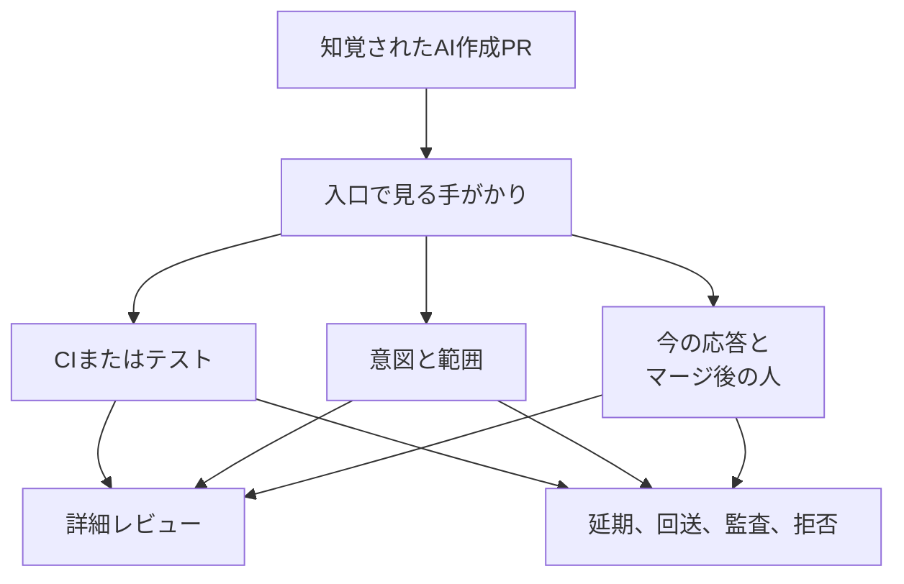

サスカチュワン大学の Md Shamimur Rahman、Khairul Alam、Banani Roy、Chanchal K. Roy は、レビュアーが AI 作成だと知覚するプルリクエストを、いつ詳細なレビューにかけるかを質問紙で調べました。有効回答は 239 人、31 か国です。論文は [arXiv:2610.11179v1](https://arxiv.org/abs/2610.11179)（2026年10月8日、[HTML](https://arxiv.org/html/2610.11179v1)）です。書誌に会議採録は無く、結果は提示されたシナリオへの自己申告です。

この記事では、論文がレビュー可能性と呼ぶ入口、回答者が選んだ条件、受け入れる方針のプロジェクトが説明と検証と担当を欄に分けるときの材料を整理します。

*この記事の全体像。以下、順に解説します。*

## レビュー可能性とは

論文は、AI が作成したとレビュアーが知覚するプルリクエストを AIPR、人間が主に書いたと知覚されるものを HPR と呼びます。測っている著者性は、この知覚です。

レビュー可能性は、差分が正しいことの採点の前に置く入口です。論文は、文脈と証拠と人が付いていて、詳細なレビューに値する状態をこう呼びます。レビュー可能性負債は、根拠、検証、範囲、所有のどれかが欠け、その穴埋めをレビュアーが引き受けるコストです。詳細レビューへ進んだあとも残りえます。

同じ回答者に、CI が通った前提で 8 種類の変更を、HPR と AIPR の両方で評定させています。入口条件、延期条件、新規参加者の信用シグナル、チームに置きたい規則は、別の設問です。自由記述は多ラベルのコードブックでまとめ、項目ごとの一致度を報告しています。公平さは、人間の関与が見える提出者に、不足と次の手順が分かる入口を残すこと、として整理しています。質問票を含む複製パッケージは [Zenodo](https://doi.org/10.5281/zenodo.21053770) を指します。

論文のモデルでは、レビュアーは AIPR だと知覚した PR に対し、CI かテスト、意図と範囲、今の応答とマージ後の人を見てから、詳細レビューに進むか、延期、回送、監査、拒否へ振ります。

手がかりが揃うと詳細レビューに進みやすい、とこのモデルは置きます。欠けると、延期、回送、監査、拒否へ寄りやすい、と置きます。詳細レビューへ進む経路でも、延期や拒否へ寄る経路でも、未解決の根拠、検証、範囲、所有があれば、その穴埋めのコストはレビュアーに残ります。

標本の分母は、断らない限り 239 です。募集は目的標本で、AIDev 上で star 500 以上かつレビューコメント 1 件以上の 516 アドレス、Apache 133 プロジェクトと成熟した GitHub 49 プロジェクトから公開メール 3,357 件、LinkedIn を併用しています。収集は 2 か月、SurveyMonkey です。261 件から、同意なし 1 件と、設問の過半が無回答の 21 件を除いています。

| 項目 | 論文 §4.1 |
|---|---|
| 国 | 31。米国 19.7%（47）、カナダ 15.5%（37）、バングラデシュ 10.9%（26）、ドイツ 10.9%（26）、インド 7.1%（17）。上位 5 か国 64.0%、上位 10 か国 83.7% |
| 開発経験 | 7 年超 58.2%（139）、16 年以上 30.1%（72） |
| レビュー経験 | 7 年超 48.5%（116）、0 年から 3 年 32.6%（78） |
| AIPR をレビューした経験 | 10 件以上 78.2%（187）、20 件超 62.8%（150）、40 件超 49.4%（118） |

## CIが通ったときの受け入れ意思

上位 2 段階は、Likely または Very likely の合計です。HPR の設問は、追加説明を求めずに受け入れる意思です。AIPR の設問は、追加の人間による説明を求めずに受け入れる意思です。AIPR の設問は HPR の後に固定され、順序はランダム化されていません。n=239 です。

| 変更種別 | HPR | AIPR | 差 (pt) | r_rb | AIPR が低い / 同じ / 高い (%) |
|---|---:|---:|---:|---:|---|
| 低リスクの片付け | 86.2 | 73.6 | -12.6 | -0.606 | 40.2 / 49.8 / 10.0 |
| ドキュメント | 85.4 | 66.9 | -18.4 | -0.602 | 50.2 / 36.0 / 13.8 |
| 既存挙動のテスト追加 | 79.5 | 61.5 | -18.0 | -0.419 | 33.9 / 49.8 / 16.3 |
| 挙動不変を主張するリファクタ | 52.3 | 19.7 | -32.6 | -0.837 | 61.1 / 30.1 / 8.8 |
| 性能 | 23.0 | 12.1 | -10.9 | -0.712 | 54.0 / 36.4 / 9.6 |
| 並行または非同期 | 12.1 | 11.3 | -0.8 | -0.739 | 49.0 / 44.8 / 6.3 |
| 認証またはセキュリティ | 8.4 | 5.4 | -2.9 | -0.562 | 17.2 / 78.2 / 4.6 |
| 複雑な新機能 | 11.7 | 7.5 | -4.2 | -0.723 | 39.7 / 52.7 / 7.5 |

r_rb は、対応のある順位バイシリアル相関です。8 種類すべて Holm 補正後 p<.001 です。方向の百分率は論文 Table 5 の転記です。並行または非同期は 49.0+44.8+6.3=100.1、複雑な新機能は 39.7+52.7+7.5=99.9 で、表示の丸めと合います。

差が最も大きいのは、挙動不変を主張するリファクタです。上位 2 段階は HPR 52.3%、AIPR 19.7%、差は -32.6 ポイント、r_rb=-0.837 です。同じ人の 61.1% が AIPR をより低く付け、同じは 30.1%、AIPR の方が高いは 8.8% です。

認証またはセキュリティでは、上位 2 段階の差は -2.9 ポイントです。同じ人の 78.2% は HPR と AIPR を同じ段階に置いています。論文は、高リスクでは説明なし受け入れの意思がもともと低く、順序尺度では AIPR 側へさらに下がった、と読むよう書いています。

レビュー経験との単調関連は ρ=0.049、95% 信頼区間は -0.08 から 0.17、p=.455 です。論文は、このペナルティが経験層に偏る証拠は無い、としています。

## 入口、延期、新規参加者

次の選択率は複数選択です。合計は 100% を超えます。n=239 です。

| 入口（厳しい条件として） | 選択率 |
|---|---:|
| CI またはテストを先に求める | 66.5% |
| 明確な説明または意図 | 56.9% |
| 保守する既知の人間 | 41.8% |
| 明示的な所有宣言 | 32.2% |
| 著者性にかかわらず同じ基準 | 19.2% |
| AI PR を最後に回す | 13.4% |

論文は、正確 McNemar 検定（Holm 補正）で、CI またはテストが他のすべての基準より多く選ばれた、と書いています。

| 延期またはスキップ | 選択率 |
|---|---:|
| 曖昧または定型の AI 説明 | 64.9% |
| 500 行超で分解が無い | 51.0% |
| 挙動を変えるのにテストが無い | 51.0% |
| 不慣れな箇所に文脈も根拠も無い | 46.4% |
| CI 失敗を直そうとしていない | 39.7% |
| 過去コメントに応答しない | 33.9% |
| これらの要因と無関係にすべて公平に見る | 8.4% |

「500 行超で分解が無い」は、非常に大きい、という選択肢の文言そのものです。51.0% は、この文言への選択です。

新規参加者では、特別な扱いを 1 つ以上選んだ人が 193 人（80.8%）、特別な扱いをしないが 40 人（16.7%）です。内訳は次です。

| 新規参加者への扱い | 選択率 |
|---|---:|
| 理解の実演を求めてからレビュー | 55.6% |
| Issue の議論を先に求める | 38.1% |
| 既存貢献者より厳しい品質 | 33.1% |
| 人間の前に自動選別 | 29.7% |
| キューで後回し | 23.8% |
| 不完全なら定型で閉じる | 20.1% |
| 未改変の AI 出力を閉じる | 12.6% |

信用シグナルで highly または extremely influential と付いた割合は、初回フィードバックへの専門的な応答 82.4%、「動いた」以上のテスト証拠 81.2%、適切な範囲 77.8%、CI 失敗や bot への応答 71.5%、活動的な GitHub プロフィール 23.4%、今後も貢献する、またはメンテナになる、という表明 21.3% です。Friedman 検定は χ²(9)=564.14、p<.001、Kendall's W=.262 です。論文は、過程上のシグナルがプロフィールや将来のコミットより高い、と要約しています。

今のレビューに応答する人と、マージ後に保守する人は、設問が分けています。延期理由としての「過去のレビューコメントに応答しない」は 33.9% です。入口の「保守する既知の人間」は 41.8%、「明示的な所有宣言」は 32.2% です。

## 負荷とガイドラインの申告

コミュニケーション期待が少なくともいくらか変わった、は 90.8%（95% 信頼区間 86.5% から 93.8%）です。中程度または大幅は 74.1%（68.2% から 79.2%）です。レビューが必要な PR が増えた、は全回答者の 77.8%（72.1% から 82.6%）です。中程度または大幅な増加は、増えた人の内訳ではなく、全回答者の 57.7%（51.4% から 63.8%）です。低努力の新規参加者 AIPR を軽い問題または大きな問題とした人は 60.7%（54.4% から 66.6%）、大きな問題は 25.9%（20.8% から 31.8%）です。

自由記述の割合は、コード化できた回答を分母にします。多ラベルなので、合計は 100% を超えます。

| テーマ | 分母 | 主なコード |
|---|---:|---|
| コミュニケーション | 195 | 検証を先に求める 60.0%（117）、意図と文脈の再構成 37.9%（74）、人間の所有 28.7%（56）。κ=0.89 |
| 実践の変更 | 200 | 表面的な信頼をやめて能動的に検証する 62.5%（125）、意図と来歴と所有の門 59.5%（119）、範囲と帯域の制御 45.0%（90） |
| ガイドライン | 171 | AI 利用の境界 36.8%（63）、変更種別に合わせた証拠 33.3%（57）、量とキューの制御 17.5%（30）、リスクに応じた回送 15.2%（26）、生成差分の封じ込め 14.0%（24） |
| 努力の非対称 | 128 | 説明できる人間の世話 60.9%（78）、相互的なレビュー投資 57.0%（73）、プロンプトだけに見える PR は監査に寄る 45.3%（58）、道具に中立な基準 17.2%（22） |

## 注意点

レビュー可能性負債は、回答パターンから付けた解釈です。論文 §6.1 は、レビュー時間、下流の欠陥、保守コストの測定値ではない、と書いています。§7 は、今後の課題として遅延、手戻り、保守、マージ後結果の測定を挙げています。三つの欄を必須にしたとき、レビュー時間、ラウンド数、マージ率がどう動くかは、この論文では未測定です。

Table 5 の差は、著者性だけの因果効果としては読めません。§4.3.1 は、この差を著者性だけの効果の上限として扱います。§6.2 は、順序がランダム化されておらず、AIPR の設問が人間による説明をより強調するため、この対応差を著者性の因果効果とは解釈しない、と書いています。HPR の文言は「追加説明」、AIPR の文言は「追加の人間による説明」です。

「AI 作成という属性は受け入れに関係しない」とも読めません。CI 通過を固定しても、説明なしで上位 2 段階と答えた割合は 8 種類すべてで AIPR の方が低いです。一方で、認証またはセキュリティの上位 2 段階の差は -2.9 ポイントに留まります。順位相関の大きさと、上位 2 段階の差の大きさは、変更種別ごとに揃いません。

「変更理由、CI 以外の検証、マージ後の責任者」が、努力を入れるかどうかを一つの欄で決める、とも読めません。入口で最も多かったのは、CI またはテストの通過を先に求める 66.5% です。明示的な所有宣言は 32.2% です。「CI 以外の検証」は、CI が既に通ったシナリオでも説明を求めることと、新規参加者への「動いた、以上のテスト証拠」（81.2%）の両方に対応しえます。一つの欄にはまとまりません。

「応答可能な担当者」も一つの役割ではありません。今のコメントに応答する人と、マージ後に保守する人は、設問が分かれています。

選択率は、提示された選択肢の支持です。§6.1 は、自発的に挙がる考慮の出現率ではない、と書いています。入口は複数選択なので、「著者性にかかわらず同じ基準」の 19.2% を引いた残りが、著者性で基準を変えた人数、という意味にはなりません。負荷の設問は、低努力の新規参加者 PR が増えている、という状況を先に置いてから程度を聞いています。入口の導入は、人間が書いた PR より厳しい入口を使うか、です。自由記述の分母は、コード化できた回答です。募集は目的標本で、招待レベルの回答率は計算できない、と §3.2.5 が書いています。注意チェック項目はありません（§6.4）。回答者ごとのしきい値は揃っていません（§6.1）。§6.3 は、OSS 中心のこの標本からの一般化を、統計的推定ではなく解析的一般化に限っています。

プロジェクトの文書は、この標本の申告より拒否に寄ることがあります。[Gentoo Council](https://wiki.gentoo.org/wiki/Project:Council/AI_policy) は 2024年4月14日、自然言語処理 AI の支援で作った内容の貢献を禁止しました。[NetBSD のコミット指針](https://www.netbsd.org/developers/commit-guidelines.html) は、LLM などが生成したコードを tainted とみなし、core の事前書面承認なしにはコミットしない、と書いています。[QEMU の code provenance](https://www.qemu.org/docs/master/devel/code-provenance.html) は、AI 生成物を含む、またはそれに由来すると考えられる貢献を拒否し、利用が既知または疑わしい貢献も拒否する、と書いています。

[Hora、Robbes、Zacchiroli の arXiv:2609.07542](https://arxiv.org/abs/2609.07542) は、観測した AI スロップ対策 188 件のうち、ほとんどレビューせず PR を閉じるものを 91 件（48.4%）としています。これは、閉じた PR の実測割合ではありません。同じ HTML では、分析した 281 方針のうち、コード貢献について 83.3% が許可または奨励、14.9% が禁止です。[Hora と Robbes の arXiv:2605.16706](https://arxiv.org/abs/2605.16706) の抄録は、人気 1,000 リポジトリから 118 の AI 方針を見つけ、78% が AI 支援の貢献を許し、22% が明示的に非推奨、51% が開示を求め、74% が貢献中の human in the loop を求める、と書いています。

本調査で、未改変の AI 出力に見える PR を閉じる、を選んだのは 12.6% です。特別な扱いをしない 16.7%（40/239）との差は、補正後有意ではなかった、と §4.3.3 にあります。キューで後回し 23.8% と、不完全なら定型で閉じる 20.1% も、同じ比較では補正後有意ではありません。個人の選択と、文書化された対策は別の分布です。論文 §5.5 もこの差を書き、自己申告の社会的望ましさを一つの説明として残しています。

説明文を足せば通る、とも読めません。延期理由の首位は、曖昧または定型の AI 生成説明 64.9% です。[Siddiq らの arXiv:2601.00477v2](https://arxiv.org/abs/2601.00477) の抄録は、手動確認済みのセキュリティ関連エージェント PR 1,293 件について、却下が明示的なセキュリティ話題より複雑さと冗長さに強く関連する、と書いています。対象はその集合です。説明欄の長さの一般法則ではなく、説明の質と文字数も分けていません。

[Afroz らの arXiv:2607.04003](https://arxiv.org/abs/2607.04003) の抄録にある 18.18% は、294 リポジトリで 2025 年を介入点にした、ワンタイム貢献者の PR マージ率の反事実比です。AI 作成ラベル付き PR のマージ率が 18.18% 下がった、という数ではありません。

2026年10月10日に開いた Zenodo レコードは、2026年7月5日公開の v3 です。作成者表示は Annonymous、タイトルの綴りは Supplymentary です。公開ファイル一覧に応答単位のデータファイルは無く、この記事の百分率は論文本文からの転記です。この arXiv 版の設計上の境界は、論文 §6 に置かれています。

## 受け入れる方針で欄を分ける

レビューの精度、つまり指摘が正しいかは、この論文が測った問いではありません。この論文が支えるのは、説明、検証、保守を誰が引き受けるか、というレビュー可能性の自己申告です。レビュー時間の削減量でもありません。

AI 作成という知覚は、この標本では単独の拒否スイッチではありません。CI が通っていても、説明なしの受け入れ意思は AIPR の方が低いです。差の幅は、変更種別で大きく違います。リファクタの -32.6 ポイントと、認証またはセキュリティの -2.9 ポイントを、同じ強さの規則に畳まない方が、この表には合います。

提出条件を書く前に、そのプロジェクトが AI 貢献を拒否していないかを確認します。Gentoo、NetBSD、QEMU のように、生成物であること自体を拒否する方針の下では、理由欄と所有者欄は入口になりません。拒否方針が先です。

受け入れる方針なら、欄を一つにまとめません。論文の選択率に沿って分けると、次の六つです。

1. CI またはテスト。入口の選択率の首位はここであり、明示的な所有宣言ではありません。
2. そのプロジェクトのコードと課題に接地した意図。定型の長文は、延期理由の首位（64.9%）が示すとおり、根拠の代替になりません。
3. 分解された範囲。500 行超で分解が無い、は延期理由の 51.0% です。新規参加者の信用シグナルでも、適切な範囲は 77.8% でした。
4. 変更を行使する検証。挙動を変えるのにテストが無い、は延期理由の 51.0% です。「動いた」以上のテスト証拠は 81.2% でした。
5. 今のレビューに応答する人。過去コメントに応答しない、は 33.9% です。新規参加者では、初回フィードバックへの専門的な応答が 82.4%、CI 失敗や bot への応答が 71.5% です。
6. マージ後に保守する人。入口では、保守する既知の人間が 41.8%、明示的な所有宣言が 32.2% です。5 と 6 は同じ名前で兼ねられることもありますが、設問は分けています。

新規参加者には、プロフィールや将来の役職より、今の応答、テスト証拠、範囲を求める方が、この設問の申告に合います。未改変の AI 出力を直ちに閉じることを、この標本の多数意見としては書けません。選んだのは 12.6% で、特別な扱いをしない 16.7% との差は補正後有意ではありません。

道具に中立な基準は、努力の非対称の自由記述では 17.2%（22/128）です。入口で「著者性にかかわらず同じ基準」を選んだのは 19.2%、AI PR を最後に回すを選んだのは 13.4% です。文書化された禁止方針の分布は、この個人の選択とは別です。

## この申告の順位が入れ替わる条件

次のどれかが立ったとき、上の欄分けを、この標本の順位のまま運用規則にはしません。

同一の AI 作成 PR に、理由、追加検証、名前付き所有者を無作為に付け、レビューに要した時間やラウンドが減ると示されたときです。その試験は、この論文にはありません。欄を必須にした効果は、未測定のままです。

自チームの方針が、疑わしい AI 作成物をそれ自体で拒否するときです。この場合は、欄の設計より拒否方針が先に立ちます。

産業内のレビューで、OSS 中心のこの標本と順位が違うと分かったときです。論文は、その一般化を統計的推定としては置いていません。自チームのキューで、CI、意図、範囲、行使する検証、今の応答、マージ後の保守のどれが実際にレビューを止めているかを見る方が、この申告をそのまま社内規定へ写すより先です。

## まとめ

レビュー可能性は、差分の正しさの前に置く入口です。この質問紙では、CI が通っていても、説明なしで受け入れる意思は、AI 作成と知覚された PR の方が低いです。差は、挙動不変を主張するリファクタで大きく、認証やセキュリティでは上位 2 段階の差が小さいです。

入口で最も多く選ばれたのは、CI またはテストです。延期で最も多く選ばれたのは、曖昧または定型の AI 説明です。今応答する人と、マージ後に保守する人は、別の設問です。受け入れる方針なら、この六つを一つの欄にまとめず、プロジェクトが AI 貢献を拒否していないことを先に確認します。

この記事が少しでも参考になった、あるいは改善点などがあれば、ぜひリアクションやコメント、SNSでのシェアをいただけると励みになります！

## 参考リンク

- Rahman, M. S., Alam, K., Roy, B., and Roy, C. K. *Who Pays the Review Cost? Triage, Fairness, and Accountability in AI-authored Pull Requests.* arXiv:2610.11179v1, 2026-10-08. https://arxiv.org/abs/2610.11179 https://arxiv.org/html/2610.11179v1
- 質問票を含む複製パッケージ（Zenodo、DOI 10.5281/zenodo.21053770）. https://doi.org/10.5281/zenodo.21053770
- Gentoo Council AI policy（動議 2024-04-14）. https://wiki.gentoo.org/wiki/Project:Council/AI_policy
- NetBSD Commit Guidelines. https://www.netbsd.org/developers/commit-guidelines.html
- QEMU Code provenance. https://www.qemu.org/docs/master/devel/code-provenance.html
- Hora, A., and Robbes, R. arXiv:2605.16706v2. https://arxiv.org/abs/2605.16706
- Hora, A., Robbes, R., and Zacchiroli, S. arXiv:2609.07542. https://arxiv.org/abs/2609.07542
- Siddiq, M. L., Zhao, X., Lopes, V. C., Casey, B., and Santos, J. C. S. arXiv:2601.00477v2. https://arxiv.org/abs/2601.00477
- Afroz, S., Miller, C., Menezes, T., Gilmour, E., Sarma, A., and Feng, Z. arXiv:2607.04003. https://arxiv.org/abs/2607.04003
