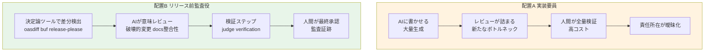

コーディングエージェントの論点は、「どのモデルが速く書くか」から「AIをどの工程に置くか」へ移っています。この移動を、実費とともに最も具体的に可視化した事例があります。Simon Willison による sqlite-utils 4.0rc2 のリリースです。

本記事は、この事例を起点に「AIを実装要員に置くか、出荷判断の証拠を集めさせる監査役に置くか」という工程配置の判断を、発注側・経営の視点で整理します。

## 概要

Simon Willison は、SQLite 操作ライブラリ sqlite-utils の安定版 4.0 を出荷する前に、AIを「監査役」として使いました。その全工程の実費まで公開しています。

- 出荷前レビューに Claude Fable を投入し、著者自身が未遭遇だった 5 件の「release blocker」を検出。
- 最終外部レビューを GPT-5.5 xhigh（Codex Desktop 経由）にかけ、トランザクション commit タイミングに関する P1 を 2 件追加検出。
- 全工程の実費を総額 $149.25 として、モデル別内訳まで公開。

この事例の要点は「AIに書かせて安く上げた」ことではありません。「生成」より「生成物の検証・出荷判断の証拠集め」にAIを置いたとき、費用が出荷ゲート単位で見積もれ、責任分界を明示できる、という工程配置の型です。

本記事の結論を先に示します。

> 「AIに書かせる」より「AIに出荷判断の証拠を集めさせる」方が、費用対効果と責任分界の両面で現場導入の型になりやすいです。ただし無条件ではありません。次の 4 条件を満たすことが前提です。決定論ツールを下地に置くこと。検証ステップを噛ませること。最終承認を人間に残すこと。コストのテールリスクを織り込むこと。

## 特徴

事例と業界パターンに共通する特徴を 5 点に整理します。

### ボトルネックの移動

Simon Willison の言葉が核心です。「書くことは安くなったが、理解のコストは昔のまま高い」。AIが大量に生成できるほど、レビュー（理解・監査）が新たな律速になります。レビュアーは「最後の品質ゲートの一つ」から「最初の品質ゲート」へ押し出されます。

だからこそ、生成が生んだボトルネックそのものを解くために、AIを検証側へ当てる動きが強まっています。

### 破壊的変更とドキュメント整合性への適合

sqlite-utils 4.0 は破壊的変更の塊でした。`db.execute()` の自動 commit 化、`db.query()` の即時実行化、検証エラーの `AssertionError` から `ValueError` への変更などです。

Fable が検出した最悪の 1 件は、データ消失バグでした。`delete_where()` が `atomic()` ラッパを欠き、コネクションを開いたままにするため、後続の書き込みが接続クローズ時に暗黙 rollback される、という不具合です。

破壊的変更やトランザクション境界の不整合は、人間が仕様差分を全量追うのが最も辛い領域です。AI監査の効きどころと一致します。

著者はレビュー時に「ドキュメントの編集差分を先に読む」運用を採用しています。変更理解の起点をコードではなく説明面に置く、という実務的な工夫です。

### 出荷ゲート単位のコスト可視化

公開されたコスト内訳です。記事末尾のエージェント実行ログに基づきます（トークン数は非公開）。

| 用途 | モデル | コスト (USD) |
|---|---|---|
| メインセッション | claude-fable-5 | $141.02 |
| API面 sweep エージェント | claude-fable-5 | $2.40 |
| transactions/atomic レビュー | claude-fable-5 | $2.39 |
| post-rc1 commits レビュー | claude-fable-5 | $1.72 |
| migrations レビュー | claude-fable-5 | $1.40 |
| プロンプト数集計 | claude-opus-4-8 | $0.32 |
| 合計 | | $149.25 |

GPT-5.5 xhigh のコストは、このテーブルに含まれていません。Codex Desktop 経由で別勘定と見られます。総額 $149.25 に GPT 分が含まれるかは不明です。作業規模は 37 プロンプト、34 コミット、`+1,321 -190` 行、30 ファイル、領域別サブエージェント 4 本の並列実行です。

「実装要員としてのAI」は、生成量が青天井で品質保証コストが後追いになりがちです。「監査役としてのAI」は、出荷ゲートごとに実費が見積もれます。これはコストを人件費と同じ土俵に載せ、出荷可否の経済判断に統合できることを意味します。

### 複数モデルの相互検証

Willison は Claude Fable（生成・自己修正）と GPT-5.5 xhigh（外部レビュー）を、別ベンダーで重ねています。GPT-5.5 は Fable が 37 プロンプトを経た後でも、なお P1 を 2 件見つけました。

「モデルごとに得意が違うので役割分担と相互検証をする」設計は、後述の Cloudflare や CodeRabbit でも本番採用されています。ただしこの多モデル重ねには、限界効用の逓減という反証もあります（後述）。

### 最終承認の人間保持

事例でも業界標準でも、AIは証拠と一次判定を出し、人間が最終承認する、という責任分界が一貫しています。Anthropic の Claude Code Review は明示的に「PRを承認しない。それは人間の判断だ」と述べます。この分界を組み込めることが、監査役配置がガバナンス上成立する前提です。

## 概念構造

「実装要員」配置と「リリース前監査役」配置を対比します。

図の各要素を説明します。

| 要素 | 説明 |
|---|---|
| 配置A 実装要員 | AIに生成を任せる型。生成は速いがレビューが詰まり、責任所在が曖昧化 |
| 配置B リリース前監査役 | AIに出荷判断の証拠集めを任せる型。決定論ツールを下地に検証ステップと人間承認を重ねる構造 |
| 決定論ツールで差分検出 | 機械的に洗える差分の確実な検出。API破壊的変更やSemVerの下層 |
| AIが意味レビュー | 差分が何を壊すかの意味・影響・自然文説明の付与 |
| 検証ステップ | judge モデルや source 再読による false positive フィルタ |
| 人間が最終承認 | 最終権限の保持と監査証跡の記録 |

### 二層構造

監査役配置が堅く回る現場は、AI単独ではなく二層で構成されています。

| 層 | 役割 | 例 |
|---|---|---|
| 下層（決定論） | 機械的に洗える差分の確実な検出 | oasdiff（OpenAPI 破壊的変更、Pro は承認署名までマージブロック）、buf（protobuf）、release-please（Conventional Commits から changelog と人間承認つき Release PR を生成） |
| 上層（AI） | 意味・影響・自然文説明・docs整合性の付与 | Claude Code Review、Copilot code review、CodeRabbit、Cloudflare の専任エージェント群 |

下層で「何が変わったか」を機械的に確定させ、上層のAIが「それが何を壊すか」を説明します。この二層があると、AI出力のノイズが下層で削られます。

### 成立条件

監査役配置が有効な工程と条件を整理します。

- 決定論ツールで機械的に洗える差分ほど有効（API破壊的変更、SemVer、changelog）。
- correctness、security、regression のように客観的に検証可能なクラスが適合。Anthropic も既定を correctness に限定し、フォーマットやテストカバレッジの主観は除外。
- 検証ステップ（judge、verification、source 再読）が必須。これがない生のLLM出力はノイズで信頼を失う。
- 最終承認は人間が業界の主流。Cloudflare だけがマージブロックまでAIに委譲し、代わりに緊急上書き経路（break glass）を残す。
- 適合工程はPRやRCの前、マージ前、Release PR 作成時。生成直後は意図がまだ文書化されず、レビュー負債が最大化するため。
- 不適合は大規模かつ複雑な変更、主観的な設計判断、意図やアーキテクチャの妥当性判断。

## 業界的裏付け: Cloudflare の本番運用

「AIが出荷判断の証拠を集める」を数値付きで公開した最有力事例が、Cloudflare の大規模 AIコードレビュー運用です。

- 7 つの専任レビュアーが security、performance、code quality、documentation、release management、compliance をカバー。coordinator が重複排除と再分類とフィルタを行い、1 コメントに集約。
- 出荷ゲートとして機能。クリーンなコードは承認、本番リスクのない warning はコメント付き承認、critical や複数 warning のリスクパターンではマージを積極的にブロック。緊急時は break glass コメントで強制承認。
- 混成モデルをベンダー跨ぎで採用。coordinator に Claude Opus と GPT-5.4、heavy reviewer に Claude Sonnet と GPT-5.3、docs に Kimi K2.5。各エージェントに「何を指摘しないか」を明示し false positive を抑制。

実測値（2026-03-10 から 04-09）を示します。

| 指標 | 値 |
|---|---|
| レビュー実行回数 | 131,246 runs |
| 対象マージリクエスト | 48,095 MR |
| 完了時間（中央値） | 3 分 39 秒 |
| 平均コスト | $1.19/review（中央値 $0.98） |
| 検出総数 | 159,103 findings（うち security critical 484 件） |
| break glass 発動 | 0.6%（288 MR） |
| トークンキャッシュヒット | 85.7% |

sqlite-utils（熟練者単独の小規模OSS）と Cloudflare（大規模組織の常時ゲート）が、同じ「AIが証拠と一次判定、人間が最終権限」という分業に収束している点が重要です。

## 経営が評価すべき軸

発注側の視点で、2 つの配置を評価軸ごとに対比します。

| 評価軸 | 実装要員に置く場合 | リリース前監査役に置く場合 |
|---|---|---|
| ボトルネック | 生成が速い分レビューが詰まる | 検証工程をAIが埋め、人間は最終判断に集中 |
| 品質リスク | 生成物の脆弱性を人間が全量検証（高コスト） | 機械的チェック（網羅性、見落とし）をAIが担保 |
| 責任分界 | 生成物の責任所在が曖昧化しやすい | AIは助言、人間が最終承認、監査証跡で明確 |
| 成否の主因 | モデルの強さに依存しがち | 工程配置設計そのもの |
| コスト | 生成量が青天井、品質保証コストが後追い | 出荷ゲートごとに実費を見積もり判断に統合可能 |

この対比を補強する論点を 3 点挙げます。

第一に、成否はモデル選定より工程配置で決まります。METR の研究では、経験豊富なOSS開発者がAI利用でタスクが約 19% 遅くなったとされ、遅延の主因は「出力レビューと品質検証の時間」でした（原典 arXiv:2507.09089。引用は二次経由。母集団は熟練OSS開発者で全開発者には一般化不可）。同じモデルでも「生成に使うと遅くなり、検証に使うべき」という配置判断の定量根拠になります。

第二に、責任分界は国内実務と国のガイドラインとも一致します。原則は「最終判断は人間」「AIは助言」「判断過程を監査証跡に残す」です。Rust の LLM ポリシー草案では、レビュアーがLLM指摘を明示的に支持しない限りブロックできません。経産省のAI事業者ガイドラインやAISI実務マニュアル案も、リリース前リスク評価を要求しています（一部は二次情報。原典PDFは直接取得できず）。

第三に、日本企業の実事例も「検証・校正役」で効果を出しています。RevComm はAIを「校正者」に置き、見落とし検出と品質向上で高評価を得ました。一方で「改善提案の具体性や新規視点」は低評価でした。AIの強みは検証タスクに集中する、という示唆です（一次: RevComm 技術ブログ）。

## 反証と限界

暫定結論を弱めるエビデンスを明示します。反証はいずれも「相対配置そのもの」ではなく「無条件の一般化とスケール」を突きます。

| 反証 | 内容 | 出典 |
|---|---|---|
| 確証バイアスで検知率が崩壊 | PRを「バグなし」と枠付けするだけで脆弱性検知率が GPT-4o-mini 97.2%→3.6%、Claude 3.5 Haiku 68.4%→8.5% に低下。false negative バイアスは false positive バイアスの 4〜114 倍 | arXiv 2603.18740 |
| 過剰是正で正しい変更を却下 | 要件適合判定で GPT-4o が正しいコードを却下する率が、詳細プロンプトほど悪化（Full prompt で 73〜88%）。仕様差分レビューの精度がプロンプト依存で不安定 | arXiv 2603.00539 |
| 実行せず判定するため一致度が低い | GPT-4-turbo の判定と実テストの一致度（Cohen's Kappa）が Java 0.21、Python 0.10。証拠収集の土台が弱い | arXiv 2509.01494 |
| コストが高分散で予算超過が本番障害クラス | per-task コスト平均 $1.34 に標準偏差 $0.46 で予測困難。2023〜26 で 63 件の予算超過インシデントをカタログ化、リトライループが数千ドルを積む | arXiv 2604.11270 / 2606.04056 |
| automation bias と責任の拡散 | 高ステークスほど過信し独立検証が減る。「AIが決めた」と言える構造で答責が曖昧化。監査証跡自体がAI生成なら確証バイアスに晒され担保にならない | PMC 系統的レビュー |
| 単一事例は熟練者前提 | Simon Willison 本人が「AIは既存の専門性を増幅する」「自分の最高の状態で動く必要がある」と明言。レビュアー熟練度が精度を左右し、未熟なレビュアーはAIの結論を検証せず信頼しがち | vibe-engineering (2025-10-07) / arXiv 2402.03777 |
| 多モデル重ねは逓減とエコーチェンバー | 同質エージェント増員は強い逓減、等トークン予算なら単一エージェントが multi-agent に匹敵、同調で誤り訂正でなくエコーチェンバー化しうる | arXiv 2602.03794 / 2604.02460 / 2604.18005 |
| 実インシデント（係争中） | AI生成プラットフォーム Lovable が Row-Level Security を欠いた schema を量産し、未認証で任意テーブル読み書き可能とされた（CVSS 9.3）。ただし係争中で責任所在自体が論争的 | NVD CVE-2025-48757（disputed） |

反証が見つからなかった観点も明示します。「実装に使う方が費用対効果が高い」と正面から主張する対抗研究は見つかりませんでした。相対比較（実装 vs 監査）は反証しきれておらず、これは結論の頑健性を裏付けます。反証は主に「その配置を無条件に一般化しスケールさせること」への警告として機能します。

## 未解決の問い

- Fable が検出した残り 4 件の release blocker の内容（一次に個別記載なし、delete_where のみ詳細公開）。
- GPT-5.5 xhigh のコスト（公開テーブル外。総額に含まれるか不明）。
- 監査AIのアウトプットを正しくトリアージする熟練自体が、ボトルネックになるスケール限界。
- 経営系数値（METR 19%、Veracode 45%、Cisco 本番 5%、MIT 95% など）の原典年次と母集団。多くが二次まとめ経由で再確認を要します。

## 発注側・経営への示唆

1. 最初に「どの工程に置くか」を決める。モデル選定より工程配置がROIを決める。生成直後（PRやRCの前）にAI監査を置くのが効きどころ。
2. 二層で組む。決定論ツール（oasdiff、buf、release-please）で機械的差分を確定させ、その上にAI監査を重ねる。AI単独のノイズを下層で削る。
3. 検証ステップと人間の最終承認を必須にする。judge や source 再読を挟み、break glass のような人間の上書き経路を残す。
4. コストを出荷ゲート単位で見積もり、テールリスクを織り込む。per-task 分散、リトライ暴走、常時ゲート化の積み上がりを予算に含める。
5. 監査証跡を残す。AIが何を見て何を指摘し、人間がどう判断したかを記録し、責任分界を明示する。証跡がAI生成なら確証バイアスの影響を別途チェックする。
6. 単一事例を無条件に横展開しない。熟練者や小規模OSSの費用対効果は、未熟チームや大規模では再現しないことを前提に、自組織の熟練度で段階導入する。

## まとめ

sqlite-utils 4.0 の $149.25 事例と Cloudflare の本番運用は、「AIに書かせる」より「AIに出荷判断の証拠を集めさせる」方が、費用対効果と責任分界の両面で現場導入の型になりやすいことを示します。ただし決定論ツールを下地に、検証ステップと人間の最終承認を残し、コストのテールリスクを織り込む条件付きです。単一事例を無条件に横展開せず、自組織の熟練度で段階導入することが判断の要になります。

この記事が少しでも参考になった、あるいは改善点などがあれば、ぜひリアクションやコメント、SNSでのシェアをいただけると励みになります！

## 参考リンク

- 公式・一次
  - [sqlite-utils 4.0rc2, mostly written by Claude Fable (for about $149.25)](https://simonwillison.net/2026/Jul/5/sqlite-utils-fable/)
  - [sqlite-utils GitHub Releases](https://github.com/simonw/sqlite-utils/releases)
  - [Simon Willison vibe-engineering](https://simonwillison.net/2025/Oct/7/vibe-engineering/)
  - [Cloudflare Orchestrating AI Code Review at scale](https://blog.cloudflare.com/ai-code-review/)
  - [Anthropic Claude Code Review](https://claude.com/blog/code-review)
  - [GitHub Copilot code review](https://docs.github.com/en/copilot/concepts/agents/code-review)
  - [oasdiff](https://www.oasdiff.com/)
  - [Conventional Commits](https://www.conventionalcommits.org/en/v1.0.0/)
  - [release-please](https://github.com/googleapis/release-please)
- GitHub
  - [CodeRabbit と OpenAI の事例](https://openai.com/index/coderabbit/)
  - [NVD CVE-2025-48757](https://nvd.nist.gov/vuln/detail/CVE-2025-48757)
- 記事・論文
  - [RevComm 校正者としてのAIレビュー導入実践](https://tech.revcomm.co.jp/use-of-ai-in-review-process)
  - [LLM-as-judge のコードレビュー整合性 (arXiv 2509.01494)](https://arxiv.org/html/2509.01494v1)
  - [確証バイアスによる検知率崩壊 (arXiv 2603.18740)](https://arxiv.org/html/2603.18740v1)
  - [過剰是正 (arXiv 2603.00539)](https://arxiv.org/html/2603.00539v1)
  - [レビュアー熟練度 (arXiv 2402.03777)](https://arxiv.org/pdf/2402.03777)
  - [熟練開発者の生産性計測 (arXiv 2507.09089)](https://arxiv.org/abs/2507.09089)
