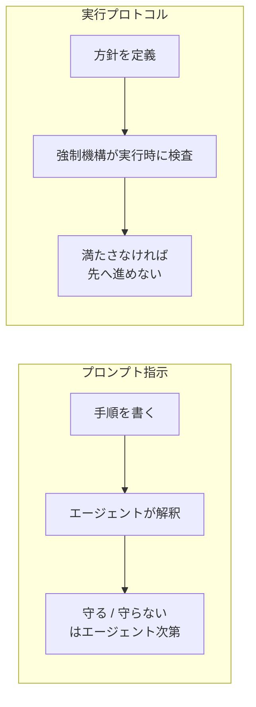
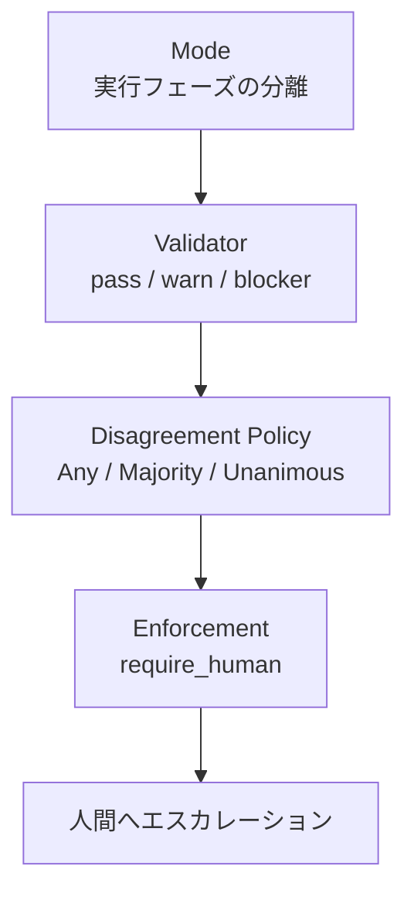
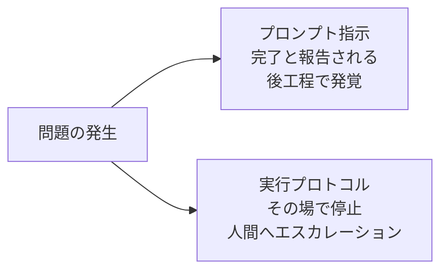

AIエージェントに開発作業を任せるとき、多くの人は手順をプロンプトに書きます。「まず再現テストを書いてください」「修正後に必ずテストを流してください」。しかし、その通りに動かないことがあります。

arXiv に公開された論文「[Structural Enforcement in AI-Assisted Software Development](https://arxiv.org/abs/2606.20615)」(arXiv:2606.20615) は、この現象を実験で測り、対処法を設計として提示しています。結論は明快です。**同じ手順でも、プロンプトで指示すると効果ゼロ、実行プロトコルとして強制すると解決率が 14〜22 ポイント上がる**というものです。

この記事では、次を扱います。

- なぜプロンプトによる手順指示が効かないのか
- 「スキップ不能な実行プロトコル」を構成する 4 つの部品
- どこまで効いて、どこから効かないのか (適用限界)
- 手元のワークフローに取り入れるときの順序

対象読者は、AIエージェントを開発フローに組み込んでいる方、あるいは組み込みを検討していて品質のばらつきに悩んでいる方です。

*この記事の全体像。以下、順に解説します。*

## 実験が示したこと: 「お願い」の効果はゼロだった

論文は SWE-bench Verified のバグ修正タスクを使い、3 条件を比較しています。

| 条件 | 内容 | 結果 |
| --- | --- | --- |
| Arm A | メソドロジーを何も与えない | ベースライン |
| Arm B | メソドロジーを**プロンプトで**与える | Arm A と統計的有意差なし |
| Arm C | **同一のメソドロジー**を検証器と自己修復ループを備えた実行プロセスとして強制 | 解決率が 14〜22 ポイント向上 |

注目すべきは、Arm B と Arm C で**与えているメソドロジーの中身が同じ**という点です。差は「伝え方」ではなく「強制されているかどうか」だけです。

つまり、手順書の質を上げても、それがプロンプトである限り成果は動きません。動くのは、手順を守らないと先へ進めない構造にしたときです。

### モデルの能力差はプロセスで圧縮できる

もうひとつ示されたのが、コストに直結する結果です。

| 構成 | 解決率 |
| --- | --- |
| 安価なモデル (deepseek-v4-flash) + プロセス管理 | 69.1% |
| 強力なモデル (deepseek-v4-pro) 単体 | 48.9% |

安価なモデルをプロセス下で動かしたほうが、強力なモデルを裸で走らせるより高い解決率を出しています。

エージェント基盤の費用の大半はモデル呼び出しです。この結果が意味するのは、「精度が足りないからより高価なモデルへ」という反射的な判断の前に、**プロセス側で伸ばせる余地がまだ残っている可能性がある**ということです。

## なぜプロンプトでは効かないのか

プロンプトによる手順指示には、構造上の問題があります。**手順を守らせる責任が、守る側であるエージェント自身に置かれている**ことです。

プロンプトは「こう振る舞ってほしい」という**期待値**であり、実行時の制約ではありません。エージェントは確率的に動くため、期待値からの逸脱は必ず一定割合で起きます。しかも逸脱は静かに起きます。テストを書かずに修正しても、エージェントは「完了しました」と報告します。

論文が提案するのは、この責任の置き場所を移すことです。具体的には、**方針 (Policy) と強制機構 (Mechanism) を分離**します。

- **方針**: ワークフローの意図。「修正前に再現テストを書く」「レビューを 2 名通す」といった宣言
- **強制機構**: 方針を実行時に担保する仕組み。アクセス制御、検証トークン、上書き不可能なゲート

この分離には運用上の利点もあります。方針だけを差し替えれば、同一のコードベースで、個人開発の緩い運用からエンタープライズの厳格な統制まで対応できます。強制機構は共通のままです。

## スキップ不能にする 4 つの部品

論文が定義するプロトコルは、次の 4 つで構成されます。

### 1. Mode — 実行フェーズをインフラで分離する

作業段階ごとに、触れてよい対象をインフラストラクチャレベルで分けます。「調査フェーズではファイルを書き換えられない」「実装フェーズでは本番設定に触れない」といった分離を、エージェントの自制ではなく権限で実現します。

エージェントがサンドボックスを抜けられないのは、抜けないよう指示されているからではなく、抜ける権限がないからという状態にします。

### 2. Validator — 3 値で判定する

タスクを評価し、`pass` / `warn` / `blocker` のいずれかを返します。

重要なのは `blocker` の意味づけです。これは**エージェントによる自動復旧を許さない絶対的な停止**を指します。「エラーが出たから直してみる」というループに入らせない、という宣言です。

`warn` との違いを設計時に決めておくことが、この仕組みの実質を決めます。すべてを `blocker` にすると止まりすぎ、すべてを `warn` にすると何も守られません。

### 3. Disagreement Policy — 検証器の合意形成を制御する

複数の Validator を走らせるとき、どう合意を取るかを定義します。

| ポリシー | 通過条件 | 向く場面 |
| --- | --- | --- |
| Any | 1 つでも `pass` | 検出漏れより過検出のコストが高い |
| Majority | 過半数が `pass` | 一般的な均衡点 |
| Unanimous | 全員が `pass` | 差し戻しコストより事故コストが高い |

### 4. Enforcement — 逃げ道を作らない

`blocker` に遭遇した場合、あるいは**いかなるポリシーにも合致しない場合**は、強制的に人間の介入を要求します (`require_human`)。

「どのポリシーにも当てはまらないケース」を暗黙の通過ではなく人間送りにする点が要です。仕様の穴が自動通過の抜け道になりません。

## 2+N: AI 時代の職務の分離

論文は、人間 2 役割と N 個の特化エージェントによる構成を「2+N パターン」として形式化しています。

| 役割 | 担当 |
| --- | --- |
| 人間: アーキテクト | 方針の定義。何を不変条件とするかを決める |
| 人間: レビュアー | `require_human` で上がってきた判断の引き取り |
| エージェント × N | 特化タスクの実行 |

これは、会計統制などで使われる職務の分離 (Separation of Duties) を、AI を含む体制へ持ち込んだものです。方針を決める人と、実行する主体と、例外を裁く人を分けます。

人間が減るのではなく、**人間の仕事が「実行」から「方針定義と例外処理」へ移る**構成である点が実務上のポイントです。

## 何が変わるか: 準決定性とサイレントエラーの排除

適切に定義されたプロトコルは、すべての実行トレースで不変条件 (Invariants) を維持します。論文はこれを**準決定性 (Quasi-determinism)** と呼んでいます。

出力そのものは非決定的なままです。同じタスクを 2 回流せば、生成されるコードは違うでしょう。しかし「テストを書かずに完了した実行」は 1 度も現れません。守られるのは結果ではなく、プロセスの不変条件です。

実務でより効くのは、この帰結です。**失敗の大部分が「監査可能な停止 (Audited stalls)」に変わります。**

サイレントエラーの厄介さは、検知が遅れることそのものより、**遅れた分だけ原因の特定範囲が広がる**ことにあります。停止して記録が残れば、どの段階で何が満たされなかったかが最初から分かっています。

## 効かない場面: Capability Floor と 3 つの限界

構造的強制は万能ではありません。論文自身が反証と限界を挙げています。

### Capability Floor (能力の底) — 最も重要な限界

構造的強制は、エージェントが持つベースライン能力を**乗数的に**引き上げます。乗数であるということは、元の値がゼロに近ければ結果もゼロに近いということです。

実験では、能力が閾値を下回る小規模モデル (`gpt-oss:20b`) を使った場合、プロセスの優位性が消失しました。

論文の整理が的確です。**プロセスは「諦め」を「誤答」に変換することは防ぐが、正解を生成させることはできない。**

安価なモデルへの置き換えでコストを下げる話 (69.1% vs 48.9%) は魅力的ですが、下げ続ければどこかで床を割ります。床を割ったことは解決率の低下として現れるため、切り替え時は必ず実測で確認する必要があります。

### Validator の品質依存

システムの信頼性は Validator の品質に依存します。悪意ある、あるいは単に劣悪な Validator が常に `pass` を返す場合、Disagreement Policy の設定によっては不正なコードが通過します。

強制機構を入れても、検査の中身が空なら「検査済み」というラベルが増えるだけです。むしろラベルがある分、危険とも言えます。

### DoS リスク (INV3 asymmetry)

安全性を担保する `blocker` の仕組みは、そのまま停止させる権限でもあります。厳格な Validator が暴走したり過敏に反応したりすると、すべてのプロセスが止まります。論文はこれを非対称性の問題 (The INV3 asymmetry) として指摘しています。

`blocker` を出せる範囲を絞ること、`blocker` の発生率自体を監視対象に入れることが対策になります。

## 実務でどこから始めるか

既存のエージェントワークフローに取り入れる場合、次の順序が現実的です。

1. **リトライをプロンプトから状態遷移へ移す**
   検証失敗時に「直してください」と投げ直す実装をやめ、スクリプトやツールチェイン側の状態遷移として実装します。`blocker` 相当の失敗では処理を止め、通知を出します。エージェントに再試行の裁量を持たせないことが要点です。

2. **失敗を必ず記録し、必ず届ける**
   実行結果を永続化し、未達を検知したら人間へ通知します。`require_human` へのエスカレーション経路がないと、監査可能な停止は単なる停止になります。ここが埋まっていないと、以降の投資は回収できません。

3. **`warn` と `blocker` の線引きを決める**
   すべてを止めると DoS 側に倒れます。実行を止めるべき不変条件だけを `blocker` に選び、残りは `warn` として記録に回します。

4. **その後でモデルのコスト最適化に着手する**
   プロセスが固まってから、ルーチンタスクを安価なモデルへ寄せます。Capability Floor を下回っていないかは、解決率の実測で継続的に監視します。

順序が逆になると危険です。記録と通知が整う前に安価なモデルへ切り替えると、床を割ったことに気づけません。

## まとめ

- **同じ手順でも、プロンプトで指示すると効果は統計的にゼロ、実行プロトコルとして強制すると 14〜22 ポイント向上する** (SWE-bench Verified での実証)
- 鍵は、方針 (Policy) と強制機構 (Mechanism) の分離。Mode / Validator / Disagreement Policy / Enforcement の 4 部品で、手順を構造的にスキップ不能にする
- 効果は準決定性とサイレントエラーの排除として現れる。失敗が「監査可能な停止」に変わり、人間へエスカレーションされる
- 人間の役割は消えず、「実行」から「方針定義と例外処理」へ移る (2+N パターン)
- 限界は 3 つ。Capability Floor (能力の底を下回ると効果が消える)、Validator の品質依存、`blocker` を起点とする DoS リスク
- 着手順序は、リトライの構造化 → 記録と通知 → `warn` / `blocker` の線引き → モデルのコスト最適化

プロンプトの書き方を磨くより、守らないと進めない構造を 1 か所作るほうが、結果への効き方は大きいというのがこの論文の主張です。手元のワークフローで「エージェントの善意に頼っている箇所」を 1 つ探すところから始められます。

この記事が少しでも参考になった、あるいは改善点などがあれば、ぜひリアクションやコメント、SNSでのシェアをいただけると励みになります！

## 参考リンク

- [arXiv:2606.20615 — AI-SDLC における実行プロトコルによる構造的強制](https://arxiv.org/abs/2606.20615)
- [SWE-bench](https://www.swebench.com/) — 論文の評価に使われた SWE-bench Verified を含むベンチマーク
