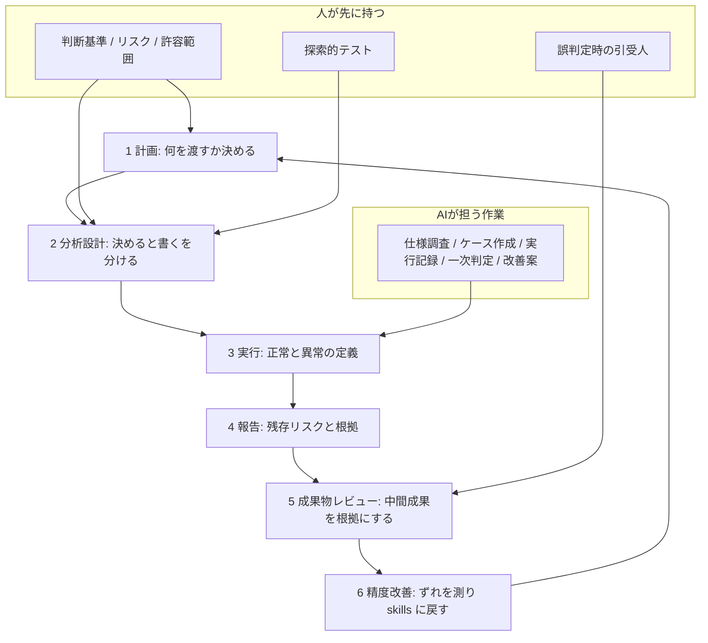

JaSST'26 Niigata（2026-09-18）の基調講演で、LayerX の中野 直樹氏は「AIに任せた品質は、誰が見立てるのか」を題に、テスト作業の委譲を論じました。
公開資料は Speaker Deck の [57枚](https://speakerdeck.com/nakanao/ai-ni-makaseta-hinshitsu-ha-dare-ga-mitateru-no-ka-ai-jidai-no-tesuto-manejimento)（2026-09-19）です。
公式プログラムの要旨は、「任せる領域が広がるほど、束ねるテストマネジメントの理解が重要になる」です。

この記事では、計画・分析設計・実行・レポーティング・成果物レビュー・精度改善の6工程を単位に、人が何を決め、何を渡し、何を確かめるかを整理します。
想定読者は、テスト作業をAIに渡す範囲と、誤判定時の引受人を決める発注側です。
出典は講演資料1本と公式プログラムです。数値は World Quality Report などの別調査の引用です。

*この記事の全体像。以下、順に解説します。*

## AIテスト委譲の6工程とは

対象は、計画から精度改善までのテストライフサイクルです。
委譲の単位は工程です。工程の前後に「決める・渡す・確かめる・引き受ける」を置きます。
資料は LayerX の社内経験と、JSTQB Advanced Level テストマネジメントの章立てを対応づけた講演整理です。

6工程は、⑥精度改善が①計画へ戻るループです。

工程の中は、「決める」（リスクと判断基準）と「書く／実行する」（仕様があればできる作業）に割れます。
AIへの入力は、戦略・システム・判断の3コンテキストに分けます。
実行の成果は「実施ログ」ではなく「検証の記録」にします。
レポートに残すのは件数ではなく、残存リスク・やらなかったこと・減らした根拠・人が迷う境目です。
テストを増やす案はAI、減らす判断は人が根拠を残します。
直した判断基準は skills などの指示書に組み、次の計画へ戻します。

講演の定義では、AIは作業をこなせますが、損害の引き受け・説明・次の判断変更はできません。
公式プログラムの持ち帰りは答えではなく、チームのテスト戦略を見直す問いです。

Agile 型の計画が薄いのは情報が無いからではありません。
ユーザーストーリー、チケット、wiki、口頭に分散しています。
朝会に出られないAIには、分散情報の渡し方が要ります。
Traditional 型の7ページ相当でも、点数の根拠、厚み配分が組織戦略とずれる理由、過去障害、ユーザーにとってどうあるべきか、暗黙の許容範囲は抜けやすい、と資料は整理します。
「7ページ相当」は、ISO/IEC/IEEE 29119-3:2021 Annex E の架空サンプルを図化したものです。

現場で使う単位は、工程ごとの4項目です。

| 工程 | 人が決める | AIに渡す | 人が確かめる | 誤判定時 |
|---|---|---|---|---|
| ①計画 | 任せる範囲、終了条件、厚み配分の理由 | スコープ、リスク根拠、壊れやすい場所、許容/非許容、エスカレーション | 計画が実行に進めてよいか | 計画承認者 |
| ②分析設計 | 何をどこまで確かめるか | テストベース、リスク、網羅方針、コード | ケースの選定と削り | 設計レビュー担当 |
| ③実行 | 正常、異常、知らせ方 | 検証項目とオラクル | 実施ログではなく検証記録。BLOCK とスキップの区別 | 実行監視の担当 |
| ④報告 | 知りたい残存リスクの形 | トレーサビリティ | やらなかったこと・減らした根拠が入っているか | リリース判断者 |
| ⑤レビュー | 人が読む情報の範囲 | 中間成果（なぜ選んだか/削ったか） | 最終成果物だけで妥当性を見ない | 成果物の承認者 |
| ⑥精度改善 | 減らす判断、十分性の測り方 | 障害・ログ・ずれの資料 | 判断基準の変更が次の結果で効いたか。AIに自己採点させない | プロセスオーナー |

実行と検証の分離は、LayerX 社内の1事例で示されます。
夜間のリグレッションでブラウザ未接続のため全ケースが BLOCK になり、次実行がそれを実施済みと読んで完了と報告した、という逸話です。
公開ログはなく、頻度は不明です。
成果定義が「実行した記録」だと、BLOCK を実施済みに畳む失敗が起きます。

⑥の精度は、各工程のAI判断（リスク見積もり、十分性、判定、報告）と実際の結果とのずれの小ささです。
十分性の「真に有効なカバレッジ」は、講演もまだ見つかっていないとします。
コードカバレッジはユーザー価値の代理にならない、が講演の主張です。
代替指標の勝者は未確定です。

探索的テストは人に残す方針です。
同日 LT の参加者メモ（[ozaki25 日記](https://ozaki25.hatenadiary.jp/)、2026-09-18）も、仕様どおりのチェックをAI得意、探索を人側と整理しています。
探索自体の一部自動化は、本記事の範囲外です。

## 注意点

数値の分母と時点を取り違えると、導入判断がずれます。

| スライドの言い方 | 一次で確認したこと | 読みの限定 |
|---|---|---|
| 89% が生成AIを業務で試している | [WQR 2025-26 プレス](https://www.capgemini.com/news/press-releases/world-quality-report-2025-ai-adoption-surges-in-quality-engineering-but-enterprise-level-scaling-remains-elusive/): 89% が GenAI 強化ワークフローをパイロットまたは導入（本番 37%、パイロット 52%） | 「試している」は pilot と deploy の束ね |
| 15% が全社に広がった | 同: enterprise-wide implementation は 15%（実験 43%、限定用途 30%） | 全社展開の成功割合。関心の高さではない |
| 60% が信頼性を課題に挙げる | 同: hallucination and reliability concerns 60%。同時にプライバシー 67%、統合 64% | 最大障壁はプライバシー |
| 40%超がエージェント案件中止 | [Gartner 2025-06-25](https://www.gartner.com/en/newsroom/press-releases/2025-06-25-gartner-predicts-over-40-percent-of-agentic-ai-projects-will-be-canceled-by-end-of-2027): **2027年末までに** agentic AI プロジェクトの 40%超が中止、という予測 | 現在の中止率ではない。QE 限定ではない |
| Agile 1.5ページ / Traditional 7ページ | 29119-3:2021 Annex E の架空サンプルを図化。規格原文ではないとスライドが注記 | ページ数を規格の事実として使わない |
| 夜間テストを実施済みと誤認 | LayerX 社内の1事例。公開ログなし | 逸話。頻度は不明 |
| バクラク 20,000社超 | LayerX 広報（2026-09）の自己申告 | 概数と時点 |

WQR は Capgemini / Sogeti / OpenText 共催の自己申告調査です。
方法論プレスは「上級役員 2,000人超、22カ国、10業種」とスライド注記と一致します。
対照実験ではありません。

「品質に責任を持つことはAIにはできない」は講演の規範です。
[EU AI Act](https://digital-strategy.ec.europa.eu/en/policies/regulatory-framework-ai) は用途のリスク階層であり、大多数は minimal/no risk、high-risk は provider と deployer の義務分割です。
社内テスト自動化を「人に法的責任が全部残る」と一般化しません。

「人の工数が外れた」は思考実験です。
講演自身がトークン効率と評価側ボトルネックを認めます。
Gartner の 40%超は、コスト・価値・リスク統制を理由とする 2027年末までの予測です。

JSTQB Advanced Level テストマネジメントの章番号対応は語彙として妥当です。
公開確認できたシラバスは [Version3.0.J03](https://jstqb.jp/dl/JSTQB-Syllabus.Advanced_TM_VersionV3.0.J03.pdf)（2026-03-10）です。
講演表記の J04（2026-06）PDF は未確認です。
オラクル問題・非決定性は CT-AI / ISO 25059 系の別枠です。
ISTQB CT-AI v2.0 は using AI for testing を CT-AI から外し CT-GenAI へ分離しています（[ISTQB help](https://istqb.org/help/ct-ai-v2/)）。
TM v3.0 はもともと AI-for-testing を範囲に含みません。

Bainbridge 1983（[Ironies of automation](https://doi.org/10.1016/0005-1098(83)90046-8)）は産業プロセス制御の論文です。
ソフトウェアQAへの適用は類比です。
引用3英文の趣旨は後続解説と一致しますが、Automatica 本文ページは未取得です。

GAUGE（[arXiv:2609.12191](https://arxiv.org/abs/2609.12191)、抄録一次）は、τ²-bench / SimulatorArena 上で、ブラインドパネルが satisfied とした会話の 57.5% がタスク失敗だったと報告します。
judge ゲートの順位は広域の能力差では頑健（decision-disagreement 1%未満）、近接ペアでは 31% です。
対象はタスク志向エージェントのオフライン評価であり、QAテスト評価への適用は類比です。
人が見れば評価は足りる、という前提は、この結果だけでは支えられません。

6工程テンプレの第三者追試はありません。
モニタリングとコントロールを担えるエージェントは「まだない」は、2026-09 の講演時点の主張です。
否定形の一般化はしません。

## 工程ごとに人が先に固定する判断

発注側が先に書くのは、ツール選定ではなく、工程別の4項目です。
作業の速さより、見立ての設計が先です。

計画では、任せる範囲と終了条件と厚み配分の理由を人が持ちます。
AIに渡すのは、スコープ、リスク根拠、壊れやすい場所、許容と非許容、迷ったときのエスカレーションです。
人が確かめるのは、その計画で実行に進めてよいかです。
誤判定時の引受人は計画承認者です。

分析設計では、工程内を「決める」と「書く」に分けます。
AIが担うのは、チケットとコードから仕様を調べ対象機能を洗い出すこと、計画とケースを作ることです。
人が担うのは、プロダクトリスクと判断基準を渡すこと、ケースの選定と削り、探索的テストです。

実行では、正常・異常・知らせ方を先に定義します。
完了の定義は検証記録です。
BLOCK とスキップを実施済みに畳まない検査者を決めます。
対象が決定論的で、オラクルが自動かつ安価に固定できるなら、工程③の人の確認は間引きしてよい、が逆転条件です。

報告では、件数ではなく残存リスクの形を指定します。
確かめたこと、確かめていないこと（未実施・BLOCK・スキップと理由）、減らしたことと根拠、人の判断が要ること、残存リスクを残します。
誤判定時の引受人はリリース判断者です。

成果物レビューでは、最終成果物だけで妥当性を見ません。
中間成果（なぜ選んだか、なぜ削ったか）を根拠にします。
人が読む情報の範囲と、AIが使う置き場所（トークン、API、MCP）を分けます。

精度改善では、増やす案はAI、減らす判断は人が根拠を残します。
判断基準の変更が次の結果で効いたかを人が見ます。
AIに自己採点させません。
直した基準は skills に書き、次の計画の入力にします。
減らす判断をAIに任せるのは、十分性の測り方が組織で固定され、誤削減を検出する独立ゲートがある場合に限ります。

評価は、人間全件でも LLM-as-judge 単体でもなく、決定的な完了条件（実行できたか、オラクルが満たされたか）を上位ゲートにします。

## 発注側がツール導入の前に埋める1枚

最小実装は、次の6項を1枚の表にすることです。

1. 自組織のテスト計画の読み手を「人のチーム」か「AIも含む」か決める
2. 口頭の許容範囲・優先順位・壊れやすい場所を文書化し、AIの入力に載せる
3. 「完了」の定義を検証記録にする。BLOCK とスキップを実施済みに畳まない検査者を決める
4. テストを減らす判断だけは人が根拠を残す。増やす案はAIでよい
5. 直した判断基準を skills に書き、次の計画の入力にする
6. 評価は人間全件でも LLM-as-judge 単体でもなく、決定的な完了条件を上位ゲートにする

残す実務は、工程別に4項目を書くこと、減らす判断を人が根拠付きで持つこと、直した基準を skills に戻すことです。
削るのは、工数制約が消えたという前提、TM 知識だけで AI 固有の十分性が測れるという十分性、人が見れば評価は足りるという前提です。

## まとめ

JaSST'26 Niigata の基調講演は、AIへのテスト委譲を6工程のループとして定義し、各工程の前後に判断・入力・検証・引受人を残します。
公開資料の骨格は、工程を渡す前に判断基準と文脈と評価者と誤判定時の引受人を工程別に書くことです。

数値は WQR の自己申告と Gartner の 2027年末予測を、分母と時点つきで読みます。
社内逸話と規格サンプルのページ数は、一般化の根拠にしません。
発注側がいま固定できるのは、ツール導入の前に工程別4項目と、減らす判断の根拠と、skills への還元です。

この記事が少しでも参考になった、あるいは改善点などがあれば、ぜひリアクションやコメント、SNSでのシェアをいただけると励みになります！

## 参考リンク

- [中野 直樹, AIに任せた品質は、誰が見立てるのか, Speaker Deck](https://speakerdeck.com/nakanao/ai-ni-makaseta-hinshitsu-ha-dare-ga-mitateru-no-ka-ai-jidai-no-tesuto-manejimento)（JaSST'26 Niigata、2026-09-19 公開）
- [JaSST'26 Niigata 公式](https://jasst.jp/niigata/26-about/)
- [Capgemini / OpenText / Sogeti, World Quality Report 2025 press release](https://www.capgemini.com/news/press-releases/world-quality-report-2025-ai-adoption-surges-in-quality-engineering-but-enterprise-level-scaling-remains-elusive/)（2025-11-13）
- [Gartner, Predicts Over 40% of Agentic AI Projects Will Be Canceled by End of 2027](https://www.gartner.com/en/newsroom/press-releases/2025-06-25-gartner-predicts-over-40-percent-of-agentic-ai-projects-will-be-canceled-by-end-of-2027)（2025-06-25）
- [JSTQB, Advanced Level シラバス日本語版 テストマネジメント Version3.0.J03](https://jstqb.jp/dl/JSTQB-Syllabus.Advanced_TM_VersionV3.0.J03.pdf)（2026-03-10）
- [ISTQB, CT-AI Version 2.0 help](https://istqb.org/help/ct-ai-v2/)
- [European Commission, AI Act overview](https://digital-strategy.ec.europa.eu/en/policies/regulatory-framework-ai)
- [Bainbridge, Ironies of automation, Automatica 19(6), 1983](https://doi.org/10.1016/0005-1098(83)90046-8)
- [Bodhwani et al., GAUGE: When Not to Trust LLM-as-a-Judge, arXiv:2609.12191](https://arxiv.org/abs/2609.12191)（2026-09-10）
- [ozaki25, JaSST'26 Niigata 参加メモ](https://ozaki25.hatenadiary.jp/)（2026-09-18）
