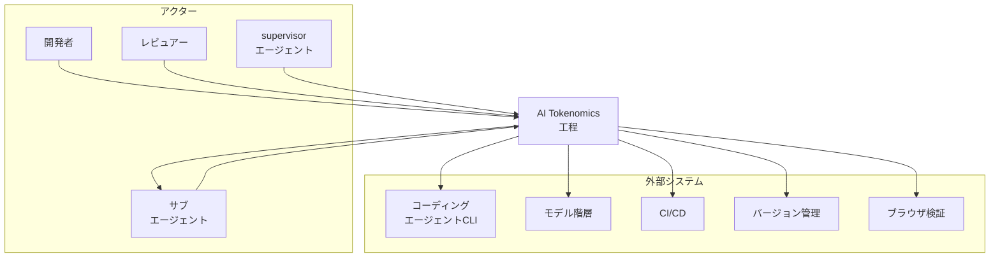
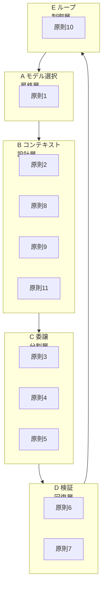
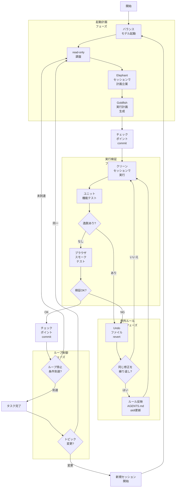
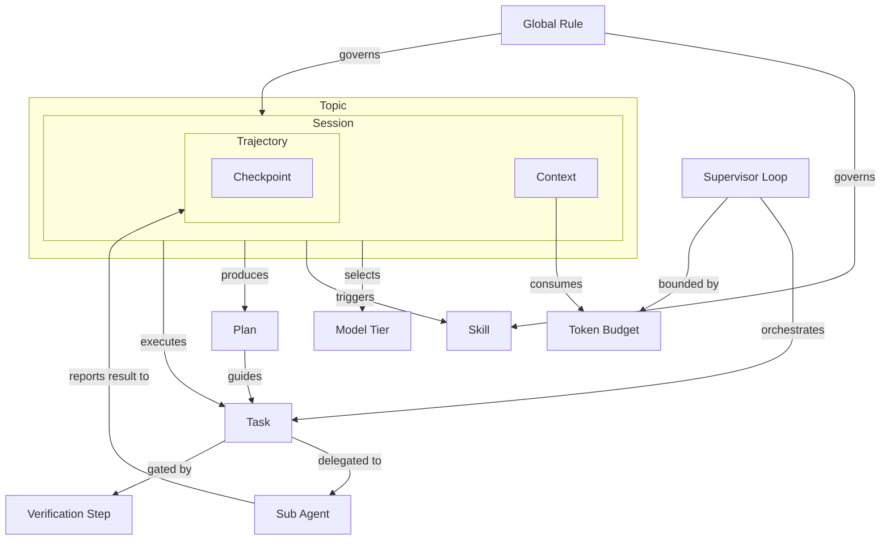
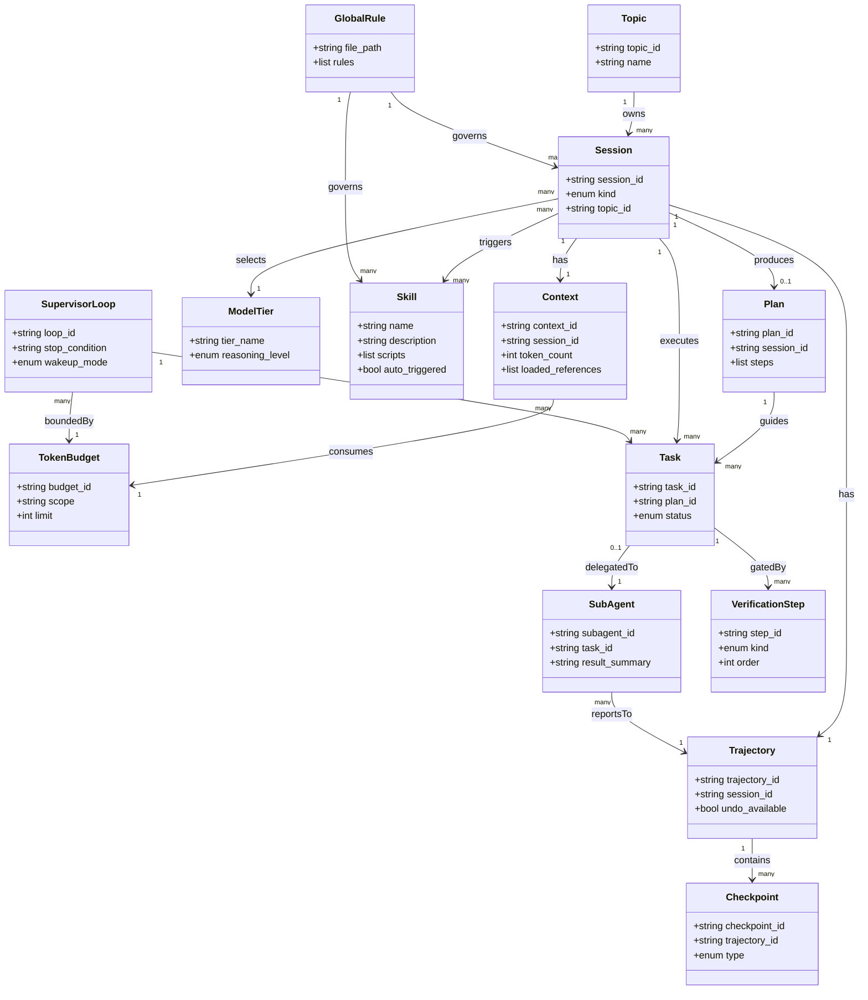

> 本記事は Google Cloud のブログ記事「Guide to AI Tokenomics: Eleven Principles for Token-Efficient Software Engineering」（著者 Alex "Sandu" Astrum / Luke Schlangen、2026-07-18 公開）を一次情報として、AI コーディングエージェントを使う開発工程のトークン効率設計を整理したものです。特定プロダクトの機能解説ではなく、工程の原則・方法論として読み解きます。

## ■概要

AI Tokenomics（AI トークノミクス）は、AI コーディングエージェントを使う開発工程で、トークン消費を最適化する 11 の原則を指します。

記事の主張の核心は次の一文に集約されます。

> Token optimization is about directing the AI's attention.（トークン最適化とは、AI の注意をどこに向けるかを設計することです）

この主張には 2 つの含意があります。

1 つ目は、トークン最適化の目的がコスト削減だけではないことです。記事は「開発速度を保ち、出力を鋭く保ちながら、支出を最適化する」ことを狙いとして明記しています。

2 つ目は、最適化の対象が「AI の注意」であり、副次的に「人間の注意」にも及ぶことです。不要なトークンは AI の処理能力を消費するだけでなく、人間がレビューし判断する対象も増やします。

### コンテキスト肥大が招く問題

記事はコンテキスト肥大（context bloat）の弊害を次のように述べています。

> Context bloat increases latency and causes models to forget instructions or hallucinate, it also costs money and drives human attention away from the problems that actually matter.

弊害は 4 つに整理できます。

| 弊害 | 内容 |
|---|---|
| レイテンシ増加 | 処理対象のトークンが増え、応答が遅くなる |
| 指示忘れ・ハルシネーション | モデルが指示を見失い、事実に基づかない出力を生む |
| コスト増加 | 入力・出力トークンの課金が増える |
| 人間の注意分散 | 本質的な問題以外にレビューの労力が割かれる |

これらは互いに独立した問題ではなく、コンテキストが肥大するほど連鎖して悪化します。

なお、本レポートでは「AI と人間の注意を本質的な問題へ振り向けられているトークン消費」を仮に「有効なトークン消費」と整理します。この呼び方は本レポート内の整理であり、記事内に明示的な定義はありません。

### 位置づけ: プロンプト短縮 tips ではなく工程設計

AI Tokenomics は、プロンプトの言い回しを短くする tips 集ではありません。対象は、モデル選択・スキル化・タスク委譲・検証順序・ループ停止条件を含む開発工程全体の設計です。

記事はこれを「構造化された習慣（structured habits）」と表現し、フィードバックループを速く正確に保つ仕組みと位置づけています。

この位置づけは、以下の既存の系譜の延長線上にあります。

| 系譜 | 関係 |
|---|---|
| コンテキストエンジニアリング（context engineering） | プロンプトエンジニアリングに代わり、LLM に何を見せるかを設計する実践。Anthropic は「有限のアテンション予算」という枠組みで説明しており、本記事の核心「AI の注意をどこに向けるか」と同じ語彙にあたる。AI Tokenomics はこの実践をコーディングエージェント向けに具体化した原則群である |
| Agent Skills（エージェントスキル） / `SKILL.md` | 再利用可能な作業をパッケージ化し、必要なときだけ読み込ませる仕組み。原則 2「Use skills from the beginning」が直接対応する |
| AGENTS.md 標準（agents.md standard） | コーディングエージェント向けのプロジェクト規約を一箇所に集約するオープンな形式。原則 9「Iterate on rules」が指すルール永続化先にあたる |
| サブエージェントオーケストレーション（sub-agent orchestration） | 出力量の多い作業や専門領域をサブエージェントに委譲し、親セッションのコンテキストを保つ設計。原則 4・5 が対応する |

AI Tokenomics は、これらを「トークン効率」という一貫した評価軸でまとめ直したものと位置づけられます。

### 比較: 素朴なトークン節約 vs AI Tokenomics

プロンプト文言を削るだけの素朴なトークン節約と、工程設計としての AI Tokenomics は、対象範囲が異なります。

| 観点 | 素朴なトークン節約（プロンプト短縮のみ） | AI Tokenomics（工程設計） |
|---|---|---|
| 対象範囲 | プロンプトの文言 | モデル選択・コンテキスト設計・委譲・検証順序・ループ制御を含む開発工程全体 |
| 効く指標 | 単発リクエストのトークン数 | 開発速度・出力品質・人間の注意配分・コスト |
| 副作用 | 指示不足による手戻りが増える。コンテキスト肥大の根本原因は残る | スキル化・ルール整備という初期コストが発生する |

素朴な節約は個々のプロンプトを対象にするため、効果が単発のやり取りに閉じます。AI Tokenomics は工程全体を対象にするため、効果がセッションをまたいで積み上がります。

### 11 原則の 5 層グルーピング早見表

記事は 11 原則をフラットに列挙しています。本レポートは読み解きのために、開発工程における役割で 5 つの層へ整理します。この層分けは編集上のレンズであり、記事が定めた分類ではありません。

| 層 | 原則番号 | 原則名（原文） | 狙い |
|---|---|---|---|
| A モデル選択・昇格 | 1 | Start with a balanced model | タスクの難度に応じてモデルと reasoning レベルを段階的に引き上げる |
| B コンテキスト設計 | 2, 8, 9, 11 | Use skills from the beginning / Be specific with context / Iterate on rules / Start new sessions for each new topic | エージェントに渡す文脈を最小かつ的確に保つ |
| C 委譲・分割 | 3, 4, 5 | Automate with scripts and CLI tools / Delegate output-heavy tasks / Divide and conquer | 反復作業や出力量の多い作業をツール・サブエージェントに渡す |
| D 検証・回復 | 6, 7 | Shift verification left / Undo when adrift | 検証を工程の前段へ移し、逸脱時は修正の積み増しでなく Undo で戻す |
| E ループ制御 | 10 | Avoid uncontrolled loops | 自律ループに上限と停止条件を設ける |

この層分けにより、11 原則は「何を選ぶか」「何を見せるか」「誰に任せるか」「いつ確かめるか」「どこで止めるか」という 5 つの判断軸として読み替えられます。

## ■特徴

- コスト最適化ではなく、開発速度・出力品質・人間の注意の最適化を目的とします。
- 11 原則は、モデル選択からループ制御までの開発工程全体をカバーします。
- 各原則は、プロンプト文言の工夫ではなく、ツール・スキル・セッション設計などの構造的な仕組みで実現します。
- 高 reasoning・長コンテキストのセッション（Elephant）で詳細な実行計画（Goldfish）を作り、その計画をクリーンな低トークン環境の別セッションで実行する役割分担の考え方（Elephant / Goldfish パターン）を含みます。記事は実行側のセッションに固有名を与えていません。
- エージェントが逸脱した場合の対応を Undo・ファイル revert と明記し、誤った状態の上に修正プロンプトを積み重ねることを避けます。
- 繰り返し発生する修正は、`AGENTS.md` のルール更新やスキル編集で永続化し、毎回のプロンプトでの指摘を減らします。
- 自律性が高いループほど、強いガードレールと良質な評価（eval）を必要とすると位置づけます。
- 著者は Google の Antigravity と Google Cloud の開発者リレーション担当であり、記事は特定プロダクトの機能解説ではなく、AI コーディングエージェントを使う開発工程全般に向けた原則として書かれています。

## ■構造

AI Tokenomics はプロダクトではなく開発工程の原則群です。そのため C4 モデルをそのまま適用せず、11 原則の関係マップと工程フローとして 3 段階に読み替えます。

### ●システムコンテキスト図

AI Tokenomics 工程が、誰と、どの外部システムと関わるかを示します。



#### アクター

| 要素名 | 説明 |
|---|---|
| 開発者 | 原則を適用してコードを変更する人 |
| レビュアー | 変更内容とエージェントの逸脱を確認する人 |
| supervisor エージェント | 上限付きループでタスクを巡回し、サブエージェントへ委譲するエージェント |
| サブエージェント | 委譲された個別タスクを実行し、結果だけを親セッションへ返すエージェント |

#### AI Tokenomics 工程

| 要素名 | 説明 |
|---|---|
| AI Tokenomics 工程 | 11 原則に基づき、モデル選択からループ制御までを扱う開発工程本体 |

#### 外部システム

| 要素名 | 説明 |
|---|---|
| コーディングエージェント CLI | セットアップ・lint・テストを担う公式 CLI ツール群 |
| モデル階層 | reasoning レベル別の段階を持つモデル群。難度に応じて昇格する |
| CI/CD | ビルドと自動テストを実行するパイプライン |
| バージョン管理 | commit によるチェックポイントの保存先 |
| ブラウザ検証 | UI のスモークテストを実行する検証環境 |

### ●コンテナ図

11 原則を、役割の異なる 5 つの制御レイヤーに構造化します。層への割り当ては前掲の 5 層グルーピングに揃えた編集上のレンズです。



#### A モデル選択・昇格層

| 要素名 | 説明 |
|---|---|
| 原則1 | Start with a balanced model。既定は中位モデルで開始し、失敗や複雑な設計が必要なときだけ上位モデルや高 reasoning に昇格する |

#### B コンテキスト設計層

| 要素名 | 説明 |
|---|---|
| 原則2 | Use skills from the beginning。再利用可能な作業を skill 化し、エージェントに自動発火させる |
| 原則8 | Be specific with context。ファイルやエラーを具体的に参照し、曖昧で open-ended な依頼を避ける |
| 原則9 | Iterate on rules。繰り返し発生する修正は AGENTS.md の更新や skill 編集で永続化する |
| 原則11 | Start new sessions for each new topic。トピックが変わったら新規セッションを開始し、文脈を新鮮に保つ |

#### C 委譲・分割層

| 要素名 | 説明 |
|---|---|
| 原則3 | Automate with scripts and CLI tools。反復作業をツール化し、変更前に read-only コマンドで調査する |
| 原則4 | Delegate output-heavy tasks。出力量の多い作業をサブエージェントに委譲し、最終結果だけを統合する |
| 原則5 | Divide and conquer。高 reasoning のセッション（Elephant）で実行計画（Goldfish）を作り、クリーンな低トークンセッションで実行する |

#### D 検証・回復層

| 要素名 | 説明 |
|---|---|
| 原則6 | Shift verification left。ローカルビルドと単体/機能テストを先に行い、コストの高いブラウザ検証は handoff 直前に回す |
| 原則7 | Undo when adrift。逸脱したら Undo かファイル revert を使い、壊れた状態に修正プロンプトを積み重ねない |

#### E ループ制御層

| 要素名 | 説明 |
|---|---|
| 原則10 | Avoid uncontrolled loops。supervisor ループに上限と停止条件を設け、ポーリングでなくイベント駆動 wakeup を使う |

### ●コンポーネント図

実際の開発 1 サイクルを、フェーズと分岐を含めて示します。



#### 起動計画フェーズ

| 要素名 | 説明 |
|---|---|
| バランスモデル起動 | 既定の中位モデルでセッションを開始する（原則1） |
| read-only 調査 | コード変更前に read-only コマンドでコードベースを調査する（原則3） |
| Elephant セッションで計画立案 | 高 reasoning・長コンテキストのセッションで詳細な実行計画を作る（原則5） |
| Goldfish 実行計画生成 | Elephant セッションの計画を、クリーンセッションで実行できる形にする（原則5） |

#### 実行検証フェーズ

| 要素名 | 説明 |
|---|---|
| クリーンセッションで実行 | 低トークンのクリーンなセッションで計画を実行する（原則5） |
| ユニット機能テスト | ローカルビルドに続けて単体/機能テストを先に実行する（原則6） |
| 逸脱あり? | エージェントの出力が計画から逸脱していないかを判定する |
| ブラウザスモークテスト | コストの高いブラウザ検証を handoff 直前に実行する（原則6） |
| 検証OK? | スモークテストの結果が合格かどうかを判定する |

#### 例外ルール反映フェーズ

| 要素名 | 説明 |
|---|---|
| Undo ファイル revert | 逸脱・検証失敗時に Undo かファイル revert で壊れた状態を戻す（原則7） |
| 同じ修正を繰り返し? | 直前の Undo が過去にも発生した同種の修正かどうかを判定する |
| ルール反映 AGENTS.md skill更新 | 繰り返す修正を AGENTS.md のルールや skill 編集で永続化する（原則9） |

#### ループ制御フェーズ

| 要素名 | 説明 |
|---|---|
| ループ停止条件到達? | supervisor ループが上限・停止条件に達したかを判定する（原則10） |
| トピック変更? | 次のタスクが同一トピックか別トピックかを判定する（原則11） |

#### その他の要素

| 要素名 | 説明 |
|---|---|
| 開始 | 開発 1 サイクルの起点 |
| チェックポイントcommit | 計画生成後と検証合格後に、それぞれ commit/artifact で進捗を保存する（原則5） |
| タスク完了 | 現在のタスクの実行と検証を完了した状態 |
| 新規セッション開始 | トピックが変わった場合に新しいクリーンなセッションを開始する（原則11） |

## ■データ

AI Tokenomics の 11 原則に登場する概念を、エンティティとして抽出しモデル化します。特定企業名・特定プロダクト名でなく、役割・カテゴリで表現します。

### ●概念モデル

所有関係（Topic が Session を持つ、Session が Context / Trajectory を持つ、Trajectory が Checkpoint を持つ）は subgraph の入れ子で表します。利用・呼び出し関係は矢印で表します。



主なエンティティの出典対応です。

| エンティティ | 記事上の対応 |
|---|---|
| Topic | 原則 11「トピックが変わったら新規セッション」 |
| Session | Elephant セッション（計画作成）と、計画を実行するクリーンな低トークンセッション |
| Context | コンテキストウィンドウ、context bloat の対象 |
| Token Budget | supervisor loop がトークン予算を消費し尽くすリスク |
| Model Tier | 原則 1 の reasoning level（Medium など） |
| Skill | `SKILL.md` |
| Global Rule | `AGENTS.md` |
| Sub Agent | 原則 4 の委譲先 |
| Plan | Elephant セッションが作る詳細な実行計画。記事の Goldfish がこれにあたる |
| Task | Plan を構成する実行単位 |
| Checkpoint | commit / artifact |
| Trajectory | エージェントの実行履歴スレッド（Undo の対象） |
| Verification Step | build / unit / functional / UI smoke テスト |
| Supervisor Loop | 原則 10 の自律ループ |

### ●情報モデル

各エンティティの主要属性です。型は汎用名（string / int / bool / enum / list）で表記します。記事に明示が無い属性には「推測」と注記します。



#### 記事に明記された属性

- `Session.kind`: 高 reasoning・長コンテキストで計画を作る Elephant セッションと、計画を実行するクリーンな低トークンセッションの 2 種類を区別します。記事が名称を与えているのは Elephant のみで、Goldfish はセッションでなく Elephant が生成する実行計画（`Plan`）の呼称です。
- `ModelTier.reasoning_level`: 既定は Medium reasoning と明記されています。Low / High は記事記述から推測した選択肢です。
- `Skill.name` / `Skill.description`: `SKILL.md` の必須フロントマターです（Anthropic Agent Skills 仕様）。記事は `SKILL.md` + スクリプトのパッケージ化とエージェントの自動トリガーに言及しています。
- `Skill.auto_triggered`: エージェントが自動発火する、という記事の記述に対応します。
- `GlobalRule.file_path`（`AGENTS.md`）: 繰り返し修正が発生した場合の永続化先として明記されています。
- `Checkpoint.type`（commit / artifact）: 記事が明示する 2 種類です。
- `Trajectory.undo_available`: Undo ボタンの存在が明記されています。
- `VerificationStep.kind`・`order`: ローカルビルド・単体/機能テストを先に、UI/ブラウザのスモークテストを handoff 直前に回す順序が明記されています。
- `SupervisorLoop.stop_condition`・`wakeup_mode`（event_driven / polling）: 厳格な上限・停止条件の設定と、polling でなくイベント駆動 wakeup を使う方針が明記されています。

#### 記事記述から推測した属性

数値・具体的な列挙値の捏造はしていません。

- `Context.token_count` / `Context.loaded_references`: context bloat を追跡するために必要と推測される属性です。記事は影響のみを述べており、具体的な計測方法や閾値は記載していません。
- `TokenBudget`（エンティティ自体）: supervisor loop が「トークン予算を燃やし尽くす」というリスクの記述から、予算という概念の実在を推測しました。具体的な上限値・単位は記事に無いため含めていません。
- `Task.status`: Plan を構成する実行単位が進行する以上、状態遷移があると推測しました。列挙値は工程の一般的な区分から補完したもので、記事に明記はありません。
- `Plan.steps`: Elephant セッションが作る「詳細な実行計画」という記述から、順序付きの手順リストを持つと推測しました。
- `SubAgent.result_summary`: 「全トラジェクトリでなく最終結果だけを統合する」という記述から、サブエージェントが返す成果物は要約的な結果であると推測しました。

## ■構築方法

11 原則を開発環境へ導入する手順を、動作可能な粒度でまとめます。検証順序の左シフト（原則 6）・逸脱時の Undo（原則 7）・自律ループの上限設定（原則 10）は運用に近いため、運用セクションで扱います。

各原則と、導入に使う主な仕組み・ファイルの対応は次のとおりです。

| # | 原則名（原文） | 導入に使う主な仕組み/ファイル |
|---|---|---|
| 1 | Start with a balanced model | モデル選択の運用ルール + Skill frontmatter の `model` / `effort` |
| 2 | Use skills from the beginning | `.claude/skills/<name>/SKILL.md` + `scripts/` |
| 3 | Automate with scripts and CLI tools | `scripts/` ディレクトリ + 公式 CLI（lint / test / setup） |
| 4 | Delegate output-heavy tasks | サブエージェント（Task 機構） |
| 5 | Divide and conquer | 実行計画 artifact（Goldfish plan）+ commit チェックポイント |
| 8 | Be specific with context | インラインコメント + ファイル/行/エラー参照 |
| 9 | Iterate on rules | `AGENTS.md` の更新 / Skill 本文の編集 |
| 11 | Start new sessions for each new topic | セッション（チャット）の切り替え |

この対応表は、記事本文の主張と、Anthropic Agent Skills 公式仕様・agents.md 標準・Claude Code 公式ドキュメントを突き合わせて整理したものです。具体的なコード例・設定例は「実装案」と明示し、各項目末に参考リンクを添えます。

### Skill の作り方

Skill は、再利用可能な作業手順を 1 つのディレクトリにパッケージ化する仕組みです。Anthropic Agent Skills の公式仕様（agentskills.io）では、ディレクトリ構成を次のように定義しています。

```text
skill-name/
├── SKILL.md          # 必須: メタデータ + 手順
├── scripts/          # 任意: 実行コード
├── references/       # 任意: 詳細ドキュメント
└── assets/           # 任意: テンプレート・素材
```

`SKILL.md` は、YAML frontmatter + Markdown 本文で構成します。frontmatter の必須/任意フィールドは次のとおりです。

| フィールド | 必須 | 内容 |
|---|---|---|
| `name` | 必須 | 64 文字以内。小文字英数字とハイフンのみ。親ディレクトリ名と一致させる |
| `description` | 必須 | 1024 文字以内。何をする Skill か、いつ使うかを記述する |
| `license` | 任意 | ライセンス名、または同梱ライセンスファイルへの参照 |
| `compatibility` | 任意 | 想定プロダクト・必要パッケージ・ネットワーク要否など |
| `metadata` | 任意 | 文字列キー・文字列値の任意マップ |
| `allowed-tools` | 任意 | 事前承認するツールを空白区切りで指定（実験的機能） |

最小構成の実装案は次のとおりです。

```yaml
---
name: summarize-changes
description: 未コミットの差分を要約し、リスクを指摘する。何を変更したか聞かれたとき、コミットメッセージが欲しいとき、差分レビューを頼まれたときに使う。
---

## 現在の差分

上記の `git diff HEAD` の結果を 2〜3 個の箇条書きで要約する。
エラーハンドリング漏れ・ハードコード・テスト未更新などのリスクがあれば併記する。
差分が空なら「未コミットの変更はありません」と回答する。
```

Skill は次の 3 か所に置けます。

| 置き場所 | パス | 適用範囲 |
|---|---|---|
| 個人 | `~/.claude/skills/<name>/SKILL.md` | 自分の全プロジェクト |
| プロジェクト | `.claude/skills/<name>/SKILL.md` | このプロジェクトのみ |
| プラグイン | `<plugin>/skills/<name>/SKILL.md` | プラグイン有効時 |

反復作業を伴う Skill には、`scripts/` に実行コードを同梱します。エージェントはスクリプト本体をコンテキストに読み込まず実行できるため、原則 3（Automate with scripts and CLI tools）とも直結します。

Claude Code は、この公式仕様を拡張し、`model` / `effort` / `context: fork` / `disable-model-invocation` などの追加フィールドを提供しています。これらは Claude Code の frontmatter 拡張であり、Anthropic Agent Skills の公開仕様には含まれない点に注意してください。

### グローバルルール: AGENTS.md の書き方

`AGENTS.md` は、コーディングエージェント向けのプロジェクト規約を集約する、オープンな Markdown 標準です。原則 9（Iterate on rules）が指す「毎回プロンプトで直さず、ルール更新で永続化する」先が `AGENTS.md` にあたります。

配置と読み込みのルールは次のとおりです。

- プロジェクトルート直下にファイル名 `AGENTS.md`（大文字）で置きます。
- パッケージ単位でも配置でき、エージェントはディレクトリツリー上で最も近いファイルを優先します。
- モノレポでは、サブプロジェクトごとに個別の規約を持たせられます。

記載する内容として、公式が挙げる推奨セクションは、プロジェクト概要・ビルド/テストコマンド・コードスタイル・テスト方法・セキュリティ注意・commit/PR ルールなどです。

実装案は次のとおりです。

```markdown
# AGENTS.md

## 概要
このリポジトリは〈プロダクト概要を 1〜2 文で〉。

## ビルド/テストコマンド
- npm install で依存関係をインストールする
- npm run lint で lint を実行する
- npm test でテストを実行する

## コードスタイル
- 〈言語/フレームワーク固有の規約〉
- 〈命名規則・ディレクトリ構成のルール〉

## commit/PR ルール
- コミットメッセージは〈規約〉に従う
- PR には〈テスト結果・スクリーンショット等〉を添付する
```

同じ修正を繰り返し指示している場合は、プロンプトでその都度直すのではなく、該当箇所を `AGENTS.md` に追記するか、対応する Skill の本文を編集します。

### モデル階層の設定

記事は「既定は Gemini 3.5 Flash（Medium reasoning）から始め、失敗・多段ホップ・複雑設計が必要なときだけ上位モデル/高 reasoning に昇格する」と述べています。

Gemini 3 系のモデルは `thinking_level`（reasoning レベル）を `minimal` / `low` / `medium` / `high` の 4 段階で切り替えられます。`minimal` は Flash 系モデルで利用でき、記事の既定モデル Gemini 3.5 Flash とも関連します。記事が既定として言及するのは Medium reasoning です。

| レベル | 想定用途 |
|---|---|
| minimal | no thinking 相当。チャットや高スループット向けでレイテンシ最小。Flash 系で利用可 |
| low | 高スループットが要る単純作業 |
| medium | 中程度の複雑さ。深い多段計画までは不要な作業 |
| high | 複雑なプロンプト。多段計画・検証付きコード生成・高度な関数呼び出しなど |

段階昇格を運用ルールとして明文化する実装案は次のとおりです。

- 既定: 軽量モデル + Medium reasoning で開始する。
- 昇格条件（記事の主張に基づく実装案）: 同じ問題で 2 回以上失敗した / 複数ファイル・複数ステップにまたがる多段ホップが必要と判明した / アーキテクチャ設計など複雑な設計判断を伴う。

Claude Code では、Skill 単位で `model` / `effort` フィールドを frontmatter に指定でき、特定の作業だけ上位モデル・高 effort に切り替える実装ができます。

```yaml
---
name: architecture-review
description: アーキテクチャ設計のレビューを行う。複数ファイルにまたがる設計判断が必要なときに使う。
model: opus
effort: high
---
```

昇格を「後追い判断」として運用に落とすには、条件を Skill 本文か `AGENTS.md` に成文化し、エージェント自身に切り替えさせる方法が動作可能な実装案です。

```markdown
# AGENTS.md（抜粋、実装案）

## モデル昇格ルール
- 既定は軽量モデル + Medium reasoning で着手する。
- 次のいずれかを観測したら上位モデル/高 reasoning に切り替えて再実行する。
  - 同一タスクで 2 回以上失敗した
  - 3 つ以上のファイルにまたがる多段の変更が必要と判明した
  - アーキテクチャ・データモデルの設計判断を伴う
- 切り替えは新しいクリーンなセッションで行い、失敗トラジェクトリを持ち越さない。
```

### CLI ツール整備

記事は「反復作業はローカルツール化し、公式 CLI を setup/lint/test に使い、コード変更前に read-only コマンドで調査する」ことを求めています。導入手順の実装案は次のとおりです。

- setup/lint/test は、独自スクリプトより先にフレームワーク公式 CLI を確認して使う。
- 反復するチェック・整形作業は `scripts/` にラップし、Skill から呼び出せるようにする。
- コード変更前の調査は、書き込みを伴わないコマンドに限定する。

```bash
# read-only 調査の例（実装案）
git status --short
git log --oneline -20 -- path/to/dir
grep -rn "TargetSymbol" src/
```

read-only コマンドで先に当たりをつけることで、書き込み→エラー→再試行のループ（試行錯誤ループ）を避けられます。

## ■利用方法

導入した仕組みを日々の開発で使う手順をまとめます。

### Elephant → Goldfish の実行

原則 5（Divide and conquer）は、David Rensin の "Elephants, Goldfish and the New Golden Age of Software Engineering" に基づくパターンです。

- Elephant: 高 reasoning・長コンテキストのセッション。詳細な実行計画を作る。
- Goldfish: Elephant が生成する詳細な実行計画そのもの。これをクリーンで低トークンな別セッションで実行する（記事は実行側セッションに固有名を与えていません）。

運用手順の実装案は次のとおりです。

1. 高 reasoning のセッションで、タスクを段階分解した実行計画を作る。
2. 実行計画を artifact（ファイルまたは commit）として保存する。
3. 新しいクリーンなセッションを開き、保存した計画を読み込ませて実行させる。
4. 実行の節目ごとに commit や artifact でチェックポイントを刻み、コンテキストが肥大したら直近のチェックポイントから再開する。

```markdown
# 実行計画（Elephant セッションの成果物、実装案）

## ゴール
〈このタスクの完了条件〉

## ステップ
1. 〈ファイル A を変更〉
2. 〈テストを追加〉
3. 〈ファイル B を変更〉

## 完了条件
- [ ] lint 通過
- [ ] test 通過
```

実行側のクリーンな低トークンセッションでは、この Goldfish（計画ファイル）だけを渡して実行させるため、Elephant セッションで消費した長い探索の文脈を引き継ぐ必要がありません。

### 具体的な指示の書き方

原則 8（Be specific with context）は、曖昧で open-ended な依頼ではなく、ファイル・セクション・エラーを具体的に参照する指示を求めています。

```typescript
// SHOULD BE X, NOT Y, FIX THIS
const result = computeTotal(items, false);
```

インラインコメントを使う指示の実装案は次のとおりです。

- 「ここを直して」ではなく、該当行に `// SHOULD BE X, NOT Y, FIX THIS` を書き、そのファイルを対象に指示する。
- エラーが出ている場合は、エラーメッセージ全文とスタックトレースの該当行をそのまま貼り付ける。
- 「〜を良い感じに直して」のような広い依頼を避け、対象ファイル・関数名・期待する動作を 1 文ずつ分けて渡す。

記事は「スペルミスがあっても具体的な指示のほうが、文法的に正確でも広すぎる依頼より良い」とも述べています。指示の的確さを優先し、文章の完成度は優先しません。

### サブエージェント委譲

原則 4（Delegate output-heavy tasks）は、出力量の多い作業をサブエージェントに委譲し、親セッションは最終結果だけを受け取る運用を求めています。

| タスク種別 | 委譲理由 |
|---|---|
| ディープリサーチ | 探索の試行錯誤（検索クエリ・読み込み・棄却）が大量のトークンを消費する |
| frontend / backend の分離作業 | 互いに依存しない領域を並行して進められる |

運用手順の実装案は次のとおりです。

1. 親セッションでは、委譲するタスクのゴールと成果物の形式だけを指定する。
2. サブエージェントには、そのタスクに必要な文脈だけを渡し、親セッションの全履歴は渡さない。
3. サブエージェントの探索過程（検索履歴・試行錯誤）は親セッションに戻さず、最終結果だけを統合する。

この運用により、親セッションのコンテキストは委譲したタスクの探索過程で肥大しません。

### トピック分離

原則 11（Start new sessions for each new topic）は、同一トピックを続ける間は同じチャットで文脈を再利用し、トピックが変わったら新しいチャットを開始することを求めています。

- 同じ機能・同じバグ調査を続けている間は、同じセッションで会話を継続する。
- 別の機能・別のバグ・別のリポジトリに話題が移ったら、新しいセッションを開始する。
- 1 セッションに複数の無関係なトピックを混在させない。

トピックを分けることで、エージェントは不要な過去文脈を読み込まずに済み、同じトークン予算でより的確な回答を返せます。

## ■運用

### トークン/コストの計測と観測

記事はコンテキスト肥大（context bloat）を放置コストの根源として扱っています。記事本文が明示する兆候は次のとおりです。

- レイテンシ増加: 応答が明らかに遅くなる。
- 指示忘れ: 直前に与えた制約やルールをエージェントが無視し始める。
- ハルシネーション: 存在しないファイル/API/事実を参照する。
- コスト増加: トークン消費が目に見えて増える。
- 人間の注意分散: レビュー担当者が本質的な問題でなく些末な差分に気を取られる。

これらは同時多発することが多く、「レイテンシが伸びた」「同じ指摘を 2 回言った」「直前のセッションで決めたはずのファイル構成を無視した」の 3 つが揃ったら、新規セッション開始（原則 11）かチェックポイント復帰（原則 5・7）のサインと捉えます。

有効トークン（effective tokens）という運用指標について補足します。記事本文にはこの用語の明示的な定義はありません。以下は、記事の主張（コスト・精度・人間の手戻りをまとめて見よという趣旨）から本レポートが整理した運用指標です。

> 有効トークン消費 ≒ 消費トークン（コスト） ÷ （初回成功率 × 再作業しない確率）

- 消費トークンだけを見ると、原則 10 の「supervisor ループが予算を食い潰す」問題は見えても、原則 7 の「壊れた状態にプロンプトを積み重ねて逆に肥大化する」問題は見落とされます。
- 「安いが手戻りが多いモデル/手順」と「高いが一発で通るモデル/手順」を同じ土俵で比較するには、コスト単体でなく「その回答が Undo/revert なしに handoff できたか」まで含めて評価する必要があります。
- 数値目標そのものは記事に記載がないため、チーム独自の基準値（KPI）は別途定義してください。

### ループの運用

原則 10（Avoid uncontrolled loops）が運用上の核心です。記事は「supervisor ループは最適化を見つけられるが、トークン予算を容易に食い潰す」と警告しています。

| 項目 | 記事の主張 | 運用への落とし込み（実装例） |
|---|---|---|
| 停止条件 | 厳格な上限と停止条件を設定する | 反復回数上限・経過時間上限・コスト上限のいずれか一つでなく複数を併用する（記事に具体的な数値の記載はなし） |
| 監視方式 | ポーリングでなくイベント駆動 wakeup | ファイル変更・CI 完了・Webhook などのイベントでエージェントを起こす設計。常時ポーリングは監視コスト自体がトークンを消費する |
| 自律度とガードレール | 高自律ほど強いガードレールと良い eval が要る | 自律度を上げるときは、それに比例して stop 条件・eval・ロールバック手段を先に整備する |

逸脱時の対処は原則 7（Undo when adrift）です。

- 逸脱に気づいたら、まず Undo（トラジェクトリの巻き戻し）かファイル revert で状態をリセットします。
- 「違う、そうじゃない」という訂正プロンプトを壊れた状態の上に重ねる運用は、記事が明確に避けるべきとしている行為です（context を poison するため）。
- 実務上は「2 回訂正しても直らなければ revert」のような閾値を chase 前にチームで合意しておくと、迷わず切り替えられます（閾値の数値は記事に記載がなく、実装案として提示）。

### チェックポイント運用

原則 5（Divide and conquer）が根拠です。

- Elephant セッション（高 reasoning・長コンテキスト）で実行計画（Goldfish）だけを作り、クリーンな低トークンセッション（低トークン・クリーンなコンテキスト）で実行する二層構成にします。
- 実行中は commit や artifact でこまめに進捗を保存し、コンテキストが肥大したら低トークンのクリーンな状態から再開できるようにします。
- セッション/トピックのライフサイクル管理は原則 11（Start new sessions for each new topic）と表裏一体です。同一トピックが続く間は同じチャットでコンテキストを再利用し、トピックが変わったら新規チャットに切り替えます。

## ■ベストプラクティス

### 5 層ごとの推奨

| 層 | 推奨 |
|---|---|
| モデル選択 | 既定は Gemini 3.5 Flash（Medium reasoning）から開始。失敗・多段ホップ・複雑設計が要る場合のみ上位モデル/高 reasoning へ昇格する（原則 1） |
| コンテキスト設計 | skill/AGENTS.md に再利用ルールを外出しし、プロンプトから冗長説明を排除する（原則 2・9）。指示は具体的なファイル/セクション/エラー参照とインラインコメントで行う（原則 8）。トピックが変わったら新規セッションに切り替える（原則 11） |
| 委譲・分割 | ディープリサーチやフロント/バック分離などアウトプットが重いタスクはサブエージェントへ委譲し、最終結果だけを統合する（原則 4）。反復作業はスクリプト/CLI 化する（原則 3） |
| 検証・回復 | ローカルビルド→単体/機能テスト→UI/ブラウザのスモークテストの順に、コストの高い検証ほど後段（handoff 直前）に回す（原則 6）。逸脱時は Undo/revert で戻す（原則 7） |
| ループ制御 | supervisor ループに停止条件と上限を設け、ポーリングでなくイベント駆動にする（原則 10） |

モデル昇格の判断基準（記事の記述に基づく）は、タスクが失敗した / ホップ数（試行錯誤の往復）が多すぎる / 複雑な設計判断が必要、の 3 条件のいずれかが見えた時点で昇格する後追い判断です。事前に「複雑そうだから最初から上位モデル」を選ぶ発想ではなく、既定モデルで着手してから昇格するアプローチである点に注意してください。

shift-left 検証の順序は、①ローカルビルド → ②単体テスト → ③機能テスト → ④UI/ブラウザのスモークテスト（handoff 直前に実施）です。高コストな検証ほど後ろに置き、マイルストーン終盤に検証ループを集約するのが記事の主張です。

チーム運用の細目（配賦比率や承認フローの数値）まで記事は踏み込んでいません。原則 2・9 から読み取れる範囲の実装案は次のとおりです。

- skill（`SKILL.md` + スクリプト）と `AGENTS.md` は個人の手元だけでなくチームで共有し、同じ訂正を繰り返し受けたら共有ファイルを更新する運用にします。
- 共有ファイルの変更は通常のコードレビューと同様の目でレビューします。
- 定額枠/従量枠の配賦そのものは記事の範囲外です。実務では、定額枠を使い切った後の従量枠への滑り込みを想定した予算設計が論点になります。

### 限界・適用条件・反証（誤解 → 反証 → 推奨）

記事は原則ベースの提言であり、適用条件やトレードオフの数値的な検証は含まれていません。以下は WebSearch で補強した反証・実務上の限界です。記事に無い主張は出典を明示します。

**誤解: 「分割すれば常に安い」**

- 反証: Elephant/Goldfish の二層構成やサブエージェント委譲などのタスク分割は、コーディネーションのオーバーヘッドが自分で作業するコストを上回ると逆効果になります。1 つのオーケストレーションされたタスクが分解・実装・検証・レビューの各エージェントにまたがり、多数の逐次 LLM 呼び出しになるケースが報告されています（出典: augmentcode.com, tmls.nyc）。
- 推奨: 小さいタスクや、単一セッションのコンテキストに十分収まる作業では二層構成を無理に適用しない。実務上の目安として、コンテキスト占有率が高い、あるいはツール数が多く 1 セッションで抱えきれないと確認できた場合に分割を検討する。

**誤解: 「高自律のループを組めば人手が減って得」**

- 反証: 記事自身が「高自律ほど強いガードレールと良い eval が要る」と述べているとおり、自律度と安全策は対で上げる必要があります。エージェント固有の安全性評価を持たないまま本番投入される事例が多いという指摘があります（出典: agility-at-scale.com）。
- 推奨: 自律度を上げる前に stop 条件・eval・ロールバック手段を先に用意する。

**誤解: 「トークン削減は常に善」**

- 反証: 記事はコンテキストを削ぎ落とすこと自体が目的ではなく、「AI の注意を適切に向け、開発速度と出力の鋭さを保ちつつコストを制御する」ことが目的だと位置づけています。過度な圧縮・要約はエージェントが必要な文脈を失い、原則 8（具体的な文脈提示）と矛盾します。プロンプト圧縮の効き方はタスク特性に依存することが研究で示されています（出典: arXiv 2603.23525。単一モデル・限定条件下の事前登録試験であり、結論の一般化には注意が要ります）。
- 推奨: トークン削減の施策を導入する際は、コストだけでなく成功率・手戻り率を同時に測定する。

**誤解: 「安く生成できたコードは、所有コストも安い」**

- 反証: AI 生成コードは初期生成コストが低い一方、保守コストは従来ソフトウェアより高いという報告があります。AI コーディングツールの総所有コスト（TCO）は当初の見積もりの 2〜3 倍、場合によってはそれ以上に膨らむという試算もあります（基本ライセンス費用に加えて学習・統合・品質保証・リスク低減費用が上乗せされるため。出典: getdx.com, hiddedesmet.com）。「安く生成できる変更」と「安く所有できる変更」は別物です。
- 推奨: トークン効率（生成コスト）と、生成後のコードの保守可能性（所有コスト）を別軸として管理する。トークン効率だけを KPI にすると、保守コストの高いコードが量産されるリスクがあります。

**誤解: 「検証ゲートが green ならマージしてよい」**

- 反証: 同一のエージェントが実装とテストの両方を同一コンテキストで書くと、テストが実装の現在の挙動をなぞるだけの「空回りの緑（hollow green、呼称は本レポートの整理）」に陥るリスクがあります。実行はされているが何も検証していないテストが CI を通過し、カバレッジ率だけが上がる現象が報告されています（出典: getautonoma.com ほか）。
- 推奨: 原則 6（shift verification left）で検証を前段に寄せても、検証ロジック自体の妥当性は別途レビューする。実装とテストを同一エージェント・同一コンテキストで完結させず、レビュー担当（人間またはサブエージェント）を分離します。

## ■トラブルシューティング

| 症状 | 主な原因 | 対処 |
|---|---|---|
| エージェントが指示から逸脱し始めた | コンテキスト肥大により直前の指示や制約が埋もれた状態 | 訂正プロンプトを積み重ねない。原則 7 に従い Undo かファイル revert で壊れた状態をリセットしてから再指示する |
| コンテキスト肥大でハルシネーションが増えた | 長時間の同一セッション継続、無関係な話題の持ち込み | 原則 11 に従いトピックが変わった時点で新規セッションを開始する。原則 5 のチェックポイント（commit/artifact）から低トークンで再開する |
| supervisor ループが止まらず予算を食い潰した | 停止条件・上限が未設定、ポーリング型の監視 | 原則 10 に従い反復回数/時間/コストの上限と停止条件を先に設定する。ポーリングをイベント駆動 wakeup に置き換える。コスト上限を早期にアラート化する |
| 想定外にトークンを浪費している | 曖昧で open-ended な依頼、探索が発散（10k log quest 的な状態）、モデル/reasoning レベルの過剰選択 | 原則 8 に従いファイル/セクション/エラーを具体的に指示する。原則 1 に従い既定モデルから開始し必要時のみ昇格する。反復的な指示は原則 9 に従い AGENTS.md/skill に永続化する |
| 検証（テスト・CI）は green なのに本番で不具合が出る | 実装とテストを同一エージェント・同一コンテキストで生成した hollow green | 検証ロジック自体を別レビューにかける。UI/ブラウザのスモークテストなど独立した検証層を handoff 直前に必ず通す（原則 6）。アサーションの妥当性を人間または別セッションで確認する |
| タスク分割（サブエージェント委譲）を増やしたのにコストが減らない | 小さいタスクにまで多段オーケストレーションを適用し、コーディネーションのオーバーヘッドが本体作業を上回っている | タスク規模に応じて分割要否を判断する。コンテキスト占有率やツール数が少ない小タスクは単一セッションで完結させる |

## まとめ

AI Tokenomics の 11 原則は、トークン効率をプロンプト短縮の tips ではなく、モデル選択・コンテキスト設計・委譲・検証・ループ制御にまたがる開発工程全体の設計課題として扱います。狙いはコスト削減そのものではなく、AI と人間の注意を本質的な問題へ向け、開発速度と出力品質を保つことにあります。本記事では、この 11 原則を 5 層の判断軸として読み解きました。さらに実務上の示唆として、生成時のトークン効率と、生成後の保守可能性・品質保証などの所有コストを別軸で評価すると、生成時の効率化が将来の保守負担へ転化するリスクを捉えやすくなります。

この記事が少しでも参考になった、あるいは改善点などがあれば、ぜひリアクションやコメント、SNSでのシェアをいただけると励みになります！

## ■参考リンク

### 一次情報

- [Guide to AI Tokenomics: Eleven Principles for Token-Efficient Software Engineering (Google Cloud Blog, 2026-07-18)](https://cloud.google.com/blog/topics/developers-practitioners/guide-to-ai-tokenomics-eleven-principles-for-token-efficient-software-engineering/)

### 系譜・関連仕様

- [Effective context engineering for AI agents (Anthropic, 2025-09-29)](https://www.anthropic.com/engineering/effective-context-engineering-for-ai-agents)
- [Context Engineering: A Practical Guide for AI Agents (Sourcegraph)](https://sourcegraph.com/blog/context-engineering)
- [Equipping agents for the real world with Agent Skills (Anthropic)](https://www.anthropic.com/engineering/equipping-agents-for-the-real-world-with-agent-skills)
- [anthropics/skills (GitHub, Agent Skills 仕様)](https://github.com/anthropics/skills)
- [Agent Skills Specification (agentskills.io)](https://agentskills.io/specification)
- [Extend Claude with skills (Claude Code Docs)](https://code.claude.com/docs/en/skills)
- [AGENTS.md](https://agents.md/)
- [agentsmd/agents.md (GitHub)](https://github.com/agentsmd/agents.md)
- [Elephants, Goldfish and the New Golden Age of Software Engineering (David Rensin, Google Research)](https://research.google/pubs/elephants-goldfish-and-the-new-golden-age-of-software-engineering/)

### モデル・reasoning レベル

- [Gemini 3 Developer Guide (Google AI for Developers)](https://ai.google.dev/gemini-api/docs/gemini-3)
- [What's new in Gemini 3.5 Flash (Google AI for Developers)](https://ai.google.dev/gemini-api/docs/whats-new-gemini-3.5)

### 反証・実務（コスト / ループ / 検証）

- [Context Rot: How Increasing Input Tokens Impacts LLM Performance (Chroma)](https://www.trychroma.com/research/context-rot)
- [Context rot explained (& how to prevent it) (Redis)](https://redis.io/blog/context-rot/)
- [Multi-Agent Orchestration: When It Helps (TMLS)](https://www.tmls.nyc/research/multi-agent-orchestration)
- [Multi-Agent Orchestration: A Practical Architecture Without the Buzzwords (Augment Code)](https://www.augmentcode.com/guides/multi-agent-orchestration-architecture-guide)
- [Agent Autonomy with Governance Constraints (agility-at-scale.com)](https://agility-at-scale.com/ai/agents/agent-autonomy-with-governance-constraints/)
- [AI-Generated Tests That Pass But Don't Assert Anything (Autonoma AI)](https://getautonoma.com/blog/ai-generated-tests-pass-but-dont-assert)
- [AI Agents Generate Code That Passes Your Tests. That Is the Problem. (dev.to)](https://dev.to/toniantunovic/ai-agents-generate-code-that-passes-your-tests-that-is-the-problem-56jb)
- [Total cost of ownership of AI coding tools (getDX)](https://getdx.com/blog/ai-coding-tools-implementation-cost/)
- [The real cost of AI coding agents: what your team actually spends (Hidde de Smet)](https://hiddedesmet.com/the-real-cost-of-ai-coding-agents)
- [The token bill comes due: the industry scramble to manage AI's runaway costs (TechCrunch, 2026-06-05)](https://techcrunch.com/2026/06/05/the-token-bill-comes-due-inside-the-industry-scramble-to-manage-ais-runaway-costs/)
- [The Agent That Spent $47K on Itself: An Autonomous-Loop Postmortem (dev.to)](https://dev.to/gabrielanhaia/the-agent-that-spent-47k-on-itself-an-autonomous-loop-postmortem-3313)
- [Prompt Compression in Production Task Orchestration: A Pre-Registered Randomized Trial (arXiv)](https://arxiv.org/pdf/2603.23525)
