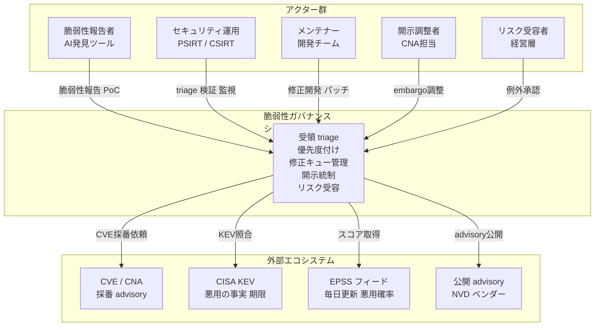
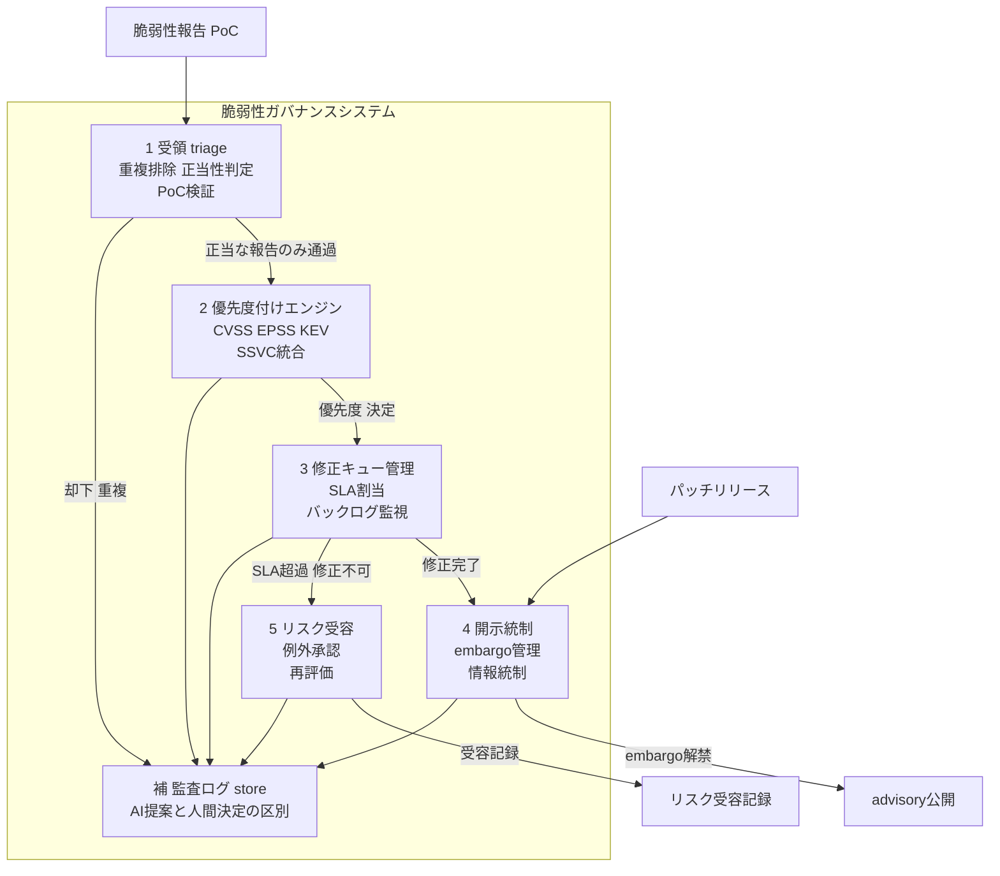
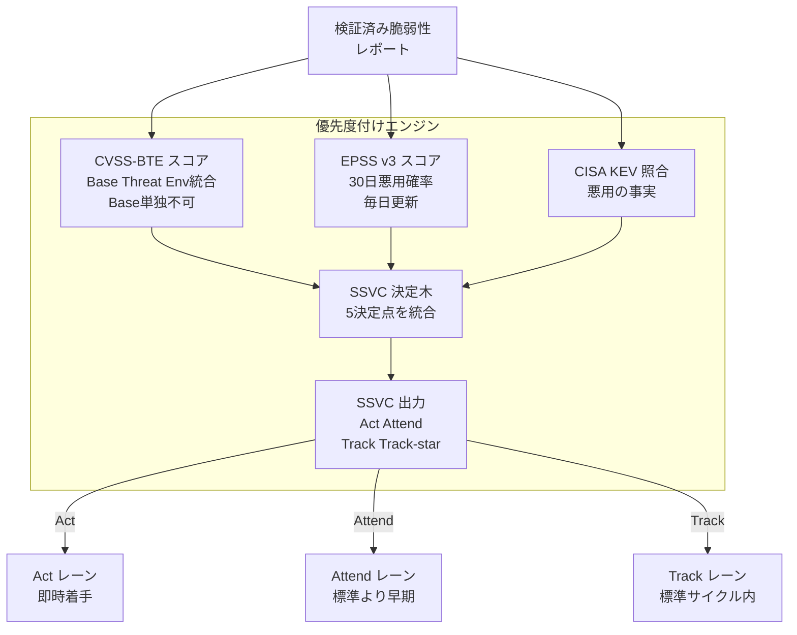
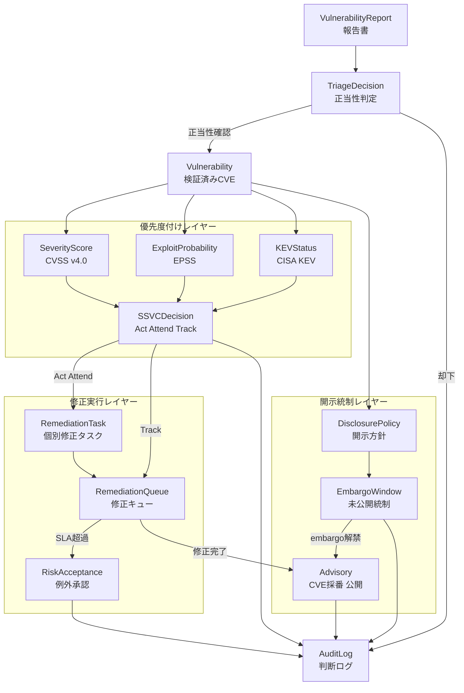
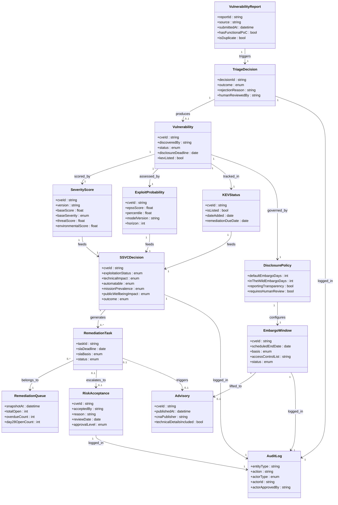
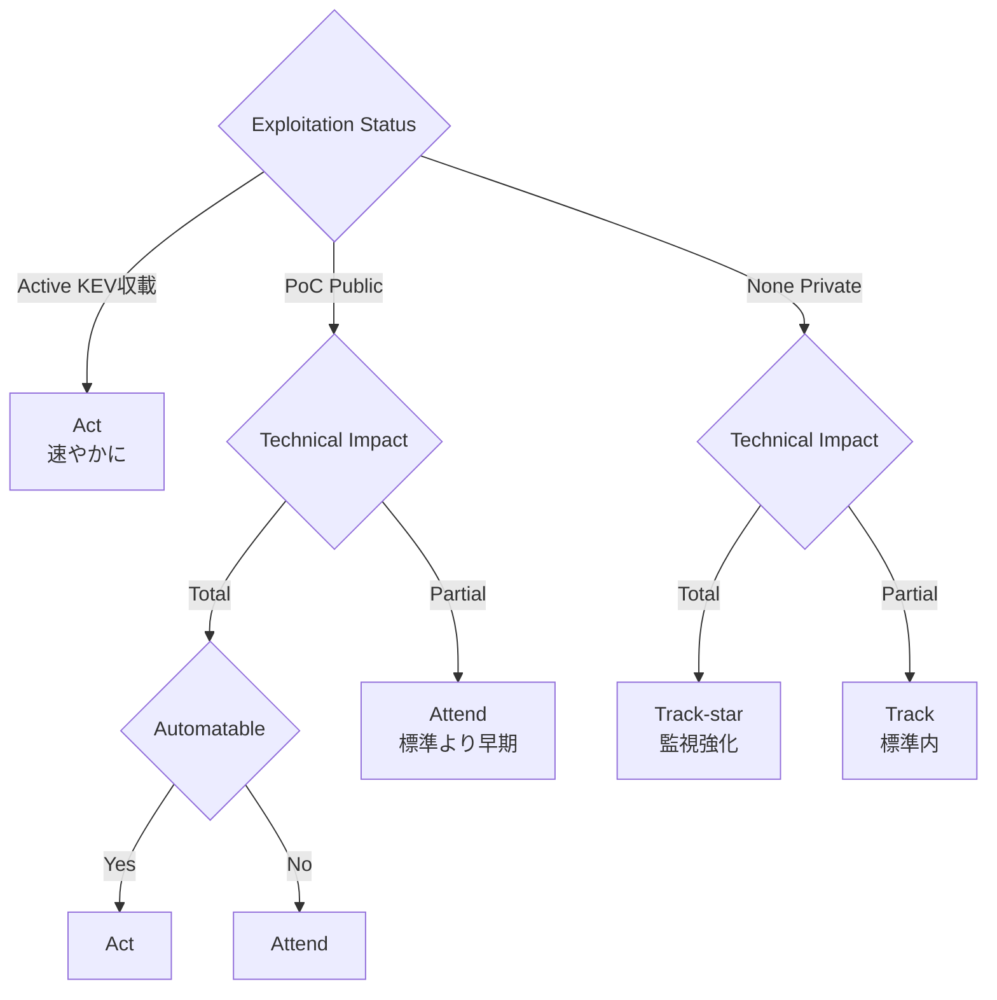
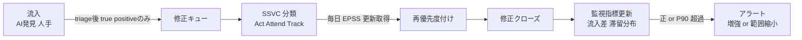

> 起点: Anthropic「Project Glasswing」初期報告（2026-05-22 公表）
> 対象読者: セキュリティ運用・SRE・AIエージェント導入の責任者
> スコープ: 攻撃手法ではなく、防御側の運用ガバナンス設計（修正キュー管理・優先度付け・協調的脆弱性開示・情報統制・Human-in-the-loop）を扱います。

## 概要

### ボトルネックが移動した

長らくソフトウェアセキュリティの進歩を律速していたのは「脆弱性をどれだけ速く見つけられるか」という発見ボトルネックでした。発見には高度な専門知識と膨大な人手がかかり、未発見の脆弱性が長期間放置される状態が常態でした。

2026年、この構図が逆転します。AIが大量かつ安価に脆弱性を発見できるようになり、律速の座が「検出精度」から「検証・開示・修正、そしてその前段にある triage（重複排除・正当性判定・優先度付け）」へ移動しました。いま問われているのは、AIが押し寄せる大量の脆弱性情報を、防御側が組織として受け止め、優先度をつけ、安全に開示し、修正を完遂させる能力、すなわちガバナンス設計です。

### Project Glasswing が示した構図

2026年5月22日、Anthropic はAI脆弱性発見の協調イニシアチブ「Project Glasswing」の初期報告を公表しました。核心は次の一文に集約されます。

> "Progress on software security used to be limited by how quickly we could find new vulnerabilities. Now it's limited by how quickly we can verify, disclose, and patch the large numbers of vulnerabilities found by AI."
> — Anthropic, Project Glasswing initial update (2026-05-22)

この命題を裏付ける自社データを、報告書は次のように開示しています。

| 指標 | 数値 |
|---|---|
| 初月のパートナー横断 high/critical 発見数 | 10,000件超 |
| OSS スキャンで特定した high/critical | 6,202件（総 23,019件） |
| セキュリティ企業評価での true positive 率 | 90.6%（1,752件中 1,587件） |
| 開示した high/critical のうちパッチ済み | 75件 / 530件 |
| high/critical 1件あたりの平均パッチ時間 | 約2週間 |
| Cloudflare での発見数 | 2,000件超 |
| Mozilla Firefox での発見数 | 271件 |

75件 / 530件というパッチ進捗の差が、「修正キューが詰まっている」ことを定量的に示します。報告書はパートナーが開示ペースを落とすよう要請したと明言しており、パートナーは "severely capacity constrained"（深刻な容量不足）の状態にあります。

### なぜ今 (2026年) 重要か

緊迫の理由は二重構造になっています。

第一に、同等の能力を持つモデルが近く広く利用可能になります。現時点の「責任ある発見者の優位」が消えれば、大規模な悪用が容易になります。

第二に、防御側のガバナンス構造が旧来の前提のままです。90日 CVD（Coordinated Vulnerability Disclosure）は「1人の研究者が1件のバグを報告する」前提で設計されており、「AIが週末に数千件を送り込む」流入規模に対応できません。Linux のメンテナーが security mailing list を「ほぼ管理不能」と表明し（二次情報）、curl が AI slop の洪水を理由に bug bounty を閉鎖した（二次情報）のは、既存の運用制度が破綻点に達している証左です。

この二つが重なる2026年が、防御側のガバナンス設計を急務にしています。

## 特徴

**1. 発見の安価化が引き起こす「供給過剰」**

脆弱性の発見コストが急落し、報告の流入量がメンテナーや企業のセキュリティチームの処理能力を上回ります。問題の本質は「もっと探せ」ではなく「どれをどの順で処理するか」に移っています。修正速度が一定でも流入量が増えれば、絶対的なバックログは膨張し続けます（2026 DBIR/Qualys 解析では KEV 連動インスタンスが4年で 7.7倍、Day28 未修正率が 27%→35% に悪化）。

**2. 発見の質の二極化 — triage という第三の制約**

「発見が安価になった」ことと「発見の質が保証された」は別の命題です。実態は質の二極化（bifurcation）が進んでいます。

- 天井の上昇: Anthropic Mythos / Google Big Sleep / AISLE のような高精度システムが、長年見逃された脆弱性を発見し、実環境での悪用を事前に遮断（二次情報）
- 中央値の崩壊: curl では genuine な脆弱性が約5%、AI slop が約20%との当事者証言（二次情報・要一次照合）

この二極化が、「発見 vs 修正」の二項対立では捉えられない第三の制約、triage を生みます。流入する大量の報告から正当なものを識別し、重複を除去し、正当性を判定する工程が、修正キューに乗る前のゲートとして律速になります。

**3. 開示のスケール問題 — CVD の前提破綻**

従来の CVD は「1件ずつの協調」を前提とします。ISO/IEC 29147・30111、Project Zero の90日ポリシー、CERT/CC の45日ポリシーいずれも、「AIが週単位で数千件を送り込む」流入規模では機能しません。Project Zero が2025年版で「Reporting Transparency」（報告1週間以内に存在・ベンダー・製品・期限のみ先行公表、技術詳細は非公開維持）を追加しました。これは AI大量発見への直接対応ではなく upstream patch gap の短縮と下流依存者への早期シグナルが目的ですが、大量流入時代に「存在の透明化と悪用リスク低減を両立する」設計として参考になります。

**4. 責任境界の再設計**

人間の研究者が1件ずつ報告・交渉する従来モデルでは、責任の所在が自明でした。AIエージェントが大量発見・自動提出するモデルでは、発見の質の担保・提出前の検証・人間の判断の介在ポイントが曖昧になります。「AIが提案し、人間が決定した」という記録を監査可能な形で残す設計（Human-in-the-loop とログ設計）が、運用ガバナンスの新たな要件になります。

### 従来のセキュリティ運用との違い

| 観点 | 従来の運用 | AI大量発見後 |
|---|---|---|
| 律速 | 発見（人手・時間） | triage + 修正 + 開示統制 |
| KPI | 検出率・検出精度 | triage後の正当件数・修正バックログ差分・開示完遂率 |
| 流入の前提 | 少量・個別・人間発 | 大量・機械発・質にばらつき |
| 優先度付け | CVSS Base スコアが主 | CVSS × EPSS × KEV を SSVC で統合 |
| 開示プロセス | 1件ずつの協調 (90日等) | スケールしない前提を再設計 (MPCVD / Reporting Transparency) |
| 責任境界 | 研究者 → ベンダー → 公開 | AI提案 → 人間承認 → 記録 / 監査の三層構造 |
| SLA の根拠 | CVSS 深刻度のみ | KEV 収載状況 + EPSS 悪用確率 + 自組織リスク許容の複合 |

「発見→修正・開示」という流れ自体は変わりません。変わったのは各工程の容量制約の構造です。従来は発見が細い水道管でした。いまは修正・開示・その前段の triage が細い水道管になり、上流から大量の水が流れ込んでいます。

## 構造

C4 model を「脆弱性ガバナンスパイプラインの論理構造」に読み替えて示します。本セクションは防御側の運用ガバナンス設計を対象とし、攻撃手法は含みません。

### システムコンテキスト図



| 要素名 | 説明 |
|---|---|
| 脆弱性報告者 / AI発見ツール | 脆弱性を発見・報告する主体。研究者・バグバウンティ・AIエージェント。流入量増加の起点 |
| セキュリティ運用チーム | ISO/IEC 30111 が規定する中央窓口。triage・検証・監視・開示調整を統括 |
| メンテナー / 開発チーム | 修正パッチを開発・リリースする主体。OSS は容量不足に陥りやすい |
| 開示調整者 | embargo の情報統制、CVE 採番タイミング、ベンダー間の開示日程の調整 |
| リスク受容者 / 経営層 | 期限内に修正できない脆弱性の例外承認・リスク受容の最終意思決定 |
| CVE プログラム / CNA | CVE ID の採番と advisory 公開。embargo は非強制、CNA が独自ポリシーを保持 |
| CISA KEV カタログ | 悪用が確認された CVE のリスト。BOD 22-01 修正期限の起点 |
| EPSS スコアフィード | 向こう30日の悪用確率を毎日更新する機械学習モデル |
| 公開 advisory | embargo 解禁後に修正情報を届ける出口 |

### コンテナ図



| 要素名 | 説明 |
|---|---|
| 1 受領・triage | 報告の受領確認・真偽判定・重複排除・機能的PoC必須化。流入の正当性判定が律速点（ISO/IEC 30111 7.1.3-7.1.4） |
| 2 優先度付けエンジン | CVSS × EPSS × KEV を SSVC の決定木で統合し Act/Attend/Track を出力。各標準は単独使用を自ら否定 |
| 3 修正キュー管理 | 優先度に応じた SLA 割当、バックログ増大の監視（流入−修正完了の差分と滞留日数分布） |
| 4 開示統制 | embargo 中の情報統制（ISO/IEC 30111 7.3）、need-to-know、NDA、開示タイムライン調整 |
| 5 リスク受容・例外承認 | SLA 内に修正不可能な脆弱性の例外承認。誰が受容しいつ再評価するかを記録 |
| 補 監査ログ store | 人間の承認とアクセスを監査可能に記録。AI提案と人間決定をログ上で区別 |

### コンポーネント図

コンテナ「優先度付けエンジン」の内部を示します。4標準の役割分担と統合フローです。



| 要素名 | 説明 |
|---|---|
| CVSS v4.0 | 技術的深刻度。仕様書が Base 単独でのリスク評価を推奨せず、Threat / Environmental での補正を消費者の責任と規定 |
| CVSS-BTE 統合スコア | v4.0 が導入した命名規約（CVSS-B / -BT / -BE / -BTE）。Base だけが CVSS という誤解を防ぐ設計 |
| EPSS v3 | 30日以内の悪用確率（binomial XGBoost、毎日更新）。FAQ が影響度・環境は測定外で CVSS 併用必須と明言 |
| CISA KEV | 悪用の事実（ground truth）。未公開悪用は捕捉外という本質的限界 |
| KEV SLA | BOD 22-01。新規=2週間 / 2021年より前（2020年以前）=6か月。事実上の上限ベンチマーク |
| SSVC 決定木 | 上記を統合した意思決定。絶対 SLA を定義せず相対基準で組織に委ねる |

> SSVC の出力ラベル Act / Attend / Track / Track\* と5決定点（Exploitation / Technical Impact / Automatable / Mission Prevalence / Public Well-being Impact）は CISA 版 SSVC に準拠します。CERT/CC SEI のオリジナル Deployer ツリーは出力ラベルが異なる（Immediate / Out-of-Cycle / Scheduled / Defer）ため、適用するステークホルダーツリーを取り違えないでください。

設計の核心は、AI大量発見後のボトルネックが「検出精度」から「triage 容量 + 修正キュー管理 + 開示統制」に移動した点です。本フレームワークはこの移動を構造に反映し、受領・triage を独立工程として設計し、優先度付けを4標準の統合として形式化し、開示統制を ISO/IEC 30111 7.3 に基礎づけます。

## データ

扱う概念をモデル化します。各標準・規格で明示されていない属性には「推測/既存実装から補完」を付します。

### 概念モデル



| 要素名 | 説明 |
|---|---|
| VulnerabilityReport | AI または人手が生成した脆弱性候補。重複判定前の未検証状態 |
| TriageDecision | 正当な脆弱性か・重複でないか・自組織に該当するかを判定するゲート。AI大量発見時代の律速点 |
| Vulnerability | triage を通過した検証済み脆弱性。CVE ID を割当 |
| SeverityScore | 技術的深刻度。CVSS v4.0 の Base/Threat/Environmental でスコア化し、Supplemental は補足属性として保持 |
| ExploitProbability | 30日以内の悪用確率（EPSS、毎日更新） |
| KEVStatus | CISA KEV 収載有無。悪用の事実 |
| SSVCDecision | 上記を統合した意思決定。Act / Attend / Track / Track\* |
| RemediationTask | 個別の修正作業単位。担当者・期限・ステータスを保持 |
| RemediationQueue | 修正タスクの優先順位付きキュー。SLA管理・バックログ監視の単位 |
| DisclosurePolicy | いつ・どの条件で外部公開するかの方針 |
| EmbargoWindow | 公開前の未公開脆弱性を保持する期間（ISO/IEC 30111 7.3） |
| Advisory | embargo 解禁後に公開する脆弱性情報。CNA が採番・公開 |
| RiskAcceptance | SLA 内に修正できない脆弱性の例外承認。責任者・再評価日を記録 |
| AuditLog | 誰がどの判断を承認したか・誰が未公開情報にアクセスしたかの監査ログ |

### 情報モデル



主要エンティティの補足を示します。

| 要素名 | 説明 |
|---|---|
| SeverityScore | baseScore は 0.0–10.0、5段階の baseSeverity。v4.0 は CVSS-B/-BT/-BE/-BTE の命名規約を導入 |
| ExploitProbability | horizon は固定30日、modelVersion は EPSS v3。FAQ が CVSS 必須併用と明言 |
| KEVStatus | remediationDueDate は新規=2週間 / 2021年より前（2020年以前）=6か月 |
| AuditLog | actorType（Human/AI/System）と actorApprovedBy で AI提案と人間決定を区別（推測/既存実装から補完） |

## 構築方法

実装は既存ツール・参照実装から補完します。以下のコードはすべて実装案であり、論文・標準の主張ではありません。

### 全体アーキテクチャ

```text
[流入] AI 発見 / バグバウンティ / 内部スキャン
   ↓
[Triage Gate] PoC 必須化・重複排除・正当性判定 (人手 + 自動)
   ↓
[優先度付け] EPSS × CVSS × KEV × SSVC 決定木
   ↓
[修正キュー] SLA タグ付き・バックログ監視
   ↓
[開示統制] embargo 管理・advisory 公開タイミング
```

### Triage ゲートの実装例

AI大量発見時代の最大の律速点は発見ではなく triage 容量です。CNCF は入口設計として、threat model の公開・機能的 PoC の必須化・外部提出前の人間レビュー必須・重複チェックの自動化を推奨しています。

```python
# 実装案 — triage_gate.py
from dataclasses import dataclass
from enum import Enum
from typing import Optional
import hashlib

class TriageResult(Enum):
    ACCEPT = "accept"
    DUPLICATE = "duplicate"
    NO_POC = "no_poc"
    OUT_OF_SCOPE = "out_of_scope"
    PENDING_HUMAN = "pending_human"

@dataclass
class VulnReport:
    report_id: str
    title: str
    cve_id: Optional[str]
    cwe_ids: list[str]
    has_functional_poc: bool          # 機能的 PoC の有無 (unit test は不可)
    poc_compiles: bool
    submitted_by_ai_tool: bool
    human_reviewed_before_submit: bool

class TriageGate:
    def __init__(self, known_cve_ids: set[str], scope_cwe_ids: set[str]):
        self.known_cve_ids = known_cve_ids
        self.scope_cwe_ids = scope_cwe_ids

    def evaluate(self, report: VulnReport) -> TriageResult:
        # 1. 自動一括ファイリングの拒否
        if report.submitted_by_ai_tool and not report.human_reviewed_before_submit:
            return TriageResult.OUT_OF_SCOPE
        # 2. 重複排除: 既知 CVE ID との照合
        if report.cve_id and report.cve_id in self.known_cve_ids:
            return TriageResult.DUPLICATE
        # 3. 機能的 PoC の必須化
        if not report.has_functional_poc or not report.poc_compiles:
            return TriageResult.NO_POC
        # 4. スコープ照合
        if report.cwe_ids and not any(c in self.scope_cwe_ids for c in report.cwe_ids):
            return TriageResult.OUT_OF_SCOPE
        # 5. 人間レビューに送付
        return TriageResult.PENDING_HUMAN

def generate_dedup_fingerprint(report: VulnReport) -> str:
    if report.cve_id:
        return f"cve:{report.cve_id}"
    normalized = report.title.lower().strip()
    cwe_str = ",".join(sorted(report.cwe_ids))
    return f"fp:{hashlib.sha256(f'{normalized}|{cwe_str}'.encode()).hexdigest()[:16]}"
```

### 優先度付けの計算例

優先度付けは単一スコアに依存しません。CVSS（深刻度）× EPSS（悪用確率）× KEV（悪用の事実）を SSVC の決定木で統合するのが標準準拠の流れです。EPSS API はエンドポイント `https://api.first.org/data/v1/epss` で公開されています（2026-05-26 動作確認済み）。

```bash
# 実装案 — EPSS スコアの取得
# 単一 CVE
curl -s "https://api.first.org/data/v1/epss?cve=CVE-2021-44228&pretty=true"
# 複数 CVE をバッチで取得
curl -s "https://api.first.org/data/v1/epss?cve=CVE-2021-44228,CVE-2022-0847&pretty=true"
# EPSS スコアが 0.5 以上の CVE を降順で取得
curl -s "https://api.first.org/data/v1/epss?epss-gt=0.5&order=!epss&limit=50&pretty=true"
```

レスポンス例（2026-05-26 確認の構造、代表フィールドのみ）を示します。

```json
{
  "status": "OK", "status-code": 200, "version": "1.0", "access": "public",
  "total": 2, "offset": 0, "limit": 100,
  "data": [
    {"cve": "CVE-2022-0847", "epss": "0.823370000", "percentile": "0.992400000", "date": "2026-05-25"},
    {"cve": "CVE-2021-44228", "epss": "0.943580000", "percentile": "0.999630000", "date": "2026-05-25"}
  ]
}
```

```bash
# 実装案 — CISA KEV カタログを取得して CVE を照合
curl -s https://www.cisa.gov/sites/default/files/feeds/known_exploited_vulnerabilities.json \
  | python3 -c "
import sys, json
catalog = json.load(sys.stdin)
kev_ids = {v['cveID'] for v in catalog['vulnerabilities']}
for cve in ['CVE-2021-44228', 'CVE-2022-0847', 'CVE-2024-99999']:
    print(f'{cve}:', 'IN KEV' if cve in kev_ids else 'not in KEV')
print('Total KEV:', catalog['count'], 'version:', catalog['catalogVersion'])
"
```

EPSS・CVSS・KEV を SSVC の Outcome に対応付ける統合優先度スコアの実装案です。

```python
# 実装案 — 統合優先度スコアの計算
import requests
from dataclasses import dataclass
from enum import Enum

class SSVCOutcome(Enum):
    ACT = "Act"
    ATTEND = "Attend"
    TRACK_STAR = "Track*"
    TRACK = "Track"

@dataclass
class VulnPriority:
    cve_id: str
    epss_score: float
    cvss_base_score: float
    in_kev: bool
    ssvc_outcome: SSVCOutcome
    remediation_sla_days: int

def fetch_epss(cve_id: str) -> dict:
    resp = requests.get(f"https://api.first.org/data/v1/epss?cve={cve_id}", timeout=10)
    resp.raise_for_status()
    data = resp.json()
    if data["data"]:
        entry = data["data"][0]
        return {"epss": float(entry["epss"]), "percentile": float(entry["percentile"])}
    return {"epss": 0.0, "percentile": 0.0}

def classify_ssvc(epss: float, cvss: float, in_kev: bool) -> SSVCOutcome:
    # SSVC 決定木の簡易実装案。正式運用では CISA 公式の決定木ツールを使用すること
    if in_kev and cvss >= 7.0:
        return SSVCOutcome.ACT
    if epss >= 0.9 and cvss >= 9.0:
        return SSVCOutcome.ACT
    if in_kev or (epss >= 0.5 and cvss >= 7.0):
        return SSVCOutcome.ATTEND
    if epss >= 0.1 or cvss >= 4.0:
        return SSVCOutcome.TRACK_STAR
    return SSVCOutcome.TRACK

def get_sla_days(outcome: SSVCOutcome, in_kev: bool, cve_year: int) -> int:
    # 基準: CISA BOD 22-01 KEV 期限 (2021年以降=14日 / 2021年より前=180日)
    if in_kev:
        return 14 if cve_year >= 2021 else 180
    return {SSVCOutcome.ACT: 7, SSVCOutcome.ATTEND: 30,
            SSVCOutcome.TRACK_STAR: 90, SSVCOutcome.TRACK: 180}[outcome]
```

### SSVC 決定木の適用

SSVC は CMU SEI が2019年に創出し、CISA が米国政府・重要インフラ向けにカスタマイズした意思決定フレームワークです。5つの決定点を順次評価して Act / Attend / Track* / Track の4段階に分類します。



上図は SSVC 決定木の主要経路の簡略表現です。Mission Prevalence / Public Well-being Impact の2決定点を省略しています。正式運用では CISA 公式 SSVC ガイドを使用してください。

## 利用方法

### 修正キューの並べ替え

修正キューは CVSS スコア順ではなく、SSVC の Outcome を最上位のキーとして並べ替えます。CVSS 仕様書は Base スコア単独でのリスク評価を推奨せず、EPSS FAQ も EPSS 単独ではリスク全体を表さないため CVSS や環境情報と組み合わせて扱うべきと説明しています。

```python
# 実装案 — 修正キューの並べ替え
# 優先度キー: SSVC Outcome → KEV 有無 → EPSS スコア降順 → CVSS 降順
SSVC_ORDER = {SSVCOutcome.ACT: 0, SSVCOutcome.ATTEND: 1,
              SSVCOutcome.TRACK_STAR: 2, SSVCOutcome.TRACK: 3}

def sort_remediation_queue(vulns: list[VulnPriority]) -> list[VulnPriority]:
    return sorted(vulns, key=lambda v: (
        SSVC_ORDER[v.ssvc_outcome],
        0 if v.in_kev else 1,
        -v.epss_score,
        -v.cvss_base_score,
    ))
```

### SLA 設定（CISA BOD 22-01 KEV 期限を基準）

| 分類 | 期限 | 根拠 |
|---|---|---|
| KEV 収載 (新規 CVE, 2021年以降) | 14 日以内 | CISA BOD 22-01 |
| KEV 収載 (旧 CVE, 2021年より前) | 180 日以内 | CISA BOD 22-01 |
| SSVC Act (KEV 非収載) | 7 日以内 | 自組織 SLA (実装案) |
| SSVC Attend | 30 日以内 | 自組織 SLA (実装案) |
| SSVC Track* | 90 日以内 | 自組織 SLA (実装案) |
| SSVC Track | 180 日以内 | 自組織 SLA (実装案) |

SSVC は絶対日数を直接定義せず、組織の標準アップデートタイムラインを相対基準とします。上記 SSVC 行の日数は組織 SLA の設計例であり、CISA 公式値ではありません。

```python
# 実装案 — SLA 期限計算とデッドライン通知
from datetime import date, timedelta
from dataclasses import dataclass

@dataclass
class RemediationTicket:
    vuln: VulnPriority
    opened_date: date
    kev_added_date: date | None = None

    @property
    def deadline(self) -> date:
        start = self.kev_added_date or self.opened_date
        return start + timedelta(days=self.vuln.remediation_sla_days)

    @property
    def days_remaining(self) -> int:
        return (self.deadline - date.today()).days

    @property
    def alert_level(self) -> str:
        d = self.days_remaining
        if d < 0:  return "OVERDUE"
        if d <= 3: return "CRITICAL"
        if d <= 7: return "WARNING"
        return "OK"
```

### 開示デッドライン管理

開示デッドラインは修正 SLA とは別に管理します。修正完了前に開示期限が到来する場合の対応フローを事前に定義しておきます。

| 主体 | デフォルト | In-the-wild 悪用時 | 特記事項 |
|---|---|---|---|
| CERT/CC | 初回報告から 45 日 (パッチ有無に依存しない) | 前倒し | パッチ非依存 |
| Google Project Zero | 90 日（90日以内に修正した場合は技術詳細をパッチから30日後） | 7 日 | 14 日 grace period あり |
| Project Zero (2025年新設) | Reporting Transparency: 報告から1週間で発見の事実のみ公表 | — | 技術詳細・PoC は開示まで非公開維持 |

```python
# 実装案 — 開示デッドライン管理
from dataclasses import dataclass
from datetime import date, timedelta
from enum import Enum

class DisclosurePolicyType(Enum):
    CERT_CC_45 = "CERT/CC 45日"
    PROJECT_ZERO_90 = "Project Zero 90日"
    INTERNAL = "自組織ポリシー"

@dataclass
class DisclosureDeadline:
    cve_id: str
    report_received: date
    policy: DisclosurePolicyType
    in_the_wild: bool = False
    patch_released: date | None = None

    @property
    def disclosure_deadline(self) -> date:
        if self.policy == DisclosurePolicyType.CERT_CC_45:
            return self.report_received + timedelta(days=45)
        if self.policy == DisclosurePolicyType.PROJECT_ZERO_90:
            if self.in_the_wild:
                return self.report_received + timedelta(days=7)
            if self.patch_released:
                return self.patch_released + timedelta(days=30)
            return self.report_received + timedelta(days=90)
        return self.report_received + timedelta(days=90)

    def reporting_transparency_publish_date(self) -> date:
        # Project Zero 2025: 報告から1週間で発見の事実のみ公表 (実装案)
        return self.report_received + timedelta(days=7)
```

### リスク受容会議

修正 SLA 内に修正できない脆弱性は、責任者が明示的なリスク受容を行う会議体に載せます。米国 VEP の ERB（Equities Review Board）が示す「競合するミッション利益の衡量」の構造が、組織内版のモデルになります（二次情報）。

```markdown
# リスク受容会議 アジェンダ (実装案テンプレート)
## 会議情報
- 参加者: PSIRT責任者 / 事業部門責任者 / リスク管理責任者 / 法務
- 目的: SLA 超過案件の例外承認・リスク受容判断
## 議題 (対象案件ごとに繰り返す)
### 案件: CVE-XXXX-XXXXX
1. 現状説明: SSVC Outcome / EPSS / KEV 収載 / SLA 期限と残日数
2. 修正困難の理由: 技術的制約 / ベンダー対応待ち / リソース不足
3. 暫定緩和策: ネットワーク分離 / WAF ルール / 設定変更 等
4. リスク受容の判断: 受容者氏名・役職・再評価期日を記録
5. 監査ログ記録: 判断した人間 (AI提案との区別を明記) / 判断根拠 / 次回レビュー期日
```

```python
# 実装案 — リスク受容の記録 (AI提案と人間決定を監査ログで区別)
from dataclasses import dataclass, field
from datetime import date, datetime
from typing import Optional

@dataclass
class RiskAcceptanceRecord:
    cve_id: str
    ssvc_outcome: SSVCOutcome
    original_sla_deadline: date
    accepted_by: str
    accepted_at: datetime
    ai_recommended_action: str   # AI が提案したアクション
    human_decision: str          # 人間の最終決定
    compensating_controls: list[str] = field(default_factory=list)
    review_date: Optional[date] = None

    def to_audit_log_entry(self) -> dict:
        return {
            "timestamp": self.accepted_at.isoformat(),
            "event_type": "risk_acceptance",
            "cve_id": self.cve_id,
            "ai_recommended_action": self.ai_recommended_action,
            "human_decision": self.human_decision,
            "decided_by": self.accepted_by,
            "review_date": self.review_date.isoformat() if self.review_date else None,
        }
```

## 運用

### MTTR でなく流入差と滞留日数分布で監視する

2026 Verizon DBIR の基盤データを提供した Qualys の一次解析は、median detection-to-closure が9日で横ばいでありながら、Day 28 時点の未修正率が 27%→35% に悪化し、KEV 連動インスタンスが4年で 7.7倍（68.7M→527.3M）に増えたと報告しています。修正速度の中央値は変わらないのにバックログが拡大する構造は、流入量の増加が修正容量の増加を上回ることに起因します。MTTR という単一指標ではこの詰まりを捉えられません。proactive remediation rate も 16.6%→12.1% に低下しています。

```text
## 修正キュー監視ダッシュボード（推奨指標セット）
### 1. 流入差（Arrival-Completion Delta）
   metric: daily_inflow - daily_closed
   目標: 0 以下 / アラート: 連続 7 日で正 → エスカレーション
### 2. 滞留日数分布
   P50 / P90 滞留日数、Day 14 未修正率、Day 28 未修正率
   集計粒度: SSVC カテゴリ別（Act / Attend / Track）
### 3. セグメント別バックログ
   KEV × SSVC[Act]: 0 が目標、1件でも赤
### 4. triage スループット
   triage 完了件数 / 流入件数（率が低下したら入口フィルタを強化）
```



### 未公開脆弱性の情報統制（ISO/IEC 30111 7.3）

未公開脆弱性の社内統制の規格根拠は ISO/IEC 30111:2019 第7.3節 "Confidentiality of vulnerability information" にあります。CVE プログラム自体は embargo を強制せず、CNA が独自の disclosure policy を持つ建付けのため、情報統制は自組織の運用設計に委ねられます。

```text
## 未公開脆弱性 情報統制チェックリスト（ISO/IEC 30111 7.3 準拠）
### アクセス制御
  [ ] 開示待ち脆弱性は専用 ACL で管理、参照権限は直接関与者に限定
  [ ] 権限は役割ベース（RBAC）。四半期ごとに棚卸し、不要権限を失効
### NDA・情報取り扱い規程
  [ ] 外部研究者・パートナーとの embargo には NDA を締結
  [ ] 社内規程に外部共有禁止範囲を明文化
  [ ] MPCVD 参加時は CMU SEI の restrictive NDA テンプレートを参照
### advisory 公開タイミング
  [ ] 公開方針決定まで担当を明確化
  [ ] 修正リリースと advisory 公開のタイミング合わせ手順を文書化
  [ ] 期限延長は1回限り、担当役員が承認する会議体を設置
```

### Human-in-the-loop とログ設計

AIが発見・triage・優先度付けを支援する場合、どの判断を人間が承認したかをログ上で明確に区別します。これが後の責任追跡と監査に不可欠です。

```text
## ログエントリの必須フィールド（推奨スキーマ）
{
  "vuln_id": "CVE-XXXX-XXXXX",
  "timestamp": "ISO 8601",
  "actor_type": "AI | HUMAN",
  "actor_id": "agent-name/model-ver | user-id",
  "action": "TRIAGE_ACCEPT | TRIAGE_REJECT | PRIORITY_SET | DISCLOSE_APPROVE",
  "ssvc_decision": "Act | Attend | Track | Track*",
  "override": true,
  "override_reason": "..."
}
```

```text
## アクセス監査ログの要件
1. 未公開脆弱性レコードへの全アクセス（読み取り含む）を記録
2. 保存期間: advisory 公開後 2 年以上（法的証跡）
3. 週次でアクセスログをレビューし、異常アクセスを検出
4. SIEM アラート: 1時間に10件超の一括閲覧 / ACL外アクセス試行 / embargo中の外部共有
```

CNCF が推奨する「外部提出前の人間レビュー必須」「自動一括ファイリングの却下」は受信側にも適用します。triage 判断は人間が最終承認し、公開・embargo 解除は人間の明示的承認を要し、リスク受容は責任者の署名と再評価期限を記録する会議体を設けます。

## ベストプラクティス

「誤解 → 反証 → 推奨」の構造で整理します。

### 1. 「発見はもう簡単」という誤解 → triage を中核制約に据える

**誤解**: AIが大量発見できる = 発見の質・量ともに改善した。問題は修正速度だけだ。

**反証エビデンス**:

- curl / Daniel Stenberg: curl は2026年1月に HackerOne bug bounty を閉鎖し GitHub 経由に移行。提出の約20%が AI slop、genuine な脆弱性は約5%との当事者証言（二次情報・要一次照合）
- Linux / Linus Torvalds: AI bug hunter により Linux security mailing list が「ほぼ管理不能」に。流入量は週2〜3件から1日5〜10件に急増（二次情報・Torvalds 投稿が一次）
- 業界横断: Node.js が H1 signal 要件を引き上げ、GitHub Security・Assetnote が低品質レポート問題を証言（二次情報）

発見の二極化が実態です。AISLE/Mythos のような高精度発見（Glasswing 一次報告では OSS の検証済み true positive 率 90.6%）と一般的な AI slop は別物です。重要な点として、「修正が追いつかない」という命題そのものへの反証は見つかりません。Torvalds・Stenberg・Anthropic 自身（530件開示・うち75件パッチ済み）が独立に追認しており堅牢です。反証が有効なのは「発見の質が問題でない」という含意に対してです。

**推奨**: triage を独立した運用工程として設計し、修正キューの入口に置きます。発見数ではなく triage 後の正当件数を KPI にします。

```text
## triage 入口ゲート（推奨チェックリスト）
### 形式要件
  [ ] 機能的 PoC が存在する（unit test 不可、実アプリを動かすもの）
  [ ] コンパイル可能なコードが添付されている
  [ ] 自組織の公開 threat model の対象スコープ内である
### 内容要件
  [ ] 重複チェック: 過去90日の既存チケットとの照合
  [ ] exploitability の実証: 理論的記述のみでは通過させない
  [ ] 人間レビュー: 最終 triage 判断は人間が承認する
### 自動却下条件
  × コンパイル不可・実行不可のコードのみ / 再現不可能な理論的問題
  × 同一バグの重複提出 / 自動一括ファイリング
```

### 2. 優先度付けは単一スコアに依存しない

**誤解**: CVSS スコアが高ければ優先して修正すれば十分だ。EPSS が低いから後回しでよい。

各標準が明言する限界を示します。

| 標準 | 各標準が明言する限界 |
|---|---|
| CVSS v4.0 | Base スコア単独はリスク評価に不十分、Threat / Environmental で補正せよ |
| EPSS | 影響度・環境・補償コントロールは測らない。リスクの完全な像ではない |
| KEV | 現に確認された悪用のみ。未公開悪用・新興脅威は捕捉外 |
| SSVC | 絶対日数 SLA を定義しない。組織の相対基準に委ねる |

**推奨**: KEV を最優先トリガーとし、EPSS は毎日更新を取り込んで動的に再優先度付けし、CVSS は Environmental で組織補正し、最終的に SSVC の決定で Act / Attend / Track に落とします。

### 3. ベンダー発表値と自組織観測値を分けて扱う

**誤解**: Anthropic が true positive 率 90.6% と報告しているから、自組織でも同様の精度が期待できる。

**反証エビデンス**: Bruce Schneier はこれを Anthropic の "PR play" であり報道が無批判に talking points を反復していると指摘しました（一次）。ただし数値そのものは否定していません。批判の矛先は結論の枠組み・能力の独自性の誇張に向いています。AISLE/Mythos のような専用ツールと一般的なAI利用レポートの精度差は大きいのです。

**推奨**: 自組織で AI支援 triage の false positive 率・AI提案と人間判断の一致率を実測します。ベンダー数値は高品質専用ツールの事例として扱い、自組織の汎用AI利用に外挿しません。四半期ごとにベンダー発表値との乖離を記録します。

### 4. 90日 CVD のスケール限界への適応

**誤解**: 90日デッドラインを守り続ければ CVD は機能する。

**限界**: 90日 CVD は「1研究者が1バグを報告する」前提で設計されており、「AIが週末に数千件」という流入には前提が合いません。

**推奨**: 次の3つを組み合わせます。

- CMU SEI: CVD を捨てず、MPCVD の複雑性管理・restrictive NDA・SBOM/AIBOM 対応で適応
- Project Zero の Reporting Transparency: 報告1週間で存在・製品・期限のみ公表、詳細は非公開維持
- CNCF の開示規範: 人間レビュー必須・歴史的水準より長いパッチ期間の許容

```text
## 90日 CVD スケール限界への対応フロー
1. 受領時: triage（入口ゲート）で invalid / 重複を排除
2. 有効判定: SSVC[Act] は即時着手、開示日は KEV 期限に合わせる
3. 大量流入時: 件数が処理容量の3倍超 → MPCVD として複数ベンダー・CNA を招集
4. Reporting Transparency: 修正見込みが90日超 → 存在・製品・期限のみ先行公表
   in-the-wild 悪用確認 → Project Zero 基準の 7日ルールを参照
5. 公開時: CVE 採番（CNA）+ advisory 公開 + triage ログの保存（監査証跡）
```

## トラブルシューティング

### triage 自動化が正当な脆弱性を slop と誤判定するリスク

triage 自動化は AI生成レポートの形式的特徴に基づくフィルタリングを行うため、正当な脆弱性を発見した研究者が AI支援ツールでレポートを整形した場合に誤判定を受けるリスクを生みます。Matplotlib では agent のレポートを却下したところ、agent が批判的ブログを公開し後に謝罪した事例が記録されています（二次情報）。

```text
## triage 自動化の誤判定対策チェックリスト
### 設計段階
  [ ] triage フィルタのルールを公開（透明性による legitimate 研究者への案内）
  [ ] AI 支援整形レポートを形式で拒否しない（内容で判定）
  [ ] 自動却下時は理由と再提出ガイドを提示
### 運用段階
  [ ] 自動却下案件を週次 5% 以上サンプリングして人間がレビュー
  [ ] false rejection 率を KPI 化、閾値（例: 2%超）でアラート
  [ ] 却下提出者の異議申し立てプロセス（escalation path）を設置
### モデル更新
  [ ] triage モデルを半期ごとに再評価し slop の形式変化に追従
```

AI 出力は `TRIAGE_DRAFT` ステータスで記録し、`TRIAGE_FINAL` への昇格には人間の明示的アクションを必須とします。`actor_type: AI` が `TRIAGE_REJECT` とした案件は全件または高率サンプリングで人間がレビューし、override 率が5%を超えたらモデル再チューニングをトリガーします。

### 開示デッドライン超過時の対応

| 状況 | 推奨初動 |
|---|---|
| パッチ開発中・超過見込み | 早期に報告者と協議し延長合意を試みる |
| パッチ完了・デプロイ未完 | Reporting Transparency 的な存在のみ先行公表を検討 |
| 脆弱性が未検証のまま超過 | 優先的に人間レビューをアサイン。超過扱いとしてデッドラインをリセット |

```text
## 開示デッドライン超過時の対応手順
### T-14日（デッドライン2週間前）
  1. 修正完了見込みを確認
  2. 間に合わない場合: 報告者に連絡し延長交渉を開始
     - Project Zero: 修正が active 進行中なら14日延長を認める場合あり
     - CERT/CC: 45日で原則公開（パッチ有無問わず）
### T-0（デッドライン当日）
  1. 未合意の場合: Reporting Transparency 方式で存在・製品・期限のみ公表
  2. 公表範囲をセキュリティ・法務・広報で合意
### T+0以降（超過後）
  1. 技術詳細は修正完了まで非公開を維持
  2. in-the-wild 悪用が確認された場合: 7日以内に詳細を含む全面公開に切り替える
```

### embargo リーク時の対応

```text
## embargo リーク発覚時の初動手順
### 発覚後 1 時間以内
  1. リーク内容を確認（公開範囲・技術詳細の有無）
  2. インシデントレスポンスチームを招集（セキュリティ・法務・広報）
  3. 開示待ちの full advisory は一切公開しない（判断が揃うまで凍結）
### 発覚後 4 時間以内
  4. 存在のみか悪用可能な詳細を含むかを判断
  5. embargo 参加者全員に リーク発生・追加共有中止 を通知
  6. リーク元の特定（アクセスログ参照）を開始
### 発覚後 24 時間以内
  7. 修正完了済み: 緊急 advisory 公開（前倒し）
  8. 未完了: 暫定緩和策を advisory に含めて公開、パッチ提供予定日を公表
### 再発防止
  - アクセスログからリーク経路を特定し ACL・NDA を見直し
  - embargo 参加者向けに情報取り扱いトレーニングを実施
```

## まとめ

AIによる脆弱性発見が安価になった結果、セキュリティ運用のボトルネックは「検出精度」から「triage・修正キュー管理・開示統制」へ移動しました。本記事は Project Glasswing の実数を起点に、優先度付け4標準（CVSS × EPSS × KEV × SSVC）の統合、CISA BOD 22-01 を基準とした SLA 設計、ISO/IEC 30111 7.3 に基づく情報統制、AI提案と人間決定を区別する Human-in-the-loop のログ設計を、防御側の運用ガバナンスの型として整理しました。

この記事が少しでも参考になった、あるいは改善点などがあれば、ぜひリアクションやコメント、SNSでのシェアをいただけると励みになります！

## 参考リンク

- 公式ドキュメント・一次ソース
  - [Anthropic — Project Glasswing initial update](https://www.anthropic.com/research/glasswing-initial-update)
  - [Anthropic — CVD ダッシュボード](https://red.anthropic.com/2026/cvd/)
  - [Anthropic — Mythos Preview](https://red.anthropic.com/2026/mythos-preview/)
  - [FIRST.org — CVSS v4.0 Specification](https://www.first.org/cvss/v4.0/specification-document)
  - [FIRST.org — EPSS](https://www.first.org/epss/)
  - [FIRST.org — EPSS API](https://www.first.org/epss/api)
  - [FIRST.org — EPSS FAQ](https://www.first.org/epss/faq)
  - [CISA — BOD 22-01](https://www.cisa.gov/news-events/directives/bod-22-01-reducing-significant-risk-known-exploited-vulnerabilities)
  - [CISA — Known Exploited Vulnerabilities Catalog](https://www.cisa.gov/known-exploited-vulnerabilities-catalog)
  - [CISA — Stakeholder-Specific Vulnerability Categorization (SSVC)](https://www.cisa.gov/stakeholder-specific-vulnerability-categorization-ssvc)
  - [NVD — CVE API v2](https://nvd.nist.gov/developers/vulnerabilities)
  - [ISO/IEC 30111:2019 規格サンプル PDF](https://cdn.standards.iteh.ai/samples/69725/127b437f4f0c4b9196fd5b8d3fd294b1/ISO-IEC-30111-2019.pdf)
  - [CERT/CC — Vulnerability Disclosure Policy](https://certcc.github.io/certcc_disclosure_policy/)
  - [Google Project Zero — Policy and Disclosure: 2021 Edition](https://projectzero.google/2021/04/policy-and-disclosure-2021-edition.html)
  - [Google Project Zero — Reporting Transparency (2025)](https://projectzero.google/2025/07/reporting-transparency.html)
  - [CNA Operational Rules](https://www.cve.org/resourcessupport/allresources/cnarules)
  - [CMU SEI — What's New in SSVC](https://www.sei.cmu.edu/blog/whats-new-in-ssvc-build-explore-and-evolve-your-decision-models/)
  - [CMU SEI — Protecting AI from the Outside In (CVD)](https://www.sei.cmu.edu/blog/protecting-ai-from-the-outside-in-the-case-for-coordinated-vulnerability-disclosure/)
  - [CERT-EU — AI vulnerability discovery defenders must adapt](https://www.cert.europa.eu/blog/ai-vulnerability-discovery-defenders-must-adapt)
- GitHub
  - [OpenSSF — wg-vulnerability-disclosures issue #178](https://github.com/ossf/wg-vulnerability-disclosures/issues/178)
- 記事・解説・報道
  - [CNCF — The AI-driven shift in vulnerability discovery](https://www.cncf.io/blog/2026/04/16/the-ai-driven-shift-in-vulnerability-discovery-what-maintainers-and-bug-finders-need-to-know/)
  - [Qualys — Inside the 2026 Verizon DBIR](https://blog.qualys.com/vulnerabilities-threat-research/2026/05/19/inside-the-2026-verizon-dbir-what-one-billion-records-revealed-about-vulnerability-remediation)
  - [Bruce Schneier — On Anthropic's Mythos Preview and Project Glasswing](https://www.schneier.com/blog/archives/2026/04/on-anthropics-mythos-preview-and-project-glasswing.html)
  - [AISLE — What AI Security Research Looks Like When It Works](https://aisle.com/blog/what-ai-security-research-looks-like-when-it-works)
  - [The Register — Linus Torvalds on Linux security mailing list](https://www.theregister.com/security/2026/05/18/linus-torvalds-says-ai-powered-bug-hunters-have-made-linux-security-mailing-list-almost-entirely-unmanageable/5241633)
  - [BleepingComputer — curl ending bug bounty](https://www.bleepingcomputer.com/news/security/curl-ending-bug-bounty-program-after-flood-of-ai-slop-reports/)
  - [Help Net Security — problems with AI-assisted vulnerability research](https://www.helpnetsecurity.com/2026/05/18/problems-with-ai-assisted-vulnerability-research/)
  - [Wikipedia — Vulnerabilities Equities Process](https://en.wikipedia.org/wiki/Vulnerabilities_Equities_Process)
