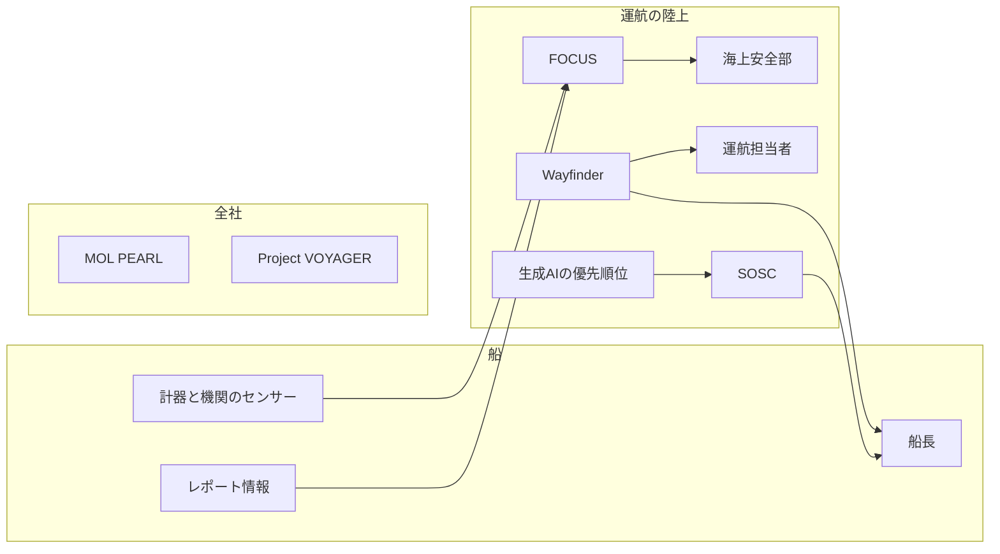

商船三井は、船から集めるデータと、全社の共通データと、運航判断の支援を、別の仕組みに分けています。会社概要は、2026年3月31日現在のグループ運航船舶規模を930隻としています。日経クロステックは2026年9月24日、慶山順一氏のインタビューを公開しました。公開リードは、低軌道衛星通信を背景にデータ基盤を整え、900隻を超える船舶を運航する同社が船舶データを営業や経営に生かし、AIの活用と、AIに依存しない人材の育成を同時に目指す、と書いています。見出しは、AIに「反証」できる人材育成です。誌面の出典表示は、日経コンピュータ2026年9月17日号94-95ページです。インタビュー本文は有料会員限定のため、この記事は公開リードと、商船三井が公開している一次資料の範囲で書きます。

この記事では、各仕組みが何を持ち、誰に何を渡すと公開資料が書いているかを確認します。そのうえで、安全運航、航路、機器、経営投資の四つの判断について、モデル側に出ているものと、反論する人が開ける記録の対応を整理します。

*この記事の全体像。以下、順に解説します。*

## 商船三井の船舶データとは

船のセンサー、レポート情報、運航判断、経営の画面は、公開資料の上では別々の対象です。名前が付いている仕組みは、次のように分かれます。

| 仕組み | 公開資料が置いているもの |
|---|---|
| FOCUS | 船上のセンサーと運航レポート。海上安全部が異常候補を確認する |
| SOSC | 生成AIが付けたリスクの優先順位。運航判断への助言と是正提案 |
| Wayfinder | 毎日の航路とエンジン回転数の提案 |
| MOL PEARL | 会計、営業、運航、環境・安全、マーケットなどを名寄せした全社の共通データ |
| Project VOYAGER | 事業別の損益、資産、キャッシュ、投資計画を一つの画面にした経営ダッシュボード |

### FOCUSが集めるもの

[FOCUS](https://www.mol-service.com/ja/services/energy-saving-technologies/focus)は、船上データ分析統合基盤です。製品頁は、約270隻から最大1万点/隻のセンサーデータと、約650隻からのレポート情報を統合すると書いています。更新日の記載はありません。2019年5月21日の[Fleet Viewer発表](https://www.mol.co.jp/pr/2019/19033.html)は、6,000点にも及ぶデータを1分間隔で集め、船陸で状態、位置、海気象を共有すると書いていました。海上デジタルの頁は、FOCUSが運航レポートもクラウドで統合する、と書いています。

製品頁の「最大1秒」は、省エネ施策や船体洗浄の前後をFleet Transferで比べるときの収集間隔です。約1万点の定常周期としては書かれていません。

海上安全部は、FOCUSがトラブル可能性の高い船を自動抽出した結果を見て、異常の有無を確認し、船舶管理会社と共有します。2019年のFleet Viewerは、「深掘りできる」を機能として書いていました。

### 運航判断を支援するSOSCとWayfinder

[安全運航支援センター（SOSC）](https://www.mol.co.jp/pr/2026/26041.html)は、2026年7月1日から、日本IBMと共同の仕組みを運用します。生成AIがリスクを抽出し、動静監視、状況評価、運航判断の優先順位付けを支援します。公式は、AIの分析と船長経験者の知見を組み合わせて判断の質を高める、と書いています。SOSCの役割は、運航判断への助言と是正提案です。2026年7月1日の公式プレスに、担当隻数の記載はありません。

[Wayfinder](https://www.mol.co.jp/pr/2024/24090.html)は、気海象予測と船の条件から、航路とエンジン回転数を毎日、各船と陸上の運航担当者に出します。2024年7月30日の発表は、40隻のトライアルで1航海平均約6%の燃料とGHGを減らした、と書いています。本文は、波高を含む気海象予測が、衛星データのみの旧来手法に比べ約50%向上した、と書いています。同じ発表の註は、欧州中期予報センターとの短期的な波予測比較です。サステナビリティの頁は同じ註で「最大50%」と書き、2025年12月時点で約330隻が使う、としています。

### 全社の共通データと経営の画面

同じ[サステナビリティの頁](https://www.mol.co.jp/sustainability/dx/ai/)にあるMOL PEARLは、会計、営業、運航、環境・安全、マーケットなどを名寄せして共通データにする全社基盤です。自然言語で問いかける使い方は、同社サイトでは将来の記述です。

Project VOYAGERは、事業別の損益、資産、キャッシュ、投資計画を一つの画面にする経営ダッシュボードです。シミュレーション機能は2025年10月からです。VOYAGERの節がAIと書くのは、課題整理や要件定義や関連文書の作成を短くし、開発のリードタイムを短縮する、という開発側の話です。同じ頁の他の節には、経営・事業判断へのAI、PEARLの将来の自然言語、WayfinderのAIとデータモデルもあります。

### 低軌道衛星通信

[Starlinkの導入](https://www.mol.co.jp/pr/2023/23133.html)は、2023年10月16日に、グループの船舶管理会社が管理する外航船233隻へ順次導入すると決めた、という発表です。2023年度の予定は約140隻です。トライアルでは通信速度が最大50倍になった、と書いています。発表の主目的は船員のウェルビーイングです。船陸のリアルタイム共有は、その後の狙いとして書かれています。現行の海上デジタルの頁は「導入を進め」と書いています。

### 人材について公開されている発言

[日本海事新聞の2025年7月14日のインタビュー](https://www.jmd.co.jp/article.php?no=306927)で、慶山氏は、データの収集と精度と集約から、活用と分析へ移る年だと話しています。AIについては、必要なデータがどこにあるかを人が把握しきれず、検索に時間がかかるので、抽出の仕組みを実装したい、と話しています。チェンジリーダー（変革人財）の育成にも触れています。日本海事新聞は、2024年入社時の委嘱をDX共創ユニット担当執行役員補佐兼技術・デジタル統括ユニット長とし、2025年4月からの現職を執行役員・CDIOとしています。

### 公開資料が結んでいる範囲

矢印は、各資料が「誰に何を渡す」と書いた範囲です。FOCUSからSOSCの生成AIへセンサーが自動で渡る、とは公式プレスに書いていません。PEARLとVOYAGERは同じサステナビリティ頁にあります。VOYAGERがPEARLからデータを受け取ると書いた箇所は、2026年9月24日に読んだ範囲にはありません。PEARLがFOCUSの1万点をそのまま持つ、とも書いていません。図では、その間を線で結んでいません。

## 注意点

公開リードの「900隻を超える」「データ基盤を整備した」「営業や経営に生かす」「AIに依存しない人材」は、有料本文を読む前の文です。見出しの「反証」が、役職なのか、育成目標なのか、どのデータを見るのかは、本文が有料のため確認できません。

言われがちな束ね方と、公開一次で言えることは分かれます。

| 言われがちな束ね方 | 公開一次で言えること |
|---|---|
| 900隻超の船のデータ基盤 | 会社概要のグループ運航船舶規模は930隻（2026年3月31日）。FOCUS製品頁はセンサー約270隻、レポート情報約650隻。更新日は無い。母集団の定義が違う。 |
| SOSCが900隻以上を見る | 2026年7月1日の公式プレスに隻数は無い。「900隻以上」は[IT Leaders編集部の文](https://it.impress.co.jp/articles/-/29525)である。 |
| 低軌道衛星でデータ基盤が整った | 2023年10月16日は233隻への導入決定である。現行の海上デジタル頁は「導入を進め」と書く。搭載完了の隻数を示す一次は、確認できていない。旧ICT頁は2026年9月24日時点で404だった。 |
| 反証できる専門役がいる | 日本海事新聞2025年7月14日の慶山氏インタビュー全文に、「反証」も「AIに依存しない」も無い。公式の人材の語はチェンジリーダーである。SOSCは助言と是正提案であり、新設の反証役とは書いていない。 |
| AIと船長経験の組み合わせが拒否権である | 公式の文は「判断の質を高めます」である。異議の記録、生センサーを開く権限、推奨を覆した件数は書いていない。 |
| 最大1秒で1万点を常時見ている | 1秒間隔は施策前後の検証の文である。2019年のFleet Viewerは、6,000点にも及ぶデータを1分間隔で集める、と書く。現行製品頁は最大1万点と書くが、その点数の収集周期は同じ文に無い。 |
| 波の予測が最大50%良くなり、燃料が6%減る | プレス本文は、波高を含む気海象予測が衛星データのみの手法に比べ約50%向上した、と書く。註は欧州中期予報センターとの短期比較である。二つの比較は一続きの条件としては書かれていない。サステナビリティ頁は最大50%と書く。約6%は40隻、1航海平均のトライアルである。いずれも同社の自己申告で、第三者監査は併記されていない。80%以上は、参加船長の利便性と精度の評価であり、推奨を守った割合ではない。 |
| 経営ダッシュボードが船舶の生値である | VOYAGERの画面は損益、資産、キャッシュ、投資計画である。PEARLの自然言語質問は将来の記述である。 |
| FOCUSの図の削減量が実績である | DarWINの図には、イメージであり実数値とは異なる、と書いてある。 |

日経の公開プロフィールは、2022年の出向時をDX共創ユニット長とし、2025年4月からの現職名は書いていません。日経の有料本文が、日本海事新聞の時系列を上書きしているかは未確認です。

Wayfinderの約6%と約50%は、定義と分母を分けて読む必要があります。約6%は40隻のトライアルにおける1航海平均です。約50%は気海象予測の向上であり、本文の比較対象は衛星データのみの旧来手法、註の比較対象は欧州中期予報センターとの短期的な波予測です。サステナビリティ頁の「最大50%」は、プレス本文の「約50%」と字面が違います。80%以上は船長の評価であり、提案を採用した割合ではありません。

次は、公開資料の範囲では確認できません。

- 日経コンピュータ2026年9月17日号94-95ページは、反証を役職、権限、教材のどれとして書いているか。見るデータを、生のセンサー、FOCUSのトレンド、SOSCの優先順位、VOYAGERの画面のどれに置いているか。本文は有料で未確認です。
- FOCUSの約270隻、約650隻、最大1万点は、いつの時点か。2019年の6,000点、1分間隔から、何が置き換わったか。製品頁に更新日はありません。
- グループ管理船への低軌道衛星は、233隻の決定のあと何隻まで載ったか。完了を示す一次は確認できていません。
- SOSCの担当者が開く画面は、生成AIの優先順位だけか、気象、運航、地政学の元データも含むか。FOCUSのセンサー系列を同じ席で開けるか。
- Wayfinderの航路と回転数を、船長や運航担当者が採用しなかった記録は残るか。80%は推奨の遵守率ではありません。

## 公開資料から維持できる読み

いま維持する読みは、次の一文です。公開一次は、AIに反証する専門役の新設も、その役が見るのが生のセンサーか要約指標かも示しません。ニュース要約の「反証役」を、商船三井の実例として導入指標にしません。

支持になる事実は、次のとおりです。

- 見出しは「反証」を使い、リードは「AIに依存しない人材の育成」と書いています。どちらも公開されています。本文の中身までは届いていません。
- データは層に分かれています。センサーとレポートはFOCUS、リスクの優先順位はSOSCの生成AI、航路と回転数の提案はWayfinder、全社の共通データはPEARL、経営の画面はVOYAGERです。
- FOCUSの海上安全部は、自動抽出のあとで船の状態を見ます。2019年のFleet Viewerは「深掘りできる」を機能として書いていました。見る対象が指標だけだと公式が言っているわけではありません。
- 慶山氏は2025年7月、基盤の収集段階から活用と分析へ移ると話し、AIをデータの抽出に使う意向を示しています。

読みを弱める事実は、次のとおりです。

- 読んだ一次には、「人がその場で覆せる」権限は書いていません。組み合わせの一文を、拒否権や記録義務に読み替えると足し算になります。未読の有料本文までは及びません。
- 営業に船舶センサーを使っている、と公式ユースケースは書いていません。PEARLの対象に営業データはあります。FOCUSの見出しに商流はあります。日経リードの「営業や経営」は、どの層のデータを指すか本文待ちです。
- 船隊930隻、FOCUSの約270隻と約650隻、Wayfinderの約330隻、Starlinkの233隻は、同じ母集団ではありません。利用率を一つの数にすると、どれが分母か分からなくなります。
- 同社が要約指標だけを見て誤った、という一次事例は見つかっていません。反証役が無いと事故る、という因果も資料にはありません。

## 判断ごとに記録の範囲を分ける

人員の再配分とは別に、モデルへ反論する条件を定義するなら、商船三井の実例としては書きません。公開資料が分けている判断ごとに、入力の範囲を自分で定義します。

| 判断 | モデル側に出ているもの | 反論する人が最低限開ける記録 | 開けなくてよいもの |
|---|---|---|---|
| 安全運航の優先順位 | SOSCの生成AIが付けた警戒の順位 | その抽出に使った気象・海象、航行状況、地政学、過去の事故と対応 | 経営ダッシュボードの損益 |
| 航路と回転数 | Wayfinderが毎日出す提案 | その船の燃費性能、航行制限、使った気海象予測。施策の前後を見るならFOCUSの速度と燃料の系列 | 船隊全体の要約一本 |
| 機器の異常候補 | FOCUSが抽出した「可能性が高い船」 | 抽出に使ったセンサーのトレンド。製品頁は排ガス温度や掃気温度の例を出している | 採用率や利用率 |
| 経営の投資 | VOYAGERの画面 | 画面が示している事業別損益、資産、キャッシュ、投資計画。これがPEARLの共通データそのものかは、公開頁では結ばれていない | 1万点の機関センサー |

導入の指標に足すなら、利用率の隣に「反証役が在籍するか」を置きません。役の名前は、権限が無いとチェックリスト係になります。代わりに、判断の種類ごとに次の3つを分けます。

1. 分母です。930隻、センサー約270隻、レポート情報約650隻、Wayfinder約330隻、Starlinkの導入決定233隻を、一つの利用率に混ぜません。
2. 同じ記録を引けるかです。判断者が、モデルに入った記録を、要約のあとから開けるかです。公開資料はこの可否をKPIにしていません。設計する側が定義する項目です。
3. 不同意が残るかです。採用しなかった提案と、そのとき開いた記録が残るかです。公式文の「判断の質を高める」は、この記録の有無を意味しません。

この3つは、日経の見出しから借りた実例ではありません。有料本文が、役職とデータの範囲を定義していたら、その記述に合わせて表の行を直します。本文が人材育成の話だけで、権限とデータの範囲が無いなら、表は事例ではなく設計案のままにします。

発注側が持ち帰る問いは、どの判断について、モデルに入った記録を要約のあとから開けるかです。開けない判断に反証できると書くと、残るのは権限の無い確認項目です。

## まとめ

- 商船三井の公開資料は、FOCUS、SOSC、Wayfinder、MOL PEARL、Project VOYAGERを別の仕組みとして書いています。船のセンサー、運航判断、経営の画面は同じデータではありません。
- グループ運航船舶規模の930隻、FOCUSの約270隻と約650隻、Wayfinderの約330隻、Starlinkの導入決定233隻は、母集団が違います。一つの利用率に混ぜません。
- 日経の見出しと公開リードは「反証」と「AIに依存しない人材」と書いています。公開一次は、その役の新設も、見るデータが生のセンサーか要約指標かも示していません。インタビュー本文は有料で未確認です。
- モデルへ反論する条件は、安全運航、航路と回転数、機器の異常候補、経営の投資に分け、それぞれ開ける記録を定義します。
- 公式の「判断の質を高める」は、不同意の記録が残ることを意味しません。採用しなかった提案と、そのとき開いた記録を残すかは、設計する側が決める項目です。

この記事が少しでも参考になった、あるいは改善点などがあれば、ぜひリアクションやコメント、SNSでのシェアをいただけると励みになります！

## 参考リンク

- [日経クロステック「商船三井、船舶データの経営利用とAIへの反証役を同時に進める」（公開リード、2026-09-24。本文は未確認）](https://xtech.nikkei.com/atcl/nxt/column/18/01159/091000086/)
- [商船三井 企業概要（2026-03-31現在、930隻）](https://www.mol.co.jp/corporate/profile)
- [FOCUS製品頁（更新日の記載なし）](https://www.mol-service.com/ja/services/energy-saving-technologies/focus)
- [Fleet Viewer（2019-05-21）](https://www.mol.co.jp/pr/2019/19033.html)
- [SOSCと日本IBM（2026-07-01）](https://www.mol.co.jp/pr/2026/26041.html)
- [AIドリブン変革（PEARL、VOYAGER、Wayfinder）](https://www.mol.co.jp/sustainability/dx/ai/)
- [Wayfinder導入（2024-07-30）](https://www.mol.co.jp/pr/2024/24090.html)
- [海上デジタル](https://www.mol.co.jp/sustainability/dx/digital/)
- [Starlink（2023-10-16）](https://www.mol.co.jp/pr/2023/23133.html)
- [日本海事新聞、慶山氏（2025-07-14）](https://www.jmd.co.jp/article.php?no=306927)
- [IT Leaders（2026-07-01。「900隻以上」は編集部の文）](https://it.impress.co.jp/articles/-/29525)
