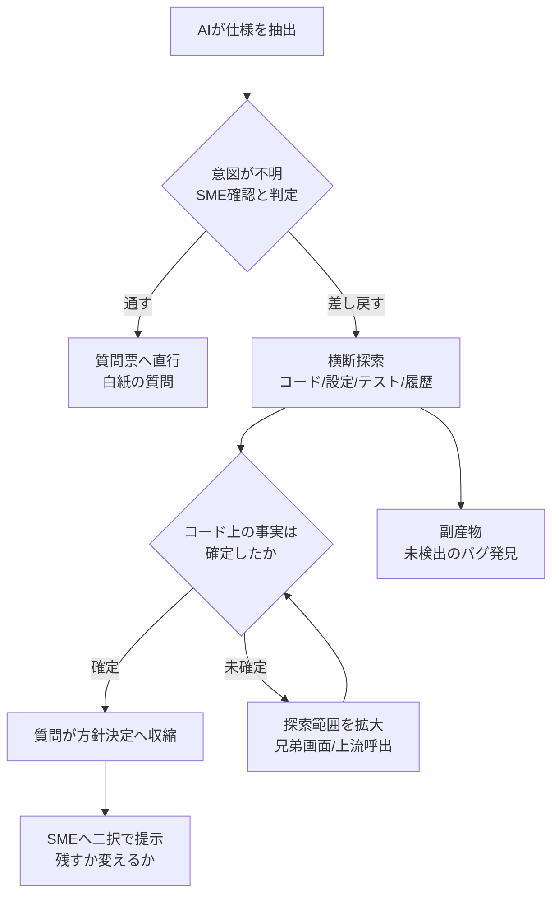

*この記事の全体像。以下、順に解説します。*

## この記事で扱うこと

レガシーシステムをAIエージェントに解析させると、仕様抽出の途中で必ずこの出力が出ます。

> この項目の意図が不明です。業務有識者（SME）に確認してください。

このエスカレーションを、そのまま人間への質問票に積み上げるプロジェクトは多いはずです。しかし実測してみると、その多くは「人間にしか答えられない質問」ではなく、**AIの探索がまだ足りていないだけ**でした。

この記事では次を扱います。

- 「SMEに聞け」の何割が、実はコード内で決着するのか
- 決着させるための証拠源と、探索の順序・終了条件
- コードと画面の見え方が矛盾したときの裁定ルール
- それでも人間に聞くべき閾値と、この方針が壊れる条件

対象読者は、レガシーモダナイゼーションのPM・アーキテクト、およびコード解析エージェントを設計する開発者です。

## 「SMEに聞け」は本当に人間しか答えられない質問か

AIが出すSME確認要求には、性質のまったく違う2種類が混ざっています。

| 種別 | 質問の中身 | 誰が答えられるか |
| --- | --- | --- |
| 事実の質問 | 「このボタンはどういう条件で出るのか」「この日付の書式は何か」 | コードが答えを持っている |
| 方針の質問 | 「この挙動を新システムに移植するのか、修正するのか」 | 人間しか決められない |

問題は、AIが前者を後者の形で出力してしまうことです。「意図が不明」という言い方をされると、人間は業務要件を聞かれていると受け取ります。しかし実際には、AIが当該ファイルの周辺しか読んでいないだけ、というケースが少なくありません。

ここを分けずに質問票へ積むと、SMEの時間が事実確認に消えます。890件の不明点があり、1件5分のヒアリングで潰すとすると、**約74時間**の拘束です。しかもSMEの回答は記憶と推測に依存するため、必ずしも正確とは限りません。

## 12件が全件コードで決着した実例

Zenn記事「[AIは12回『人間に聞け』と言った。遺跡に聞き返したら、12回とも答えが返ってきた](https://zenn.dev/egu777/articles/sme-evidence-mifos)」では、マイクロファイナンス管理システム **Mifos** の解析でAIが上げたSME確認要求12件に対し、「まずコードベースを横断探索してから返せ」と差し戻す実験が行われています。

結果は12件すべてが、コードベース内の一次資料だけで確定しました。

| 確認要求の例 | 決着させた証拠 |
| --- | --- |
| 日付フォーマットの仕様 | 実装コード・DDL・データ型定義 |
| 画面ラベル・共通レイアウト | リソースバンドル・タグ実装 |
| 選択値の仕様・空選択肢の有無 | 初期データ・Hibernateマッピング |
| 認証・認可の条件 | 定数定義・設定ファイル・権限の初期データ |
| ボタン表示分岐 | 実装コード・コメント痕 |
| 金額ルール・計算結果の使用 | テストクラス・実装コード |

実測値は次のとおりです。

- 壁時計時間: **約6分**（12件を並列実行）
- API課金: **$19.21**（1件あたり約$1.60）
- 副産物: 12件の調査から、誰も質問していなかった **12件の新規問題**を発掘

この単価を先ほどの890件に外挿すると、探索コストは**約$1,400**です。SMEを74時間拘束する案と比べる対象としては、検討に値する水準だと言えます。

:::message
数値は上記記事1件の実測であり、対象システムの規模・言語・テスト網羅率に強く依存します。自プロジェクトへ持ち込む場合は、まず10件程度のサンプルで「何割が探索で決着するか」を測ってから全体へ広げてください。
:::

## 証拠がどこに埋まっているか

決着した12件を証拠源の種類で見ると、探索すべき場所はコード本体だけではありません。

- **定数・設定データ**: 権限IDの定数定義と、初期投入されるマイグレーションデータの突き合わせ
- **コメントアウトされた旧コード**: 未完リファクタリングの前後比較として機能する。「変更前は何だったか」がそのまま残っている
- **テストコード**: 境界値と受け入れフォーマットが、仕様書より正確に書かれていることがある
- **データモデル**: DDL・ORマッピングが、型と桁と必須性の一次情報になる
- **リソースバンドル・テンプレート**: 画面ラベルや共通レイアウトの正体
- **兄弟画面**: 同じ構造の別画面に、当該画面では消えた実装意図が残っている

要するに「**仕様書がないだけで、一次資料は残っている**」という状態です。仕様書の不在を、事実の不在と取り違えないことが起点になります。

## 探索を先に置くワークフロー

SMEエスカレーションをそのまま通すのではなく、間に「探索による事実確定」という資格審査レイヤーを挟みます。

このフィルターを通すと、SMEへ届く質問の形が変わります。

- 通す場合: 「この項目の業務要件を教えてください」（白紙。SMEが記憶で埋める）
- 差し戻す場合: 「コード上はAでした。新システムでも残しますか、変えますか」（二択。SMEは判断だけする）

後者はSMEの認知負荷と拘束時間が桁で下がります。しかも回答が記憶ではなく事実の上に乗るため、後工程で覆りにくくなります。

## 探索の順序と終了条件

エージェントに差し戻すとき、探索を無制限にすると課金だけが膨らみます。順序と止め方を先に決めておきます。

**探索順序**（安く確実な順）

1. 当該画面・当該クラスの実装コードと、そこから参照される定数
2. データモデル（DDL・ORマッピング）と設定ファイル
3. 初期投入データ・マイグレーション
4. テストコード（境界値・受け入れフォーマット）
5. コメント痕・コメントアウトされた旧実装
6. 兄弟画面・同型モジュールへの範囲拡大

**終了条件**

- 「事実はどうなっているか」が確定した時点で止める
- 「なぜそうなっているか（WHY）」を探しに行かない。これはコードに書かれていないことが多く、探索が発散する
- 範囲を1段拡大しても新しい証拠が出なければ、未確定として人間へ回す

つまり終了条件は「答えが出たら止める」ではなく、**「事実が確定したら止める。理由の探索へは進まない」**という線引きです。

## コードと見え方が矛盾したときの裁定

探索していると、AIの推測やユーザーの証言とコードが食い違う場面が出ます。

例として、ある画面の保存ボタンがオレンジ色で表示されており、AIは「業務エラーまたは権限不足の警告表示ではないか」と推測しました。しかしコードとDBの権限設定を横断すると、**全ユーザーで常時オレンジ色**、すなわちシステム全体の装飾でしかなかった、という結末になります。

同じ質問をSMEに投げていたら「権限がない人への警告です」という、もっともらしい誤答が返ってきた可能性は十分にあります。

裁定ルールは単純です。

> コード上の挙動を正とし、推測・記憶による説明を上書きする。

ただし後述のとおり、これは**コードと実運用が一致している前提**の上に立ったルールです。

## SMEへ切り替える閾値

すべてを探索で潰せという話ではありません。切り替える閾値は明確に置けます。

> **コード上の事実が確定し、残った論点が「この仕様を新システムへ移植するか、修正するか、凍結するか」という方針決定に絞られた時点。**

この時点で、質問は「機能の仕組み」から「意思決定」へ変わっています。ここから先はコードを何時間探しても答えが出ません。人間の裁定領域です。

逆に言えば、**方針決定の形になっていない質問がSMEへ届いているうちは、探索が不足している**というシグナルになります。質問票のレビュー基準として使えます。

## この方針が壊れる条件

コード至上主義には明確な限界があります。次のケースでは、探索フィルターだけに頼ると事故になります。

**1. 運用でカバーされている処理がある**

手作業パッチ、DB直接操作、Excelでの事前加工などが常態化していると、コード上の正解が実運用と乖離します。コードは「システムがやっていること」しか語らず、「人がやっていること」は語りません。

**2. バグが実質的な仕様になっている**

現場が回避策込みで業務を組み立てている場合、AIが「論理的におかしい」と判定して正しく直すと、既存の業務フローが破綻します。探索で見つけた不整合は、修正候補ではなく**確認候補**として扱うのが安全です。

**3. デッド機能への全探索**

数年使われていない機能に真面目な横断探索をかけると、課金と時間だけが消えます。ここはSMEに先に「アタリ」を聞くほうが圧倒的に安く済みます。

**4. 暗黙知は補完できない**

なぜその仕様になったのか、業界規制や取引先都合といった背景は、コードに存在しません。WHYは人間から取るしかありません。

したがって現実解はハイブリッドです。

| 工程 | 担当 | 内容 |
| --- | --- | --- |
| 初期の枝刈り | SME | 使っている機能・使っていない機能の粗いマッピングのみ |
| 事実確定 | AI探索 | 生きている範囲に限定して横断探索 |
| 方針決定 | SME | 提示された事実に対し、残す・変える・凍結するを裁定 |

SMEの投入を「最初の枝刈り」と「最後の裁定」の2点に絞る形です。中間の事実確定だけをAIへ寄せます。

## 明日から試す3ステップ

1. **サンプル10件で決着率を測る**
   直近の質問票からSME確認要求を10件抜き、「コード・設定・テスト・履歴を横断してから答えよ」と差し戻します。何割が事実確定に至るか、1件あたりのコストと時間を記録します。
2. **エージェントに探索ステップを組み込む**
   SME確認フラグが立った時点で、上記の探索順序を自動実行するステップを追加します。範囲拡大は「兄弟画面まで」など上限を明示し、無限探索を防ぎます。
3. **裁定台帳を作る**
   確定した事実と、SMEが下した方針（残す・変える・凍結する）の組をレコードとして残します。後続の同種案件で、そのままコンテキストとして再利用できます。

なお、探索の過程で出てくる新規バグの発見は副産物ではなく、実は主要な戻りの一つです。実測では12件の調査から12件の新規問題が出ています。この扱い先（起票するのか、移行対象外として凍結するのか）も、台帳の設計時に決めておくと後で困りません。

## まとめ

- AIの「SMEに聞け」には、事実の質問と方針の質問が混ざっている。前者は探索不足のシグナルとして扱う
- Mifosの実測では、SME確認要求12件が約6分・$19.21ですべてコード内で決着した。証拠は定数・初期データ・テスト・コメント痕・リソースバンドルなどに分散している
- SMEへの質問は「白紙の要件確認」ではなく「事実Aに対し残すか変えるか」の二択へ収縮させる。これが切り替えの閾値
- 探索は「事実が確定したら止め、WHYは追わない」。終了条件を先に決めないと課金が発散する
- コードと実運用が乖離するケース、バグが仕様化しているケース、デッド機能では成立しない。初期の枝刈りと最終裁定は人間に残すハイブリッドが現実解

仕様書がないことと、事実が残っていないことは別です。まず遺跡に聞き返してから、人間の時間を使ってください。

この記事が少しでも参考になった、あるいは改善点などがあれば、ぜひリアクションやコメント、SNSでのシェアをいただけると励みになります！

## 参考リンク

- [AIは12回「人間に聞け」と言った。遺跡に聞き返したら、12回とも答えが返ってきた](https://zenn.dev/egu777/articles/sme-evidence-mifos) - 本記事が参照した12件の実測、証拠種別、コスト内訳
