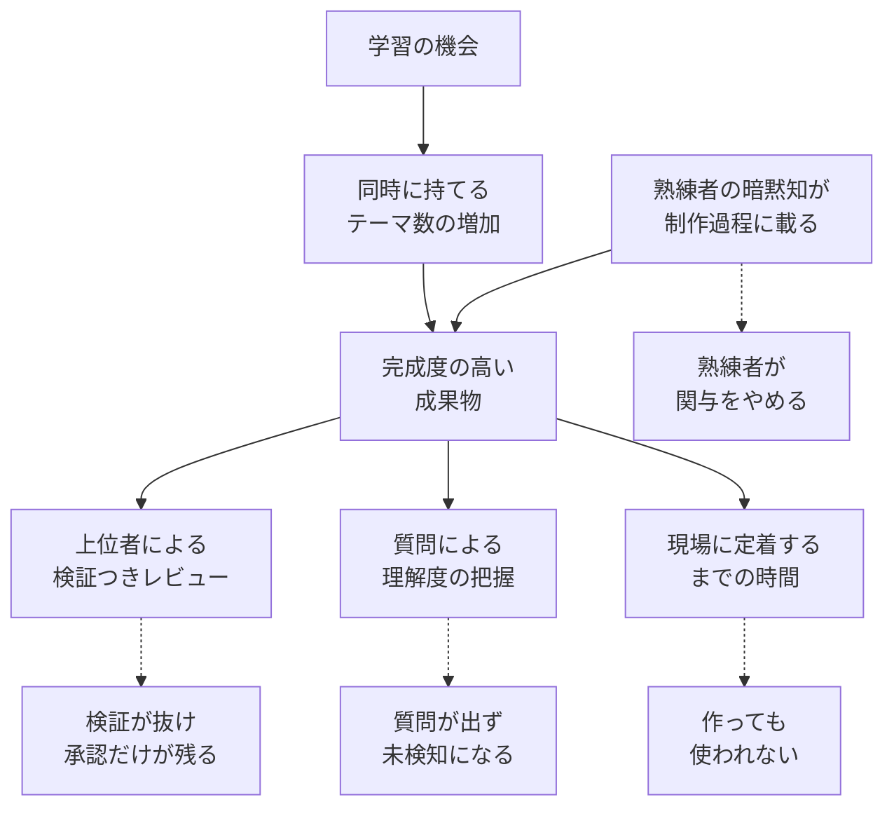
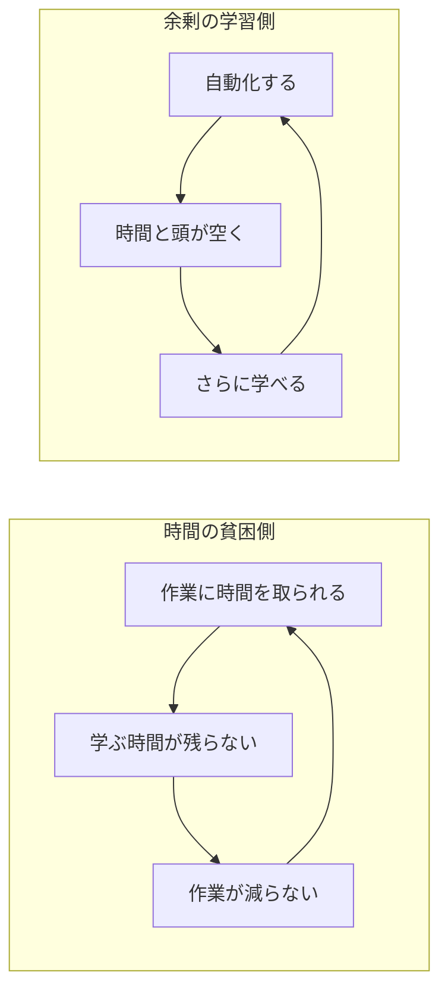

AI を配ったチームで、個人が抱える案件数は増えたのに、組織としての成果が動かない。この記事は、その現象を「レビューが検証を失う」「熟練者の暗黙知が制作過程から外れる」という 2 つの断絶として整理し、公開されている観測データと公式調査でどこまで裏づけられるかを検証します。

対象読者は、AI 導入の投資判断とその効果測定を担う立場の方です。読み終えたときに手元へ残るのは、個人の体感倍率に代わる 4 つの測定対象と、その測定をやめてよい逆転条件です。

出発点にしたのは、製造業 DX 部門のマネージャーが公開した実践記録
[AIで生産性が3倍になった私たちが、チームを置き去りにした話](https://zenn.dev/factory_dx_eng/articles/ai-productivity-team-divide)
（Zenn、2026-08-19 公開）です。著者自身の観察であり社外監査は入っていませんが、失敗の経路が具体的に書かれているため、検証の足場として使えます。

*この記事の全体像。以下、順に解説します。*

## 「3倍」が指していたのは速度ではなく並列件数

この実践記録の「3倍」は、作業速度の測定値ではありません。報告資料が頭を占有する期間が 1 週間から 1 日になった結果、**同時に持てるテーマ数が増えた**という体感です。工数ログによる独立測定はありません。

ここを取り違えると、その後の議論がずれます。速くなったのは個人の着手能力であり、成果物が組織の意思決定に反映されるまでの経路は、何も速くなっていません。

METR の自己申告調査（2026-05-11、n=349）は、この落差を数字で示しています。回答者が申告する**速度**の中央値は 3 倍、**価値**の中央値は 1.4〜2 倍でした。著者は「速度は価値を過大に見積もらせる」と注意しています。同じ 3 倍という数字が、実践記録では同時テーマ数、調査では速度の自己申告を指しており、いずれも組織価値が 3 倍という主張ではありません。

## 個人の出力が増えたとき、どこで線が切れるか

個人の出力増が組織能力になるまでの経路と、切れる箇所を整理します。

実践記録が報告している断絶は、この 4 本です。

- **上位者から本人へのレビューが承認だけになる**。上司は誠実で、公の場でギャップを認めて質問を促していました。それでも「正しいと思う」は信頼であって検証ではない、と著者は後から解釈しています。
- **完成度が理解度の検知器として働かなくなる**。若手の報告は破綻しませんが、自分の言葉になっていない場面が増えます。検知は質問へ移りますが、質問には恥の副作用が伴います。
- **熟練者が静かに降りる**。不良の因果や工程パラメータを持つ層の反応は、驚きではなくあきらめでした。質問が出ないこと自体が、その可視化でした。
- **作る時間と定着する時間が分離する**。集計アプリは 3 時間で完成し、OJT はほぼ省略されました。1 ヶ月後の次サイクルまで誰も触らず、結果として業務ごと移管されました。

もう 1 つ、格差を自己強化する構造があります。

学習を業務時間外に置いた設計では、この 2 つのループが同じチームの中で同時に回ります。

## テレメトリと公式調査が示す乖離

個人の観察をそのまま一般化はできません。規模の大きい観測データで、同じ形が出るかを確認します。

### 個人の出力増とレビュー負荷

Faros の分析（2025-06 公開、1,255 チーム・1 万人超のテレメトリ）では、AI 採用が高いチームでタスク完了 +21%、マージ済み PR +98% でした。同時に PR レビュー時間 +91%、平均 PR サイズ +154%、開発者あたりバグ +9%。そして**会社レベルではスループット・DORA 指標・品質 KPI に有意な改善相関が出ていません**。開発者は 1 日あたりより多くのタスクに触れ、役割がオーケストレーションへ寄る、という記述は、実践記録の「同時テーマ数が増える」と構造が同じです。

続く 2026 年の分析（2.2 万人・4,000 チーム）では、PR サイズ +51%、PR あたりバグ +28%、レビュー時間の中央値 +441.5%、PR あたりインシデント +242.7%、コード churn +861% が報告されました。無レビューでのマージも増えたとされています。

限界は明示しておきます。いずれもベンダーによる観測で、AI 割当の実験ではありません。レビュー時間の増加は「より丁寧に見るようになった」でも起こります。標本と定義が年で変わるため、2025 年の +91% と 2026 年の +441.5% を同じ物差しで並べるのも危険です。

### デリバリ性能の年次調査

| 調査 | スループット | 安定性 | 補足 |
|---|---|---|---|
| DORA 2024 | −1.5% | −7.2% | AI 採用 25% 増の推計。ドキュメント品質 +7.5%、コード品質 +3.4%、レビュー速度 +3.1%。39% が生成コードをほとんど信頼しない |
| DORA 2025 | 正の関係へ転換 | 負の関係は継続 | 約 5,000 人 + 100 時間超の定性。採用 90%。30% が生成コードをほとんど信頼しない |

読み方は 2 段です。**「個人が速くなったつもり」と「安定して出し続けられる」は別の変数**である、という点で実践記録の懸念は支持されます。一方、2025 年にスループットの相関が反転したことは、「レビュー帯域の不足が組織成果を永久に殺す」という強い形を弱めます。DORA 2025 の表現は「AI はチームを直さず増幅する」であり、既存の設計が悪ければ悪化を、良ければ改善を拡大するという読みです。

### 体感と実測のずれ

METR の RCT（2025-07、経験のある OSS 開発者 16 人・246 タスク）では、AI 利用可の条件で完了時間が **+19%** でした。事前予想は 24% 短縮、事後の実感も 20% 短縮です。著者は代表性を主張していません。加えて METR は 2026-02-24 に、この実験デザインは古く、後期の試行では AI なし作業の拒否が増えて選択バイアスが入る、と自ら警告しています。

したがってこの結果は「AI は遅くする」という結論には使えません。使えるのは、**体感の方向と実測の方向が一致しない場合がある**という一点です。効果測定を自己申告だけに置くと、この差はそのまま経営判断へ流れ込みます。

## 完成度の高い成果物は理解の証明にならない

実践記録の中で、経営にとって最も扱いにくいのは「破綻していない報告」です。ここは実験でも裏づけがあります。

BCG のコンサルタント 758 人を対象とした Dell'Acqua ら（HBS WP 24-013）では、AI が得意な範囲の 18 タスクで完了率 +12.2%、速度 +25.1%、品質は working paper で 40% 超の改善（査読版は 30% 超）。底上げは平均以下の層で +43%、平均以上でも +17% でした。一方、**AI が苦手な範囲のタスクでは正答率が 19 ポイント低下**しました。短いプロンプト指南を渡しても、この範囲外の失敗は救えていません。

つまり、出てきた成果物の見た目の完成度は、担当者の理解度も、内容の正しさも保証しません。上位者のレビューが承認だけになった状態は、この誤りが素通りする経路そのものです。

## 格差が縮む条件は「熟練知が共同作業に残るか」

AI が差を広げる方向にしか働かないわけではありません。逆向きの一次証拠があります。

Brynjolfsson、Li、Raymond によるカスタマーサポート約 5,000 人の準実験では、1 時間あたり解決件数が **+13.8%**（NBER Digest 要約。査読版の Quarterly Journal of Economics 2025 では平均 +15%、n=5,172）。効果は一様ではなく、**低スキル層と未経験層で +35%**、勤続 2 ヶ月かつ AI ありが、AI なしの勤続 6 ヶ月と同等の水準に達しました。熟練者への効果はゼロから小さな負でした。

ここで働いたメカニズムは、高パフォーマーの対話がモデルへ入り、その型が新人へ伝播したことです。実践記録の現場はこの逆で、暗黙知の持ち主が場から降りています。**圧縮が起きる条件は「熟練者の判断が学習データか共同作業に残っていること」**であり、この条件が満たされないなら、底上げは起きません。逆に言えば、サポート業務での底上げをもって製造 DX のレビュー不全を否定することもできません。

## AI だけが原因ではない: 実装の失敗として読む

構造の必然と、実装の失敗は分けて扱う必要があります。実践記録の失敗は、次の実装でも説明がつきます。

- 学習を業務時間外に置いた
- 配布物はマニュアルだった
- OJT を省略した

DORA の別調査（2025-01-31、n=1,000、ベイズ推定）は、業務時間内の探索を徹底したチームで、**チーム作業のうち AI が支える割合が全く探索しないチームより +131%** という関係を報告しています。資料提供だけでは足りず、積極的な奨励は +27%、必須研修は小さな増加にとどまり、DORA 自身が持続可能とは考えていないと書いています。これは因果を確定する実験ではなく、また採用人数が 131% 増えるという意味でもありません。

もう 1 点。Zenn のコメントでは、共有の単位をアプリの GUI ではなく Excel とメールへ寄せる提案が出て、著者は「GUI の操作知識は応用が利かない」として受け入れています。全員が同じコーディングエージェントを覚える以外の経路があるということです。底上げを研修と同一視する読み方は狭すぎます。

そして質問が出ない場は、AI 以前からあります。著者は、自分が内輪で浅い発言を追及しており、質問が出る場を壊す側にいたと自己診断しています。この記録の正確な主張は「AI が原因」ではなく、**AI は既存の失敗モードを安価に量産する**です。

## 発注者・経営が測る 4 つの指標

以上を踏まえると、AI 導入の効果測定から外すべき指標と、足すべき指標がはっきりします。

| よく使われる指標 | 実際に測れているもの | この問題での欠陥 |
|---|---|---|
| 個人の体感倍率、同時案件数 | 頭の占有からの解放 | レビュー不能な成果物を増やしても上がる |
| PR 数、資料枚数、アプリ本数 | 出力の流速 | レビュー待ちと無レビュー合流を隠す |
| 研修受講数 | 接触の有無 | マニュアル既読は定着ではない |

代わりに測る対象は 4 つです。いずれも既存の KPI 体系には入っていないため、測定設計から作る必要があります。

1. **レビュー帯域**。成果物が増えたあとで、検証つきのレビューが何件成立したか。承認だけで通った件数を別に数えます。ソフトウェア開発の「レビュー無しマージ」に相当する経路を、自部門の言葉で定義します。
2. **理解可能性**。途中成果、判断根拠、用語、検証方法を、AI を使っていない上位者や熟練者が追えるか。成果物の完成度とは別に、担当者が自分の言葉で説明できるかを独立したゲートにします。
3. **定着リードタイム**。作る時間と、使われるまでの時間を分けて計測します。前者が短縮しても後者が人間の時間のままなら、ボトルネックは開発工程ではありません。
4. **暗黙知の接続件数**。例外ルールと失敗の因果が、制作過程に何件載ったか。モデルへ入れるか隣で共同作業するかは手段の違いで、載らないなら新人の底上げは起きません。

測定と併せて、運用側で決めることが 3 つあります。学習機会を業務の仕組みに組み込むこと（業務時間外の学習を前提にしない）、最も詳しい人が講師役を独占しないこと（質問が成立する場を教材より先に作る）、そして既存の道具のまま中身だけ自動化する経路を教育と並列で持つことです。

## 逆転条件と明日からの 3 手

上の測定は、常に必要なわけではありません。次の 4 つが揃っている組織では、優先度を下げてよい判断材料になります。

- 成果物の流速がレビュー可能な単位に制御されている
- 熟練者の判断ログが共同作業かモデルに残り、新人へ伝播している
- 上位者が検証のための質問を成立させられる共通言語がある
- 定着が開発と同じ時間スケールで起きている

4 つ目まで揃わない場合の着手順はこうなります。

1. AI 導入の KPI から「個人の体感倍率」を外し、レビュー成立件数と定着日数を足す。
2. 推進者が出す成果物に、判断根拠と検証手順の短い付録を必須にする。完成度の高い本編だけを報告会に出さない。
3. 熟練者の例外ルールを、アプリ化の前に隣で 1 サイクル一緒に回す。OJT の省略を実験と呼ばない。

なお、この論点は個別の現場に限りません。グロービス学び放題の公式リリース（2025-05-12、30 代主任以上 n=331）では、「メンバー間での AI 活用スキルや知識の格差」が課題の 1 位で 35.7% でした。個票と調査票は未確認のため、傍証として扱います。

## 残っている不確実性

断定を避けるべき点を明示します。

- 実践記録の「3 倍」「1 年の差」には独立した測定がありません。
- 著者が始めたハンズオンの結果は未公表です。隣で共同作業する設計がレビューを回復させたかは不明です。
- 製造業の間接部門で、レビューを壊さずに個人の出力増を組織成果へ変えた一次ケースは、今回の調査範囲では見つかりませんでした。
- DORA 2025 のスループット反転と、Faros 2026 の品質悪化が、同じ現象の別断面なのか別標本なのかは未決です。
- ソフトウェア開発にはコードとレビューという共通言語があります。実践記録の著者は、製造業の間接部門には最初からそれが無い、と区別しています。この非対称性は、ソフトウェア業界のテレメトリをそのまま持ち込むときの制約になります。

## まとめ

AI で個人の出力が増えても組織成果が伸びないのは、ツールの習熟度の問題ではありません。切れているのは、**成果物を検証できる人が流速に追いつけているか**と、**熟練者の判断が制作過程に残っているか**の 2 本です。Faros のテレメトリは個人出力の増加と会社レベル KPI の無相関を、DORA はスループットと安定性の非対称を、HBS の実験は見た目の完成度と正しさの乖離を示しています。逆にカスタマーサポートの準実験は、熟練知がモデルと共同作業に残れば格差が縮むことを示しています。

したがって経営が宣言すべきは処理量ではなく、レビュー成立件数、理解可能性のゲート、定着リードタイム、暗黙知の接続件数です。学習を業務時間外に置いた設計と OJT の省略は、構造の必然ではなく実装の選択であり、選び直せます。

この記事が少しでも参考になった、あるいは改善点などがあれば、ぜひリアクションやコメント、SNSでのシェアをいただけると励みになります！

## 参考リンク

- 現場と一緒に作るDX「AIで生産性が3倍になった私たちが、チームを置き去りにした話」Zenn、2026-08-19: https://zenn.dev/factory_dx_eng/articles/ai-productivity-team-divide
- 同「工場データの文脈はAIに渡せない」Zenn: https://zenn.dev/factory_dx_eng/articles/claude-data-comp-winner
- Faros「The AI Productivity Paradox Research Report」: https://www.faros.ai/blog/ai-software-engineering
- Faros「The Acceleration Whiplash」AI Engineering Report 2026: https://www.faros.ai/research/ai-acceleration-whiplash
- Nathen Harvey、Derek DeBellis「Highlights from the 10th DORA report」Google Cloud、2024-10-23: https://cloud.google.com/blog/products/devops-sre/announcing-the-2024-dora-report
- Nathen Harvey、Derek DeBellis「Announcing the 2025 DORA Report」Google Cloud: https://cloud.google.com/blog/products/ai-machine-learning/announcing-the-2025-dora-report
- DORA「Helping developers adopt generative AI」2025-01-31: https://dora.dev/insights/adopt-gen-ai/
- Becker、Rush、Barnes、Rein「Measuring the Impact of Early-2025 AI on Experienced Open-Source Developer Productivity」METR、2025-07-10: https://metr.org/blog/2025-07-10-early-2025-ai-experienced-os-dev-study/
- METR「We are Changing our Developer Productivity Experiment Design」2026-02-24: https://metr.org/blog/2026-02-24-uplift-update/
- Joel Becker「Measuring the Self-Reported Impact of Early-2026 AI on Technical Worker Productivity」METR、2026-05-11: https://metr.org/blog/2026-05-11-ai-usage-survey/
- Brynjolfsson、Li、Raymond「Generative AI at Work」NBER WP 31161、Digest: https://www.nber.org/digest/20236/measuring-productivity-impact-generative-ai
- Dell'Acqua et al.「Navigating the Jagged Technological Frontier」HBS WP 24-013: https://www.hbs.edu/ris/Publication%20Files/24-013_d9b45b68-9e74-42d6-a1c6-c72fb70c7282.pdf
- グロービス学び放題「若手リーダーが部下に感じる『知識の格差』」公式リリース 2025-05-12: https://globis.co.jp/news/elearning/11437-2025-05-12/
