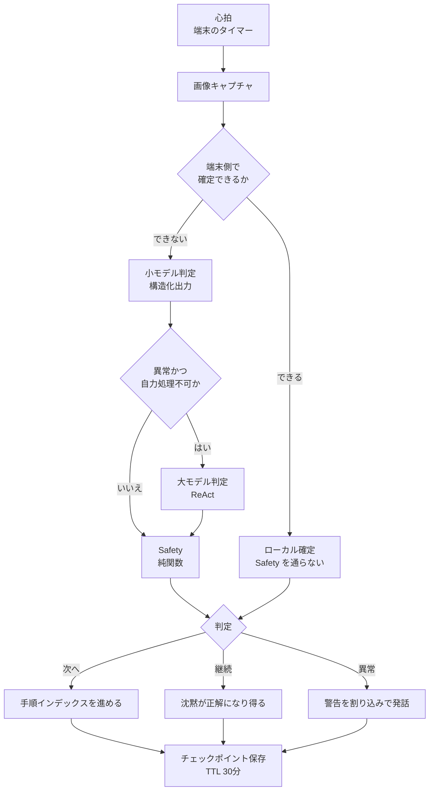
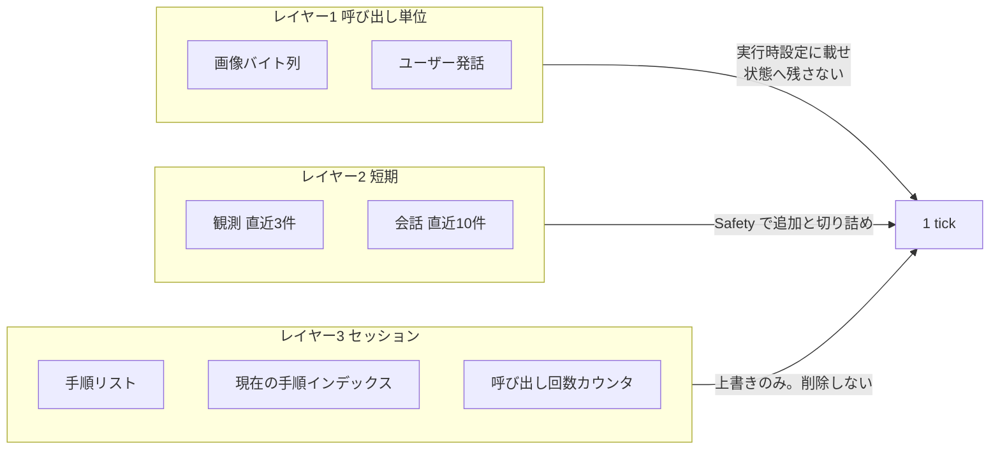

チャット型のエージェントは、ユーザーの入力が心拍です。黙れば止まります。ところがカメラを数秒おきに撮り続けるエージェントは、誰も何も言わなくても心拍が打ち続けます。その瞬間に、観測回数・状態のサイズ・発話回数・API コスト・「次の手順へ進めてよいか」という判断が、モデルの気分で増えはじめます。

この記事では、hosaka2 氏の [自律エージェントを実装すると、決めることになる項目](https://zenn.dev/hosaka2/articles/4e4b868c68c07a) と、その実装である [hosaka2/guidey](https://github.com/hosaka2/guidey)（料理や DIY をカメラで見守り、音声で案内するエージェント）を突き合わせて、次を整理します。

- ユーザー入力が消えると、具体的に何が無制限に増えるのか
- 増殖を止める判断を、モデルの内側と外側のどちらに置くべきか
- その判断を自分の常駐エージェント基盤へ写すとき、何を採って何を捨てるか

結論を先に書きます。**採るのは決定の一覧で、閾値のコピーではありません。** 観測間隔・状態の寿命・発話の抑制・停止条件・利用上限は、いずれもモデルの外側へ出す必要があります。この問題設定は正しく切られています。一方で、実装のほうは「設定ファイルに書いただけで判定に使われていない上限」を抱えていて、参照実装として丸ごと写せる完成度ではありません。

:::message
本文中のコード・メタ情報の確認はすべて 2026-08-31 時点の公開リポジトリにもとづきます。star 数や最終 push 日は変動します。
:::

*この記事の全体像。以下、順に解説します。*

## 心拍がタイマーになると、何が無制限になるのか

チャット型と無操作ループの違いは「賢さ」ではなく、増加が何に比例するかです。

| 増えるもの | チャット型 | 無操作ループ | Guidey が外側に置いたもの |
|---|---|---|---|
| 観測回数 | ユーザーの打鍵に比例 | タイマーに比例し、上限がない | 変化がなければ間隔を延ばす適応サンプリング、15 tick で停滞検知 |
| 状態サイズ | 数十ターンで頭打ちになりやすい | 画像を入れると数百 MB 規模まで伸びる | 画像を状態に入れない。呼び出し単位の設定へ逃がす |
| 発話 | 応答が 1 対 1 | 毎 tick 喋ると作業の邪魔になる | 空メッセージを許す。会話中は定期発話を落とし、警告だけ割り込む |
| 進行 | 人が「次へ」を確認できる | 判定がそのまま作業を進める | 最短滞在時間 15 秒、最終手順での停止、危険語アラート |
| コスト | 対話回数に比例 | 小モデル呼び出しが数百回 | 小モデルを端末側へ、大モデルを条件付きへ。ただし上限値は未配線 |
| 停止 | ユーザーが黙れば止まる | 止まらない | 稼働フラグ、セッション TTL 30 分、クライアント側の中断 |

右端の列が本題です。左の 2 列は性質の説明にすぎず、設計の余地はありません。**設計とは、右端の列に何を並べるかを決めることです。**

なお、記事は「30 分 × 3 秒間隔 ≒ 600 回」という見積もりを置いています。これは間隔を 3 秒と仮定したときの上限であって、現行実装の実測ではありません。モバイル側の基準間隔は 10 秒（`BASE_INTERVAL_MS = 10000`）なので、同じ 30 分なら 180 回程度が基数になります。桁は変わりませんが、**この種の見積もりは実装値と乖離しうる**前提で読む必要があります。

## 無操作ループは「見る・決める・出す・残す」の4段

処理を 4 段に分けると、モデルが握ってよい範囲がはっきりします。モデルの担当は「見る」の一部だけです。

判定は `continue` / `next` / `anomaly` の 3 値で、迷ったら `continue`（現状維持）に落ちます。無操作ループでは「何もしない」が既定の正解になるので、この 3 値化そのものが設計判断です。

以降、この図の分岐に対応する 3 つの決定を順に見ます。

## 決定1: どこまで小さいモデルに任せるか

Guidey は 2 段構成です。常時動くのが小モデル（Gemma 系、構造化出力）で、条件を満たしたときだけ大モデル（Claude、ReAct）へ上げます。エスカレーション条件は `_should_escalate` にあります。

- 小モデルが `can_handle=true` と答えたら、大モデルへ上げない
- 定期観測の経路では、さらに判定が `anomaly` のときだけ上げる
- ユーザー発話の経路では、`can_handle=false` なら上げる

定期観測は速度優先で、`continue` と `next` を小モデルの側で確定します。**ここが誤認識の増幅口です。** 小モデルが自信を持って `next` を返した場合、構造上どこも拾えません。記事の著者自身も、これを捨てた前提として明記しています。

では自己申告の信頼度をゲートにすればよいのか。論文の側は分岐しています。

- Xiong ら（[ICLR 2024, arXiv:2306.13063](https://arxiv.org/html/2306.13063)）は、言語化された信頼度が過信寄りで、値が主に 80〜100% に張り付くと報告しています。この分布なら `confidence < 0.5` という条件はほとんど発火しません
- Chuang ら（[arXiv:2502.04428](https://arxiv.org/html/2502.04428v1)）は、小規模モデルの言語化信頼度がルーティング判断に弱いと測定しています
- 逆に Tian ら（[EMNLP 2023, arXiv:2305.14975](https://arxiv.org/abs/2305.14975)）は、ChatGPT / GPT-4 / Claude では言語化信頼度がトークン確率より校正が良い場合があり、TriviaQA で ECE が相対的に半分程度になると報告しています。ただし対象は事実 QA に限られます

したがって「信頼度は常にモデルの外へ出せ」は過剰一般化です。実務的な線引きはこうなります。**小モデルを常時走らせる層では Xiong / Chuang 側を前提に置き、上位モデルへ同じ閾値を流用しない。** Rabanser ら（[arXiv:2502.19335](https://arxiv.org/html/2502.19335v1)）はさらに踏み込んで、カスケードの本命はプロンプト設計ではなく小モデル側の校正を fine-tune することだと主張しています。

判断基準としてはこう置けます。

- 小モデルの自己申告は、**発話の抑制**（黙るかどうか）のゲートには使ってよい
- **進行**（作業を次へ進める）のゲートには単独で使わない
- 進行を止める条件は、確率的でない別の層に持たせる

## 決定2: 状態に何を残すか

LangGraph のチェックポインタは、super-step ごとに状態全体を書き出します。公式の Persistence ドキュメントは、長いスレッドでチェックポイントが無制限に増えることを明記しています。LangChain のサポート記事はさらに具体的で、画像や PDF を状態に入れるとチェックポイントが膨張してメモリエラーに至るため、外部ストレージへ置いて参照だけを持つよう勧めています。

Guidey はこれに沿って、データを寿命で 3 層に切っています。

実装上の要点は 2 つあります。

第一に、画像は状態ではなく実行時設定（`config.configurable`）に載せます。1 tick で使い切り、チェックポイントには残しません。第二に、短期メモリの追加（append）と切り詰め（trim）を、`safety` という同一ノードで行います。追加と削除が別の経路に分かれると、片方だけ通る実行が生まれて上限が崩れます。**同じノードに閉じることが上限の保証になります。**

代償は再現不能性です。誤判定した画像が残らないため、あとから評価セットを組めません。開発モードで状態の外へ退避する仕組みが別に必要になります。もうひとつの代償は文脈の幅で、直近 3 件より前の観測は構造的に落ちます。「さっき混ぜたやつ」のような発話は拾えません。

なお記事が「呼び出しの第一引数を `None` にすると汚染経路が消える」と書いている箇所は、実装では `{}` が渡されています。コード側のコメントには「`None` だと終了状態から再開しようとして空実行になる」と書かれています。**意図（画像を状態に入れない）は正しく、呼び出しの形は実装が正本**という読み方になります。

## 決定3: 出力をどこまで信じるか

最終判定は LLM ではなく `apply_safety` という純関数が行います。方向は正しいのですが、ルールの順序に穴があります。

1. 次の手順の文言に危険キーワードが含まれると、**`next` を維持したまま return** します。最短滞在時間の検査と最終手順の検査を飛ばします
2. 危険語は列挙（危険 / 火 / 刃物 / 高所 / 電気 / 熱い）です。英語表記や「包丁」は素通りし得ます
3. 手順の開始時刻のパースに失敗すると、滞在時間を **999 秒**とみなします。最短滞在時間が無効になります
4. 潰せるのは「低信頼の `anomaly`」だけです。低信頼の誤った `next` は通ります

1 と 3 は、いずれも**安全側の分岐が安全検査を飛ばす**形になっています。純関数化しただけでは足りず、「早期 return の中に他のガードを含める」か「ガードを直列に固定して早期 return を作らない」かを選ぶ必要があります。

一方、クライアント側の抑制は別レイヤとして実在します。

- 変化なしが 5 回続いたら間隔を 20 秒、10 回で 30 秒に延ばす
- 停滞が 15 回続いたら「大丈夫ですか？」と声をかける
- 会話中は定期観測の発話を落とす（警告だけ割り込む）
- 排他ロックで、定期観測とチャットのリクエストを同時に投げない

**通知の間引きをモデルではなくクライアントに置いた**のは、そのまま採れる判断です。同じ状態が続いているときに黙るかどうかは、モデルの推論結果ではなく状態の差分で決まります。

ただし会話中もキャプチャ自体は止まりません。作業は進んでいる前提だからです。「黙る」と「見るのをやめる」を別の設定として持てているかは、設計を見分ける良い着眼点になります。

## 誤認識が連続行動へ増幅する経路

3 つの決定の穴は、単独では小さく見えます。つながると 1 回の誤認識が固定されます。最短経路を書き出すとこうなります。

1. 小モデルが焼き加減を誤り、`next` と `can_handle=true` を高い信頼度で返す
2. 定期観測の経路なので、大モデルへは上がらない
3. 次の手順の文言に「火」が含まれると、Safety が早期 return し、最短滞在時間も効かない
4. 手順インデックスが進む。原因となった画像は捨てられる
5. 次の tick は、新しい手順の見た目を基準に判定する。ずれが正常として固定される
6. 端末側で確定できる経路に入った場合は、2〜4 のサーバ側 Safety 自体を通らない

チャット型なら、ユーザーが「まだだ」と言えます。無操作ループでは、**次の心拍が誤った世界を真実にします。** 6 番目が特に効きます。安い経路（端末側完結）だけガードを外すと、平常時のほとんどのトラフィックが検査の外を通ります。

## 沈黙を正解とするテストケースを先に書く

無操作ループの評価は、「正しく喋れたか」ではなく「正しく黙れたか」から始めます。正解が「何も言わない・進めない」になる入力を、先にケース化します。

| ケース | 期待する挙動 | Guidey での実装 | 評価に必要な入力 |
|---|---|---|---|
| 変化のない中間フレーム | 継続。メッセージ空、発話なし | 空メッセージなら発話しない | 同一シーンの連続画像 |
| 短い工程の正しい「次へ」 | 進めてよい | 15 秒未満は最短滞在時間で潰れる | 短工程の完了画像と経過秒 |
| 自信の低い異常検知 | 様子見。過剰警報しない | 信頼度 0.5 未満で継続へ落とす | 曖昧なフレームと信頼度 0.4 |
| 会話中の定期 tick | 監視は続け、助言は黙る | 会話モードで発話を抑制 | 発話中フラグ |
| タイムアウトやパース失敗 | 進めない | 大モデルの例外は継続。パイプラインのタイムアウトは未配線 | 遅延と壊れた JSON |
| 最終手順 | 完了を超えて進めない | 最終手順で進行を止める | 最終インデックス |

3 行目と 4 行目は「黙る」の側で、これは実装済みです。2 行目と 5 行目は逆に「黙りすぎ」と「止まらない」で、まだ穴があります。**見逃しと誤警報の比率は、この表を埋めない限り測れません。** そして画像を状態に残さないという決定が、この計測を止めています。設計判断と評価可能性がトレードオフになっている実例です。

## 参照実装として見たときの限界

問題設定の切り方は採れます。完成した参照実装として写すのは早いと考えます。公開コードから確認できた範囲で、限界を挙げます。

**上限が配線されていない** — セッションあたりの大モデル呼び出し上限 30 回、総呼び出し上限 500 回は `config.py` に存在します。しかしグラフ側はカウンタを増やすだけで、上限に達したときに判定する箇所が見当たりません。予算超過を判定するヘルパーも、グラフから呼ばれていません。**設定ファイルに書いた上限は、判定に使われていなければ存在しないのと同じです。**

**ドキュメント同士が食い違う** — タイムアウト値は README と設計ドキュメントで異なり、モバイルの観測間隔も README の記述と実装定数が一致しません。数字を読むときは、どのファイルが正本かを先に決める必要があります。

**停止条件が心拍で無効化される** — セッションの TTL は 30 分ですが、読み取り時に延長する設定（`refresh_on_read=True`）が入っています。定期観測が生きている限り TTL は延び続けるので、「30 分で死ぬ」は発火しません。**常駐そのものが停止条件を打ち消す**構図です。TTL を停止条件として数えるなら、延長設定と併用できません。

**評価ができない** — 画像を保持せず、判定用のラベル付きデータもリポジトリに見当たりません。閾値は「測っていないから守っている」状態で、記事もそれを自己評価として書いています。

**人を最終判断に残す設計が業界には実在する** — 純関数だけで回し切ることが唯一解ではありません。民生の見守りでは、[SimpliSafe の屋外モニタリング](https://techcrunch.com/2024/10/15/simplisafes-new-outdoor-monitoring-service-combines-ai-with-human-agents/)（TechCrunch, 2024-10-15）が、AI をエージェントの補助に限定して人が最終判断を持つ構成を最初から採っています。逆方向の材料として、施設監視のパイロットで大量の誤報と実際の転倒の見逃しが同時に報告された事例が [AI Incident Database の Incident 1109](https://incidentdatabase.ai/cite/1109) にあります（監査本文は未読の二次情報です）。**ゼロ誤報を目標に置くこと自体が誤り**で、誤報と見逃しの比率をどこに置くかの選択になります。

**そもそも運用実績ではない** — リポジトリは star ほぼ 0、コミット 8 本（2026-04-15 作成、最終 push 2026-04-20）です。本番運用の失敗事例ではなく、設計メモに近い位置づけとして読むのが妥当です。

## 自分の常駐エージェント基盤へ写す

筆者は Kestra でエージェントを定期実行する基盤を運用しています。停止とコストをモデルの外に置く部分は、すでに持っています（3 値の終了コード、終端フェーズ、予算、判断に迷ったら止まる既定）。足りないのは **環境心拍** です。人からの入力がないとき、何を 1 tick とし、何をもって黙り、何で止めるのか。

対応関係を書き出すと、写せるものと欠けているものが分かれます。

| 無操作ループ側の要素 | 常駐エージェント基盤での対応 |
|---|---|
| タイマー心拍 | Flow のスケジュール。tick の総回数はどこにも書かれていない |
| 適応サンプリング | 相当物なし。同一状態でも同じ頻度で回る |
| 画像を状態に入れない | 生データは成果物ファイルへ。実行状態には参照だけ |
| Safety 純関数 | 3 値の終了コードと終端フェーズ。ただし進行系アクションは直結しがち |
| 発話の抑制 | 通知は差分のみ。同一状態の連続通知の抑制は未実装 |
| セッション TTL | タイムアウト。心拍で延長される経路がないか要確認 |
| 沈黙の評価 | 「対象なしで正常終了」を成功として数えているか要確認 |

写す順番はこうなります。

1. **心拍を宣言する** — cron でもカメラでも、tick の上限回数をコードで切る。設定ファイルに書くだけでは足りない
2. **進行系アクションを純関数の後ろに置く** — 記事の公開、投稿の予約、手順の進行を、モデルの「次へ」に直結させない
3. **沈黙ケースを先に書く** — 「何もしない」が正解の入力を、成功条件のほうに含める
4. **観測の生データを状態に入れない** — 参照だけ残し、再現用は TTL 付きの別ストアへ
5. **通知をモデルの外で間引く** — 同一状態の連続通知は、クライアントかディスパッチャで抑制する
6. **安い経路にも同じガードを配る** — 端末側や小モデルで完結する経路だけ検査を外さない

逆に、やらないことを 1 つだけ挙げます。**15 秒・0.5・観測 3 件といった数字を、別のドメインへそのまま持ち込むこと。** これらは料理と DIY の見守りで決めた値です。移植するのはチェックリストであって、閾値ではありません。

## 未解決のまま残る問い

判断を保留すべき点も書き残します。

- 小モデルが作業画像で「次へ」を誤る頻度に、公開された数字がありません
- 目標エスカレーション率 5% は設計上の前提で、計測コードの出力ではありません
- TTL の延長設定が入った状態で、見守りセッションをどう終わらせるのが正解かは決着していません
- ストリーミング接続の中断はモバイル側に入りましたが、切断後にサーバ側の実行が続く場合の扱いは評価されていません

いずれも「無操作ループ固有の停止条件」に集まります。ここを埋めない限り、設計は動くが止まらないままです。

## まとめ

- ユーザー入力が消えると、観測回数・状態サイズ・発話・進行・コスト・停止のすべてがタイマー比例になる。設計とは、この 6 つを何でモデルの外から縛るかを決めること
- 小モデルの自己申告した信頼度は、黙るかどうかのゲートには使える。作業を進めるゲートに単独では使えない。校正の研究は上位モデルと小モデルで結論が分かれる
- 状態には呼び出し単位のデータを入れない。追加と切り詰めを同じノードに閉じると上限が保証される。代償は再現不能性で、評価用の退避を別に用意する必要がある
- 最終判定を純関数にしても、早期 return が他のガードを飛ばすと意味がない。安全側の分岐こそ全ガードを通す
- 設定ファイルに書いた上限は、判定コードから呼ばれていなければ存在しない。読み取りで延長される TTL は、常駐では停止条件にならない
- 評価の最初のケースは沈黙。「何もしない」が正解の入力を成功条件に含めてから、見逃しと誤警報の比率を測る

無操作ループを設計するときは、先に「モデルが決めてはいけないもの」の一覧を書く。この記事で見た 3 つの決定は、その一覧の書き出しとしてそのまま使えます。

この記事が少しでも参考になった、あるいは改善点などがあれば、ぜひリアクションやコメント、SNSでのシェアをいただけると励みになります！

## 参考リンク

1. hosaka2「自律エージェントを実装すると、決めることになる項目」Zenn. https://zenn.dev/hosaka2/articles/4e4b868c68c07a
2. hosaka2/guidey（`backend/src/infrastructure/agent/graph.py` / `agent.py` / `backend/src/config.py` / `mobile/features/autonomous/hooks/useAutonomousLoop.ts` / `docs/agent-architecture.md` / `docs/mobile-architecture.md`）https://github.com/hosaka2/guidey
3. LangGraph Persistence. https://docs.langchain.com/oss/python/langgraph/persistence
4. LangChain Support「Understanding checkpointers, databases, API memory and TTL」https://support.langchain.com/articles/6253531756-understanding-checkpointers-databases-api-memory-and-ttl
5. LangGraph Interrupts. https://docs.langchain.com/oss/python/langgraph/interrupts.md
6. Xiong et al. "Can LLMs Express Their Uncertainty?" ICLR 2024, arXiv:2306.13063. https://arxiv.org/html/2306.13063
7. Chuang et al. "Confident or Seek Stronger" arXiv:2502.04428, 2025-02-06. https://arxiv.org/html/2502.04428v1
8. Tian et al. "Just Ask for Calibration" EMNLP 2023, arXiv:2305.14975. https://arxiv.org/abs/2305.14975
9. Rabanser et al. "I Know What I Don't Know" arXiv:2502.19335, 2025-02-26. https://arxiv.org/html/2502.19335v1
10. TechCrunch「SimpliSafe's new outdoor monitoring service combines AI with human agents」2024-10-15. https://techcrunch.com/2024/10/15/simplisafes-new-outdoor-monitoring-service-combines-ai-with-human-agents/
11. AI Incident Database, Incident 1109. https://incidentdatabase.ai/cite/1109
