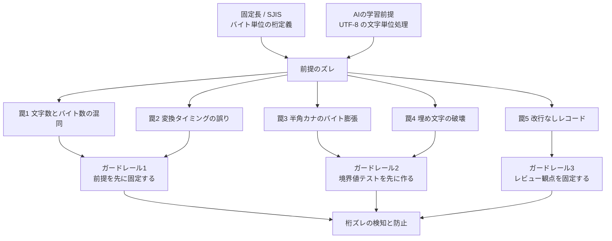

レガシー基幹システムの移行で、固定長・SJIS（CP932）のデータ処理をAIにコーディングさせると、精度が目に見えて落ちます。しかも落ち方が独特です。**ランダムに間違えるのではなく、いつも同じ方向に間違えます。**

この記事では、その「同じ方向」の正体と、AIに推測補完をさせないための3つのガードレールを整理します。想定読者は、固定長ファイルの取込・変換処理をAIに書かせている開発者と、その成果物をテスト・レビューする立場の方です。読み終えると、次の3つが手に入ります。

- AIが構造的に間違える5つの境界値と、その見分け方
- プロンプトで関数を禁止する対症療法が効かない理由
- 実装前に置くべきテストデータと、レビューで疑う場所


*この記事の全体像。以下、順に解説します。*

## なぜAIは「バイト」で間違えるのか

原因は能力ではなく、**学習した世界の前提**にあります。

| | レガシー側の前提 | AIが学習してきた前提 |
|---|---|---|
| 文字コード | SJIS / CP932 | UTF-8 |
| 桁の単位 | バイト | 文字 |
| 半角カナ | 1バイト | 3バイト |
| レコード区切り | 改行なしの連続バイト列 | 行単位 |
| 空白・ゼロ | 意味のある埋め文字 | 除去すべきノイズ |

AIは大量のモダンな実装から学んでいるため、指示が曖昧な箇所を**モダン側の常識で埋めます**。だから誤りが一方向に偏ります。裏を返すと、偏りが分かっていれば先回りできます。



## この領域のバグが厄介な理由

一番の問題は、**テストが通ってしまうこと**です。

開発時のテストデータは、たいてい半角英数字で作られます。半角英数字だけなら「1文字 = 1バイト」なので、AIが書いた文字単位の処理でも桁が合います。テストは緑になり、レビューも通り、本番に出ます。

そして本番データには漢字が入っています。漢字が1文字現れた瞬間、そこから後ろの桁が全部ずれます。氏名の途中が住所欄に流れ込み、金額欄に文字が入ります。しかも例外にならず、それらしい値のまま処理が完了することがあります。

**偽陰性が出やすい**、これがこの領域の本質的な難しさです。だから対策は「AIの書き方を直す」ではなく「**検知できるようにする**」に置くべきです。

## AIが踏む5つの境界値の罠

### 罠1: 文字数とバイト数の混同

桁定義がバイト単位なのに、AIは文字単位の関数を選びます。Oracleなら `LENGTH` / `SUBSTR`（文字単位）と `LENGTHB` / `SUBSTRB`（バイト単位）が別物ですが、AIの既定選択は前者に寄ります。

Pythonでも同じ構図です。

```python
# NG: 先にデコードしてから桁で切る
text = raw.decode("cp932")
name = text[10:30]        # 全角が混じると 10〜30 が「バイト位置」からずれる

# OK: バイトのまま切り出し、切り出した後にデコードする
name = raw[10:30].decode("cp932")
```

後者には副次的な利点があります。桁境界が2バイト文字の途中を割ってしまった場合、`decode` が `UnicodeDecodeError` を送出します。**壊れたデータが静かに通り抜けるのではなく、その場で落ちます。** 桁定義かデータのどちらかが間違っているという事実を、実行時に受け取れます。

### 罠2: 文字コード変換のタイミング

「入力は入口で正規化する」はモダンな設計では正しい原則です。しかし固定長処理では、この原則がそのまま事故になります。

入口でSJISからUTF-8へ一括変換すると、漢字は2バイトから3バイトへ、半角カナは1バイトから3バイトへ膨らみます。桁定義はSJISのバイト長で書かれているので、変換した時点で桁位置は崩壊します。

正しい順序は次の通りです。

```
バイト列で読む → バイト位置で桁を切り出す → 項目ごとにデコードする
```

変換は**必ず切り出しの後**です。AIはこの順序を指示しないと逆にします。

### 罠3: 半角カナのバイト数膨張

SJISで1バイトの半角カナは、UTF-8では3バイトになります。格納先をUTF-8で持つ場合、**文字数基準で列を定義すると長さが足りません**。

たとえば半角カナ20桁の項目をそのまま `VARCHAR2(20)` として定義すると、UTF-8環境では最大60バイト必要になり、格納時に溢れます。Oracleなら `VARCHAR2(20 CHAR)` と `VARCHAR2(20 BYTE)` のどちらの意味かを明示する必要があります。

移行先のスキーマを設計するときは、「元の桁数」ではなく「**変換後に必要なバイト長**」で見積もります。

### 罠4: 埋め文字の破壊

固定長では、右スペース埋め・左ゼロ埋めは**仕様**です。ところがAIは親切心で次のことをします。

- 前後の空白を `trim` する
- 数値項目の前ゼロを取って `int` にする
- 出力時に埋め直すのを忘れる

読み込み時にトリムするだけならまだ復旧できますが、**出力側で埋め直しが抜けると、後続システムが読めないファイルが出ます**。入力の解釈と出力の生成は対になっている、という前提をAIは共有していません。

```python
# 読むとき: 意味のある空白かどうかを仕様で判断する
name = raw[10:30].decode("cp932").rstrip(" ")   # 右スペース埋めの除去は仕様に従う

# 書くとき: 必ず同じ規則で埋め直す（バイト長で揃える）
out = name.encode("cp932").ljust(20, b" ")
```

書き出し側でも、`str` の桁数ではなく**バイト長で揃える**点に注意してください。

### 罠5: 改行・EOF・レコード長の端数

固定長ファイルには改行がないことがあります。AIは行単位の読み込みを既定にするため、改行なしのベタ書きファイルを1行の巨大な文字列として扱ってしまいます。

レコード長で機械的に切る実装にし、端数が出たら**異常として落とす**のが安全です。

```python
RECORD_LEN = 128

def read_records(path: str):
    with open(path, "rb") as f:                 # 必ずバイナリで開く
        while chunk := f.read(RECORD_LEN):
            if len(chunk) != RECORD_LEN:
                raise ValueError(f"レコード長の端数を検知: {len(chunk)} bytes")
            yield chunk
```

端数はファイル破損か桁定義の誤りのサインです。ここを黙って読み飛ばすと、原因追跡が一気に難しくなります。

## 「その関数を使うな」が効かない理由

罠が分かると、まずプロンプトで関数を禁止したくなります。「`SUBSTR` を使うな、`SUBSTRB` を使え」といった指示です。

これは対症療法で、次の理由で破れます。

- 禁止していない別の関数で同じ誤りが起きる（`LENGTH` を潰すと `CHAR_LENGTH` が出てくる）
- 言語やライブラリが変わるたびに禁止リストを書き直す必要がある
- 長い会話の途中で指示が薄まる
- **禁止に従ったかどうかを、レビュー以外で確認する手段がない**

守るべきは書き方ではなく**振る舞い**です。振る舞いを固定できるのはテストだけなので、検証オラクル側に責務を移します。

## 3つのガードレール

### ガードレール1: 前提を先に固定する

案件の指示ファイル（`CLAUDE.md` など）に、案件固有の前提を常設します。会話ごとに書くのではなく、リポジトリに置いて全員・全セッションで共有する点が要点です。

書く項目は次の5つです。

| 項目 | 記述例 |
|---|---|
| 文字コード | 受信ファイルはSJIS（CP932）、DB格納はUTF-8 |
| 桁の単位 | 桁定義はすべてバイト単位。文字単位の関数は使用禁止 |
| 変換位置 | 文字コード変換は桁の切り出し後に行う |
| 埋め文字 | 文字項目は右スペース埋め、数値項目は左ゼロ埋め。入出力とも規則を保つ |
| レコード構造 | 改行なし、レコード長128バイト固定。端数は異常終了 |

そして最後に、この1行を必ず入れます。

> 仕様が不明な箇所は推測で補完せず、実装を止めて確認すること。

AIの誤りの大半は「知らないこと」ではなく「**知らないまま埋めたこと**」から生まれます。止まる許可を与えるだけで、事故の総量が変わります。

### ガードレール2: 境界値テストデータを先に作る（最重要）

実装より前にテストデータを作ります。含めるのは、半角英数字では絶対に検知できないケースです。

1. **2バイト文字が桁境界を跨ぐデータ** — 項目の最終バイトが漢字の1バイト目になる配置
2. **次項目の1バイト目に、前項目の漢字の後半バイトが来るデータ** — ずれが連鎖することを確認する
3. **半角カナを最大桁まで詰めたデータ** — UTF-8変換後のバイト長不足を検知する
4. **意味のある空白・前ゼロを含むデータ** — トリムされていないことを確認する
5. **レコード長の端数があるファイル** — 異常終了することを確認する

この5件があれば、前述の5つの罠は実装者が誰であっても（人間でもAIでも）検知できます。**テストが先にあるという状態は、プロンプトと違って薄まりません。**

### ガードレール3: レビュー観点を固定する

レビューで全体を漫然と読まず、次の3点だけを集中的に疑います。

- **「文字」という語が出てくる箇所** — 変数名、コメント、関数名を含む。桁の話に「文字」が出てきたら要確認
- **`trim` / `strip` / `SUBSTR` の使用箇所** — 仕様上の埋め文字を消していないか
- **文字コード変換の位置** — 切り出しの前か後か

観点を3つに絞ることで、レビューの質が担当者に依存しにくくなります。

## 残る未解決領域: 機種依存文字

ガードレールを敷いても、判断が残る領域があります。**SJISとUTF-8の変換マッピングが処理系依存の文字**です。

代表例が波ダッシュ問題です。SJISの `0x8160` をUTF-8へ変換するとき、`U+301C`（波ダッシュ）に写す処理系と `U+FF5E`（全角チルダ）に写す処理系があります。丸数字などの機種依存文字も同様に揺れます。

ここで重要なのは、**AIに正解を聞かないこと**です。処理系の実装に依存するため、一般論としての正解が存在しません。採用している言語・ミドルウェアの変換関数が、不正バイトや変換不能文字をどう扱うか（例外を投げる／代替文字に置換する／無視する）を、実データで実測して確定させます。

そのうえで、現行システムと新システムの差分を「**許容差異**」とするか「**バグ**」とするかは、技術判断ではなく業務判断です。この線引きを先に合意しておかないと、テスト工程で毎回止まります。

## 明日から着手する3つのこと

1. **既存のテストデータに1件足す** — 稼働中・検証中の取込処理に「桁境界に2バイト文字が来るケース」を1件追加し、いま落ちるかどうかを見る
2. **指示ファイルに前提を常設する** — 上表の5項目と「推測補完せず止まる」の1行を、案件の `CLAUDE.md` へ書く
3. **変換不能文字の挙動を実測する** — 波ダッシュ・丸数字を含むデータを1本流し、自分たちの処理系が何をするかを記録する

いずれも1日で終わる規模です。1つ目だけでも、既存実装の脆さは可視化できます。

## まとめ

- AIは固定長・SJIS処理で**一方向に**間違える。原因は能力ではなく、UTF-8・可変長・文字単位という学習前提のズレ
- 半角英数字のテストデータでは通ってしまうため、**偽陰性**が最大のリスク
- 対策は関数の禁止（対症療法）ではなく、**前提の宣言・境界値テストの先行・レビュー観点の固定**の3点
- 機種依存文字の変換はAIに聞かず実測する。許容差異かバグかは業務判断として先に合意する

この記事が少しでも参考になった、あるいは改善点などがあれば、ぜひリアクションやコメント、SNSでのシェアをいただけると励みになります！

## 参考リンク

- 手順屋 (tejunya) (2026). 「AIが最も間違える領域は「バイト」だ — 固定長・文字コード処理のガードレール設計」Zenn. https://zenn.dev/tejunya/articles/a015_byte-boundary
