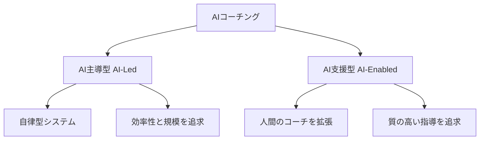
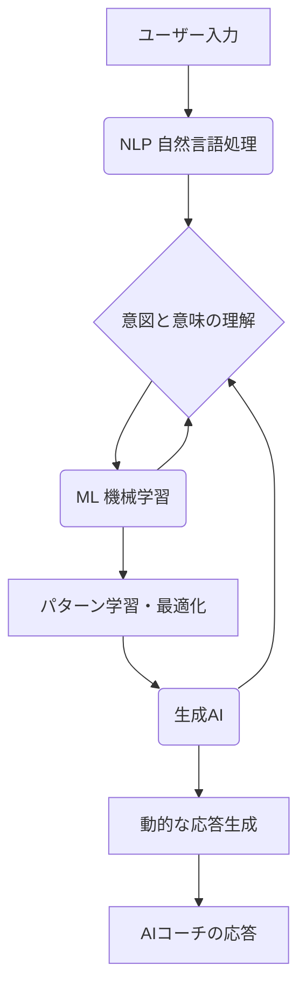

「AIコーチング」という言葉をご存知でしょうか？

近年、人工知能（AI）が私たちの働き方や学び方を大きく変えようとしています。その中でも特に注目を集めているのが、AIが個人の目標達成やスキルアップを24時間サポートする「AIコーチング」です。

かつては一部の経営層などに限られていたコーチングが、AIによってより安価に、より身近になる **「能力開発の民主化」** が始まっています。

しかし、「AIに本当にコーチングができるのか？」「人間のコーチとは何が違うのか？」「導入したいが、効果は実証されているのか？」といった疑問を持つ方も多いかもしれません。

この記事では、AIコーチングの全体像を深く理解したい方、**組織への導入を客観的な根拠をもって検討したい方**、そして個人の成長にテクノロジーをどう活かせるか興味のある方に向けて、基礎理論から、その有効性を検証した最新の研究（人間コーチとの比較）を解説します。

## 第I部 AIコーチングの創生とアーキテクチャ

AIコーチングを理解するための基礎知識として、中核となる概念、システムの類型、そして技術的基盤を解説します。

### 第1章 デジタルコーチの定義

#### 1.1. 中核的定義と適用範囲

AIコーチングは、人工知能技術を使い、個人の成長を支援する手法です。その目的は、人間のコーチの役割をデジタル上で再現、あるいは拡張することにあります。

具体的には、チャットボットなどを通じた対話により、利用者の目標設定、自己内省、行動変容を支援します。これは、タスク処理を目的とするAIアシスタントとは異なり、**能力開発を明確に志向**します。

従来、人間によるコーチングには「時間の制約」や「コストの問題」がありました。AIコーチングは、24時間365日いつでもどこでもサポートを提供し、これらの課題を解決します。

#### 1.2. 重要な類型論：AI主導型 vs. AI支援型

AIコーチングは、その実装形態によって「AI主導型」と「AI支援型」の2つに大別されます。両者は技術だけでなく、その戦略的意図も根本的に異なります。

| 要素名 | 説明 |
| :--- | :--- |
| **AI主導型 (AI-Led)** | 人間の介入なしに、AIがユーザーと直接対話する自律型システム。効率性と大規模な展開（スケーラビリティ）を重視する。 |
| **AI支援型 (AI-Enabled)** | AIが人間のコーチを支援するツールとして機能する。AIがデータ分析やインサイトを提供し、人間のコーチが深い指導を行う。 |

この選択は、組織が「開発を効率化すべきリソース」と捉えるか、「育成すべき才能」と捉えるかという、人材育成の哲学を反映します。

#### 1.3. 価値提案：能力開発の民主化

AIコーチングの最大の価値は、能力開発機会の「民主化」にあります。従来、コストや時間の問題で経営層などに限定されていたコーチングを、より多くの人が利用できるようになります。

  * **コストとスケーラビリティ**
      * 一度開発すれば多数のユーザーに対応可能。
      * 人間によるコーチングより低いコストで運用可能。
      * コーチングを全従業員に拡大可能。
  * **アクセシビリティ**
      * 24時間365日、必要な瞬間に利用可能。
      * 継続的な学習と行動変容の促進。
  * **客観性と一貫性**
      * 常に一定の基準でフィードバックを提供。
      * 感情や体調による質の変動の回避。
      * データに基づいた公平なアドバイスの提供。

### 第2章 技術的エンジン：NLP、ML、そして生成AI

AIコーチングの対話能力とパーソナライゼーションは、主に3つの核心技術によって実現されています。これらの進化が、AIコーチを能動的なパートナーへと変貌させました。

| 要素名 | 説明 |
| :--- | :--- |
| **NLP (自然言語処理)** | 人間の言語をAIが認識・理解・生成する技術。自然な対話の基盤。 |
| **ML (機械学習)** | データからパターンを学習し、応答を改善する技術。個々の利用者に合わせたパーソナライゼーションを実現する。 |
| **生成AI (LLMなど)** | 文脈に応じて新しいコンテンツを創り出す技術。従来のスクリプト型を超えた、動的で人間らしい対話を可能にする。 |

## 第II部 AIコーチングの有効性に関する科学的基盤

AIコーチングが機能する心理学的な理由と、その応用モデルについて解説します。

### 第3章 デジタル介入の心理学的基礎

AIコーチングの有効性は、確立された心理学の理論的枠組みによって支えられています。

  * **目標理論と制御理論**
      * AIは、明確な目標設定、進捗追跡、振り返りのプロセスを体系的に支援することに長けています。
      * ランダム化比較試験（RCT）では、AIコーチングが目標達成度を有意に向上させることが示されています。
  * **技術受容モデル（TAM）**
      * 技術が受け入れられるかは「知覚された有用性（役に立つか）」と「知覚された使いやすさ」によります。
      * AIコーチングの24時間利用可能な利便性は「使いやすさ」を向上させ、継続的な利用を促します。
  * **自己決定理論（SDT）**
      * 人間の内発的動機づけは「有能感（できる）」「自律性（自分で決める）」「関係性（人とつながる）」の3つの欲求に基づきます。
      * AIコーチが利用者に選択肢を与え、自律性を支援する対話を行うと、エンゲージメントが高まることが示されています。

### 第4章 治療・発達モデルにおける革新

AIコーチングは、パフォーマンス向上だけでなく、より深い自己理解や精神的ウェルビーイングの領域にも応用されています。

  * **物語的アイデンティティとポジティブ心理学**
      * 大規模言語モデル（LLM）を用い、利用者が書き出した短い思考から、その人固有の人生の物語や価値観を統合したナラティブ（自分自身の物語）を生成します。
      * このアプローチは、利用者の自己認識を深め、新たな洞察を得る手助けとなります。
  * **認知行動療法（CBT）と拡張された心**
      * AIは「第二の脳（外部の思考支援ツール）」として機能し、人間の認知的な負荷を軽減します。
      * 例えば、日記の記述から「白か黒か思考」のような認知の歪みをリアルタイムで特定し、その場でバランスの取れた考え方を促すことができます。
      * このような即時性の高い介入は、問題となる思考パターンが発生した瞬間に支援を提供できるため、効果的である可能性があります。

## 第III部 実証的証拠とパフォーマンス分析

AIコーチングの有効性に関する学術的なエビデンスを評価し、AIと人間のコーチの強みを比較します。

### 第5章 有効性の評価：研究レビュー

研究によれば、AIは特定のタスクで人間と同等の成果を上げる一方、人間関係の構築では課題が残ります。

  * **AIが同等性を示す領域**
      * **目標達成**: AIは目標設定のフレームワーク（GROWモデルなど）を厳格かつ一貫して適用できるため、人間と同等の有効性を示します。
      * **心理的安全性**: AI相手には「評価される不安」がないため、利用者は弱みや悩みを率直に開示でき、深い内省につながる場合があります。
  * **人間が優位性を持つ領域**
      * **共感と協働関係**: AIには真の共感がありません。クライアントは、信頼感の醸成や協働関係の構築において、人間を著しく高く評価します。
      * **複雑なサポート**: ストレス軽減や複雑な感情問題、対人関係の課題に対処する際、AIは「共感のギャップ」により限界があります。人間の持つニュアンスの理解や臨機応変な対応が不可欠です。

#### AIコーチングと人間によるコーチングの有効性比較

| 研究/出典 | 主要評価指標 | AIコーチの所見 | 人間コーチの所見 | 結論/ニュアンス |
| :--- | :--- | :--- | :--- | :--- |
| Terblanche et al., 2022 | 目標達成、レジリエンス、心理的ウェルビーイング、知覚されたストレス | 目標達成度のみ統計的に有意な向上を示した。他の指標では有意な変化はなかった。 | （比較研究では）人間コーチと同等の効果を示した。 | 目標達成という構造化されたタスクにおいて人間と同等の効果を示すが、レジリエンスなど広範な心理的指標への影響は限定的。 |
| Passmore et al., 2025 | 協働関係、新たな洞察、目標達成、コミットメント、信頼 | 全ての指標において、人間コーチよりも有意に低い評価であった。 | 全ての指標において、AIコーチよりも有意に高い評価であった。 | 1回のセッション後、クライアントは協働関係や信頼の構築など、人間関係の質に関わる全ての側面で人間コーチを高く評価した。 |
| Palermo et al., 2024 | 協働関係 | 人間コーチと同等の協働関係を構築した。 | AI（シミュレーション）と同等の協働関係を構築した。 | 人間がAIをシミュレートした研究（Wizard of Oz実験）であり、クライアントは両者に対して同程度の高い協働関係を構築。AIとのパートナーシップ構築意欲を示唆。 |
| 複数の比較研究からの一般的知見 | 目標達成、ストレス軽減 | 目標達成には有効だが、ストレス軽減など感情的サポートには限界がある。 | 目標達成に有効であり、特にストレス軽減など感情的サポートで優位性を持つ。 | AIは目標理論の厳格な適用で成果を出すが、共感や感情理解を要する領域では人間が優れる。 |

### 第6章 人間とAIの相乗効果：ハイブリッドモデルの台頭

AIと人間は対立するものではなく、両者の強みを組み合わせた**「ハイブリッドモデル」**が最も効果的であると結論付けられます。このモデルは、AIのデータ処理能力と人間の共感力を融合させます。

AIは人間のコーチを拡張するツールとして機能します。AIが日常的なサポートやデータ収集を担い、人間のコーチはより付加価値の高い活動（深い共感、戦略的アドバイス、信頼関係の構築）に集中できます。

#### 実践的な役割分担

| | AIコーチの役割 | 人間コーチの役割 |
| :--- | :--- | :--- |
| **主な機能** | データ収集・分析、即時性、一貫性 | 共感、文脈理解、戦略的判断 |
| **具体的なタスク** | ・日常的な行動記録の分析 ・目標達成度の可視化 ・習慣形成のリマインダー ・リアルタイムフィードバック | ・キャリア転換などの重要な意思決定支援 ・チーム内の対人関係の改善 ・心理的サポート ・AIが生成したデータの解釈と文脈化 |

このモデルにおいて、人間のコーチはAIのインサイトを活用する「戦略的解釈者」へと役割が進化します。

## 第IV部 実践におけるAIコーチングエコシステム

AIコーチングが企業や個人にどのように導入され、利用されているかを具体的な事例と共に検証します。

### 第7章 企業の変革：コーポレートユースケース

先進企業では、AIコーチングが人材育成の中核ツールとして導入されています。**導入の際は、目的（全社的なスキル底上げか、リーダー層の深い育成か）に応じて、AI主導型かハイブリッドモデルかを選択する**ことが重要です。

  * **包括的プラットフォーム**
      * **BetterUp**: 「人間 + AIコーチング」モデルを推進。AIがアセスメント、人間コーチとのマッチング、セッション間のAIサポート（BetterUp Grow™）を担います。
      * **CoachHub**: スタンドアロン型AIコーチ「AIMY™」と、人間コーチを補完する「CoachHub Companion」を提供し、コーチングの民主化を目指します。
  * **自社開発による実装**
      * **IBM**: 社内向け「Watson Career Coach (Myca)」を開発。従業員にキャリアアドバイスや社内公募を推奨し、人材の流動性と定着を促進します。
  * **対照的なアプローチ**
      * **Google**: AIのリーダー企業でありながら、社内の主要プログラム「g2g」はAIではなく人間によるピアコーチングです。これは、社会的学習と人間同士のつながりを重視するGoogleの姿勢を示す対照的な事例であり、**AI導入が唯一の正解ではない**ことを示唆しています。
  * **その他の企業応用**
      * 営業部門での交渉スキルシミュレーションや、管理職のフィードバック練習などにも活用されています。

### 第8章 個人のエンパワーメント：消費者向けアプリケーション

個人がキャリアやメンタルヘルスを向上させるためのツールとしても普及しています。**個人で利用する場合は、自分の目的（スキルアップか、メンタルケアか）に合った専門性を持つアプリを選ぶ**ことが鍵となります。

  * **キャリアと自己啓発**
      * **Rocky.ai**: ソフトスキルやリーダーシップに特化。ガイド付きジャーナリングなどを提供します。
      * **ZaPASS AIコーチング**: LINE上でChatGPTを活用し、キャリアや悩みを無料で相談できるサービスです。
  * **メンタルウェルネスとセルフケア**
      * **Awarefy**: AIメンタルヘルスアプリ。認知行動療法（CBT）に基づき、約15分で完了する構造化されたAIコーチングセッションを提供します。
      * **その他**: HUMANITY、ONVYなどは、ウェアラブルデバイスのデータ（睡眠、活動量など）を活用し、健康習慣の形成を支援します。

## 第V部 フロンティアの航海：課題と今後の展望

AIコーチングの限界を評価し、倫理的課題と将来の展望を考察します。

### 第9章 境界線の認識：限界と批判的視点

AIコーチングには明確な限界が存在します。

  * **共感のギャップと関係性の欠如**
      * AIの最も根本的な限界は、真の共感的なつながりを形成できない点です。AIは共感を「生成」できますが、感情を「経験」できません。
      * 深い感情的サポートが必要な場面では、AIの応答は表面的に感じられる可能性があります。
  * **複雑性と曖昧さへの対応能力**
      * AIは目標設定のような構造化されたタスクを得意とします。
      * しかし、組織内政治や根深い対立といった、複雑で曖昧な現実世界の課題に対応することは困難です。
  * **過度の依存とスキル萎縮のリスク**
      * AIに過度に依存すると、利用者の批判的思考力や問題解決スキルが萎縮する可能性があります。
      * また、人間同士の相互作用による社会的な学びの機会が減少するリスクも指摘されています。

### 第10章 信頼の構築：倫理的要請と責任あるAI

持続的な発展のためには、技術だけでなく倫理的な信頼基盤が不可欠です。

  * **データプライバシーとセキュリティ**
      * AIコーチングはキャリアの悩みなど機微な情報を扱うため、堅牢なセキュリティ対策（GDPR遵守、SOC 2やISO 27001認証など）が絶対条件です。
  * **アルゴリズムのバイアスと公平性**
      * 学習データに偏見が含まれていると、AIが差別的なアドバイスを生成する危険性があります。
      * 多様なデータセットの整備や継続的な監査によるバイアスの緩和が重要です。
  * **透明性、説明可能性、説明責任**
      * 利用者は、AIがなぜその推奨を行ったのかを理解できる必要があります（説明可能性）。
      * AIが有害なアドバイスを提供した場合の責任の所在（開発者、導入組織、ユーザー）を明確にするガバナンスが求められます。

### 第11章 未来への軌道：市場トレンドと予測

AIコーチング市場は、技術革新と市場需要により急速に成長しています。

#### 11.1. 市場規模と成長

オンラインコーチング市場は2032年までに117億ドルに達すると見込まれており、AIコーチングはその中核を担うと予測されます。

#### 11.2. 主要トレンドと未来予測

  * **ハイパー・パーソナライゼーション**: 感情や文脈をリアルタイムで分析し、より個別最適化された体験の提供。
  * **ワークフローへの深い統合**: SlackやTeamsなど日常的な業務ツールに組み込まれ、業務の流れの中でガイダンスを提供。
  * **専門特化型AIコーチの台頭**: 金融、異文化コミュニケーションなどニッチ領域に特化したAIの登場。
  * **人間コーチの役割の進化**: データ解釈能力を持つ「ハイブリッド型専門家」への移行。
  * **インターフェースの移行**: テキストベースから、より没入感のある音声やアバター対話への移行。

#### 11.3. 結論：人間開発の新たなパラダイム

AIコーチングは人間に取って代わるものではなく、**人間の潜在能力を拡張するツール**です。その最大の可能性は、AIの効率性と人間の共感性が融合する「ハイブリッドモデル」にあります。

  * **導入を検討する組織**は、まず「何を解決したいのか」を明確にし、倫理的課題（特にデータプライバシー）に責任をもって対処する必要があります。
  * **個人の利用者**は、AIを「万能な答えをくれる存在」ではなく、「思考を深めるための壁打ち相手」として活用することが、成長の鍵となります。

倫理的課題に責任をもって対処するならば、AIとコーチングの融合は、すべての人にとってアクセスしやすい自己成長の新たなパラダイムを切り拓くでしょう。

少しでも参考になった、あるいは改善点などがあれば、ぜひリアクションやコメント、SNSでのシェアをいただけると励みになります！

-----

## 参考リンク

### AIコーチング企業・プラットフォーム

  * [AIMY™: The AI Coach for the Global Workforce - CoachHub](https://www.coachhub.com/aimy)
  * [AI Innovation - CoachHub The digital coaching platform](https://www.coachhub.com/en/ai-innovation)
  * [Breaking Down Barriers: How AI is Making Coaching More Accessible for All Employees](https://www.coachhub.com/blog/accessible-coaching-for-all-employees-with-ai)
  * [CoachHub - The Digital Coaching Platform](https://www.coachhub.com/en/)
  * [The Science Behind AIMYTM - CoachHub](https://resources.coachhub.com/hubfs/25_UK%20EN_The%20Science%20Behind%20AIMY_OnePager.pdf)
  * [How human + AI coaching at scale helps companies build adaptability - BetterUp](https://www.betterup.com/blog/human-plus-ai-coaching)
  * [The Human Transformation Platform - BetterUp](https://www.betterup.com/platform)
  * [Powered by AI | BetterUp](https://www.betterup.com/powered-by-ai)
  * [What is the ROI of Coaching and How Is it Measured? - BetterUp](https://www.betterup.com/blog/daily-coaching-daily-dividends-on-the-roi-of-coaching)
  * [BetterUp: Powering performance-ready workforces in the AI era](https://www.betterup.com/)
  * [Unlocking human potential at scale through science, AI & coaching - BetterUp](https://www.betterup.com/about-us)
  * [The Whole Person Assessment & Report - BetterUp](https://support.betterup.com/hc/en-us/articles/26290562609307-The-Whole-Person-Assessment-Report)
  * [The Whole Person Model: A Holistic Way to Build Inspiring Leaders and Thriving Teams](https://www.betterup.com/blog/whole-person-model-to-build-inspiring-leaders-thriving-teams)
  * [AI Coaching: AI-Enabled vs AI-Led | AmplifAI](https://www.amplifai.com/blog/ai-coaching)
  * [www.amplifai.com](https://www.google.com/search?q=https://www.amplifai.com/blog/ai-coaching%23:~:text%3DAI%252DLed%2520Coaches%2520are%2520autonomous,function%2520more%2520as%2520intelligent%2520assistants.)
  * [White label AI Coaching App | Scale and Automate Your 1-on-1 ...](https://www.rocky.ai/coaching)
  * [AI Coaching Platform Tailored to Your Company | Rocky - App for Personal Development](https://www.rocky.ai/)
  * [Create your AI version | Get leads. Save time. Scale | For coaches](https://coachvox.ai/)
  * [Is it ethical to use AI in my coaching business? | Coachvox AI](http://coachvox.ai/ethical-use-of-ai-in-coaching/)
  * [AI Coaches: Your Guide to AI-Enhanced Employee Coaching - Growth Engineering](https://www.growthengineering.co.uk/ai-coaches/)
  * [What is AI coaching? 5 Reasons Why You Need it - Retorio](https://www.retorio.com/blog/what-is-ai-coaching)
  * [Unveiling the Power of Machine Learning in Coaching: Transforming User Experiences](https://iavva.ai/ai-transformation/unveiling-the-power-of-machine-learning-in-coaching-transforming-user-experiences/)
  * [AI-Driven Therapy as a 'Bicycle for the Mind' - Abby](https://abby.gg/mental-health/ai-driven-therapy-as-a-bicycle-for-the-mind/)
  * [7 Hybrid Coaching Models Blending AI + Human Feedback - Insight7 - AI Tool For Call Analytics & Evaluation](https://insight7.io/7-hybrid-coaching-models-blending-ai-human-feedback/)
  * [What is AI Coaching? And 5 Key Benefits You Should Know - SymTrain](https://symtrain.ai/ai-coaching-5-benefits-you-should-know/)
  * [Hybrid AI + Human Coach for Inclusive Leadership - Hyperspace Metaverse Platform](https://hyperspace.mv/hybrid-ai-human-coach-for-inclusive-leadership/)
  * [The Whole Human Talent Strategy and How It Works - KnowledgeCity](https://www.knowledgecity.com/blog/the-whole-human-talent-strategy-and-how-it-works/)
  * [How to Transform HR with AI - Keka](https://www.keka.com/how-to-transform-hr-with-ai)

### テクノロジー企業

  * [What Is NLP (Natural Language Processing)? - IBM](https://www.ibm.com/think/topics/natural-language-processing)
  * [Welcome to the IBM Watson Career Coach Trial](https://www.ibm.com/docs/en/SSYKAV?topic=version-welcome-watson-career-coach-trial)
  * [Guides: Create an employee-to-employee learning program - Google re:Work](https://rework.withgoogle.com/intl/en/guides/learning-development-employee-to-employee)
  * [Google.org-Workforce-AI-Opportunity-Fund](https://aiopportunityfund.withgoogle.com/)
  * [Unlock AI capabilities for your organization - Google AI](https://ai.google/for-organizations/)
  * [Responsible AI - Google Cloud](https://cloud.google.com/responsible-ai)
  * [An Introduction to NLP (Natural Language Processing) | Oracle](https://www.oracle.com/artificial-intelligence/natural-language-processing/)
  * [Natural language processing - What is NLP in AI? - Cloudflare](https://www.cloudflare.com/learning/ai/natural-language-processing-nlp/)

### メディア・調査・NPO

  * [AI メンタルヘルスアプリAwarefyに、心の成長をサポートする「AIコーチング」を搭載。24時間いつでもどこでも手軽にセルフコーチング力を身につけ、自己成長を実現 - PR TIMES](https://prtimes.jp/main/html/rd/p/000000065.000057374.html)
  * [AIコーチングの価値：デジタル時代の新たな伴走者の可能性 ...](https://www.business-research-lab.com/250806/)
  * [信頼されるAIコーチの条件：研究が示す5つの要素 | ビジネスリサーチラボ](https://www.business-research-lab.com/250807/)
  * [生成AIがもたらすコーチング：楽しさが変える自己成長 | ビジネスリサーチラボ](https://www.business-research-lab.com/250813-2/)
  * [評価されない安心感：AIコーチングが本音を引き出す | ビジネスリサーチラボ](https://www.business-research-lab.com/250808/)
  * [Online Coaching Market Size of $11.7 Billion by 2032 - Allied Market Research](https://www.alliedmarketresearch.com/press-release/online-coaching-market.html)
  * [Artificial Intelligence Market Size | Industry Report, 2033 - Grand View Research](https://www.grandviewresearch.com/industry-analysis/artificial-intelligence-ai-market)
  * [米国ライフコーチング市場規模2025-2034年、成長レポート - Global Market Insights](https://www.gminsights.com/ja/industry-analysis/us-life-coaching-market)
  * [AI coaching Tools Market | Size, Share, Growth | 2025 – 2030](https://virtuemarketresearch.com/report/ai-coaching-tools-market)
  * [Ethics of Artificial Intelligence | UNESCO](https://www.unesco.org/en/artificial-intelligence/recommendation-ethics)
  * [5 ways to avoid artificial intelligence bias with 'responsible AI' | World Economic Forum](https://www.weforum.org/stories/2022/07/5-governance-tips-for-responsible-ai/)
  * [Coaching at Scale: Investigating the Efficacy of Artificial Intelligence Coaching - ICF](https://researchportal.coachingfederation.org/Document/Pdf/abstract_3686)
  * [Navigating Bias & Coaching Ethics in the Age of AI | ICF](https://coachingfederation.org/blog/the-importance-of-maintaining-your-coaching-ethics-in-an-ai-driven-world/)
  * [Emerging Coaching Industry Trends - Co-Active Training Institute](https://coactive.com/blog/coaching-industry-trends/)
  * [2025年米国のHRテクノロジートレンド予測 - リクルートワークス研究所](https://www.works-i.com/research/labour/column/roundup/detail046.html)
  * [May 2019 - European Association for People Management](https://www.eapm.org/wp-content/uploads/EAPM_Newsletter_052019_final.pdf)
  * [Responsible AI Principles - FS-ISAC](https://www.fsisac.com/hubfs/Knowledge/AI/FSISAC_ResponsibleAI-Principles.pdf)

### 研究・学術論文・大学

  * [arXiv:2502.14632v1 [cs.HC] 20 Feb 2025](https://arxiv.org/pdf/2502.14632)
  * [The Impact of Artificial Intelligence (AI) on Students' Academic Development - MDPI](https://www.mdpi.com/2227-7102/15/3/343)
  * [Characteristics and perceived suitability of artificial intelligence ... - PMC](https://pmc.ncbi.nlm.nih.gov/articles/PMC12104278/)
  * [Human coaches and AI coaching agents: an exploratory quasi-experimental study of workplace client attitudes | Journal of Work-Applied Management | Emerald Publishing](https://www.emerald.com/jwam/article/doi/10.1108/JWAM-02-2025-0032/1278902/Human-coaches-and-AI-coaching-agents-an)
  * [AI assistance for coaches and therapists - Taylor & Francis Online](https://www.tandfonline.com/doi/full/10.1080/17439760.2023.2257642)
  * [Ethics in digital and AI coaching - Taylor & Francis Online](https://www.tandfonline.com/doi/full/10.1080/13678868.2024.2315928)
  * [Human coaches and AI coaching agents: an exploratory quasi experimental study of workplace client attitudes - CentAUR](https://centaur.reading.ac.uk/124422/1/jwam-02-2025-0032en.pdf)
  * [Human coaches and AI coaching agents: an exploratory quasi-experimental study of workplace client attitudes | Request PDF - ResearchGate](https://www.google.com/search?q=https://www.researchgate.net/publication/395384186_Human_coaches_and_AI_coaching_agents_an_exploratory_quasi-experimental_study_of_workplace_client_attitude)
  * [(PDF) Artificial Intelligence (AI) Coaching: Redefining People Development and Organizational Performance - ResearchGate](https://www.researchgate.net/publication/384095759_Artificial_Intelligence_AI_Coaching_Redefining_People_Development_and_Organizational_Performance)
  * [Coaching at Scale: Investigating the Efficacy of Artificial Intelligence ... - Brookes Repository](https://radar.brookes.ac.uk/radar/items/05cbe328-2b58-4a51-8f64-1e70401e28fd/1/)
  * [Coaching at Scale: Investigating theEfficacy of Artificial Intelligence Coaching - VU Research Portal](https://research.vu.nl/en/publications/coaching-at-scale-investigating-theefficacy-of-artificial-intelli)
  * [BetterUp: Finding the best coach for you at the right moment - Leading with People Analytics - Harvard](https://d3.harvard.edu/platform-peopleanalytics/submission/betterup-finding-the-best-coach-for-you-at-the-right-moment/)
  * [Ethical AI for Teaching and Learning - Center for Teaching Innovation - Cornell University](https://teaching.cornell.edu/generative-artificial-intelligence/ethical-ai-teaching-and-learning)
  * [AI in Schools: Pros and Cons - College of Education | Illinois](https://education.illinois.edu/about/news-events/news/article/2024/10/24/ai-in-schools--pros-and-cons)

### 専門ブログ・解説記事・その他

  * [AIコーチングとは？AI活用の特徴やメリット・デメリットを徹底解説](https://coaching-assist.com/coaching_guide/ai_coaching/)
  * [AIコーチングとは？生成AIを活用したコーチングの特徴やメリット・デメリットを解説](https://coach-dev.com/news/ai-coaching/)
  * [コーチングのAI活用の未来｜AIコーチの影響と来る時代への準備 - Life Quest Alliance](https://lifequest-alliance.com/article/%E3%82%B3%E3%83%BC%E3%83%81%E3%83%B3%E3%82%B0%E3%81%AEai%E6%B4%BB%E7%94%A8%E3%81%AE%E6%9C%AA%E6%9D%A5/)
  * [【AI×コーチング】AIコーチングを受けるメリット・デメリットとは？ - 社長のふくろう](https://fu-kurou.com/coaching/ai-coaching-merit-demerit/)
  * [【5/13：AIコーチング ウェビナー】 「第一生命HDが語る、『AI×人』の次世代経営者人財育成 ～"あうんの呼吸"を越え、多様性対応力の高いリーダーを開発する～」を開催 - コーチ・エィ](https://www.coacha.com/pressroom/20250507.html)
  * [AIを活用したコーチング・カウンセリング、1on1の支援法 ...](https://www.coaching-psych.com/info/aicoaching/)
  * [コーチングは古いのか？ AIとコーチングの協業で相乗効果が確認：効果、課題、および将来展望に関するまとめ2025](https://www.coaching-psych.com/info/ai_coaching_s/)
  * [【コーチングの資格】AIを活用したコーチング！期待されるメリット・デメリット](https://www.coaching-psych.com/column2/ai-coaching-qualification/)
  * [アプリ「アウェアファイ」の人気機能「5コラム法」が進化！チャット形式での体験が可能になりました](https://www.awarefy.com/news/app-release-250131)
  * [【無料お試しあり】アプリでAIコーチング 簡単15分でいつでも相談｜AIメンタルパートナー「アウェアファイ」 - Awarefy](https://www.awarefy.com/app/news/post/ai-coaching)
  * [割引あり！Awarefy(アウェアファイ)の料金プランは3つ｜無料プランと有料プランの違いも解説](https://www.kamecompass.com/awarefy-price/)
  * [AIコーチングおすすめランキング4選｜2025年最新 | 一般社団法人 ...](https://job.or.jp/ai-coaching/)
  * [生成AIの人材育成の活用方法は？人材育成へのAI活用例 ... - Next HUB](https://next-hub.jp/355-2/)
  * [AI倫理ガイドライン：企業が遵守すべき7つの原則【2025年最新・詳細解説版】 | Jugaad-ジュガール](https://jugaad.co.jp/workflow/tech/7-principles-of-ai-ethics/)
  * [AI倫理のガイドライン：企業が直面するリスク管理の新たな基準とは - メンバーズ](https://www.members.co.jp/column/20241122-ai-ethics)
  * [AI Bias Mitigation Resources Your Whole Team Will Love [Technical and Multidisciplinary]](https://www.holisticai.com/blog/technical-resources-bias-mitigation)
  * [Natural Language Processing (NLP) [A Complete Guide] - DeepLearning.AI](https://www.deeplearning.ai/resources/natural-language-processing/)
  * [How Google's Innovative Training and Development Programs Empower Employees - Deel](https://www.deel.com/blog/employee-development-at-google/)
  * [AIはコーチになれるのか。問われる人間らしさとは？ \#コーチング論文から考える - note](https://note.com/coaching_gym/n/nc81af71f9a15)

### アプリストア

  * [AI コーチロッキー - Google Play のアプリ](https://play.google.com/store/apps/details?id=ai.rocky.app&hl=ja)
  * [HUMANITY - AI Health Coach on the App Store](https://apps.apple.com/us/app/humanity-ai-health-coach/id1519091344)
  * [ONVY - Health Coaching with AI - Apps on Google Play](https://play.google.com/store/apps/details?id=health.onvy)
  * [Hapday - AI Life Coach on the App Store](https://apps.apple.com/us/app/hapday-ai-life-coach/id1498572982)

### その他

  * [Sdsdsds | PDF - Scribd](https://www.scribd.com/document/702451031/sdsdsds)
  * [Aiming for Impact - Investor Relations - Citizens Bank](https://investor.citizensbank.com/~/media/Files/C/CitizensBank-IR/reports-and-presentations/cr-report-2018.pdf)
  * [Thrive AI | Mental Health App | AI Therapy App | 24/7 AI Coaching App](https://thrivelabs.ai/)
