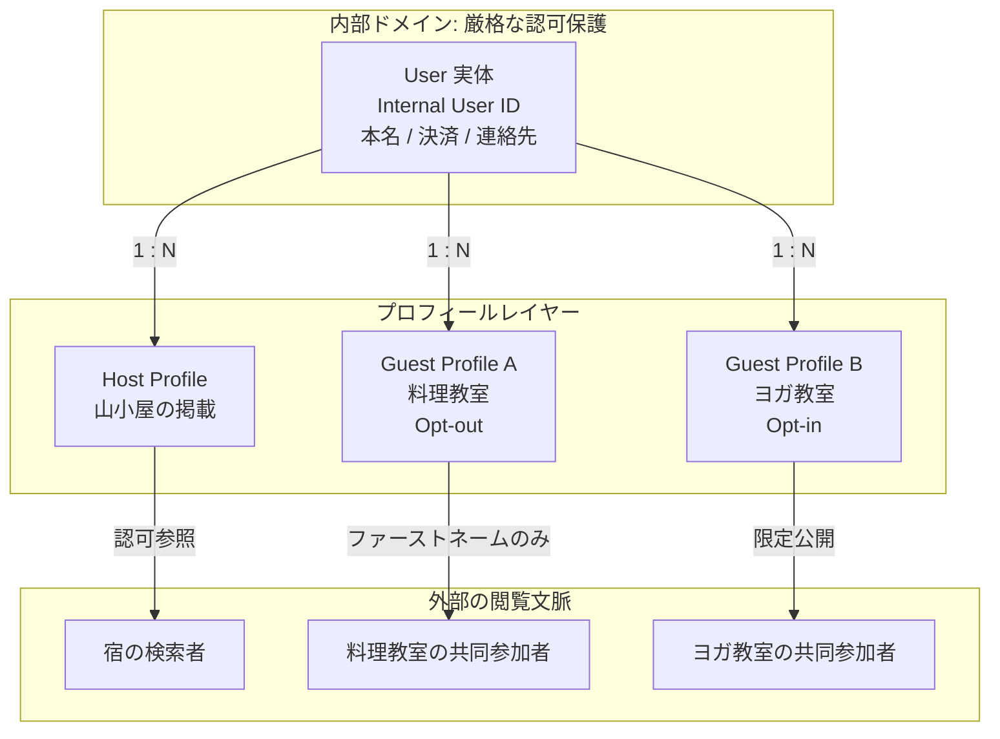

## この記事の対象と得られるもの

Airbnb Engineering が 2026 年 4 月に公開した記事「Privacy-first connections: Empowering social experiences at Airbnb」を題材に、**「ユーザーの同一性」と「ユーザーの見え方」を別々の識別子として設計する**考え方を整理します。

想定読者は、次のような判断を持つ人です。

- API レスポンスに何を出すかを決める、Web / アプリのバックエンド設計者
- 顧客データのモデルを引き直すか判断する、プロダクト責任者や発注側の担当者
- 社内システムの認可基盤・データ基盤の刷新を検討している人

読み終えると、次の 3 つが手元に残ります。

1. 単一のユーザー ID を外部へ露出する設計が、どのような形でプライバシー上の欠陥になるか
2. Airbnb が採った「User 1 : N Profile」構造と、それを支える認可レイヤーの役割分担
3. 既存の巨大なコードベースから ID 露出を剥がすときの現実的な進め方と、その限界


*この記事の全体像。以下、順に解説します。*

## なぜ「ユーザーIDをそのまま出す」設計が問題になるのか

多くのシステムでは、DB のプライマリキーである `user_id` が、そのまま API レスポンスに乗り、フロントエンドの DOM や URL に現れます。ID は「一意に特定するためのキー」として設計されているので、素直に使えばそうなります。

この設計は、機能が単純なうちは問題になりません。破綻するのは、**同じユーザーが複数の文脈に登場するようになったとき**です。

Airbnb の場合、次のような状況が同時に成立します。

| 文脈 | ユーザーの立場 | 見せたい情報 |
| --- | --- | --- |
| 宿の掲載 | ホスト | 掲載物件、ホストとしての実績 |
| 料理教室への参加 | ゲスト | 参加者に見せたくない場合もある |
| ヨガ教室への参加 | ゲスト | 写真や自己紹介を出して交流したい |

ここで 3 つの文脈すべてに同じ `user_id` が現れると、第三者はその ID をキーに文脈をまたいで名寄せできます。「このヨガ教室に来ていた人は、スイスに山小屋を持っているホストだ」という結び付けが、誰にでも復元できてしまう。これが**横断追跡（cross-context tracking）**です。

重要なのは、これが「情報を出しすぎている」問題ではない点です。各文脈で出している情報自体は適切でも、**共通のキーが存在するというだけで**リンクが成立します。つまり、表示項目を絞る対策では解けません。

## Airbnbの答え - 実体と表現を別の識別子に分ける

Airbnb は、内部的なユーザー実体と、公開文脈ごとの表現を厳格に分離しました。

- **User ID（内部実体）** — アカウント情報、決済データ、電話番号、メールアドレスを束ねる、単一かつ永続的な内部識別子。厳格なアクセス制御下に置かれ、外部 API や他ユーザーへ直接露出しない。
- **Profile ID（コンテキスト表現）** — ホスト、ゲスト、個別の体験といった利用文脈ごとに発行される仮名的な識別子。「その文脈でどう見えるか」だけを担う。

1 人の User に対して N 個の Profile が紐付く 1 : N 構造です。そして、異なる文脈の Profile ID からは、それが同一人物であることを外部から突合できません。これを**非リンク性（non-linkability）**と呼びます。



図の要点は、**縦のリンクは内部にしか存在しない**ことです。V1・V2・V3 の側から上へ辿る経路がないため、外部の観測者にとって 3 つの Profile は無関係な 3 人に見えます。

### ID観の転換

この設計は、ID に対する見方そのものを変えています。

| | 従来のID観 | プライバシーファーストのID観 |
| --- | --- | --- |
| 主目的 | 一意に特定する | 公開範囲とリンク可能性を制御する |
| 評価軸 | 重複しないこと | 誰に・どの範囲でリンクさせるか |
| 位置付け | エンティティのキー | 認可境界のプロキシ |

「同じ人であることの証明」と「同じ姿で見えること」は、本来まったく別の要求です。前者は認証・同一性の問題、後者は露出範囲の問題。単一 ID の設計は、この 2 つを 1 つの識別子に押し込めていたことになります。

## 文脈ごとに露出をユーザーが選べる

Profile を分けただけでは、静的な分離にとどまります。Airbnb はさらに、体験（Experience）単位でユーザー自身が露出を選べるようにしました。

- ゲストは体験を予約するとき、自分のプロフィールを他の参加者（co-guests）へ公開するかを選べる
- 非公開（Opt-out）を選ぶと、他の参加者にはファーストネームのみが表示される。プロフィール写真、詳細情報、過去の統計は見えない
- 公開（Opt-in）を選んでも、その露出はその体験に関する文脈内に閉じる

つまり、公開を選んだからといって全文脈で同じ顔になるわけではありません。**露出の粒度が「アカウント単位」から「体験単位」へ落ちている**ことが、この設計の実質的な効き目です。

## 表示ではなくデータレイヤーで強制する

ここが設計上もっとも重要な判断だと考えます。

露出制御を UI レイヤーの表示切り替えで実装すると、API を直接叩かれた時点で無力になります。Airbnb は、社内の認可エンジン **Himeji** を使い、アクセス制御をデータレイヤーで強制しています。

Himeji は Airbnb が以前から公開している集中型認可システムで、今回のプロフィール分離でも判定の中心に置かれています。設計上の工夫として、**書き込み時の非正規化（configurable relation denormalization at write time）**が挙げられています。

- プロフィール更新時や認可条件の変更時に、権限関係をあらかじめ計算して展開しておく
- 読み込み時は展開済みの関係を参照するだけで済むため、認可判定を低レイテンシで返せる

読み取りが圧倒的に多いソーシャル機能では、判定コストを書き込み側へ寄せる判断は合理的です。ただしこれは無料ではなく、後述するトレードオフを生みます。

## 既存の巨大コードベースから ID 露出を剥がす

新規開発なら最初から分ければ済みます。難しいのは、すでに動いている巨大なプロダクトから `user_id` の直接露出を排除する場合です。Airbnb は 5 段階のプロセスを踏んだと説明しています。

1. **自動監査（automated auditing）** — Python スクリプトでコードベース全体をスキャンし、ユーザーデータへのアクセス箇所を機械的に抽出する
2. **所有チームのマッピング** — ディレクトリ構造をもとに、抽出箇所をコード所有チームへ自動で割り当てる
3. **人手レビュー** — 各箇所が内部専用の処理か、外部露出を伴う処理かを、開発者が文脈で判定する
4. **AI によるリファクタリング支援** — AI ツールの変換提案を活用しつつ、エンジニアが手動で検証して適用する
5. **型安全性の強制** — 静的型付けとリンターで、`User ID` と `Profile ID` の取り違えを機械的に防ぐ

この順序には意味があります。**機械で網羅し、人間で判断し、機械で再発を止める**という三層構造です。ステップ 3 の人手レビューを省くと「内部処理なのに Profile ID を渡してしまう」逆方向の事故が起き、ステップ 5 を省くと同じ混入がその後も続きます。

### 型で取り違えを検知する

ステップ 5 の具体像を補足します。ID を素の文字列として扱うと、コンパイラは何も守ってくれません。

```ts
// 危険: どちらも string なので取り違えても通ってしまう
type UserId = string;
type ProfileId = string;

function renderPublicCard(id: ProfileId) { /* ... */ }

const userId: UserId = "u_1001";
renderPublicCard(userId); // 型エラーにならない
```

branded types（nominal typing のエミュレーション）を使うと、代入の時点で止まります。

```ts
// 安全: ブランドが異なるため相互代入できない
type UserId = string & { readonly __brand: "UserId" };
type ProfileId = string & { readonly __brand: "ProfileId" };

function renderPublicCard(id: ProfileId) { /* ... */ }

declare const userId: UserId;
renderPublicCard(userId);
// error: Type 'UserId' is not assignable to parameter of type 'ProfileId'.
```

TypeScript に限った話ではありません。Go なら `type UserID string` / `type ProfileID string` の定義型、Rust なら newtype パターン（`struct UserId(String);`）で同じ効果が得られます。いずれも実行時のコストはゼロで、静的検査だけが増えます。

なお、このコード例は「型システムで名前空間を分ける」という一般的な手法の説明であり、Airbnb の実装コードそのものではありません。元記事では「strong typing とリンターで混同を防いだ」とだけ述べられています。

## トレードオフと、この設計が守らないもの

導入判断のために、コストと限界を明示しておきます。

### 複雑性の増加

単一 ID ですべてを処理するリレーショナルモデルと比べ、User と Profile のマッピング層が挟まります。DB のインデックス設計、キャッシュのキー設計、結合クエリのいずれも複雑になります。「ユーザー単位で集計したい」という素朴な要求が、常にマッピングを経由する形になります。

### 書き込み時非正規化による結果整合性

Himeji が書き込み時に権限関係を展開する以上、プロフィールを変更してから各文脈の表示へ反映されるまでに、わずかな伝播遅延が生じます。読み取りレイテンシと引き換えに、**即時反映を諦めている**構造です。「設定を変えたのに、まだ古い表示が見える」という挙動は仕様として説明できる必要があります。

### マッピングテーブルという単一障害点

これが最も本質的な限界です。アプリケーション層や表示層で Profile ID を分離しても、DB のどこかには `User ID ↔ Profile ID` のマッピングが必ず存在します。内部不正や権限昇格でこのテーブルが漏れれば、**全ユーザーの全文脈の紐付けが一括で復元されます**。

つまりこの設計が守っているのは、あくまで「外部の観測者に対する非リンク性」です。内部からの再リンクは守っていません。対策としては、次が最低限必要になります。

- マッピングテーブルへのアクセス権限を最小化する（least privilege）
- アプリケーションコードから認可エンジン経由以外でマッピングを逆引きできないようにする
- マッピングへのアクセスを監査ログの対象にする

「Profile ID を導入したからプライバシーは守られた」と考えるのは危険です。守られる範囲を明示して初めて設計として成立します。

## 元記事で明示されていない論点

判断材料として、公開情報からは読み取れなかった点も挙げておきます。自分の設計に持ち込むなら、ここは自前で決める必要があります。

1. **Profile ID のライフサイクル** — 体験の終了後、その体験専用の Guest Profile ID は永続保持されるのか、一定期間後に削除・匿名化されるエフェメラルな ID なのか
2. **アカウント統合時の扱い** — 同一人物が誤って 2 つの User ID を作った場合、Profile ID をどう引き継ぎ、認可の競合をどう解決するか
3. **分析基盤との接続** — 外部表示では追跡を遮断する一方、社内の統計・機械学習・レコメンドへデータを渡す際、どの ID へ変換するか。差分プライバシーや k-匿名化をどこに挟むか

3 番目は特に、多くのプロダクトで先に問題になります。「外向きには分離したが、データ基盤では `user_id` で全部つながっている」状態は珍しくありません。

## 自分のプロダクトに持ち込むときの判断基準

すべてのサービスがこの構造を必要とするわけではありません。次の問いに 1 つでも当てはまるなら、検討する価値があります。

| 問い | 当てはまる場合の意味 |
| --- | --- |
| 同じユーザーが複数の役割（出品者と購入者など）で登場するか | 役割をまたいだ名寄せが成立する |
| ユーザー同士が互いを閲覧できる面があるか | 第三者による横断追跡の経路がある |
| 文脈ごとに見せたい情報が異なるか | 単一プロフィールでは要求を満たせない |
| API レスポンスや URL に DB の主キーが現れているか | すでに露出しており、後から剥がすコストが増え続けている |

逆に、ユーザー同士が互いを見ることのない業務システムでは、優先度は下がります。判断すべきは「プライバシー対応をするか」ではなく、**「他ユーザーから見える面が存在するか」**です。

最小の一歩としては、フル実装を待たずに次から始められます。

- API レスポンスに DB 主キーを出すのをやめ、外部公開用の識別子を 1 つ挟む
- ID を素の文字列型で扱うのをやめ、型で内部用・外部用を区別する
- 露出制御を UI ではなく、データを返す層の判定に移す

この 3 つだけでも、あとから Profile レイヤーを足すときの改修範囲が大きく変わります。

## まとめ

- 単一のユーザー ID を外部へ露出する設計は、共通キーの存在そのものが横断追跡を成立させる。表示項目を絞る対策では解けない
- Airbnb は内部実体の `User ID` と文脈別表現の `Profile ID` を 1 : N で分離し、外部からの非リンク性を担保した
- 露出制御は UI ではなく、認可エンジン Himeji によりデータレイヤーで強制される。書き込み時の非正規化で読み取りを高速化する代わりに、結果整合性を受け入れている
- 既存コードベースからの剥がし方は「機械で網羅 → 人間で判断 → 型で再発防止」の三層。どれを省いても事故が残る
- この設計が守るのは外部観測者に対する非リンク性であり、マッピングテーブルからの内部再リンクは守らない。範囲を明示して初めて設計として成立する
- ID 設計の主目的は「一意性の確保」から「リンク可能性の制御」へ移っている

この記事が少しでも参考になった、あるいは改善点などがあれば、ぜひリアクションやコメント、SNSでのシェアをいただけると励みになります！

## 参考リンク

- Airbnb Engineering: [Privacy-first connections: Empowering social experiences at Airbnb](https://airbnb.tech/data/privacy-first-connections-empowering-social-experiences-at-airbnb/)（2026 年 4 月公開）
- Airbnb Engineering: [Himeji: A Scalable Centralized System for Authorization at Airbnb](https://medium.com/airbnb-engineering/himeji-a-scalable-centralized-system-for-authorization-at-airbnb-341664924574)
- Airbnb Newsroom: [Introducing Social Features for Airbnb Experiences](https://news.airbnb.com/introducing-social-features-for-airbnb-experiences/)
