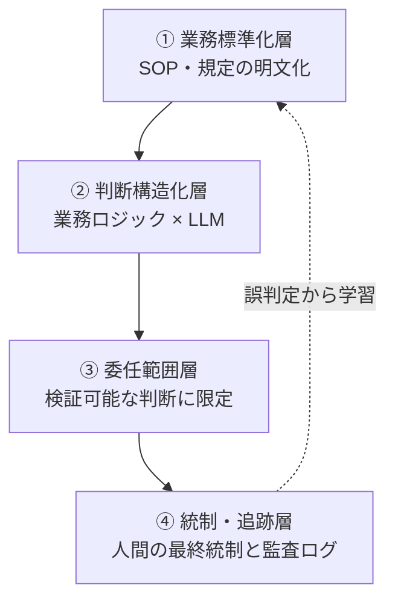

## 概要

味の素フィナンシャル・ソリューションズ（AFS）が、経費精算の経理承認業務をAIエージェントに委任し、2026年2月に本番稼働させました。AFSは味の素の完全子会社で、味の素グループの国内財務経理を集約するシェアードサービス会社です。開発は経理特化AIベンダーのファーストアカウンティングと共同で進めました。

このAIエージェントは、申請者のシステムへのログインから、申請データと領収書の取得・分析、勘定科目の判定、そして承認・差し戻しの判断までを自律的に行います。月1万件規模・1件あたり約5分の承認判断を代替し、年間約1万時間の削減を見込みます（発表は2026年4月24日）。

この事例の本質は「賢いLLMを入れたら承認が自動化できた」という話ではありません。公式が公表した検証では、領収書必須項目・インボイス制度準拠・税務上の交際費判定の3項目で、経理AIエージェントの正答率は93.3%、汎用LLM単体は53.3%と、40ポイントの差がつきました。差を生んだのは、モデルの賢さではなく、経理・財務の業務ロジック（規定と手続き）をLLMに組み合わせた点です。つまり「間違いが許されない業務」を委任できたのは、業務が標準化され、判断基準が構造化され、検証できる範囲に絞られていたからです。

この記事では、この事例を自社で再現するための前提条件として一般化します。想定読者は、高リスクな定型業務をAIに委任しようとしている実装エンジニア・業務設計者・経理/管理部門の方です。結論を先取りすると、勝負は導入するAIの性能ではなく、AIを入れる前にどれだけ業務を標準化・構造化し、人間の最終統制と監査の痕跡を設計しておけるかにあります。

## 特徴

味の素事例から取り出せる、再現可能な設計上の特徴は4つあります。

### 検証可能な判断に限定した委任

AIに任せたのは経費精算の経理承認という、規定が明文化され正誤を機械的に検証しやすい領域です。公式が精度を公表した3項目は、いずれも「規定に照らして合っているか」を後から検証できる判断です。

| 検証項目 | 内容 |
|---|---|
| 領収書必須項目の確認 | 領収書に必要な記載項目の充足チェック |
| インボイス制度への準拠チェック | 適格請求書の要件適合の判定 |
| 税務上の交際費判定 | 勘定科目としての交際費該当性の判断 |

倫理的判断や新規ポリシーの策定のような、正解を定義しにくい領域には踏み込んでいません。「正解を定義でき、後から検証できる判断」に委任範囲を絞ることが、高リスク業務でも委任を成立させる第一条件です。

### 業務ロジックとLLMのハイブリッド

93.3%対53.3%という40ポイント差は、本事例の最も重要な定量メッセージです。汎用LLMをそのまま経費承認に使うと、正答率は5割程度しか出ません。経理・財務の手続き（どの項目を、どの規定に照らして、どう判定するか）を構造化してLLMに組み合わせることで、初めて実務に耐える水準に届きます。

これは一般的な設計パターンとも一致します。高確度で機械的に処理できる部分は決定論的に、文脈依存の判断はLLMの推論で、確信が持てないものは人間に、という3層の使い分けです。RPAは「ルールは固定だが文脈を読めない」ために1件の例外で止まります。一方でLLMエージェントは文脈（申請目的・部門・規定）を評価できます。ただし、評価できることと正しく判定できることは別であり、業務ロジックの構造化が精度を底上げします。

### 標準化された業務ほど委任しやすい

味の素グループは経理BPO・シェアードサービスとして業務標準化を積み上げてきた背景があり、ITmediaはこれを「30年以上続く業務標準化」と表現しています（ただし「30年」の具体的内訳は一次情報では確認できていません）。

標準化が効く理由は2つあります。1つは、AIが参照すべきルールセットが明文化されているからです。もう1つは、例外ケースが減ってAIの判断精度が安定するからです。逆に言えば、規定がベテランの暗黙知に埋もれている組織では、AIに渡すべき判断基準がそもそも存在せず、委任以前に標準化からやり直す必要があります。「標準化なくしてAI化なし」が、本事例が逆説的に示す核心です。

### 効果はトップラインの効率化で語られる

月1万件・1件約5分の承認判断をAIが代替し、年間約1万時間の削減を見込みます。ITmediaは見出しで「工数76%削減」と打ち出しています。ただし、76%が何を分母にした削減率か、本文では定義・算出基準が明示されていません（全経費精算が対象か一部か、期待値か実績かも記事からは判別できません）。導入効果を語るときは、この種の削減率を鵜呑みにせず「何の工数を、何を基準に」測ったかを確認する姿勢が必要です。

## 概念構造

高リスク業務をAIエージェントに委任するための前提条件は、4層の階層として整理できます。下の層が崩れていると、上の層をいくら作り込んでも委任は成立しません。

各層の役割は次のとおりです。

| 層 | 役割 |
|---|---|
| ① 業務標準化層 | 判断の前提となる規定・手続きの明文化。例外の最小化 |
| ② 判断構造化層 | 規定をAIが判定に使える形に構造化。LLM単体との差を生む |
| ③ 委任範囲層 | 検証可能で正解を定義できる判断のみをAIに委ねる線引き |
| ④ 統制・追跡層 | 人間の最終承認・監査ログ・例外エスカレーションの設計 |

### 業務標準化層が委任の土台

判断の前提となる規定・手続きが明文化されていることが土台です。標準化はAIが参照するルールセットを供給すると同時に、例外ケースを減らして精度を安定させます。味の素が先陣を切れたのは、この土台を長年かけて整備していたからだと読めます。

### 判断構造化層がLLM単体との差を生む

明文化された規定を、AIが判定に使える形（どの項目を・どの条件で・どう判定するか）に構造化する層です。味の素事例の40ポイント差が生まれたのはここです。この層を作らずに汎用LLMをそのまま当てると、高リスク業務には精度が足りません。

### 委任範囲層がどこまで任せるかを決める

検証可能で正解を定義できる判断のみをAIに委ね、文脈の重い判断は推論で補助し、確信が持てないケースと例外は人間に残します。「何をAIに任せ、何を人間に残すか」の線引きそのものが設計の中心であり、競争力の源泉になります。

### 統制・追跡層が任せきりを防ぐ

ここが本事例の公開情報で最も薄く、論点が集中する層です。承認業務をAIに委ねると、内部統制上の論点が立ち上がります。

| 論点 | 内容 |
|---|---|
| 職務分掌 | 「判定」と「実行」がAIに一体化すると、本来分けるべき承認と実行の分掌が崩れるおそれ |
| 説明責任 | 差し戻し理由を提示できても、判断の根拠（モデル内部の重み付け）は不可視で、監査・訴訟で説明しづらい |
| 標準化の経年劣化 | 完全標準化でも実務例外は一定割合残り、税制改正・新会計基準で規定は陳腐化する |

これらは「だから委任は不可能」という話ではありません。人間の最終承認をどこに残すか、監査ログに何を記録するか、規定をどう更新し続けるかを設計しておけ、という条件です。

監査ログには、後から判断を再現できるよう、最低限つぎの項目を残します。

| 項目 | 記録内容 |
|---|---|
| Who | 判定したエージェントと、承認権限を委譲した人間 |
| When | 判定時刻 |
| What | 判定対象（領収書ID・金額・勘定科目など） |
| Why | 参照した規定と、チェックした項目 |
| Result | 承認・差し戻し・エスカレーションの結果 |

味の素事例の公開情報には、この統制層の具体（誤承認の補正フローや監査ログの設計など）がほとんど開示されておらず、再現を目指す側はここを自前で設計する必要があります。

## 自社で再現するためのチェックリスト

| 観点 | 問い | 味の素事例での対応（確認できた範囲） |
|---|---|---|
| 標準化 | 判断基準は明文化されているか。暗黙知に依存していないか | グループ経理を集約し標準化を継続 |
| 構造化 | 規定をAIが判定に使える形に落とせるか | 業務ロジック × LLMで93.3%（LLM単体53.3%） |
| 委任範囲 | 正解を定義でき検証できる判断に絞れているか | 領収書必須項目・インボイス準拠・交際費判定の3項目で検証 |
| 効果測定 | 削減率の分母・基準値を説明できるか | 月1万件×5分→年約1万時間。「76%」の定義は記事に明示なし |
| 統制 | 人間の最終承認・監査ログ・例外エスカレーションを設計したか | 公開情報では詳細不明 |

## 反証と未解決の問い

本事例を「高リスク承認業務もAIに委任できる好例」と読むことに対し、温存しておくべき反証があります。

- 検証可能性の限界。記事はベンダーとの共同発表に基づく成功事例であり、「76%削減」の基準値や、誤承認時の対応が独立に検証できません。効果数値は前提を確認したうえで受け取る必要があります。
- 失敗事例の不在は「安全」を意味しない。会計領域のAI導入失敗・誤承認による監査指摘・J-SOX違反の先例は、公開情報ではほぼ検出できませんでした。これは企業秘匿と規制見解の未成立による情報ギャップであり、「リスクが無い」証拠ではありません。
- LLM固有のリスク。自己検証の弱さ（実行していない判定を「完了」と報告しうる）、グレーゾーン判定のブレ、申請文への悪意ある指示の混入など、本事例に固有でないリスクは残ります。委任範囲を検証可能な判断に絞り、人間の最終統制を残すことが、これらへの一次防御になります。

未解決のまま残る主要な問いは3点です。

1. 「76%」の正確な定義・基準値
2. 誤承認の補正フローと人間最終承認の置き場所
3. 標準化規定を税制改正に追従させ続ける運用

これらは公式の続報・導入事例詳細が出た時点で再検証します。

## 推奨

高リスクな定型業務をAIエージェントに委任しようとする組織への推奨は明快です。AIの性能比較から入りません。まず自社の対象業務が次の4層を満たすかを点検します。

1. 標準化されているか
2. 判断基準をAIが使える形に構造化できるか
3. 正解を定義でき検証できる範囲に絞れるか
4. 人間の最終統制と監査ログを設計できるか

下層が崩れていれば、導入すべきはAIではなく業務標準化です。味の素事例の本質的な教訓は「30年の標準化という資産があったからAIを載せられた」点にあります。AI導入プロジェクトの大半は、実はAI以前のAs-Is整備プロジェクトです。

## まとめ

味の素の経理AIエージェントは、間違いが許されない承認業務でも、業務標準化・判断の構造化・検証可能な範囲への限定・人間の最終統制という4層が揃えば委任できることを示しました。再現の鍵はAIの性能ではなく、AIを入れる前のAs-Is整備にあります。

この記事が少しでも参考になった、あるいは改善点などがあれば、ぜひリアクションやコメント、SNSでのシェアをいただけると励みになります！

## 参考リンク

- 公式ドキュメント・プレスリリース
  - [味の素フィナンシャル・ソリューションズとファーストアカウンティング、共同開発した経理AIエージェントが本番稼働（ファーストアカウンティング公式）](https://www.fastaccounting.jp/news/20260424/15929/)
  - [同プレスリリース（PR TIMES）](https://prtimes.jp/main/html/rd/p/000000199.000061842.html)
- 記事
  - [工数「76％」削減 味の素グループが「経理AIエージェント」導入で先陣を切れたワケ（ITmedia ビジネスオンライン）](https://www.itmedia.co.jp/business/articles/2606/19/news033.html)
  - [味の素グループの経理会社、経費承認をAIで判定、年1万時間削減へ（IT Leaders）](https://it.impress.co.jp/articles/-/29284)
  - [味の素グループ、経費精算の確認業務にAIエージェントを導入 年間1万時間の削減を見込む（EnterpriseZine）](https://enterprisezine.jp/news/detail/24189)
  - [味の素グループの「経理AIエージェント」の衝撃（Biz/Zine）](https://bizzine.jp/article/detail/12976)
  - [日本企業におけるシェアードサービスセンターの独自進化（EY Japan）](https://www.ey.com/ja_jp/insights/growth/the-unique-evolution-of-shared-services-in-japan)
  - [Why 'human in the loop' alone is not a governance strategy（IBM）](https://www.ibm.com/think/insights/liability-laundering-problem-human-in-the-loop-not-governance-strategy)
