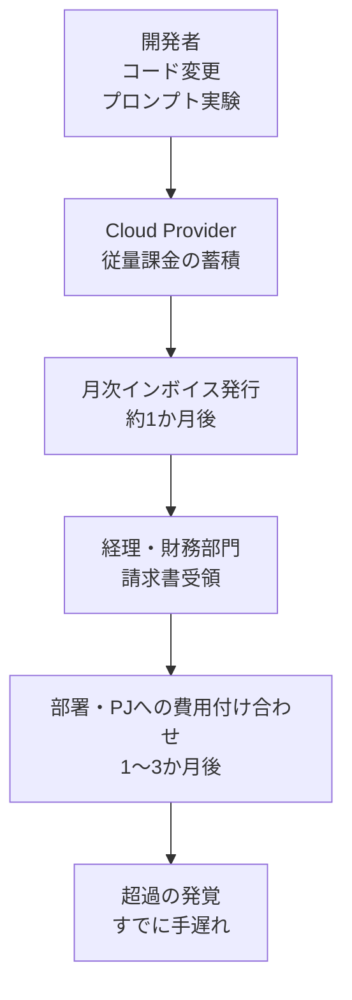
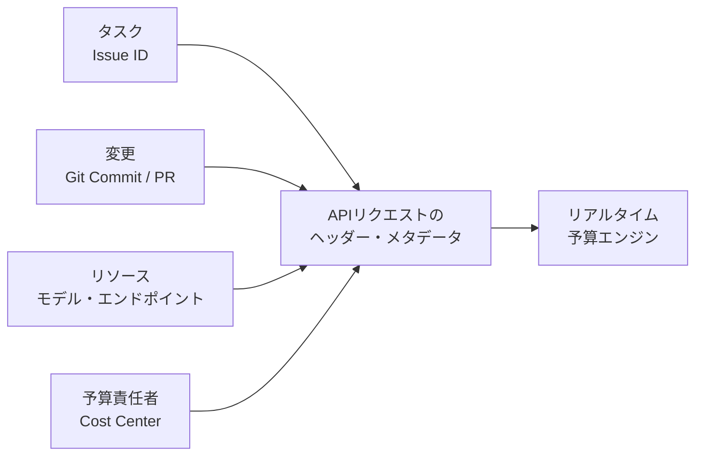

## この記事の対象と得られるもの

Financial Times は 2026年7月30日、Amazon 社内の複数チームで AI 活用プロジェクトが予算を大幅に超過し、最大のケースでは超過が5か月間検知されないまま放置されたと報じました。

この記事では、その報道内容を起点に次を整理します。

- 生成 AI の利用で **なぜ従来の監視が効かなくなるのか** の構造
- 検知が数か月遅れる **組織側のギャップ**
- 自分たちの環境で今日から入れられる **統制の具体案**

対象読者は、AI を業務に組み込む判断をする立場の方、およびその基盤を設計・運用する立場の方です。単一報道に基づく事例のため、金額や期間は「報道された値」として扱い、記事の主眼は **再発防止の設計** に置きます。

## 何が起きたのか

FT 報道および関連報道で挙げられた主なケースは次の3件です。

| プロジェクト | 用途 | 報道された超過額 | 検知までの期間 |
|---|---|---|---|
| 著者・製品マッチング | EC の著者情報と商品リスティングの自動突合 | 約 180万ドル (当初予算比 860% 超過) | 約5か月 |
| 財務監査ツール | 社内の財務・会計監査プロセスの自動化 | 約 54.1万ドル | 報道なし |
| 物流ネットワーク最適化 | 配送スピードとルートの最適化 | 約 13.4万ドル | 2週間以上 |

最大ケースの著者・製品マッチングは、Amazon Bedrock 経由の Anthropic Claude 3.5 Sonnet を用いた処理でした。注目すべきは、**このシステムが正式リリースされないまま廃棄された**点です。価値を生んでいないコードが背後で回り続け、課金だけが積み上がりました。

Amazon の広報は、報道された事例は社内の一部チームに関するものであり全社像を示すものではないとしたうえで、「実験し、学び、改善する」姿勢と、異常課金を早期に検知して自動遮断する「自動化されたガードレール」の導入を進めていると説明しています。

### 金額の大きさをどう受け止めるか

Amazon の 2026年の設備投資見込みは最大2,000億ドル規模とされます。この分母に対して数百万ドルの超過は財務インパクトとして極小です。先端領域で未ローンチに終わる実験が一定割合出ること自体も、想定内のコストと言えます。

それでも本件が問題視されたのは、金額の絶対値ではなく次の2点です。

- **860% という超過率** — 予算という基準がまったく機能していない
- **5か月という検知遅延** — 開発・PM・財務の誰も気づけない構造になっている

小規模な実験段階でこの穴が露呈したという事実が、全社スケールで AI 利用を広げたときのリスクとして受け取られました。判断としては「今回いくら損したか」ではなく、「同じ穴のまま10倍の規模に広げてよいか」を問う話です。

## なぜ従来の監視をすり抜けるのか

生成 AI を組み込むと、バグの「出力先」がインフラ資源から金銭に変わります。ここが従来のソフトウェア開発との決定的な差です。

| 観点 | 従来のソフトウェア開発 | 生成 AI を組み込んだ開発 |
|---|---|---|
| バグ・無限ループの主な影響 | CPU/メモリ占有、遅延、サービスダウン | 外部 API 呼び出しの暴走、トークン消費の急増 |
| コストへの波及 | 小さい (固定枠や自社サーバー内で吸収) | 大きい (従量課金がそのまま金額に直結) |
| 異常の見え方 | エラー、タイムアウト、CPU 使用率の張り付き | **200 OK のまま課金メーターだけが回る** |
| 既存の監視での検知 | CPU/メモリ/死活監視で捕捉できる | 死活監視は正常のため素通りする |

要点は3行目です。暴走している最中も、システムは仕様どおり正常に応答します。エラー率もレイテンシも悪化しません。**異常が「エラー」の形をとらない**ため、4xx/5xx ベースのアラートは一切鳴りません。

この性質のため、検知は「システムの健全性」ではなく「消費ペース」を直接見るしかありません。

## 検知が数か月遅れる構造

技術的にすり抜けるだけなら、請求を見た時点で気づけるはずです。それが5か月かかるのは、組織側にも遅延要因が重なるからです。

この経路には、遅延を生む要因が3つ埋まっています。

1. **月次バッチへの依存** — コスト集計が月次・週次のダッシュボード前提だと、異常値が画面に出る頃には数週間から数か月が経過している
2. **所有権の希薄化** — 全社共通の API キーや共有アカウントを使っていると、「どのチームの、どのタスクの、どのコード変更による課金か」を即座に特定できない
3. **責任の分断** — 開発者は機能検証に集中し、PM は請求書が来るまで金額を知らず、財務は技術的文脈がないため数字の異常を判断できない

さらに実務でよく効くのが **ゾンビプロセス** です。検証用に立てた自動化スクリプトや cron ジョブが、プロジェクト中断後も止められずに動き続けます。プロジェクトが終わっていることと、そのプロジェクトが起動したものが止まっていることは、別の話です。

## 統制の設計指針

対策として真っ先に思い浮かぶのは請求アラートですが、「月額100ドルに達したら通知」のような静的な上限だけでは足りません。到達した時点で損失は確定しており、閾値を高く置けば検知が遅れ、低く置けば開発の柔軟性を削ります。

必要なのは、**原因と所有者をリアルタイムに追跡できる状態** をつくることです。

### 1. 課金に文脈を紐づける

課金イベントの発生時点で、次の4つが結びついている状態を目指します。

実装としては、プロキシまたは SDK ラッパの層で `X-Project-ID` / `X-Task-ID` / `X-Git-Commit` / `X-Developer-ID` 相当のメタデータを強制的に付与し、**無記名のリクエストはゲートウェイで拒否** します。「誰の課金か分からないリクエストを通さない」ことが、事後の付け合わせ作業をまるごと消します。

AWS であれば、コスト配分タグとアプリケーション推論プロファイルを組み合わせて、Bedrock の利用をチーム・プロジェクト単位に切り分ける方法が公式に案内されています。まずは既存のタグ付けが実際に効いているかの確認から始めるのが現実的です。

### 2. ジョブ単位のハードキャップ

単一のスクリプト実行やバッチ処理に対して、上限を「金額」または「トークン数」で置きます。

- 1ジョブあたりの最大消費トークン数
- 1ジョブあたりの最大許容コスト
- 最大リトライ回数

ポイントは、月次でも日次でもなく **ジョブ単位** に置くことです。無限ループは1本のジョブの中で起きるため、日次上限だけでは1日分を丸ごと失います。

### 3. 開発リソースに TTL を設ける

本件から取り出せる最も再現性の高い教訓がこれです。実験用に発行した API キー、検証用コンテナ、一時的な cron ジョブに **有効期限を設定し、明示的に延長しない限り自動失効させます**。

「使い終わったら消す」という運用は必ず漏れます。逆にして、「生かし続けたいなら明示的に延長する」ようにすると、放置がそのまま停止につながります。

### 4. 消費ペースの異常検知

金額の絶対値ではなく、**単位時間あたりの消費ペース** を見ます。直近15分の消費速度が過去の移動平均から大きく跳ねたら、サーキットブレーカーで遮断し通知します。

静的閾値との違いは、まだ損失が小さいうちに止まることです。「累計100ドル」で止めるのではなく、「普段の10倍の速度で回っている」ことをもって止めます。

### 5. モデル階層の強制

高価なフラッグシップモデルの利用権限を制限し、テスト・スクレイピング・簡易処理には軽量モデルを既定にします。検証段階で無自覚に最上位モデルを叩き続ける構図を、権限側で潰します。

なお、モデル階層は単価を下げるだけで暴走そのものは止めません。1〜4 と組み合わせて初めて意味を持ちます。

## 何から着手するか

5つ全部を一度に入れる必要はありません。検知遅延に効く順で並べると次のようになります。

| 優先度 | 施策 | 効果 |
|---|---|---|
| 高 | 消費ペースの異常検知 | 損失が小さいうちに止まる |
| 高 | ジョブ単位のハードキャップ | 1回の事故の上限が決まる |
| 中 | 開発リソースの TTL | ゾンビプロセスが構造的に消える |
| 中 | 課金への文脈紐づけ | 原因特定が数か月から数分になる |
| 低 | モデル階層の強制 | 単価が下がる |

最初の一手は、**自分たちの環境で今この瞬間に「誰がいくら使っているか」を何分で答えられるか** を測ることです。答えが「月末の請求を見ないと分からない」なら、それが本件と同じ構造です。

## まとめ

- FT 報道によれば、Amazon 社内の AI プロジェクトで最大約180万ドル・予算比860%の超過が約5か月間検知されなかった
- 生成 AI の暴走課金は **200 OK のまま進行する** ため、エラー率や死活監視では捕捉できない
- 検知遅延の主因は技術ではなく、月次バッチ依存・所有権の希薄化・責任の分断という組織構造にある
- 対策は静的な請求アラートではなく、**ジョブ単位のハードキャップ・TTL・消費ペースの異常検知** を組み合わせたリアルタイム統制に置く
- 金額の絶対値ではなく、「同じ穴を残したまま規模を10倍にしてよいか」を判断基準にする

この記事が少しでも参考になった、あるいは改善点などがあれば、ぜひリアクションやコメント、SNSでのシェアをいただけると励みになります！

## 参考リンク

- [Financial Times: Amazon's runaway AI costs (2026年7月30日)](https://www.ft.com/content/77baac40-d803-4084-94f3-a133653072cf)
- Unite.AI ほか業界メディアによる関連報道 (2026年7月)
- Financial Times 報道に対する Amazon 広報コメント (2026年7月)
